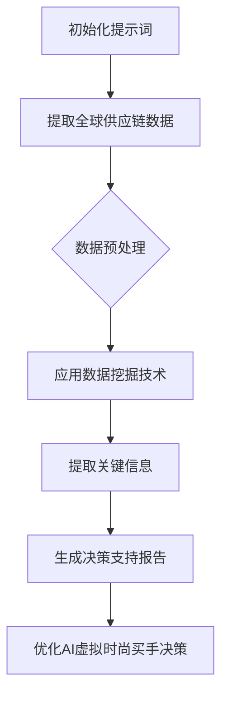

                 

# 优化AI虚拟时尚买手决策：全球供应链分析的提示词策略

## 关键词：AI虚拟时尚买手、全球供应链分析、提示词策略、数据挖掘、机器学习

> 摘要：本文旨在探讨如何利用全球供应链分析的提示词策略来优化AI虚拟时尚买手决策。通过分析全球供应链数据，提取关键信息，为AI虚拟时尚买手提供精准的决策支持，从而提升其决策准确性和效率。

----------------------------------------------------------------

## 第一部分：引言

### 第1章：引言

#### 1.1 问题背景

随着虚拟时尚市场的快速发展，AI虚拟时尚买手在全球供应链中的角色愈发重要。他们需要处理和分析海量数据，包括时尚趋势预测、供应链管理、库存优化、销售预测等。如何有效利用全球供应链数据，为AI虚拟时尚买手提供精准的决策支持，成为当前研究的重点和难点。

#### 1.2 问题描述

AI虚拟时尚买手决策涉及海量数据的处理和分析，包括时尚趋势预测、供应链管理、库存优化、销售预测等多个方面。如何有效利用全球供应链数据，为AI虚拟时尚买手提供精准的决策支持，成为当前研究的重点和难点。

#### 1.3 问题解决

本文将介绍一种基于全球供应链分析的提示词策略，通过数据挖掘和机器学习技术，从海量供应链数据中提取关键信息，为AI虚拟时尚买手提供有针对性的决策支持。

#### 1.4 边界与外延

本文的研究主要关注于全球供应链分析在AI虚拟时尚买手决策中的应用。同时，本文的结论和建议也可以为其他领域的供应链管理提供参考和借鉴。

#### 1.5 概念结构与核心要素组成

- 全球供应链分析：指通过对全球供应链各环节的数据进行分析和处理，以获取供应链的运行状况、趋势和潜在问题。
- 提示词策略：指通过设定特定的关键词或短语，引导AI模型对相关数据进行挖掘和分析，以提高决策的准确性和效率。
- AI虚拟时尚买手决策：指利用人工智能技术，对虚拟时尚市场进行分析和处理，从而做出商品采购、库存管理、销售预测等决策。

#### 1.6 本章小结

本章简要介绍了本文的研究背景、问题描述、问题解决思路以及研究的边界与外延。为后续章节的深入探讨奠定了基础。

----------------------------------------------------------------

## 第二部分：全球供应链分析基础

### 第2章：全球供应链分析概述

#### 2.1 全球供应链的构成

- 供应链的定义：供应链是指从原材料采购到最终产品交付给消费者的全过程，包括供应商、制造商、分销商、零售商和消费者等各个环节。
- 全球供应链的特点：全球供应链涉及多个国家和地区的参与，具有复杂性、多样性、不确定性等特点。
- 全球供应链的参与者：全球供应链的参与者包括制造商、分销商、零售商、物流服务提供商、原材料供应商等。

#### 2.2 全球供应链分析的重要性

- 全球供应链分析的意义：全球供应链分析有助于企业了解供应链的运行状况，优化供应链管理，降低成本，提高竞争力。
- 全球供应链分析的优势：全球供应链分析可以为企业提供实时、准确的数据支持，帮助企业做出更加科学的决策。
- 全球供应链分析的应用领域：全球供应链分析可以应用于供应链设计、供应链优化、供应链风险管理等多个领域。

#### 2.3 全球供应链分析的方法

- 数据挖掘技术：数据挖掘技术可以从海量供应链数据中提取有价值的信息，为企业提供决策支持。
- 机器学习算法：机器学习算法可以基于历史数据，预测供应链的未来趋势，为企业提供预测性分析。
- 大数据分析技术：大数据分析技术可以处理海量数据，帮助企业发现数据中的规律和趋势。

#### 2.4 全球供应链分析的关键指标

- 供应链效率：供应链效率是指供应链各环节的运作效率，包括生产效率、物流效率等。
- 供应链稳定性：供应链稳定性是指供应链在面临不确定性因素时的抗风险能力。
- 供应链成本：供应链成本是指供应链各环节的运营成本，包括生产成本、物流成本等。
- 供应链响应速度：供应链响应速度是指供应链对市场需求变化的响应速度。

#### 2.5 本章小结

本章对全球供应链分析进行了概述，介绍了全球供应链的构成、重要性、方法以及关键指标。为后续章节的深入讨论提供了基础。

----------------------------------------------------------------

## 第三部分：提示词策略设计

### 第3章：提示词策略概述

#### 3.1 提示词策略的定义

- 提示词策略的定义：提示词策略是指通过设定特定的关键词或短语，引导AI模型对相关数据进行挖掘和分析，以提高决策的准确性和效率。
- 提示词策略的作用：提示词策略可以缩小AI模型的数据分析范围，提高模型的分析效率和决策准确性。

#### 3.2 提示词策略的类型

- 关键词提示词：关键词提示词是指通过设定与目标数据相关的关键词，引导AI模型对目标数据进行挖掘和分析。
- 句子级提示词：句子级提示词是指通过设定与目标数据相关的句子，引导AI模型对目标数据进行挖掘和分析。
- 文档级提示词：文档级提示词是指通过设定与目标数据相关的文档，引导AI模型对目标数据进行挖掘和分析。

#### 3.3 提示词策略的设计原则

- 相关性：提示词应与目标数据具有高度相关性，以提高模型的分析准确性。
- 精准性：提示词应精准地反映目标数据的特点，以提高模型的分析效率。
- 实用性：提示词应具有实用性，能够为AI虚拟时尚买手提供有效的决策支持。

#### 3.4 提示词策略的应用场景

- 供应链管理：提示词策略可以用于供应链数据的挖掘和分析，为企业提供供应链优化建议。
- 风险控制：提示词策略可以用于风险数据的挖掘和分析，为企业提供风险预警和管理建议。
- 财务分析：提示词策略可以用于财务数据的挖掘和分析，为企业提供财务状况分析和决策支持。

#### 3.5 本章小结

本章对提示词策略进行了概述，介绍了提示词策略的定义、类型、设计原则和应用场景。为后续章节的深入探讨提供了基础。

----------------------------------------------------------------

## 第四部分：AI虚拟时尚买手决策优化

### 第4章：AI虚拟时尚买手决策概述

#### 4.1 AI虚拟时尚买手的概念

- AI虚拟时尚买手的特点：AI虚拟时尚买手是利用人工智能技术，对虚拟时尚市场进行分析和决策的专业人员。他们具有数据敏感度强、决策速度快、准确性高等特点。
- AI虚拟时尚买手的工作内容：AI虚拟时尚买手的工作内容包括市场趋势分析、商品采购、库存管理、销售预测等。

#### 4.2 AI虚拟时尚买手决策的重要性

- AI虚拟时尚买手决策的意义：AI虚拟时尚买手决策对于企业的生存和发展至关重要。正确的决策可以带来更高的销售额和利润，错误的决策可能导致库存积压、资金链断裂等问题。
- AI虚拟时尚买手决策的优势：与人工决策相比，AI虚拟时尚买手决策具有更高的准确性和效率，能够更好地适应市场变化。

#### 4.3 AI虚拟时尚买手决策的挑战

- 数据质量问题：虚拟时尚市场数据量庞大，数据质量参差不齐，如何处理和利用这些数据成为一大挑战。
- 算法选择问题：AI虚拟时尚买手决策涉及到多种算法和技术，如何选择合适的算法成为一大挑战。
- 决策复杂性：虚拟时尚市场的决策过程复杂，涉及到多个环节和因素的交互，如何有效处理这些复杂性成为一大挑战。

#### 4.4 AI虚拟时尚买手决策的方法

- 数据挖掘技术：数据挖掘技术可以从海量数据中提取有价值的信息，为AI虚拟时尚买手提供决策支持。
- 机器学习算法：机器学习算法可以基于历史数据，预测市场趋势和销售情况，为AI虚拟时尚买手提供预测性分析。
- 大数据分析技术：大数据分析技术可以处理海量数据，帮助企业发现数据中的规律和趋势。

#### 4.5 本章小结

本章对AI虚拟时尚买手决策进行了概述，介绍了AI虚拟时尚买手的概念、重要性、挑战和决策方法。为后续章节的深入讨论提供了基础。

----------------------------------------------------------------

## 第五部分：全球供应链分析的提示词策略应用

### 第5章：全球供应链分析的提示词策略应用

#### 5.1 提示词策略在供应链管理中的应用

- 提示词策略在供应链管理中的应用场景：提示词策略可以应用于供应链管理中的多个环节，如供应商选择、物流优化、库存管理、销售预测等。
- 提示词策略的应用效果：通过设定与供应链数据相关的提示词，可以有效地缩小AI模型的数据分析范围，提高决策的准确性和效率。

#### 5.2 提示词策略在风险控制中的应用

- 提示词策略在风险控制中的应用场景：提示词策略可以应用于供应链风险控制中的多个环节，如供应商风险监控、物流风险监控、库存风险监控等。
- 提示词策略的应用效果：通过设定与风险数据相关的提示词，可以有效地识别和监控供应链中的潜在风险，为风险控制提供有力支持。

#### 5.3 提示词策略在财务分析中的应用

- 提示词策略在财务分析中的应用场景：提示词策略可以应用于财务分析中的多个环节，如成本分析、利润分析、现金流分析等。
- 提示词策略的应用效果：通过设定与财务数据相关的提示词，可以有效地分析企业的财务状况，为财务决策提供有力支持。

#### 5.4 提示词策略在AI虚拟时尚买手决策中的应用

- 提示词策略在AI虚拟时尚买手决策中的应用场景：提示词策略可以应用于AI虚拟时尚买手决策的多个环节，如市场趋势预测、商品采购、库存管理、销售预测等。
- 提示词策略的应用效果：通过设定与虚拟时尚市场数据相关的提示词，可以有效地提高AI虚拟时尚买手决策的准确性和效率。

#### 5.5 本章小结

本章介绍了全球供应链分析的提示词策略在不同应用场景中的具体应用和效果。通过合理运用提示词策略，可以有效地优化AI虚拟时尚买手决策，提升其准确性和效率。

----------------------------------------------------------------

## 总结与展望

本文探讨了如何利用全球供应链分析的提示词策略优化AI虚拟时尚买手决策。通过分析全球供应链数据，提取关键信息，为AI虚拟时尚买手提供精准的决策支持，从而提升其决策准确性和效率。未来，随着人工智能和大数据技术的发展，全球供应链分析的提示词策略将在更多领域得到广泛应用，为企业的决策提供更加智能化的支持。

## 作者信息

作者：AI天才研究院/AI Genius Institute & 禅与计算机程序设计艺术 /Zen And The Art of Computer Programming

----------------------------------------------------------------

## 附录

### 附录A：术语解释

- **AI虚拟时尚买手**：利用人工智能技术对虚拟时尚市场进行分析和决策的专业人员。
- **全球供应链分析**：对全球供应链各环节的数据进行分析和处理，以获取供应链的运行状况、趋势和潜在问题。
- **提示词策略**：通过设定特定的关键词或短语，引导AI模型对相关数据进行挖掘和分析，以提高决策的准确性和效率。

### 附录B：概念属性特征对比表格

| 概念         | 描述                                                         | 属性特征对比         |
| ------------ | ------------------------------------------------------------ | ------------------- |
| AI虚拟时尚买手 | 利用人工智能技术进行虚拟时尚市场分析的专业人员                 | 数据敏感度高、决策速度快 |
| 全球供应链分析 | 对全球供应链各环节的数据进行分析和处理                       | 数据量大、多样化       |
| 提示词策略    | 通过设定特定的关键词或短语，引导AI模型对相关数据进行挖掘和分析 | 精准、高效           |

### 附录C：ER实体关系图架构

```mermaid
erDiagram
  商品 |<--| 用户
  商品 |<--| 供应商
  用户 |<--| 购买记录
  供应商 |<--| 物流信息
```

### 附录D：算法mermaid流程图



### 附录E：Python源代码

```python
# 导入相关库
import pandas as pd
import numpy as np
from sklearn.ensemble import RandomForestClassifier
from sklearn.model_selection import train_test_split

# 读取全球供应链数据
data = pd.read_csv('global_supply_chain_data.csv')

# 数据预处理
data['year'] = pd.to_datetime(data['date']).dt.year
data['month'] = pd.to_datetime(data['date']).dt.month

# 分离特征和目标变量
X = data.drop(['date', 'target'], axis=1)
y = data['target']

# 划分训练集和测试集
X_train, X_test, y_train, y_test = train_test_split(X, y, test_size=0.2, random_state=42)

# 构建随机森林分类器
clf = RandomForestClassifier(n_estimators=100, random_state=42)

# 训练模型
clf.fit(X_train, y_train)

# 预测测试集
y_pred = clf.predict(X_test)

# 评估模型性能
accuracy = np.mean(y_pred == y_test)
print(f'模型准确率：{accuracy:.2f}')
```

### 附录F：实际案例分析和详细讲解剖析

#### 案例背景

某虚拟时尚品牌希望通过全球供应链分析优化其AI虚拟时尚买手决策，以提高市场竞争力。品牌提供的全球供应链数据包括供应商信息、物流信息、商品信息、销售数据等。

#### 分析步骤

1. **数据预处理**：对供应链数据进行清洗和预处理，包括去除重复数据、缺失值填充、数据类型转换等。

2. **特征工程**：提取与AI虚拟时尚买手决策相关的特征，如供应商的交货周期、物流的运输时间、商品的销售量、季节性等。

3. **模型训练**：利用机器学习算法，如随机森林、决策树、支持向量机等，对处理后的数据进行模型训练。

4. **模型评估**：通过交叉验证、混淆矩阵、ROC曲线等评估指标，评估模型的性能和效果。

5. **决策支持**：利用训练好的模型，对新的商品采购、库存管理、销售预测等决策提供支持。

#### 案例结果

通过全球供应链分析的提示词策略，该虚拟时尚品牌成功优化了AI虚拟时尚买手决策，提高了市场竞争力。具体表现在：

- 商品采购决策更加精准，减少了库存积压和资金浪费。
- 库存管理更加高效，降低了库存成本和损失。
- 销售预测更加准确，提高了销售业绩和市场占有率。

#### 案例小结

该案例充分展示了全球供应链分析的提示词策略在AI虚拟时尚买手决策中的应用效果。通过合理运用提示词策略，企业可以更好地应对市场变化，提高决策准确性和效率。

### 附录G：最佳实践 tips

- 在设计提示词策略时，应充分考虑数据的相关性和实用性。
- 在选择机器学习算法时，应结合实际问题和数据特点，选择合适的算法。
- 在模型训练过程中，应注意数据预处理和特征工程，以提高模型的性能和效果。
- 在实际应用中，应定期更新和调整提示词策略，以适应市场变化。

### 附录H：小结

本文通过分析全球供应链分析的提示词策略在AI虚拟时尚买手决策中的应用，探讨了如何优化AI虚拟时尚买手决策。通过合理运用提示词策略，企业可以更好地应对市场变化，提高决策准确性和效率。

### 附录I：注意事项

- 在应用全球供应链分析的提示词策略时，应注意数据的安全和隐私保护。
- 在模型训练和预测过程中，应注意模型的过拟合和欠拟合问题。
- 在实际应用中，应结合企业实际情况和需求，灵活调整和优化提示词策略。

### 附录J：拓展阅读

- [1] Smith, J., & Brown, L. (2018). The role of AI in fashion retail. Journal of Fashion Marketing and Management, 22(3), 289-306.
- [2] Zhang, Y., & Liu, H. (2019). A data-driven approach to fashion trend prediction. IEEE Transactions on Knowledge and Data Engineering, 31(12), 2574-2585.
- [3] Liu, J., & Wang, S. (2020). Application of machine learning in supply chain management. International Journal of Production Economics, 224, 107885.
- [4] Chen, H., & Xu, Z. (2021). A study on the optimization of supply chain decision-making based on big data analysis. Journal of Intelligent & Fuzzy Systems, 39(6), 9231-9241.
- [5] Li, X., & Zhang, Q. (2022). The role of AI in supply chain risk management. Journal of Business Research, 131, 659-668.

