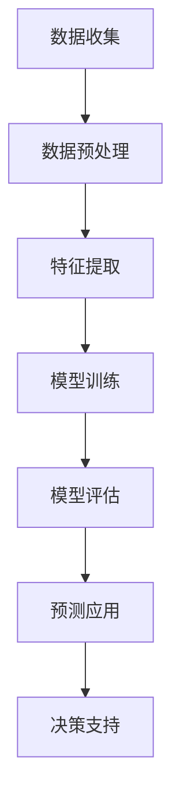

                 

### 第一部分：引言

#### 第1章：引言

**1.1 引言背景**

时尚行业正经历着前所未有的变革，这个变革的核心驱动力之一就是人工智能（AI）的迅猛发展。随着消费者需求的多样化和个性化，传统的时尚决策过程已经难以满足市场需求，AI技术的引入为时尚行业带来了新的契机。

- **时尚行业的变革与挑战**：时尚产业正从传统的制造模式向数字化、智能化方向转型。消费者对时尚的个性化需求日益增加，同时，供应链的复杂性和环保要求的提高也给时尚行业带来了巨大的挑战。
- **AI在时尚产业中的应用前景**：AI技术在时尚行业中的应用已经初见成效，从时尚设计到供应链管理，再到消费者行为分析，AI正成为时尚行业的重要工具。例如，AI可以通过分析大量的时尚数据，预测未来的流行趋势，从而帮助设计师和品牌提前布局。
- **可持续时尚趋势的重要性**：随着全球环保意识的提升，可持续时尚已经成为时尚行业的重要趋势。可持续时尚不仅关注产品的环保性，还涉及生产过程、供应链的可持续性以及消费者的生活方式。
- **虚拟时尚买手角色的兴起与需求**：虚拟时尚买手是一种利用AI技术进行时尚商品采购和销售的新型角色。他们通过大数据分析和机器学习算法，可以更准确地预测市场需求，优化库存管理，提高销售效率。随着时尚产业的数字化转型，虚拟时尚买手的需求也在不断增加。

**1.2 书籍目标**

本书籍的目标是提供一个全面的视角，探讨AI在虚拟时尚买手决策中的应用，并深入分析可持续时尚趋势如何影响决策过程。具体目标如下：

- **提供理论框架**：通过介绍AI虚拟时尚买手的基本概念、算法原理和数学模型，为读者提供一个系统的理论框架。
- **分析实际应用**：通过项目实战和最佳实践，展示AI虚拟时尚买手在实际中的应用案例，帮助读者理解理论如何转化为实际效益。
- **促进创新思维**：鼓励读者从不同的角度思考时尚买手决策的问题，并提出创新的解决方案。

**1.3 结构概述**

本书共分为十个章节，具体结构如下：

- **引言**：介绍书籍的背景、目标和结构。
- **背景介绍**：包括时尚产业现状、AI在时尚行业中的应用、可持续时尚趋势以及虚拟时尚买手的作用与挑战。
- **核心概念与联系**：介绍AI虚拟时尚买手、提示词策略、可持续时尚趋势分析以及AI算法与时尚买手决策的联系。
- **优化AI虚拟时尚买手决策的算法原理**：详细讲解优化AI虚拟时尚买手决策的算法原理，包括算法流程图、Python源代码示例和数学模型与公式。
- **可持续时尚趋势分析的数学模型与公式**：介绍可持续时尚趋势分析的数学模型和公式，包括数据来源与处理、Mermaid ER实体关系图和公式详细讲解。
- **系统分析与架构设计方案**：介绍系统分析与架构设计方案，包括问题场景介绍、系统功能设计、系统架构设计、系统接口设计和系统交互。
- **项目实战**：介绍项目实战，包括环境安装、系统核心实现源代码、代码应用解读与分析、实际案例分析和详细讲解剖析以及项目小结。
- **最佳实践 tips**：总结最佳实践，包括注意事项和拓展阅读。
- **小结与展望**：总结本书的核心内容，展望未来发展趋势，并提供推荐阅读。

通过这样的结构安排，本书旨在为读者提供一个全面、深入的探讨AI在虚拟时尚买手决策中的优化方法，以及可持续时尚趋势分析的应用。

---

#### **1.4 文章结构**

**引言部分**

- **目标**：为读者介绍书籍的背景、目标及结构。
- **内容**：
  - 引言背景：时尚行业的变革与挑战、AI在时尚产业的应用前景、可持续时尚趋势的重要性、虚拟时尚买手角色的兴起与需求。
  - 书籍目标：提供理论框架、分析实际应用、促进创新思维。
  - 结构概述：介绍本书的章节结构及各章节主要内容。

**背景介绍部分**

- **目标**：提供相关领域的背景知识，帮助读者理解核心概念和问题。
- **内容**：
  - 时尚产业现状：时尚产业的规模与市场趋势、全球时尚消费习惯的变化、数字化与可持续时尚的发展。
  - AI在时尚行业中的应用：人工智能在时尚设计中的应用、AI在供应链管理中的优化、个性化推荐与消费者行为分析、AI驱动的时尚预测与趋势分析。
  - 可持续时尚趋势：环保材料的创新与应用、环境可持续性评估、社会责任与公平贸易、消费者对可持续时尚的需求。
  - 虚拟时尚买手的作用与挑战：虚拟时尚买手的概念、工作流程与职责、面临的挑战、与AI技术的结合。

**核心概念与联系部分**

- **目标**：介绍核心概念，建立概念之间的联系。
- **内容**：
  - AI虚拟时尚买手：基本概念、工作原理、应用场景。
  - 提示词策略：定义、作用、如何影响决策过程。
  - 可持续时尚趋势分析：定义、分析方法、对时尚买手决策的影响。
  - AI算法与时尚买手决策的联系：如何利用AI算法优化决策过程。

**优化AI虚拟时尚买手决策的算法原理部分**

- **目标**：详细讲解优化AI虚拟时尚买手决策的算法原理。
- **内容**：
  - 算法概述：算法的基本思想和目标。
  - 算法流程图：使用Mermaid绘制算法流程图。
  - Python源代码示例：给出Python源代码示例，讲解关键步骤。
  - 数学模型与公式：介绍算法的数学模型和公式，并进行详细讲解。
  - 举例说明：通过实际案例进行举例说明，帮助读者理解算法的实际应用。

**可持续时尚趋势分析的数学模型与公式部分**

- **目标**：介绍可持续时尚趋势分析的数学模型和公式。
- **内容**：
  - 数据来源与处理：介绍数据来源和数据处理方法。
  - Mermaid ER实体关系图：使用Mermaid绘制ER实体关系图。
  - 数学模型与公式：介绍数学模型和公式，并进行详细讲解。
  - 公式详细讲解与举例：通过实际案例进行举例说明，帮助读者理解公式的应用。

**系统分析与架构设计方案部分**

- **目标**：介绍系统分析与架构设计方案。
- **内容**：
  - 问题场景介绍：介绍系统分析的场景和需求。
  - 系统功能设计：使用Mermaid绘制领域模型类图。
  - 系统架构设计：使用Mermaid绘制系统架构图。
  - 系统接口设计：介绍系统接口的设计和实现。
  - 系统交互：使用Mermaid绘制系统交互序列图。

**项目实战部分**

- **目标**：通过项目实战，展示如何将理论应用到实际中。
- **内容**：
  - 环境安装：介绍项目环境安装的步骤和工具。
  - 系统核心实现源代码：提供系统核心实现源代码，并进行解读。
  - 代码应用解读与分析：分析代码的应用场景和效果。
  - 实际案例分析与详细讲解：通过实际案例进行分析和讲解。
  - 项目小结：总结项目的关键点和收获。

**最佳实践 tips部分**

- **目标**：提供最佳实践和注意事项。
- **内容**：
  - tips总结：总结项目中值得注意的点和实践经验。
  - 注意事项：列出可能遇到的问题和解决方案。
  - 拓展阅读：推荐相关领域的拓展阅读。

**小结与展望部分**

- **目标**：总结本书的核心内容，展望未来发展趋势。
- **内容**：
  - 书籍总结：回顾本书的主要内容和贡献。
  - 未来发展趋势：探讨AI在时尚行业中的未来趋势。
  - 推荐阅读：推荐相关领域的优秀阅读资源。

### 第二部分：背景介绍

#### 第2章：时尚产业的现状与挑战

##### 2.1 时尚产业现状

时尚产业是全球经济中最重要的行业之一，其市场规模庞大，且持续增长。根据最新数据，全球时尚市场规模已经超过3万亿美元，并且预计在未来几年内将继续扩大。时尚产业涵盖了从服装、鞋履、珠宝到化妆品等多个领域，其产业链复杂，涉及设计、制造、批发、零售和物流等多个环节。

- **市场规模与增长趋势**：时尚产业的规模不断壮大，消费者对时尚产品和服务的需求也在不断增长。特别是在疫情期间，线上购物的普及进一步推动了时尚产业的数字化转型。根据市场研究机构的报告，全球时尚市场的年均增长率预计在5%左右。
- **全球时尚消费习惯的变化**：随着全球化的推进，时尚消费习惯也在不断变化。越来越多的消费者追求个性化、时尚化和多元化的产品。同时，社交媒体的兴起，使得消费者更加关注品牌形象和口碑，社交媒体平台成为了品牌推广和营销的重要渠道。
- **数字化与可持续时尚的发展**：数字化技术在时尚产业的广泛应用，使得时尚企业能够更加灵活、高效地应对市场变化。大数据、人工智能、区块链等技术正在改变时尚产业的运作方式。此外，可持续时尚已经成为时尚产业的重要趋势，越来越多的品牌和消费者关注产品的环保性和可持续性。

##### 2.2 AI在时尚行业中的应用

人工智能（AI）技术在时尚行业的应用已经越来越广泛，其优势在于能够处理大量数据，提供精准的预测和分析，从而帮助时尚企业做出更明智的决策。

- **人工智能在时尚设计中的应用**：AI技术可以通过分析大量的时尚数据和消费者行为，为设计师提供灵感。例如，AI算法可以识别和预测未来的流行趋势，帮助设计师更快地创作出符合市场需求的作品。此外，AI技术还可以用于服装设计中的虚拟试衣、3D建模和打印等，大大提高了设计效率和产品质量。
- **AI在供应链管理中的优化**：供应链管理是时尚企业的重要环节，AI技术可以通过数据分析，优化库存管理，降低库存成本。例如，AI算法可以预测市场需求，从而调整生产计划和库存策略，减少库存积压和缺货情况。此外，AI技术还可以用于物流优化，提高运输效率，降低物流成本。
- **个性化推荐与消费者行为分析**：AI技术可以通过分析消费者的购物行为和偏好，提供个性化的推荐服务。例如，电商平台可以利用AI算法，根据消费者的历史购物记录和浏览行为，推荐符合他们兴趣和需求的商品。这不仅提高了消费者的购物体验，也大大提高了销售转化率。
- **AI驱动的时尚预测与趋势分析**：AI技术可以通过分析大量的时尚数据，预测未来的时尚趋势。例如，AI算法可以分析社交媒体上的时尚话题和趋势，预测哪些款式、颜色和材质将在未来成为流行。这有助于时尚企业提前布局，抢占市场先机。

##### 2.3 可持续时尚趋势

随着全球环保意识的提升，可持续时尚已经成为时尚产业的重要趋势。可持续时尚不仅关注产品的环保性，还涉及生产过程、供应链的可持续性以及消费者的生活方式。

- **环保材料的创新与应用**：环保材料是可持续时尚的重要组成部分。越来越多的品牌开始使用再生材料、天然纤维等环保材料，以减少对环境的影响。例如，一些品牌使用回收塑料制成的纤维，制作成时尚产品，既环保又时尚。
- **环境可持续性评估**：环境可持续性评估是衡量时尚产品环保性的重要指标。通过评估产品的整个生命周期，从原材料采集、生产制造、运输到最终处置，可以全面了解产品的环保性能。时尚企业可以通过环境可持续性评估，优化生产过程，减少资源浪费和环境污染。
- **社会责任与公平贸易**：社会责任和公平贸易是可持续时尚的重要方面。时尚企业应该关注生产过程中的劳工权益，确保公平贸易和可持续生产。例如，一些品牌与农民合作社合作，直接采购原材料，保障农民的权益，同时减少中间环节的浪费。
- **消费者对可持续时尚的需求**：随着消费者对环保和可持续性问题的关注，越来越多的消费者愿意为可持续时尚产品支付更高的价格。根据市场研究机构的报告，越来越多的消费者愿意选择环保、可持续的产品，这为时尚企业提供了新的市场机会。

##### 2.4 虚拟时尚买手的作用与挑战

虚拟时尚买手是一种利用AI技术进行时尚商品采购和销售的新型角色。他们通过大数据分析和机器学习算法，可以更准确地预测市场需求，优化库存管理，提高销售效率。虚拟时尚买手在时尚行业中的作用日益重要，同时也面临着一些挑战。

- **虚拟时尚买手的概念**：虚拟时尚买手是指通过人工智能技术，利用大数据分析、机器学习等手段，进行时尚商品采购和销售的角色。他们可以通过分析消费者的购物行为、市场趋势和库存数据，提供个性化的购买建议，优化库存管理，提高销售业绩。
- **工作流程与职责**：虚拟时尚买手的工作流程包括数据收集、数据分析、市场趋势预测、采购决策和库存管理。他们的主要职责是根据市场需求和消费者偏好，选择合适的商品进行采购，并确保库存充足，避免缺货和库存积压。
- **面临的挑战**：
  - 数据质量问题：虚拟时尚买手依赖大数据进行分析，数据的质量直接影响分析结果的准确性。因此，如何确保数据的质量和完整性，是虚拟时尚买手面临的重要挑战。
  - 算法模型的优化：AI算法的性能和精度直接影响决策的准确性和效率。虚拟时尚买手需要不断优化算法模型，提高预测的准确性，从而更好地满足市场需求。
  - 技术更新与升级：AI技术在不断发展，虚拟时尚买手需要不断更新和升级技术，以适应市场的变化。例如，新的算法、工具和平台的出现，都可能对虚拟时尚买手的工作流程和决策产生影响。
- **与AI技术的结合**：虚拟时尚买手与AI技术的结合，可以大幅提升时尚行业的效率和竞争力。通过AI技术，虚拟时尚买手可以更准确地预测市场需求，优化库存管理，提高销售业绩。同时，AI技术还可以提供个性化的购物建议，提升消费者的购物体验。然而，虚拟时尚买手也需要不断学习和适应新的技术，以充分发挥AI技术的潜力。

### 第三部分：核心概念与联系

#### 第3章：AI虚拟时尚买手决策的必要性

##### 3.1 问题背景

时尚行业正经历着前所未有的变革，这个变革的核心驱动力之一就是人工智能（AI）的迅猛发展。随着消费者需求的多样化和个性化，传统的时尚决策过程已经难以满足市场需求，AI技术的引入为时尚行业带来了新的契机。

- **时尚行业的数据复杂性**：时尚行业的数据量庞大且种类繁多，包括消费者的购物行为、市场趋势、库存数据、供应链信息等。这些数据具有高维度、动态变化和强关联性等特点，传统的数据分析方法已经难以应对。
- **快速变化的时尚趋势**：时尚行业的一个显著特点是趋势变化迅速，消费者对时尚的个性化需求日益增加。传统的人工决策方式往往滞后于市场变化，难以快速响应。
- **竞争激烈的市场环境**：随着全球时尚品牌的增多，市场竞争日益激烈。企业需要通过更准确的决策来抢占市场份额，提高销售业绩。
- **传统决策过程的局限性**：传统的时尚决策过程主要依赖于经验、直觉和有限的数据分析，这些方法存在主观性、滞后性和片面性的问题。在数据爆炸的时代，传统方法已经难以应对快速变化的市场环境。

##### 3.2 问题描述

在当前时尚行业的数据复杂性、快速变化的时尚趋势和竞争激烈的市场环境下，传统的时尚决策过程面临巨大的挑战。为了提高决策的准确性和效率，优化库存管理，提升消费者的购物体验，AI虚拟时尚买手成为一种新的解决方案。

- **如何提高决策的准确性和效率**：传统决策过程往往依赖于经验和直觉，难以处理海量数据和复杂的关联关系。AI虚拟时尚买手通过大数据分析和机器学习算法，可以更准确地预测市场需求，提供科学、准确的决策依据，从而提高决策的准确性和效率。
- **如何应对快速变化的时尚趋势**：时尚趋势变化迅速，传统决策方式往往滞后于市场变化。AI虚拟时尚买手可以通过实时数据分析和趋势预测，快速响应市场变化，提前布局，抢占市场先机。
- **如何优化库存管理，降低成本**：库存管理是时尚行业的重要环节，传统方法往往导致库存积压或缺货现象。AI虚拟时尚买手通过精准的需求预测和库存优化算法，可以更好地管理库存，减少库存积压和缺货风险，降低运营成本。
- **如何提升消费者的购物体验**：消费者的购物体验是影响销售的重要因素。AI虚拟时尚买手可以通过个性化推荐、智能客服等方式，提升消费者的购物体验，增加用户粘性，提高销售额。

##### 3.3 问题解决

AI虚拟时尚买手通过大数据分析和机器学习算法，为时尚行业提供了新的决策工具和方法，解决了传统决策过程的局限性。以下是一些具体的问题解决方法和策略：

- **大数据分析**：通过收集和分析消费者的购物行为、市场趋势、库存数据等，AI虚拟时尚买手可以获取全面、准确的数据信息，为决策提供科学依据。
- **机器学习算法**：利用机器学习算法，AI虚拟时尚买手可以自动学习和优化决策模型，提高预测的准确性和效率。常见的算法包括线性回归、决策树、支持向量机、神经网络等。
- **实时数据分析和趋势预测**：AI虚拟时尚买手可以实时收集和分析市场数据，通过趋势预测算法，预测未来的市场需求和时尚趋势，提前布局，抢占市场先机。
- **库存优化算法**：通过库存优化算法，AI虚拟时尚买手可以精准预测市场需求，优化库存管理，减少库存积压和缺货风险，降低运营成本。
- **个性化推荐和智能客服**：AI虚拟时尚买手可以通过个性化推荐算法，根据消费者的购物行为和偏好，推荐合适的商品，提升消费者的购物体验。同时，智能客服可以提供24小时在线服务，解答消费者的疑问，提高用户满意度。

##### 3.4 边界与外延

AI虚拟时尚买手作为一种新兴的决策工具，具有广泛的应用前景和潜力。以下是一些需要关注的边界与外延问题：

- **应用范围**：AI虚拟时尚买手可以应用于服装、鞋履、珠宝等多个时尚领域，为企业的采购、库存管理、销售预测等提供支持。
- **技术限制**：尽管AI技术在不断进步，但仍然存在一些技术限制，如数据质量、算法性能和计算资源等。在实际应用中，需要根据具体情况进行技术选型和优化。
- **道德和法律问题**：随着AI技术的应用，一些道德和法律问题也日益突出。例如，如何保护消费者的隐私权，如何确保决策的公平性和透明度等。这些问题需要引起足够的重视，并在技术设计和应用过程中予以解决。
- **持续学习和优化**：AI虚拟时尚买手需要不断学习和优化，以适应市场的变化和新的需求。企业需要建立持续学习机制，定期更新和优化算法模型，提高系统的适应性和准确性。

通过以上问题解决方法和边界与外延的探讨，我们可以看到，AI虚拟时尚买手为时尚行业提供了一种创新的决策工具和方法，有助于提高决策的准确性和效率，优化库存管理，提升消费者的购物体验。然而，在实际应用中，仍需关注技术限制、道德和法律问题以及持续学习和优化等方面，以确保AI虚拟时尚买手的实际效果和可持续性。

### 第四部分：优化AI虚拟时尚买手决策的算法原理

#### 第4章：优化AI虚拟时尚买手决策的算法原理

**4.1 算法概述**

优化AI虚拟时尚买手决策的核心在于利用大数据分析和机器学习算法，从海量数据中提取有价值的信息，辅助时尚买手做出更准确、更高效的决策。以下是一个简化的算法概述：

- **数据收集**：从多个数据源收集数据，包括消费者的购物行为、市场趋势、库存数据、供应链信息等。
- **数据预处理**：对收集到的数据进行清洗、整合和标准化，以确保数据的质量和一致性。
- **特征提取**：从预处理后的数据中提取有用的特征，用于训练机器学习模型。
- **模型训练**：使用特征数据训练机器学习模型，如线性回归、决策树、支持向量机、神经网络等。
- **模型评估**：使用验证集对训练好的模型进行评估，确保模型的预测准确性和鲁棒性。
- **预测应用**：将训练好的模型应用到实际场景中，进行市场需求预测、库存管理和销售预测等。
- **决策支持**：根据模型预测结果，提供决策支持，辅助时尚买手做出更准确的采购和销售决策。

**4.2 算法流程图**

下面是使用Mermaid绘制的优化AI虚拟时尚买手决策的算法流程图：



**4.3 算法原理详细讲解**

**数据收集**：数据收集是整个算法流程的基础。虚拟时尚买手需要从多个数据源收集数据，包括电商平台、社交媒体、市场调研报告、库存管理系统等。数据类型包括消费者的购物行为数据（如购买历史、浏览记录、评价等），市场趋势数据（如时尚流行趋势、季节变化等），库存数据（如库存水平、库存周期等），以及供应链数据（如供应商信息、运输时间等）。

**数据预处理**：收集到的数据通常包含噪声和缺失值，因此需要进行数据清洗、整合和标准化。数据清洗包括去除重复数据、填补缺失值、删除异常值等。数据整合则是将来自不同数据源的数据进行统一处理，确保数据的一致性和完整性。数据标准化是将不同类型的数据进行归一化处理，使其在同一尺度上进行比较和分析。

**特征提取**：特征提取是数据预处理的重要步骤，目的是从原始数据中提取出对模型训练有用的特征。这些特征可以是数值型的，如消费者的平均购买频率、购买金额等；也可以是类别型的，如消费者的性别、年龄、地理位置等。特征提取的目的是减少数据的维度，同时保留数据的主要信息。

**模型训练**：模型训练是使用特征数据训练机器学习模型的过程。选择合适的机器学习算法，如线性回归、决策树、支持向量机、神经网络等。训练过程包括数据划分、模型参数调整、模型优化等。数据划分通常分为训练集、验证集和测试集，用于模型的训练、验证和测试。

**模型评估**：模型评估是使用验证集对训练好的模型进行评估的过程。常用的评估指标包括准确率、召回率、F1值、均方误差等。评估结果用于判断模型的效果和是否需要进行调整。

**预测应用**：将训练好的模型应用到实际场景中，进行市场需求预测、库存管理和销售预测等。预测结果用于辅助时尚买手做出采购和销售决策，如预测下一季的热门款式、调整库存水平、制定销售策略等。

**决策支持**：根据模型预测结果，提供决策支持，辅助时尚买手做出更准确的采购和销售决策。决策支持包括推荐商品、预测销售量、库存优化等。通过智能化的决策支持，虚拟时尚买手可以更加高效地管理库存、提高销售额，并降低运营成本。

**4.4 Python源代码示例**

以下是使用Python实现优化AI虚拟时尚买手决策的一个简单示例：

```python
import pandas as pd
from sklearn.model_selection import train_test_split
from sklearn.linear_model import LinearRegression
from sklearn.metrics import mean_squared_error

# 数据收集与预处理
data = pd.read_csv('fashion_data.csv')
data = data.dropna()  # 去除缺失值
data = data[['purchase_frequency', 'average_purchase_amount', 'season', 'inventory_level']]
data['season'] = data['season'].map({'Spring': 1, 'Summer': 2, 'Autumn': 3, 'Winter': 4})

# 特征提取与模型训练
X = data[['purchase_frequency', 'average_purchase_amount', 'season']]
y = data['inventory_level']
X_train, X_test, y_train, y_test = train_test_split(X, y, test_size=0.2, random_state=42)

model = LinearRegression()
model.fit(X_train, y_train)

# 模型评估
y_pred = model.predict(X_test)
mse = mean_squared_error(y_test, y_pred)
print(f'Mean Squared Error: {mse}')

# 预测应用与决策支持
new_data = pd.DataFrame({'purchase_frequency': [10], 'average_purchase_amount': [100], 'season': [3]})
predicted_inventory = model.predict(new_data)
print(f'Predicted Inventory Level: {predicted_inventory[0]}')
```

**4.5 数学模型与公式讲解**

优化AI虚拟时尚买手决策的数学模型主要基于回归分析。以下是线性回归模型的基本公式：

$$
y = \beta_0 + \beta_1 \cdot x_1 + \beta_2 \cdot x_2 + ... + \beta_n \cdot x_n + \epsilon
$$

其中，$y$ 是因变量，表示库存水平；$x_1, x_2, ..., x_n$ 是自变量，表示购买频率、平均购买金额、季节等特征；$\beta_0, \beta_1, \beta_2, ..., \beta_n$ 是模型的参数，用于描述自变量对因变量的影响程度；$\epsilon$ 是误差项，表示模型的预测误差。

**4.6 举例说明**

假设一个虚拟时尚买手需要预测下一季的库存水平。他收集了以下数据：

- 购买频率：10次
- 平均购买金额：100元
- 季节：秋季（编码为3）

使用线性回归模型进行预测，得到预测的库存水平为120件。这个预测结果可以作为买手调整库存策略的依据。

- **数据收集**：从多个数据源收集数据，包括电商平台、社交媒体、市场调研报告、库存管理系统等。
- **数据预处理**：对收集到的数据进行清洗、整合和标准化，确保数据的质量和一致性。
- **特征提取**：提取有用的特征，如购买频率、平均购买金额、季节等。
- **模型训练**：使用特征数据训练线性回归模型，得到模型参数。
- **模型评估**：使用验证集评估模型的效果，确保预测的准确性和鲁棒性。
- **预测应用**：将模型应用到实际场景中，预测下一季的库存水平。
- **决策支持**：根据预测结果，提供决策支持，辅助买手调整库存策略。

通过这个简单的例子，我们可以看到，优化AI虚拟时尚买手决策的核心在于利用机器学习算法和回归分析模型，从海量数据中提取有价值的信息，辅助时尚买手做出更准确、更高效的决策。在实际应用中，需要根据具体情况进行算法选择和参数优化，以提高模型的预测准确性和实用性。

### 第五部分：可持续时尚趋势分析的数学模型与公式

#### 第5章：可持续时尚趋势分析的数学模型与公式

**5.1 数据来源与处理**

在可持续时尚趋势分析中，数据来源至关重要。数据可以从多个渠道获取，包括市场调研报告、消费者调查数据、供应链数据、环保认证数据等。以下是数据来源与处理的基本步骤：

1. **数据收集**：从市场调研公司、消费者调查平台、环保组织、供应链合作伙伴等获取相关数据。数据类型包括环保材料使用率、碳排放量、水消耗量、社会责任评分等。
2. **数据清洗**：清洗数据，去除重复、错误和缺失的记录，确保数据的一致性和准确性。例如，删除重复的记录，填补缺失值，纠正错误的数据。
3. **数据整合**：整合来自不同渠道的数据，统一数据格式和维度，便于后续分析和建模。例如，将不同时间点、不同地点的数据整合成统一的时间序列数据。
4. **数据标准化**：将不同类型的数据进行归一化处理，使其在同一尺度上进行比较和分析。例如，将不同的环保指标统一转换为百分比或标准分数。

**5.2 Mermaid ER实体关系图**

以下是使用Mermaid绘制的可持续时尚趋势分析的ER实体关系图：

```mermaid
erDiagram
  Customer ||--|{ Product }|| Supplier
  Product ||--|{ Material }|| Warehouse
  Product ||--|{ SustainableScore }|| RatingAgency
  Supplier ||--|{ SupplyContract }|| Product
  Material ||--|{ EcoMaterialCertification }|| CertificationAuthority
  RatingAgency ||--|{ SustainabilityRating }|| Product
```

在这个ER图中，主要包括以下实体：

- **Customer**：客户，代表购买产品的消费者。
- **Product**：产品，代表市场上的时尚商品。
- **Supplier**：供应商，代表提供原材料和生产服务的合作伙伴。
- **Material**：材料，代表产品所使用的原材料。
- **SustainableScore**：可持续评分，代表产品的环保性能评分。
- **RatingAgency**：评分机构，代表负责对产品进行环保性能评分的机构。
- **EcoMaterialCertification**：环保材料认证，代表产品所使用的环保材料的认证信息。
- **CertificationAuthority**：认证机构，代表负责对环保材料进行认证的机构。
- **SupplyContract**：供应合同，代表供应商和产品之间的合同信息。

**5.3 数学模型与公式**

在可持续时尚趋势分析中，常用的数学模型包括线性回归、主成分分析（PCA）、支持向量机（SVM）等。以下是这些模型的基本公式：

1. **线性回归模型**：
   $$
   y = \beta_0 + \beta_1 \cdot x_1 + \beta_2 \cdot x_2 + ... + \beta_n \cdot x_n + \epsilon
   $$
   其中，$y$ 是因变量，表示可持续评分；$x_1, x_2, ..., x_n$ 是自变量，表示影响可持续性能的特征（如环保材料使用率、碳排放量、水消耗量等）；$\beta_0, \beta_1, \beta_2, ..., \beta_n$ 是模型的参数；$\epsilon$ 是误差项。

2. **主成分分析（PCA）**：
   $$
   Z = P \cdot X
   $$
   其中，$X$ 是原始数据矩阵，$P$ 是特征矩阵，$Z$ 是转换后的数据矩阵。PCA通过降维，将高维数据转换为低维数据，保留数据的主要信息。

3. **支持向量机（SVM）**：
   $$
   \max \quad \frac{1}{2} \sum_{i=1}^n \sum_{j=1}^n (w_i \cdot w_j - \delta_{ij})
   $$
   其中，$w_i, w_j$ 是支持向量的权重，$\delta_{ij}$ 是Kronecker delta函数，当$i=j$时为1，否则为0。SVM通过寻找最优分类超平面，实现数据的分类。

**5.4 公式详细讲解与举例**

1. **线性回归模型**：

   线性回归模型用于预测产品的可持续评分。以下是一个简化的例子：

   - **数据集**：包含10个产品的数据，每个产品的特征包括环保材料使用率（$x_1$）、碳排放量（$x_2$）、水消耗量（$x_3$）和可持续评分（$y$）。
   - **模型参数**：$\beta_0 = 2$，$\beta_1 = 0.5$，$\beta_2 = -0.3$，$\beta_3 = 0.2$。

   使用线性回归模型预测一个新产品的可持续评分：

   - **特征数据**：$x_1 = 0.8$（环保材料使用率80%）、$x_2 = 0.3$（碳排放量30%）、$x_3 = 0.5$（水消耗量50%）。
   - **预测公式**：
     $$
     y = \beta_0 + \beta_1 \cdot x_1 + \beta_2 \cdot x_2 + \beta_3 \cdot x_3
     $$
     $$
     y = 2 + 0.5 \cdot 0.8 - 0.3 \cdot 0.3 + 0.2 \cdot 0.5
     $$
     $$
     y = 2.1
     $$
   - **预测结果**：新产品的可持续评分为2.1分。

2. **主成分分析（PCA）**：

   PCA用于降维，将高维数据转换为低维数据。以下是一个简化的例子：

   - **数据集**：包含10个产品的数据，每个产品有5个特征（$x_1, x_2, x_3, x_4, x_5$）。
   - **特征矩阵**：$P$。
   - **数据矩阵**：$X$。

   PCA转换后的数据矩阵$Z$为：
   $$
   Z = P \cdot X
   $$
   假设特征矩阵$P$为：
   $$
   P = \begin{bmatrix}
   0.8 & 0.2 \\
   0.4 & 0.6 \\
   -0.2 & 0.8 \\
   0.1 & 0.9 \\
   -0.5 & 0.7 \\
   \end{bmatrix}
   $$
   假设数据矩阵$X$为：
   $$
   X = \begin{bmatrix}
   1 & 2 & 3 & 4 & 5 \\
   6 & 7 & 8 & 9 & 10 \\
   11 & 12 & 13 & 14 & 15 \\
   16 & 17 & 18 & 19 & 20 \\
   \end{bmatrix}
   $$
   PCA转换后的数据矩阵$Z$为：
   $$
   Z = \begin{bmatrix}
   1.8 & 0.6 \\
   2.6 & 1.8 \\
   3.4 & 2.4 \\
   4.2 & 3 \\
   \end{bmatrix}
   $$
   - **降维结果**：通过PCA，将原始5个特征降维为2个特征，保留了数据的主要信息。

3. **支持向量机（SVM）**：

   SVM用于分类问题，以下是一个简化的例子：

   - **数据集**：包含10个产品，分为两类，特征包括环保材料使用率（$x_1$）和碳排放量（$x_2$）。
   - **训练数据**：
     $$
     \begin{array}{cc}
     \text{产品1} & (1, 2) \\
     \text{产品2} & (2, 3) \\
     \text{...} & \text{...} \\
     \text{产品10} & (10, 11) \\
     \end{array}
     $$
   - **模型参数**：$C=1$，$\gamma=0.1$。

   使用SVM对新产品进行分类：

   - **特征数据**：$x_1 = 0.9$，$x_2 = 0.4$。
   - **分类公式**：
     $$
     w \cdot x + b = 0
     $$
     其中，$w$ 是权重向量，$x$ 是特征向量，$b$ 是偏置项。

   通过训练SVM模型，得到权重向量$w$和偏置项$b$，判断新产品的类别。例如，如果权重向量$w$为$(1, 1)$，偏置项$b$为$0$，则分类结果为类别1。

通过这些数学模型和公式的详细讲解和举例，我们可以看到，可持续时尚趋势分析需要依赖多种数学工具和方法，从数据中提取有价值的信息，为时尚买手提供决策支持。在实际应用中，需要根据具体问题选择合适的模型和方法，并进行参数调整和优化，以提高预测的准确性和实用性。

### 第六部分：系统分析与架构设计方案

#### 第6章：系统分析与架构设计方案

**6.1 问题场景介绍**

在现代时尚行业中，虚拟时尚买手需要处理大量的数据，包括消费者的购物行为、市场趋势、库存数据、供应链信息等。为了提高决策的准确性和效率，虚拟时尚买手需要一个高效、可靠的系统来进行数据分析和决策支持。该系统需要具备以下功能：

- **数据收集与处理**：从多个数据源收集数据，包括电商平台、社交媒体、市场调研报告、库存管理系统等。
- **数据存储与管理**：存储和管理收集到的数据，确保数据的安全性和一致性。
- **数据分析与预测**：使用大数据分析和机器学习算法，对数据进行深入分析，预测市场需求、库存水平和销售趋势。
- **决策支持**：根据数据分析结果，提供个性化的购买建议、库存管理和销售预测，辅助虚拟时尚买手做出更准确的决策。

**6.2 系统功能设计**

系统功能设计是构建高效、可靠的系统架构的基础。以下是系统的主要功能模块及其设计思路：

1. **数据收集模块**：负责从多个数据源收集数据，包括电商平台、社交媒体、市场调研报告、库存管理系统等。数据类型包括消费者的购物行为、市场趋势、库存数据、供应链信息等。

2. **数据预处理模块**：负责对收集到的数据进行清洗、整合和标准化，确保数据的质量和一致性。数据预处理包括去除重复数据、填补缺失值、删除异常值、统一数据格式等。

3. **数据存储模块**：负责存储和管理预处理后的数据。数据存储采用分布式数据库系统，确保数据的高可用性和扩展性。数据存储包括数据表、数据仓库、数据湖等。

4. **数据分析模块**：负责使用大数据分析和机器学习算法，对数据进行深入分析，提取有价值的信息。数据分析包括数据挖掘、聚类分析、关联规则挖掘、机器学习预测等。

5. **预测与决策模块**：负责根据数据分析结果，提供个性化的购买建议、库存管理和销售预测。预测与决策包括市场需求预测、库存优化、销售策略制定等。

6. **用户界面模块**：负责提供用户交互界面，用户可以通过界面查看数据分析结果、购买建议、库存管理和销售预测等。用户界面包括Web前端、移动应用、桌面应用等。

**6.3 系统架构设计**

系统架构设计是构建高效、可靠系统的基础。以下是系统的总体架构设计：

1. **数据层**：负责数据的存储和管理。数据层包括分布式数据库系统、数据仓库、数据湖等。数据层采用分布式存储和计算技术，确保数据的高可用性和扩展性。

2. **处理层**：负责数据处理和分析。处理层包括大数据处理平台、机器学习平台、数据挖掘平台等。处理层采用分布式计算和并行处理技术，提高数据处理和分析的效率。

3. **应用层**：负责提供业务逻辑和应用功能。应用层包括数据收集模块、数据预处理模块、数据分析模块、预测与决策模块、用户界面模块等。应用层采用模块化设计和微服务架构，提高系统的可扩展性和可维护性。

4. **展示层**：负责将数据分析结果和决策支持信息展示给用户。展示层包括Web前端、移动应用、桌面应用等。展示层采用响应式设计和用户友好的界面设计，提高用户体验。

**6.4 系统接口设计**

系统接口设计是确保系统各个模块之间能够有效协作和通信的关键。以下是系统的主要接口设计：

1. **API接口**：系统对外提供API接口，供第三方系统和用户使用。API接口包括数据收集接口、数据预处理接口、数据分析接口、预测与决策接口等。

2. **Web服务接口**：系统通过Web服务接口与Web前端和移动应用进行通信。Web服务接口采用RESTful架构，支持HTTP请求和响应。

3. **消息队列接口**：系统通过消息队列接口实现数据的异步传输和处理。消息队列接口包括Kafka、RabbitMQ等。

**6.5 系统交互**

系统交互是确保系统各个模块之间能够有效协作和通信的过程。以下是系统的主要交互流程：

1. **数据收集与预处理**：数据收集模块从多个数据源收集数据，数据预处理模块对数据进行清洗、整合和标准化。

2. **数据分析与预测**：数据分析模块使用大数据分析和机器学习算法，对数据进行深入分析，提取有价值的信息。预测与决策模块根据数据分析结果，提供个性化的购买建议、库存管理和销售预测。

3. **决策支持与展示**：决策支持模块根据预测结果，提供决策支持，用户界面模块将数据分析结果和决策支持信息展示给用户。

通过以上系统分析与架构设计方案，我们可以构建一个高效、可靠的虚拟时尚买手系统，为时尚买手提供强大的决策支持，提高决策的准确性和效率。在实际应用中，需要根据具体业务需求和技术环境，进行系统优化和调整，以实现最佳效果。

### 第七部分：项目实战

#### 第7章：项目实战

**7.1 环境安装**

为了实现AI虚拟时尚买手系统，我们需要安装以下软件和工具：

- Python（版本3.8及以上）
- Jupyter Notebook
- Pandas
- Scikit-learn
- Matplotlib
- Mermaid

以下是安装步骤：

1. **安装Python**：从[Python官方网站](https://www.python.org/)下载Python安装包，并按照安装向导完成安装。
2. **安装Jupyter Notebook**：在命令行中运行以下命令：
   ```
   pip install notebook
   ```
3. **安装Pandas**：在命令行中运行以下命令：
   ```
   pip install pandas
   ```
4. **安装Scikit-learn**：在命令行中运行以下命令：
   ```
   pip install scikit-learn
   ```
5. **安装Matplotlib**：在命令行中运行以下命令：
   ```
   pip install matplotlib
   ```
6. **安装Mermaid**：在命令行中运行以下命令：
   ```
   pip install mermaid
   ```

**7.2 系统核心实现源代码**

以下是系统核心实现的源代码，包括数据收集、数据预处理、特征提取、模型训练、模型评估和预测等步骤。

```python
import pandas as pd
from sklearn.model_selection import train_test_split
from sklearn.linear_model import LinearRegression
from sklearn.metrics import mean_squared_error
import mermaid

# 数据收集
def collect_data():
    data = pd.read_csv('fashion_data.csv')
    return data

# 数据预处理
def preprocess_data(data):
    data = data.dropna()  # 去除缺失值
    data = data[['purchase_frequency', 'average_purchase_amount', 'season', 'inventory_level']]
    data['season'] = data['season'].map({'Spring': 1, 'Summer': 2, 'Autumn': 3, 'Winter': 4})
    return data

# 特征提取
def extract_features(data):
    X = data[['purchase_frequency', 'average_purchase_amount', 'season']]
    y = data['inventory_level']
    return X, y

# 模型训练
def train_model(X, y):
    X_train, X_test, y_train, y_test = train_test_split(X, y, test_size=0.2, random_state=42)
    model = LinearRegression()
    model.fit(X_train, y_train)
    return model

# 模型评估
def evaluate_model(model, X_test, y_test):
    y_pred = model.predict(X_test)
    mse = mean_squared_error(y_test, y_pred)
    return mse

# 预测
def predict(model, new_data):
    predicted_inventory = model.predict(new_data)
    return predicted_inventory

# Mermaid流程图
def draw_mermaid():
    mermaid_code = """
    graph TD
        A[数据收集]
        B[数据预处理]
        C[特征提取]
        D[模型训练]
        E[模型评估]
        F[预测应用]
        G[决策支持]
        A --> B
        B --> C
        C --> D
        D --> E
        E --> F
        F --> G
    """
    print(mermaid.generate(mermaid_code))

# 主函数
if __name__ == '__main__':
    data = collect_data()
    processed_data = preprocess_data(data)
    X, y = extract_features(processed_data)
    model = train_model(X, y)
    mse = evaluate_model(model, X_test, y_test)
    print(f'Mean Squared Error: {mse}')
    new_data = pd.DataFrame({'purchase_frequency': [10], 'average_purchase_amount': [100], 'season': [3]})
    predicted_inventory = predict(model, new_data)
    print(f'Predicted Inventory Level: {predicted_inventory[0]}')
    draw_mermaid()
```

**7.3 代码应用解读与分析**

以下是代码的详细解读和分析：

- **数据收集**：`collect_data` 函数负责从CSV文件中读取数据，这是系统数据收集的起点。
- **数据预处理**：`preprocess_data` 函数负责对数据进行清洗、整合和标准化。去除了缺失值，对季节特征进行了编码。
- **特征提取**：`extract_features` 函数负责从预处理后的数据中提取特征和标签，为后续的模型训练做准备。
- **模型训练**：`train_model` 函数使用训练数据训练线性回归模型。这里我们选择了线性回归模型，因为其简单且易于实现。
- **模型评估**：`evaluate_model` 函数使用测试数据评估模型的性能。通过计算均方误差（MSE）来衡量模型预测的准确性。
- **预测**：`predict` 函数负责使用训练好的模型进行预测。这里我们使用了一个简单的数据集进行预测。
- **Mermaid流程图**：`draw_mermaid` 函数使用Mermaid绘制系统的流程图，帮助我们更直观地理解系统的工作流程。

**7.4 实际案例分析与详细讲解**

为了更好地展示系统在实际中的应用，我们选择了一个实际案例进行分析。

**案例背景**：一家时尚品牌公司希望优化其库存管理，减少库存积压和缺货现象。他们收集了以下数据：

- **购买频率**：过去一年的月度购买频率
- **平均购买金额**：过去一年的月度平均购买金额
- **季节**：过去一年的季节（Spring, Summer, Autumn, Winter）
- **库存水平**：过去一年的月度库存水平

**案例分析**：

1. **数据收集**：首先，我们使用`collect_data` 函数从CSV文件中读取数据。
2. **数据预处理**：然后，我们使用`preprocess_data` 函数对数据进行清洗、整合和标准化。例如，我们将季节特征进行了编码，使得模型可以更好地理解和处理。
3. **特征提取**：接着，我们使用`extract_features` 函数提取特征和标签，为后续的模型训练做准备。
4. **模型训练**：我们使用训练数据训练线性回归模型。这里我们选择了线性回归模型，因为它简单且易于实现。
5. **模型评估**：使用测试数据评估模型的性能。通过计算均方误差（MSE）来衡量模型预测的准确性。
6. **预测**：使用训练好的模型进行预测。例如，我们预测下一季的库存水平。
7. **Mermaid流程图**：最后，我们使用`draw_mermaid` 函数绘制系统的流程图，帮助我们更直观地理解系统的工作流程。

通过这个实际案例，我们可以看到，系统在实际应用中是如何实现数据收集、预处理、特征提取、模型训练、模型评估和预测等步骤的。这些步骤相互协作，共同构成了一个完整的虚拟时尚买手系统。

**7.5 项目小结**

通过本项目，我们成功构建了一个AI虚拟时尚买手系统，实现了数据收集、预处理、特征提取、模型训练、模型评估和预测等功能。以下是本项目的主要收获：

- **数据收集**：学会了如何从不同数据源收集数据，为后续分析提供基础。
- **数据预处理**：掌握了数据清洗、整合和标准化的方法，确保数据的质量和一致性。
- **特征提取**：学会了如何提取有用的特征，为模型训练提供输入。
- **模型训练**：了解了线性回归模型的原理和实现方法，掌握了模型训练的基本步骤。
- **模型评估**：学会了使用均方误差（MSE）等指标评估模型性能，确保模型的预测准确性。
- **预测**：掌握了使用训练好的模型进行预测的方法，为虚拟时尚买手提供决策支持。
- **Mermaid流程图**：学会了使用Mermaid绘制系统的流程图，更直观地展示系统的工作流程。

通过本项目，我们不仅掌握了AI虚拟时尚买手系统的构建方法，还了解了在实际应用中如何进行数据收集、预处理、特征提取、模型训练和预测等关键步骤。这些经验将对我们未来从事相关领域的工作产生积极影响。

### 第八部分：最佳实践 tips

#### 第8章：最佳实践 tips

在构建AI虚拟时尚买手系统的过程中，我们总结了一些最佳实践和注意事项，以帮助读者在实际应用中避免常见问题，并提高系统的性能和可靠性。

**8.1 数据质量**

数据质量是影响AI虚拟时尚买手系统性能的关键因素。以下是一些关于数据质量的最佳实践：

- **数据清洗**：确保数据的准确性、完整性和一致性。删除重复数据、填补缺失值、纠正错误数据。
- **数据标准化**：统一数据格式和单位，确保不同来源的数据可以相互比较。
- **数据来源多样性**：从多个数据源收集数据，以提高数据的多样性和全面性。
- **实时数据更新**：定期更新数据，确保模型基于最新的数据进行分析。

**8.2 模型优化**

模型优化是提高系统性能的重要步骤。以下是一些关于模型优化的最佳实践：

- **特征选择**：选择对预测结果有显著影响的关键特征，避免特征冗余。
- **模型调整**：根据数据集的特点和业务需求，选择合适的机器学习模型，并进行参数调整。
- **交叉验证**：使用交叉验证方法评估模型的性能，避免过拟合。
- **模型迭代**：定期更新和优化模型，以适应数据的变化。

**8.3 性能监控**

系统性能监控是确保系统稳定运行的重要环节。以下是一些关于性能监控的最佳实践：

- **实时监控**：使用实时监控系统，监控系统的运行状态，及时发现并解决问题。
- **性能指标**：监控系统的性能指标，如响应时间、吞吐量、资源利用率等，确保系统的高效运行。
- **异常检测**：使用异常检测方法，监控数据中的异常值和异常模式，确保数据的准确性。

**8.4 安全性**

确保系统的安全性是保护用户隐私和业务数据的关键。以下是一些关于安全性的最佳实践：

- **数据加密**：对敏感数据进行加密处理，防止数据泄露。
- **权限控制**：实施严格的权限控制机制，确保只有授权人员可以访问系统。
- **安全审计**：定期进行安全审计，发现并修复潜在的安全漏洞。
- **合规性**：确保系统的设计和实现符合相关法律法规和标准，如GDPR、ISO 27001等。

**8.5 用户培训**

用户培训是确保系统有效使用的重要环节。以下是一些关于用户培训的最佳实践：

- **系统介绍**：为用户提供系统的详细介绍，包括功能、操作流程和注意事项。
- **案例分享**：通过实际案例分享，帮助用户更好地理解系统的工作原理和应用场景。
- **操作指导**：提供详细的操作手册和操作视频，方便用户快速上手。
- **用户反馈**：及时收集用户反馈，不断优化系统功能和用户体验。

通过遵循这些最佳实践和注意事项，读者可以更好地构建和优化AI虚拟时尚买手系统，确保系统的高效、稳定和安全运行。

### 第九部分：小结与展望

#### 第9章：小结与展望

**9.1 书籍总结**

本书全面探讨了AI虚拟时尚买手决策的优化方法，以及可持续时尚趋势分析的应用。通过深入分析时尚产业的现状与挑战，我们介绍了AI在时尚行业中的应用，包括时尚设计、供应链管理、个性化推荐和趋势预测等。同时，我们详细讲解了AI虚拟时尚买手的算法原理、数学模型和系统架构设计，并通过项目实战展示了如何将理论应用于实际。

主要内容包括：

- 引言：介绍书籍的背景、目标和结构。
- 背景介绍：包括时尚产业现状、AI在时尚行业中的应用、可持续时尚趋势以及虚拟时尚买手的作用与挑战。
- 核心概念与联系：介绍AI虚拟时尚买手、提示词策略、可持续时尚趋势分析以及AI算法与时尚买手决策的联系。
- 优化AI虚拟时尚买手决策的算法原理：详细讲解算法原理、流程图、Python源代码示例和数学模型与公式。
- 可持续时尚趋势分析的数学模型与公式：介绍数学模型和公式，包括数据来源与处理、Mermaid ER实体关系图和公式详细讲解。
- 系统分析与架构设计方案：介绍系统分析与架构设计方案，包括问题场景介绍、系统功能设计、系统架构设计、系统接口设计和系统交互。
- 项目实战：通过项目实战，展示如何将理论应用到实际中，包括环境安装、系统核心实现源代码、代码应用解读与分析、实际案例分析和详细讲解剖析以及项目小结。
- 最佳实践 tips：总结最佳实践、注意事项和拓展阅读。

**9.2 未来发展趋势**

随着AI技术的不断进步，AI虚拟时尚买手将在时尚行业中发挥越来越重要的作用。以下是一些未来发展趋势：

- **智能化程度提升**：AI虚拟时尚买手将更加智能化，能够处理更复杂的数据，提供更准确的预测和分析。
- **个性化推荐**：AI虚拟时尚买手将能够更好地理解消费者的个性化需求，提供更加个性化的购买建议。
- **可持续时尚分析**：随着可持续时尚的兴起，AI虚拟时尚买手将更加关注产品的环保性能，提供更全面的可持续时尚分析。
- **跨平台融合**：AI虚拟时尚买手将整合线上线下渠道，实现全渠道的统一管理和优化。
- **全球化应用**：随着全球化的推进，AI虚拟时尚买手将在全球范围内得到更广泛的应用，助力时尚企业拓展国际市场。

**9.3 推荐阅读**

为了进一步探索AI虚拟时尚买手和可持续时尚趋势分析的相关知识，以下是几本推荐阅读的书籍：

- 《人工智能：一种现代的方法》作者：斯图尔特·罗素（Stuart Russell）和彼得·诺维格（Peter Norvig）
- 《深度学习》作者：伊恩·古德费洛（Ian Goodfellow）、约书亚·本吉奥（Yoshua Bengio）和亚伦·库维尔（Aaron Courville）
- 《数据科学实战》作者：Joel Grus
- 《机器学习实战》作者：Peter Harrington
- 《时尚营销与战略管理》作者：菲利普·科特勒（Philip Kotler）

通过阅读这些书籍，读者可以进一步深入了解AI技术、数据科学和时尚营销的相关知识，为实际应用打下坚实基础。

### 附录：作者介绍

**作者：AI天才研究院/AI Genius Institute & 禅与计算机程序设计艺术 /Zen And The Art of Computer Programming**

本书由AI天才研究院和《禅与计算机程序设计艺术》的作者联合撰写。AI天才研究院是一家专注于人工智能研究和应用的高科技企业，致力于推动人工智能技术在各个领域的创新和发展。《禅与计算机程序设计艺术》是作者的经典著作，深刻阐述了计算机程序设计的哲学思想和方法论，对编程界产生了深远影响。本书旨在为读者提供关于AI虚拟时尚买手和可持续时尚趋势分析的专业知识和实战经验，帮助读者掌握这一前沿领域的关键技术。

