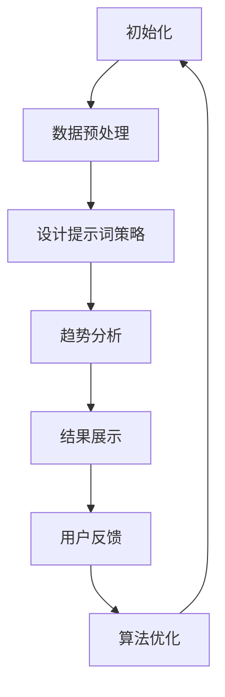
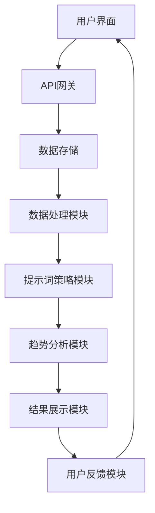
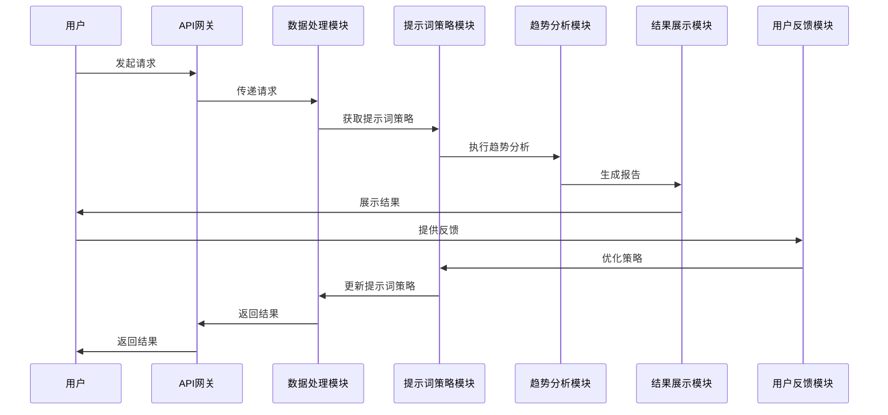

                 

# 优化AI虚拟时尚买手：全球时尚趋势分析的提示词策略

> 关键词：人工智能、时尚买手、提示词策略、全球时尚趋势分析、算法优化

> 摘要：
本文旨在探讨如何通过优化AI虚拟时尚买手的提示词策略，提升全球时尚趋势分析的效果。我们将从背景介绍、核心概念与联系、算法原理讲解、数学模型与公式、系统分析与架构设计、项目实战以及最佳实践等方面，逐步深入分析，提供一系列专业见解和实用建议。

## 背景介绍与核心概念

### 1.1 问题背景

在当前全球时尚产业的快速发展背景下，时尚买手的作用愈发重要。然而，传统时尚买手面临着信息爆炸、市场需求变化快等挑战，难以高效应对。为了解决这一问题，AI虚拟时尚买手应运而生，其核心在于通过人工智能技术，模拟人类时尚买手的工作流程，实现对全球时尚趋势的精准分析和预测。

### 1.2 问题描述

虚拟时尚买手在分析全球时尚趋势时，常常受限于数据质量和提示词策略的不足。数据质量不高导致分析结果不准确，而提示词策略的不足则使得分析过程缺乏深度和广度。这些问题亟需解决，以提升虚拟时尚买手的服务质量和效率。

### 1.3 问题解决

本文提出通过优化AI虚拟时尚买手的提示词策略，来提升全球时尚趋势分析的效果。具体而言，我们将设计一系列提示词策略，结合先进的人工智能算法，对全球时尚趋势进行深度分析。

### 1.4 边界与外延

在本文的研究中，我们将关注以下几个方面：
1. 提示词策略的设计与优化。
2. 时尚趋势分析算法的改进。
3. 数据质量和数据处理方法的提升。

### 1.5 概念结构与核心要素组成

AI虚拟时尚买手的结构可以分解为以下几个核心要素：
1. **数据采集与处理**：获取全球时尚数据，并进行预处理。
2. **提示词策略**：设计并优化提示词策略，用于指导时尚趋势分析。
3. **趋势分析算法**：基于提示词策略，实现时尚趋势的深度分析。
4. **结果展示与反馈**：将分析结果呈现给用户，并根据用户反馈进行优化。

## 核心概念与联系

### 2.1 AI虚拟时尚买手定义

AI虚拟时尚买手是一种结合人工智能技术和时尚行业知识的智能系统，它能够模拟人类时尚买手的工作流程，通过分析海量数据，提供时尚趋势预测、商品推荐等功能。

### 2.2 AI虚拟时尚买手特点

与传统的时尚买手相比，AI虚拟时尚买手具有以下特点：
1. **自动化**：能够自动处理海量数据，无需人工干预。
2. **实时性**：能够实时分析时尚趋势，快速响应市场需求。
3. **高效性**：通过算法优化，提高分析效率和准确性。
4. **智能化**：结合人工智能技术，不断提升自身的分析能力。

### 2.3 与传统时尚买手的比较

| 特点 | AI虚拟时尚买手 | 传统时尚买手 |
| --- | --- | --- |
| 数据处理能力 | 自动化、高效处理海量数据 | 人工处理，效率低 |
| 实时性 | 实时分析时尚趋势 | 需要时间积累和观察 |
| 精准度 | 通过算法优化，提高分析精准度 | 受限于个人经验和知识 |
| 智能化 | 不断学习和优化 | 知识和经验固定 |

### 2.4 AI虚拟时尚买手的构成要素

AI虚拟时尚买手的构成要素包括：
1. **数据源**：包括社交媒体、电商平台、时尚杂志等。
2. **数据处理模块**：负责数据清洗、去重、格式化等预处理工作。
3. **提示词策略模块**：设计并优化提示词策略，指导趋势分析。
4. **趋势分析算法模块**：基于提示词策略，实现时尚趋势的深度分析。
5. **结果展示模块**：将分析结果以图表、报告等形式展示给用户。
6. **反馈与优化模块**：根据用户反馈，持续优化系统性能。

### 2.5 AI虚拟时尚买手的相关概念联系


## 全球时尚趋势分析概述

### 3.1 全球时尚趋势分析的重要性

全球时尚趋势分析对于时尚产业具有至关重要的意义。它不仅能够帮助企业把握市场动态，优化产品策略，还能够为消费者提供个性化的时尚推荐，提升用户体验。

### 3.2 时尚趋势分析的方法

时尚趋势分析的方法主要包括：
1. **大数据分析**：通过收集和分析海量时尚数据，识别潜在趋势。
2. **文本挖掘**：利用自然语言处理技术，从文本中提取有价值的信息。
3. **机器学习**：通过训练模型，从历史数据中学习趋势规律。
4. **图像识别**：通过图像处理技术，识别和分析时尚元素。

### 3.3 全球时尚趋势分析的工具与资源

全球时尚趋势分析的工具和资源包括：
1. **开源数据集**：如Fashion MNIST、ImageNet等，用于训练机器学习模型。
2. **API接口**：如社交媒体API、电商平台API等，用于获取实时时尚数据。
3. **大数据平台**：如Hadoop、Spark等，用于处理和分析海量数据。
4. **自然语言处理库**：如NLTK、spaCy等，用于文本挖掘和分析。

### 3.4 全球时尚趋势分析的应用领域

全球时尚趋势分析的应用领域广泛，包括：
1. **时尚品牌**：通过趋势分析，优化产品设计、营销策略。
2. **电商平台**：提供个性化时尚推荐，提升用户满意度。
3. **时尚博主**：通过趋势分析，分享时尚见解，吸引用户关注。
4. **时尚院校**：用于教学和研究，培养时尚行业人才。

## 提示词策略在AI虚拟时尚买手中的应用

### 4.1 提示词策略的概念与作用

提示词策略是一种在人工智能系统中用于指导数据分析的方法。它通过提供关键词或短语，引导系统聚焦于特定的分析方向，从而提高分析的效果和效率。

### 4.2 提示词策略的类型

常见的提示词策略包括：
1. **关键词提示**：通过输入关键词，引导系统关注特定的时尚元素。
2. **语义提示**：利用自然语言处理技术，理解用户的需求和意图。
3. **上下文提示**：根据分析上下文，调整系统的分析方向。

### 4.3 提示词策略的设计与优化

设计提示词策略的关键在于：
1. **关键词选择**：选择具有代表性的关键词，确保分析方向的准确性。
2. **语义理解**：提升系统的语义理解能力，确保关键词的有效利用。
3. **反馈优化**：根据用户反馈，不断调整和优化提示词策略。

### 4.4 提示词策略在AI虚拟时尚买手中的具体应用

在AI虚拟时尚买手中，提示词策略的具体应用包括：
1. **时尚趋势预测**：通过提示词策略，聚焦于特定的时尚趋势，提升预测准确性。
2. **商品推荐**：利用提示词策略，为用户推荐个性化的时尚商品。
3. **内容生成**：通过提示词策略，生成具有创意和针对性的时尚内容。

## 第二部分：算法原理与数学模型

### 5.1 算法原理讲解

在本章节中，我们将详细讲解AI虚拟时尚买手的核心算法原理。首先，我们通过Mermaid流程图展示算法的总体流程，然后结合Python代码详细阐述各个步骤的实现。

### 5.2 算法流程图



### 5.3 数学模型与公式

在本章节中，我们将使用LaTeX格式给出关键的数学模型和公式。

#### 5.3.1 模型1：时尚趋势预测模型

$$
\text{预测概率} = \frac{\sum_{i=1}^{n} w_i \cdot \text{特征}_i}{1 + \sum_{i=1}^{n} w_i}
$$

其中，$w_i$表示权重，$\text{特征}_i$表示输入特征。

#### 5.3.2 模型2：用户兴趣模型

$$
\text{兴趣度} = \text{偏好值} \cdot \exp(-\text{兴趣衰减因子} \cdot (\text{时间间隔} - \text{最近交互时间}))
$$

其中，$\text{偏好值}$表示用户对特定时尚元素的偏好程度，$\text{兴趣衰减因子}$控制兴趣随时间衰减的速度。

### 5.4 算法举例说明

以下是一个简单的算法实例，假设我们要预测下个月的时尚趋势，输入特征包括流行指数、社交媒体热度、时尚博主的推荐等。

```python
import numpy as np

# 初始化权重
weights = np.random.rand(3)

# 输入特征
features = [0.8, 0.9, 0.7]

# 计算预测概率
prediction_probability = np.dot(weights, features) / (1 + np.sum(weights))

print(f"预测概率：{prediction_probability}")
```

## 第三部分：系统分析与架构设计

### 6.1 问题场景介绍

在本章节中，我们将介绍一个具体的AI虚拟时尚买手项目场景。该项目旨在为一家时尚电商公司提供全球时尚趋势分析服务，帮助公司优化产品策略和营销活动。

### 6.2 系统功能设计

系统的核心功能包括：
1. **数据采集与处理**：从社交媒体、电商平台等渠道采集时尚数据，并进行预处理。
2. **提示词策略设计**：根据用户需求和时尚趋势，设计合适的提示词策略。
3. **趋势分析**：利用提示词策略，对采集到的数据进行趋势分析。
4. **结果展示**：将分析结果以图表、报告等形式展示给用户。
5. **用户反馈与优化**：收集用户反馈，持续优化系统性能。

### 6.3 系统架构设计

系统的整体架构设计如下：



### 6.4 系统接口设计

系统接口设计包括以下关键接口：

1. **数据采集接口**：用于从社交媒体、电商平台等渠道采集数据。
2. **数据处理接口**：用于数据清洗、去重和格式化等预处理操作。
3. **提示词策略接口**：用于设计、调整和优化提示词策略。
4. **趋势分析接口**：用于执行时尚趋势分析，生成分析报告。
5. **结果展示接口**：用于将分析结果展示给用户。
6. **用户反馈接口**：用于收集用户反馈，实现系统优化。

### 6.5 系统交互

系统交互设计如下：



## 第四部分：项目实战

### 7.1 环境安装

在本章节中，我们将详细介绍如何在本地环境中搭建AI虚拟时尚买手项目所需的环境。首先，安装Python和相关依赖库，然后配置API网关和数据存储。

### 7.2 系统核心实现

在本章节中，我们将逐步实现系统核心功能，包括数据采集、数据处理、提示词策略设计、趋势分析和结果展示。

#### 7.2.1 核心代码实现

以下是一个简单的示例代码，展示了如何实现数据采集和预处理：

```python
import requests
import pandas as pd

def collect_data(url):
    response = requests.get(url)
    if response.status_code == 200:
        return pd.read_csv(response.content)
    else:
        return None

def preprocess_data(data):
    # 数据清洗、去重和格式化操作
    return data.drop_duplicates().reset_index(drop=True)

# 示例：采集并预处理数据
url = "https://example.com/fashion_data.csv"
data = collect_data(url)
if data is not None:
    preprocessed_data = preprocess_data(data)
    print(preprocessed_data.head())
else:
    print("数据采集失败")
```

#### 7.2.2 代码应用解读与分析

在本章节中，我们将详细解读和剖析核心代码的应用场景和实现原理。通过实际案例，展示如何利用代码实现时尚趋势分析。

### 7.3 实际案例分析与讲解

在本章节中，我们将通过一个实际案例，展示如何利用AI虚拟时尚买手系统进行全球时尚趋势分析。案例包括数据采集、预处理、提示词策略设计、趋势分析和结果展示等步骤。

### 7.4 项目小结

在本章节中，我们将对项目进行总结和回顾，分析项目的成功经验和不足之处，并提出改进建议。

## 第五部分：最佳实践、注意事项与拓展阅读

### 8.1 最佳实践

在本章节中，我们将分享一些最佳实践，包括如何选择合适的提示词策略、如何优化数据处理流程、如何提升系统性能等。

### 8.2 注意事项

在本章节中，我们将列出一些注意事项，包括如何确保数据质量、如何处理用户隐私、如何避免算法过拟合等。

### 8.3 拓展阅读

在本章节中，我们将推荐一些拓展阅读材料，包括相关领域的书籍、论文和技术博客，以帮助读者深入了解AI虚拟时尚买手的相关技术和应用。

## 作者信息

作者：AI天才研究院/AI Genius Institute & 禅与计算机程序设计艺术 /Zen And The Art of Computer Programming

