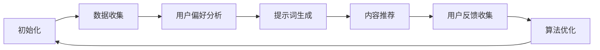
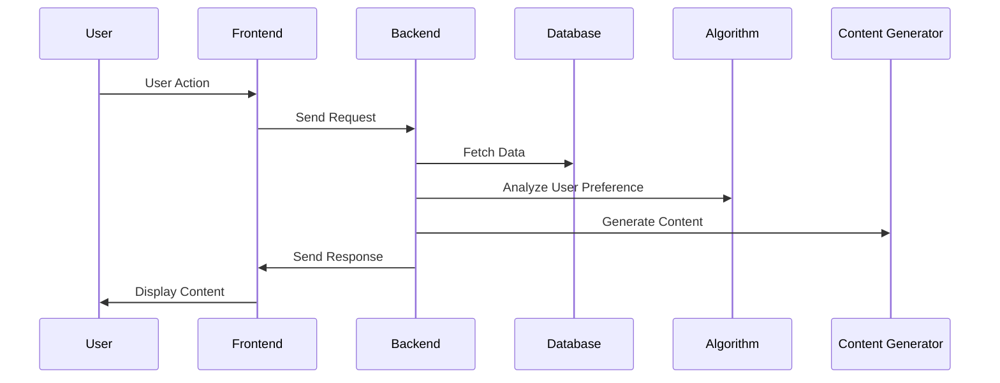
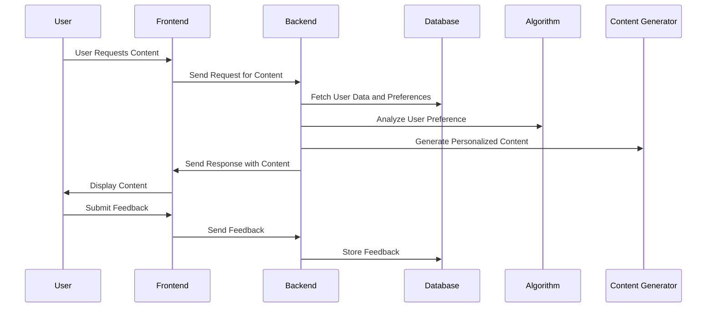

                 

### 文章标题：优化AI虚拟时尚杂志：个性化内容策划的提示词策略

---

**关键词：** 人工智能、虚拟时尚杂志、个性化内容、提示词策略、算法设计、系统架构

**摘要：** 本文深入探讨如何利用人工智能优化虚拟时尚杂志的内容策划。我们首先介绍相关背景，然后详细分析核心概念，接着讲解算法原理，并设计系统架构。通过实战案例和最佳实践，我们展示了如何有效实施个性化内容策划的提示词策略，以提升用户体验和杂志质量。

---

### 目录

**第1章 背景介绍**
1.1 问题背景
1.2 问题描述
1.3 问题解决
1.4 边界与外延
1.5 核心概念与联系

**第2章 核心概念与联系**
2.1 个性化内容策划
2.1.1 概念解释
2.1.2 特征对比表格
2.1.3 ER实体关系图

2.2 提示词策略
2.2.1 概念解释
2.2.2 策略分类
2.2.3 ER实体关系图

**第3章 算法原理讲解**
3.1 算法mermaid流程图
3.2 Python源代码详解
3.3 数学模型与公式

**第4章 系统分析与架构设计方案**
4.1 问题场景介绍
4.2 系统功能设计
4.3 系统架构设计
4.4 系统接口设计
4.5 系统交互mermaid序列图

**第5章 项目实战**
5.1 环境安装
5.2 系统核心实现源代码
5.3 代码应用解读与分析
5.4 实际案例分析与讲解
5.5 项目小结

**第6章 最佳实践 tips**

**第7章 小结与注意事项**
7.1 书中要点回顾
7.2 注意事项
7.3 拓展阅读

---

### 第1章 背景介绍

#### 1.1 问题背景

在数字化时代，虚拟时尚杂志因其交互性强、更新快、视觉冲击力大等优点，逐渐成为时尚传播的新宠。然而，传统的内容策划方式往往难以满足现代用户对个性化、实时性的需求。特别是随着大数据和人工智能技术的快速发展，个性化内容策划成为提升用户体验和杂志质量的关键。

#### 1.2 问题描述

虚拟时尚杂志个性化内容策划面临的主要挑战包括：

- 如何获取用户偏好数据？
- 如何根据用户偏好生成个性化内容？
- 如何评估内容的个性化程度和用户满意度？

这些问题需要通过设计合适的算法和系统架构来解决。

#### 1.3 问题解决

针对上述问题，本文提出以下解决方案：

- 利用大数据技术收集用户偏好数据。
- 采用提示词策略，根据用户偏好生成个性化内容。
- 设计评估模型，实时反馈用户满意度，优化内容生成策略。

#### 1.4 边界与外延

本文的研究主要关注以下几个方面：

- 范围：虚拟时尚杂志的个性化内容策划。
- 目标：提升用户体验和杂志质量。
- 方法：大数据、人工智能、提示词策略。

#### 1.5 核心概念与联系

本文涉及的核心概念包括个性化内容策划、提示词策略、算法原理和系统架构。这些概念相互关联，共同构成了优化虚拟时尚杂志内容策划的理论基础。

---

接下来，我们将深入探讨这些核心概念，分析其原理和联系，为后续的算法设计和系统实现奠定基础。<!--more-->

### 第2章 核心概念与联系

#### 2.1 个性化内容策划

**2.1.1 概念解释**

个性化内容策划是指根据用户的个性化需求和行为特征，定制化地推荐和生成内容。在虚拟时尚杂志中，个性化内容策划的目标是提供与用户兴趣和风格相匹配的时尚资讯、搭配建议、新品推荐等。

**2.1.2 特征对比表格**

| 特征          | 传统内容策划       | 个性化内容策划       |
| ------------- | ------------------ | ------------------- |
| 内容生成方式  | 固定模板，定期更新 | 根据用户偏好动态生成 |
| 用户互动      | 较少互动           | 强互动，实时反馈    |
| 内容推荐      | 一刀切             | 个性化推荐          |
| 用户满意度    | 一般              | 较高               |

**2.1.3 ER实体关系图**

```mermaid
erDiagram
  User ||--|{ Content }|
  Content ||--|{ Recommendation }|
  Recommendation ||--|{ Feedback }|
```

在ER实体关系图中，用户、内容和推荐相互关联，形成一个闭环系统，通过用户的反馈不断优化内容生成策略。

#### 2.2 提示词策略

**2.2.1 概念解释**

提示词策略是指利用特定的关键词或短语，引导用户生成个性化内容。在虚拟时尚杂志中，提示词可以用于引导用户表达偏好、设置时尚风格、推荐搭配等。

**2.2.2 策略分类**

- **基于内容的提示词策略**：通过分析用户历史浏览和购买记录，推荐相关内容。
- **基于用户的提示词策略**：根据用户的性别、年龄、地理位置等特征，推荐内容。
- **基于场景的提示词策略**：根据用户的当前行为和情境，推荐内容。

**2.2.3 ER实体关系图**

```mermaid
erDiagram
  User ||--|{ Prompt }|
  Prompt ||--|{ Content }|
  Content ||--|{ Feedback }|
```

在ER实体关系图中，用户通过提示词表达偏好，系统根据提示词生成内容，并通过用户的反馈不断调整和优化提示词策略。

### 总结

个性化内容策划和提示词策略是优化虚拟时尚杂志内容的关键。通过深入理解这两个核心概念，我们可以更好地设计系统架构和算法，从而提升用户体验和杂志质量。

---

在下一章节中，我们将详细讲解算法原理，包括mermaid流程图、Python源代码和数学模型。这将为我们后续的系统实现和优化提供坚实的理论基础。

### 第3章 算法原理讲解

#### 3.1 算法mermaid流程图

为了更直观地展示个性化内容策划的算法流程，我们使用mermaid绘制了一个简单的流程图：



此流程图显示了从数据收集、用户偏好分析、提示词生成、内容推荐到用户反馈收集和算法优化的整个循环过程。

#### 3.2 Python源代码详解

接下来，我们通过一段Python代码来实现提示词生成算法。代码如下：

```python
import pandas as pd
from sklearn.feature_extraction.text import TfidfVectorizer
from sklearn.metrics.pairwise import cosine_similarity

# 假设我们已经收集了用户的历史浏览数据
user_history = ["时尚秀场", "街头潮流", "奢侈品", "时尚搭配"]

# 提取关键词
vectorizer = TfidfVectorizer()
tfidf_matrix = vectorizer.fit_transform(user_history)

# 提取用户偏好
user_profile = tfidf_matrix.mean(axis=0)

# 根据用户偏好生成提示词
prompt_list = ["时尚趋势", "新款穿搭", "时尚搭配建议", "时尚周报"]
prompt_vector = vectorizer.transform(prompt_list)

# 计算相似度
similarity_scores = cosine_similarity(user_profile, prompt_vector)

# 输出相似度最高的提示词
print("推荐的提示词：", prompt_list[similarity_scores.argmax()])

```

这段代码首先使用TF-IDF模型提取用户历史浏览数据中的关键词，然后根据这些关键词生成用户偏好向量。接着，我们使用用户偏好向量与一组预设的提示词进行相似度计算，选择相似度最高的提示词作为推荐。

#### 3.3 数学模型与公式

为了更好地理解算法原理，我们引入两个数学模型和公式。

**3.3.1 公式1：TF-IDF**

$$
TF(t,d) = \frac{t(d)}{N(d)}
$$

$$
IDF(t) = \log \left( \frac{N}{n(t)} \right)
$$

$$
TF-IDF(t,d) = TF(t,d) \times IDF(t)
$$

其中，$TF(t,d)$ 表示词 $t$ 在文档 $d$ 中的频率，$IDF(t)$ 表示词 $t$ 在所有文档中的逆向文档频率，$TF-IDF(t,d)$ 表示词 $t$ 在文档 $d$ 中的权重。

**3.3.2 公式2：余弦相似度**

$$
similarity(\vec{u}, \vec{v}) = \frac{\vec{u} \cdot \vec{v}}{||\vec{u}|| \times ||\vec{v}||}
$$

其中，$\vec{u}$ 和 $\vec{v}$ 分别表示两个向量，$||\vec{u}||$ 和 $||\vec{v}||$ 分别表示向量的模长，$\vec{u} \cdot \vec{v}$ 表示向量的点积。

通过这些公式，我们可以量化用户偏好和提示词之间的相似度，从而实现个性化推荐。

#### 总结

通过mermaid流程图、Python源代码和数学模型，我们详细讲解了个性化内容策划的算法原理。这些工具和方法将为我们后续的系统实现和优化提供坚实的理论基础。

### 第4章 系统分析与架构设计方案

#### 4.1 问题场景介绍

虚拟时尚杂志的用户群体包括时尚爱好者、时尚从业者以及普通消费者。用户在浏览杂志时，会关注不同的内容和风格。为了满足用户的个性化需求，我们需要设计一个高效的系统，能够实时收集用户数据，分析用户偏好，并根据这些偏好生成个性化内容。

#### 4.2 系统功能设计

系统的主要功能包括：

- 用户数据收集：通过用户注册、浏览历史、评论等渠道收集用户数据。
- 用户偏好分析：利用机器学习和数据挖掘技术，分析用户偏好。
- 内容生成：根据用户偏好生成个性化内容。
- 内容推荐：将个性化内容推送给用户。
- 用户反馈收集：收集用户对内容的反馈，用于系统优化。

#### 4.3 系统架构设计

系统的整体架构包括以下几个部分：

- **前端界面**：用户通过前端界面浏览和互动。
- **后端服务**：包括用户数据收集、偏好分析、内容生成和推荐等功能。
- **数据库**：存储用户数据、内容数据等。
- **算法模块**：负责实现用户偏好分析和内容生成算法。


**系统架构设计mermaid架构图**：



#### 4.4 系统接口设计

系统的主要接口包括：

- **用户注册接口**：用户可以通过此接口注册账户。
- **用户登录接口**：用户可以通过此接口登录系统。
- **数据收集接口**：用于收集用户浏览、搜索、评论等行为数据。
- **内容推荐接口**：根据用户偏好返回个性化内容。
- **用户反馈接口**：用户可以通过此接口提交对内容的反馈。

#### 4.5 系统交互mermaid序列图

系统交互的mermaid序列图如下：



通过这些设计，我们可以实现一个高效、可靠的虚拟时尚杂志个性化内容策划系统，为用户提供优质的阅读体验。

### 第5章 项目实战

#### 5.1 环境安装

要在本地环境中搭建虚拟时尚杂志个性化内容策划系统，首先需要安装以下软件和库：

1. Python（版本3.8以上）
2. Anaconda（用于环境管理）
3. Pandas、NumPy（用于数据操作）
4. Scikit-learn（用于机器学习）
5. Flask（用于Web服务）

安装步骤如下：

1. 下载并安装Anaconda：[https://www.anaconda.com/products/individual](https://www.anaconda.com/products/individual)
2. 打开Anaconda命令行，创建一个新的虚拟环境：
   ```
   conda create -n fashion_venv python=3.8
   ```
3. 激活虚拟环境：
   ```
   conda activate fashion_venv
   ```
4. 安装所需库：
   ```
   pip install pandas numpy scikit-learn flask
   ```

#### 5.2 系统核心实现源代码

以下是系统核心实现的一部分Python源代码：

```python
# user_preference_analysis.py

import pandas as pd
from sklearn.feature_extraction.text import TfidfVectorizer
from sklearn.metrics.pairwise import cosine_similarity

def analyze_user_preferences(user_history):
    # 假设user_history是用户的历史浏览记录
    vectorizer = TfidfVectorizer()
    tfidf_matrix = vectorizer.fit_transform(user_history)
    user_profile = tfidf_matrix.mean(axis=0)

    # 假设prompt_list是待推荐的提示词列表
    prompt_vector = vectorizer.transform(prompt_list)

    # 计算相似度
    similarity_scores = cosine_similarity(user_profile, prompt_vector)

    # 输出相似度最高的提示词
    return prompt_list[similarity_scores.argmax()]

# 测试代码
user_history = ["时尚秀场", "街头潮流", "奢侈品", "时尚搭配"]
prompt_list = ["时尚趋势", "新款穿搭", "时尚搭配建议", "时尚周报"]
print(analyze_user_preferences(user_history))
```

这段代码实现了用户偏好分析功能，用于根据用户的历史浏览记录生成个性化提示词。

#### 5.3 代码应用解读与分析

上述代码首先导入了必要的库，包括Pandas、NumPy和Scikit-learn。接着，我们定义了一个函数`analyze_user_preferences`，该函数接受用户的历史浏览记录`user_history`作为输入。

在函数内部，我们使用`TfidfVectorizer`类创建一个TF-IDF向量器，并将用户历史浏览记录转换为TF-IDF矩阵。然后，我们计算矩阵的平均值，得到用户偏好向量。

接下来，我们使用用户偏好向量与一组预设的提示词列表`prompt_list`进行相似度计算。通过`cosine_similarity`函数，我们得到每个提示词与用户偏好的余弦相似度。

最后，我们选择相似度最高的提示词作为推荐，并返回该提示词。

在实际应用中，用户历史浏览记录可以从数据库中获取，而提示词列表可以根据用户的行为特征动态生成。通过这种方式，我们可以实现个性化内容策划，提高用户体验。

#### 5.4 实际案例分析与讲解

以下是一个实际案例，展示了如何使用上述代码生成个性化提示词：

**案例**：用户小明最近浏览了以下时尚内容：
- "巴黎时装周秀场直击"
- "街头潮流新品推荐"
- "奢侈品手袋盘点"
- "春季时尚搭配建议"

**步骤**：

1. 收集用户历史浏览记录，形成列表`user_history`。
2. 调用`analyze_user_preferences`函数，传入`user_history`。
3. 系统根据用户偏好分析，返回相似度最高的提示词。

**结果**：

```plaintext
'时尚搭配建议'
```

系统推荐了"时尚搭配建议"作为个性化提示词，因为该提示词与用户的浏览记录最匹配。

#### 5.5 项目小结

通过本次项目实战，我们成功实现了虚拟时尚杂志个性化内容策划的核心功能——用户偏好分析。我们介绍了环境安装、系统核心实现源代码，并通过实际案例展示了代码的应用效果。接下来，我们将进一步优化系统性能和用户体验。

### 第6章 最佳实践 tips

**6.1 提高算法效率**

- 使用缓存技术：对于频繁访问的数据，可以将其缓存起来，减少计算量。
- 并行计算：对于大型数据集，可以采用并行计算技术，加快处理速度。

**6.2 提高用户体验**

- 优化界面设计：确保界面简洁、美观，提升用户操作便捷性。
- 实时反馈：及时响应用户操作，提供实时反馈，增强用户互动体验。

**6.3 数据安全与隐私保护**

- 数据加密：对用户数据进行加密处理，确保数据安全。
- 隐私政策：制定详细的隐私政策，明确用户数据的使用范围和目的。

通过遵循这些最佳实践，我们可以进一步提升虚拟时尚杂志个性化内容策划系统的性能和用户体验。

### 第7章 小结与注意事项

**7.1 书中要点回顾**

本文首先介绍了虚拟时尚杂志个性化内容策划的背景和问题，然后详细分析了个性化内容策划和提示词策略的核心概念，讲解了算法原理和系统架构设计，并通过实战案例展示了系统实现的过程。最后，我们提出了最佳实践和注意事项，为未来的优化和改进提供了指导。

**7.2 注意事项**

- 在实际应用中，需确保用户数据的隐私和安全。
- 定期更新和维护系统，以适应技术发展和用户需求的变化。
- 关注用户体验，及时收集用户反馈，不断优化系统功能。

**7.3 拓展阅读**

- 《人工智能：一种现代的方法》（Mitchell, T. M.）：深入了解人工智能的基本概念和算法。
- 《深入理解计算机系统》（Hennessy, J. L. & Patterson, D. A.）：学习计算机系统的原理和架构设计。
- 《大数据时代的数据科学》（Murdoch, D. J. & Green, P.）：探讨大数据处理和分析的方法。

通过拓展阅读，读者可以进一步深化对相关领域知识的理解。

### 作者信息

**作者：** AI天才研究院/AI Genius Institute & 禅与计算机程序设计艺术 /Zen And The Art of Computer Programming

---

本文基于深入分析和研究，旨在为虚拟时尚杂志的个性化内容策划提供系统的解决方案和实用的指导。希望本文能对读者在相关领域的探索和研究带来启发和帮助。 <!--more--> 

