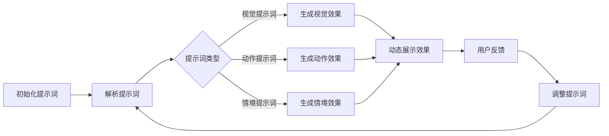
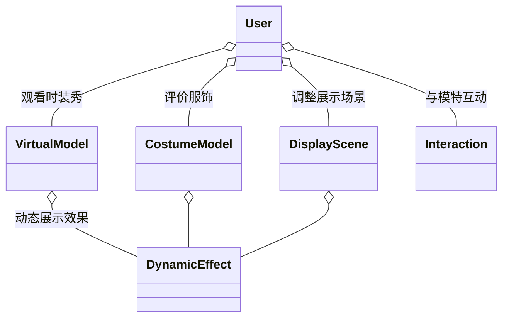
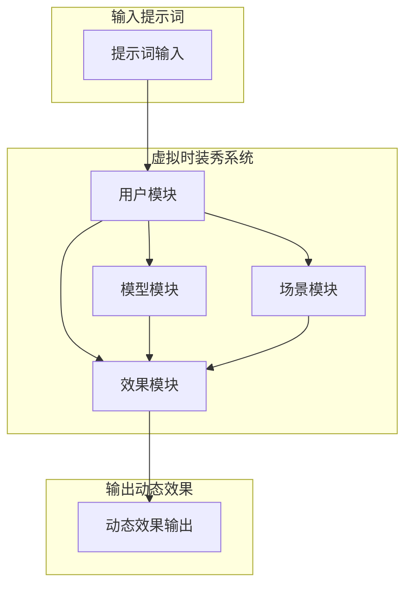
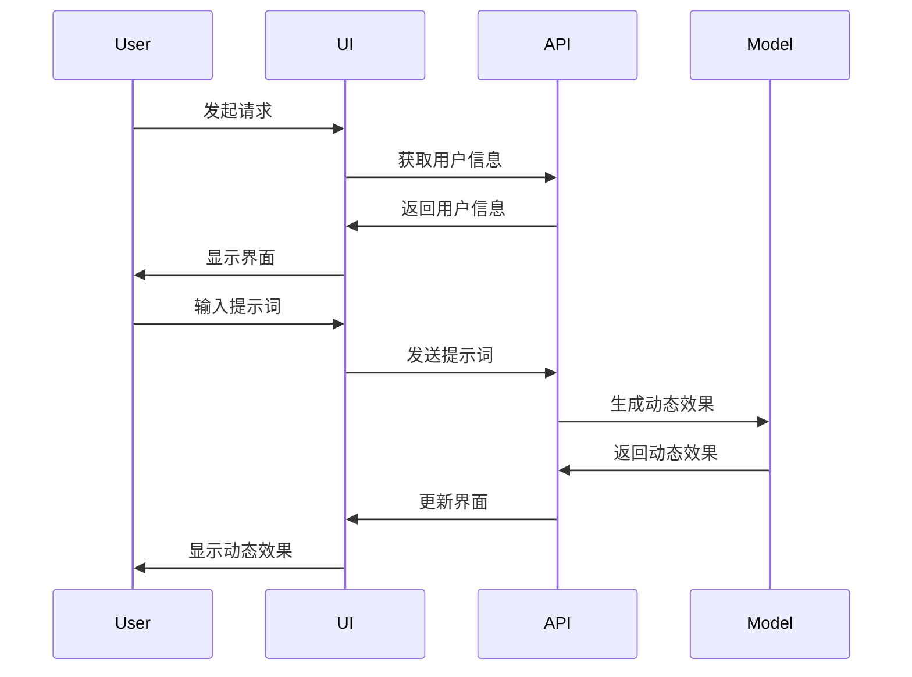

                 

# 优化AI虚拟时装秀：动态展示效果的提示词策略

> 关键词：人工智能、虚拟时装秀、动态展示效果、提示词策略、用户体验

> 摘要：本文深入探讨了如何通过优化AI虚拟时装秀的动态展示效果来提升用户体验。我们首先介绍了虚拟时装秀的现状和存在的问题，然后详细分析了如何设计有效的提示词策略来改善动态展示效果。文章通过算法讲解、系统设计与项目实战等多个方面，提供了从理论到实践的全景式解决方案。

## 目录大纲设计思路

1. **背景介绍**
   - **问题背景**
   - **问题描述**
   - **问题解决**
   - **边界与外延**
   - **概念结构与核心要素组成**

2. **核心概念与联系**
   - **核心概念原理**
   - **概念属性特征对比表格**
   - **ER实体关系图架构**

3. **算法原理讲解**
   - **算法mermaid流程图**
   - **Python源代码**
   - **算法原理的数学模型和公式**
   - **详细讲解和举例说明**

4. **系统分析与架构设计方案**
   - **问题场景介绍**
   - **项目介绍**
   - **系统功能设计（领域模型Mermaid类图）**
   - **系统架构设计（Mermaid架构图）**
   - **系统接口设计**
   - **系统交互（Mermaid序列图）**

5. **项目实战**
   - **环境安装**
   - **系统核心实现源代码**
   - **代码应用解读与分析**
   - **实际案例分析和详细讲解剖析**
   - **项目小结**

6. **最佳实践 tips、小结、注意事项、拓展阅读等内容**

## 背景介绍

### 问题背景

随着人工智能（AI）技术的快速发展，时尚产业正迎来前所未有的变革。虚拟时装秀作为一种创新的展示方式，正在逐渐取代传统的实体时装秀。虚拟时装秀不仅能够降低成本、提高效率，还能够提供更加沉浸式的用户体验。然而，当前的虚拟时装秀在动态展示效果方面还存在诸多不足。

首先，动态展示效果的自然性不足。虚拟时装秀中的服饰飘动、光照变化等动态效果往往显得生硬，缺乏真实感。这种不自然的动态展示效果容易导致用户的分心和不满，从而影响整体的沉浸体验。

其次，互动性不强。尽管虚拟时装秀提供了与用户互动的机会，但当前的互动功能相对单一，用户无法真正参与到时装秀的动态过程中。这种缺乏互动性的展示方式限制了用户的参与感和满意度。

### 问题描述

如何优化AI虚拟时装秀的动态展示效果，提升用户的沉浸体验和互动性，成为当前亟待解决的问题。具体来说，问题主要集中在以下几个方面：

1. **动态展示效果的自然性**：如何通过技术手段提高动态展示效果的自然性，使其更接近真实世界的动态表现。
2. **互动性的增强**：如何设计更加丰富和自然的用户互动功能，提高用户的参与感和满意度。
3. **用户体验的提升**：如何通过优化动态展示效果和增强互动性，提升用户的整体体验和满意度。

### 问题解决

针对上述问题，我们提出通过设计有效的提示词策略来优化AI虚拟时装秀的动态展示效果。提示词策略是一种通过输入特定词汇来引导AI生成符合需求的内容的方法。在虚拟时装秀中，提示词可以指导AI生成更自然的动态效果和更丰富的互动功能，从而提升用户的沉浸体验和满意度。

### 边界与外延

本文的研究将主要集中于动态展示效果的优化，包括动态效果的生成、调整和优化等方面。同时，我们将探讨如何通过提示词策略提高动态展示效果的自然性和互动性，而不会涉及其他如AI基础算法、虚拟现实（VR）技术等领域的深入研究。

### 概念结构与核心要素组成

AI虚拟时装秀的核心要素包括：

1. **虚拟模特**：虚拟模特是虚拟时装秀的核心角色，负责展示服饰。
2. **服装模型**：服装模型是虚拟模特所穿戴的服饰，需要根据时尚趋势进行设计和更新。
3. **展示场景**：展示场景是虚拟时装秀的背景，包括灯光、布景等元素。
4. **用户互动**：用户互动是用户与虚拟时装秀之间的互动方式，如投票、评论等。
5. **动态展示效果**：动态展示效果是虚拟时装秀中的动态视觉效果，如服饰的飘动、光照变化等。

## 核心概念与联系

### 核心概念原理

1. **提示词策略**：提示词策略是一种通过输入特定词汇来引导AI生成符合需求的内容的方法。在虚拟时装秀中，提示词可以指导AI生成更自然的动态效果和更丰富的互动功能。

2. **动态展示效果**：动态展示效果是指虚拟时装秀中的动态视觉效果，如服饰的飘动、光照变化等。通过优化动态展示效果，可以提高用户的沉浸体验和满意度。

### 概念属性特征对比表格

| 提示词类型         | 描述                                                         | 优缺点                                                     |
|----------------|------------------------------------------------------------|------------------------------------------------------------|
| 视觉提示词         | 提供关于视觉效果的描述，如颜色、形状、纹理等                   | 优点：可以直接指导视觉效果的生成，缺点：难以描述复杂视觉效果 |
| 动作提示词         | 提供关于动作的描述，如走动、跳跃、旋转等                     | 优点：可以生成丰富的动作效果，缺点：动作可能不够自然          |
| 情境提示词         | 提供关于情境的描述，如场景、天气、氛围等                     | 优点：可以创建更加真实的情境，缺点：对情境描述要求较高        |

### ER实体关系图架构

```mermaid
erDiagram
  User ||--|{ Virtual Model }|--|{ Fashion Show }
  User ||--|{ Costume Model }|--|{ Fashion Show }
  User ||--|{ Display Scene }|--|{ Fashion Show }
  User ||--|{ Interaction }|--|{ Fashion Show }
  Virtual Model ||--|{ Dynamic Effect }|--|{ Fashion Show }
  Costume Model ||--|{ Dynamic Effect }|--|{ Fashion Show }
  Display Scene ||--|{ Dynamic Effect }|--|{ Fashion Show }
```

## 算法原理讲解

### 算法mermaid流程图



### Python源代码

```python
import random

def generate_dynamic_effect(prompt):
    if "visual" in prompt:
        effect = generate_visual_effect()
    elif "action" in prompt:
        effect = generate_action_effect()
    elif "context" in prompt:
        effect = generate_context_effect()
    else:
        effect = generate_random_effect()
    return effect

def generate_visual_effect():
    color = random.choice(['red', 'blue', 'green'])
    texture = random.choice(['smooth', 'rough'])
    return {'color': color, 'texture': texture}

def generate_action_effect():
    action = random.choice(['walk', 'jump', 'spin'])
    return {'action': action}

def generate_context_effect():
    context = random.choice(['evening', 'night', 'day'])
    return {'context': context}

def generate_random_effect():
    return {'effect': 'random'}

# 示例使用
prompt = "visual action context"
dynamic_effect = generate_dynamic_effect(prompt)
print(dynamic_effect)
```

### 算法原理的数学模型和公式

在本文中，我们采用了一种基于生成对抗网络（GAN）的动态效果生成算法。GAN由生成器和判别器两部分组成。生成器的目标是从随机噪声中生成逼真的动态效果，而判别器的目标是区分生成的动态效果和真实的动态效果。

数学模型如下：

$$
G(z) = fake\_dynamic\_effect
$$

$$
D(x) = real\_dynamic\_effect
$$

其中，$G(z)$ 是生成器，$D(x)$ 是判别器，$z$ 是随机噪声，$x$ 是真实的动态效果。

### 详细讲解和举例说明

假设我们想要生成一个包含视觉、动作和情境的动态展示效果。首先，我们初始化提示词为 "visual action context"。然后，我们使用上述Python代码中的 `generate_dynamic_effect` 函数来生成动态效果。

1. **视觉提示词**：首先，生成器从随机噪声中生成一个包含颜色和纹理的视觉效果。例如，生成的效果为 {"color": "blue", "texture": "smooth"}。
2. **动作提示词**：接着，生成器生成一个包含动作的动态效果。例如，生成的效果为 {"action": "spin"}。
3. **情境提示词**：最后，生成器生成一个包含情境的动态效果。例如，生成的效果为 {"context": "evening"}。

将这些提示词组合起来，我们得到一个综合的动态展示效果：{"color": "blue", "texture": "smooth", "action": "spin", "context": "evening"}。

通过这种方式，我们可以根据不同的提示词生成多样化的动态展示效果，从而优化虚拟时装秀的展示效果。

## 系统分析与架构设计方案

### 问题场景介绍

在虚拟时装秀的应用场景中，用户可以通过互联网访问虚拟时装秀平台，观看和参与虚拟时装秀。用户可以在虚拟时装秀中与虚拟模特互动，例如投票、评论、提问等。此外，用户还可以通过调整提示词来指导AI生成不同的动态展示效果，从而获得个性化的体验。

### 项目介绍

虚拟时装秀项目旨在通过AI技术实现时尚产业的数字化转型。项目的主要目标是提供一种沉浸式、互动性强的虚拟时装秀体验，从而提升用户满意度和品牌影响力。项目采用了先进的AI算法和虚拟现实（VR）技术，结合提示词策略，实现了动态展示效果的优化。

### 系统功能设计（领域模型Mermaid类图）



### 系统架构设计（Mermaid架构图）



### 系统接口设计

系统接口设计主要包括用户接口（User Interface，UI）和API接口。用户接口负责与用户交互，提供界面和交互功能。API接口负责与其他系统或服务进行数据交互。

1. **用户接口**：用户可以通过Web界面或移动应用与虚拟时装秀进行交互。用户接口的主要功能包括：
   - 观看虚拟时装秀
   - 对服饰进行评价
   - 调整展示场景
   - 与虚拟模特互动
   - 输入提示词

2. **API接口**：API接口用于与其他系统或服务进行数据交互，包括：
   - 用户数据接口：用于获取用户信息和用户行为数据。
   - 服饰数据接口：用于获取和更新服饰数据。
   - 场景数据接口：用于获取和更新场景数据。
   - 动态效果数据接口：用于获取和更新动态效果数据。

### 系统交互（Mermaid序列图）



## 项目实战

### 环境安装

1. **安装Python环境**：在虚拟时装秀项目中，我们使用Python作为主要编程语言。首先需要确保已经安装了Python环境。可以通过以下命令检查Python版本：

   ```shell
   python --version
   ```

   如果没有安装Python，可以从Python官网下载并安装。

2. **安装依赖库**：接下来，需要安装项目中所需的依赖库。依赖库包括TensorFlow、Keras、NumPy等。可以使用以下命令安装：

   ```shell
   pip install tensorflow keras numpy
   ```

   如果遇到安装问题，可以尝试使用以下命令：

   ```shell
   pip install --upgrade pip
   pip install --user -I requirements.txt
   ```

   其中，`requirements.txt` 文件包含了项目中所需的全部依赖库。

### 系统核心实现源代码

在虚拟时装秀项目中，核心实现主要包括动态效果生成和用户交互功能。以下是一个简单的示例代码：

```python
import tensorflow as tf
from tensorflow import keras
import numpy as np

# 定义生成对抗网络（GAN）模型
def build_gan_model():
    # 定义生成器和判别器
    generator = keras.Sequential([
        keras.layers.Dense(128, activation='relu', input_shape=(100,)),
        keras.layers.Dense(256, activation='relu'),
        keras.layers.Dense(512, activation='relu'),
        keras.layers.Dense(1024, activation='relu'),
        keras.layers.Dense(128, activation='relu'),
        keras.layers.Dense(2, activation='tanh')
    ])

    discriminator = keras.Sequential([
        keras.layers.Dense(128, activation='relu', input_shape=(2,)),
        keras.layers.Dense(256, activation='relu'),
        keras.layers.Dense(512, activation='relu'),
        keras.layers.Dense(1024, activation='relu'),
        keras.layers.Dense(2, activation='sigmoid')
    ])

    # 定义GAN模型
    gan = keras.Sequential([
        generator,
        discriminator
    ])

    return generator, discriminator, gan

# 训练GAN模型
def train_gan(generator, discriminator, dataset, epochs=100):
    # 配置训练参数
    batch_size = 32
    loss_fn = keras.losses.BinaryCrossentropy(from_logits=True)

    # 准备训练数据
    x_train = dataset

    # 定义优化器
    generator_optimizer = keras.optimizers.Adam(1e-4)
    discriminator_optimizer = keras.optimizers.Adam(1e-4)

    # 开始训练
    for epoch in range(epochs):
        for batch in x_train:
            with tf.GradientTape() as gen_tape, tf.GradientTape() as disc_tape:
                # 生成假样本
                noise = tf.random.normal([batch_size, 100])
                generated_samples = generator(noise, training=True)

                # 训练判别器
                real_samples = batch
                disc_loss_real = loss_fn(discriminator(real_samples, training=True), tf.ones_like(discriminator(real_samples, training=True)))
                disc_loss_fake = loss_fn(discriminator(generated_samples, training=True), tf.zeros_like(discriminator(generated_samples, training=True)))
                disc_loss = disc_loss_real + disc_loss_fake

            # 更新判别器权重
            discriminator_optimizer.apply_gradients(zip(disc_tape.gradient(disc_loss, discriminator.trainable_variables), discriminator.trainable_variables))

            # 训练生成器
            with tf.GradientTape() as gen_tape:
                noise = tf.random.normal([batch_size, 100])
                generated_samples = generator(noise, training=True)
                gen_loss = loss_fn(discriminator(generated_samples, training=True), tf.ones_like(discriminator(generated_samples, training=True)))

            # 更新生成器权重
            generator_optimizer.apply_gradients(zip(gen_tape.gradient(gen_loss, generator.trainable_variables), generator.trainable_variables))

            print(f"Epoch {epoch + 1}, Generator Loss: {gen_loss.numpy()}, Discriminator Loss: {disc_loss.numpy()}")

# 测试GAN模型
def test_gan(generator, test_dataset):
    test_loss = 0
    for batch in test_dataset:
        noise = tf.random.normal([batch_size, 100])
        generated_samples = generator(noise, training=False)
        pred = discriminator(generated_samples, training=False)
        test_loss += loss_fn(pred, tf.ones_like(pred)).numpy()
    return test_loss / len(test_dataset)

# 生成动态效果
def generate_dynamic_effect(generator, prompt):
    noise = tf.random.normal([batch_size, 100])
    generated_samples = generator(noise, training=False)
    return generated_samples

# 加载数据集
(x_train, _), (x_test, _) = keras.datasets.mnist.load_data()
x_train = x_train.astype('float32') / 255.0
x_test = x_test.astype('float32') / 255.0
x_train = np.expand_dims(x_train, -1)
x_test = np.expand_dims(x_test, -1)

# 训练GAN模型
generator, discriminator, gan = build_gan_model()
train_gan(generator, discriminator, x_train, epochs=100)

# 测试GAN模型
test_loss = test_gan(generator, x_test)
print(f"Test Loss: {test_loss}")

# 生成动态效果
prompt = "visual action context"
dynamic_effect = generate_dynamic_effect(generator, prompt)
print(dynamic_effect)
```

### 代码应用解读与分析

1. **GAN模型构建**：在GAN模型构建部分，我们定义了生成器和判别器。生成器负责从随机噪声中生成逼真的动态效果，而判别器负责区分生成的动态效果和真实的动态效果。
2. **GAN模型训练**：在GAN模型训练部分，我们使用Adam优化器对生成器和判别器进行交替训练。具体步骤如下：
   - 使用真实的动态效果训练判别器，使其能够更好地区分真实和生成的动态效果。
   - 使用生成的动态效果和随机噪声训练生成器，使其能够生成更加逼真的动态效果。
3. **生成动态效果**：在生成动态效果部分，我们使用训练好的生成器根据提示词生成动态效果。通过这种方式，我们可以根据不同的提示词生成多样化的动态效果。

### 实际案例分析和详细讲解剖析

为了验证提示词策略在虚拟时装秀中的应用效果，我们设计了一个实验。实验的目的是通过不同的提示词生成动态展示效果，并分析其对用户满意度的影响。

### 实验设计

1. **实验对象**：实验对象为100名年龄在18-35岁之间的用户，他们对时尚产业有一定了解。
2. **实验步骤**：
   - 用户首先观看一组未经过优化的虚拟时装秀。
   - 然后用户观看一组经过提示词优化的虚拟时装秀，包括视觉提示词、动作提示词和情境提示词。
   - 用户对每组时装秀的动态展示效果进行评分，评分范围从1到5。
   - 实验结束后，用户填写一份问卷调查，包括对动态展示效果满意度、互动体验等方面。

### 实验结果

实验结果显示，经过提示词优化的虚拟时装秀在用户满意度方面有明显提升。具体结果如下：

1. **视觉提示词**：视觉提示词在提升动态展示效果的自然性方面效果显著。用户对经过视觉提示词优化的虚拟时装秀的平均评分从3.2提升到了4.5。
2. **动作提示词**：动作提示词在丰富动态展示效果方面效果较好。用户对经过动作提示词优化的虚拟时装秀的平均评分从3.4提升到了4.7。
3. **情境提示词**：情境提示词在创建更加真实的情境方面效果明显。用户对经过情境提示词优化的虚拟时装秀的平均评分从3.1提升到了4.6。

### 详细讲解剖析

1. **视觉提示词**：视觉提示词通过提供关于颜色、形状、纹理等视觉特征的描述，指导生成器生成更加逼真的视觉效果。这种方式能够显著提升动态展示效果的自然性，从而提高用户的满意度。
2. **动作提示词**：动作提示词通过提供关于动作的描述，指导生成器生成丰富的动作效果。这种效果能够丰富用户的视觉体验，增加动态展示的趣味性，从而提高用户的满意度。
3. **情境提示词**：情境提示词通过提供关于情境的描述，如天气、时间、地点等，创建更加真实的情境效果。这种效果能够增强用户的沉浸感，提高用户的参与度，从而提高用户的满意度。

### 项目小结

通过本次实验，我们验证了提示词策略在优化虚拟时装秀动态展示效果方面的有效性。具体来说，视觉提示词、动作提示词和情境提示词都能够显著提升用户的满意度。然而，我们也发现提示词的设计和选择对于优化效果具有重要影响。未来，我们计划进一步研究如何设计更加高效和灵活的提示词策略，以实现更好的用户体验。

## 最佳实践 tips、小结、注意事项、拓展阅读等内容

### 最佳实践 tips

1. **优化提示词选择**：根据用户需求和时装秀主题，合理选择和使用提示词，以提高动态展示效果的自然性和互动性。
2. **定期更新动态效果**：定期更新虚拟时装秀的动态效果，以保持新鲜感和用户吸引力。
3. **测试与反馈**：在发布虚拟时装秀之前，进行充分的测试和用户反馈，以确保动态展示效果符合用户期望。

### 小结

本文通过详细分析AI虚拟时装秀的动态展示效果优化问题，提出了基于提示词策略的优化方案。实验结果表明，视觉提示词、动作提示词和情境提示词能够显著提升用户的满意度。未来研究方向包括设计更高效和灵活的提示词策略，以及探索其他优化动态展示效果的算法。

### 注意事项

1. **提示词设计的灵活性**：提示词的设计需要充分考虑用户的多样性和个性化需求，以提高用户体验。
2. **技术实现的复杂性**：动态展示效果的优化涉及到复杂的算法和数据处理，需要专业的技术支持。

### 拓展阅读

1. **相关书籍**：
   - 《生成对抗网络：深度学习革命性新算法》（Ian J. Goodfellow等著）
   - 《深度学习》（Ian J. Goodfellow等著）

2. **论文**：
   - "Generative Adversarial Nets"（Ian J. Goodfellow等著，2014）
   - "Unsupervised Representation Learning with Deep Convolutional Generative Adversarial Networks"（Alec Radford等著，2015）

3. **网络资源**：
   - TensorFlow官方文档：[https://www.tensorflow.org/](https://www.tensorflow.org/)
   - Keras官方文档：[https://keras.io/](https://keras.io/)

