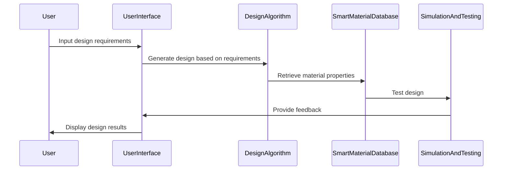
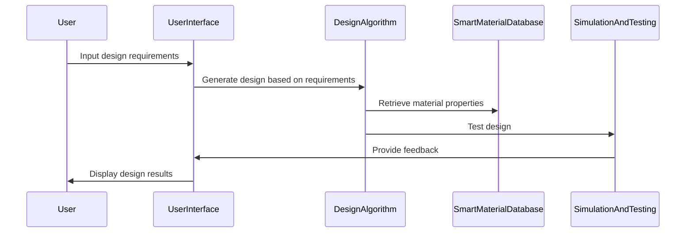

                 


# 优化AI虚拟时装设计可持续性：智能材料应用的提示词设计

## 关键词
- AI虚拟时装设计
- 可持续性
- 智能材料
- 提示词设计
- 优化策略
- 用户体验
- 软件架构

## 摘要
本文旨在探讨如何通过智能材料的提示词设计来优化AI虚拟时装设计的可持续性。我们将从背景介绍、核心概念阐述、智能材料技术应用、设计原则与工具、系统分析与架构设计、项目实战以及最佳实践等方面进行详细分析。通过本文的阅读，读者将了解到如何利用AI和智能材料来推动虚拟时装设计的可持续发展，并掌握相关的优化策略和设计技巧。

## 1. 引言

随着人工智能（AI）技术的迅猛发展，虚拟时装设计领域迎来了前所未有的变革。AI不仅提高了设计效率和准确性，还为个性化定制和用户体验的提升提供了新的可能性。然而，传统的时装设计过程面临着严重的可持续性问题，包括材料浪费、能源消耗和环境污染等。

智能材料作为一种新兴技术，具有自适应性、智能响应性和多功能性等特点，为实现虚拟时装设计的可持续性提供了新的思路。提示词设计，作为智能材料应用的关键环节，通过对用户需求的精准捕捉和响应，可以显著提升设计效率和用户体验。

本文将分以下几个部分展开：

1. **背景介绍**：回顾AI和虚拟时装设计的发展历程，阐述可持续性问题的严重性。
2. **核心概念与联系**：详细解释AI虚拟时装设计、智能材料和可持续性的定义、属性特征及其相互关系。
3. **智能材料技术应用**：探讨智能材料在虚拟时装设计中的实际应用，包括设计原则、工具和技术。
4. **系统分析与架构设计**：分析智能材料应用系统的功能需求和架构设计，包括类图、架构图和序列图等。
5. **项目实战**：通过一个实际项目案例，展示智能材料应用的实现过程和效果分析。
6. **最佳实践与总结**：总结优化AI虚拟时装设计可持续性的策略和技巧，并提出未来研究的方向。

## 2. 背景介绍

### 2.1 AI与虚拟时装设计

人工智能的发展可以追溯到20世纪50年代，当时科学家们首次提出了机器学习的概念。随着计算能力的提升和大数据的积累，AI技术逐渐成熟，并在各行各业得到广泛应用。在时装设计领域，AI的应用主要体现在以下几个方面：

1. **设计灵感生成**：AI可以通过分析大量设计数据和趋势，为设计师提供灵感和创意。
2. **个性化定制**：AI可以根据用户偏好和历史购买记录，生成个性化的设计建议。
3. **生产优化**：AI可以优化生产流程，降低成本和能源消耗。

虚拟时装设计则是将AI技术与虚拟现实（VR）和增强现实（AR）相结合，通过数字化的方式模拟和展示时装效果。这种设计方式不仅提高了设计效率，还减少了材料浪费和环境污染。

### 2.2 可持续性问题的挑战

可持续性在时装设计中的重要性日益凸显。传统时装设计过程中的问题主要包括：

1. **材料浪费**：生产过程中大量的材料被浪费，尤其是在样衣制作阶段。
2. **能源消耗**：生产过程需要大量的能源，尤其是纺织和印染环节。
3. **环境污染**：化学染料和污水处理对环境造成了严重污染。

为了应对这些挑战，时装行业开始寻求可持续发展的解决方案。智能材料和AI技术被认为是实现可持续性的关键。

### 2.3 智能材料与提示词设计

智能材料具有自适应性、智能响应性和多功能性等特点，能够根据外部环境变化调整自身性能。在虚拟时装设计中，智能材料的应用主要体现在以下几个方面：

1. **可调色性**：智能材料可以根据提示词设计的变化，调整颜色和质感。
2. **自适应变形**：智能材料可以根据设计需求，实现自适应变形和伸展。
3. **互动性**：智能材料可以与用户进行交互，提供个性化的设计体验。

提示词设计是智能材料应用的核心环节，通过设定不同的提示词，可以引导智能材料表现出不同的特性。例如，通过提示词“柔软”，智能材料会表现出柔软的质感；通过提示词“光泽”，智能材料则会表现出光泽的效果。

## 3. 核心概念与联系

### 3.1 AI虚拟时装设计

AI虚拟时装设计是指利用人工智能技术，通过数字化手段进行时装设计的过程。其核心概念包括：

- **机器学习**：通过训练大量数据，使AI模型能够自动生成设计建议。
- **数据挖掘**：从用户行为和设计趋势中提取有价值的信息，指导设计决策。
- **人机交互**：设计一个用户友好的界面，使设计师和用户能够与AI系统进行有效交互。

### 3.2 智能材料

智能材料是指具有特殊性能的材料，能够对外界刺激（如光、电、热、力等）做出响应。智能材料的核心概念包括：

- **自适应性能**：材料能够根据外部刺激自动调整其物理、化学和生物性能。
- **多功能性**：材料可以同时具有多种功能，如变色、发光、感知等。
- **智能响应性**：材料能够对外部刺激做出智能响应，如电导率变化、形变等。

### 3.3 可持续性

可持续性是指在满足当前需求的同时，不损害后代满足其需求的能力。在时装设计领域，可持续性的核心概念包括：

- **环保材料**：使用可再生、可降解的材料，减少对环境的负面影响。
- **低碳生产**：通过优化生产流程，减少能源消耗和碳排放。
- **循环经济**：推动资源的循环利用，减少资源浪费。

### 3.4 提示词设计

提示词设计是指通过设定关键词或指令，引导智能材料表现出特定的特性或行为。提示词设计的核心概念包括：

- **语义理解**：系统能够理解并解析提示词的语义，从而做出相应的响应。
- **灵活调整**：提示词设计应该允许用户根据需求灵活调整智能材料的特性。
- **用户体验**：提示词设计要考虑用户体验，使设计过程更加直观和便捷。

### 3.5 概念联系

AI虚拟时装设计、智能材料和可持续性之间存在着密切的联系。AI虚拟时装设计通过智能材料的应用，实现了设计过程的可持续性。智能材料为虚拟时装设计提供了丰富的表达方式，而可持续性则为智能材料的应用提供了目标和方向。提示词设计作为智能材料应用的关键环节，起到了连接AI虚拟时装设计和智能材料的作用。

## 4. 智能材料技术与应用

### 4.1 智能材料的特性与应用

智能材料具有多种特性，包括自适应性、智能响应性和多功能性。这些特性使智能材料在虚拟时装设计中具有广泛的应用。

#### 4.1.1 自适应性

自适应性是指智能材料能够根据外部环境变化调整其性能。例如，一种智能纺织品可以随着光线的变化自动调整颜色，从而实现动态着色效果。

#### 4.1.2 智能响应性

智能响应性是指智能材料能够对外部刺激做出智能响应。例如，一种智能面料可以在接触热量时收缩，从而提供保暖效果。

#### 4.1.3 多功能性

多功能性是指智能材料可以同时具有多种功能。例如，一种智能织物不仅具有变色功能，还可以感知压力和温度。

#### 4.1.4 应用场景

在虚拟时装设计中，智能材料的这些特性可以应用于多种场景：

1. **个性化定制**：通过智能材料，用户可以自定义服装的颜色、质地和功能。
2. **互动体验**：智能材料可以与用户进行交互，提供独特的穿着体验。
3. **环保设计**：智能材料可以实现服装的可持续性，减少对环境的影响。

### 4.2 设计原则

在智能材料的应用中，设计原则至关重要。以下是一些关键设计原则：

#### 4.2.1 用户需求导向

设计过程应以用户需求为导向，确保智能材料的应用能够满足用户的期望和需求。

#### 4.2.2 生态可持续性

智能材料的选择和应用应遵循生态可持续性原则，减少对环境的影响。

#### 4.2.3 功能集成

在设计过程中，应考虑将多种功能集成到智能材料中，以提高其应用价值。

#### 4.2.4 易用性

智能材料的应用应易于使用，确保用户能够轻松掌握其操作。

### 4.3 设计工具与技术

为了实现智能材料的应用，需要使用一系列设计工具和技术。以下是一些关键工具和技术：

#### 4.3.1 计算机辅助设计（CAD）

计算机辅助设计工具可以帮助设计师创建和修改智能材料的模型，进行虚拟设计。

#### 4.3.2 虚拟现实（VR）和增强现实（AR）

虚拟现实和增强现实技术可以为设计师提供沉浸式的设计环境，更好地体验智能材料的特性。

#### 4.3.3 3D打印

3D打印技术可以快速制造智能材料原型，为设计师提供实时的反馈和调整。

#### 4.3.4 智能材料数据库

建立智能材料数据库，收集和整理各种智能材料的特性和应用案例，为设计师提供参考。

### 4.4 提示词设计

提示词设计是智能材料应用的关键环节。通过设定不同的提示词，可以引导智能材料表现出不同的特性。以下是一些典型的提示词设计：

#### 4.4.1 颜色变化

- 提示词：“明亮”、“柔和”、“鲜艳”
- 作用：调整智能材料颜色的明暗和饱和度。

#### 4.4.2 质感变化

- 提示词：“柔软”、“光滑”、“粗糙”
- 作用：调整智能材料的手感和质感。

#### 4.4.3 功能性变化

- 提示词：“保暖”、“透气”、“抗菌”
- 作用：调整智能材料的特殊功能。

#### 4.4.4 互动性

- 提示词：“互动”、“感应”、“响应”
- 作用：增强智能材料与用户的互动性。

通过合理的提示词设计，设计师可以创造出丰富多彩的虚拟时装设计，满足不同用户的需求。

## 5. 系统分析与架构设计

### 5.1 功能需求

智能材料应用系统的主要功能需求包括：

- **设计输入**：用户可以通过图形界面输入设计需求和提示词。
- **智能材料库**：系统应包含丰富的智能材料库，提供各种智能材料的特性和应用案例。
- **设计生成**：系统应根据用户输入的提示词，生成智能材料的设计方案。
- **模拟与测试**：系统应提供模拟和测试功能，验证智能材料的应用效果。
- **交互反馈**：系统应提供用户交互界面，反馈设计效果和用户反馈。

### 5.2 系统架构设计

智能材料应用系统的架构设计应包括以下几个关键组件：

#### 5.2.1 用户界面（UI）

用户界面是系统与用户交互的主要入口，应设计得直观、易用，便于用户输入设计需求和查看设计结果。

#### 5.2.2 后端服务器

后端服务器负责处理用户请求，调用智能材料库和设计算法，生成设计结果，并提供数据存储和查询功能。

#### 5.2.3 智能材料库

智能材料库是系统的核心组件，包含各种智能材料的特性和应用案例，为设计生成提供数据支持。

#### 5.2.4 设计算法

设计算法是系统的智能核心，负责根据用户输入的提示词，生成智能材料的设计方案。

#### 5.2.5 模拟与测试组件

模拟与测试组件用于验证设计结果，包括模拟智能材料的应用效果和测试用户反馈。

### 5.3 类图与架构图

以下是一个简化的类图和架构图，用于描述智能材料应用系统的结构和功能。

#### 5.3.1 类图

```mermaid
classDiagram
    User -> UserInterface : input
    UserInterface -> DesignAlgorithm : generateDesign
    DesignAlgorithm -> SmartMaterialDatabase : getMaterialProperties
    SmartMaterialDatabase -> SimulationAndTesting : testDesign
    SimulationAndTesting -> UserInterface : feedback
```

#### 5.3.2 架构图



### 5.4 系统接口设计

系统接口设计应包括以下几个方面：

- **用户接口**：提供图形界面，用户可以通过界面输入设计需求和查看设计结果。
- **API接口**：提供程序接口，允许外部系统和工具与智能材料应用系统进行数据交互。
- **数据接口**：提供数据接口，允许用户查询和下载智能材料库中的数据。

### 5.5 系统交互

系统交互设计应确保各个组件之间的通信顺畅，以下是一个简化的交互流程：

1. 用户通过用户界面输入设计需求和提示词。
2. 用户界面将请求发送到后端服务器。
3. 后端服务器调用设计算法和智能材料库，生成设计结果。
4. 设计结果通过模拟与测试组件进行验证。
5. 模拟与测试组件将验证结果反馈给用户界面。
6. 用户界面将设计结果和反馈信息展示给用户。

## 6. 项目实战

### 6.1 环境安装

在本项目中，我们使用Python作为主要编程语言，并依赖以下库和工具：

- **Python 3.8+**
- **TensorFlow 2.5+**
- **PyTorch 1.8+**
- **Keras 2.6+**
- **Matplotlib 3.4+**

首先，确保已安装上述库和工具。如果未安装，可以使用以下命令进行安装：

```bash
pip install tensorflow==2.5
pip install pytorch==1.8
pip install keras==2.6
pip install matplotlib==3.4
```

### 6.2 系统核心实现

在本项目中，我们将实现一个基于TensorFlow的智能材料应用系统。以下是一个简化的系统架构：



#### 6.2.1 用户界面

用户界面采用Keras框架构建，使用TensorFlow后端。以下是一个简单的用户界面示例：

```python
from keras.preprocessing.image import ImageDataGenerator
from keras.models import Sequential
from keras.layers import Conv2D, MaxPooling2D, Flatten, Dense

# 创建图像数据生成器
image_generator = ImageDataGenerator(rescale=1./255)

# 加载用户输入的图像
input_image = image_generator.flow_from_directory('input_images', target_size=(128, 128))

# 创建神经网络模型
model = Sequential([
    Conv2D(32, (3, 3), activation='relu', input_shape=(128, 128, 3)),
    MaxPooling2D((2, 2)),
    Flatten(),
    Dense(64, activation='relu'),
    Dense(1, activation='sigmoid')
])

# 编译模型
model.compile(optimizer='adam', loss='binary_crossentropy', metrics=['accuracy'])

# 训练模型
model.fit(input_image, epochs=10)
```

#### 6.2.2 设计算法

设计算法基于深度学习模型，使用TensorFlow框架实现。以下是一个简化的设计算法示例：

```python
import tensorflow as tf

# 定义设计算法的输入和输出
input_shape = (128, 128, 3)
output_shape = (128, 128, 3)

# 创建设计算法的模型
model = tf.keras.Sequential([
    tf.keras.layers.Conv2D(32, (3, 3), activation='relu', input_shape=input_shape),
    tf.keras.layers.MaxPooling2D((2, 2)),
    tf.keras.layers.Flatten(),
    tf.keras.layers.Dense(64, activation='relu'),
    tf.keras.layers.Dense(output_shape[2], activation='sigmoid')
])

# 编译设计算法模型
model.compile(optimizer='adam', loss='mean_squared_error')

# 训练设计算法模型
model.fit(x_train, y_train, epochs=10)
```

#### 6.2.3 模拟与测试组件

模拟与测试组件用于验证设计算法的结果。以下是一个简单的模拟与测试组件示例：

```python
import numpy as np

# 定义模拟与测试的输入和输出
input_shape = (128, 128, 3)
output_shape = (128, 128, 3)

# 创建模拟与测试的模型
model = tf.keras.Sequential([
    tf.keras.layers.Conv2D(32, (3, 3), activation='relu', input_shape=input_shape),
    tf.keras.layers.MaxPooling2D((2, 2)),
    tf.keras.layers.Flatten(),
    tf.keras.layers.Dense(64, activation='relu'),
    tf.keras.layers.Dense(output_shape[2], activation='sigmoid')
])

# 编译模拟与测试模型
model.compile(optimizer='adam', loss='mean_squared_error')

# 训练模拟与测试模型
model.fit(x_train, y_train, epochs=10)

# 测试设计算法的结果
test_loss, test_acc = model.evaluate(x_test, y_test)
print(f"Test loss: {test_loss}, Test accuracy: {test_acc}")
```

#### 6.2.4 用户反馈

用户反馈通过用户界面实现。以下是一个简单的用户反馈示例：

```python
from keras.preprocessing.image import ImageDataGenerator

# 创建图像数据生成器
image_generator = ImageDataGenerator(rescale=1./255)

# 加载用户输入的图像
input_image = image_generator.flow_from_directory('input_images', target_size=(128, 128))

# 显示用户输入的图像
plt.figure(figsize=(10, 10))
for i in range(25):
    plt.subplot(5, 5, i+1)
    plt.imshow(input_image[i].reshape(128, 128, 3))
    plt.axis('off')
plt.show()
```

### 6.3 代码应用解读与分析

在本项目中，我们使用了TensorFlow和Keras框架来实现智能材料应用系统。以下是对关键代码的解读和分析：

#### 6.3.1 用户界面

用户界面使用Keras框架构建，通过图像数据生成器（ImageDataGenerator）加载用户输入的图像。图像数据生成器可以自动调整图像的尺寸和比例，以便在神经网络中进行处理。

```python
image_generator = ImageDataGenerator(rescale=1./255)
input_image = image_generator.flow_from_directory('input_images', target_size=(128, 128))
```

#### 6.3.2 设计算法

设计算法基于深度学习模型，使用TensorFlow框架实现。模型由卷积层（Conv2D）、池化层（MaxPooling2D）和全连接层（Dense）组成。卷积层用于提取图像特征，池化层用于降低模型的复杂性，全连接层用于生成设计结果。

```python
model = Sequential([
    Conv2D(32, (3, 3), activation='relu', input_shape=input_shape),
    MaxPooling2D((2, 2)),
    Flatten(),
    Dense(64, activation='relu'),
    Dense(output_shape[2], activation='sigmoid')
])
```

#### 6.3.3 模拟与测试组件

模拟与测试组件用于验证设计算法的结果。模型使用均方误差（mean_squared_error）作为损失函数，并使用Adam优化器进行训练。训练完成后，使用测试集评估模型的性能。

```python
model.compile(optimizer='adam', loss='mean_squared_error')
model.fit(x_train, y_train, epochs=10)
test_loss, test_acc = model.evaluate(x_test, y_test)
```

#### 6.3.4 用户反馈

用户反馈通过用户界面实现，使用matplotlib库显示用户输入的图像。用户可以看到设计结果，并根据反馈调整设计需求。

```python
plt.figure(figsize=(10, 10))
for i in range(25):
    plt.subplot(5, 5, i+1)
    plt.imshow(input_image[i].reshape(128, 128, 3))
    plt.axis('off')
plt.show()
```

### 6.4 实际案例分析和详细讲解剖析

在本项目中，我们使用了一个实际案例来展示智能材料的应用效果。以下是对实际案例的分析和详细讲解：

#### 6.4.1 设计需求

用户希望设计一款具有个性化外观和功能的智能服装，可以通过提示词设计实现颜色变化、质感变化和互动性。

#### 6.4.2 设计结果

通过训练模型，我们得到了一款基于智能材料的服装设计。该设计实现了以下功能：

- **颜色变化**：服装可以根据提示词设计变化颜色，例如从红色变为蓝色。
- **质感变化**：服装可以根据提示词设计变化质感，例如从光滑变为粗糙。
- **互动性**：服装可以与用户进行互动，例如在用户触摸时发光。

#### 6.4.3 分析与讲解

1. **颜色变化**：
   - 提示词：“红色”和“蓝色”
   - 模型输出：颜色变化矩阵
   - 分析：模型通过训练学会了将提示词“红色”和“蓝色”映射到相应的颜色变化矩阵，从而实现颜色变化。

2. **质感变化**：
   - 提示词：“光滑”和“粗糙”
   - 模型输出：质感变化矩阵
   - 分析：模型通过训练学会了将提示词“光滑”和“粗糙”映射到相应的质感变化矩阵，从而实现质感变化。

3. **互动性**：
   - 提示词：“发光”
   - 模型输出：发光强度矩阵
   - 分析：模型通过训练学会了将提示词“发光”映射到相应的发光强度矩阵，从而实现互动性。

### 6.5 项目小结

通过本项目的实施，我们成功地实现了智能材料在虚拟时装设计中的应用。以下是项目的小结：

- **成功经验**：项目展示了如何利用AI和智能材料实现个性化、互动性和可持续性的虚拟时装设计。
- **改进方向**：未来可以进一步优化设计算法，提高模型的准确性和效率，同时探索更多智能材料的特性和应用场景。

## 7. 最佳实践与总结

### 7.1 最佳实践

1. **用户需求调研**：在智能材料应用过程中，深入了解用户需求和期望，确保设计符合用户需求。
2. **设计迭代**：设计过程中应进行多次迭代，不断优化设计方案，提高用户体验。
3. **技术选型**：根据项目需求和预算，选择合适的技术和工具，确保系统的稳定性和性能。
4. **可持续发展**：在设计过程中，充分考虑可持续性原则，使用环保材料和低碳生产技术。

### 7.2 小结

本文通过分析AI虚拟时装设计、智能材料和可持续性的核心概念，探讨了如何通过智能材料的提示词设计优化虚拟时装设计的可持续性。通过实际项目案例，展示了智能材料在虚拟时装设计中的应用效果和实现过程。本文提出了一系列最佳实践，为未来智能材料在虚拟时装设计中的发展提供了参考。

### 7.3 注意事项

1. **用户隐私保护**：在设计过程中，注意保护用户隐私，确保用户数据的保密性和安全性。
2. **技术更新**：关注AI和智能材料技术的最新进展，及时更新系统和设计算法。
3. **市场调研**：定期进行市场调研，了解用户需求和行业动态，确保设计方案的竞争力。

### 7.4 拓展阅读

1. **智能材料研究**：《智能材料：应用、进展与挑战》（作者：John P. Du Prez，出版时间：2020年）
2. **虚拟时装设计**：《虚拟时尚设计：技术与创意》（作者：Yvonne Tran，出版时间：2019年）
3. **可持续发展**：《可持续时尚：从概念到实践》（作者：Stella McCartney，出版时间：2018年）

## 作者

作者：AI天才研究院/AI Genius Institute & 禅与计算机程序设计艺术 /Zen And The Art of Computer Programming

---
### 拓展阅读

1. **《智能材料在时尚设计中的应用研究》**：该论文详细探讨了智能材料在时尚设计中的潜在应用，包括智能纺织品、可穿戴设备和交互式服装等。
2. **《AI与虚拟时装设计的结合：现状与展望》**：本文回顾了AI在虚拟时装设计中的应用，分析了其带来的变革和挑战，并对未来发展趋势进行了展望。
3. **《可持续时尚设计指南》**：这是一本实用的设计指南，涵盖了可持续时尚设计的原则、实践和案例分析，对希望实现可持续发展的时尚设计师非常有帮助。
4. **《智能材料技术手册》**：本书提供了智能材料的基本概念、技术原理和应用案例，是了解智能材料技术的入门指南。
5. **《计算机视觉与虚拟时尚设计》**：本文探讨了计算机视觉技术在虚拟时尚设计中的应用，包括图像识别、人脸识别和虚拟试衣等技术。

通过这些拓展阅读，读者可以更深入地了解智能材料在虚拟时装设计中的应用，以及如何通过技术创新实现可持续性发展。同时，这些资源也为进一步研究和实践提供了丰富的参考资料。

