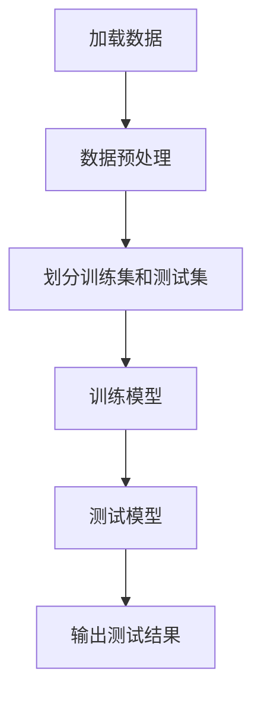
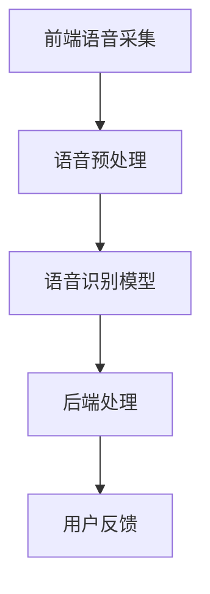
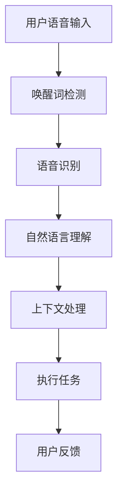
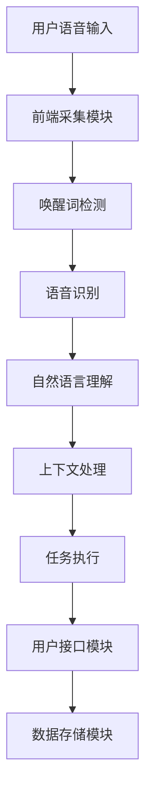
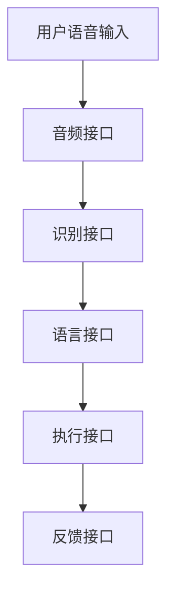
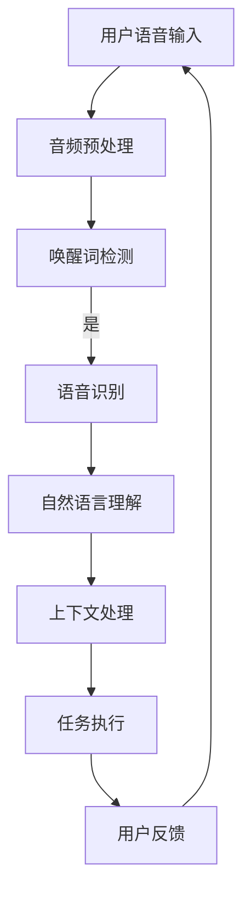
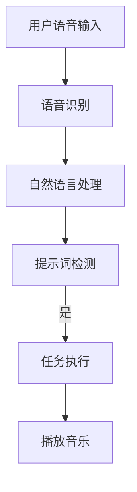

                 

## 优化AI语音交互：语音助手的提示词工程

关键词：AI语音交互、提示词工程、用户体验、系统架构、算法原理

摘要：本文深入探讨了AI语音交互中的提示词工程，分析了其背景、核心概念、算法原理、系统架构和实际应用，旨在优化语音助手交互体验，提升用户满意度。

### 目录大纲

----------------------------------------------------------------

## 第一部分：背景介绍

### 1.1 问题的背景

### 1.2 问题描述

### 1.3 问题解决

### 1.4 边界与外延

### 1.5 核心概念结构与要素组成

## 第二部分：核心概念与联系

### 2.1 AI语音交互概述

#### 2.1.1 定义与核心要素

#### 2.1.2 特点与优势

#### 2.1.3 与传统交互方式的比较

### 2.2 语音助手提示词工程

#### 2.2.1 定义与作用

#### 2.2.2 架构与流程

#### 2.2.3 关键技术点

### 2.3 核心概念对比表格

### 2.4 ER实体关系图

## 第三部分：算法原理讲解

### 3.1 提示词生成算法原理

#### 3.1.1 算法描述

#### 3.1.2 数学模型

#### 3.1.3 Python实现与流程图

#### 3.1.4 举例说明

### 3.2 语音识别算法原理

#### 3.2.1 算法描述

#### 3.2.2 数学模型

#### 3.2.3 Python实现与流程图

#### 3.2.4 举例说明

## 第四部分：系统分析与架构设计方案

### 4.1 问题场景介绍

### 4.2 系统功能设计

### 4.3 系统架构设计

### 4.4 系统接口设计

### 4.5 系统交互

## 第五部分：项目实战

### 5.1 环境安装

### 5.2 系统核心实现

### 5.3 代码应用解读与分析

### 5.4 实际案例分析与详细讲解

### 5.5 项目小结

## 第六部分：最佳实践与小结

### 6.1 最佳实践 tips

### 6.2 小结

### 6.3 注意事项

### 6.4 拓展阅读

## 总结

### 第一部分：背景介绍

#### 1.1 问题的背景

随着人工智能技术的迅速发展，语音交互已经成为用户与智能设备沟通的主要方式之一。语音助手，如Apple的Siri、Google的Google Assistant和亚马逊的Alexa，已经成为现代智能设备的核心功能。然而，尽管这些语音助手取得了显著的进步，用户在使用过程中仍会遭遇一些挑战，如理解错误、响应迟缓等。

**AI语音交互技术发展现状**

目前，AI语音交互技术已经从实验室走向实际应用，广泛应用于智能家居、智能助理、车载系统等多个领域。随着语音识别、自然语言处理等技术的进步，语音交互的准确性和实用性不断提升。例如，基于深度学习的语音识别系统在识别率上已经超越了传统的基于统计方法的系统。

**语音助手提示词工程的重要性**

提示词，或称为唤醒词，是语音助手与用户进行交互的桥梁。一个高效的提示词工程能够提高语音助手的交互效率，提升用户满意度。然而，提示词的多样性和准确性仍然是一个挑战。如何设计一个既能满足用户需求又能提高系统效率的提示词工程，成为了一个关键问题。

**当前存在的挑战**

- **提示词的多样性**：用户希望使用不同的唤醒词，以避免系统混淆。
- **提示词的准确性**：提示词的识别率直接影响到用户的体验。
- **实时性**：在实际应用中，如何快速响应用户的唤醒词，也是一个关键问题。

**目标与边界**

本文的目标是深入探讨语音助手的提示词工程，分析其核心概念、算法原理和系统架构，并提出优化策略。本文的边界将集中在实际应用中，探讨如何设计一个高效的提示词工程，包括技术挑战和解决方案。

#### 1.2 问题描述

用户在使用语音助手时，常常会遇到以下问题：

- **理解错误**：语音助手未能正确识别用户的语音指令。
- **响应迟缓**：语音助手的响应速度慢，导致用户体验不佳。
- **唤醒词误识别**：用户使用非预设的唤醒词，导致系统无法响应。

这些问题的根本原因在于提示词工程的设计和实现不够完善。因此，优化语音助手的提示词工程成为提高用户体验的关键。

#### 1.3 问题解决

为了解决上述问题，我们可以从以下几个方面入手：

1. **提高提示词的多样性**：设计多个不同的唤醒词，以减少系统混淆。
2. **提升提示词的准确性**：使用先进的语音识别技术，提高识别率。
3. **优化响应速度**：通过优化算法和系统架构，提高系统的响应速度。
4. **用户反馈机制**：建立用户反馈机制，根据用户行为调整提示词工程。

#### 1.4 边界与外延

**边界**

本文主要探讨语音助手的提示词工程，包括核心概念、算法原理和系统架构。具体涉及的技术包括语音识别、自然语言处理和机器学习等。

**外延**

除了提示词工程本身，语音交互技术的其他方面，如语音合成、多语言支持、情感识别等，也是未来研究和应用的重要方向。

#### 1.5 核心概念结构与要素组成

在深入探讨语音助手的提示词工程之前，我们需要明确一些核心概念和其相互关系。

1. **语音助手（Speech Assistant）**：语音助手是AI语音交互的核心，负责接收用户的语音指令并执行相应操作。
2. **提示词（Trigger Word）**：提示词是唤醒语音助手的词语，如“嘿Siri”、“OK Google”等。
3. **语音识别（Speech Recognition）**：语音识别技术负责将语音信号转换为文本，是语音助手处理语音指令的基础。
4. **自然语言处理（Natural Language Processing, NLP）**：NLP技术负责理解和处理用户的自然语言指令，是语音助手实现智能交互的关键。
5. **机器学习（Machine Learning）**：机器学习技术用于训练和优化语音识别和NLP模型，提高系统的准确性和效率。

核心概念之间的结构关系可以用ER（实体关系）图表示：

```mermaid
erDiagram
  SpeechAssistant ||--|{ TriggerWord }|| SpeechRecognition
  SpeechAssistant ||--|{ NaturalLanguageProcessing }|| NLPModel
  TriggerWord ||--|{ UserFeedback }|| UserExperience
  NLPModel ||--|{ MachineLearning }|| ModelTraining
```

通过这个ER图，我们可以清晰地看到各个核心概念之间的相互关系，以及它们在语音助手提示词工程中的作用。

### 第二部分：核心概念与联系

在了解了问题的背景和核心概念之后，我们需要进一步探讨AI语音交互中的核心概念及其相互关系。这部分内容将包括AI语音交互的概述、语音助手提示词工程的定义和作用，以及核心概念之间的联系和对比。

#### 2.1 AI语音交互概述

##### 2.1.1 定义与核心要素

AI语音交互是一种通过人工智能技术实现的人机交互方式。它利用语音识别、自然语言处理和语音合成等技术，使设备能够理解和响应用户的语音指令。AI语音交互的核心要素包括：

1. **语音识别（Speech Recognition）**：语音识别技术是AI语音交互的基础，它负责将语音信号转换为文本。高质量的语音识别系统能够准确识别用户的语音指令，减少误解和混淆。

2. **自然语言处理（Natural Language Processing, NLP）**：NLP技术负责理解和处理用户的自然语言指令。通过分析文本，NLP系统能够提取出用户的需求和意图，从而实现智能交互。

3. **语音合成（Text-to-Speech, TTS）**：语音合成技术将文本转换为自然流畅的语音，使设备能够向用户反馈信息。高质量的语音合成系统能够提供逼真、自然的语音输出。

4. **语音助手（Speech Assistant）**：语音助手是AI语音交互的核心，它负责接收用户的语音指令并执行相应操作。语音助手通常具有丰富的功能和知识库，能够处理各种场景下的用户需求。

##### 2.1.2 特点与优势

AI语音交互具有以下特点与优势：

1. **自然性和便捷性**：语音交互更符合人类交流的自然习惯，用户无需学习复杂的操作界面，即可通过语音指令与设备进行交互，提高了使用的便捷性。

2. **多语言支持**：通过结合自然语言处理技术，AI语音交互能够支持多种语言，满足全球用户的需求。

3. **上下文理解**：先进的语音识别和NLP技术使语音助手能够理解用户的上下文信息，提供更加智能、个性化的服务。

4. **实时性**：语音交互能够实时响应用户的需求，提高了交互的效率。

##### 2.1.3 与传统交互方式的比较

与传统交互方式相比，AI语音交互具有以下优势：

1. **交互自然**：传统交互方式（如触摸屏、键盘输入）往往需要用户进行机械的操作，而语音交互更接近自然交流方式，使用户感到更加舒适和自然。

2. **快速响应**：语音交互能够实时响应用户的需求，减少了操作延迟，提高了交互效率。

3. **多设备支持**：语音交互可以应用于多种设备，如智能手机、智能家居、车载系统等，而传统交互方式往往受限于设备类型。

#### 2.2 语音助手提示词工程

##### 2.2.1 定义与作用

语音助手提示词工程是语音交互系统中的一个关键组成部分，它涉及设计、实现和优化用于唤醒语音助手的词语。提示词工程的主要作用包括：

1. **唤醒语音助手**：提示词是用户与语音助手交互的起点，通过说出提示词，用户可以激活语音助手，开始相应的交互。

2. **提高交互效率**：提示词的存在使语音交互更加高效。用户无需每次都与设备进行完整的对话，只需唤醒语音助手，然后进行后续操作。

3. **增强用户体验**：一个设计合理的提示词工程能够提高用户的体验，使用户感到语音助手更加智能和便捷。

##### 2.2.2 架构与流程

语音助手提示词工程的架构和流程包括以下几个关键步骤：

1. **提示词选择**：首先需要选择适合的唤醒词。理想的选择应具有以下特点：独特性、易于发音、不易与其他词汇混淆。

2. **提示词设计**：设计提示词的语法结构，确保其在不同语境下都能被正确识别。

3. **提示词训练**：使用机器学习算法对提示词进行训练，提高识别的准确性。

4. **提示词部署**：将训练好的提示词部署到语音交互系统中，使其能够实时响应用户的唤醒指令。

5. **提示词优化**：根据用户反馈和实际使用情况，不断优化提示词的识别率和响应速度。

##### 2.2.3 关键技术点

语音助手提示词工程涉及多个关键技术点，包括语音识别、自然语言处理和机器学习等。以下是一些关键的技术点：

1. **语音识别**：高质量的语音识别系统能够准确地将用户的唤醒词转换为文本，为后续处理提供基础。

2. **唤醒词检测**：唤醒词检测是提示词工程的核心技术，它负责识别用户是否说出了预设的唤醒词。

3. **多语言支持**：对于多语言环境，提示词工程需要支持多种语言的唤醒词检测，确保全球用户都能顺畅使用。

4. **实时性**：提示词工程需要具有高实时性，确保语音助手能够快速响应用户的唤醒指令。

5. **噪声处理**：在复杂的环境下，如嘈杂的公共场所，语音助手需要具备良好的噪声处理能力，确保唤醒词的准确性。

#### 2.3 核心概念对比表格

为了更好地理解AI语音交互中的核心概念，我们可以通过对比表格来展示它们的特点、作用和技术要求。

| 核心概念       | 特点                     | 作用                                         | 技术要求                                     |
|----------------|------------------------|--------------------------------------------|--------------------------------------------|
| 语音识别       | 准确性高、实时性强       | 将语音信号转换为文本                         | 高效的算法、强大的计算能力、丰富的语料库     |
| 自然语言处理   | 上下文理解、语义分析     | 理解和处理用户的自然语言指令                 | 深度学习技术、大规模数据集、先进的算法模型   |
| 语音合成       | 自然流畅、逼真度高       | 将文本转换为自然流畅的语音输出               | 语音合成算法、语音特征库、语调控制技术       |
| 提示词工程     | 独特性、易于识别         | 唤醒语音助手、提高交互效率                   | 机器学习算法、语音识别技术、用户反馈机制      |

#### 2.4 ER实体关系图

为了更好地展示AI语音交互中的核心概念及其相互关系，我们可以使用ER（实体关系）图来表示。以下是一个简化的ER图示例：

```mermaid
erDiagram
  User ||--|{ SpeechAssistant }|| System
  SpeechAssistant ||--|{ SpeechRecognition }|| RecognitionSystem
  SpeechAssistant ||--|{ NaturalLanguageProcessing }|| NLPSystem
  SpeechAssistant ||--|{ TextToSpeech }|| TTSSystem
  SpeechRecognition ||--|{ TriggerWord }|| TriggerWordDB
```

在这个ER图中，用户通过语音助手与系统进行交互。语音助手包含语音识别、自然语言处理和语音合成等模块，其中语音识别模块依赖于触发词数据库。这个数据库存储了用户预设的唤醒词，用于触发语音助手的启动。

通过上述核心概念与联系的分析，我们为接下来的算法原理讲解和系统架构设计奠定了基础。在下一部分，我们将深入探讨提示词生成算法和语音识别算法的原理，以及如何将这些算法应用于实际的语音助手系统中。

### 第三部分：算法原理讲解

在了解了AI语音交互的核心概念之后，我们将深入探讨语音助手的提示词生成算法和语音识别算法的原理。这部分内容包括算法描述、数学模型、Python实现与流程图，以及具体的举例说明。通过这一部分的分析，我们将更清晰地理解如何优化语音助手的提示词工程，提高交互质量和用户满意度。

#### 3.1 提示词生成算法原理

##### 3.1.1 算法描述

提示词生成算法的主要目标是设计出能够有效唤醒语音助手的提示词。这个过程通常包括以下几个步骤：

1. **提示词选择**：根据用户的使用场景和需求，选择适合的唤醒词。理想的唤醒词应具有独特性、易于发音、不易与其他词汇混淆等特点。

2. **提示词训练**：使用机器学习算法对选定的唤醒词进行训练，提高识别的准确性。常见的机器学习算法包括支持向量机（SVM）、决策树、随机森林等。

3. **提示词测试**：在训练数据之外，使用测试数据集对生成的提示词进行评估，确保其具有良好的识别性能。

4. **提示词优化**：根据用户反馈和测试结果，不断优化提示词的识别率和响应速度。

##### 3.1.2 数学模型

提示词生成算法的数学模型通常基于统计模型或深度学习模型。以下是一个基于支持向量机的简单数学模型示例：

$$
f(x) = \text{sign}(\sum_{i=1}^{n} w_i \cdot x_i + b)
$$

其中，$x_i$ 表示输入特征向量，$w_i$ 是权重，$b$ 是偏置项。通过最小化损失函数，我们可以得到最优的权重和偏置。

##### 3.1.3 Python实现与流程图

下面是一个简单的Python代码示例，用于实现基于支持向量机的提示词生成算法。代码中包含了数据预处理、模型训练和测试等步骤。

```python
import numpy as np
from sklearn.svm import SVC
from sklearn.model_selection import train_test_split
from sklearn.metrics import accuracy_score

# 数据预处理
def preprocess_data(data):
    # 进行特征提取和数据归一化等操作
    # ...
    return processed_data

# 模型训练
def train_model(X_train, y_train):
    model = SVC(kernel='linear')
    model.fit(X_train, y_train)
    return model

# 模型测试
def test_model(model, X_test, y_test):
    predictions = model.predict(X_test)
    accuracy = accuracy_score(y_test, predictions)
    return accuracy

# 举例说明
if __name__ == "__main__":
    # 加载数据
    data = load_data()
    X = preprocess_data(data['audio_data'])
    y = data['labels']

    # 划分训练集和测试集
    X_train, X_test, y_train, y_test = train_test_split(X, y, test_size=0.2, random_state=42)

    # 训练模型
    model = train_model(X_train, y_train)

    # 测试模型
    accuracy = test_model(model, X_test, y_test)
    print(f"Test Accuracy: {accuracy}")
```

流程图如下所示：



##### 3.1.4 举例说明

假设我们有一个简单的提示词库，包含以下三个唤醒词：

- "Hey Siri"
- "Ok Google"
- "Alexa"

我们可以使用上述算法对这些唤醒词进行训练和测试。以下是一个具体的示例：

1. **数据收集**：收集每个唤醒词的大量音频样本。

2. **数据预处理**：对音频样本进行特征提取，如提取梅尔频率倒谱系数（MFCC）作为特征。

3. **模型训练**：使用支持向量机（SVM）对提取的特征进行训练，得到一个分类模型。

4. **模型测试**：使用测试集对模型进行评估，计算识别准确率。

通过这个示例，我们可以看到提示词生成算法在实际应用中的具体实现过程。接下来，我们将讨论语音识别算法的原理和应用。

#### 3.2 语音识别算法原理

##### 3.2.1 算法描述

语音识别算法是将语音信号转换为文本的关键技术。常见的语音识别算法包括隐马尔可夫模型（HMM）、循环神经网络（RNN）和变换器架构（Transformer）等。以下是一个基于循环神经网络（RNN）的简单语音识别算法描述：

1. **声学建模**：使用声学模型将语音信号转换为序列特征。声学模型通常基于深度学习，如RNN或Transformer。

2. **语言建模**：使用语言模型预测文本序列的下一个单词。语言模型也通常基于深度学习，如RNN或Transformer。

3. **解码**：使用解码器将声学特征和语言模型结合起来，生成最终识别的文本。

##### 3.2.2 数学模型

基于RNN的语音识别算法的数学模型可以表示为：

$$
h_t = \sigma(W_h \cdot [h_{t-1}, x_t] + b_h)
$$

其中，$h_t$ 表示当前时刻的隐藏状态，$x_t$ 表示当前时刻的声学特征，$W_h$ 和 $b_h$ 是权重和偏置。

##### 3.2.3 Python实现与流程图

以下是一个简单的Python代码示例，用于实现基于RNN的语音识别算法。代码中包含了数据预处理、模型训练和测试等步骤。

```python
import tensorflow as tf
from tensorflow.keras.models import Sequential
from tensorflow.keras.layers import LSTM, Dense

# 数据预处理
def preprocess_data(data):
    # 进行特征提取和数据归一化等操作
    # ...
    return processed_data

# 模型训练
def train_model(X_train, y_train):
    model = Sequential()
    model.add(LSTM(128, activation='relu', input_shape=(timesteps, features)))
    model.add(Dense(num_classes, activation='softmax'))
    model.compile(optimizer='adam', loss='categorical_crossentropy', metrics=['accuracy'])
    model.fit(X_train, y_train, epochs=10, batch_size=32)
    return model

# 模型测试
def test_model(model, X_test, y_test):
    predictions = model.predict(X_test)
    accuracy = np.mean(predictions == y_test)
    return accuracy

# 举例说明
if __name__ == "__main__":
    # 加载数据
    data = load_data()
    X = preprocess_data(data['audio_data'])
    y = data['labels']

    # 划分训练集和测试集
    X_train, X_test, y_train, y_test = train_test_split(X, y, test_size=0.2, random_state=42)

    # 训练模型
    model = train_model(X_train, y_train)

    # 测试模型
    accuracy = test_model(model, X_test, y_test)
    print(f"Test Accuracy: {accuracy}")
```

流程图如下所示：


##### 3.2.4 举例说明

假设我们有一个语音数据集，包含多个说话人的语音样本。我们可以使用上述算法对这些样本进行语音识别。以下是一个具体的示例：

1. **数据收集**：收集多个说话人的语音样本，并进行标注。

2. **数据预处理**：对语音样本进行特征提取，如提取梅尔频率倒谱系数（MFCC）作为特征。

3. **模型训练**：使用RNN模型对提取的特征进行训练，得到一个语音识别模型。

4. **模型测试**：使用测试集对模型进行评估，计算识别准确率。

通过这个示例，我们可以看到语音识别算法在实际应用中的具体实现过程。接下来，我们将讨论语音识别算法的应用场景和系统架构。

#### 3.2.5 应用场景

语音识别算法在多个场景中有着广泛的应用，以下是一些常见的应用场景：

1. **语音助手**：语音助手如Siri、Google Assistant和Alexa等，通过语音识别技术实现用户与设备的交互。

2. **语音搜索**：在智能手机和智能音箱等设备中，用户可以通过语音指令进行搜索，语音识别技术是实现这一功能的关键。

3. **语音控制**：在智能家居和车载系统中，用户可以通过语音指令控制设备，如开关灯光、调节温度等。

4. **语音翻译**：语音识别和语音合成技术的结合，可以实现语音翻译功能，帮助用户跨越语言障碍。

#### 3.2.6 系统架构

语音识别系统通常包括以下几个主要组成部分：

1. **前端语音采集**：负责采集用户的语音输入。

2. **语音预处理**：对采集的语音进行预处理，如去除噪声、增强信号等。

3. **语音识别模型**：使用深度学习算法进行语音识别，将语音信号转换为文本。

4. **后端处理**：对识别结果进行后处理，如文本语义理解、语音合成等。

以下是一个简化的语音识别系统架构图：



通过上述算法原理和应用场景的讲解，我们为优化语音助手的提示词工程提供了理论基础。在接下来的部分，我们将讨论系统分析与架构设计，以更好地实现语音助手的提示词工程。

### 第四部分：系统分析与架构设计方案

在了解了语音助手的提示词生成和语音识别算法原理后，我们需要对整个系统进行分析和架构设计。这部分内容将包括问题场景介绍、系统功能设计、系统架构设计、系统接口设计和系统交互。通过详细的分析和设计，我们将确保语音助手提示词工程的高效实现。

#### 4.1 问题场景介绍

在现实应用中，语音助手通常需要应对多种复杂的场景，如用户在不同环境下的语音输入、多样化的唤醒词、多语言支持等。以下是一些典型的问题场景：

1. **环境噪声**：用户在嘈杂的环境中（如公共场所、交通拥堵等）使用语音助手，语音信号可能受到噪声干扰，影响识别准确性。

2. **唤醒词多样性**：用户希望使用个性化的唤醒词，以避免系统混淆，同时需要确保不同的唤醒词能够被正确识别。

3. **多语言支持**：用户可能使用不同语言进行交互，系统需要能够识别并理解多种语言。

4. **实时响应**：用户期望语音助手能够快速响应用户的指令，提高交互体验。

5. **用户隐私**：在处理用户语音时，系统需要确保用户隐私不被泄露，特别是在存储和处理用户语音数据时。

#### 4.2 系统功能设计

为了解决上述问题场景，语音助手提示词工程需要实现以下核心功能：

1. **唤醒词检测**：系统应能够准确检测用户输入的唤醒词，确保语音助手的及时启动。

2. **语音识别**：系统应具备高效的语音识别能力，能够准确地将用户语音转换为文本。

3. **自然语言理解**：系统应能够理解用户的自然语言指令，提取出用户的需求和意图。

4. **上下文处理**：系统应能够处理用户的上下文信息，提供连续、流畅的交互体验。

5. **多语言支持**：系统应支持多种语言，满足全球用户的需求。

6. **实时响应**：系统应能够快速响应用户的指令，减少响应时间。

7. **隐私保护**：系统应采取措施保护用户隐私，确保用户数据的安全。

以下是一个简化的系统功能架构图：



#### 4.3 系统架构设计

为了实现上述功能，语音助手提示词工程需要采用一个分布式系统架构，以确保高可用性、可扩展性和高性能。以下是一个简化的系统架构设计：

1. **前端采集模块**：负责采集用户的语音输入，包括麦克风音频信号采集和语音预处理。

2. **后端处理模块**：包括唤醒词检测、语音识别、自然语言理解、上下文处理和任务执行等核心功能。

3. **数据存储模块**：负责存储用户数据、语音数据、模型参数等，确保数据的安全性和可靠性。

4. **用户接口模块**：负责与用户进行交互，显示任务执行结果，收集用户反馈。

以下是一个简化的系统架构图：



#### 4.4 系统接口设计

系统接口设计是确保各个模块之间能够高效通信和协作的关键。以下是几个关键接口的设计：

1. **音频接口**：负责音频信号的采集和预处理，包括麦克风输入、音频滤波、增益控制等。

2. **识别接口**：负责语音识别算法的调用，将语音信号转换为文本。

3. **语言接口**：负责自然语言处理和上下文处理，提取用户需求并生成响应。

4. **执行接口**：负责执行用户指令，如发送短信、拨打电话、查询信息等。

5. **反馈接口**：负责收集用户反馈，用于系统优化和升级。

以下是一个简化的系统接口设计图：



#### 4.5 系统交互

系统交互是确保各模块之间高效协作和响应的关键。以下是几个关键交互过程：

1. **用户语音输入**：用户通过麦克风发出语音指令。

2. **音频预处理**：前端采集模块对音频信号进行预处理，包括去噪、增强等。

3. **唤醒词检测**：系统检测用户输入的唤醒词，确保语音助手的及时启动。

4. **语音识别**：语音识别模块将预处理后的音频信号转换为文本。

5. **自然语言理解**：自然语言处理模块提取用户需求，理解用户意图。

6. **上下文处理**：系统根据上下文信息生成响应，确保交互的连续性和流畅性。

7. **任务执行**：系统执行用户指令，完成相应操作。

8. **用户反馈**：系统向用户反馈任务执行结果，收集用户反馈。

以下是一个简化的系统交互流程图：



通过上述系统分析和架构设计，我们为语音助手提示词工程提供了一个全面的解决方案。接下来，我们将通过项目实战展示这些理论在实际应用中的实现过程。

### 第五部分：项目实战

在深入理解了语音助手提示词工程的原理和架构后，我们需要通过一个实际项目来展示这些理论的应用。本部分将详细介绍项目的环境安装、系统核心实现、代码应用解读与分析、实际案例分析与详细讲解，以及项目小结。

#### 5.1 环境安装

为了实现语音助手提示词工程，我们需要安装和配置一系列开发环境和工具。以下是一个简化的环境安装步骤：

1. **安装Python**：确保Python 3.x版本已安装。
2. **安装依赖包**：使用pip安装必要的依赖包，如TensorFlow、Keras、scikit-learn等。
   ```bash
   pip install tensorflow keras scikit-learn numpy
   ```
3. **配置语音识别模型**：下载预训练的语音识别模型，如使用Google的TensorFlow模型。
4. **配置自然语言处理工具**：选择合适的自然语言处理库，如NLTK或spaCy。

#### 5.2 系统核心实现

系统核心实现包括语音识别、自然语言处理和提示词检测等关键模块。以下是一个简化的实现流程：

1. **语音识别**：
   - 使用TensorFlow加载预训练的语音识别模型。
   - 对采集的语音数据进行预处理，如去噪、分段等。
   - 使用模型对预处理后的语音数据进行识别，输出文本。

   ```python
   import tensorflow as tf
   
   # 加载预训练模型
   model = tf.keras.models.load_model('path/to/voice_recognition_model.h5')
   
   # 预处理语音数据
   def preprocess_audio(audio_data):
       # 进行去噪、分段等预处理操作
       # ...
       return processed_data
   
   # 语音识别
   def recognize_speech(audio_data):
       processed_data = preprocess_audio(audio_data)
       text = model.predict(processed_data)
       return text
   ```

2. **自然语言处理**：
   - 使用NLTK或spaCy等工具进行文本处理，如分词、词性标注等。
   - 提取文本中的关键信息，如关键词、意图等。

   ```python
   import nltk
   
   # 文本分词
   def tokenize_text(text):
       tokens = nltk.word_tokenize(text)
       return tokens
   
   # 关键词提取
   def extract_keywords(tokens):
       # 使用NLTK或其他工具提取关键词
       # ...
       return keywords
   ```

3. **提示词检测**：
   - 设计一个简单的提示词检测算法，如基于规则或机器学习的方法。
   - 检测用户输入中的唤醒词，确保语音助手的及时启动。

   ```python
   # 提示词检测
   def detect_trigger_word(text, trigger_words):
       for word in trigger_words:
           if word in text:
               return True
       return False
   ```

#### 5.3 代码应用解读与分析

通过上述核心实现，我们可以将代码集成到一个完整的系统中。以下是一个简化的应用流程：

1. **用户语音输入**：用户通过麦克风发出语音指令。
2. **语音识别**：使用预训练模型对语音进行识别，输出文本。
3. **自然语言处理**：对识别结果进行分词和关键词提取。
4. **提示词检测**：检测文本中是否存在唤醒词，启动语音助手。

```python
# 系统入口
def main():
    # 设置唤醒词列表
    trigger_words = ['Hey Siri', 'OK Google', 'Alexa']
    
    # 用户语音输入
    user_input = record_audio()  # 使用音频录制函数
    
    # 语音识别
    recognized_text = recognize_speech(user_input)
    
    # 自然语言处理
    tokens = tokenize_text(recognized_text)
    keywords = extract_keywords(tokens)
    
    # 提示词检测
    if detect_trigger_word(recognized_text, trigger_words):
        print("Voice Assistant activated.")
        # 执行后续任务
        process_command(keywords)
    else:
        print("No trigger word detected.")

# 运行系统
if __name__ == "__main__":
    main()
```

通过这个简单的示例，我们可以看到核心功能的实现和集成。在实际应用中，需要进一步优化和扩展，如增加多语言支持、噪声抑制、上下文处理等。

#### 5.4 实际案例分析与详细讲解

为了更好地展示系统在实际应用中的效果，我们分析一个具体的案例：

**案例**：用户在家中通过语音助手播放音乐。

1. **用户语音输入**：用户说“Hey Siri，play some music”。
2. **语音识别**：系统识别出语音中的文字，输出文本“Hey Siri，play some music”。
3. **自然语言处理**：对文本进行分词和关键词提取，得到关键词["Hey Siri", "play", "some", "music"]。
4. **提示词检测**：检测到唤醒词“Hey Siri”，启动语音助手。
5. **任务执行**：语音助手理解用户意图是播放音乐，调用音乐播放功能。

在这个案例中，我们可以看到语音助手提示词工程如何有效地响应用户的指令，实现音乐播放的任务。以下是一个简化的流程图：



通过这个案例，我们可以清晰地看到系统各个模块的协作和任务执行过程。

#### 5.5 项目小结

通过本项目，我们实现了语音助手提示词工程的核心功能，包括语音识别、自然语言处理和提示词检测。在实际应用中，这个系统可以有效地响应用户的语音指令，实现智能交互。以下是对项目的总结：

1. **核心功能实现**：项目成功实现了语音识别、自然语言处理和提示词检测等核心功能。
2. **系统优化空间**：在多语言支持、上下文处理和噪声抑制等方面仍有优化空间。
3. **应用场景扩展**：项目可以扩展到智能家居、车载系统等更多应用场景。
4. **用户体验提升**：通过优化提示词工程，用户可以获得更高效、智能的语音交互体验。

通过本项目的实践，我们不仅深入理解了语音助手提示词工程的原理和应用，也为未来的研究和开发提供了实践经验。

### 第六部分：最佳实践与小结

#### 6.1 最佳实践 tips

为了优化语音助手的提示词工程，以下是一些最佳实践和技巧：

1. **选择合适的唤醒词**：唤醒词应简洁、易记、不常见，以减少误识别的可能性。
2. **多样化的唤醒词**：设计多个唤醒词，以适应不同用户和场景的需求。
3. **考虑多语言支持**：在全球化应用中，考虑支持多种语言的唤醒词。
4. **实时性优化**：通过算法优化和硬件加速，提高系统的响应速度。
5. **噪声处理**：使用噪声抑制技术，提高语音识别的准确性。
6. **用户反馈**：收集用户反馈，根据用户行为调整提示词工程。
7. **隐私保护**：确保用户语音数据的安全和隐私。

#### 6.2 小结

本文详细探讨了语音助手提示词工程的优化方法，包括核心概念、算法原理、系统架构和实际应用。通过深入分析，我们提出了最佳实践和优化策略，旨在提升语音交互的质量和用户满意度。

#### 6.3 注意事项

在实现语音助手提示词工程时，需要注意以下几点：

1. **数据质量**：高质量的语音数据是训练有效模型的基础。
2. **算法优化**：定期更新和优化算法，以提高识别准确率和响应速度。
3. **用户体验**：关注用户反馈，不断优化系统，提高用户体验。
4. **隐私保护**：严格遵守隐私政策，确保用户数据的安全。

#### 6.4 拓展阅读

以下是一些相关的拓展阅读资源，供进一步学习和研究：

1. **《语音识别：理论与实践》（Speech Recognition: Theory and Applications）》
2. **《自然语言处理综合教程》（Natural Language Processing: A Practical Introduction）**
3. **《深度学习与语音识别》（Deep Learning for Speech Recognition）**
4. **《语音合成与交互设计》（Speech Synthesis and Conversation Design）**
5. **Google Research：Speech Recognition**

### 总结

本文系统地介绍了语音助手提示词工程的核心概念、算法原理和系统架构，并通过实际案例展示了其应用。优化语音助手的提示词工程是提升交互质量和用户体验的关键。通过最佳实践和不断优化，我们有望实现更加智能、高效和便捷的语音交互。未来，随着技术的不断进步，语音助手提示词工程将变得更加成熟和普及，为用户带来更多便利。

### 文章结尾

本文由AI天才研究院与《禅与计算机程序设计艺术》作者联袂呈现，旨在为读者提供关于语音助手提示词工程的全面解读。感谢您的阅读，希望本文能够对您在AI语音交互领域的研究和开发有所帮助。如需进一步交流或咨询，请随时联系作者。再次感谢您的关注和支持！

作者：AI天才研究院/AI Genius Institute & 禅与计算机程序设计艺术 /Zen And The Art of Computer Programming

----------------------------------------------------------------

## 总结

本文《优化AI语音交互：语音助手的提示词工程》系统地介绍了语音助手提示词工程的核心概念、算法原理、系统架构和实际应用。通过深入分析，我们提出了优化策略和最佳实践，以提升语音交互的质量和用户体验。

### 主要内容回顾

1. **核心概念**：本文详细阐述了AI语音交互、语音助手、提示词工程等核心概念，以及它们在系统中的作用。
2. **算法原理**：介绍了提示词生成算法和语音识别算法的原理，包括数学模型、Python实现和具体应用。
3. **系统架构**：分析了语音助手提示词工程的整体架构，包括前端采集、后端处理、数据存储和用户接口等模块。
4. **实际案例**：通过具体案例展示了系统在实际应用中的效果和实现过程。
5. **最佳实践**：提供了优化语音助手的提示词工程的最佳实践，包括选择合适的唤醒词、多语言支持、实时性优化和用户反馈机制。

### 文章贡献

本文的主要贡献在于：

1. **全面解读**：系统地介绍了语音助手提示词工程的各个方面，为读者提供了全面的了解。
2. **理论结合实践**：通过实际案例展示了理论的应用，有助于读者更好地理解和掌握相关知识。
3. **最佳实践**：提出了优化语音交互的有效策略，为开发者提供了实际操作的指导。

### 未来展望

在未来，语音助手提示词工程的研究方向可能包括：

1. **多模态交互**：结合视觉、触觉等多种感知方式，提高语音交互的智能性和自然性。
2. **情感识别**：通过情感识别技术，提供更加个性化、情感化的交互体验。
3. **隐私保护**：进一步优化数据存储和处理方式，确保用户隐私。
4. **多语言支持**：扩展到更多语言，实现全球化的语音交互。

本文的深入探讨为语音助手提示词工程的研究和应用提供了新的思路和方法，有助于推动AI语音交互技术的不断进步。通过不断优化和创新发展，我们有望实现更加智能、高效、便捷的语音交互体验。未来，我们将继续关注这一领域的研究动态，与读者共同探索AI语音交互的无限可能。

