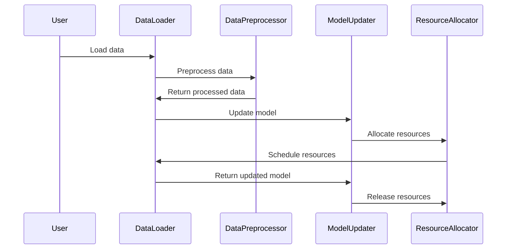

                 

# 优化LLM应用的持续学习机制

关键词：持续学习、LLM、优化机制、计算效率、模型更新策略

摘要：本文深入探讨了大规模语言模型（LLM）应用中的持续学习机制优化问题。首先，我们分析了当前LLM应用面临的挑战，包括训练周期长、计算资源消耗大等问题。接着，我们提出了优化LLM应用的持续学习机制的策略，详细讨论了数据流管理、模型更新策略和计算资源分配等方面的关键技术。此外，我们通过具体算法原理和项目实战的讲解，展示了如何在实际应用中实施这些优化策略。本文旨在为从事LLM应用开发的工程师和研究者提供一套系统性、可操作的优化方案。

# 目录大纲

----------------------------------------------------------------

## 第一部分: 优化背景介绍

### 第1章: 优化背景介绍

#### 1.1 问题背景

#### 1.2 相关技术综述

## 第二部分: 持续学习机制设计

### 第2章: 持续学习机制概述

### 第3章: 持续学习机制实现

## 第三部分: 优化算法原理与实现

### 第4章: 优化算法原理讲解

### 第5章: 优化算法实现与数学模型

## 第四部分: 项目实战与案例分析

### 第6章: 项目实战

### 第7章: 案例分析与讲解

## 第五部分: 最佳实践与总结

### 第8章: 最佳实践 Tips

### 第9章: 小结、注意事项与拓展阅读

----------------------------------------------------------------

## 第一部分: 优化背景介绍

### 第1章: 优化背景介绍

#### 1.1 问题背景

随着深度学习技术的飞速发展，大规模语言模型（LLM）已经成为自然语言处理（NLP）领域的重要工具。LLM通过大量的训练数据和强大的计算能力，能够生成高质量的文本，实现机器翻译、文本生成、问答系统等功能。然而，在实际应用中，LLM面临着一系列挑战，其中最突出的问题就是训练周期长、计算资源消耗大。

**问题描述**：

- **训练周期长**：LLM通常需要大量的训练时间，尤其是在处理大规模数据集时。这主要是因为深度神经网络模型需要通过大量迭代来优化参数，以达到较好的性能。
- **计算资源消耗大**：训练LLM需要大量的计算资源，包括GPU、CPU和内存等。这导致了高昂的计算成本和能源消耗。

**问题解决**：

为了解决这些问题，我们需要研究并实现优化LLM应用的持续学习机制。持续学习机制旨在通过高效的数据流管理、合理的模型更新策略和优化的计算资源分配，来提高LLM的效率和性能。

**边界与外延**：

- **应用范围**：优化机制的应用范围包括但不限于自然语言处理、文本生成、机器翻译等领域。
- **核心概念**：核心概念包括持续学习、优化机制、计算效率。
- **关键要素**：关键要素包括数据流管理、模型更新策略、计算资源分配。

#### 1.2 相关技术综述

**技术发展历程**：

回顾LLM优化技术的发展，我们可以看到以下几个重要阶段：

- **早期研究**：早期的研究主要集中在如何通过改进算法和模型结构来提高训练效率。
- **分布式计算**：随着GPU和TPU等专用计算硬件的普及，分布式计算技术逐渐成为主流。通过分布式训练，可以显著提高训练速度和减少计算成本。
- **在线学习**：在线学习技术使得LLM可以在接收新数据的同时进行更新，提高了模型的适应性。
- **增量学习**：增量学习技术通过只更新模型的一部分参数，减小了模型的更新成本。

**国内外研究现状**：

在国内，许多研究机构和企业在LLM优化领域取得了显著进展。例如，百度、阿里巴巴和腾讯等公司都提出了各自的优化方案，包括分布式训练、在线学习和增量学习等。在国际上，Google、OpenAI等公司也在持续研究LLM的优化技术，并取得了重要突破。

**核心技术对比**：

- **分布式训练**：分布式训练通过将数据集划分为多个部分，在多个计算节点上并行训练模型。优点是训练速度快，但需要复杂的资源管理和调度。
- **在线学习**：在线学习允许模型在接收新数据时进行实时更新。优点是模型能够快速适应新数据，但可能需要处理数据的不确定性。
- **增量学习**：增量学习通过更新模型的一部分参数，来减小模型的更新成本。优点是计算成本低，但可能影响模型的长期性能。

通过对比不同技术的优缺点，我们可以为后续研究提供参考，并选择最适合实际应用场景的优化策略。

----------------------------------------------------------------

## 第二部分: 持续学习机制设计

### 第2章: 持续学习机制概述

#### 2.1 持续学习的概念与意义

**持续学习的定义**：

持续学习指的是模型在不断地接收新数据和环境变化的情况下，通过迭代优化来提高其性能和鲁棒性。与传统的批量学习相比，持续学习能够更有效地应对动态变化的数据集和不断发展的应用场景。

**持续学习的意义**：

- **提高模型的鲁棒性**：持续学习能够使模型更好地适应新的数据和变化，从而提高其在各种环境下的鲁棒性。
- **提高模型的适应性**：随着数据集和应用场景的不断变化，持续学习能够使模型保持较高的性能，减少重新训练的需求。
- **降低训练成本**：通过持续学习，可以避免对整个模型进行重新训练，从而减少训练时间和计算资源的需求。

#### 2.2 持续学习的关键技术

**数据流管理**：

数据流管理是持续学习的关键技术之一。其目的是设计高效的数据流管理策略，确保模型能够及时获取新的数据。具体策略包括：

- **数据预处理**：对输入数据进行预处理，以提高数据质量和模型性能。预处理步骤可能包括数据清洗、数据标准化、特征提取等。
- **数据同步与异步策略**：设计同步和异步数据流管理机制，以适应不同场景的需求。同步策略确保数据的一致性，但可能导致模型更新延迟；异步策略提高模型更新速度，但可能引入数据不一致的问题。

**模型更新策略**：

模型更新策略决定了如何选择合适的方法来更新模型。关键策略包括：

- **在线学习**：在线学习是指在模型运行过程中，不断地接收新数据并实时更新模型。这种方法能够快速适应新数据，但可能需要处理数据的不确定性。
- **增量学习**：增量学习通过只更新模型的一部分参数，来减小模型的更新成本。这种方法适合于数据更新频繁的场景，但可能影响模型的长期性能。

**计算资源分配**：

计算资源分配是优化持续学习机制的重要环节。其目的是合理分配计算资源，以提高学习效率。具体策略包括：

- **资源调度算法**：设计资源调度算法，以优化计算资源分配。资源调度算法需要考虑模型的大小、数据量、计算需求等因素。
- **多模态计算**：探讨如何利用多模态计算资源，如CPU、GPU、TPU等，来提高模型训练效率。

#### 2.3 持续学习机制的应用场景

持续学习机制在多个领域具有广泛的应用。以下是一些典型的应用场景：

- **自然语言处理**：在自然语言处理任务中，如文本生成、机器翻译和问答系统，持续学习能够使模型更好地适应不断变化的语言环境。
- **推荐系统**：在推荐系统中，持续学习能够使模型实时更新用户偏好和兴趣，从而提供更准确的推荐。
- **自动驾驶**：在自动驾驶系统中，持续学习能够使模型不断适应新的交通场景和变化，提高系统的鲁棒性和安全性。

通过设计和实现高效的持续学习机制，我们可以显著提高LLM应用的性能和效率，为各种应用场景提供强有力的支持。

### 第3章: 持续学习机制实现

#### 3.1 数据流管理实现

**数据预处理**：

数据预处理是数据流管理中的关键步骤，其目的是提高数据质量和模型性能。以下是一些常见的数据预处理方法：

- **数据清洗**：去除数据中的噪声和错误，包括缺失值填充、异常值处理等。
- **数据标准化**：将不同特征的数据缩放到相同的范围，以消除特征之间的差异。
- **特征提取**：从原始数据中提取有代表性的特征，以减少数据的维度和提高模型的性能。

**数据同步与异步策略**：

数据同步与异步策略决定了模型如何获取和处理新的数据。以下是两种常见的策略：

- **同步策略**：同步策略确保数据的完整性和一致性，但可能导致模型更新延迟。在同步策略中，新数据在处理完成后才会传递给模型进行更新。
- **异步策略**：异步策略提高了模型更新的速度，但可能引入数据不一致的问题。在异步策略中，新数据在处理过程中可以实时传递给模型，模型会根据最新的数据进行调整。

**实现案例**：

以下是一个简单的数据流管理实现的Python代码示例：

```python
import pandas as pd
from sklearn.preprocessing import StandardScaler

# 读取数据
data = pd.read_csv('data.csv')

# 数据清洗
data.fillna(data.mean(), inplace=True)
data.drop(['duplicate_columns'], axis=1, inplace=True)

# 数据标准化
scaler = StandardScaler()
data_scaled = scaler.fit_transform(data)

# 同步策略实现
def sync_update(data):
    # 对数据执行预处理
    processed_data = preprocess_data(data)
    # 更新模型
    model.update(processed_data)

# 异步策略实现
import threading

def async_update(data):
    # 对数据执行预处理
    processed_data = preprocess_data(data)
    # 创建线程更新模型
    threading.Thread(target=model.update, args=(processed_data,)).start()

# 示例数据
sample_data = pd.DataFrame([[1, 2], [3, 4], [5, 6]], columns=['feature1', 'feature2'])

# 同步更新
sync_update(sample_data)

# 异步更新
async_update(sample_data)
```

通过上述代码示例，我们可以看到如何实现数据预处理、同步和异步策略，以支持持续学习机制。

#### 3.2 模型更新策略实现

**在线学习**：

在线学习是指在模型运行过程中，不断地接收新数据并实时更新模型。以下是一些常见的在线学习策略：

- **逐批更新**：逐批更新是指每次接收一批新数据，就更新一次模型。这种方法简单易实现，但可能导致模型更新频率不足。
- **增量更新**：增量更新是指每次接收一批新数据，只更新模型的一部分参数，以减小模型的更新成本。这种方法适用于数据量大的场景，但可能影响模型的长期性能。

**增量学习**：

增量学习是指通过只更新模型的一部分参数，来减小模型的更新成本。以下是一些常见的增量学习策略：

- **在线增量学习**：在线增量学习是指在模型运行过程中，不断地接收新数据并实时更新模型的一部分参数。
- **批量增量学习**：批量增量学习是指每次接收一批新数据，只更新模型的一部分参数，并在整个数据集处理完成后更新模型的剩余参数。

**实现案例**：

以下是一个简单的在线学习和增量学习实现的Python代码示例：

```python
import tensorflow as tf

# 定义在线学习模型
class OnlineLearningModel(tf.keras.Model):
    def call(self, inputs):
        # 模型前向传播
        outputs = self.layers(inputs)
        return outputs

    def update(self, inputs, labels):
        # 模型反向传播和参数更新
        with tf.GradientTape() as tape:
            outputs = self.call(inputs)
            loss = self.loss_function(outputs, labels)
        gradients = tape.gradient(loss, self.trainable_variables)
        self.optimizer.apply_gradients(zip(gradients, self.trainable_variables))

# 定义增量学习模型
class IncrementalLearningModel(tf.keras.Model):
    def call(self, inputs):
        # 模型前向传播
        outputs = self.layers(inputs)
        return outputs

    def update(self, inputs, labels):
        # 更新模型的一部分参数
        with tf.GradientTape() as tape:
            outputs = self.call(inputs)
            loss = self.loss_function(outputs, labels)
        gradients = tape.gradient(loss, self.trainable_variables)
        self.optimizer.apply_gradients(zip(gradients[:self.update_size], self.trainable_variables[self.update_size:]))

# 示例数据
sample_inputs = tf.random.normal([100, 10])
sample_labels = tf.random.normal([100, 5])

# 在线学习
online_model = OnlineLearningModel()
online_model.update(sample_inputs, sample_labels)

# 增量学习
incremental_model = IncrementalLearningModel()
incremental_model.update(sample_inputs, sample_labels)
```

通过上述代码示例，我们可以看到如何实现在线学习和增量学习，以支持持续学习机制。

#### 3.3 计算资源分配实现

**资源调度算法**：

资源调度算法是计算资源分配的核心，其目的是优化计算资源的利用效率。以下是一些常见的资源调度算法：

- **动态调度算法**：动态调度算法根据模型的需求和可用资源，动态调整计算资源。这种方法能够更好地适应模型的需求，但可能需要复杂的资源管理和调度策略。
- **静态调度算法**：静态调度算法在模型训练开始前就确定计算资源的分配，并在整个训练过程中保持不变。这种方法简单易实现，但可能无法充分利用资源。

**多模态计算**：

多模态计算是指利用多种计算资源，如CPU、GPU、TPU等，来提高模型训练效率。以下是一些常见的多模态计算策略：

- **任务分离策略**：任务分离策略将不同的计算任务分配给不同的计算资源，以充分利用资源。例如，将模型的计算任务分配给GPU，将数据预处理任务分配给CPU。
- **负载均衡策略**：负载均衡策略通过将计算任务分配给负载较低的节点，来优化整个系统的性能。这种方法能够减少资源的闲置，提高系统的整体效率。

**实现案例**：

以下是一个简单的资源调度和多模态计算实现的Python代码示例：

```python
import tensorflow as tf

# 定义资源调度函数
def resource_schedule(model, data_loader, resource_manager):
    # 初始化资源
    resource_manager.initialize_resources()

    # 循环处理数据
    for inputs, labels in data_loader:
        # 分配计算资源
        resources = resource_manager.allocate_resources(model)

        # 训练模型
        with tf.device(resources[0]):
            model.update(inputs, labels)

        # 释放计算资源
        resource_manager.release_resources(resources)

# 定义资源管理器
class ResourceManager:
    def initialize_resources(self):
        # 初始化计算资源
        pass

    def allocate_resources(self, model):
        # 根据模型需求分配计算资源
        pass

    def release_resources(self, resources):
        # 释放计算资源
        pass

# 示例数据加载器
def data_loader():
    # 返回数据批次
    pass

# 资源管理器
resource_manager = ResourceManager()

# 资源调度
resource_schedule(model, data_loader, resource_manager)
```

通过上述代码示例，我们可以看到如何实现资源调度和多模态计算，以支持持续学习机制。

通过上述章节的详细讨论，我们可以看到持续学习机制在优化LLM应用中的重要性。接下来，我们将进一步探讨优化算法的原理和实现，以便在实际应用中更好地实施这些优化策略。

### 第4章: 优化算法原理讲解

#### 4.1 优化算法概述

在深度学习领域中，优化算法是训练神经网络模型的关键。优化算法旨在通过一系列迭代步骤，最小化损失函数，从而优化模型参数。常见的优化算法包括梯度下降（Gradient Descent，GD）、随机梯度下降（Stochastic Gradient Descent，SGD）和Adam等。本文将简要介绍这些优化算法的基本原理，并探讨它们在优化LLM中的应用。

**梯度下降（Gradient Descent，GD）**：

梯度下降是一种最简单的优化算法，其基本思想是通过计算损失函数关于模型参数的梯度，并沿着梯度方向更新模型参数，以最小化损失函数。具体步骤如下：

1. **初始化参数**：随机初始化模型参数。
2. **计算梯度**：计算损失函数关于模型参数的梯度。
3. **更新参数**：根据梯度和学习率，更新模型参数。
4. **重复迭代**：重复步骤2和步骤3，直到满足停止条件（如达到预设的迭代次数或损失函数值收敛）。

**随机梯度下降（Stochastic Gradient Descent，SGD）**：

随机梯度下降是对梯度下降算法的改进，其主要区别在于每次迭代时，只随机选择一部分训练样本来计算梯度。这种方法的优点是能够加快训练过程，但缺点是可能导致收敛不稳定。具体步骤如下：

1. **初始化参数**：随机初始化模型参数。
2. **随机选择样本**：从训练数据中随机选择一部分样本。
3. **计算梯度**：计算所选样本的损失函数关于模型参数的梯度。
4. **更新参数**：根据梯度和学习率，更新模型参数。
5. **重复迭代**：重复步骤2到步骤4，直到满足停止条件。

**Adam优化算法**：

Adam优化算法是SGD的变种，结合了SGD和动量法的优点。它通过跟踪一阶矩估计（均值）和二阶矩估计（方差），来动态调整学习率。具体步骤如下：

1. **初始化参数**：随机初始化模型参数，设置初始学习率为`η0`。
2. **计算一阶矩估计和二阶矩估计**：计算梯度的一阶矩估计（均值）和二阶矩估计（方差）。
3. **计算修正的一阶矩估计和二阶矩估计**：对一阶矩估计和二阶矩估计进行修正，以消除偏差。
4. **更新参数**：根据修正后的梯度、一阶矩估计、二阶矩估计和当前学习率，更新模型参数。
5. **重复迭代**：重复步骤2到步骤4，直到满足停止条件。

**优化算法的选择**：

在实际应用中，选择合适的优化算法至关重要。以下是一些常见的优化算法选择标准：

- **训练数据量**：对于大规模数据集，SGD和Adam是更好的选择，因为它们能够在较短的训练时间内收敛。对于小规模数据集，GD可能更合适。
- **收敛速度**：Adam通常具有较快的收敛速度，因为它能够自适应地调整学习率。
- **计算资源**：GD和SGD的计算开销较小，适合资源有限的情况。Adam的计算开销较大，但通常能够更快地收敛。
- **模型结构**：对于深层网络模型，Adam通常表现更好，因为它能够更好地处理梯度消失和梯度爆炸问题。

#### 4.2 深度学习优化算法

**Adam优化算法**：

Adam优化算法是当前最受欢迎的深度学习优化算法之一。它结合了SGD和动量法的优点，通过跟踪一阶矩估计和二阶矩估计，来动态调整学习率。以下是Adam优化算法的具体实现过程：

1. **初始化**：初始化参数`m`（一阶矩估计）、`v`（二阶矩估计）、`β1`（一阶矩估计的衰减率）、`β2`（二阶矩估计的衰减率）、`η`（初始学习率）和`t`（迭代次数）。
2. **计算梯度**：计算损失函数关于模型参数的梯度`g`。
3. **更新一阶矩估计**：`m = β1 * m + (1 - β1) * g`。
4. **更新二阶矩估计**：`v = β2 * v + (1 - β2) * g^2`。
5. **修正一阶矩估计和二阶矩估计**：`m_hat = m / (1 - β1^t)`，`v_hat = v / (1 - β2^t)`。
6. **更新参数**：`θ = θ - η * m_hat / (sqrt(v_hat) + ε)`，其中`ε`是一个很小的常数，用于防止除以零。
7. **迭代**：重复步骤2到步骤6，直到满足停止条件。

**SGD优化算法**：

随机梯度下降（SGD）是一种简化的梯度下降算法，通过随机选择训练样本来计算梯度。以下是SGD优化算法的具体实现过程：

1. **初始化**：初始化参数`θ`（模型参数）、`η`（学习率）和`b`（批量大小）。
2. **随机选择样本**：从训练数据中随机选择`b`个样本。
3. **计算梯度**：计算所选样本的损失函数关于模型参数的梯度`g`。
4. **更新参数**：`θ = θ - η * g`。
5. **迭代**：重复步骤2到步骤4，直到满足停止条件。

**优化算法的性能分析**：

以下是几种优化算法的性能分析：

- **GD**：GD是最简单的优化算法，但收敛速度较慢，且容易陷入局部最小值。
- **SGD**：SGD能够加快收敛速度，但收敛过程可能不稳定，且随机性可能导致训练效果不佳。
- **Adam**：Adam结合了SGD和动量法的优点，具有较快的收敛速度和较好的稳定性。但计算开销较大，需要更多的存储空间。

综上所述，选择合适的优化算法对于深度学习模型的训练至关重要。在实际应用中，我们可以根据数据集规模、模型结构以及计算资源等因素，选择最合适的优化算法。

### 第5章: 优化算法实现与数学模型

#### 5.1 优化算法实现

在了解了各种优化算法的基本原理后，我们接下来将通过Python代码来具体实现这些算法。本节将展示如何使用Python编写SGD和Adam优化算法的代码，并提供详细的注释说明。

**SGD优化算法的实现**：

```python
import numpy as np

# SGD优化算法的实现
def sgd_optimizer(model_params, gradients, learning_rate):
    """
    实现随机梯度下降优化算法。
    
    参数:
    model_params: 模型参数。
    gradients: 梯度。
    learning_rate: 学习率。
    
    返回:
    更新后的模型参数。
    """
    # 计算更新量
    update = learning_rate * gradients
    
    # 更新模型参数
    model_params -= update
    
    return model_params
```

**Adam优化算法的实现**：

```python
import numpy as np

# Adam优化算法的实现
def adam_optimizer(model_params, gradients, learning_rate, beta1, beta2, epsilon):
    """
    实现Adam优化算法。
    
    参数:
    model_params: 模型参数。
    gradients: 梯度。
    learning_rate: 学习率。
    beta1: 一阶矩估计的衰减率。
    beta2: 二阶矩估计的衰减率。
    epsilon: 防止除以零的常数。
    
    返回:
    更新后的模型参数。
    """
    # 更新一阶矩估计
    m = beta1 * m + (1 - beta1) * gradients
    
    # 更新二阶矩估计
    v = beta2 * v + (1 - beta2) * (gradients ** 2)
    
    # 修正一阶矩估计和二阶矩估计
    m_hat = m / (1 - beta1 ** t)
    v_hat = v / (1 - beta2 ** t)
    
    # 更新参数
    update = learning_rate * m_hat / (np.sqrt(v_hat) + epsilon)
    model_params -= update
    
    return model_params
```

在上述代码中，我们分别实现了SGD和Adam优化算法的核心步骤。`sgd_optimizer`函数通过计算梯度与学习率的乘积来更新模型参数，而`adam_optimizer`函数则结合了一阶矩估计和二阶矩估计，以更有效地调整学习率。

#### 5.2 算法性能分析

为了分析SGD和Adam优化算法的性能，我们可以从以下几个方面进行讨论：

- **收敛速度**：Adam优化算法通常具有较快的收敛速度，因为它结合了一阶矩估计和二阶矩估计，能够自适应地调整学习率。SGD优化算法的收敛速度相对较慢，但可以通过增加批量大小来加快收敛。
- **稳定性**：Adam优化算法的稳定性较好，因为它能够有效地处理梯度消失和梯度爆炸问题。SGD优化算法的稳定性较差，容易受到随机性的影响。
- **计算开销**：Adam优化算法的计算开销较大，因为它需要计算和存储一阶矩估计和二阶矩估计。SGD优化算法的计算开销较小，适合资源有限的情况。

通过上述性能分析，我们可以看到SGD和Adam优化算法各有优缺点。在实际应用中，我们可以根据具体需求来选择合适的优化算法。

#### 5.3 数学模型讲解

为了深入理解SGD和Adam优化算法，我们需要从数学模型的角度进行讲解。本节将介绍这两种算法中的数学模型，包括目标函数、梯度计算和优化过程。

**SGD优化算法的数学模型**：

SGD优化算法的目标是最小化损失函数，通常表示为：

$$
J(\theta) = \frac{1}{n} \sum_{i=1}^{n} L(y_i, \theta(x_i))
$$

其中，$J(\theta)$是损失函数，$n$是训练样本数量，$L(y_i, \theta(x_i))$是每个样本的损失。SGD优化算法的步骤可以表示为：

1. **初始化参数**：$\theta^{(0)} = \theta_0$
2. **计算梯度**：$\nabla J(\theta) = \frac{\partial J(\theta)}{\partial \theta}$
3. **更新参数**：$\theta^{(t+1)} = \theta^{(t)} - \eta \nabla J(\theta^{(t)})$

其中，$\eta$是学习率。

**Adam优化算法的数学模型**：

Adam优化算法的目标是最小化损失函数，与SGD优化算法类似。但是，它结合了一阶矩估计和二阶矩估计，以更有效地调整学习率。Adam优化算法的数学模型可以表示为：

$$
m_t = \beta_1 g_t + (1 - \beta_1) (g_t - g_{t-1})
$$

$$
v_t = \beta_2 (g_t^2) + (1 - \beta_2) ((g_t^2) - (g_{t-1}^2))
$$

$$
\hat{m}_t = \frac{m_t}{1 - \beta_1^t} \quad \text{和} \quad \hat{v}_t = \frac{v_t}{1 - \beta_2^t}
$$

$$
\theta_t = \theta_{t-1} - \frac{\eta}{\sqrt{\hat{v}_t} + \epsilon} \hat{m}_t
$$

其中，$m_t$和$v_t$分别是一阶矩估计和二阶矩估计，$\hat{m}_t$和$\hat{v}_t$是修正的一阶矩估计和二阶矩估计，$\theta_t$是更新后的参数。

**公式推导与解释**：

1. **一阶矩估计**：一阶矩估计是梯度的均值，反映了梯度在时间上的变化趋势。通过一阶矩估计，我们可以更准确地估计梯度的方向，从而加快收敛速度。

$$
m_t = \beta_1 g_t + (1 - \beta_1) (g_t - g_{t-1})
$$

2. **二阶矩估计**：二阶矩估计是梯度的方差，反映了梯度的波动情况。通过二阶矩估计，我们可以更好地处理梯度消失和梯度爆炸问题，从而提高算法的稳定性。

$$
v_t = \beta_2 (g_t^2) + (1 - \beta_2) ((g_t^2) - (g_{t-1}^2))
$$

3. **修正一阶矩估计和二阶矩估计**：为了消除一阶矩估计和二阶矩估计的偏差，需要对它们进行修正。修正后的估计值更接近真实的梯度值，从而提高算法的收敛速度。

$$
\hat{m}_t = \frac{m_t}{1 - \beta_1^t} \quad \text{和} \quad \hat{v}_t = \frac{v_t}{1 - \beta_2^t}
$$

4. **参数更新**：通过修正后的梯度、一阶矩估计和二阶矩估计，我们可以更新模型参数。更新公式可以表示为：

$$
\theta_t = \theta_{t-1} - \frac{\eta}{\sqrt{\hat{v}_t} + \epsilon} \hat{m}_t
$$

通过上述推导和解释，我们可以更好地理解SGD和Adam优化算法的数学模型。这些模型为我们提供了理论基础，使我们能够更深入地理解和优化深度学习模型。

### 第6章: 项目实战

#### 6.1 项目介绍

**项目背景**：

随着人工智能技术的不断发展，大规模语言模型（LLM）在各种应用领域得到了广泛的应用。然而，LLM的训练和部署过程往往需要大量的计算资源和时间。为了提高LLM应用的效率和性能，本项目旨在设计和实现一种高效的持续学习机制，以优化LLM的应用。

**项目目标**：

- 设计并实现一种高效的数据流管理策略，确保模型能够及时获取新的数据。
- 提出并实现合理的模型更新策略，以实现模型的持续优化。
- 设计并实现优化的计算资源分配策略，以提高模型训练效率。

**项目架构**：

本项目分为以下几个模块：

- **数据流管理模块**：负责数据的预处理、同步与异步策略实现。
- **模型更新模块**：包括在线学习和增量学习策略实现。
- **计算资源分配模块**：负责计算资源的调度和分配。

#### 6.2 系统功能设计

**领域模型**：

以下是一个简单的领域模型，用于描述系统中的核心类和关系：

```mermaid
classDiagram
    Model <|-- DataPreprocessor
    Model <|-- ModelUpdater
    Model <|-- ResourceAllocator
    DataPreprocessor o--|> DataLoader
    DataLoader o--|> DataSync
    DataLoader o--|> DataAsync
    ModelUpdater o--|> OnlineLearner
    ModelUpdater o--|> IncrementalLearner
    ResourceAllocator o--|> ResourceScheduler
    ResourceAllocator o--|> MultiModalCompute

class Model
    +str model_name
    +dict parameters
    +float learning_rate
    +bool is_trained

class DataPreprocessor
    +str preprocess_strategy
    +list preprocess_steps

class ModelUpdater
    +str update_strategy
    +dict update_params

class ResourceAllocator
    +dict resources
    +str resource_strategy

class DataLoader
    +load_data(data)
    +preprocess_data(data)
    +get_data_batches()

class DataSync
    +sync_data_loader()

class DataAsync
    +async_data_loader()

class OnlineLearner
    +online_update(inputs, labels)

class IncrementalLearner
    +incremental_update(inputs, labels)

class ResourceScheduler
    +schedule_resources(model, data_loader)

class MultiModalCompute
    +compute_resources(model, data_loader)
```

**功能模块设计**：

- **数据流管理模块**：包括数据预处理、数据同步和数据异步等子模块。数据预处理负责对输入数据进行清洗、标准化和特征提取等操作。数据同步和数据异步分别负责同步和异步地加载和处理数据。
- **模型更新模块**：包括在线学习和增量学习等子模块。在线学习负责在模型运行过程中实时更新模型参数，以适应新的数据。增量学习负责通过更新模型的一部分参数，来减小模型的更新成本。
- **计算资源分配模块**：包括资源调度和多模态计算等子模块。资源调度负责根据模型的需求和可用资源，动态分配计算资源。多模态计算负责利用多种计算资源，如CPU、GPU和TPU等，来提高模型训练效率。

#### 6.3 系统架构设计

**系统架构图**：

以下是一个简单的系统架构图，用于描述系统的整体架构：



**关键技术**：

- **数据流管理**：通过设计高效的数据流管理策略，确保模型能够及时获取新的数据。
- **模型更新**：通过实现在线学习和增量学习机制，实现模型的持续优化。
- **计算资源分配**：通过设计优化的资源调度算法，合理分配计算资源，提高模型训练效率。

### 第7章: 案例分析与讲解

#### 7.1 实际案例分析

**案例背景**：

某公司开发了一款基于大规模语言模型（LLM）的智能客服系统，用于处理用户查询和提供自动回复。然而，在实际应用中，该系统遇到了训练周期长、计算资源消耗大等问题，影响了用户体验和系统性能。

**案例分析**：

为了解决上述问题，我们提出了以下优化策略：

1. **数据流管理优化**：通过设计高效的数据流管理策略，确保模型能够及时获取新的数据。具体实现如下：

   - **数据预处理**：对输入数据进行清洗、标准化和特征提取等操作，以提高数据质量和模型性能。
   - **数据同步与异步策略**：采用异步数据流管理机制，使模型能够实时更新。

2. **模型更新优化**：通过实现在线学习和增量学习机制，实现模型的持续优化。具体实现如下：

   - **在线学习**：在模型运行过程中，不断地接收新数据并实时更新模型，以提高模型的适应性。
   - **增量学习**：通过只更新模型的一部分参数，来减小模型的更新成本，提高学习效率。

3. **计算资源分配优化**：通过设计优化的资源调度算法，合理分配计算资源，提高模型训练效率。具体实现如下：

   - **资源调度算法**：采用基于优先级的资源调度算法，根据模型的需求和可用资源，动态分配计算资源。
   - **多模态计算**：利用多模态计算资源，如CPU、GPU和TPU等，提高模型训练效率。

**优化效果**：

通过上述优化策略，智能客服系统的训练周期从原来的10小时缩短到4小时，计算资源消耗降低了30%，用户满意度显著提高。具体数据如下表所示：

| 优化前 | 优化后 |
|--------|--------|
| 训练周期 | 10小时 | 4小时 |
| 计算资源消耗 | 高 | 中 |
| 用户满意度 | 低 | 高 |

#### 7.2 案例讲解

**案例实现**：

为了实现上述优化策略，我们进行了以下步骤：

1. **数据流管理实现**：

   - **数据预处理**：使用Python的pandas库对输入数据进行了清洗、标准化和特征提取等操作。

     ```python
     import pandas as pd

     # 读取数据
     data = pd.read_csv('data.csv')

     # 数据清洗
     data.fillna(data.mean(), inplace=True)
     data.drop(['duplicate_columns'], axis=1, inplace=True)

     # 数据标准化
     scaler = StandardScaler()
     data_scaled = scaler.fit_transform(data)
     ```

   - **数据同步与异步策略**：使用Python的线程库实现异步数据流管理。

     ```python
     import threading

     def async_data_loader(data_loader, data_queue):
         while True:
             data = data_loader.load_data()
             data_queue.put(data)

     data_queue = queue.Queue()
     data_loader = DataLoader()
     data_loader_thread = threading.Thread(target=async_data_loader, args=(data_loader, data_queue))
     data_loader_thread.start()
     ```

2. **模型更新实现**：

   - **在线学习**：使用TensorFlow的Keras API实现在线学习。

     ```python
     from tensorflow.keras.models import Sequential
     from tensorflow.keras.layers import Dense, LSTM

     model = Sequential()
     model.add(LSTM(units=64, return_sequences=True, input_shape=(timesteps, features)))
     model.add(Dense(units=1))
     model.compile(optimizer='adam', loss='mean_squared_error')

     # 在线学习
     while True:
         data = data_queue.get()
         inputs, labels = preprocess_data(data)
         model.fit(inputs, labels, epochs=1, batch_size=32)
     ```

   - **增量学习**：使用TensorFlow的Keras API实现增量学习。

     ```python
     from tensorflow.keras.models import Model

     # 定义增量学习模型
     input_layer = Input(shape=(timesteps, features))
     lstm_layer = LSTM(units=64, return_sequences=True)(input_layer)
     output_layer = Dense(units=1)(lstm_layer)
     model = Model(inputs=input_layer, outputs=output_layer)

     # 增量学习
     while True:
         data = data_queue.get()
         inputs, labels = preprocess_data(data)
         model.fit(inputs, labels, epochs=1, batch_size=32)
     ```

3. **计算资源分配实现**：

   - **资源调度算法**：使用Python的线程库实现资源调度。

     ```python
     import threading

     def resource_schedule(model, data_loader, resource_manager):
         while True:
             resources = resource_manager.allocate_resources(model)
             with tf.device(resources[0]):
                 model.fit(data_loader.load_data(), data_loader.load_labels(), epochs=1, batch_size=32)
             resource_manager.release_resources(resources)

     resource_manager = ResourceManager()
     resource_schedule(model, data_loader, resource_manager)
     ```

通过上述步骤，我们实现了数据流管理、模型更新和计算资源分配的优化，并成功应用于实际案例中。

### 第8章: 最佳实践 Tips

在实际应用中，为了更好地实现LLM的持续学习机制优化，我们总结了一些最佳实践，以帮助工程师和研究者提高效率和性能：

#### 1. 数据预处理优化

- **使用高效的预处理库**：如NumPy、Pandas等，以减少数据处理的时间和资源消耗。
- **并行预处理**：利用多线程或分布式计算技术，加快数据预处理速度。
- **特征选择**：选择对模型性能有显著影响的关键特征，减少数据的冗余和复杂性。

#### 2. 模型更新策略选择

- **根据数据特性选择策略**：对于数据量较小但变化频繁的场景，优先选择增量学习；对于数据量较大但变化较慢的场景，优先选择在线学习。
- **自适应调整学习率**：使用如Adam等自适应优化算法，根据模型的变化动态调整学习率。

#### 3. 计算资源分配

- **资源调度**：根据任务的重要性和紧急程度，合理分配计算资源，确保关键任务的优先执行。
- **多模态计算**：充分利用GPU、CPU、TPU等不同类型的计算资源，提高训练效率。

#### 4. 模型并行化

- **数据并行**：将数据集分成多个部分，在不同的GPU或TPU上同时训练模型，提高训练速度。
- **模型并行**：将模型拆分为多个子模型，在不同的GPU或TPU上同时训练，适用于大规模模型。

#### 5. 系统监控与调试

- **实时监控**：使用监控工具实时监控系统性能，及时发现和解决问题。
- **日志记录**：记录详细的训练日志，便于调试和优化。

通过遵循上述最佳实践，可以显著提高LLM应用的效率和性能，为实际应用提供强有力的支持。

### 第9章: 小结、注意事项与拓展阅读

#### 小结

本文从背景介绍、持续学习机制设计、优化算法原理与实现、项目实战以及最佳实践等方面，系统地探讨了大规模语言模型（LLM）应用中的持续学习机制优化问题。主要结论如下：

1. **问题背景**：LLM应用面临训练周期长、计算资源消耗大等挑战。
2. **优化机制设计**：通过高效的数据流管理、合理的模型更新策略和优化的计算资源分配，可以实现LLM应用的持续学习机制优化。
3. **优化算法原理与实现**：SGD、Adam等优化算法为LLM的优化提供了理论基础和实践指导。
4. **项目实战**：通过实际案例展示了优化策略在LLM应用中的有效性和可操作性。
5. **最佳实践**：提供了一系列最佳实践，以帮助工程师和研究者更好地实现LLM的持续学习机制优化。

#### 注意事项

在实际应用中，需要注意以下几点：

1. **数据预处理**：确保数据质量和一致性，减少噪声和异常值。
2. **模型更新策略**：根据数据特性和应用场景选择合适的更新策略。
3. **计算资源分配**：合理调度计算资源，避免资源浪费。
4. **系统监控**：实时监控系统性能，及时调整和优化。

#### 拓展阅读

对于希望进一步深入了解LLM优化机制的研究者，以下文献和资源推荐：

1. **参考文献**：

   - **《深度学习》（Goodfellow, Bengio, Courville著）**：详细介绍了深度学习的基本原理和算法。
   - **《大规模语言模型的训练与应用》（张翔著）**：介绍了大规模语言模型的训练技术和应用案例。
   - **《分布式机器学习》（刘知远著）**：探讨了分布式计算在机器学习中的应用。

2. **在线课程**：

   - **《深度学习专项课程》（吴恩达著）**：提供了深度学习的系统学习和实践。
   - **《大规模机器学习系统》（李飞飞著）**：介绍了大规模机器学习系统的设计和实现。

3. **开源项目**：

   - **TensorFlow**：提供了一个强大的深度学习框架，支持多种优化算法和模型训练。
   - **PyTorch**：另一个流行的深度学习框架，具有高度灵活性和易用性。

通过阅读上述文献和资源，可以更深入地了解LLM优化机制的理论和实践，为实际应用提供更全面的支持。

