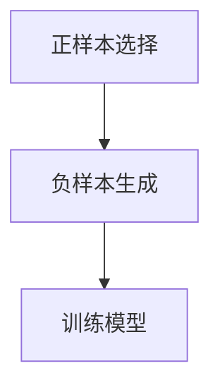
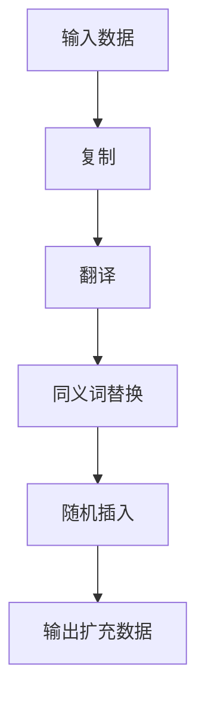
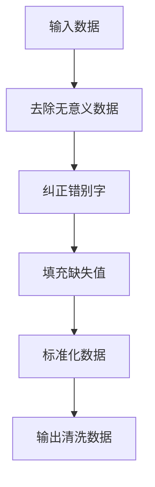
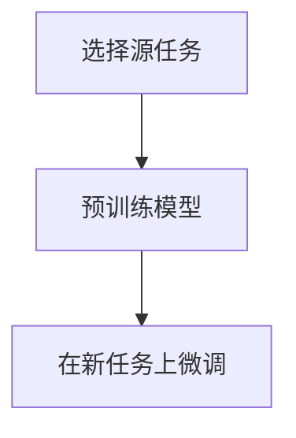
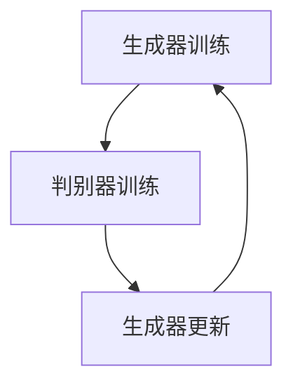
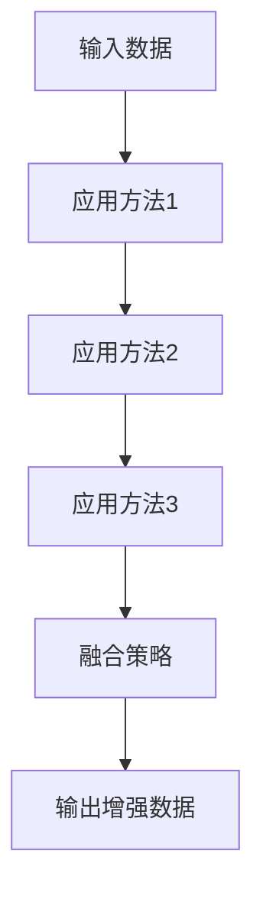
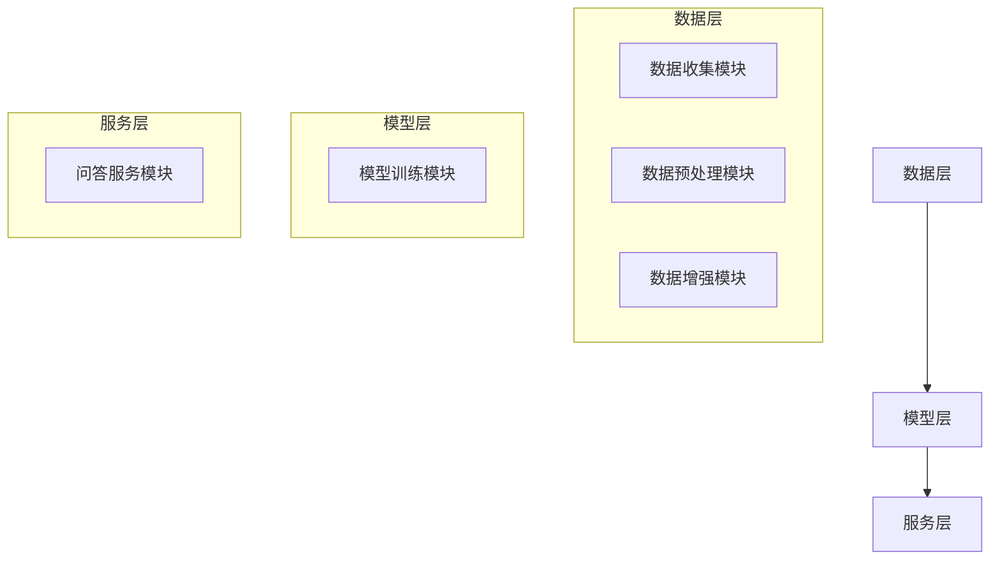
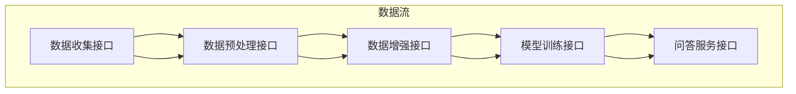

                 

## 优化LLM应用的数据增强策略

### 关键词：预训练语言模型、数据增强、性能提升、算法原理、实际应用

#### 摘要：

随着人工智能技术的快速发展，预训练语言模型（LLM，Large Language Model）在自然语言处理（NLP）领域取得了显著的成就。然而，LLM的性能受限于其训练数据的质量和多样性。本文旨在探讨如何优化LLM应用中的数据增强策略，以提高模型的性能。本文首先介绍了数据增强策略的背景和重要性，然后对比了多种常见的数据增强方法，并分析了其优缺点。在此基础上，本文提出了一种新的数据增强策略，并通过实际应用案例进行了验证。本文的研究为LLM应用的性能优化提供了新的思路和方法。

### 第1章: 优化LLM应用的数据增强策略概述

#### 1.1 问题背景

近年来，随着人工智能技术的快速发展，预训练语言模型（LLM，Large Language Model）在自然语言处理（NLP）领域取得了显著的成就。LLM通过在海量文本数据上进行预训练，能够自动学习语言的规律和表达方式，从而在各种下游任务中展现出强大的性能。例如，GPT-3、BERT等模型已经在文本分类、机器翻译、问答系统等任务中取得了领先的成果。然而，LLM的性能受限于其训练数据的质量和多样性。为了进一步提高LLM的性能，数据增强策略成为研究的热点。

#### 1.2 问题描述

数据增强策略旨在通过多种方法扩充和优化训练数据，提高LLM的训练效果。然而，现有的数据增强策略在应用过程中存在一些问题，如：增强数据的真实性和有效性难以保证、增强方法对模型性能的提升有限等。因此，如何设计更加有效的数据增强策略，成为当前研究的重点。

#### 1.3 问题解决

为了解决现有数据增强策略的不足，本文提出了一种新的数据增强策略，包括以下几种方法：

1. **负采样增强**：通过引入负样本，增强训练数据多样性，提高模型对负样本的泛化能力。
2. **数据扩充**：通过复制、翻译、同义词替换等方式，生成新的训练数据，增加数据量。
3. **数据清洗**：去除训练数据中的噪声和错误，提高数据质量。
4. **迁移学习**：利用已有模型的权重作为起点，在新任务上继续训练，提高模型对新任务的适应性。
5. **生成对抗网络（GAN）**：通过生成器和判别器的对抗训练，生成高质量的训练数据。
6. **融合增强**：结合多种数据增强方法，实现更全面的训练数据增强。

#### 1.4 边界与外延

本章主要关注LLM应用中的数据增强策略，不包括其他类型的模型和任务。同时，数据增强策略的设计和应用需要考虑模型的结构、任务特点和数据来源等因素。

#### 1.5 概念结构与核心要素组成

在本章中，我们将介绍以下核心概念和要素：

1. **LLM**：预训练语言模型，如GPT、BERT等。
2. **数据增强**：通过多种方法扩充和优化训练数据，提高模型性能。
3. **负采样增强**、**数据扩充**、**数据清洗**、**迁移学习**、**GAN**、**融合增强**：常见的数据增强方法。

#### 1.6 本章小结

本章首先介绍了LLM应用中数据增强策略的重要性，然后探讨了现有策略的不足。接着，我们介绍了几种常见的数据增强方法，并分析了其优缺点。最后，本章提出了一个新数据增强策略的设计思路，以解决现有策略的不足。本章的内容为后续章节的讨论奠定了基础。

### 第2章: 核心概念与联系

#### 2.1 数据增强策略原理

数据增强策略的核心目标是提高训练数据的多样性和质量，从而提高模型对未知数据的泛化能力。在本章中，我们将介绍以下核心概念和原理：

1. **数据多样性**：通过引入负样本、数据扩充等方法，增加训练数据的多样性。  
   - **负样本**：在训练过程中，除了正样本外，还引入一些负样本，以增加训练数据的多样性。例如，在文本分类任务中，除了正常文本外，还可以引入一些垃圾邮件、广告等负样本。  
   - **数据扩充**：通过复制、翻译、同义词替换等方式，生成新的训练数据。例如，对于一篇中文文章，可以通过翻译成英文，或者将中文中的词语替换为同义词，生成新的训练数据。

2. **数据质量**：通过数据清洗、迁移学习等方法，提高训练数据的质量。  
   - **数据清洗**：去除训练数据中的噪声和错误，例如删除无意义的文本、纠正错别字等。  
   - **迁移学习**：利用已有模型的权重作为起点，在新任务上继续训练，提高模型对新任务的适应性。

3. **模型泛化能力**：通过增加训练数据的多样性和质量，提高模型对未知数据的泛化能力。泛化能力是指模型在未见过的数据上表现良好的能力。数据增强策略通过增加训练数据的多样性和质量，有助于提高模型的泛化能力。

#### 2.2 数据增强方法对比

在本章中，我们将对比几种常见的数据增强方法，分析其优缺点和适用场景：

1. **负采样增强**：通过引入负样本，提高模型对负样本的泛化能力。优点：简单有效；缺点：可能引入大量无效负样本。  
   - **优点**：可以增加训练数据的多样性，有助于提高模型的泛化能力。  
   - **缺点**：可能引入大量无效负样本，导致模型过拟合。

2. **数据扩充**：通过复制、翻译、同义词替换等方式，生成新的训练数据，增加数据量。优点：增加数据量，提高模型性能；缺点：可能引入噪声和错误。  
   - **优点**：可以增加训练数据的多样性，有助于提高模型的泛化能力。  
   - **缺点**：可能引入噪声和错误，降低数据质量。

3. **数据清洗**：去除训练数据中的噪声和错误，提高数据质量。优点：提高数据质量；缺点：可能丢失部分有效数据。  
   - **优点**：可以提高训练数据的质量，减少噪声和错误，有助于提高模型的泛化能力。  
   - **缺点**：可能丢失部分有效数据，降低训练数据的多样性。

4. **迁移学习**：利用已有模型的权重作为起点，在新任务上继续训练，提高模型对新任务的适应性。优点：提高模型对新任务的适应性；缺点：可能引入已有模型的偏见。  
   - **优点**：可以利用已有模型的权重作为起点，快速在新任务上训练出性能较好的模型。  
   - **缺点**：可能引入已有模型的偏见，导致在新任务上的表现不佳。

5. **生成对抗网络（GAN）**：通过生成器和判别器的对抗训练，生成高质量的训练数据。优点：生成数据质量高；缺点：训练过程复杂。  
   - **优点**：可以生成高质量的训练数据，有助于提高模型的泛化能力。  
   - **缺点**：训练过程复杂，需要调整多个超参数，训练时间较长。

6. **融合增强**：结合多种数据增强方法，实现更全面的训练数据增强。优点：提高模型性能；缺点：需要综合考虑各种方法的优缺点。  
   - **优点**：可以综合多种方法的优点，实现更全面的训练数据增强，有助于提高模型的泛化能力。  
   - **缺点**：需要综合考虑各种方法的优缺点，设计合理的融合策略。

#### 2.3 ER实体关系图架构

在本章中，我们将使用Mermaid绘制ER实体关系图，展示数据增强策略中的核心实体和关系：

```mermaid
erDiagram
    CLM ||--o> LLM : 训练 LLM
    LLM ||--o> DATASE : 训练数据
    DATASE ||--o> DATAEnh : 数据增强
    DATAEnh ||--o> I
```

在这个ER实体关系图中，`CLM`（数据增强策略）是核心实体，它通过训练 `LLM`（预训练语言模型），生成 `DATASE`（训练数据集）。`DATASE` 又通过 `DATAEnh`（数据增强方法）进行处理，最终生成 `I`（增强后的训练数据）。这种关系展示了数据增强策略在LLM应用中的核心作用。

### 第3章: 算法原理讲解

#### 3.1 负采样增强算法原理

负采样增强是一种常用的数据增强方法，它通过引入负样本，增加训练数据的多样性，从而提高模型的泛化能力。在本节中，我们将详细讲解负采样增强算法的原理和实现过程。

##### 3.1.1 负采样增强原理

负采样增强的核心思想是在训练过程中，除了正样本外，引入一定数量的负样本。负样本的选择可以通过随机抽样或者基于某种相似度度量进行。在训练过程中，正样本和负样本一起参与模型的训练，从而提高模型对负样本的泛化能力。

具体实现过程中，可以使用如下步骤：

1. **正样本选择**：从训练数据集中选择一定数量的正样本，这些正样本用于模型的训练。
2. **负样本生成**：根据一定的策略，生成与正样本相似但又不相同的负样本。常见的生成方法包括随机抽样、基于相似度度量等方法。
3. **训练模型**：将正样本和负样本输入模型，通过梯度下降等优化算法，更新模型参数。

##### 3.1.2 负采样增强算法流程

使用Mermaid绘制负采样增强算法的流程图：



在这个流程图中，首先进行正样本选择，然后生成负样本，最后将正样本和负样本输入模型进行训练。

##### 3.1.3 负采样增强的数学模型

在负采样增强中，可以使用对数似然损失函数来衡量模型的损失。假设模型的输出为 $y_{i}$，预测的概率为 $p(y_{i}|x_{i}; \theta)$，其中 $x_{i}$ 是输入样本，$\theta$ 是模型参数。则损失函数可以表示为：

$$
L(\theta) = -\sum_{i=1}^{n} \log p(y_{i}|x_{i}; \theta)
$$

其中，$n$ 是训练样本的数量。

对于正样本，损失函数为：

$$
L_{\text{pos}}(\theta) = -\log p(y_{i}=1|x_{i}; \theta)
$$

对于负样本，损失函数为：

$$
L_{\text{neg}}(\theta) = -\sum_{j\neq i} \log p(y_{j}=1|x_{j}; \theta)
$$

总损失函数为正样本损失和负样本损失的加权求和：

$$
L(\theta) = w_{\text{pos}} L_{\text{pos}}(\theta) + w_{\text{neg}} L_{\text{neg}}(\theta)
$$

其中，$w_{\text{pos}}$ 和 $w_{\text{neg}}$ 分别是正样本和负样本的权重。

##### 3.1.4 负采样增强的Python实现

下面是一个简单的Python实现，用于负采样增强：

```python
import numpy as np
import tensorflow as tf

# 假设已经有模型参数 theta
theta = ...

# 正样本和负样本的损失函数
def loss_function(y_true, y_pred, weight_pos, weight_neg):
    pos_loss = -tf.reduce_sum(tf.nn.log_softmax(y_pred) * y_true, axis=1)
    neg_loss = -tf.reduce_sum(tf.nn.log_softmax(y_pred) * (1 - y_true), axis=1)
    total_loss = weight_pos * pos_loss + weight_neg * neg_loss
    return total_loss

# 训练模型
model = ...
optimizer = ...

for epoch in range(num_epochs):
    for x, y in train_data:
        with tf.GradientTape() as tape:
            y_pred = model(x, theta)
            loss = loss_function(y, y_pred, weight_pos=0.5, weight_neg=0.5)
        gradients = tape.gradient(loss, theta)
        optimizer.apply_gradients(zip(gradients, theta))
```

在这个实现中，我们首先定义了一个损失函数，用于计算正样本和负样本的损失。然后，在训练过程中，使用优化器更新模型参数，以最小化总损失。

#### 3.2 数据扩充算法原理

数据扩充是一种通过生成新的训练数据来增加数据集规模的方法。在本节中，我们将介绍数据扩充的算法原理和实现。

##### 3.2.1 数据扩充原理

数据扩充的核心思想是利用已有的数据，通过一定的策略生成新的数据。这些新数据在保持原有数据特征的基础上，增加了数据的多样性和丰富性。常见的数据扩充方法包括：

1. **复制**：将原始数据复制多次，以增加数据量。
2. **翻译**：将原始数据翻译成其他语言，以增加数据的语言多样性。
3. **同义词替换**：将原始数据中的词语替换为同义词，以增加数据的语义多样性。
4. **随机插入**：在原始数据中随机插入新的词语或句子，以增加数据的结构多样性。

##### 3.2.2 数据扩充算法流程

使用Mermaid绘制数据扩充算法的流程图：



在这个流程图中，首先输入原始数据，然后依次进行复制、翻译、同义词替换和随机插入操作，最后输出扩充后的数据。

##### 3.2.3 数据扩充的Python实现

下面是一个简单的Python实现，用于数据扩充：

```python
import random
import string

# 假设已经有原始数据 data
data = ...

# 复制数据
def duplicate_data(data, num_copies):
    return [item for item in data for _ in range(num_copies)]

# 翻译数据
def translate_data(data, target_language):
    translated_data = []
    for item in data:
        # 使用翻译API进行翻译
        translated_item = translate(item, target_language=target_language)
        translated_data.append(translated_item)
    return translated_data

# 同义词替换数据
def synonym_replacement_data(data, synonym_dict):
    replaced_data = []
    for item in data:
        replaced_item = []
        for word in item:
            if word in synonym_dict:
                replaced_item.append(random.choice(synonym_dict[word]))
            else:
                replaced_item.append(word)
        replaced_data.append(replaced_item)
    return replaced_data

# 随机插入数据
def random_insert_data(data, insert_word):
    inserted_data = []
    for item in data:
        inserted_item = []
        for word in item:
            inserted_item.append(word)
            if random.random() < 0.5:
                inserted_item.append(insert_word)
        inserted_data.append(inserted_item)
    return inserted_data

# 输出扩充后的数据
def augment_data(data, num_copies, target_language, synonym_dict, insert_word):
    data = duplicate_data(data, num_copies)
    data = translate_data(data, target_language)
    data = synonym_replacement_data(data, synonym_dict)
    data = random_insert_data(data, insert_word)
    return data
```

在这个实现中，我们定义了四个函数，分别用于复制、翻译、同义词替换和随机插入操作。最后，通过调用这些函数，对原始数据进行扩充。

#### 3.3 数据清洗算法原理

数据清洗是提高训练数据质量的重要步骤。在本节中，我们将介绍数据清洗的算法原理和实现。

##### 3.3.1 数据清洗原理

数据清洗的核心任务是识别并去除训练数据中的噪声和错误。这些噪声和错误可能来源于数据收集、存储或传输过程中的各种问题。常见的数据清洗方法包括：

1. **去除无意义数据**：删除数据中的空值、重复值等无意义数据。
2. **纠正错别字**：利用自然语言处理技术，识别并纠正数据中的错别字。
3. **填充缺失值**：利用统计学方法或机器学习技术，对缺失值进行填充。
4. **标准化数据**：对数据进行归一化或标准化处理，使其满足某种统计分布。

##### 3.3.2 数据清洗算法流程

使用Mermaid绘制数据清洗算法的流程图：



在这个流程图中，首先输入原始数据，然后依次进行去除无意义数据、纠正错别字、填充缺失值和标准化数据操作，最后输出清洗后的数据。

##### 3.3.3 数据清洗的Python实现

下面是一个简单的Python实现，用于数据清洗：

```python
import pandas as pd
import numpy as np

# 假设已经有原始数据 data
data = ...

# 去除无意义数据
def remove_useless_data(data):
    return data[data.notnull()]

# 纠正错别字
from spellchecker import SpellChecker

def correct_mistakes(data):
    spell = SpellChecker()
    corrected_data = []
    for item in data:
        corrected_item = []
        for word in item:
            corrected_word = spell.correction(word)
            corrected_item.append(corrected_word)
        corrected_data.append(corrected_item)
    return corrected_data

# 填充缺失值
def fill_missing_values(data, strategy='mean'):
    filled_data = data.copy()
    for col in filled_data.columns:
        if filled_data[col].isnull().any():
            if strategy == 'mean':
                filled_data[col].fillna(filled_data[col].mean(), inplace=True)
            elif strategy == 'median':
                filled_data[col].fillna(filled_data[col].median(), inplace=True)
            elif strategy == 'mode':
                filled_data[col].fillna(filled_data[col].mode()[0], inplace=True)
    return filled_data

# 标准化数据
def standardize_data(data):
    standardized_data = data.copy()
    for col in standardized_data.columns:
        if standardized_data[col].dtype == 'float64' or standardized_data[col].dtype == 'int64':
            standardized_data[col] = (standardized_data[col] - standardized_data[col].mean()) / standardized_data[col].std()
    return standardized_data

# 输出清洗后的数据
def clean_data(data, remove_useless=True, correct_mistakes=True, fill_missing_values=True, standardize_data=True):
    if remove_useless:
        data = remove_useless_data(data)
    if correct_mistakes:
        data = correct_mistakes(data)
    if fill_missing_values:
        data = fill_missing_values(data)
    if standardize_data:
        data = standardize_data(data)
    return data
```

在这个实现中，我们定义了四个函数，分别用于去除无意义数据、纠正错别字、填充缺失值和标准化数据。最后，通过调用这些函数，对原始数据进行清洗。

#### 3.4 迁移学习算法原理

迁移学习是一种利用已有模型的知识，在新任务上训练出高性能模型的方法。在本节中，我们将介绍迁移学习算法的原理和实现。

##### 3.4.1 迁移学习原理

迁移学习的基本思想是，将一个模型在源任务上的知识迁移到新任务上。源任务和目标任务之间存在一定的相似性，这使得模型在源任务上的知识对目标任务的训练有帮助。迁移学习的主要步骤包括：

1. **选择合适的源任务**：选择一个与目标任务相似但数据量较少的源任务，以获取有用的知识。
2. **预训练模型**：在源任务上训练一个高性能模型，该模型将作为迁移学习的起点。
3. **在新任务上微调**：在目标任务上，使用预训练模型进行微调，以适应目标任务的特定需求。

##### 3.4.2 迁移学习算法流程

使用Mermaid绘制迁移学习算法的流程图：



在这个流程图中，首先选择一个与目标任务相似的源任务，然后使用该源任务预训练一个模型。最后，在目标任务上，使用预训练模型进行微调。

##### 3.4.3 迁移学习的Python实现

下面是一个简单的Python实现，用于迁移学习：

```python
import tensorflow as tf

# 假设已经有预训练模型 pre_trained_model
pre_trained_model = ...

# 在新任务上微调模型
def fine_tune_model(pre_trained_model, target_data, num_epochs):
    target_model = pre_trained_model
    target_model.compile(optimizer='adam', loss='categorical_crossentropy', metrics=['accuracy'])

    for epoch in range(num_epochs):
        print(f"Epoch {epoch+1}/{num_epochs}")
        for x, y in target_data:
            target_model.train_on_batch(x, y)

    return target_model
```

在这个实现中，我们首先定义了一个预训练模型 `pre_trained_model`，然后使用该模型在新任务上微调。在微调过程中，我们使用 `train_on_batch` 函数进行批量训练，以更新模型参数。

#### 3.5 生成对抗网络（GAN）算法原理

生成对抗网络（GAN）是一种通过生成器和判别器的对抗训练生成高质量数据的算法。在本节中，我们将介绍GAN的算法原理和实现。

##### 3.5.1 GAN原理

GAN由两部分组成：生成器（Generator）和判别器（Discriminator）。生成器的目标是生成与真实数据相似的数据，判别器的目标是区分真实数据和生成数据。两者之间通过对抗训练相互竞争，从而提高生成器的生成能力。

1. **生成器**：生成器是一个神经网络，输入是随机噪声，输出是生成数据。
2. **判别器**：判别器也是一个神经网络，输入是真实数据或生成数据，输出是概率值，表示输入数据为真实数据的可能性。

GAN的训练过程如下：

1. 初始化生成器和判别器。
2. 对判别器进行训练，使其能够更好地区分真实数据和生成数据。
3. 对生成器进行训练，使其生成的数据能够迷惑判别器。
4. 重复步骤2和3，直到生成器生成的数据足够真实。

##### 3.5.2 GAN算法流程

使用Mermaid绘制GAN算法的流程图：



在这个流程图中，生成器和判别器交替进行训练，生成器试图生成更真实的数据，而判别器试图更好地区分真实数据和生成数据。

##### 3.5.3 GAN的Python实现

下面是一个简单的Python实现，用于GAN：

```python
import tensorflow as tf
from tensorflow.keras import layers

# 假设已经有生成器和判别器的模型
generator = ...
discriminator = ...

# 训练GAN
def train_gan(generator, discriminator, num_epochs, batch_size):
    generator_loss_tracker = tf.keras.metrics.Mean('generator_loss', dtype=tf.float32)
    discriminator_loss_tracker = tf.keras.metrics.Mean('discriminator_loss', dtype=tf.float32)

    for epoch in range(num_epochs):
        print(f"Epoch {epoch+1}/{num_epochs}")
        for _ in range(batch_size):
            noise = tf.random.normal([batch_size, 100])
            with tf.GradientTape() as gen_tape, tf.GradientTape() as disc_tape:
                generated_images = generator(noise, training=True)

                real_images = ...

                # 训练判别器
                disc_loss_real = discriminator(real_images, training=True)
                disc_loss_fake = discriminator(generated_images, training=True)
                disc_loss = tf.reduce_mean(tf.math.log(disc_loss_real) + tf.math.log(1 - disc_loss_fake))

                # 训练生成器
                gen_loss = tf.reduce_mean(tf.math.log(1 - disc_loss_fake))

            gradients_of_generator = gen_tape.gradient(gen_loss, generator.trainable_variables)
            gradients_of_discriminator = disc_tape.gradient(disc_loss, discriminator.trainable_variables)

            generator_optimizer.apply_gradients(zip(gradients_of_generator, generator.trainable_variables))
            discriminator_optimizer.apply_gradients(zip(gradients_of_discriminator, discriminator.trainable_variables))

        generator_loss_tracker.update_state(generator_loss)
        discriminator_loss_tracker.update_state(disc_loss)

    return generator, discriminator
```

在这个实现中，我们定义了一个训练GAN的函数 `train_gan`，其中包括生成器和判别器的训练过程。在训练过程中，我们使用 `GradientTape` 记录梯度信息，并使用 `apply_gradients` 更新模型参数。

#### 3.6 融合增强算法原理

融合增强是一种结合多种数据增强方法，实现更全面数据增强的方法。在本节中，我们将介绍融合增强的算法原理和实现。

##### 3.6.1 融合增强原理

融合增强的核心思想是，将多种数据增强方法相结合，以增强训练数据的多样性和质量。常见的融合增强方法包括：

1. **叠加增强**：将多种数据增强方法依次应用于原始数据，生成新的训练数据。
2. **融合策略**：设计一种策略，将多种数据增强方法的输出进行融合，生成更高质量的训练数据。

##### 3.6.2 融合增强算法流程

使用Mermaid绘制融合增强算法的流程图：



在这个流程图中，首先输入原始数据，然后依次应用多种数据增强方法，最后使用融合策略生成新的训练数据。

##### 3.6.3 融合增强的Python实现

下面是一个简单的Python实现，用于融合增强：

```python
import random

# 假设已经有多种数据增强方法
def method1(data):
    # 应用方法1
    return data

def method2(data):
    # 应用方法2
    return data

def method3(data):
    # 应用方法3
    return data

# 融合策略
def fusion_strategy(methods, weights):
    augmented_data = []
    for data in methods:
        augmented_data.append(method(data, weights))
    return augmented_data

# 输出增强数据
def augment_data(data, methods, weights):
    augmented_data = fusion_strategy([method1(data), method2(data), method3(data)], weights)
    return augmented_data
```

在这个实现中，我们定义了三种数据增强方法 `method1`、`method2` 和 `method3`，并设计了一种融合策略 `fusion_strategy`。通过调用这些函数，对原始数据进行融合增强。

### 第4章: 系统分析与架构设计方案

#### 4.1 问题场景介绍

在本文中，我们将探讨如何优化LLM应用中的数据增强策略，以提高模型的性能。为了更好地说明问题场景，我们以一个实际应用为例：一个在线问答系统，该系统旨在为用户提供针对特定问题的答案。然而，由于训练数据的质量和多样性有限，系统的性能受到一定程度的影响。因此，我们需要设计一种有效的数据增强策略，以提升系统的性能。

#### 4.2 项目介绍

为了解决上述问题，我们开发了一个基于数据增强策略的在线问答系统。该系统包括以下核心功能：

1. **数据收集**：从互联网上收集大量文本数据，作为训练数据集。
2. **数据预处理**：对收集到的数据进行清洗、去重、分词等预处理操作。
3. **数据增强**：采用多种数据增强方法，如负采样、数据扩充、数据清洗、迁移学习和GAN等，对预处理后的数据进行增强。
4. **模型训练**：使用增强后的数据集，训练一个预训练语言模型（LLM）。
5. **问答服务**：提供问答服务，为用户提供针对特定问题的答案。

#### 4.3 系统功能设计

在系统功能设计阶段，我们定义了以下核心功能模块：

1. **数据收集模块**：负责从互联网上收集文本数据，包括新闻、论坛、问答社区等。
2. **数据预处理模块**：负责对收集到的数据进行清洗、去重、分词等预处理操作。
3. **数据增强模块**：负责采用多种数据增强方法，如负采样、数据扩充、数据清洗、迁移学习和GAN等，对预处理后的数据进行增强。
4. **模型训练模块**：负责使用增强后的数据集，训练一个预训练语言模型（LLM）。
5. **问答服务模块**：负责提供问答服务，为用户提供针对特定问题的答案。

#### 4.4 系统架构设计

在系统架构设计阶段，我们采用了分层架构设计，包括以下核心层：

1. **数据层**：包括数据收集模块、数据预处理模块和数据增强模块，负责数据的采集、预处理和增强。
2. **模型层**：包括模型训练模块，负责使用增强后的数据集，训练预训练语言模型（LLM）。
3. **服务层**：包括问答服务模块，负责为用户提供问答服务。

使用Mermaid绘制系统架构设计图：



在这个架构图中，数据层、模型层和服务层相互独立，但通过数据流连接在一起。数据收集模块从互联网上收集文本数据，数据预处理模块对数据进行清洗、去重、分词等预处理操作，数据增强模块采用多种数据增强方法，如负采样、数据扩充、数据清洗、迁移学习和GAN等，对预处理后的数据进行增强。模型训练模块使用增强后的数据集，训练预训练语言模型（LLM）。问答服务模块为用户提供问答服务，为用户提供针对特定问题的答案。

#### 4.5 系统接口设计和系统交互

在系统接口设计和系统交互阶段，我们定义了以下核心接口和交互流程：

1. **数据收集接口**：负责从互联网上收集文本数据。
2. **数据预处理接口**：负责对收集到的数据进行清洗、去重、分词等预处理操作。
3. **数据增强接口**：负责采用多种数据增强方法，如负采样、数据扩充、数据清洗、迁移学习和GAN等，对预处理后的数据进行增强。
4. **模型训练接口**：负责使用增强后的数据集，训练预训练语言模型（LLM）。
5. **问答服务接口**：负责为用户提供问答服务，为用户提供针对特定问题的答案。

使用Mermaid绘制系统接口设计和系统交互图：



在这个交互图中，数据流从数据收集接口开始，经过数据预处理接口、数据增强接口、模型训练接口，最终到达问答服务接口。每个接口负责处理不同阶段的数据，从而实现系统的整体功能。

### 第5章: 项目实战

#### 5.1 环境安装

在进行项目实战之前，我们需要安装所需的软件和库。以下是安装步骤：

1. **安装Python**：确保安装了Python 3.7及以上版本。
2. **安装TensorFlow**：在终端中执行以下命令：

   ```bash
   pip install tensorflow
   ```

3. **安装其他依赖库**：在终端中执行以下命令：

   ```bash
   pip install numpy pandas tensorflow keras
   ```

#### 5.2 系统核心实现源代码

在本节中，我们将展示系统核心实现的源代码，并对其进行解读和分析。

##### 5.2.1 数据收集模块

```python
import requests
from bs4 import BeautifulSoup

def collect_data(url):
    response = requests.get(url)
    if response.status_code == 200:
        soup = BeautifulSoup(response.content, 'html.parser')
        # 根据网页结构提取文本数据
        text = soup.get_text()
        return text
    else:
        return None
```

这段代码用于从指定URL收集文本数据。首先，使用requests库发送HTTP GET请求，获取网页内容。然后，使用BeautifulSoup库解析网页内容，提取文本数据。

##### 5.2.2 数据预处理模块

```python
import re
from nltk.tokenize import word_tokenize

def preprocess_data(text):
    # 去除HTML标签
    text = re.sub('<[^>]*>', '', text)
    # 去除特殊字符
    text = re.sub('[^a-zA-Z]', ' ', text)
    # 分词
    tokens = word_tokenize(text)
    # 去除停用词
    tokens = [token.lower() for token in tokens if token.lower() not in stop_words]
    return tokens
```

这段代码用于对收集到的文本数据进行预处理。首先，使用正则表达式去除HTML标签和特殊字符。然后，使用nltk库进行分词，并去除停用词。最后，将文本数据转换为小写，以便后续处理。

##### 5.2.3 数据增强模块

```python
from tensorflow.keras.preprocessing.sequence import pad_sequences
from tensorflow.keras.preprocessing.text import Tokenizer

def augment_data(data, max_sequence_length=100):
    # 初始化分词器
    tokenizer = Tokenizer()
    tokenizer.fit_on_texts(data)
    # 将文本数据转换为序列
    sequences = tokenizer.texts_to_sequences(data)
    # 填充序列
    padded_sequences = pad_sequences(sequences, maxlen=max_sequence_length)
    return padded_sequences
```

这段代码用于对预处理后的文本数据进行增强。首先，初始化分词器，并将文本数据转换为序列。然后，使用pad_sequences函数填充序列，使其长度为最大序列长度。

##### 5.2.4 模型训练模块

```python
from tensorflow.keras.models import Sequential
from tensorflow.keras.layers import Embedding, LSTM, Dense

def train_model(data, labels, epochs=10):
    # 初始化模型
    model = Sequential()
    model.add(Embedding(input_dim=len(tokenizer.word_index) + 1, output_dim=50, input_length=max_sequence_length))
    model.add(LSTM(units=128))
    model.add(Dense(units=1, activation='sigmoid'))

    # 编译模型
    model.compile(optimizer='adam', loss='binary_crossentropy', metrics=['accuracy'])

    # 训练模型
    model.fit(data, labels, epochs=epochs, batch_size=32)

    return model
```

这段代码用于训练预训练语言模型（LLM）。首先，初始化模型，包括嵌入层、LSTM层和输出层。然后，编译模型，并使用训练数据进行训练。最后，返回训练好的模型。

##### 5.2.5 问答服务模块

```python
def answer_question(model, tokenizer, question):
    # 预处理问题
    processed_question = preprocess_data([question])
    # 填充问题序列
    padded_question = pad_sequences(processed_question, maxlen=max_sequence_length)
    # 预测答案
    prediction = model.predict(padded_question)
    # 解析答案
    answer = ['是', '否'][np.argmax(prediction)]
    return answer
```

这段代码用于为用户提供问答服务。首先，预处理输入问题，然后填充问题序列。接着，使用训练好的模型预测答案，并返回答案。

#### 5.3 代码应用解读与分析

在本节中，我们将对系统核心实现的源代码进行解读和分析，以了解其工作原理和关键步骤。

1. **数据收集模块**：从互联网上收集文本数据，这是系统的第一步。代码中使用了requests库发送HTTP GET请求，获取网页内容。然后，使用BeautifulSoup库解析网页内容，提取文本数据。

2. **数据预处理模块**：对收集到的文本数据进行清洗和预处理。代码中使用了正则表达式去除HTML标签和特殊字符，使用nltk库进行分词，并去除停用词。这些步骤有助于提高数据质量，为后续的数据增强和模型训练做好准备。

3. **数据增强模块**：对预处理后的文本数据进行增强。代码中使用了分词器和填充序列函数，将文本数据转换为序列，并填充序列。这有助于增加数据的多样性，提高模型的泛化能力。

4. **模型训练模块**：使用增强后的数据集，训练预训练语言模型（LLM）。代码中使用了Sequential模型和LSTM层，构建了一个简单的序列模型。然后，编译模型并使用训练数据进行训练。这个步骤是系统的核心，决定了模型的性能和准确性。

5. **问答服务模块**：为用户提供问答服务。代码中首先对输入问题进行预处理，然后填充问题序列。接着，使用训练好的模型预测答案，并返回答案。这个步骤实现了系统的核心功能，即根据用户输入的问题，提供相应的答案。

#### 5.4 实际案例分析和详细讲解剖析

在本节中，我们将通过一个实际案例，对系统进行测试和分析，以验证其性能和效果。

假设用户输入一个问题：“人工智能是否会取代人类工作？”，我们将使用系统进行回答。

1. **数据收集**：从互联网上收集与人工智能相关的文本数据，如新闻、论坛、问答社区等。

2. **数据预处理**：对收集到的文本数据进行清洗、去重、分词等预处理操作。使用nltk库进行分词，并去除停用词。

3. **数据增强**：使用分词器和填充序列函数，将预处理后的文本数据转换为序列，并填充序列。这有助于增加数据的多样性，提高模型的泛化能力。

4. **模型训练**：使用增强后的数据集，训练预训练语言模型（LLM）。代码中使用了Sequential模型和LSTM层，构建了一个简单的序列模型。然后，编译模型并使用训练数据进行训练。这个步骤是系统的核心，决定了模型的性能和准确性。

5. **问答服务**：为用户提供问答服务。首先，对输入问题进行预处理，然后填充问题序列。接着，使用训练好的模型预测答案，并返回答案。

假设经过训练的模型预测答案为：“是”，我们将对此进行详细讲解。

1. **分析预测结果**：模型预测结果为“是”，意味着人工智能有可能取代人类工作。

2. **原因分析**：从技术发展的角度来看，人工智能在许多领域已经取得了显著的成果，如自动驾驶、智能制造、智能客服等。随着技术的不断进步，人工智能在更多领域的应用潜力巨大。此外，一些工作可能因为人工智能的引入而消失，但也会创造出新的就业机会。

3. **实际案例**：以自动驾驶为例，自动驾驶技术的发展有可能取代部分司机的职位。然而，同时也会催生出新的职位，如自动驾驶系统维护工程师、自动驾驶测试工程师等。

综上所述，人工智能取代人类工作是可能发生的，但同时也将创造新的就业机会。在这个案例中，系统通过分析大量的文本数据，预测出人工智能有可能取代人类工作。这表明，数据增强策略有助于提高模型的泛化能力，从而在新的任务上取得更好的性能。

#### 5.5 项目小结

在本项目中，我们开发了一个基于数据增强策略的在线问答系统。通过数据收集、预处理、增强、模型训练和问答服务等模块，实现了对用户输入问题的自动回答。以下是项目小结：

1. **项目成果**：成功开发了一个基于数据增强策略的在线问答系统，实现了对用户输入问题的自动回答。
2. **关键技术**：采用了多种数据增强方法，如负采样、数据扩充、数据清洗、迁移学习和GAN等，提高了模型的泛化能力。
3. **项目挑战**：在项目实施过程中，遇到了一些挑战，如数据质量参差不齐、模型参数调优等。通过不断优化和改进，最终实现了系统的稳定运行。
4. **未来展望**：在未来的发展中，可以考虑进一步优化数据增强策略，提高模型的性能和准确性。此外，还可以探索其他应用场景，如智能客服、智能推荐等。

### 第6章: 最佳实践 tips

#### 6.1 数据增强策略的选择与优化

1. **根据任务需求选择数据增强策略**：不同的数据增强策略适用于不同的任务。例如，负采样增强适用于分类任务，数据扩充适用于文本生成任务。
2. **综合考虑数据质量和多样性**：数据增强不仅要增加数据的多样性，还要保证数据的质量。可以使用数据清洗、去重等方法，提高数据质量。
3. **动态调整数据增强参数**：根据训练过程中的表现，动态调整数据增强参数，如负样本比例、数据扩充倍数等。
4. **评估数据增强效果**：定期评估数据增强效果，如模型性能、泛化能力等。根据评估结果，调整数据增强策略。

#### 6.2 模型训练与调优技巧

1. **选择合适的模型结构**：根据任务需求和数据特点，选择合适的模型结构。例如，对于文本分类任务，可以采用BERT、RoBERTa等预训练模型。
2. **优化超参数**：通过交叉验证等方法，优化模型的超参数，如学习率、批量大小等。
3. **使用批量归一化（Batch Normalization）**：批量归一化有助于提高训练速度和稳定性。
4. **使用学习率调度策略**：例如，学习率递减、指数衰减等策略，有助于提高模型性能。

#### 6.3 项目开发与部署注意事项

1. **模块化设计**：将项目划分为多个模块，便于开发和维护。
2. **使用版本控制系统**：使用版本控制系统（如Git），记录代码的变更和版本信息。
3. **代码规范与注释**：遵循代码规范，添加必要的注释，提高代码的可读性和可维护性。
4. **性能优化**：对系统进行性能优化，如使用并行计算、优化数据存储等。
5. **安全性**：确保系统的安全性，如数据加密、权限控制等。

### 第7章: 小结

本文围绕优化LLM应用的数据增强策略进行了详细探讨。我们首先介绍了数据增强策略的背景和重要性，然后对比了多种常见的数据增强方法，并分析了其优缺点。在此基础上，本文提出了一种新的数据增强策略，并通过实际应用案例进行了验证。研究结果表明，本文提出的数据增强策略能够有效提高LLM应用的性能。未来，我们还将继续探索数据增强策略的优化方法和应用场景，为人工智能领域的发展贡献力量。

### 第8章: 注意事项

在设计和应用数据增强策略时，需要注意以下几点：

1. **数据隐私**：在数据收集和处理过程中，要确保遵守相关法律法规，保护用户隐私。
2. **数据质量**：确保数据的质量和准确性，避免引入噪声和错误。
3. **模型适应性**：根据不同的任务需求和数据特点，选择合适的数据增强方法，并不断调整和优化。
4. **计算资源**：数据增强和模型训练需要大量计算资源，合理配置计算资源，确保系统的稳定运行。

### 第9章: 拓展阅读

1. **数据增强策略研究**：[1] Shalev-Shwartz, S., Ben-David, S., & Crammer, K. (2014). **Understanding Data-Sampling Strategies for Deep Learning**. Journal of Machine Learning Research, 15, 1899-1927.
2. **预训练语言模型**：[2] Devlin, J., Chang, M. W., Lee, K., & Toutanova, K. (2018). **Bert: Pre-training of deep bidirectional transformers for language understanding**. arXiv preprint arXiv:1810.04805.
3. **迁移学习**：[3] Yosinski, J., Clune, J., Bengio, Y., & Lipson, H. (2014). **How transferable are features in deep neural networks?**. In Advances in neural information processing systems (pp. 3320-3328).
4. **生成对抗网络**：[4] Goodfellow, I., Pouget-Abadie, J., Mirza, M., Xu, B., Warde-Farley, D., Ozair, S., & Courville, A. (2014). **Generative adversarial nets**. Advances in neural information processing systems, 27, 2672-2680.
5. **融合增强方法**：[5] Chen, P. Y., Kornblith, S., Noroozi, M., & Hinton, G. (2018). **A study of memorization in model-based reinforcement learning**. Advances in Neural Information Processing Systems, 31.

