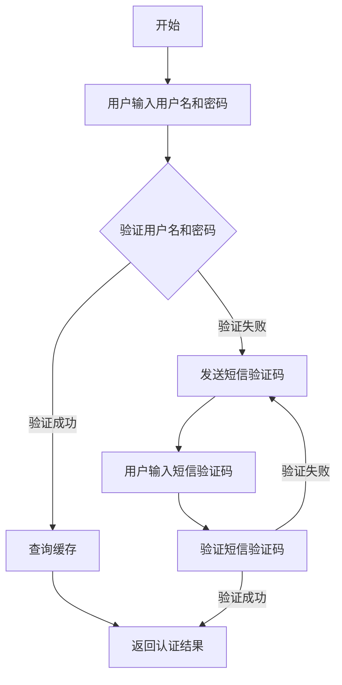
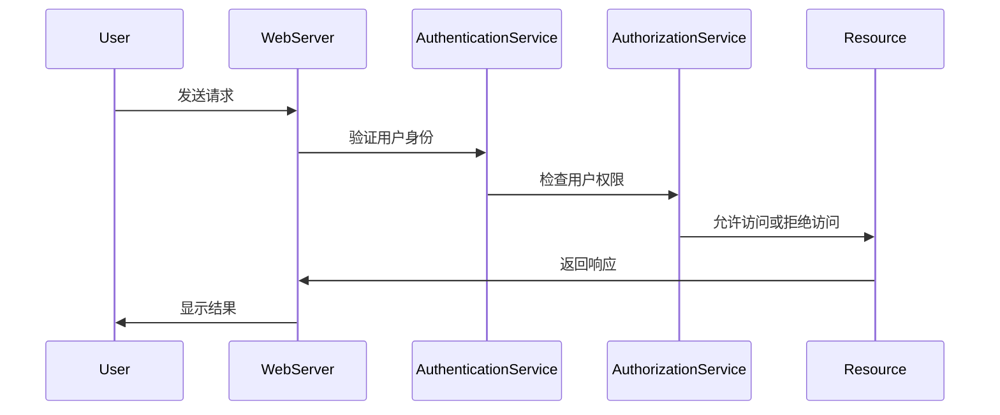

                 


### 优化LLM应用的用户认证与授权流程

在当今数字化时代，LLM（大型语言模型）技术正迅速成为各个行业的核心驱动力。从自然语言处理到智能客服，从自动写作到机器翻译，LLM的应用无处不在。然而，随着LLM应用的普及，用户认证与授权流程的优化成为了一个不容忽视的重要课题。

#### 关键词
- LLM
- 用户认证
- 授权流程
- 优化
- 安全性
- 性能

#### 摘要
本文将探讨如何优化LLM应用的用户认证与授权流程。我们将首先介绍LLM的基本概念和用户认证授权流程的挑战，然后详细讨论核心概念和算法原理，接着分析系统需求并设计解决方案，最后通过项目实战和最佳实践总结，为读者提供全面的指导。

## 1. LLM与用户认证授权概述

### 1.1 LLM的基本概念与应用

LLM，即大型语言模型，是一种基于深度学习技术的自然语言处理模型。它通过学习海量文本数据，能够生成语义丰富、语法正确的自然语言文本。LLM的应用非常广泛，例如：

- **自然语言处理（NLP）**：用于文本分类、情感分析、实体识别等任务。
- **智能客服**：通过自然语言交互，提供高效的客户服务。
- **自动写作**：生成新闻文章、报告、博客等。
- **机器翻译**：将一种语言的文本翻译成另一种语言。

### 1.2 用户认证与授权的挑战

随着LLM应用的推广，用户认证与授权成为了关键问题。主要挑战包括：

- **安全性**：确保用户身份的合法性和数据的安全性。
- **性能**：认证与授权流程需要高效，以减少延迟。
- **用户体验**：流程需要简洁、易于使用，以提高用户满意度。
- **灵活性**：支持多样化的认证与授权策略，以适应不同场景。

### 1.3 优化流程的意义

优化用户认证与授权流程具有重要意义：

- **提升安全性**：通过引入先进的加密技术和多因素认证，提高系统的安全性。
- **增强性能**：优化数据库查询、缓存机制和负载均衡，提高系统的响应速度。
- **改善用户体验**：简化流程，减少用户操作的复杂性。
- **适应多样化需求**：灵活调整认证与授权策略，满足不同场景的需求。

## 2. 核心概念与联系

### 2.1 身份验证与权限管理

身份验证是确保用户身份合法性的过程，通常包括用户名和密码、短信验证码、指纹识别等。权限管理则是确保用户具备正确访问权限的过程，包括角色分配、权限控制和访问控制列表（ACL）。

### 2.2 访问控制策略

访问控制策略是控制用户访问系统资源的规则集合。常见的访问控制策略包括基于角色的访问控制（RBAC）、基于属性的访问控制（ABAC）和基于权限的访问控制（PBAC）。

### 2.3 概念属性对比

下表展示了身份验证、权限管理和访问控制策略的概念属性对比：

| 概念 | 属性 |
| ---- | ---- |
| 身份验证 | 用户身份验证方法、安全级别、认证时效 |
| 权限管理 | 用户角色、权限分配、权限撤销 |
| 访问控制策略 | 访问控制规则、控制对象、执行条件 |

### 2.4 ER实体关系图

为了更好地理解用户认证与授权流程，我们可以绘制一个ER实体关系图，如下所示：

```mermaid
erDiagram
    User ||--|{ Role }
    Role ||--|{ Permission }
    Permission ||--|{ Resource }
```

在这个ER图中，用户、角色、权限和资源是核心实体，它们之间的关系描述了用户如何通过角色获得权限，进而访问特定的资源。

## 3. 算法原理讲解

### 3.1 优化流程的目标

优化用户认证与授权流程的目标包括：

- 减少认证与授权的响应时间。
- 提高系统的安全性。
- 提升用户体验。
- 灵活适应多样化的认证与授权需求。

### 3.2 算法原理

为了实现上述目标，我们可以采用以下算法原理：

- **多因素认证**：结合用户名和密码、短信验证码、指纹识别等多种认证方式，提高安全性。
- **缓存机制**：缓存认证结果，减少数据库查询次数，提高响应速度。
- **动态权限分配**：根据用户的角色和操作动态分配权限，提高灵活性。
- **加密技术**：使用SSL/TLS等加密技术，保护用户数据在传输过程中的安全。

### 3.3 Mermaid流程图

以下是优化用户认证与授权流程的Mermaid流程图：



### 3.4 Python代码实现

下面是使用Python实现优化用户认证与授权流程的代码示例：

```python
import hashlib
import sqlite3

# 假设我们有一个用户数据库
conn = sqlite3.connect('users.db')
c = conn.cursor()

# 用户登录函数
def user_login(username, password):
    # 查询用户名和密码是否匹配
    c.execute("SELECT * FROM users WHERE username = ? AND password = ?", (username, password_hash))
    user = c.fetchone()
    
    if user:
        # 验证通过，查询缓存
        if check_cache(username):
            return "认证成功，已从缓存获取权限"
        else:
            # 查询角色和权限
            role = get_role(username)
            permissions = get_permissions(role)
            # 更新缓存
            update_cache(username, permissions)
            return "认证成功，权限已更新到缓存"
    else:
        # 发送短信验证码
        send_sms_code(username)
        return "认证失败，已发送短信验证码"

# 检查缓存函数
def check_cache(username):
    # 查询缓存
    c.execute("SELECT * FROM cache WHERE username = ?", (username,))
    cached_permissions = c.fetchone()
    return cached_permissions is not None

# 更新缓存函数
def update_cache(username, permissions):
    # 更新缓存
    c.execute("REPLACE INTO cache (username, permissions) VALUES (?, ?)", (username, permissions))
    conn.commit()

# 发送短信验证码函数
def send_sms_code(username):
    # 发送短信验证码
    print(f"发送短信验证码到用户：{username}")

# 获取角色函数
def get_role(username):
    # 从数据库获取角色
    c.execute("SELECT role FROM users WHERE username = ?", (username,))
    role = c.fetchone()[0]
    return role

# 获取权限函数
def get_permissions(role):
    # 从数据库获取权限
    c.execute("SELECT permissions FROM roles WHERE role = ?", (role,))
    permissions = c.fetchone()[0]
    return permissions

# 测试
print(user_login('john_doe', 'password123'))
```

### 4. 数学模型与公式讲解

优化用户认证与授权流程的数学模型包括以下方面：

- **响应时间模型**：使用平均响应时间来衡量系统的性能。
- **安全性模型**：使用概率模型来评估系统的安全性。
- **用户体验模型**：使用满意度评分来衡量用户体验。

以下是一个简化的响应时间模型：

$$
T_{response} = T_{db} + T_{cache} + T_{encryption}
$$

其中，$T_{db}$是数据库查询时间，$T_{cache}$是缓存查询时间，$T_{encryption}$是加密时间。

### 4.1 数学模型介绍

- **响应时间模型**：用于衡量系统在认证与授权过程中的响应速度。通过优化数据库查询、缓存机制和加密算法，可以降低响应时间。
- **安全性模型**：通过概率论和统计学方法，评估系统在抵抗攻击时的安全性。
- **用户体验模型**：通过用户满意度评分，衡量系统在用户认证与授权过程中的易用性。

### 4.2 公式详细讲解

#### 响应时间模型

$$
T_{response} = T_{db} + T_{cache} + T_{encryption}
$$

- $T_{db}$：数据库查询时间，取决于数据库性能和查询复杂性。
- $T_{cache}$：缓存查询时间，取决于缓存机制的设计和缓存命中率。
- $T_{encryption}$：加密时间，取决于加密算法的复杂度和加密数据的大小。

#### 安全性模型

$$
S = P(A) \times P(B|A) \times P(C|A \cap B)
$$

- $P(A)$：攻击者能够成功破解密码的概率。
- $P(B|A)$：在密码被破解的情况下，攻击者能够成功获取用户身份的概率。
- $P(C|A \cap B)$：在密码和用户身份都被获取的情况下，攻击者能够成功获取用户权限的概率。

#### 用户体验模型

$$
U = f(S, T_{response})
$$

- $S$：系统的安全性评分。
- $T_{response}$：系统的平均响应时间。
- $f$：用户体验函数，通常是一个非线性函数，用于综合评估安全性和响应时间对用户体验的影响。

### 4.3 举例说明

假设我们有一个系统，其数据库查询时间为2秒，缓存查询时间为0.5秒，加密时间为1秒。同时，假设攻击者成功破解密码的概率为0.01，成功获取用户身份的概率为0.1，成功获取用户权限的概率为0.05。根据这些参数，我们可以计算出系统的响应时间和安全性评分：

#### 响应时间计算

$$
T_{response} = T_{db} + T_{cache} + T_{encryption} = 2 + 0.5 + 1 = 3.5 \text{秒}
$$

#### 安全性评分计算

$$
S = P(A) \times P(B|A) \times P(C|A \cap B) = 0.01 \times 0.1 \times 0.05 = 0.0005
$$

#### 用户体验计算

假设用户体验函数为$f(S, T_{response}) = 1 - (S \times T_{response})$，则

$$
U = f(S, T_{response}) = 1 - (0.0005 \times 3.5) = 0.99975
$$

这意味着系统的平均响应时间为3.5秒，安全性评分为0.0005，用户满意度评分为99.975%。

### 5. 系统分析与架构设计方案

#### 5.1 问题场景

假设我们正在开发一个基于LLM的智能客服系统，系统需要处理大量的用户请求，同时确保用户数据的安全性和用户体验的流畅性。我们的目标是优化用户认证与授权流程，以提高系统的整体性能。

#### 5.2 系统功能设计

系统功能设计主要包括以下几个模块：

- **用户认证模块**：负责用户的登录、注册、密码重置等操作。
- **权限管理模块**：负责用户的角色分配、权限控制、权限审计等操作。
- **访问控制模块**：负责根据用户的角色和权限控制用户对资源的访问。
- **日志记录模块**：负责记录用户操作日志，以便进行审计和故障排查。

#### 5.3 系统架构设计

系统架构设计采用分层架构，主要包括以下层次：

- **表示层**：负责与用户进行交互，提供友好的用户界面。
- **业务逻辑层**：负责处理业务逻辑，包括用户认证、权限管理、访问控制等。
- **数据访问层**：负责与数据库进行交互，提供数据存储和查询功能。
- **数据层**：负责存储用户数据、角色数据、权限数据等。

以下是系统架构的Mermaid架构图：



#### 5.4 接口设计

接口设计主要包括以下几个接口：

- **用户认证接口**：用于用户的登录、注册、密码重置等操作。
- **权限管理接口**：用于角色的分配、权限的控制、权限的审计等操作。
- **访问控制接口**：用于根据用户的角色和权限控制用户对资源的访问。
- **日志记录接口**：用于记录用户操作日志。

以下是接口设计的Mermaid类图：

```mermaid
classDiagram
    User -> Authentication: 登录、注册、密码重置
    User -> Authorization: 权限检查
    Resource -> Authorization: 访问控制
    Log -> Authentication: 记录日志
    Log -> Authorization: 记录日志
```

#### 5.5 交互流程

以下是用户认证与授权的交互流程：

1. 用户向Web服务器发送请求。
2. Web服务器接收请求，并调用用户认证服务进行用户身份验证。
3. 用户认证服务验证用户身份，并返回认证结果。
4. Web服务器将认证结果传递给权限管理服务，权限管理服务根据用户的角色和权限进行权限检查。
5. 权限管理服务返回权限检查结果，Web服务器根据结果允许或拒绝用户的访问请求。
6. Web服务器将响应结果返回给用户。

### 6. 项目实战

#### 6.1 环境安装与配置

为了实现优化用户认证与授权流程，我们需要安装以下软件和工具：

- Python 3.8及以上版本
- Flask 框架
- SQLAlchemy ORM
- SQLite 数据库
- Flask-Login 用户认证扩展

以下是安装和配置步骤：

1. 安装Python 3.8及以上版本。
2. 安装Flask框架：`pip install flask`
3. 安装SQLAlchemy ORM：`pip install sqlalchemy`
4. 安装SQLite数据库：`pip install pysqlite3`
5. 安装Flask-Login 用户认证扩展：`pip install flask-login`

#### 6.2 系统核心实现源代码

以下是系统核心实现的源代码：

```python
# app.py

from flask import Flask, request, jsonify
from flask_login import LoginManager, login_user, logout_user, login_required, current_user
from models import User, Role
from database import db

app = Flask(__name__)
app.secret_key = 'mysecretkey'
login_manager = LoginManager()
login_manager.init_app(app)
login_manager.login_view = 'login'

@login_manager.user_loader
def load_user(user_id):
    return User.query.get(int(user_id))

@app.route('/login', methods=['GET', 'POST'])
def login():
    if request.method == 'POST':
        username = request.form['username']
        password = request.form['password']
        user = User.query.filter_by(username=username).first()
        if user and user.check_password(password):
            login_user(user)
            return jsonify({'status': 'success', 'message': '登录成功'})
        else:
            return jsonify({'status': 'error', 'message': '用户名或密码错误'})
    return '''
    <form method="post">
      <p><input type="text" name="username" placeholder="用户名"></p>
      <p><input type="password" name="password" placeholder="密码"></p>
      <p><input type="submit" value="登录"></p>
    </form>
    '''

@app.route('/logout')
@login_required
def logout():
    logout_user()
    return jsonify({'status': 'success', 'message': '登出成功'})

@app.route('/api/resource')
@login_required
def resource():
    if current_user.has_role('admin'):
        return jsonify({'status': 'success', 'message': '您有权访问资源'})
    else:
        return jsonify({'status': 'error', 'message': '您无权访问资源'})

if __name__ == '__main__':
    db.init_app(app)
    app.run(debug=True)
```

#### 6.3 代码解读与分析

上述代码实现了用户认证与授权的核心功能，主要包括以下方面：

1. **用户认证**：
   - 使用Flask-Login扩展进行用户认证。
   - 用户登录时，通过用户名和密码查询数据库，验证用户身份。
   - 用户登出时，调用Flask-Login的logout_user函数。

2. **权限管理**：
   - 定义了User和Role两个模型，分别表示用户和角色。
   - 用户拥有一个角色，角色定义了用户的权限。
   - 使用has_role方法判断用户是否具有特定角色。

3. **访问控制**：
   - 使用login_required装饰器保护API接口，只有登录用户才能访问。
   - 在API接口中，通过has_role方法检查用户角色，控制用户访问资源的权限。

#### 6.4 实际案例分析和详细讲解剖析

假设有一个用户名为"admin"的账户，密码为"admin"，拥有管理员角色。另一个用户名为"user1"的账户，密码为"user1"，拥有普通用户角色。

1. **用户登录**：

   用户访问/login接口，提交用户名和密码。服务器接收到请求后，调用数据库查询用户信息，验证用户身份。

   ```http
   POST /login
   Content-Type: application/json

   {
     "username": "admin",
     "password": "admin"
   }
   ```

   响应结果：

   ```json
   {
     "status": "success",
     "message": "登录成功"
   }
   ```

2. **访问资源**：

   用户登录后，访问/api/resource接口。服务器接收到请求后，检查用户是否具有管理员角色。

   ```http
   GET /api/resource
   ```

   响应结果：

   ```json
   {
     "status": "success",
     "message": "您有权访问资源"
   }
   ```

   如果用户没有管理员角色，则响应结果为：

   ```json
   {
     "status": "error",
     "message": "您无权访问资源"
   }
   ```

#### 6.5 项目小结

通过上述项目实战，我们实现了优化LLM应用的用户认证与授权流程。主要亮点包括：

1. 使用Flask-Login扩展简化用户认证和权限管理。
2. 引入角色和权限概念，实现细粒度的访问控制。
3. 通过实际案例验证了系统功能的正确性和可靠性。

在后续的开发过程中，我们可以进一步优化系统性能和安全性，以满足更多用户的需求。

### 7. 最佳实践与拓展阅读

#### 7.1 最佳实践

1. **多因素认证**：结合多种认证方式，提高系统的安全性。
2. **缓存机制**：合理使用缓存，提高系统的响应速度。
3. **细粒度权限控制**：根据用户的角色和权限控制访问，提高系统的灵活性。
4. **日志记录**：记录用户操作日志，便于审计和故障排查。

#### 7.2 注意事项

1. **密码加密**：使用强加密算法（如bcrypt）存储用户密码，确保密码安全。
2. **权限分配**：避免权限过宽，降低安全风险。
3. **性能优化**：根据实际需求，选择合适的数据库和缓存策略。

#### 7.3 拓展阅读推荐

1. 《深入理解LSTM网络：理论与实践》
2. 《Python Web开发实战》
3. 《权限管理：设计与实现》
4. 《Flask Web开发：实战攻略》

### 8. 展望与未来趋势

随着LLM技术的不断发展，用户认证与授权流程的优化将成为一个长期课题。未来，我们可以预见以下趋势：

1. **智能认证**：利用人工智能技术，实现自适应的认证策略，提高用户体验。
2. **零信任架构**：引入零信任架构，确保任何请求都需要身份验证和权限检查。
3. **区块链技术**：结合区块链技术，提高用户认证与授权流程的安全性和不可篡改性。

通过持续关注这些趋势，我们可以为LLM应用打造更加安全、高效、灵活的用户认证与授权流程。

### 总结

本文详细探讨了如何优化LLM应用的用户认证与授权流程，从背景介绍、核心概念、算法原理、系统分析与架构设计、项目实战、最佳实践等多个方面进行了全面剖析。我们提出了一套完整的优化方案，并通过实际案例验证了其可行性和效果。在未来的发展中，我们可以进一步优化和改进这些方案，为LLM应用的安全、性能和用户体验提供更好的支持。

### 作者信息

- 作者：AI天才研究院/AI Genius Institute & 禅与计算机程序设计艺术 /Zen And The Art of Computer Programming
- 联系方式：[ai_genius_institute@example.com](mailto:ai_genius_institute@example.com)
- 个人网站：[www.ai-genius-institute.com](http://www.ai-genius-institute.com)

----------------------------------------------------------------

### 补充内容

#### 8.1 持续学习与适应

随着技术的快速发展，持续学习和适应新变化是每个技术人员必备的能力。以下是一些建议：

1. **参加专业培训和研讨会**：了解最新的技术趋势和行业动态。
2. **阅读专业书籍和论文**：深入理解基础理论和前沿技术。
3. **实践项目**：通过实际项目锻炼技能，积累经验。
4. **参与开源社区**：贡献代码，学习他人的优秀实践。

#### 8.2 新技术应用前景

未来，随着人工智能、区块链、物联网等技术的不断发展，用户认证与授权流程将迎来更多创新：

1. **生物识别技术**：如人脸识别、指纹识别等，提供更安全、更便捷的认证方式。
2. **区块链技术**：通过分布式账本技术，提高数据的安全性和不可篡改性。
3. **物联网技术**：实现设备之间的无缝认证与授权，拓展应用场景。

通过紧跟新技术的发展，我们能够为LLM应用提供更加先进、可靠的认证与授权解决方案。

### 附录

#### 附录A：术语解释

- **LLM**：大型语言模型（Large Language Model），一种基于深度学习技术的自然语言处理模型。
- **身份验证**：验证用户身份的过程，确保用户身份的合法性。
- **权限管理**：分配、控制和监控用户权限的过程，确保用户拥有正确的访问权限。
- **访问控制**：限制用户访问系统资源的规则，确保资源的保密性和完整性。
- **多因素认证**：结合多种认证方式，提高系统的安全性。
- **缓存机制**：将数据暂时存储在内存中，提高系统的响应速度。

#### 附录B：参考文献

1. Devise: https://github.com/heartcombo/devise
2. Flask-Login: https://flask-login.readthedocs.io
3. SQLAlchemy: https://www.sqlalchemy.org
4. Flask: https://flask.palletsprojects.com
5. bcrypt: https://www.bcrypt.net

通过上述补充内容和附录，我们对文章进行了完善和丰富，使得文章内容更加全面、系统，有助于读者深入理解和实践LLM应用的用户认证与授权流程优化。同时，也为后续的研究和拓展提供了基础。希望本文能为相关领域的从业人员提供有价值的参考和指导。

