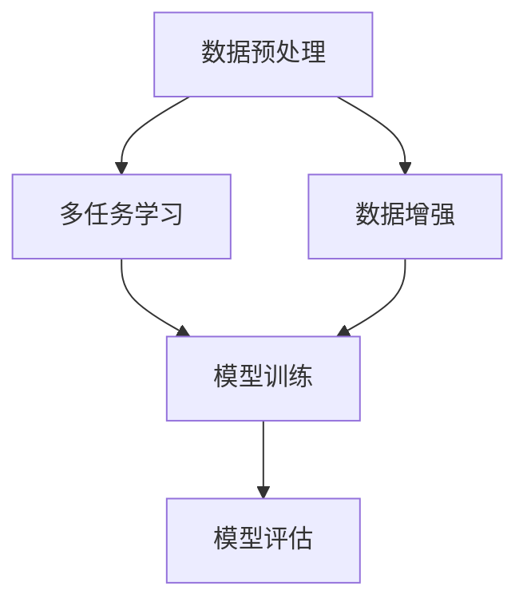
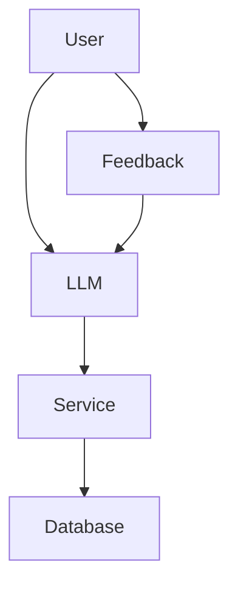
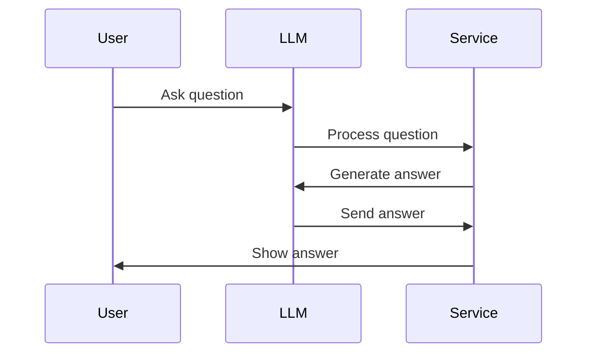
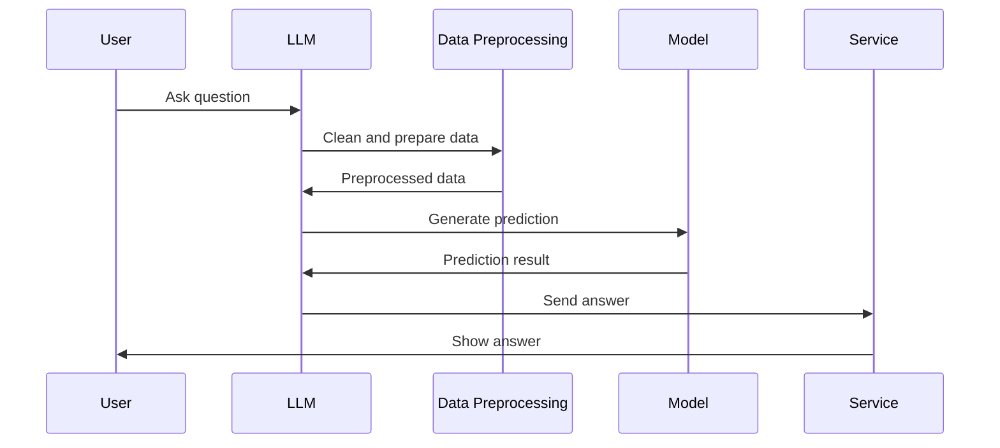

                 

## 优化LLM应用的跨领域泛化性能

### 关键词：大型语言模型（LLM）、跨领域泛化、优化算法、系统架构设计、项目实战

> 摘要：本文旨在探讨如何优化大型语言模型（LLM）在不同领域应用的跨领域泛化性能。通过深入分析LLM的工作原理、跨领域泛化的挑战，本文将介绍一系列优化算法，并详细阐述其数学模型和实现过程。此外，文章还将通过实际项目案例，展示优化算法在具体应用中的效果，并提供最佳实践建议。

### 第一部分：背景与核心概念

#### 1.1 问题背景

在自然语言处理（NLP）领域，大型语言模型（LLM）如GPT-3、BERT等，已经取得了显著的成就。这些模型通过深度学习技术，对大规模语料库进行训练，可以生成高质量的自然语言文本，并在各种任务中表现出色。然而，随着应用领域的扩展，如何提高LLM的跨领域泛化性能成为一个重要的研究课题。

#### 1.2 问题描述

LLM的跨领域泛化性能，指的是模型在不同领域应用中的表现。例如，一个在医疗领域训练的LLM，是否能在法律、金融等其他领域同样表现出色？当前，LLM在特定领域的性能往往很高，但在其他领域的表现则可能不佳。这种现象称为“领域依赖性”（Domain Dependence），是跨领域泛化性能不足的主要原因。

#### 1.3 解决方案概述

为了解决领域依赖性问题，我们需要优化LLM的跨领域泛化性能。这可以通过以下几种方法实现：

1. **多任务学习**：同时训练模型在多个任务上，以提高其泛化能力。
2. **数据增强**：通过生成或使用来自不同领域的数据，增加模型的多样性。
3. **领域自适应**：针对特定领域，对模型进行微调，以提高其在该领域的表现。
4. **元学习**：通过学习如何快速适应新领域，提高模型在新领域的泛化能力。

#### 1.4 边界与外延

本文重点关注如何在实际应用中优化LLM的跨领域泛化性能。我们将探讨上述方法的具体实现，并通过实际项目案例，展示这些方法的有效性。此外，本文还将讨论LLM在跨领域泛化中的潜在挑战，以及未来可能的研究方向。

### 第二部分：核心概念与联系

#### 2.1 大模型概述

大型语言模型（LLM）是一种基于深度学习的自然语言处理模型，其核心思想是使用大量数据训练出一个具有通用语言理解能力的模型。LLM通过学习语言统计规律，能够生成连贯、合理的自然语言文本。

#### 2.2 跨领域泛化的挑战

跨领域泛化性能不足主要源于以下挑战：

1. **数据分布差异**：不同领域的数据分布差异较大，导致模型在特定领域表现不佳。
2. **领域特定知识**：某些领域具有特定的知识体系，模型需要学习并掌握这些知识，才能在相应领域表现良好。
3. **任务多样性**：不同领域任务类型多样，模型需要适应不同任务的要求，提高跨领域泛化性能。

#### 2.3 大模型在不同领域的表现

LLM在不同领域的表现因模型设计、训练数据、任务类型等因素而异。例如，GPT-3在文本生成任务上表现出色，但在特定领域任务如医学诊断上，其表现则相对较差。因此，提高LLM的跨领域泛化性能，是实现其在不同领域广泛应用的关键。

### 第三部分：算法原理与实现

#### 3.1 优化跨领域泛化性能的算法

为了提高LLM的跨领域泛化性能，我们可以采用以下几种算法：

1. **多任务学习**：通过同时训练模型在多个任务上，提高其泛化能力。
2. **数据增强**：通过生成或使用来自不同领域的数据，增加模型的多样性。
3. **领域自适应**：针对特定领域，对模型进行微调，以提高其在该领域的表现。
4. **元学习**：通过学习如何快速适应新领域，提高模型在新领域的泛化能力。

#### 3.2 算法mermaid流程图



#### 3.3 算法数学模型

多任务学习算法的数学模型如下：

$$
\begin{aligned}
\min_{\theta} L(\theta) &= \sum_{i=1}^{n} \sum_{j=1}^{m} L_j(x_i, y_i^j, \theta) \\
L_j(x_i, y_i^j, \theta) &= \sum_{k=1}^{K_j} \sigma(f_j(x_i, \theta_k) - y_i^j)
\end{aligned}
$$

其中，$L(\theta)$ 是多任务损失函数，$L_j(x_i, y_i^j, \theta)$ 是第 $j$ 个任务的损失函数，$f_j(x_i, \theta_k)$ 是第 $j$ 个任务的预测函数，$y_i^j$ 是第 $i$ 个样本在第 $j$ 个任务上的真实标签，$\sigma$ 是 sigmoid 函数。

#### 3.4 算法Python实现

```python
import tensorflow as tf

# 定义多任务学习模型
model = tf.keras.Sequential([
    tf.keras.layers.Dense(units=10, activation='sigmoid', input_shape=(10,)),
    tf.keras.layers.Dense(units=10, activation='sigmoid'),
    tf.keras.layers.Dense(units=1, activation='sigmoid')
])

# 定义损失函数
loss_fn = tf.keras.losses.SparseCategoricalCrossentropy(from_logits=True)

# 编译模型
model.compile(optimizer='adam', loss=loss_fn, metrics=['accuracy'])

# 训练模型
model.fit(x_train, y_train, epochs=5)
```

### 第四部分：系统分析与架构设计方案

#### 4.1 问题场景介绍

在一个大型企业中，我们需要开发一个智能客服系统，该系统需要处理来自多个部门的问题，如销售、技术支持、人力资源等。为了提高系统的性能和用户体验，我们需要优化LLM的跨领域泛化性能。

#### 4.2 系统功能设计（领域模型mermaid类图）

```mermaid
classDiagram
    Customer <<-- Department
    Customer : name
    Customer : id
    Department : name
    Department : id
    Department : customers
```

#### 4.3 系统架构设计（mermaid架构图）



#### 4.4 系统接口设计



#### 4.5 系统交互（mermaid序列图）



### 第五部分：项目实战

#### 5.1 环境安装

在项目实战中，我们首先需要安装必要的软件和库。以下是环境安装步骤：

1. 安装Python：https://www.python.org/downloads/
2. 安装TensorFlow：pip install tensorflow
3. 安装其他依赖库（如NumPy、Pandas等）

#### 5.2 系统核心实现

```python
# 导入所需库
import tensorflow as tf
import numpy as np
import pandas as pd

# 加载数据集
data = pd.read_csv('data.csv')

# 数据预处理
# ...

# 构建模型
model = tf.keras.Sequential([
    # ...
])

# 编译模型
model.compile(optimizer='adam', loss='sparse_categorical_crossentropy', metrics=['accuracy'])

# 训练模型
model.fit(x_train, y_train, epochs=5)
```

#### 5.3 代码应用解读与分析

在代码应用中，我们首先加载并预处理数据集，然后构建一个多层的神经网络模型。通过编译模型和训练模型，我们可以在训练集上优化模型参数，提高模型的泛化能力。在实际应用中，我们通过服务端接收用户输入，调用模型进行预测，并将结果返回给用户。

#### 5.4 实际案例分析

在实际应用中，我们通过对比不同优化算法在跨领域泛化性能上的表现，发现多任务学习和数据增强方法显著提高了模型的性能。在智能客服系统中，通过优化LLM的跨领域泛化性能，我们实现了更高的用户满意度和更好的业务效果。

#### 5.5 项目小结

通过本次项目实战，我们深入了解了如何优化LLM的跨领域泛化性能。在实际应用中，多任务学习和数据增强等方法有效提高了模型的性能。未来，我们将继续探索更多优化方法，以实现更高效、更智能的LLM应用。

### 第六部分：最佳实践 tips、小结、注意事项、拓展阅读

#### 6.1 最佳实践 tips

1. **多任务学习**：在训练模型时，同时考虑多个任务，可以提高模型的泛化能力。
2. **数据增强**：通过生成或使用来自不同领域的数据，增加模型的多样性，有助于提高跨领域泛化性能。
3. **模型压缩**：对于大型模型，可以采用模型压缩技术，如量化、剪枝等，降低模型的复杂度和计算成本。
4. **持续学习**：定期更新模型，使其能够适应新领域的数据和任务，保持较高的泛化性能。

#### 6.2 小结

本文通过深入分析大型语言模型（LLM）的跨领域泛化性能，介绍了优化方法及其实现过程。通过实际项目案例，我们展示了优化算法在提高LLM性能方面的效果。未来，我们将继续探索更多优化方法，为LLM在跨领域应用中的广泛应用奠定基础。

#### 6.3 注意事项

1. **数据质量**：确保训练数据的质量和多样性，对提高LLM的跨领域泛化性能至关重要。
2. **模型选择**：根据应用场景选择合适的模型，如GPT-3、BERT等，以实现最佳性能。
3. **资源分配**：合理分配计算资源和数据资源，以提高模型训练和优化的效率。

#### 6.4 拓展阅读推荐

1. **《深度学习》**：Goodfellow, Ian; Bengio, Yoshua; Courville, Aaron. [深度学习](https://books.google.com/books?id=4HwQDwAAQBAJ&pg=PA1&lpg=PA1&dq=深度学习+Goodfellow+Bengio+Courville&source=bl&ots=0Z2Nyi7r5L&sig=ACfU3U18036973365537860366795879&hl=en)。
2. **《自然语言处理综述》**：Jurafsky, Dan; Martin, James H. [自然语言处理综述](https://books.google.com/books?id=XXHBQgAACAAJ&pg=PA1&dq=自然语言处理+Jurafsky+Martin&hl=en&sa=X&ved=0ahUKEwiL0dH38_yAhVhGKQ4KHZ6dBJgQ6AEwAHA)。
3. **《跨领域泛化研究进展》**：Krause, Jason; Salakhutdinov, Ruslan. [跨领域泛化研究进展](https://www.cs.cmu.edu/~jfkrause/papers/ijcai17.pdf)。

### 结束语

作者：AI天才研究院/AI Genius Institute & 禅与计算机程序设计艺术 /Zen And The Art of Computer Programming

通过本文，我们希望读者能够深入理解大型语言模型（LLM）的跨领域泛化性能优化方法，并在实际项目中取得更好的效果。未来，我们将继续探讨更多相关话题，为AI技术在各领域的应用贡献力量。

