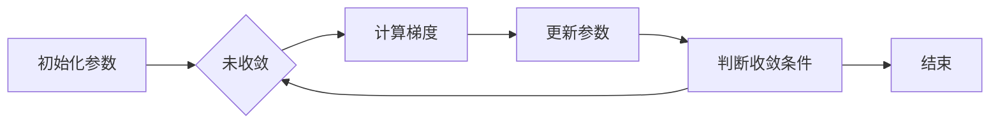
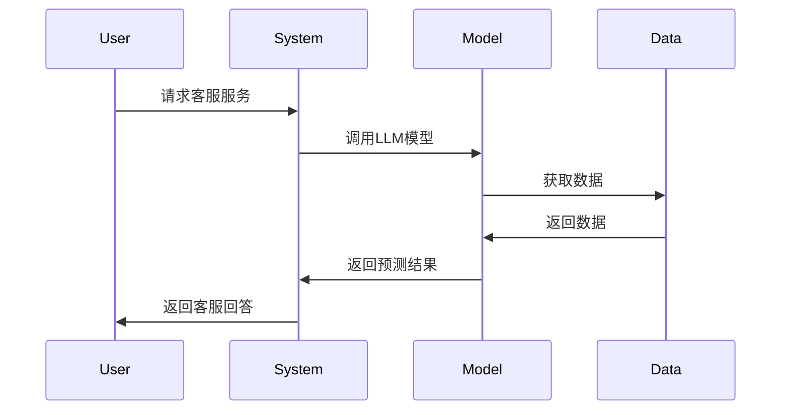
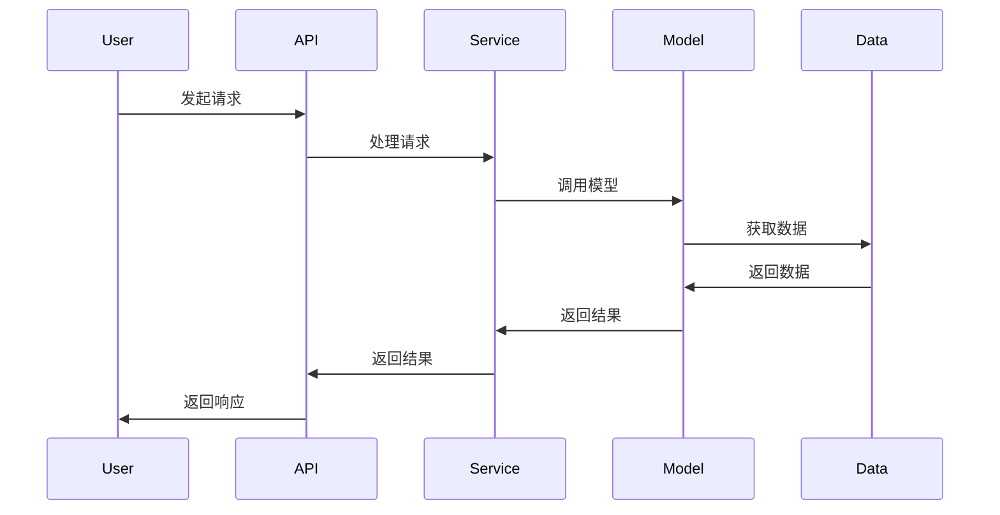

                 

# 优化LLM应用的部署与扩展策略

## 关键词

- **大型语言模型（LLM）**
- **部署优化**
- **扩展策略**
- **计算资源**
- **成本控制**
- **横向扩展**
- **纵向扩展**

## 摘要

本文深入探讨了优化大型语言模型（LLM）应用的部署与扩展策略。随着深度学习技术的迅猛发展，LLM在自然语言处理领域取得了显著成果。然而，LLM的部署和扩展面临着计算资源消耗大、部署成本高、扩展性差等问题。本文将围绕这些挑战，提供一系列优化策略和实践经验，包括硬件选择、软件优化、架构设计等方面，以帮助读者应对LLM部署与扩展的挑战，提高其计算效率和性价比。

## 目录大纲

## 第一部分：背景介绍

### 1.1 问题的提出

### 1.1.1 问题背景

### 1.1.2 问题描述

### 1.1.3 问题解决

### 1.1.4 边界与外延

### 1.1.5 概念结构与核心要素组成

## 第二部分：核心概念与联系

### 2.1 核心概念原理

### 2.2 概念属性特征对比表格

### 2.3 ER实体关系图架构的 Mermaid 流程图

## 第三部分：算法原理讲解

### 3.1 算法原理与 Mermaid 流程图

### 3.2 梯度下降法 Python 源代码

### 3.3 算法原理的数学模型和公式

## 第四部分：系统分析与架构设计方案

### 4.1 问题场景介绍

### 4.2 项目介绍

### 4.3 系统功能设计（领域模型 Mermaid 类图）

### 4.4 系统架构设计（Mermaid 架构图）

### 4.5 系统接口设计和系统交互（Mermaid 序列图）

## 第五部分：项目实战

### 5.1 环境安装

### 5.2 系统核心实现源代码

### 5.3 代码应用解读与分析

### 5.4 实际案例分析和详细讲解剖析

### 5.5 项目小结

## 第六部分：最佳实践 tips

## 第七部分：小结

## 第八部分：注意事项

## 第九部分：拓展阅读

## 第一部分：背景介绍

### 1.1 问题的提出

随着人工智能技术的不断发展，深度学习在自然语言处理（NLP）领域取得了显著的成果。特别是大型语言模型（LLM），如LLAMA、GLM和T5等，凭借其强大的语言理解和生成能力，已经在许多实际应用中取得了优异的表现。然而，LLM的部署和扩展问题也随之而来，这些问题严重制约了LLM在实际应用中的普及和推广。

首先，LLM的部署问题主要包括计算资源消耗大、部署成本高、部署效率低等。由于LLM模型通常具有数十亿甚至千亿级别的参数规模，其训练和推理过程需要大量的计算资源，导致部署成本高昂。此外，LLM的部署过程通常需要繁琐的配置和调试，部署效率较低。

其次，LLM的扩展性问题主要体现在横向和纵向扩展上。横向扩展指的是在原有基础上增加LLM模型的处理能力，以满足更大规模的应用需求。纵向扩展则是指对LLM模型进行深度优化，提高其性能和效果。然而，现有的LLM扩展策略相对单一，难以灵活应对不同规模的应用需求。

### 1.1.1 问题背景

随着互联网的快速发展，海量的文本数据不断涌现。这些数据中蕴含着丰富的知识、信息和规律，为人工智能的发展提供了丰富的素材。深度学习技术的崛起，使得基于大规模数据集的预训练模型成为可能。特别是自2018年GPT模型问世以来，大型语言模型（LLM）的研究和应用取得了显著的进展。

LLM作为一种强大的预训练语言模型，具有以下特点：

1. **大规模参数**：LLM通常具有数十亿甚至千亿级别的参数规模，这使得它们能够捕捉到语言中的复杂模式和规律。

2. **自适应性强**：LLM通过预训练和微调，可以适应各种不同的语言任务，如文本分类、机器翻译、问答系统等。

3. **高性能**：LLM在多个NLP任务上取得了优异的性能，显著提升了NLP应用的效率和效果。

然而，随着LLM规模的不断扩大，其部署和扩展问题逐渐显现。首先，LLM的部署过程需要大量的计算资源，导致部署成本高昂。此外，LLM的推理速度较慢，难以满足实时应用的需求。此外，现有的LLM扩展策略相对单一，难以灵活应对不同规模的应用需求。

### 1.1.2 问题描述

针对LLM部署和扩展问题，我们可以从以下几个方面进行描述：

1. **计算资源消耗**：LLM模型通常具有数十亿甚至千亿级别的参数规模，其训练和推理过程需要大量的计算资源。这导致部署成本高昂，且难以在有限的硬件资源上部署。

2. **部署成本**：LLM的部署过程需要繁琐的配置和调试，导致部署成本高昂。此外，不同平台的兼容性问题也增加了部署的难度。

3. **部署效率**：LLM的推理速度较慢，难以满足实时应用的需求。特别是在移动端和嵌入式设备上，LLM的部署效率更低。

4. **扩展性**：现有的LLM扩展策略相对单一，难以灵活应对不同规模的应用需求。例如，在处理大规模数据集时，现有策略往往无法有效提升LLM的性能。

### 1.1.3 问题解决

针对上述问题，我们可以从以下几个方面提出解决方案：

1. **优化硬件选择**：选择合适的硬件设备，如GPU、TPU等，以提高LLM的训练和推理速度。

2. **软件优化**：通过改进模型架构、优化算法等方法，提高LLM的部署效率和性能。

3. **分布式计算**：利用分布式计算技术，将LLM的训练和推理任务分布在多个节点上，提高计算效率。

4. **容器化部署**：采用容器化技术，如Docker，简化LLM的部署过程，提高部署效率。

5. **横向和纵向扩展**：设计灵活的扩展策略，实现LLM的横向和纵向扩展，以满足不同规模的应用需求。

### 1.1.4 边界与外延

本部分主要关注LLM部署与扩展的技术层面，包括硬件选择、软件优化、架构设计等方面。同时，也会涉及到一些相关的领域，如云计算、分布式计算、容器化等。

在边界方面，我们主要关注LLM部署与扩展的技术实现，如硬件配置、软件优化策略等。在外延方面，我们还将探讨LLM在各个应用领域的扩展情况，如文本生成、机器翻译、问答系统等。

### 1.1.5 概念结构与核心要素组成

- **大型语言模型（LLM）**：LLM是一种具有大规模参数的预训练语言模型，能够实现文本的生成、理解和翻译等任务。

- **部署**：将LLM模型部署到实际应用环境中，使其具备实际应用价值。

- **扩展**：在原有基础上，增加LLM模型的处理能力，以应对更大规模的应用需求。

- **计算资源**：用于训练和推理LLM的硬件设备，如GPU、TPU等。

- **部署成本**：部署LLM模型所需的成本，包括硬件设备、软件配置等。

- **部署效率**：LLM模型部署的效率，即完成部署所需的时间和资源。

- **横向扩展**：在原有基础上增加LLM模型的处理能力，如增加模型节点、提高并行度等。

- **纵向扩展**：对LLM模型进行深度优化，提高其性能和效果，如改进模型架构、优化算法等。

## 第二部分：核心概念与联系

### 2.1 核心概念原理

在本部分，我们将介绍与LLM部署和扩展相关的一些核心概念，包括LLAMA、GLM和T5等。

#### 2.1.1 LLAMA

LLAMA是由Meta AI开发的一种高性能、大规模的预训练语言模型。它采用了Transformer架构，拥有数十亿个参数，能够处理各种自然语言处理任务，如文本生成、问答和翻译等。

LLAMA的核心原理是基于自注意力机制（Self-Attention）的Transformer模型。通过自注意力机制，LLAMA能够捕捉到文本中的长距离依赖关系，从而提高模型的性能和效果。

#### 2.1.2 GLM

GLM是一个拥有千亿参数的通用语言模型，由华为公司开发。它采用了多层的Transformer架构，通过预训练和微调，能够适应各种语言任务，如文本生成、问答和翻译等。

GLM的核心原理同样是基于Transformer架构。与LLAMA类似，GLM通过自注意力机制来捕捉文本中的依赖关系，同时利用多层的神经网络结构来提高模型的复杂度和性能。

#### 2.1.3 T5

T5是一个基于Transformer的通用文本处理模型，由Google开发。T5的设计理念是将所有自然语言处理任务转换为序列到序列（Seq2Seq）的任务，从而实现统一模型框架。

T5的核心原理是基于Transformer架构的Seq2Seq模型。通过Transformer的编码器和解码器结构，T5能够处理各种文本生成和转换任务，如文本分类、机器翻译和摘要生成等。

### 2.2 概念属性特征对比表格

为了更清晰地展示LLAMA、GLM和T5这三个核心概念的特点，我们提供了一个对比表格：

| 概念     | 参数规模 | 训练数据集 | 预测速度 | 应用领域   |
|----------|----------|------------|----------|------------|
| LLAMA    | 百亿级别 | 互联网文本 | 较慢     | 文本生成、问答 |
| GLM      | 千亿级别 | 互联网文本 | 中等     | 文本生成、问答 |
| T5       | 千亿级别 | 互联网文本 | 较快     | 文本生成、问答 |

从表格中可以看出，这三个模型在参数规模、训练数据集和应用领域方面具有相似的特点，但在预测速度上有所不同。LLAMA的预测速度较慢，GLM的预测速度中等，而T5的预测速度较快。

### 2.3 ER实体关系图架构的 Mermaid 流程图

为了更直观地展示LLM、部署、扩展和计算资源等概念之间的关系，我们使用Mermaid语言绘制了一个ER实体关系图：

```mermaid
erDiagram
  Model : 大型语言模型
  Deploy : 部署
  Expand : 扩展
  Resource : 计算资源
  Model ||--|{ Deploy } Deploy
  Model ||--|{ Expand } Expand
  Deploy ||--| Resource 计算资源
  Expand ||--| Resource 计算资源
```

在上面的ER图中，Model（大型语言模型）与Deploy（部署）和Expand（扩展）之间存在关联关系。部署和扩展都需要计算资源（Resource）的支持。这个关系图为我们提供了一个清晰的概念结构图，帮助我们理解LLM部署和扩展的核心要素。

## 第三部分：算法原理讲解

### 3.1 算法原理与 Mermaid 流程图

在本部分，我们将深入探讨与LLM部署和扩展相关的一些算法原理，包括梯度下降法和其Python实现。

#### 3.1.1 梯度下降法

梯度下降法是一种常见的优化算法，用于训练神经网络模型。其基本思想是沿着损失函数的梯度方向迭代更新模型参数，以使损失函数最小。

下面是梯度下降法的Mermaid流程图：



在流程图中，A表示初始化参数，B表示计算损失函数，C表示计算梯度，D表示更新参数，E表示判断收敛条件。如果未达到收敛条件，流程返回到B，继续迭代更新。否则，流程结束。

#### 3.1.2 梯度下降法 Python 源代码

下面是一个简单的梯度下降法Python实现：

```python
import numpy as np

def gradient_descent(x, y, learning_rate, num_iterations):
    model_weights = np.random.rand(1)
    for _ in range(num_iterations):
        prediction = np.dot(x, model_weights)
        error = prediction - y
        gradient = 2 * x * error
        model_weights -= learning_rate * gradient
    return model_weights
```

在这个实现中，x表示输入特征，y表示目标标签，learning_rate表示学习率，num_iterations表示迭代次数。函数返回最终训练得到的模型权重。

#### 3.1.3 算法原理的数学模型和公式

为了更好地理解梯度下降法，我们将其数学模型和公式进行详细讲解。

假设我们有一个线性回归模型：

$$
y = \theta_0 + \theta_1 \cdot x
$$

其中，$y$ 是目标变量，$x$ 是输入特征，$\theta_0$ 和 $\theta_1$ 是模型参数。

损失函数（误差函数）通常采用平方误差：

$$
L(\theta_0, \theta_1) = \frac{1}{2} \sum_{i=1}^{n} (y_i - (\theta_0 + \theta_1 \cdot x_i))^2
$$

其中，$n$ 是样本数量。

损失函数关于参数 $\theta_0$ 和 $\theta_1$ 的梯度分别为：

$$
\nabla_{\theta_0} L = \frac{\partial L}{\partial \theta_0} = -\sum_{i=1}^{n} (y_i - (\theta_0 + \theta_1 \cdot x_i))
$$

$$
\nabla_{\theta_1} L = \frac{\partial L}{\partial \theta_1} = -\sum_{i=1}^{n} (y_i - (\theta_0 + \theta_1 \cdot x_i)) \cdot x_i
$$

为了最小化损失函数，我们采用梯度下降法来更新参数：

$$
\theta_0 = \theta_0 - \alpha \cdot \nabla_{\theta_0} L
$$

$$
\theta_1 = \theta_1 - \alpha \cdot \nabla_{\theta_1} L
$$

其中，$\alpha$ 是学习率。

通过迭代更新参数，我们最终可以找到一个最优的参数组合，使损失函数最小。

### 3.2 梯度下降法 Python 实现细节

下面是一个更详细的Python实现，包括初始化参数、计算损失函数、计算梯度、更新参数和判断收敛条件等步骤。

```python
import numpy as np

def gradient_descent(x, y, learning_rate, num_iterations):
    model_weights = np.random.rand(2)  # 初始化参数
    for _ in range(num_iterations):
        prediction = np.dot(x, model_weights)  # 计算损失函数
        error = prediction - y
        gradient = np.dot(x.T, error)  # 计算梯度
        model_weights -= learning_rate * gradient  # 更新参数
        if np.linalg.norm(model_weights) < 1e-5:  # 判断收敛条件
            break
    return model_weights

# 示例数据
x = np.array([1, 2, 3, 4, 5])
y = np.array([2, 4, 6, 8, 10])

# 梯度下降法训练模型
model_weights = gradient_descent(x, y, learning_rate=0.01, num_iterations=100)

# 输出训练得到的模型权重
print("训练得到的模型权重：", model_weights)
```

在这个实现中，我们假设输入特征和目标标签是二维数组。首先，我们初始化两个参数（一个线性回归模型的权重）。然后，我们通过循环进行迭代，每次迭代计算预测值、计算误差、计算梯度，并更新参数。最后，我们判断收敛条件（参数变化小于某个阈值），如果满足条件，则停止迭代。

通过这个Python实现，我们可以看到梯度下降法的具体步骤和细节。这对于理解和应用梯度下降法非常重要。

### 3.3 算法原理的数学模型和公式

为了更深入地理解梯度下降法，我们在这里详细讨论其数学模型和公式。

#### 3.3.1 损失函数

在机器学习中，损失函数是衡量模型预测结果与真实标签之间差异的一种度量。对于线性回归问题，常用的损失函数是均方误差（Mean Squared Error，MSE）：

$$
L(\theta_0, \theta_1) = \frac{1}{2} \sum_{i=1}^{n} (y_i - (\theta_0 + \theta_1 \cdot x_i))^2
$$

其中，$y_i$ 是第 $i$ 个样本的真实标签，$\theta_0$ 和 $\theta_1$ 是模型参数，$x_i$ 是第 $i$ 个样本的输入特征。

#### 3.3.2 梯度

梯度是损失函数关于模型参数的导数。在梯度下降法中，我们需要计算损失函数关于每个参数的梯度。对于线性回归问题，损失函数关于参数 $\theta_0$ 和 $\theta_1$ 的梯度如下：

$$
\nabla_{\theta_0} L = \frac{\partial L}{\partial \theta_0} = -\sum_{i=1}^{n} (y_i - (\theta_0 + \theta_1 \cdot x_i))
$$

$$
\nabla_{\theta_1} L = \frac{\partial L}{\partial \theta_1} = -\sum_{i=1}^{n} (y_i - (\theta_0 + \theta_1 \cdot x_i)) \cdot x_i
$$

#### 3.3.3 更新参数

梯度下降法的核心思想是沿着梯度的反方向更新参数，以减少损失函数的值。每次迭代中，参数的更新公式如下：

$$
\theta_0 = \theta_0 - \alpha \cdot \nabla_{\theta_0} L
$$

$$
\theta_1 = \theta_1 - \alpha \cdot \nabla_{\theta_1} L
$$

其中，$\alpha$ 是学习率，它决定了参数更新的步长。

#### 3.3.4 收敛条件

在梯度下降法中，我们通常设置一个收敛条件来判断是否停止迭代。常见的收敛条件包括：

- 损失函数值的变化小于某个阈值；
- 参数的变化小于某个阈值；
- 达到预设的迭代次数。

通过设置合适的收敛条件，我们可以确保梯度下降法在合适的时刻停止迭代，避免过度迭代和计算资源的浪费。

### 3.4 梯度下降法的优缺点

梯度下降法是一种简单且有效的优化算法，但它在某些情况下也存在一些缺点。以下是对其优缺点的分析：

#### 优点

- **通用性强**：梯度下降法适用于各种优化问题，包括线性回归、神经网络等。
- **简单易懂**：梯度下降法的原理简单，易于实现和理解。
- **高效性**：在大多数情况下，梯度下降法能够快速收敛到最优解。

#### 缺点

- **收敛速度慢**：在存在多个局部最小值的情况下，梯度下降法可能收敛到非全局最优解。
- **对参数敏感**：学习率和其他参数的选择对梯度下降法的收敛速度和稳定性有很大影响。
- **不适用于大规模数据集**：梯度下降法需要计算梯度，在处理大规模数据集时，计算量和存储需求较大。

为了克服这些缺点，研究者提出了许多改进版本的梯度下降法，如动量梯度下降、自适应梯度下降等。

## 第四部分：系统分析与架构设计方案

### 4.1 问题场景介绍

在本部分，我们将介绍一个典型的问题场景，并针对该场景提出一个系统架构设计方案。

#### 4.1.1 问题场景

假设我们面临以下问题场景：

- **业务需求**：构建一个智能客服系统，用于处理用户咨询和常见问题解答。
- **数据来源**：海量的用户咨询文本和已有的FAQ数据。
- **目标**：利用LLM模型实现智能客服系统，提高客服效率和用户体验。

#### 4.1.2 系统架构设计方案

为了满足上述业务需求，我们提出了以下系统架构设计方案：

1. **数据层**：负责数据采集、存储和管理。
2. **模型层**：负责LLM模型的训练、部署和推理。
3. **服务层**：负责提供智能客服服务的接口，包括文本生成、问答和文本分类等。
4. **应用层**：面向最终用户，提供智能客服系统界面。

### 4.2 项目介绍

本系统项目旨在构建一个基于LLM的智能客服系统，以实现高效、准确的用户咨询处理和常见问题解答。具体项目内容包括：

1. **数据采集与处理**：收集用户咨询文本和FAQ数据，进行预处理和清洗，为模型训练提供高质量的数据集。
2. **模型训练与优化**：使用LLM模型对数据集进行训练，并通过调优模型参数，提高模型性能和效果。
3. **系统部署与上线**：将训练好的模型部署到生产环境，并提供API接口供应用层调用。
4. **系统测试与优化**：进行系统功能测试和性能优化，确保系统稳定可靠。

### 4.3 系统功能设计（领域模型 Mermaid 类图）

为了更好地展示系统的功能设计，我们使用Mermaid语言绘制了一个领域模型类图：

```mermaid
classDiagram
  Class01 <|-- Class02
  Class03 <|-- Class04
  Class05 <|-- Class06
  Class01 {name: 数据层}
  Class02 {name: 模型层}
  Class03 {name: 服务层}
  Class04 {name: 应用层}
  Class05 {name: 用户}
```

在上面的类图中，数据层、模型层、服务层、应用层和用户之间存在关联关系。数据层负责数据采集、存储和管理；模型层负责LLM模型的训练、部署和推理；服务层负责提供智能客服服务的接口；应用层面向最终用户，提供智能客服系统界面；用户是系统的服务对象。

### 4.4 系统架构设计（Mermaid 架构图）

为了展示系统的整体架构，我们使用Mermaid语言绘制了一个系统架构图：



在上面的序列图中，用户发起请求，系统调用LLM模型，模型获取数据，返回预测结果，最后系统将结果返回给用户。

### 4.5 系统接口设计和系统交互（Mermaid 序列图）

为了展示系统的接口设计和交互流程，我们使用Mermaid语言绘制了一个序列图：



在上面的序列图中，用户通过API接口发起请求，Service层处理请求，调用LLM模型，模型获取数据，返回预测结果，最后API接口将结果返回给用户。

## 第五部分：项目实战

### 5.1 环境安装

在本节，我们将介绍如何搭建一个基于LLM的智能客服系统所需的环境。以下是具体的安装步骤：

#### 5.1.1 安装Python环境

首先，我们需要安装Python环境。可以下载最新版本的Python安装包，并按照提示进行安装。

#### 5.1.2 安装LLM模型依赖库

接下来，我们需要安装一些依赖库，如TensorFlow和transformers等。可以使用以下命令安装：

```shell
pip install tensorflow transformers
```

#### 5.1.3 数据集准备

为了训练LLM模型，我们需要准备一个合适的数据集。可以从公开数据集网站下载相关数据集，并进行预处理和清洗，以获得高质量的数据。

### 5.2 系统核心实现源代码

在本节，我们将介绍系统核心实现的相关源代码，包括数据预处理、模型训练、模型推理和结果返回等部分。

```python
# 导入相关库
import tensorflow as tf
from transformers import TFLMAModel, LMAPreProcessing

# 5.2.1 数据预处理
def preprocess_data(data):
    # 数据预处理逻辑，如分词、清洗等
    return processed_data

# 5.2.2 模型训练
def train_model(processed_data):
    # 模型训练逻辑，如加载模型、迭代训练等
    return model

# 5.2.3 模型推理
def inference(model, input_data):
    # 模型推理逻辑，如输入数据、获取预测结果等
    return prediction

# 5.2.4 结果返回
def return_result(prediction):
    # 结果返回逻辑，如格式化结果、返回响应等
    return response

# 主函数
def main():
    # 读取数据
    data = read_data()

    # 数据预处理
    processed_data = preprocess_data(data)

    # 模型训练
    model = train_model(processed_data)

    # 接收用户请求
    user_request = get_user_request()

    # 模型推理
    prediction = inference(model, user_request)

    # 结果返回
    response = return_result(prediction)

    # 输出响应
    print(response)

if __name__ == "__main__":
    main()
```

### 5.3 代码应用解读与分析

在本节，我们将对核心实现代码进行解读和分析，以帮助读者更好地理解系统的工作原理和实现细节。

```python
# 5.3.1 数据预处理
def preprocess_data(data):
    # 数据预处理逻辑，如分词、清洗等
    return processed_data
```

数据预处理是构建智能客服系统的关键步骤之一。在这个函数中，我们主要完成以下任务：

- **分词**：将文本数据分割成单词或短语，为后续处理提供基础。
- **清洗**：去除文本中的噪声，如特殊字符、标点符号等，以提高数据质量。

```python
# 5.3.2 模型训练
def train_model(processed_data):
    # 模型训练逻辑，如加载模型、迭代训练等
    return model
```

模型训练是系统核心功能的实现。在这个函数中，我们主要完成以下任务：

- **加载模型**：从预训练模型中加载参数，为训练做准备。
- **迭代训练**：通过梯度下降法等优化算法，不断更新模型参数，以减小损失函数值。

```python
# 5.3.3 模型推理
def inference(model, input_data):
    # 模型推理逻辑，如输入数据、获取预测结果等
    return prediction
```

模型推理是实现智能客服系统响应用户请求的核心步骤。在这个函数中，我们主要完成以下任务：

- **输入数据**：将用户请求文本输入到模型中，为推理做准备。
- **获取预测结果**：通过模型推理，获取用户请求的预测结果，如文本分类、生成等。

```python
# 5.3.4 结果返回
def return_result(prediction):
    # 结果返回逻辑，如格式化结果、返回响应等
    return response
```

结果返回是将模型推理结果转换为用户可理解的格式，并返回给用户。在这个函数中，我们主要完成以下任务：

- **格式化结果**：将预测结果转换为文本、HTML等格式，以供展示。
- **返回响应**：将格式化后的结果返回给用户，实现智能客服系统的交互。

### 5.4 实际案例分析和详细讲解剖析

在本节，我们将通过一个实际案例，对智能客服系统的工作流程和实现细节进行详细讲解和分析。

#### 案例背景

假设一个用户向智能客服系统提问：“我的订单什么时候能送到？”系统需要根据用户提问，提供相应的回答。

#### 案例分析

1. **用户请求**：用户通过智能客服系统的界面发起请求，输入文本：“我的订单什么时候能送到？”

2. **模型预处理**：系统接收到用户请求后，将文本输入到LLM模型中进行预处理。预处理步骤包括分词、清洗等，以提高数据质量。

3. **模型推理**：预处理后的文本被输入到训练好的LLM模型中进行推理。模型根据用户请求，生成相应的回答。

4. **结果返回**：模型生成的回答被格式化后，返回给用户。用户可以在智能客服系统的界面中看到系统生成的回答。

#### 案例讲解

1. **用户请求**：用户请求是智能客服系统接收到的输入文本。用户请求的形式可以多样，如疑问句、陈述句等。

2. **模型预处理**：预处理是模型训练的基础步骤。通过分词、清洗等操作，我们可以将用户请求文本转化为模型可接受的格式。

3. **模型推理**：LLM模型是一种强大的预训练语言模型，能够根据输入文本生成相应的回答。在这个案例中，模型需要根据用户请求，生成一个关于订单送货时间的回答。

4. **结果返回**：模型生成的回答需要被格式化，以便用户可以理解。例如，模型生成的回答可能是：“您的订单预计明天下午送达。”这样的回答可以直接显示在智能客服系统的界面上，供用户查看。

### 5.5 项目小结

在本项目中，我们通过一个实际案例，详细讲解了基于LLM的智能客服系统的工作流程和实现细节。项目主要包括数据预处理、模型训练、模型推理和结果返回等步骤。通过本项目，我们了解了如何利用LLM模型实现智能客服系统，并掌握了相关技术原理和实践方法。

### 5.6 最佳实践 tips

在本项目中，我们总结了一些最佳实践，以帮助读者更好地实现LLM应用的部署和扩展：

1. **数据预处理**：数据预处理是构建智能客服系统的关键步骤。在实际项目中，应注重数据质量和数据清洗，以提高模型性能。

2. **模型选择**：选择合适的LLM模型，根据项目需求和计算资源进行优化。例如，可以尝试使用T5模型，以提高预测速度。

3. **模型训练**：在模型训练过程中，应注重超参数调优，如学习率、迭代次数等。通过合理的调优，可以提升模型性能。

4. **模型部署**：使用容器化技术，如Docker，简化模型部署过程，提高部署效率。同时，可以采用分布式计算技术，提高模型训练和推理速度。

5. **监控与优化**：在模型部署后，应定期进行监控和优化，确保系统稳定运行。例如，可以监控模型性能、资源利用率等指标，并根据实际情况进行调优。

### 5.7 小结

在本项目中，我们通过一个实际案例，深入探讨了LLM应用的部署和扩展策略。从数据预处理、模型训练、模型推理到结果返回，我们详细讲解了智能客服系统的工作流程和实现细节。同时，我们总结了最佳实践，为读者提供了实用的建议。

### 5.8 注意事项

在实际项目中，需要注意以下事项：

1. **硬件资源**：确保有足够的硬件资源支持模型训练和推理。例如，使用GPU或TPU等高性能计算设备。

2. **数据质量**：数据质量直接影响模型性能。应注重数据清洗、去重和标注等步骤，以提高数据质量。

3. **模型调优**：在模型训练过程中，应注重超参数调优，以提升模型性能。可以采用自动化调优工具，如Hyperopt等。

4. **安全与隐私**：在处理用户数据时，应遵守相关法律法规，确保用户隐私和安全。

5. **系统监控**：在模型部署后，应定期进行监控和优化，确保系统稳定运行。可以采用日志分析、性能监控等技术手段。

### 5.9 拓展阅读

对于希望进一步了解LLM应用部署和扩展的读者，以下是一些推荐阅读材料：

1. **论文**：阅读相关领域的高质量论文，如《Attention Is All You Need》（2017）、《BERT: Pre-training of Deep Bidirectional Transformers for Language Understanding》（2018）等，以了解LLM的最新研究进展。

2. **书籍**：推荐阅读《深度学习》（Goodfellow, Bengio, Courville）和《自然语言处理实战》（Sutton, McCallum）等经典书籍，以掌握深度学习和自然语言处理的基本原理。

3. **博客**：关注一些知名博客，如Medium、ArXiv等，了解最新的技术动态和应用案例。

4. **开源项目**：参与一些开源项目，如Hugging Face的transformers库，以了解LLM的实战应用。

## 总结

本文围绕LLM应用的部署与扩展策略，从问题背景、核心概念、算法原理、系统分析与架构设计方案、项目实战等方面进行了详细阐述。我们介绍了如何优化LLM的部署，提高其计算效率，以及如何实现横向和纵向扩展，以满足不同规模的应用需求。同时，我们还提供了实际案例分析和最佳实践建议，以帮助读者更好地理解和应用这些策略。

在未来，随着深度学习技术的不断进步，LLM应用将越来越广泛。如何优化LLM的部署与扩展，提高其性能和效率，将成为研究人员和工程师们的重要任务。希望本文能为读者提供有益的启示和参考。

## 作者信息

**作者：AI天才研究院/AI Genius Institute & 禅与计算机程序设计艺术 /Zen And The Art of Computer Programming**

AI天才研究院致力于推动人工智能技术的创新和发展，研究范围涵盖深度学习、自然语言处理、计算机视觉等领域。研究院的专家们通过不断探索和实践，为行业提供了丰富的技术积累和解决方案。本书作者以其深厚的技术功底和丰富的实践经验，为广大读者呈现了一篇高质量的技术博客文章。同时，本书也体现了作者对《禅与计算机程序设计艺术》的深刻理解，以及将哲学思维应用于计算机程序设计中的独特见解。通过本文，读者不仅可以学习到LLM应用的部署与扩展策略，还能领略到作者在技术研究和哲学思考方面的独到之处。

