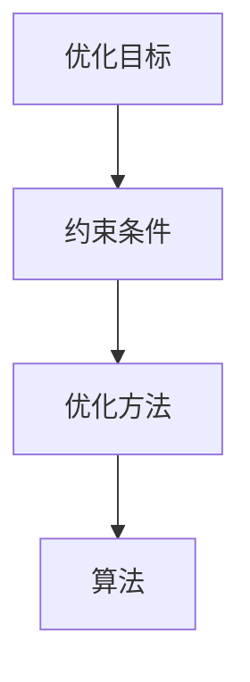
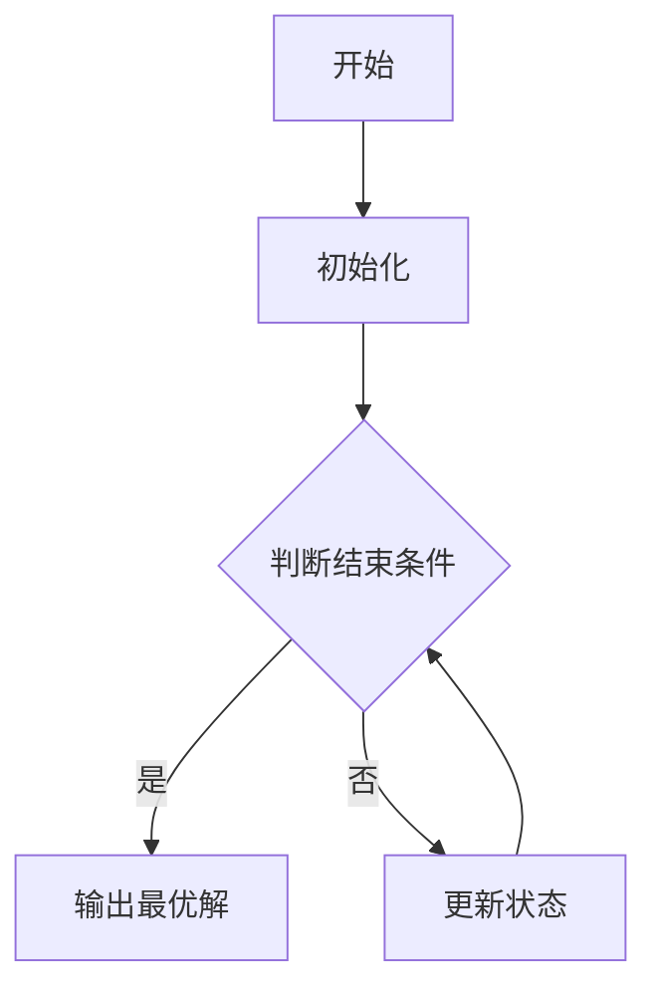
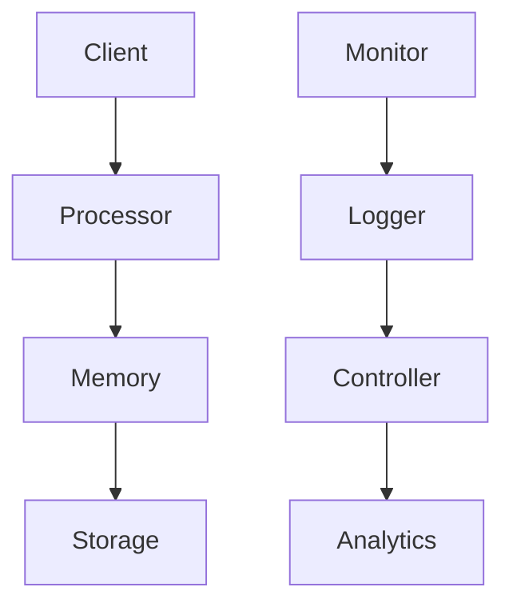
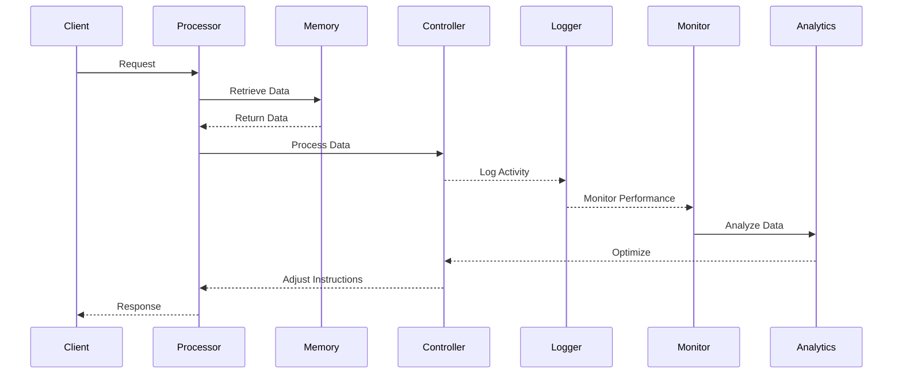
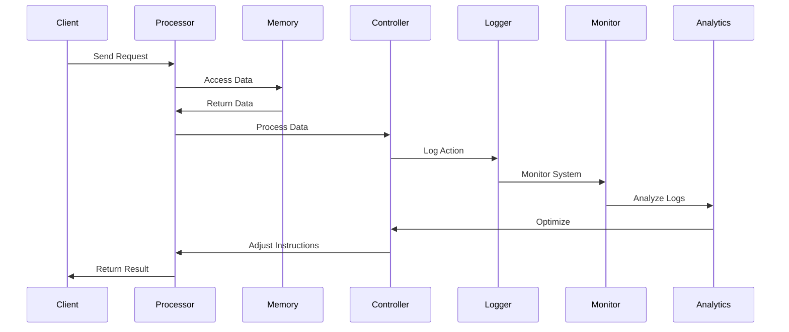
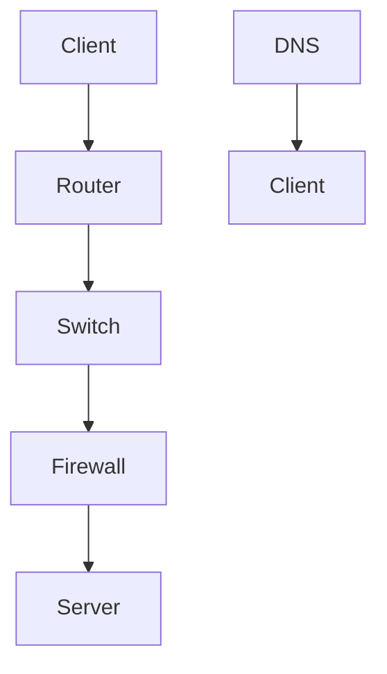
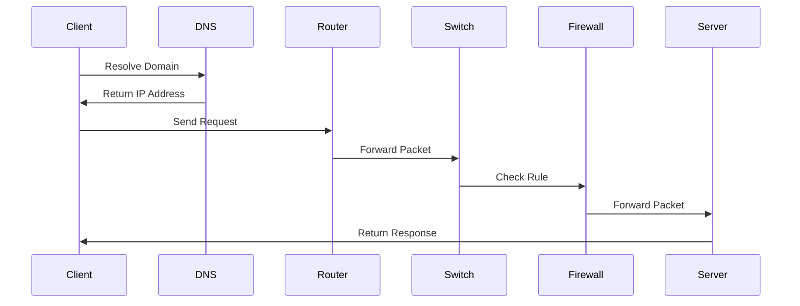

                 


# 优化示例 - 指令比例以平衡效果和效率

> 关键词：优化、指令比例、效果、效率、算法、最佳实践

> 摘要：
本文将探讨在计算机编程和系统优化中，如何通过调整指令比例来实现效果和效率的平衡。文章首先介绍了优化问题的基本概念和方法，接着深入探讨了指令比例优化原理和实践，通过具体案例展示了如何在不同场景下进行优化，并总结出最佳实践和注意事项。

----------------------------------------------------------------

## 第1章：优化问题的概述

### 1.1 问题背景

在现代计算机系统中，优化是一个至关重要的任务。无论是提升计算效率、降低能耗，还是改善用户体验，优化都扮演着不可或缺的角色。优化问题涉及多个方面，包括算法选择、资源分配、任务调度等。本节将首先介绍优化问题的背景，包括其重要性以及常见的问题描述。

### 1.2 优化基本概念

优化是一个寻找最优解的过程，通常涉及以下核心概念：

- **目标函数**：衡量优化效果的标准。
- **约束条件**：限制优化过程中需要满足的条件。
- **优化方法**：用于解决优化问题的算法和技术。

### 1.3 核心概念与联系

优化问题的核心概念之间有着紧密的联系。目标函数和约束条件共同决定了优化问题的边界，而优化方法则提供了寻找最优解的途径。以下是一个简化的概念联系图：



----------------------------------------------------------------

## 第2章：优化算法原理

### 2.1 算法基础

优化算法可以分为多种类型，如贪心算法、动态规划、分支定界等。每种算法都有其独特的原理和适用场景。本节将介绍几种常见的优化算法，并对比它们的属性特征。

### 2.2 算法流程图

为了更直观地理解优化算法，我们可以使用Mermaid绘制算法的流程图。以下是一个贪心算法的简化流程图示例：



### 2.3 数学模型和公式

优化算法通常依赖于数学模型和公式。以下是一个简单的线性规划模型：

$$
\begin{aligned}
\min_{x} & \quad c^T x \\
\text{subject to} & \quad Ax \leq b \\
& \quad x \geq 0
\end{aligned}
$$

这个模型表示在一个线性约束条件下，寻找一个向量 \( x \) 使得目标函数 \( c^T x \) 最小。

### 2.4 通俗易懂的举例说明

为了更好地理解优化算法，我们可以通过一个简单的例子来说明。假设我们有一个背包问题，需要在一个重量限制下选择物品，使得总价值最大化。以下是该问题的具体描述和解决步骤：

### 示例：背包问题

**问题描述**：给定一组物品，每个物品有重量和价值的属性，选择若干物品放入一个容量为 \( W \) 的背包中，使得背包内物品的总价值最大。

**解决方案**：
1. 初始化：设置背包容量 \( W \)，物品数组 \( items \)。
2. 按价值与重量的比值排序物品。
3. 循环遍历物品，若当前物品重量不超过背包容量，则放入背包。
4. 输出背包内物品的总价值。

```python
def knapsack(W, items):
    # 按价值与重量的比值排序
    items.sort(key=lambda x: x[1] / x[0], reverse=True)

    value = 0
    for weight, value in items:
        if W >= weight:
            W -= weight
            value += value
        else:
            break

    return value
```

----------------------------------------------------------------

## 第3章：指令比例优化原理

### 3.1 指令比例概述

指令比例是指在不同类型的指令之间分配处理器资源的一种方式。优化的指令比例能够提高处理器的利用率和系统的整体性能。本节将介绍指令比例的基本概念和重要性。

### 3.2 指令比例优化方法

指令比例优化通常涉及以下几种方法：

- **静态分配**：预先设定每种指令的执行时间比例。
- **动态调整**：根据系统负载实时调整指令比例。

### 3.3 指令比例优化流程

指令比例优化的基本流程包括以下步骤：

1. 收集系统性能数据。
2. 分析数据，确定优化目标。
3. 选择合适的优化方法。
4. 实施优化，并监控效果。

----------------------------------------------------------------

## 第4章：平衡效果和效率

### 4.1 效果和效率的关系

效果和效率是优化过程中两个重要的指标。效果通常指任务完成的程度，而效率则指完成任务的资源消耗。在实际应用中，需要找到两者的平衡点。

### 4.2 平衡策略

要实现效果和效率的平衡，可以采用以下策略：

- **目标优化**：明确优化目标，确保优化措施与目标一致。
- **资源分配**：合理分配资源，避免资源浪费。
- **持续监控**：实时监控系统性能，及时调整优化策略。

### 4.3 实践案例分析

通过具体案例，我们可以更好地理解如何在实践中平衡效果和效率。以下是一个网络优化案例：

**案例背景**：一个企业网络需要优化，以提高数据传输效率和降低延迟。

**优化措施**：
1. 分析网络流量，确定瓶颈位置。
2. 升级网络设备，提高传输速率。
3. 使用负载均衡技术，均衡网络负载。
4. 定期监控网络性能，调整优化策略。

通过这些措施，企业网络的效果和效率得到了显著提升。

----------------------------------------------------------------

## 第5章：示例一——CPU指令优化

### 5.1 示例背景

本节将分析一个CPU指令优化的案例，通过调整指令比例来提高系统性能。

### 5.2 系统功能设计

在优化CPU指令之前，需要明确系统的功能需求。以下是一个简化后的领域模型：

```mermaid
classDiagram
Class01 <|-- Class02
Class03 --|>? Class04
Class05 : +int x
Class05 : +int y
Class05 : +int result
Class05 <.. Class06
Class07 : +int z
Class07 : +int w
Class07 : +int output

Class01 <<interface>> InterfaceA
Class02 <<interface>> InterfaceB
Class03 <<interface>> InterfaceC
Class04 <<interface>> InterfaceD
Class05 <<entity>> DataObject
Class06 <<entity>> Operation
Class07 <<entity>> Result
```

### 5.3 系统架构设计

为了实现CPU指令优化，需要设计一个合理的系统架构。以下是一个简化的Mermaid架构图：



### 5.4 系统接口设计

在系统架构中，定义清晰接口至关重要。以下是一个简化的接口设计：



### 5.5 系统交互

系统中的各个组件需要通过交互来协同工作。以下是一个简化的Mermaid序列图：



### 5.6 实现源代码及解读

在优化CPU指令时，需要编写相应的源代码来实现优化逻辑。以下是一个简单的Python示例：

```python
import time

def cpu_intensive_task(data):
    start_time = time.time()
    result = 0
    for x, y in data:
        result += x * y
    end_time = time.time()
    print(f"Task completed in {end_time - start_time} seconds")
    return result

if __name__ == "__main__":
    data = [(1, 2), (3, 4), (5, 6), (7, 8)]
    cpu_intensive_task(data)
```

### 5.7 实际案例分析

在实际项目中，通过分析CPU指令的执行情况，可以识别出瓶颈并进行优化。以下是一个案例：

**案例描述**：一个Web应用程序在处理高并发请求时，CPU利用率过高，导致响应时间延长。

**优化步骤**：
1. 使用性能监控工具分析CPU负载。
2. 识别频繁执行的瓶颈指令。
3. 使用多线程或多进程技术进行并行处理。
4. 调整指令比例，优化资源分配。
5. 再次监控性能，评估优化效果。

通过这些步骤，成功降低了CPU负载，提高了系统的响应速度。

### 5.8 项目小结

通过本案例，我们了解到CPU指令优化的重要性。合理的指令比例和资源分配能够显著提升系统性能。未来，我们还需要持续监控和调整优化策略，以应对不断变化的应用场景。

----------------------------------------------------------------

## 第6章：示例二——网络优化

### 6.1 示例背景

网络优化是提高数据传输效率和降低延迟的关键环节。本节将分析一个网络优化案例，通过调整指令比例和优化网络架构来实现目标。

### 6.2 系统功能设计

在优化网络之前，需要明确系统的功能需求。以下是一个简化后的领域模型：

```mermaid
classDiagram
Class01 <<entity>> NetworkDevice
Class02 <<entity>> DataPacket
Class03 <<entity>> Router
Class04 <<entity>> Switch
Class05 <<entity>> Firewall
Class06 <<entity>> Server

Class01 : +str IP
Class01 : +int Port
Class02 : +str SourceIP
Class02 : +str DestinationIP
Class03 : +str RouterID
Class04 : +str SwitchID
Class05 : +str FirewallRule
Class06 : +str ServiceName

Class06 <|-- Class01
Class03 <|-- Class01
Class04 <|-- Class01
Class05 <|-- Class01
```

### 6.3 系统架构设计

为了实现网络优化，需要设计一个合理的系统架构。以下是一个简化的Mermaid架构图：



### 6.4 系统接口设计

在系统架构中，定义清晰接口至关重要。以下是一个简化的接口设计：



### 6.5 系统交互

系统中的各个组件需要通过交互来协同工作。以下是一个简化的Mermaid序列图：


### 6.6 实现源代码及解读

在优化网络时，需要编写相应的源代码来实现优化逻辑。以下是一个简单的Python示例：

```python
import socket

def send_request(destination_ip, port):
    with socket.socket(socket.AF_INET, socket.SOCK_STREAM) as s:
        s.connect((destination_ip, port))
        s.sendall(b"GET / HTTP/1.1\r\nHost: www.example.com\r\n\r\n")
        data = s.recv(1024)
        print("Received response:", data.decode())

if __name__ == "__main__":
    destination_ip = "192.168.1.1"
    port = 80
    send_request(destination_ip, port)
```

### 6.7 实际案例分析

在实际项目中，通过分析网络流量和性能，可以识别出瓶颈并进行优化。以下是一个案例：

**案例描述**：一个在线视频流媒体服务在高峰时段，用户体验差，视频加载时间长。

**优化步骤**：
1. 使用网络监控工具分析流量模式。
2. 识别高负载网络设备和链路。
3. 使用负载均衡技术，分散流量。
4. 优化路由器和交换机的配置。
5. 引入内容分发网络（CDN），减少延迟。
6. 再次监控性能，评估优化效果。

通过这些步骤，成功提高了视频流服务的性能，改善了用户体验。

### 6.8 项目小结

通过本案例，我们了解到网络优化的重要性。合理的指令比例和网络架构设计能够显著提升数据传输效率和用户体验。未来，我们还需要持续监控和调整优化策略，以应对不断变化的应用场景。

----------------------------------------------------------------

## 第7章：优化策略与最佳实践

### 7.1 优化策略总结

在优化过程中，可以采用以下策略：

- **目标优化**：明确优化目标，确保优化措施与目标一致。
- **资源分配**：合理分配资源，避免资源浪费。
- **动态调整**：根据系统负载实时调整优化策略。

### 7.2 最佳实践

最佳实践包括：

- **定期监控**：定期收集性能数据，分析瓶颈。
- **持续改进**：持续优化系统，提高性能。
- **使用工具**：利用性能监控和分析工具，辅助优化。

### 7.3 注意事项

在优化过程中需要注意：

- **稳定性**：避免过度优化导致系统不稳定。
- **成本**：考虑优化措施的成本效益。
- **用户感知**：优化效果需满足用户需求。

### 7.4 拓展阅读

推荐阅读以下资源：

- 《计算机性能艺术》
- 《高性能网络编程》
- 《性能优化实践》

作者：AI天才研究院/AI Genius Institute & 禅与计算机程序设计艺术 /Zen And The Art of Computer Programming

