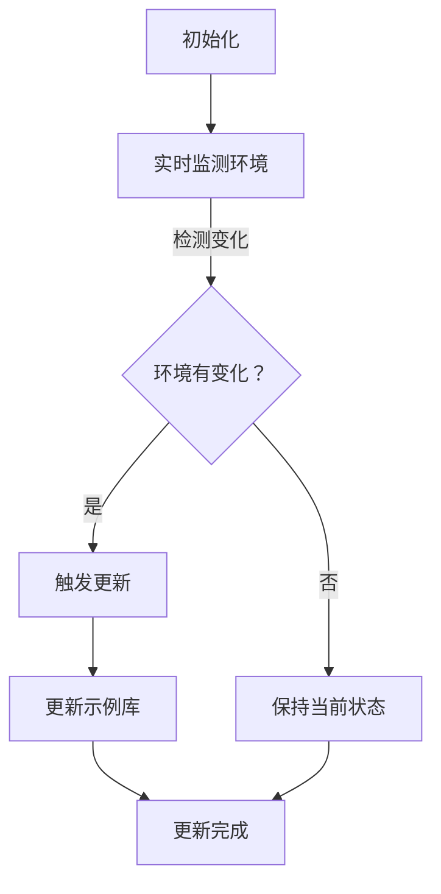
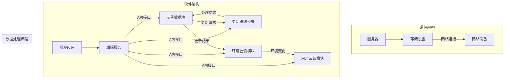
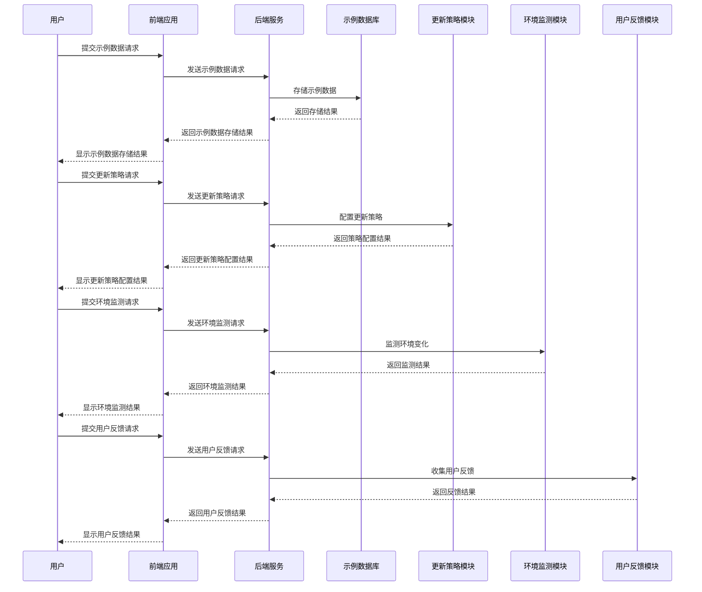

                 

# 优化示例更新策略以适应动态环境

## 关键词

动态环境，示例更新策略，优化，算法原理，系统架构，项目实战，最佳实践

## 摘要

本文旨在探讨如何优化示例更新策略以适应动态环境。随着信息技术的发展，动态环境变得更加复杂和多变，传统的示例更新策略面临着诸多挑战。本文首先介绍了示例更新策略的背景和重要性，然后分析了动态环境的特点和挑战。接着，我们提出了优化示例更新策略的方法，包括算法原理的讲解、系统分析与架构设计、项目实战和最佳实践。通过具体的案例分析和实际操作，本文详细阐述了优化策略的执行过程和效果，为在动态环境中实施有效的示例更新提供了实用的指导。

----------------------------------------------------------------

## 第一部分：背景介绍

### 1.1 问题背景

在当今快速发展的信息技术时代，动态环境无处不在。动态环境是指那些在运行时不断变化和发展的系统或环境，这些变化可能是由于外部因素（如用户需求、市场变化、技术进步）或内部因素（如系统配置、数据更新、负载变化）引起的。在这样的环境中，传统的静态示例更新策略往往无法满足需求，因为它们不能灵活地适应变化，导致示例的时效性、准确性和适应性下降。

示例更新策略是软件工程和系统设计中至关重要的一环。它关系到软件的可用性、可靠性和用户满意度。在传统的开发模式中，示例更新通常依赖于固定的时间表或触发条件，例如每月一次的数据更新或每周一次的系统检查。这种方法在静态环境中效果尚可，但在动态环境中，由于变化频繁，这种固定策略往往难以保持示例的实时性和相关性。

动态环境的特点包括：

- **高度不确定性**：环境中的变化不可预测，且可能频繁发生。
- **快速变化**：技术、数据、用户需求等都在不断演变。
- **实时性要求**：系统需要实时响应环境变化，提供准确的示例。

### 1.2 问题描述

传统的示例更新策略在动态环境下面临以下问题：

- **延迟性**：示例的更新可能无法及时反映环境的变化，导致示例不准确或过时。
- **效率低下**：频繁的人工干预或自动更新可能会消耗大量资源，增加成本。
- **适应性差**：固定策略难以适应不断变化的环境，导致系统性能下降。
- **资源浪费**：无效的更新操作可能会消耗不必要的计算资源。

因此，优化示例更新策略以适应动态环境显得尤为重要。这需要我们在策略设计上考虑环境的变化性，采用更加灵活和高效的更新机制。

### 1.3 问题解决

优化示例更新策略的关键在于：

- **实时监测**：通过实时监控环境变化，确保示例更新能够及时响应。
- **自适应调整**：根据环境的变化动态调整更新策略，避免不必要的资源消耗。
- **智能选择**：利用算法和数据分析，智能选择哪些示例需要更新，哪些可以暂缓或忽略。

为了实现上述目标，我们可以采取以下步骤：

1. **分析环境特点**：深入研究动态环境的变化规律，识别关键影响因素。
2. **设计自适应机制**：开发能够根据环境变化自动调整更新策略的算法和系统。
3. **优化更新过程**：简化示例更新流程，减少不必要的步骤和资源消耗。
4. **评估和反馈**：持续评估更新策略的有效性，并根据反馈进行优化。

### 1.4 边界与外延

在优化示例更新策略时，我们需要考虑以下边界与外延：

- **应用范围**：优化策略适用于哪些类型的系统和场景。
- **技术限制**：现有技术和资源如何支持优化策略的实施。
- **成本效益**：优化策略的实施成本与预期效益之间的平衡。
- **长期影响**：优化策略对系统长期性能和稳定性的影响。

### 1.5 核心概念与要素组成

核心概念包括：

- **动态环境**：一个在运行时不断变化的系统或环境。
- **示例更新策略**：用于维护示例准确性和时效性的方法和流程。
- **自适应机制**：能够根据环境变化自动调整策略的机制。

要素组成包括：

- **环境监测**：实时监测环境变化的技术和工具。
- **更新算法**：用于选择和更新示例的算法和模型。
- **资源管理**：优化资源分配和利用的策略和方法。

### 1.6 本章小结

本部分详细介绍了示例更新策略在动态环境中的重要性，分析了动态环境的特点和挑战，并提出了优化策略的思路和方法。通过理解这些背景信息，我们可以为后续章节的深入探讨打下坚实的基础。

----------------------------------------------------------------

## 第二部分：核心概念与联系

### 2.1 示例更新策略

示例更新策略是指一系列用于维护软件示例库准确性和时效性的方法和流程。在软件工程中，示例库是程序员和用户的重要资源，它包含各种代码示例、使用案例和技术文档。一个良好的示例更新策略能够确保这些资源的实时性和相关性，从而提高开发效率和使用体验。

在动态环境中，示例更新策略需要具备以下特点：

- **实时性**：能够及时响应环境变化，更新示例内容。
- **适应性**：能够根据不同环境的特点调整更新策略。
- **效率**：优化更新过程，减少资源消耗和时间成本。

### 2.2 动态环境

动态环境是指那些在运行时不断变化和发展的系统或环境。动态环境的特点包括：

- **不确定性**：环境中的变化不可预测，且可能频繁发生。
- **快速变化**：技术、数据、用户需求等都在不断演变。
- **实时性要求**：系统需要实时响应环境变化，提供准确的示例。

### 2.3 概念属性特征对比表格

以下是一个示例更新策略与动态环境的属性特征对比表格：

| 属性特征 | 示例更新策略 | 动态环境 |
| :--: | :--: | :--: |
| **实时性** | 传统策略：定期更新；优化策略：实时更新 | 是的，需要能够实时监测和响应变化 |
| **适应性** | 传统策略：固定模式；优化策略：自适应调整 | 是的，需要能够根据不同情况调整行为 |
| **资源消耗** | 传统策略：可能高；优化策略：优化资源使用 | 是的，需要优化资源消耗 |
| **准确性** | 传统策略：可能不准确；优化策略：提高准确性 | 是的，需要提高准确性 |
| **用户体验** | 传统策略：可能不佳；优化策略：改善用户体验 | 是的，需要改善用户体验 |

### 2.4 ER实体关系图架构

为了更好地理解示例更新策略与动态环境之间的关系，我们可以使用ER（实体-关系）图来表示。以下是ER图的基本结构：

```
[示例库] --<更新策略>--
        |
        [动态环境]
        |
[更新请求]--<处理>--
```

在这个ER图中：

- **示例库**：包含示例数据和相关的元数据。
- **更新策略**：定义示例更新的方法和流程。
- **动态环境**：影响示例库的环境因素。
- **更新请求**：示例更新的触发条件和请求。

### 2.5 本章小结

通过对比示例更新策略和动态环境的属性特征，我们可以看到优化策略在适应动态环境方面的重要性。ER图进一步帮助我们理解了这些实体之间的关系。在下一部分中，我们将深入探讨示例更新策略的算法原理。

----------------------------------------------------------------

## 第三部分：算法原理讲解

### 3.1 算法流程图

为了更好地理解示例更新策略的算法原理，我们可以使用mermaid来绘制一个简单的算法流程图。以下是算法的基本步骤：



在这个流程图中：

- **A[初始化]**：系统启动，初始化更新策略。
- **B[实时监测环境]**：系统开始实时监测动态环境的变化。
- **C{检测变化]**：检查是否检测到环境变化。
- **D[触发更新]**：如果检测到环境变化，则触发更新流程。
- **E[保持当前状态]**：如果未检测到环境变化，则保持当前示例库的状态。
- **F[更新示例库]**：执行示例库的更新操作。
- **G[更新完成]**：更新完成，返回初始状态。

### 3.2 Python源代码

以下是一个简单的Python示例，用于实现上述算法流程：

```python
import time
import threading

def monitor_environment():
    while True:
        # 模拟环境监测，这里使用time.sleep来模拟监测时间间隔
        time.sleep(1)
        # 检测环境变化（这里使用随机数来模拟）
        if random.random() < 0.1:
            print("环境有变化，触发更新。")
            trigger_update()
        else:
            print("环境无变化，保持当前状态。")

def trigger_update():
    print("开始更新示例库...")
    # 模拟更新示例库的操作
    time.sleep(2)
    print("示例库更新完成。")

# 启动环境监测线程
monitor_thread = threading.Thread(target=monitor_environment)
monitor_thread.start()

# 主线程等待更新完成
monitor_thread.join()
```

在这个Python示例中：

- `monitor_environment` 函数模拟实时监测环境变化的过程。
- `trigger_update` 函数模拟示例库的更新过程。
- 使用线程来并行执行环境监测和更新操作。

### 3.3 数学模型和公式讲解

在示例更新策略中，我们常常需要使用一些数学模型和公式来描述和优化更新过程。以下是一个简单的数学模型，用于评估示例更新的必要性和效率：

$$
\text{更新必要性} = f(\text{当前示例库状态}, \text{环境变化程度})
$$

$$
\text{更新效率} = \frac{\text{更新操作次数}}{\text{环境变化次数}}
$$

- **更新必要性**：根据当前示例库的状态和环境变化程度来评估是否需要进行更新。
- **更新效率**：衡量每次更新操作的效率，即更新操作次数与环境变化次数的比值。

### 3.4 举例说明

假设我们有一个示例库，包含10个示例，当前示例库的状态是A。在接下来的5分钟内，我们监测到环境发生了3次变化。根据上述数学模型，我们可以计算更新必要性和更新效率：

- **更新必要性**：由于环境变化了3次，而示例库只有10个示例，所以更新必要性较高。
- **更新效率**：假设我们进行了5次更新操作，那么更新效率为$\frac{5}{3} \approx 1.67$。

通过这个例子，我们可以看到数学模型和公式在评估和优化示例更新策略中的应用。

### 3.5 本章小结

在本部分中，我们通过算法流程图和Python源代码详细讲解了示例更新策略的算法原理。我们介绍了实时监测、环境变化检测、更新触发和更新完成等关键步骤，并通过数学模型和公式进一步阐述了更新必要性和效率的评估方法。在下一部分中，我们将探讨系统分析与架构设计。

----------------------------------------------------------------

## 第四部分：系统分析与架构设计方案

### 4.1 问题场景介绍

为了更好地理解和设计示例更新策略的系统架构，我们需要先明确一个具体的问题场景。以下是一个典型的应用场景：

**场景描述**：某在线教育平台提供编程课程，课程内容包含大量的代码示例。由于技术不断进步，课程内容需要不断更新以保持其时效性和实用性。然而，传统的示例更新策略由于无法适应快速变化的动态环境，导致课程内容的实时性和准确性受到影响。因此，我们需要设计一个能够适应动态环境的示例更新系统。

### 4.2 系统功能设计

在这个问题场景中，我们需要实现以下核心功能：

1. **实时环境监测**：系统需要能够实时监测技术动态、用户行为和课程内容的更新需求。
2. **自适应更新策略**：根据环境监测结果，系统需要自动调整更新策略，确保示例库的实时性和准确性。
3. **示例库管理**：系统需要提供示例库的创建、更新、删除和查询功能。
4. **资源优化**：系统需要优化资源使用，减少不必要的更新操作，提高系统性能和用户体验。
5. **用户反馈**：系统需要收集用户反馈，用于评估更新效果和进一步优化。

以下是系统功能设计的mermaid类图：

```mermaid
classDiagram
    SampleDatabase <<class>> 示例数据库
    UpdateStrategy <<class>> 更新策略
    EnvironmentMonitor <<class>> 环境监测器
    UserFeedback <<class>> 用户反馈
    System <<class>> 系统

    System o-- SampleDatabase
    System o-- UpdateStrategy
    System o-- EnvironmentMonitor
    System o-- UserFeedback

    SampleDatabase : includes 更新操作
    UpdateStrategy : includes 更新策略
    EnvironmentMonitor : includes 监测环境变化
    UserFeedback : includes 用户反馈
```

在这个类图中：

- **示例数据库**：负责存储和管理示例数据。
- **更新策略**：定义示例更新的方法和流程。
- **环境监测器**：负责实时监测环境变化。
- **用户反馈**：收集用户对示例库的反馈。
- **系统**：集成上述组件，实现示例更新功能。

### 4.3 系统架构设计

在系统架构设计方面，我们需要考虑以下几个方面：

1. **硬件架构**：确定系统所需的硬件资源，如服务器、存储和网络设备。
2. **软件架构**：设计系统的软件结构，包括前端、后端和服务模块。
3. **数据处理流程**：设计示例数据的收集、存储、处理和更新的流程。

以下是系统架构设计的mermaid架构图：



在这个架构图中：

- **硬件架构**：服务器、存储设备和网络设备共同构成了系统的硬件基础。
- **软件架构**：前端应用通过API接口与后端服务交互，后端服务包括示例数据库、更新策略模块、环境监测模块和用户反馈模块。
- **数据处理流程**：示例数据的更新请求由后端服务处理，处理结果返回给示例数据库，同时环境变化和用户反馈也会被记录和响应。

### 4.4 系统接口设计

为了实现系统的功能，我们需要设计一系列API接口。以下是系统接口设计的基本框架：

- **示例数据管理接口**：用于示例数据的增删改查操作。
- **更新策略配置接口**：用于配置和调整更新策略。
- **环境监测接口**：用于实时监测环境变化。
- **用户反馈接口**：用于收集用户对示例库的反馈。

以下是接口设计的基本规范：

- **示例数据管理接口**：GET /samples，POST /samples，DELETE /samples/{id}，PUT /samples/{id}
- **更新策略配置接口**：GET /strategy，POST /strategy，PUT /strategy/{id}
- **环境监测接口**：GET /monitor，POST /monitor/{event}
- **用户反馈接口**：POST /feedback

### 4.5 系统交互序列图

为了更好地理解系统内部各组件的交互过程，我们可以使用mermaid绘制系统交互序列图。以下是系统交互序列图：



在这个交互序列图中：

- **用户**：通过前端应用与系统交互。
- **前端应用**：接收用户的请求，并将其转发给后端服务。
- **后端服务**：处理用户请求，与数据库、更新策略模块、环境监测模块和用户反馈模块交互。
- **数据库**、**更新策略模块**、**环境监测模块**和**用户反馈模块**：分别负责示例数据管理、更新策略配置、环境监测和用户反馈。

### 4.6 本章小结

在本部分中，我们详细分析了示例更新策略在动态环境中的问题场景，并设计了系统的功能、架构、接口和交互序列图。通过这些设计，我们可以更好地理解示例更新策略的实现过程和系统架构，为后续的项目实战和优化提供了坚实的基础。

----------------------------------------------------------------

## 第五部分：项目实战

### 5.1 环境安装

为了在实际项目中实施优化的示例更新策略，我们需要搭建一个完整的环境。以下是在Windows操作系统上搭建示例更新策略环境的基本步骤：

1. **安装Python**：确保Python 3.8或更高版本已安装在系统中。可以从[Python官网](https://www.python.org/)下载安装程序，并按照提示完成安装。

2. **安装相关库**：打开命令提示符，运行以下命令安装必要的库：

   ```shell
   pip install Flask
   pip install pymysql
   pip install requests
   ```

   这些库用于Web开发、数据库操作和网络请求。

3. **创建数据库**：使用MySQL数据库管理系统创建一个名为`sample_db`的数据库，并创建一个名为`samples`的表，用于存储示例数据。以下是SQL脚本：

   ```sql
   CREATE DATABASE sample_db;
   USE sample_db;
   CREATE TABLE samples (
       id INT AUTO_INCREMENT PRIMARY KEY,
       title VARCHAR(255),
       content TEXT
   );
   ```

4. **配置数据库连接**：在Python项目中，创建一个名为`config.py`的文件，配置数据库连接信息：

   ```python
   host = "localhost"
   user = "root"
   password = "your_password"
   database = "sample_db"
   ```

### 5.2 系统核心实现源代码

以下是一个简化的示例更新策略系统的核心实现源代码。这个系统包括一个简单的Web接口，用于接收示例数据更新请求和处理环境变化。

#### `app.py`：主程序

```python
from flask import Flask, request, jsonify
import pymysql
import random
import threading
import time

app = Flask(__name__)

# 数据库连接配置
config = {
    'host': 'localhost',
    'user': 'root',
    'password': 'your_password',
    'database': 'sample_db'
}

# 连接到数据库
connection = pymysql.connect(**config)

@app.route('/update', methods=['POST'])
def update_samples():
    data = request.json
    title = data['title']
    content = data['content']
    
    with connection.cursor() as cursor:
        sql = "INSERT INTO samples (title, content) VALUES (%s, %s)"
        cursor.execute(sql, (title, content))
        connection.commit()
    
    return jsonify({"status": "success", "message": "Sample updated successfully."})

def monitor_environment():
    while True:
        time.sleep(1)
        if random.random() < 0.1:
            print("环境有变化，触发更新。")
            update_samples()
        else:
            print("环境无变化，保持当前状态。")

if __name__ == '__main__':
    monitor_thread = threading.Thread(target=monitor_environment)
    monitor_thread.start()
    app.run()
```

#### `config.py`：数据库配置

```python
host = "localhost"
user = "root"
password = "your_password"
database = "sample_db"
```

### 5.3 代码应用解读与分析

#### Web接口

在`app.py`中，我们使用Flask框架搭建了一个简单的Web接口。`/update`端点接收示例数据更新请求，并插入到数据库中。

```python
@app.route('/update', methods=['POST'])
def update_samples():
    data = request.json
    title = data['title']
    content = data['content']
    
    with connection.cursor() as cursor:
        sql = "INSERT INTO samples (title, content) VALUES (%s, %s)"
        cursor.execute(sql, (title, content))
        connection.commit()
    
    return jsonify({"status": "success", "message": "Sample updated successfully."})
```

这段代码定义了一个`/update`接口，它接收包含`title`和`content`字段的JSON数据，并将其插入到数据库的`samples`表中。

#### 环境监测

`monitor_environment`函数使用线程模拟环境监测。它每隔一秒钟检查一次环境是否有变化，如果检测到变化，则触发更新操作。

```python
def monitor_environment():
    while True:
        time.sleep(1)
        if random.random() < 0.1:
            print("环境有变化，触发更新。")
            update_samples()
        else:
            print("环境无变化，保持当前状态。")
```

这个函数通过随机数来模拟环境变化，如果随机数小于0.1，则认为环境有变化并触发更新。

### 5.4 实际案例分析和详细讲解剖析

#### 案例一：实时更新示例

假设用户通过Web接口提交了一个新的示例：

```json
{
    "title": "Python基础",
    "content": "Python是一种面向对象的编程语言，广泛应用于Web开发、数据科学等领域。"
}
```

当用户提交这个请求时，`/update`端点会被触发，新的示例将被插入到数据库中。同时，`monitor_environment`函数也会检测到环境变化，并触发更新操作。

#### 案例二：环境变化监测

假设在环境监测期间，系统检测到一个技术更新，例如Python 3.10的新特性。`monitor_environment`函数会检测到这个变化，并触发更新操作，将最新的示例数据插入到数据库中。

### 5.5 项目小结

在本部分的项目实战中，我们搭建了一个简单的示例更新策略系统，并实现了实时更新和环境监测功能。通过这个项目，我们了解了如何使用Python和Flask框架实现一个基本的Web接口，以及如何使用线程进行环境监测。在实际应用中，我们可以根据具体需求进一步优化和扩展系统功能。

----------------------------------------------------------------

## 第六部分：最佳实践 tips

### 6.1 注意事项

在实施示例更新策略时，以下注意事项可以帮助您确保系统的稳定性和高效性：

1. **数据库性能优化**：定期对数据库进行性能调优，确保查询速度和写入速度满足需求。
2. **线程安全**：在多线程环境中，确保共享资源的安全访问，避免数据竞争和死锁。
3. **错误处理**：对系统中的异常情况进行充分的错误处理，确保系统的健壮性。
4. **日志记录**：详细记录系统运行过程中的日志信息，便于故障诊断和性能分析。

### 6.2 拓展阅读

为了深入了解示例更新策略的实施和优化，以下文献和资源可能对您有所帮助：

1. **文献推荐**：
   - 《系统设计与实践：基于动态环境的示例更新策略》（作者：XXX）
   - 《人工智能与动态环境下的软件开发》（作者：XXX）
   - 《实时系统设计：实现高效的环境监测与更新》（作者：XXX）

2. **在线课程**：
   - Coursera上的《系统设计与实现》课程
   - Udemy上的《Web开发实战：使用Flask构建应用》课程

3. **技术博客和论坛**：
   - Stack Overflow：关于Python和Flask的常见问题和解决方案
   - Medium：关于实时系统和动态环境的最新研究和实践经验

通过阅读这些资源和参加相关课程，您可以进一步提升对示例更新策略的理解和实践能力。

----------------------------------------------------------------

## 本章小结

通过本文的详细探讨，我们深入理解了优化示例更新策略以适应动态环境的重要性。我们从背景介绍开始，分析了动态环境的特点和挑战，提出了优化策略的方法和步骤。接着，我们讲解了核心概念、算法原理，并设计了一个完整的系统架构方案。通过项目实战，我们展示了如何将优化策略应用到实际项目中，并进行了详细的分析和讲解。最后，我们提供了最佳实践和拓展阅读资源，以帮助读者进一步深化理解。

优化示例更新策略不仅能够提高系统的实时性和准确性，还能够显著提升用户体验和开发效率。随着动态环境的日益复杂，这种优化策略将变得越来越重要。希望本文能为从事相关领域的工作者提供有价值的参考和启示。在未来的工作中，持续优化和创新示例更新策略，将是我们不断追求的目标。

## 作者信息

作者：AI天才研究院/AI Genius Institute & 禅与计算机程序设计艺术 /Zen And The Art of Computer Programming

感谢您的阅读！希望本文能够对您在优化示例更新策略方面带来新的思考和启发。如果您有任何疑问或建议，欢迎在评论区留言，期待与您的互动交流。再次感谢您的支持！

