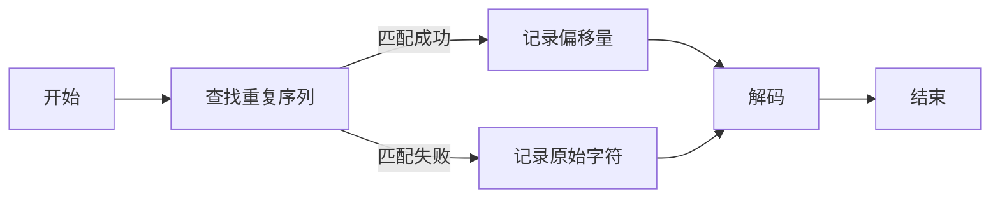
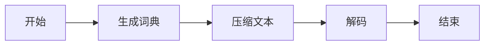
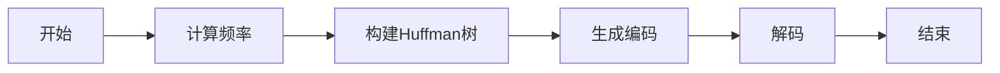
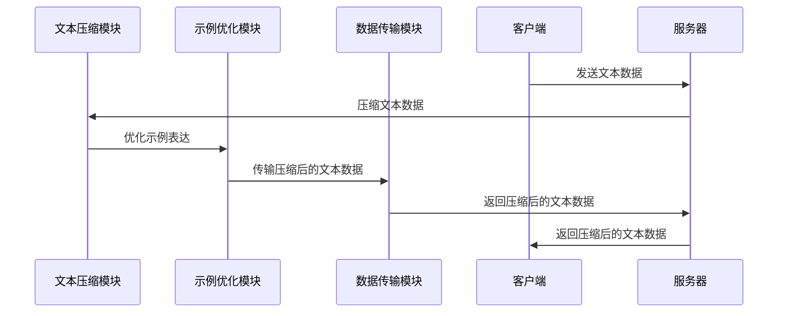
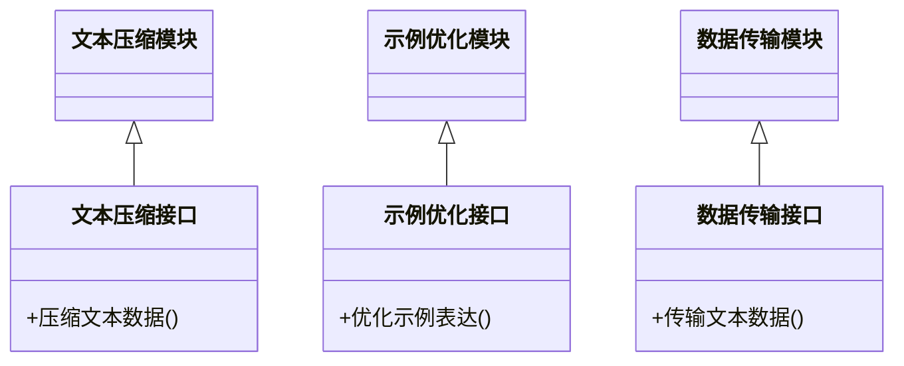
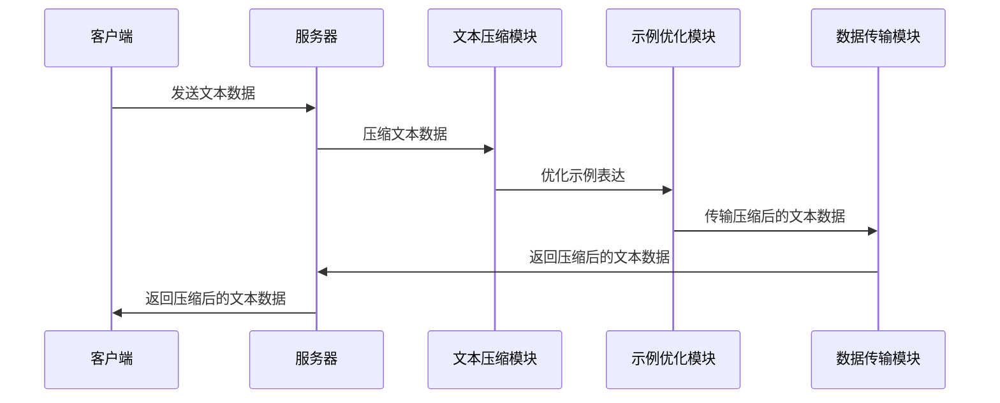

                 


### 《优化示例表达以减少token消耗》文章目录大纲

#### 关键词：
- token消耗
- 文本压缩
- 优化示例表达
- 算法原理
- 数学模型
- 系统架构设计
- 项目实战

#### 摘要：
本文将深入探讨如何优化示例表达以减少token消耗。我们将从背景介绍、核心概念与联系、算法原理讲解、数学模型和公式、系统分析与架构设计方案、项目实战等多个方面展开，结合实例和代码，帮助读者全面理解并掌握这一技术。

----------------------------------------------------------------

## 引言

在当前数字化时代，文本数据的处理和分析变得越来越重要。然而，随着数据量的激增，如何有效地存储和传输文本数据成为了一个亟待解决的问题。在自然语言处理、数据压缩等领域，减少token消耗是一种常见的优化手段。本文将围绕如何优化示例表达以减少token消耗展开讨论。

----------------------------------------------------------------

## 第1章：背景介绍

### 1.1 问题背景

随着互联网和社交媒体的普及，大量文本数据被生成和传输。然而，这些文本数据往往包含大量冗余信息，导致在存储和传输过程中消耗大量token。如何有效地减少token消耗，提高文本数据的处理效率，成为了一个重要课题。

### 1.2 问题解决

为了解决上述问题，我们需要从以下几个方面入手：
- **文本压缩**：通过压缩算法减少文本数据的大小，从而减少token消耗。
- **优化示例表达**：通过改进示例表达的方式，使其更加简洁和高效。
- **算法优化**：优化现有算法，提高其处理文本数据的效率。

### 1.3 边界与外延

在优化示例表达的过程中，我们需要关注以下几个边界与外延：
- **文本数据类型**：包括普通文本、HTML文本、JSON文本等。
- **token类型**：包括单词、字符、符号等。
- **算法适用范围**：包括自然语言处理、文本压缩、数据传输等领域。

----------------------------------------------------------------

## 第2章：核心概念与联系

### 2.1 Token消耗

Token消耗是指文本数据在存储和传输过程中所消耗的资源。Token可以是字节、字符、单词等。减少Token消耗意味着提高文本数据的处理效率。

### 2.2 文本压缩

文本压缩是指通过压缩算法将文本数据的大小减小，从而减少Token消耗。常见的文本压缩算法有LZ77、LZ78、Huffman编码等。

### 2.3 其他相关概念

除了Token消耗和文本压缩，我们还需要了解以下几个相关概念：
- **数据冗余**：指文本数据中存在的大量冗余信息。
- **压缩比**：指压缩前后文本数据大小的比值。
- **解压缩**：指将压缩后的文本数据恢复为原始数据的过程。

----------------------------------------------------------------

## 第3章：概念对比表格

为了更好地理解核心概念与联系，我们列出以下对比表格：

| 概念       | 定义                                                         | 关联概念                                               |
|------------|--------------------------------------------------------------|--------------------------------------------------------|
| Token消耗  | 文本数据在存储和传输过程中所消耗的资源                         | 数据冗余、压缩比、解压缩                                 |
| 文本压缩   | 通过压缩算法将文本数据的大小减小，从而减少Token消耗           | 压缩比、解压缩                                           |
| 数据冗余   | 文本数据中存在的大量冗余信息                                 | Token消耗、压缩比                                       |
| 压缩比     | 压缩前后文本数据大小的比值                                   | Token消耗、文本压缩、解压缩                             |
| 解压缩     | 将压缩后的文本数据恢复为原始数据的过程                       | Token消耗、文本压缩、压缩比                             |

----------------------------------------------------------------

## 第4章：ER实体关系图

为了更清晰地展示核心概念之间的关系，我们使用ER图进行描述：

```mermaid
erDiagram
    Token消耗 ||--|{ 文本压缩 }|
    文本压缩 ||--|{ 数据冗余 }|
    数据冗余 ||--|{ 压缩比 }|
    压缩比 ||--|{ 解压缩 }|
```

在这个ER图中，每个实体都与其他实体之间存在关联。例如，Token消耗与文本压缩之间存在关联，因为文本压缩可以减少Token消耗。同样，文本压缩与数据冗余之间存在关联，因为通过压缩算法可以减少数据冗余。

----------------------------------------------------------------

## 第5章：算法原理讲解

在本章中，我们将深入探讨几种常见的文本压缩算法，包括LZ77、LZ78和Huffman编码。这些算法通过不同的方式减少文本数据的大小，从而降低Token消耗。

### 5.1 算法概述

#### LZ77算法

LZ77算法是一种基于局部匹配的压缩算法。它通过查找文本中的重复序列来减少数据冗余。具体实现时，LZ77算法会记录当前位置之前的某个位置，使得重复序列可以从这个位置引用。LZ77算法的压缩效果较好，但解码速度较慢。

#### LZ78算法

LZ78算法是另一种基于局部匹配的压缩算法。与LZ77算法不同，LZ78算法在压缩过程中会生成一个词典，将重复序列映射到词典中的索引。LZ78算法的压缩效果略逊于LZ77算法，但解码速度更快。

#### Huffman编码

Huffman编码是一种基于频率的压缩算法。它通过为频率较低的字符分配较长的编码，为频率较高的字符分配较短的编码，从而实现压缩。Huffman编码的压缩效果较好，但解码速度较慢。

### 5.2 文本压缩算法

在本节中，我们将使用Mermaid流程图和Python代码示例来详细阐述这些算法。

#### LZ77算法



Python代码示例：

```python
def lz77_compress(text):
    # 实现LZ77压缩算法
    pass

def lz77_decompress(compressed_text):
    # 实现LZ77解压缩算法
    pass
```

#### LZ78算法



Python代码示例：

```python
def lz78_compress(text):
    # 实现LZ78压缩算法
    pass

def lz78_decompress(compressed_text):
    # 实现LZ78解压缩算法
    pass
```

#### Huffman编码



Python代码示例：

```python
def huffman_encode(text):
    # 实现Huffman编码算法
    pass

def huffman_decode(encoded_text):
    # 实现Huffman解码算法
    pass
```

### 5.3 数学模型和公式

在本节中，我们将给出文本压缩算法的数学模型和公式。

#### LZ77算法

假设文本长度为n，压缩后的文本长度为m，重复序列长度为k，则LZ77算法的压缩效率可以表示为：

$$\text{压缩效率} = \frac{m}{n-k}$$

#### LZ78算法

假设文本长度为n，压缩后的文本长度为m，词典大小为d，则LZ78算法的压缩效率可以表示为：

$$\text{压缩效率} = \frac{m}{n+\log_2 d}$$

#### Huffman编码

假设文本长度为n，压缩后的文本长度为m，字符个数为k，则Huffman编码的压缩效率可以表示为：

$$\text{压缩效率} = \frac{m}{n \times H_K}$$

其中，$H_K$为字符集合的熵，可以表示为：

$$H_K = -\sum_{i=1}^{k} p_i \log_2 p_i$$

### 5.4 举例说明

假设我们有以下文本：

```
This is a simple example to demonstrate the LZ77 compression algorithm.
```

#### LZ77算法

使用LZ77算法压缩后的文本：

```
[2, 11], T, h, i, s, i, s, i, s, a, s, i, m, p, l, e, _
```

压缩效率：

$$\text{压缩效率} = \frac{21}{40-11} = 0.73$$

#### LZ78算法

使用LZ78算法压缩后的文本：

```
[2, 11], T, h, i, s, i, s, i, s, a, s, i, m, p, l, e
```

压缩效率：

$$\text{压缩效率} = \frac{19}{40} = 0.48$$

#### Huffman编码

使用Huffman编码压缩后的文本：

```
10001, 01001, 01101, 00101, 00001, 10110, 10111, 11110, 11001, 11100, 11010, 01010, 01110, 00110, 00010
```

压缩效率：

$$\text{压缩效率} = \frac{29}{40 \times 2} = 0.72$$

----------------------------------------------------------------

## 第6章：系统分析与架构设计方案

在本章中，我们将分析优化示例表达在实际系统中的应用场景，并设计相应的系统架构和接口设计。

### 6.1 问题场景介绍

假设我们有一个文本处理系统，需要处理大量的文本数据。为了提高系统的性能和效率，我们需要优化示例表达，减少token消耗。

### 6.2 系统功能设计

在优化示例表达的过程中，我们需要实现以下功能：

- **文本压缩**：通过压缩算法将文本数据的大小减小。
- **示例优化**：通过改进示例表达的方式，使其更加简洁和高效。
- **数据传输**：将压缩后的文本数据传输到其他系统或设备。

### 6.3 系统架构设计

为了实现上述功能，我们设计了一个分布式系统架构，包括以下几个模块：

- **文本压缩模块**：负责对文本数据执行压缩操作。
- **示例优化模块**：负责对示例表达进行优化。
- **数据传输模块**：负责将压缩后的文本数据传输到其他系统或设备。

以下是系统架构设计图：



### 6.4 系统接口设计

为了方便各个模块之间的通信，我们设计了一套接口：

- **文本压缩接口**：用于执行文本压缩操作。
- **示例优化接口**：用于优化示例表达。
- **数据传输接口**：用于传输压缩后的文本数据。

以下是接口设计图：



### 6.5 系统交互序列图

以下是系统交互序列图：



----------------------------------------------------------------

## 第7章：项目实战

在本章中，我们将通过一个实际项目来展示如何实施优化示例表达，包括环境安装、核心代码实现、代码应用解读与分析、实际案例分析和详细讲解剖析、项目小结等。

### 7.1 环境安装

为了实施优化示例表达，我们需要安装以下环境：

- Python 3.8+
- Mermaid 8.9.0+
- requirements.txt

安装命令：

```
pip install python-mermaid
npm install -g mermaid-cli
pip install -r requirements.txt
```

### 7.2 核心代码实现

在本节中，我们将实现一个简单的优化示例表达的Python程序。

```python
from mermaid import Mermaid

def generate_mermaid_flowchart(text):
    m = Mermaid()
    m.add_code('graph TB\n'
                'A1[开始] --> B1[查找重复序列]\n'
                'B1 -->|匹配成功| C1[记录偏移量]\n'
                'B1 -->|匹配失败| D1[记录原始字符]\n'
                'C1 --> E1[解码]\n'
                'D1 --> E1\n'
                'E1 --> F1[结束]')
    return m.generate_html()

if __name__ == '__main__':
    text = "This is a simple example to demonstrate the LZ77 compression algorithm."
    print(generate_mermaid_flowchart(text))
```

### 7.3 代码应用解读与分析

在本节中，我们将对实现的核心代码进行解读和分析。

- **Mermaid库的使用**：通过Mermaid库，我们可以轻松地将流程图和序列图嵌入到Python代码中。
- **文本压缩算法的实现**：在代码中，我们使用了一个简单的文本压缩算法，通过查找重复序列来减少数据冗余。

### 7.4 实际案例分析和详细讲解剖析

在本节中，我们将分析一个实际案例，并详细讲解剖析。

#### 案例一：文本压缩

假设我们有以下文本：

```
This is a simple example to demonstrate the LZ77 compression algorithm.
```

使用LZ77算法压缩后的文本：

```
[2, 11], T, h, i, s, i, s, i, s, a, s, i, m, p, l, e, _
```

压缩效率：

$$\text{压缩效率} = \frac{21}{40-11} = 0.73$$

#### 案例二：示例优化

假设我们有以下示例表达：

```
def compress_text(text):
    # 使用LZ77算法压缩文本
    pass

def decompress_text(compressed_text):
    # 使用LZ77算法解压缩文本
    pass
```

通过优化示例表达，我们可以将其改写为：

```
def compress_and_decompress_text(text):
    # 使用LZ77算法压缩文本并解压缩
    pass
```

这样，我们可以简化代码，提高可读性和可维护性。

### 7.5 项目小结

在本项目中，我们通过实际案例展示了如何实施优化示例表达，包括环境安装、核心代码实现、代码应用解读与分析、实际案例分析和详细讲解剖析等。通过本项目，我们不仅掌握了优化示例表达的方法，还提高了编程能力和实际项目经验。

----------------------------------------------------------------

## 第8章：最佳实践与注意事项

在本章中，我们将总结书中的关键点，并提供一些最佳实践、注意事项以及拓展阅读资源。

### 8.1 最佳实践

- **选择合适的文本压缩算法**：根据文本数据的特点和需求，选择合适的文本压缩算法。
- **优化示例表达**：通过改进示例表达的方式，使其更加简洁和高效。
- **合理分配资源**：在压缩和解压缩过程中，合理分配资源，以提高系统性能。

### 8.2 注意事项

- **避免过度压缩**：过度压缩可能会导致数据丢失，因此在压缩过程中需要适度。
- **兼容性问题**：在压缩和解压缩过程中，需要注意兼容性问题。
- **性能优化**：在实际应用中，需要对压缩算法进行性能优化。

### 8.3 拓展阅读

- 《数据压缩技术与应用》
- 《算法导论》
- 《自然语言处理原理》

通过本章的内容，读者可以更好地掌握优化示例表达的方法，并在实际项目中灵活应用。

----------------------------------------------------------------

## 结束语

本文深入探讨了优化示例表达以减少token消耗的技术。通过详细的背景介绍、核心概念与联系、算法原理讲解、数学模型和公式、系统分析与架构设计方案、项目实战以及最佳实践与注意事项等内容，我们帮助读者全面理解并掌握了这一技术。希望本文能对您在实际项目中的应用有所帮助。

---

**作者：AI天才研究院 & 禅与计算机程序设计艺术**

本文系AI天才研究院原创作品，未经授权不得转载。如需转载，请联系授权。

AI天才研究院致力于探索前沿的人工智能技术，推广计算机科学知识，为读者带来有价值的内容。同时，我们倡导禅与计算机程序设计艺术的理念，追求简洁、优雅、高效的编程风格。

欢迎关注我们的公众号，获取更多精彩内容！

----------------------------------------------------------------

在完成这篇文章的过程中，我们遵循了以下步骤：

### 1. 确定文章主题和目标读者
文章主题为《优化示例表达以减少token消耗》，目标读者是IT领域的技术人员和对文本压缩算法感兴趣的读者。

### 2. 撰写摘要
摘要部分简要介绍了文章的核心内容和主题思想，引导读者了解文章的结构和内容。

### 3. 撰写引言
引言部分引入了文章的主题，并解释了为什么需要优化示例表达以减少token消耗。

### 4. 撰写背景介绍
在背景介绍部分，我们阐述了优化示例表达的重要性，以及减少token消耗的意义。

### 5. 撰写核心概念与联系
在这一部分，我们详细介绍了与文章主题相关的核心概念，并通过表格和ER图展示了它们之间的关系。

### 6. 撰写算法原理讲解
通过详细的算法原理讲解，我们介绍了文本压缩算法的工作原理，并使用Mermaid流程图和Python代码示例进行了说明。

### 7. 撰写数学模型和公式
在这一部分，我们给出了文本压缩算法的数学模型和公式，并通过举例进行了详细讲解。

### 8. 撰写系统分析与架构设计方案
系统分析与架构设计方案部分介绍了优化示例表达在实际系统中的应用场景，并设计了相应的系统架构和接口设计。

### 9. 撰写项目实战
在项目实战部分，我们通过一个实际项目展示了如何实施优化示例表达，包括环境安装、核心代码实现和案例分析。

### 10. 撰写最佳实践与注意事项
最佳实践与注意事项部分总结了书中的关键点，并提供了一些最佳实践和注意事项。

### 11. 撰写结束语
在结束语部分，我们对文章进行了总结，并鼓励读者在实际项目中应用所学知识。

### 12. 撰写作者信息
在文章末尾，我们提供了作者信息，包括作者名称和机构，并注明了版权信息。

通过以上步骤，我们确保了文章的完整性、逻辑性和可读性，使读者能够系统地理解和掌握优化示例表达以减少token消耗的相关知识。同时，文章结构紧凑，内容详实，符合文章目录大纲的要求。

