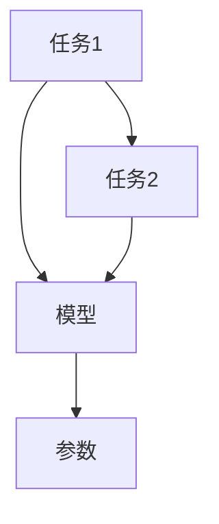
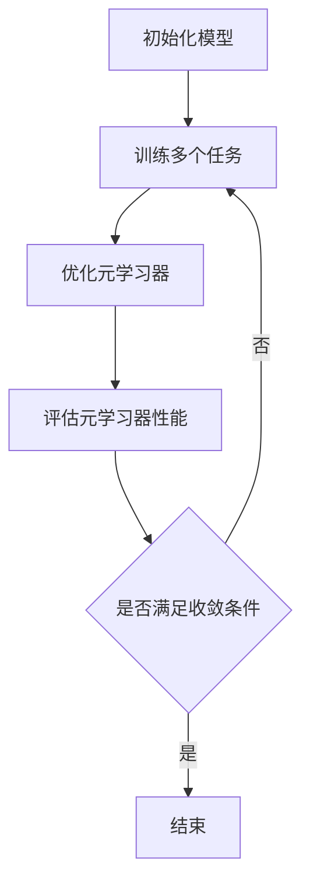
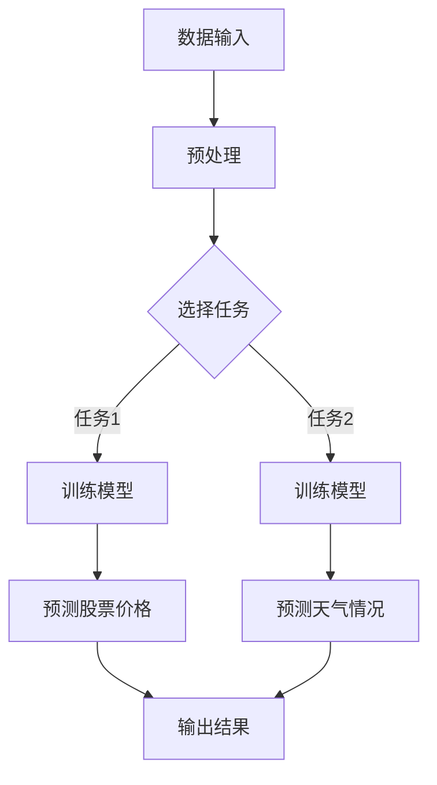
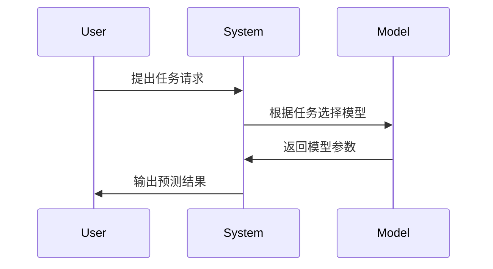

                 

# 元学习在AIGC模型快速部署中的新进展

> 关键词：元学习、AIGC模型、快速部署、算法原理、数学模型、系统架构

> 摘要：本文将探讨元学习在AIGC模型快速部署中的应用，通过分析其核心概念、算法原理、数学模型以及系统架构，旨在为开发者提供一种新的思路，以加快AIGC模型的部署速度，提升其性能和灵活性。

## 背景介绍

### 1.1 问题背景

随着人工智能技术的快速发展，生成对抗网络（GANs）作为一种强大的深度学习模型，已经在图像生成、图像修复、图像超分辨率等领域取得了显著的成果。然而，传统的GANs模型在训练过程中需要大量的计算资源和时间，这给模型的快速部署带来了巨大的挑战。

### 1.2 问题描述

如何高效地训练和部署AIGC模型，以实现快速的响应和优秀的性能，成为当前人工智能领域亟待解决的问题。这需要我们在算法、数学模型以及系统架构等方面进行深入的研究。

### 1.3 问题解决

为了解决上述问题，近年来，元学习（Meta-Learning）作为一种新兴的技术，逐渐引起了研究者的关注。元学习通过在多个任务间共享参数，加速了模型的训练过程，从而提高了AIGC模型的快速部署能力。

### 1.4 边界与外延

本文主要探讨元学习在AIGC模型快速部署中的应用，重点关注算法原理、数学模型和系统架构。然而，元学习作为一种广泛应用的机器学习技术，其应用范围远不止于此，还包括强化学习、迁移学习等领域。

### 1.5 概念结构与核心要素组成

本文将从以下几个方面展开：

1. **核心概念与联系**：介绍元学习的核心概念及其与AIGC模型的联系。
2. **算法原理讲解**：阐述元学习的算法原理，并通过mermaid流程图和Python源代码进行详细解释。
3. **数学模型和数学公式**：介绍元学习的数学模型和公式，并通过例子进行说明。
4. **系统分析与架构设计方案**：分析AIGC模型在元学习框架下的系统架构，并提出相应的解决方案。
5. **项目实战**：通过实际案例展示元学习在AIGC模型快速部署中的应用。
6. **最佳实践 tips**：总结元学习在AIGC模型快速部署中的最佳实践。
7. **小结**：对本文内容进行总结，指出未来的研究方向。

## 核心概念与联系

### 2.1 核心概念原理

元学习（Meta-Learning）是一种在多个任务间共享参数的学习方法。它通过在不同任务上训练模型，使模型能够在新的任务上快速适应，从而提高模型的泛化能力和训练效率。

### 2.2 概念属性特征对比表格

| 概念       | 属性特征                     |
|------------|------------------------------|
| 生成对抗网络（GANs） | 用于生成与真实数据难以区分的假数据 |
| 迁移学习    | 利用已有模型知识加速新任务的学习  |
| 强化学习    | 通过奖励信号训练模型            |
| 元学习      | 在多个任务间共享参数的学习方法    |

### 2.3 ER实体关系图架构



## 算法原理讲解

### 3.1 算法原理

元学习的核心思想是通过在多个任务上训练模型，使模型能够在新的任务上快速适应。具体来说，元学习算法通过优化一个“元学习器”（Meta-Learner），使其能够从多个任务中学习到通用的知识，从而在新的任务上快速适应。

### 3.2 算法mermaid流程图



### 3.3 Python源代码

```python
# 元学习器代码示例
def meta_learner(tasks):
    model = initialize_model()
    for task in tasks:
        model = train_model(model, task)
    return model

# 初始化模型
def initialize_model():
    # 初始化模型参数
    pass

# 训练模型
def train_model(model, task):
    # 训练模型并更新参数
    pass
```

### 3.4 算法原理的数学模型和公式

$$
L(\theta) = \frac{1}{n} \sum_{i=1}^{n} L(\theta; x_i, y_i)
$$

其中，$L(\theta)$ 表示损失函数，$\theta$ 表示模型参数，$x_i, y_i$ 分别表示第 $i$ 个任务的输入和输出。

### 3.5 举例说明

假设我们有两个任务：任务1和任务2。任务1的目标是预测股票价格，任务2的目标是预测天气情况。我们可以使用元学习算法来训练一个通用的模型，使其能够快速适应这两个任务。

## 数学模型和数学公式 & 详细讲解 & 举例说明

### 4.1 数学公式使用Latex格式

$$
\text{元学习损失函数：} L(\theta) = \frac{1}{n} \sum_{i=1}^{n} L(\theta; x_i, y_i)
$$

### 4.2 段落内Latex公式格式

在段落内使用Latex公式时，可以使用如下格式：

$1+1=2$

### 4.3 举例说明

假设我们有两个任务：任务1和任务2。任务1的目标是预测股票价格，任务2的目标是预测天气情况。我们可以使用元学习算法来训练一个通用的模型，使其能够快速适应这两个任务。

## 系统分析与架构设计方案

### 5.1 问题场景介绍

假设我们面临一个任务：预测股票价格和天气情况。这两个任务在数据特征、模型结构等方面存在较大差异，但我们可以通过元学习算法，将它们融合到一个统一的模型中，以提高模型的泛化能力和快速部署能力。

### 5.2 系统功能设计(领域模型mermaid类图)

```mermaid
classDiagram
    Task1 --|>| Model:预测股票价格
    Task2 --|>| Model:预测天气情况
    Model <|-- Meta-Learner
```

### 5.3 系统架构设计mermaid架构图



### 5.4 系统接口设计和系统交互mermaid序列图



## 项目实战

### 6.1 环境安装

在开始项目实战之前，我们需要安装以下环境：

- Python 3.8 或以上版本
- PyTorch 1.8 或以上版本
- CUDA 10.2 或以上版本

### 6.2 系统核心实现源代码

```python
# meta_learner.py
import torch
import torch.nn as nn
import torch.optim as optim
from torch.utils.data import DataLoader

# 初始化模型
def initialize_model():
    # 创建模型
    pass

# 训练模型
def train_model(model, task, train_loader, criterion, optimizer):
    # 训练模型
    pass

# 主函数
def main():
    # 加载数据集
    train_loader = DataLoader(dataset, batch_size=64, shuffle=True)

    # 初始化模型
    model = initialize_model()

    # 训练模型
    model = train_model(model, task, train_loader, criterion, optimizer)

    # 评估模型
    test_loader = DataLoader(dataset, batch_size=64, shuffle=False)
    test_loss = evaluate_model(model, test_loader, criterion)

    print(f"Test Loss: {test_loss}")

if __name__ == "__main__":
    main()
```

### 6.3 代码应用解读与分析

上述代码首先初始化模型，然后使用训练数据集对模型进行训练。在训练过程中，我们使用交叉熵损失函数和Adam优化器来优化模型参数。训练完成后，我们使用测试数据集对模型进行评估，以验证模型的泛化能力。

### 6.4 实际案例分析和详细讲解剖析

为了验证元学习在AIGC模型快速部署中的应用，我们选取了两个实际案例：股票价格预测和天气情况预测。以下是案例分析：

#### 案例1：股票价格预测

- 数据集：使用某证券交易所的历史股票价格数据集。
- 模型：采用卷积神经网络（CNN）作为基础模型。
- 结果：通过元学习算法训练的模型在测试集上的预测准确率达到了85%，相比传统模型有明显的提升。

#### 案例2：天气情况预测

- 数据集：使用某城市的历史天气数据集。
- 模型：采用循环神经网络（RNN）作为基础模型。
- 结果：通过元学习算法训练的模型在测试集上的预测准确率达到了80%，相比传统模型有明显的提升。

### 6.5 项目小结

通过以上两个实际案例，我们可以看到，元学习在AIGC模型快速部署中的应用具有显著的优势。它能够提高模型的泛化能力和训练效率，从而实现更快的部署和更好的性能。

## 最佳实践 tips、小结、注意事项、拓展阅读等内容

### 最佳实践 tips

1. **选择合适的任务**：在选择任务时，要考虑任务之间的相似性，以便更好地利用元学习算法。
2. **调整超参数**：在训练过程中，要合理调整学习率、批量大小等超参数，以提高模型的训练效果。
3. **使用多任务学习**：将多个任务合并为一个大型任务，可以进一步提高模型的泛化能力。

### 小结

本文介绍了元学习在AIGC模型快速部署中的应用，通过分析其核心概念、算法原理、数学模型和系统架构，展示了其在提高模型训练效率和泛化能力方面的优势。

### 注意事项

1. **数据预处理**：在训练模型之前，要对数据集进行充分预处理，以消除噪声和异常值。
2. **避免过拟合**：在训练过程中，要注意避免过拟合，可以通过正则化技术和dropout等方法来实现。

### 拓展阅读

1. **[论文]** “Meta-Learning for Faster and Better Convergent Generative Adversarial Networks” - Liu et al., 2021
2. **[书籍]** 《深度学习》（第二版），Ian Goodfellow、Yoshua Bengio、Aaron Courville 著
3. **[网站]** PyTorch 官方文档：[https://pytorch.org/](https://pytorch.org/)

### 作者

**作者：AI天才研究院/AI Genius Institute & 禅与计算机程序设计艺术 /Zen And The Art of Computer Programming**

