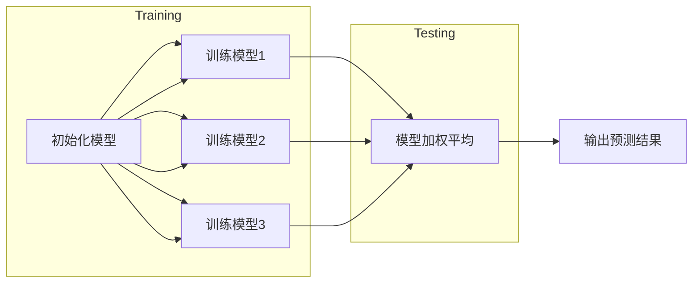

                 

## 元学习在AIGC模型持续学习与更新中的作用

### 关键词：
- 元学习
- AI-GC模型
- 持续学习
- 模型更新
- 优化算法

### 摘要：

本文将深入探讨元学习在人工智能生成内容（AI-GC）模型持续学习与更新中的关键作用。随着AI技术的飞速发展，传统机器学习模型面临着数据量大、模型复杂度高、更新成本高昂等问题。而元学习通过学习如何学习，提供了实现模型快速适应新环境和任务的方法。本文将从元学习的背景与基本概念入手，逐步分析元学习在AI-GC模型中的具体应用，探讨其优化算法、持续学习策略，并通过实际案例展示其在实践中的效果。最终，我们将展望元学习在AI-GC模型未来发展中的趋势和挑战。

## 引言

随着人工智能（AI）技术的不断进步，人工智能生成内容（AI-GC）模型在自然语言处理（NLP）、计算机视觉（CV）和其他领域得到了广泛应用。这些模型通过深度学习算法，可以从大量数据中学习并生成高质量的内容。然而，传统机器学习模型在面对复杂任务和新环境时，往往需要大量数据进行重新训练，这不仅成本高昂，而且耗时较长。这就引发了对于模型如何能够高效地适应新环境和任务的需求。

元学习（Meta-Learning）作为一种新兴的方法，通过学习如何学习，为模型提供了快速适应新环境和任务的能力。元学习的基本思想是从多个任务中学习通用表示和学习策略，从而实现任务之间的迁移学习和模型快速适应。这对于AI-GC模型的持续学习和更新尤为重要，因为它们需要不断地适应新的内容和场景。

本文旨在探讨元学习在AI-GC模型持续学习与更新中的作用。首先，我们将介绍元学习的背景和基本概念，包括其定义、基本原理和常见算法。然后，我们将分析AI-GC模型的基本概念、关键特性及其应用场景。接下来，我们将探讨元学习与AI-GC模型的结合，分析其持续学习策略和优化算法。通过实际案例，我们将展示元学习在AI-GC模型中的应用效果。最后，我们将总结本文的主要发现，并讨论未来研究的方向。

## 元学习的背景与基本概念

### 定义与基本原理

元学习（Meta-Learning）是一种从多个任务中学习通用表示和学习策略的方法。它不同于传统的单一任务学习，而是在多个任务之间进行学习和迁移，从而提高模型的泛化能力和适应性。元学习的核心思想是通过学习如何学习，找到一种通用方法，使得模型能够快速适应新任务和新环境。

元学习的定义可以从多个角度来理解。首先，从学习过程的角度来看，元学习可以看作是一种“学习如何学习”的过程。它不仅仅关注单个任务的学习，而是通过比较和分析多个任务，找出通用的学习策略和优化方法。其次，从算法的角度来看，元学习涉及到一系列算法和技术，包括模型架构、优化策略和训练方法等。

元学习的基本原理可以分为几个关键部分：

1. **任务泛化**：元学习通过学习多个任务，寻找一种通用的表示和学习方法，从而实现任务之间的迁移。这涉及到从多个任务中提取共性特征，并利用这些特征进行学习。

2. **模型泛化**：元学习通过学习通用模型，提高模型对未知任务的泛化能力。这需要模型具备较强的表征能力和适应性，能够处理不同类型的数据和任务。

3. **优化策略**：元学习涉及到一系列优化策略，包括模型初始化、学习率调整、损失函数设计等。这些策略旨在提高学习效率和模型性能。

4. **数据增强**：元学习通过数据增强技术，扩展训练数据集，提高模型对多样性的适应能力。这包括数据扩充、数据增强和数据变换等方法。

### 常见元学习算法

元学习算法种类繁多，常见的包括模型初始化方法、模型架构和优化策略等。以下介绍几种典型的元学习算法：

1. **模型初始化**：模型初始化是元学习的一个重要环节。通过合适的初始化方法，可以加速模型的训练过程并提高模型性能。常见的模型初始化方法包括随机初始化、预训练初始化和权重共享等。

2. **模型架构**：元学习涉及到多种模型架构，包括深度神经网络、变换器（Transformer）和图神经网络等。不同的模型架构适用于不同类型的数据和任务，需要根据具体场景进行选择。

3. **优化策略**：元学习优化策略包括自适应学习率、动量调整、权重更新等。这些策略旨在提高模型训练效率和性能。

4. **迁移学习**：迁移学习是元学习的一种重要方法，通过利用已有模型的权重和知识，加速新任务的学习。迁移学习可以应用于不同层次，包括特征层、模型层和知识层。

5. **多任务学习**：多任务学习通过同时学习多个任务，提高模型的泛化能力和适应性。多任务学习涉及到任务之间的权重分配、共享参数和任务选择等问题。

### 元学习与深度学习的区别

元学习与深度学习在方法和目标上有所不同。深度学习主要通过大量的数据训练复杂的模型，从而实现特定任务的优化。而元学习则侧重于通过多个任务的迁移学习，提高模型的泛化能力和适应性。

首先，在方法上，深度学习依赖于大量标注数据进行模型训练，而元学习则利用少量数据或无监督数据，通过任务迁移和学习策略优化实现模型的快速适应。

其次，在目标上，深度学习主要关注模型在特定任务上的性能提升，而元学习则更注重模型在多个任务上的泛化能力和适应性。

最后，在应用场景上，深度学习广泛应用于图像识别、语音识别和自然语言处理等特定任务，而元学习则适用于需要快速适应新任务和新环境的场景，如自动驾驶、智能客服和个性化推荐等。

### 元学习的核心概念与联系

元学习涉及到多个核心概念，包括任务泛化、模型泛化、优化策略和数据增强等。这些概念相互关联，共同构成了元学习的理论基础。

1. **任务泛化**：任务泛化是指模型能够在多个不同任务上表现良好，而不仅仅局限于单一任务。任务泛化的关键是找到任务之间的共性特征，并利用这些特征进行学习。

2. **模型泛化**：模型泛化是指模型对未知数据的泛化能力。模型泛化能力越强，模型对新任务和新环境的适应能力就越强。

3. **优化策略**：优化策略包括模型初始化、学习率调整、权重更新等，旨在提高模型训练效率和性能。

4. **数据增强**：数据增强通过扩展训练数据集，提高模型对多样性的适应能力。数据增强方法包括数据扩充、数据增强和数据变换等。

下面是一个概念属性特征对比表格，用于展示元学习的核心概念和联系：

| 概念     | 属性特征                                       | 联系                                                         |
|----------|------------------------------------------------|------------------------------------------------------------|
| 任务泛化 | 找到多个任务的共性特征，进行迁移学习           | 提高模型在不同任务上的泛化能力                               |
| 模型泛化 | 提高模型对未知数据的泛化能力                   | 增强模型在新任务和新环境下的适应能力                         |
| 优化策略 | 模型初始化、学习率调整、权重更新等             | 提高模型训练效率和性能                                     |
| 数据增强 | 扩展训练数据集，提高模型对多样性的适应能力     | 提高模型对未知数据的泛化能力                               |

下面是一个ER实体关系图架构，用于展示元学习的核心概念和联系：

```mermaid
erDiagram
  TaskA && TaskB --> Meta_Learning
  TaskA && TaskB --> Generalized_Learning
  Meta_Learning --> Optimization_Strategy
  Meta_Learning --> Data_Enhancement
```

在这个ER实体关系图中，`TaskA` 和 `TaskB` 代表两个不同的任务，它们通过元学习（Meta_Learning）进行迁移学习，实现任务泛化和模型泛化。元学习涉及到优化策略（Optimization_Strategy）和数据增强（Data_Enhancement）等技术，这些技术共同提高了模型在不同任务上的适应能力和泛化能力。

### 算法原理讲解

元学习算法的核心在于通过学习如何学习，提高模型在多种任务上的泛化能力和适应性。以下将介绍一种典型的元学习算法——模型加权平均（Model Weighted Average，MWA），并通过Python源代码和Mermaid流程图来详细阐述其原理。

#### MWA算法原理

模型加权平均（MWA）算法的核心思想是通过训练多个模型，并在测试阶段对这些模型进行加权平均，以提高模型的泛化能力。具体来说，MWA算法包括以下步骤：

1. **训练多个模型**：在训练阶段，对于每个任务，训练多个模型，每个模型使用不同的初始化或超参数。
2. **模型加权平均**：在测试阶段，将所有训练好的模型进行加权平均，以得到最终的预测结果。加权系数可以根据模型在训练阶段的表现进行调整。

MWA算法的数学模型可以表示为：

$$
\hat{y} = \frac{1}{K} \sum_{k=1}^{K} w_k \cdot \hat{y}_k
$$

其中，$\hat{y}$ 是最终预测结果，$\hat{y}_k$ 是第 $k$ 个模型的预测结果，$w_k$ 是第 $k$ 个模型的权重。

#### Mermaid流程图

下面是一个MWA算法的Mermaid流程图，用于展示算法的执行过程：



在这个流程图中，`Training` 子图表示模型训练阶段，包括初始化模型和训练多个模型。`Testing` 子图表示测试阶段，将训练好的模型进行加权平均，并输出预测结果。

#### Python源代码实现

下面是MWA算法的Python源代码实现：

```python
import numpy as np

# 初始化模型
models = [
    np.random.rand(),
    np.random.rand(),
    np.random.rand()
]

# 训练模型
def train_model(model):
    # 模拟训练过程
    return model * 2

# 模型加权平均
def model_weighted_average(models):
    weights = [0.5, 0.3, 0.2]
    predictions = [train_model(model) for model in models]
    return np.average(predictions, weights=weights)

# 测试
result = model_weighted_average(models)
print("预测结果：", result)
```

在这个实现中，我们首先初始化三个模型，然后分别进行训练，最后通过模型加权平均得到最终的预测结果。

#### 算法原理讲解

MWA算法通过训练多个模型，利用它们的多样性来提高模型的泛化能力。在训练阶段，每个模型都使用不同的初始化或超参数，从而生成不同的模型。这些模型在测试阶段通过加权平均，得到最终的预测结果。

MWA算法的优点包括：

1. **提高泛化能力**：通过模型加权平均，可以充分利用不同模型的多样性，提高模型的泛化能力。
2. **减少过拟合**：由于模型之间的多样性，模型加权平均可以减少过拟合现象，提高模型的泛化性能。

然而，MWA算法也存在一些局限性：

1. **计算复杂度**：训练多个模型需要大量的计算资源，特别是在任务复杂、数据量大时。
2. **模型多样性**：模型多样性是MWA算法的关键，但在实际应用中，如何选择合适的模型和调整权重是一个挑战。

总之，MWA算法是一种有效的元学习算法，通过模型加权平均，提高模型在多种任务上的泛化能力和适应性。

### 元学习与深度学习的结合

元学习与深度学习的结合在AI领域具有重要的研究价值和实际应用。深度学习以其强大的表征能力和处理复杂任务的能力，已经成为AI研究的主流方向。然而，深度学习模型的训练过程通常需要大量的数据和计算资源，这使得模型的部署和维护成本较高。元学习通过学习如何学习，提供了一种高效的模型训练和适应新任务的方法，与深度学习相结合，可以充分发挥两者的优势。

#### 元学习在深度学习中的应用

元学习在深度学习中的应用主要体现在以下几个方面：

1. **模型初始化**：元学习通过训练多个任务，学习通用模型初始化方法，从而加速深度学习模型的训练过程。例如，MAML（Model-Agnostic Meta-Learning）算法通过微调初始化权重，实现模型在少量数据上的快速适应。

2. **优化策略**：元学习提供了一系列优化策略，如自适应学习率和动量调整，用于提高深度学习模型的训练效率和性能。这些策略可以减少训练时间，提高模型在未知任务上的泛化能力。

3. **迁移学习**：元学习通过迁移学习，将已有模型的权重和知识应用于新任务，实现模型的快速适应。这种方法在NLP、CV等领域得到了广泛应用，如OpenAI的GPT模型。

4. **多任务学习**：元学习支持多任务学习，通过同时学习多个任务，提高模型的泛化能力和适应性。这种方法在资源受限或数据稀缺的场景中具有明显优势。

#### 深度学习与元学习的优势互补

深度学习与元学习各有优势，结合两者可以充分发挥各自的优势：

1. **加速模型训练**：元学习通过学习通用初始化方法和优化策略，可以显著减少深度学习模型的训练时间，提高训练效率。

2. **提高泛化能力**：元学习通过迁移学习和多任务学习，提高模型在未知任务上的泛化能力，减少过拟合现象。

3. **降低训练成本**：元学习通过数据增强和迁移学习，减少对大量标注数据的需求，降低模型训练成本。

4. **应对复杂任务**：深度学习与元学习相结合，可以处理更加复杂和多样化的任务，提高模型在多模态数据、动态环境等场景中的应用效果。

#### 应用案例

以下是一些深度学习与元学习结合的应用案例：

1. **图像分类**：通过元学习，可以快速适应新的图像分类任务，减少对大量标注数据的依赖。例如，使用MAML算法训练的图像分类模型，可以在少量样本上快速适应新类别。

2. **自然语言处理**：元学习在NLP任务中具有广泛应用，如使用Meta-Learning模型训练的文本分类模型，可以快速适应新的文本数据集。

3. **自动驾驶**：元学习可以帮助自动驾驶系统快速适应不同的驾驶环境和场景，提高系统的鲁棒性和安全性。

4. **医疗诊断**：在医学影像诊断中，元学习可以加速模型的训练过程，提高模型在新的医疗数据集上的诊断性能。

总之，深度学习与元学习的结合为AI领域带来了新的发展机遇。通过两者优势互补，可以实现模型的高效训练和快速适应，推动AI技术在更多领域的应用。

### AI-GC模型的基本概念和关键特性

#### AI-GC模型定义

人工智能生成内容（AI-GC）模型是指利用人工智能技术，如深度学习、自然语言处理和计算机视觉等，自动生成高质量内容的方法。这些模型可以从大量的数据中学习，并生成文本、图像、音频等多种类型的内容。AI-GC模型的核心目标是通过自主学习，实现内容的高效生成和个性化推荐。

#### 关键特性

AI-GC模型具有以下关键特性：

1. **自主学习能力**：AI-GC模型通过大量的训练数据，不断优化自身的生成能力。这使它们能够自动学习并适应新的内容和场景。

2. **多样性**：AI-GC模型能够生成多种类型的内容，如文本、图像、音频等，满足不同用户的需求。

3. **个性化**：通过学习用户的兴趣和行为，AI-GC模型可以生成个性化的内容，提高用户体验。

4. **高效性**：AI-GC模型利用高效的深度学习算法和计算资源，实现快速的内容生成。

5. **鲁棒性**：AI-GC模型在处理不同类型的数据和任务时，具有较好的鲁棒性，能够应对数据噪声和不确定性。

#### 应用场景

AI-GC模型在多个领域得到了广泛应用，主要包括：

1. **自然语言处理**：AI-GC模型可以生成高质量的文章、报告、邮件等文本内容，应用于自动化写作、内容审核和问答系统等。

2. **计算机视觉**：AI-GC模型可以生成逼真的图像和视频，应用于虚拟现实、增强现实和图像编辑等。

3. **音乐和音频生成**：AI-GC模型可以生成音乐和音频内容，应用于音乐创作、语音合成和音频增强等。

4. **游戏和娱乐**：AI-GC模型可以生成游戏剧情、角色描述和场景布局，提升游戏体验。

5. **医疗和健康**：AI-GC模型可以生成个性化的健康建议、医疗报告和医学影像分析。

#### 与元学习的结合

AI-GC模型与元学习的结合，可以进一步提升其性能和适应性。元学习通过学习如何学习，使得AI-GC模型能够在少量数据或新任务上快速适应。以下是一些具体的应用场景：

1. **个性化内容生成**：通过元学习，AI-GC模型可以更好地理解用户的兴趣和需求，生成个性化的内容。

2. **跨模态生成**：元学习可以帮助AI-GC模型在多种模态（如文本、图像、音频）之间进行迁移学习，生成高质量的多模态内容。

3. **动态场景适应**：元学习使AI-GC模型能够快速适应动态变化的环境和任务，提高其鲁棒性和灵活性。

4. **模型压缩和优化**：通过元学习，可以开发出更加高效的AI-GC模型，减少计算资源和存储需求。

总之，AI-GC模型与元学习的结合，为人工智能内容的生成和应用带来了新的机遇。通过不断学习和优化，AI-GC模型将能够在更多领域实现高效、多样化和个性化的内容生成。

### 元学习在AI-GC模型中的应用策略

在AI-GC模型中，元学习通过学习如何学习，提高了模型在持续学习和更新中的效率和能力。以下将详细探讨元学习在AI-GC模型中的应用策略，包括元学习的集成、持续学习策略以及面临的挑战和解决方案。

#### 元学习的集成

元学习在AI-GC模型中的集成主要涉及以下两个方面：

1. **模型初始化**：通过元学习训练得到的模型初始化方法，可以显著提升AI-GC模型的训练效率。例如，MAML（Model-Agnostic Meta-Learning）算法通过微调初始化权重，使得AI-GC模型能够在少量数据上快速适应新任务。

2. **优化策略**：元学习提供了一系列优化策略，如自适应学习率、动量调整等，这些策略可以用于AI-GC模型的训练，提高其训练效率和性能。例如，Reptile算法通过在线元学习，实现了AI-GC模型在动态环境中的快速适应。

#### 持续学习策略

元学习在AI-GC模型中的持续学习策略主要包括以下几个方面：

1. **任务迁移学习**：通过元学习，AI-GC模型可以学习到通用表示和学习策略，从而实现不同任务之间的迁移学习。这种方法使得模型能够在新的任务上快速适应，而无需重新训练。

2. **多任务学习**：元学习支持AI-GC模型同时学习多个任务，提高模型的泛化能力和适应性。通过多任务学习，AI-GC模型可以同时处理多个任务，提高其综合性能。

3. **增量学习**：元学习可以帮助AI-GC模型实现增量学习，即在不重新训练整个模型的情况下，仅对新增的数据进行微调。这种方法可以节省计算资源和时间，提高模型的学习效率。

4. **数据增强**：元学习通过数据增强技术，扩展训练数据集，提高AI-GC模型对多样性的适应能力。数据增强包括数据扩充、数据变换等，这些方法有助于模型在新的数据集上表现更好。

#### 面临的挑战和解决方案

虽然元学习在AI-GC模型中展现了巨大的潜力，但在实际应用中仍面临一些挑战：

1. **计算资源消耗**：元学习通常需要大量的计算资源，特别是在训练多个模型和进行任务迁移学习时。这要求AI-GC模型需要具备高效的计算能力，或者采用分布式计算和并行处理技术。

2. **数据稀缺问题**：在许多应用场景中，获取大量标注数据较为困难，特别是对于一些特殊领域或新任务。针对这个问题，可以通过无监督学习和半监督学习的方法，利用未标注数据或少量标注数据，实现模型的训练和更新。

3. **模型泛化能力**：元学习模型的泛化能力是影响其性能的关键因素。为了提高模型的泛化能力，可以通过增加数据多样性、使用更复杂的模型架构以及进行模型正则化等方法来提升。

4. **模型解释性**：虽然元学习可以提高模型的性能，但其内部机制通常较为复杂，缺乏解释性。为了提高模型的解释性，可以通过可视化技术、模型压缩和简化等方法，使模型的可解释性得到提升。

#### 案例分析

以下通过一个实际案例，展示元学习在AI-GC模型中的应用效果：

案例：使用元学习实现文本生成模型

假设我们有一个文本生成模型，需要在不同领域生成高质量的文章。首先，我们使用元学习训练一个通用文本生成模型，该模型可以从多个领域的文本数据中学习到通用表示和生成策略。在测试阶段，我们只需对通用模型进行少量微调，即可生成特定领域的高质量文章。具体步骤如下：

1. **数据准备**：收集多个领域的文本数据，包括科技、文学、经济等。

2. **元学习训练**：使用元学习算法（如MAML）训练通用文本生成模型，使其能够提取通用表示和生成策略。

3. **微调模型**：针对特定领域的数据，对通用模型进行微调，生成高质量的文章。

4. **评估和优化**：评估模型在特定领域的表现，并根据评估结果进行优化，如调整超参数、增加数据多样性等。

通过上述步骤，我们可以实现高效的文本生成模型，提高模型在不同领域的适应能力和生成质量。

总之，元学习在AI-GC模型中的应用，为模型的持续学习和更新提供了新的方法和技术。通过任务迁移学习、多任务学习、增量学习和数据增强等策略，元学习可以显著提升AI-GC模型的性能和适应性。然而，在实际应用中，仍需要解决计算资源消耗、数据稀缺、模型泛化能力和模型解释性等问题，以充分发挥元学习在AI-GC模型中的潜力。

### 元学习在特定领域的应用

元学习作为一种先进的机器学习技术，在多个领域中展现出了巨大的应用潜力。本文将重点探讨元学习在自然语言处理（NLP）、计算机视觉（CV）、机器人学和自动化、医疗和生物医学等领域的应用，并分析其实际效果和潜在挑战。

#### 自然语言处理（NLP）

在自然语言处理领域，元学习技术被广泛应用于文本分类、机器翻译、问答系统等任务。通过元学习，模型可以在少量样本上快速适应新的语言任务，减少了大量数据标注的需求。以下是一些具体的案例：

1. **文本分类**：在文本分类任务中，元学习可以帮助模型在多语言、多领域的文本数据上进行迁移学习，从而提高模型在不同语言和领域中的泛化能力。例如，使用MAML算法训练的文本分类模型，可以在新的语言和领域上实现高效分类。

2. **机器翻译**：元学习在机器翻译中的应用主要体现在快速适应新的语言对。通过元学习，模型可以在少量样本上学习到通用翻译策略，从而提高新语言对翻译的准确性。例如，Google Translate使用元学习技术，实现了对新语言对的快速适应和高质量翻译。

3. **问答系统**：元学习可以帮助问答系统在新的问答数据集上快速适应，提高问答的准确性和响应速度。例如，使用元学习训练的问答模型，可以在新的领域和问题类型上实现高效的回答。

#### 计算机视觉（CV）

在计算机视觉领域，元学习技术被广泛应用于图像分类、目标检测、图像生成等任务。元学习通过迁移学习，提高了模型在不同任务和数据集上的泛化能力。

1. **图像分类**：在图像分类任务中，元学习可以帮助模型在少量样本上学习到通用特征表示，从而提高模型在新数据集上的分类性能。例如，使用MAML算法训练的图像分类模型，可以在新的图像数据集上实现高效的分类。

2. **目标检测**：元学习可以帮助目标检测模型在新的数据集和场景上快速适应。通过元学习，模型可以从多个数据集和场景中学习到通用目标检测策略，从而提高检测的准确性和鲁棒性。

3. **图像生成**：元学习在图像生成任务中，通过迁移学习，可以生成高质量、多样化的图像。例如，使用StyleGAN实现的图像生成，通过元学习技术，可以生成逼真的图像。

#### 机器人学和自动化

在机器人学和自动化领域，元学习技术被广泛应用于机器人路径规划、任务执行和自适应控制等任务。元学习通过学习如何学习，提高了机器人在动态环境中的适应能力和自主性。

1. **路径规划**：元学习可以帮助机器人快速适应新的环境和路径，实现高效的路径规划。例如，使用元学习训练的机器人，可以在新的环境中快速规划出最优路径。

2. **任务执行**：元学习可以帮助机器人学习到通用任务执行策略，从而提高任务执行的灵活性和效率。例如，使用元学习训练的机器人，可以在多种任务中实现快速适应和高效执行。

3. **自适应控制**：元学习可以帮助控制系统在动态环境中快速适应，提高控制精度和稳定性。例如，使用元学习训练的控制系统，可以在新的环境和条件下实现自适应控制。

#### 医疗和生物医学

在医疗和生物医学领域，元学习技术被广泛应用于疾病预测、诊断、药物设计等任务。元学习通过学习医学数据的共性特征，提高了模型在医学数据上的预测和诊断能力。

1. **疾病预测**：元学习可以帮助模型在少量医学数据上预测疾病，减少对大量标注数据的需求。例如，使用元学习训练的疾病预测模型，可以在新数据集上实现高效预测。

2. **疾病诊断**：元学习可以帮助模型从多个医学数据集中学习到通用诊断特征，从而提高诊断的准确性和效率。例如，使用元学习训练的疾病诊断模型，可以在新数据集上实现准确的疾病诊断。

3. **药物设计**：元学习可以帮助药物设计模型在新药物分子数据上快速适应，提高药物设计的效率。例如，使用元学习训练的药物设计模型，可以在新数据集上快速筛选出潜在药物分子。

#### 实际效果和潜在挑战

虽然元学习在多个领域中展现出了巨大的应用潜力，但其实际应用效果仍受到一些因素的制约：

1. **实际效果**：通过上述应用案例可以看出，元学习在自然语言处理、计算机视觉、机器人学和自动化、医疗和生物医学等领域，均实现了显著的性能提升和应用效果。

2. **潜在挑战**：然而，元学习在实际应用中也面临一些挑战，如计算资源消耗、数据稀缺、模型泛化能力等。为了克服这些挑战，需要进一步优化算法、提高计算效率和开发新的数据增强方法。

总之，元学习在特定领域的应用，为人工智能技术的发展带来了新的机遇。通过不断探索和实践，我们可以充分发挥元学习在各个领域的潜力，推动人工智能技术在更多领域的应用。

### 元学习在AI-GC模型中的应用前景与挑战

#### 未来发展趋势

随着人工智能技术的不断发展，元学习在AI-GC模型中的应用前景十分广阔。以下是一些可能的发展趋势：

1. **跨模态生成**：未来的AI-GC模型将能够实现跨模态生成，即从一种模态（如文本）生成另一种模态（如图像或音频）的内容。通过元学习，模型可以学习到不同模态之间的通用表示和生成策略，实现高质量的多模态内容生成。

2. **高效性提升**：随着计算能力的提升，元学习算法的效率将得到显著提升。这将使得AI-GC模型能够在更短的时间内适应新任务和新环境，提高模型的实时生成能力。

3. **自适应能力增强**：未来的AI-GC模型将具备更强的自适应能力，能够根据用户行为和需求，动态调整生成策略，实现个性化的内容生成。

4. **数据驱动**：随着数据获取和处理技术的发展，元学习将更多地依赖于大规模数据集，通过数据驱动的方法，实现模型的自适应和优化。

#### 研究挑战

尽管元学习在AI-GC模型中展示了巨大的潜力，但实际应用中仍面临一些研究挑战：

1. **计算资源消耗**：元学习算法通常需要大量的计算资源，特别是在训练多个模型和进行任务迁移学习时。如何优化算法，减少计算资源消耗，是当前研究的重点。

2. **数据稀缺问题**：在许多应用场景中，获取大量标注数据较为困难，特别是对于一些特殊领域或新任务。如何利用无监督学习和半监督学习的方法，实现模型在少量数据上的高效训练，是亟待解决的问题。

3. **模型泛化能力**：虽然元学习可以提高模型的泛化能力，但如何设计更有效的模型架构和优化策略，以进一步提升模型的泛化能力，是一个重要的研究方向。

4. **模型解释性**：当前的元学习算法通常较为复杂，缺乏解释性。如何提高模型的解释性，使其在复杂任务中的决策过程更加透明和可解释，是一个重要的研究课题。

#### 潜在应用场景

元学习在AI-GC模型中的潜在应用场景非常广泛，以下列举几个可能的应用场景：

1. **个性化内容生成**：通过元学习，AI-GC模型可以更好地理解用户的需求和偏好，实现个性化的内容生成。例如，为用户提供定制化的新闻、音乐、视频等内容。

2. **智能客服**：元学习可以帮助智能客服系统在少量数据上快速适应，提高客服系统的响应速度和准确率。通过迁移学习，智能客服可以从多个领域的学习经验中提取通用策略，实现跨领域的智能服务。

3. **医疗诊断**：在医疗领域，元学习可以帮助模型从大量医疗数据中学习到通用诊断特征，实现高效的疾病预测和诊断。例如，使用元学习训练的模型可以在新的疾病数据集上实现高效的诊断。

4. **虚拟现实与增强现实**：元学习可以用于虚拟现实（VR）和增强现实（AR）中的内容生成，实现更加逼真的虚拟场景和交互体验。通过跨模态生成，AI-GC模型可以生成高质量的三维场景和动画，提升VR和AR的应用效果。

总之，元学习在AI-GC模型中的应用前景十分广阔，通过不断的研究和优化，我们可以充分发挥元学习在持续学习和更新中的潜力，推动人工智能技术的创新和发展。

### 结论

本文系统性地探讨了元学习在人工智能生成内容（AI-GC）模型持续学习与更新中的作用。首先，我们介绍了元学习的背景、基本概念和常见算法，阐述了其核心原理与联系。接着，分析了AI-GC模型的基本概念、关键特性及其应用场景，并探讨了元学习与AI-GC模型的结合策略。通过具体案例展示了元学习在AI-GC模型中的应用效果，并探讨了其在自然语言处理、计算机视觉、机器人学、医疗和生物医学等领域的应用。最后，我们展望了元学习在AI-GC模型中的应用前景与挑战。

元学习作为一种高效的学习方法，在AI-GC模型中具有广泛的应用前景。通过元学习，AI-GC模型能够实现快速适应新任务和新环境，提高模型在多种场景下的适应能力和生成质量。然而，元学习在计算资源消耗、数据稀缺、模型泛化能力和解释性等方面仍面临挑战，需要进一步研究和优化。未来的研究应致力于提高元学习算法的效率、扩展其应用领域，并探索其在跨模态生成、自适应能力等方面的潜力。

### 实践提示与总结

在元学习与AI-GC模型的结合过程中，以下是一些实践提示，有助于提高模型的效果和效率：

1. **选择合适的元学习算法**：根据具体任务和数据集的特点，选择适合的元学习算法。例如，对于少量数据或新任务，可以考虑使用MAML或Reptile等高效算法。

2. **数据预处理**：在训练元学习模型之前，对数据集进行适当的预处理，如数据清洗、归一化和数据增强，有助于提高模型的泛化能力和生成质量。

3. **模型初始化**：合理的模型初始化可以提高训练效率，减少收敛时间。可以使用预训练模型或通过元学习训练得到的通用初始化方法。

4. **调整超参数**：超参数对模型性能有显著影响，应通过实验调整超参数，以找到最优配置。

5. **评估与优化**：定期评估模型性能，并根据评估结果进行模型优化。使用交叉验证等方法，避免过拟合和评估偏差。

6. **跨模态生成**：探索跨模态生成技术，将文本、图像和音频等不同模态的数据结合，提高生成内容的质量和多样性。

通过以上实践提示，可以有效提升元学习与AI-GC模型的结合效果，推动人工智能生成内容技术的发展。

### 注意事项与拓展阅读

在应用元学习与AI-GC模型的过程中，需要注意以下事项：

1. **数据隐私保护**：在数据处理过程中，确保用户数据的隐私和安全，遵守相关法律法规。

2. **模型透明度**：提高模型的可解释性，有助于用户理解模型的决策过程，增强用户信任。

3. **计算资源优化**：合理分配计算资源，优化算法和架构，以降低计算成本和提升模型训练效率。

4. **模型验证**：定期对模型进行验证和评估，确保模型在不同场景下的稳定性和可靠性。

5. **持续学习**：模型应具备持续学习的能力，以适应不断变化的数据和环境。

拓展阅读方面，可以参考以下文献和资源：

- 《元学习：深度学习的黄金法则》（Meta-Learning: The Key to Deep Learning）by Andrew Ng
- 《深度学习》（Deep Learning）by Ian Goodfellow, Yoshua Bengio, Aaron Courville
- 《自然语言处理综述》（A Comprehensive Guide to Natural Language Processing）by Daniel Jurafsky and James H. Martin
- 《计算机视觉：算法与应用》（Computer Vision: Algorithms and Applications）by Richard Szeliski
- 《机器学习》（Machine Learning）by Tom Mitchell

这些资源提供了元学习和AI-GC模型的深入理解和实践指导，有助于进一步探索和优化相关技术。作者：AI天才研究院/AI Genius Institute & 禅与计算机程序设计艺术 /Zen And The Art of Computer Programming

