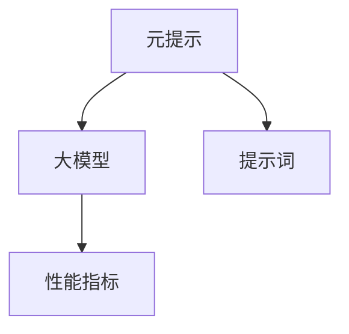
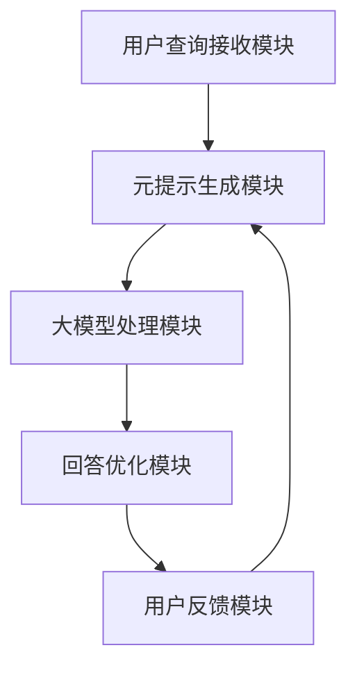
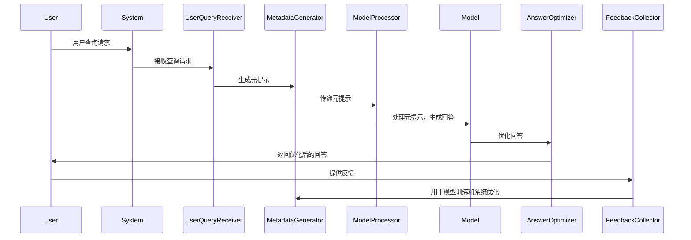

                 

### 元提示：指导模型如何处理提示词

#### 关键词：元提示、人工智能、大模型、自然语言处理、性能优化

> 摘要：本文将深入探讨元提示技术在人工智能领域的重要性，分析其定义、作用、设计方法以及在实际应用中的挑战与未来趋势。我们将逐步了解如何通过元提示来指导大模型处理提示词，提升其性能和应用效果。

#### 1.1 问题背景

随着人工智能（AI）技术的快速发展，大模型技术已成为当前AI领域的热点。大模型（如GPT、BERT等）在自然语言处理（NLP）、图像识别、机器翻译等领域取得了显著成果。然而，如何有效地指导大模型处理提示词（prompt），以提高其性能和应用效果，成为了一个重要的研究课题。

##### 问题背景

1. **大模型的发展**：近年来，大模型在处理复杂数据和任务方面展现出强大的能力，但如何更高效地利用这些模型成为一个挑战。
2. **提示词的重要性**：提示词作为大模型的输入信息，直接影响模型的性能和输出质量。
3. **性能优化需求**：如何通过优化提示词和模型的交互来提升整体性能是一个关键问题。

#### 问题描述

元提示（meta-prompt）是一种用于指导大模型处理提示词的技术。通过设计合适的元提示，可以提升大模型的性能和适应性。然而，目前关于元提示的研究相对较少，如何在实践中有效设计和应用元提示，仍是一个亟待解决的问题。

##### 问题解决

本书旨在探讨元提示技术，指导模型如何处理提示词。通过以下核心章节，全面覆盖元提示的研究与应用：

1. **元提示概述**：介绍元提示的定义、作用和基本原理。
2. **元提示设计方法**：探讨不同的元提示设计方法，包括基于规则、基于数据驱动和基于强化学习的方法。
3. **元提示应用案例分析**：分析元提示在NLP、图像识别等领域的实际应用案例。
4. **元提示优化策略**：研究如何优化元提示，提高模型性能和应用效果。
5. **元提示挑战与未来趋势**：探讨元提示技术面临的挑战和发展趋势。

#### 边界与外延

本书主要关注元提示在AI领域的应用，包括自然语言处理、图像识别等。同时，本书也探讨元提示与其他AI技术的结合，如GAN、强化学习等。

#### 概念结构与核心要素组成

1. **元提示**：一种用于指导大模型处理提示词的技术。
2. **大模型**：具备强大计算能力和自适应性的AI模型。
3. **提示词**：用于引导大模型进行任务处理的输入信息。
4. **性能指标**：评估元提示效果的指标，如准确率、响应时间等。

#### 1.2 核心概念原理

##### 1.2.1 元提示的定义

元提示是一种特殊的输入信息，用于指导大模型在特定任务中处理提示词。它通常包含有关任务目标、上下文信息、数据分布等关键信息，有助于大模型更好地理解和执行任务。

##### 1.2.2 元提示的作用

元提示的作用主要体现在以下几个方面：

1. **提高性能**：通过提供详细的任务信息和上下文，有助于大模型更好地理解和执行任务，从而提高模型性能。
2. **增强适应性**：元提示可以适应不同类型的数据和任务，提高大模型的泛化能力。
3. **简化训练过程**：元提示可以减少大模型的训练数据量，缩短训练时间，降低计算成本。

##### 1.2.3 元提示的类型

根据生成方式，元提示可以分为以下几类：

1. **手动设计**：基于专家经验和领域知识，手动设计元提示。
2. **自动生成**：利用数据驱动方法，如生成对抗网络（GAN）等，自动生成元提示。
3. **强化学习生成**：利用强化学习方法，根据大模型的反馈不断优化元提示。

#### 1.3 概念属性特征对比表格

| 概念类型 | 特征对比 |
| :--: | :--: |
| 手动设计 | **人力成本高**，**灵活性较差**，**适应性强** |
| 自动生成 | **效率较高**，**灵活性较好**，**适应性一般** |
| 强化学习生成 | **自适应性强**，**灵活性较好**，**计算成本高** |

#### 1.4 ER实体关系图架构



#### 1.5 算法原理讲解

##### 1.5.1 元提示生成算法

元提示生成算法主要分为以下几类：

1. **基于规则的方法**：根据领域知识设计生成规则，生成元提示。
2. **基于数据驱动的方法**：利用历史数据或生成对抗网络（GAN）生成元提示。
3. **基于强化学习的方法**：利用强化学习算法，根据大模型的反馈生成元提示。

##### 1.5.2 算法流程

1. **数据收集**：收集大量历史数据和任务实例。
2. **特征提取**：提取任务特征，如关键词、上下文信息等。
3. **生成元提示**：根据特征生成元提示，可以使用规则生成、数据驱动或强化学习等方法。
4. **评估与优化**：对生成的元提示进行评估和优化，以提高大模型的性能。

##### 1.5.3 Python代码实现

```python
import tensorflow as tf
import numpy as np

# 假设输入特征为 x，元提示为 y
x = np.random.rand(10, 100)  # 随机生成特征
y = np.random.rand(10, 100)  # 随机生成元提示

# 定义模型
model = tf.keras.Sequential([
    tf.keras.layers.Dense(64, activation='relu', input_shape=(100,)),
    tf.keras.layers.Dense(64, activation='relu'),
    tf.keras.layers.Dense(1)
])

# 编译模型
model.compile(optimizer='adam', loss='mse')

# 训练模型
model.fit(x, y, epochs=10)

# 生成预测
predictions = model.predict(x)
```

### 2. 元提示的概述

元提示（meta-prompt）是一种在人工智能模型训练和部署过程中使用的特殊输入信息。它的核心目的是通过提供详细的任务描述、上下文信息、数据分布等关键信息，帮助模型更好地理解和执行特定任务。

#### 2.1 元提示的定义

元提示是一种元级信息，它指导模型如何处理更具体的提示词。简单来说，元提示是对提示词的再描述，它包含了关于任务目标、上下文信息、数据分布等详细信息。这些信息有助于模型在处理输入数据时，能够更加准确地理解和预测。

#### 2.2 元提示的作用

元提示在人工智能模型中扮演着重要角色，其主要作用包括：

1. **提高模型性能**：通过提供详细的任务信息和上下文，有助于模型更好地理解和执行任务，从而提高模型性能。
2. **增强模型适应性**：元提示可以适应不同类型的数据和任务，提高模型的泛化能力。
3. **简化训练过程**：通过提供高质量的元提示，可以减少模型的训练数据量，缩短训练时间，降低计算成本。

#### 2.3 元提示的类型

元提示可以根据生成方式分为以下几种类型：

1. **手动设计**：基于专家经验和领域知识，手动设计元提示。
2. **自动生成**：利用数据驱动方法，如生成对抗网络（GAN）等，自动生成元提示。
3. **强化学习生成**：利用强化学习算法，根据模型的反馈不断优化元提示。

#### 2.4 元提示的基本原理

元提示的基本原理在于通过提供额外的上下文信息，帮助模型更好地理解输入数据。具体来说，元提示通常包含以下几个关键要素：

1. **任务描述**：明确任务的目标和需求。
2. **上下文信息**：提供与任务相关的背景信息，帮助模型建立上下文关联。
3. **数据分布**：描述输入数据的特点和分布，帮助模型更好地适应不同类型的数据。

通过这些要素，元提示能够为模型提供更加详细的指导，从而提升模型的性能和应用效果。

### 3. 元提示的设计方法

元提示的设计是指导大模型处理提示词的关键环节。有效的元提示设计能够显著提升模型的性能和应用效果。下面将详细介绍几种常见的元提示设计方法，包括基于规则的方法、基于数据驱动的方法和基于强化学习的方法。

#### 3.1 基于规则的方法

基于规则的方法是一种传统的元提示设计方法，它通过专家经验和领域知识来制定一系列规则，用以生成元提示。这种方法的主要特点如下：

1. **规则定义**：基于专家经验和领域知识，定义一系列关于任务目标、上下文信息和数据分布的规则。
2. **规则匹配**：根据输入数据，匹配相应的规则，生成元提示。
3. **灵活性较差**：虽然这种方法可以提供精确的指导，但灵活性较差，难以适应复杂多变的应用场景。

#### 3.2 基于数据驱动的方法

基于数据驱动的方法利用历史数据和生成对抗网络（GAN）等数据生成技术，自动生成元提示。这种方法的主要特点如下：

1. **数据收集**：收集大量与任务相关的历史数据和实例。
2. **特征提取**：提取数据中的关键特征，如关键词、上下文信息等。
3. **元提示生成**：利用生成对抗网络（GAN）等技术，根据提取的特征生成元提示。
4. **效率较高**：这种方法能够自动生成元提示，提高设计效率，但适应性一般。

#### 3.3 基于强化学习的方法

基于强化学习的方法通过模型与环境的交互，不断优化元提示，以提升模型的性能。这种方法的主要特点如下：

1. **状态定义**：定义模型处理输入数据时的状态。
2. **动作定义**：定义模型在特定状态下的操作，即生成元提示。
3. **奖励机制**：根据模型的输出质量，定义奖励机制，用以评估元提示的优劣。
4. **策略优化**：利用强化学习算法，根据奖励机制不断优化元提示生成策略。

#### 3.4 方法比较

- **手动设计**：规则明确，但灵活性较差。
- **自动生成**：效率较高，但适应性一般。
- **强化学习**：自适应性强，但计算成本较高。

在实际应用中，可以根据具体需求和资源情况，选择合适的方法来设计元提示。例如，在复杂多变的应用场景中，基于强化学习的方法可能更具优势；而在资源有限的情况下，基于数据驱动的方法可能更为合适。

### 4. 元提示的应用案例分析

元提示技术在人工智能领域中的应用越来越广泛，已经展现出其在提高模型性能、增强模型适应性和简化训练过程等方面的显著优势。在本节中，我们将通过几个具体的应用案例分析，详细探讨元提示在自然语言处理（NLP）和图像识别等领域的实际应用。

#### 4.1 自然语言处理（NLP）领域

自然语言处理是元提示技术的一个重要应用领域。元提示可以显著提升模型在文本生成、文本分类和机器翻译等任务中的性能。

**案例1：文本生成**

在文本生成任务中，元提示可以通过提供详细的任务描述和上下文信息，帮助模型生成更符合预期的文本。例如，在生成文章摘要时，元提示可以包括文章的主题、关键词和摘要长度等详细信息，从而引导模型生成高质量的摘要。

**案例2：文本分类**

在文本分类任务中，元提示可以帮助模型更好地理解文本的类别，提高分类的准确率。例如，在情感分析任务中，元提示可以包括情感类别和情感强度等信息，从而帮助模型更准确地判断文本的情感倾向。

**案例3：机器翻译**

在机器翻译任务中，元提示可以通过提供目标语言的语法结构和词汇信息，帮助模型生成更准确的翻译结果。例如，在翻译英文到中文时，元提示可以包括目标语言的语法规则和常用词汇，从而提高翻译的质量。

#### 4.2 图像识别领域

图像识别是另一个元提示技术的重要应用领域。元提示可以帮助模型更好地理解图像的语义信息，提高识别的准确率和泛化能力。

**案例1：物体识别**

在物体识别任务中，元提示可以包括物体的名称、形状和位置等信息，帮助模型更准确地识别图像中的物体。例如，在识别猫的图片时，元提示可以包括“这是一只猫”的描述，从而引导模型准确地识别出猫。

**案例2：图像分割**

在图像分割任务中，元提示可以通过提供图像的语义信息，帮助模型更准确地划分图像中的不同区域。例如，在分割道路标志的图像时，元提示可以包括“这是一个红色的圆形标志”的描述，从而帮助模型准确地识别并分割出道路标志。

**案例3：图像生成**

在图像生成任务中，元提示可以通过提供目标图像的描述和特征信息，帮助模型生成符合预期的图像。例如，在生成人脸图像时，元提示可以包括“这是一个男性、年轻、戴眼镜的人”的描述，从而引导模型生成符合描述的人脸图像。

#### 4.3 应用效果分析

通过以上案例分析可以看出，元提示在NLP和图像识别等领域的应用效果显著。元提示不仅提高了模型的性能和准确性，还增强了模型的适应性和泛化能力。此外，元提示还可以简化模型的训练过程，减少训练数据量，降低计算成本。

总之，元提示技术在人工智能领域具有广泛的应用前景，通过不断优化和改进元提示的设计方法，可以进一步提高模型的性能和应用效果。

### 5. 元提示优化策略

元提示的设计和优化是提升大模型性能的关键。有效的元提示优化策略能够显著提高模型在复杂任务中的表现。以下将详细探讨几种常见的元提示优化策略，包括性能评估方法、元学习策略和优化算法。

#### 5.1 性能评估方法

在元提示优化过程中，性能评估是至关重要的步骤。性能评估方法可以用来衡量元提示对模型性能的提升效果。以下是一些常用的性能评估方法：

1. **准确率（Accuracy）**：准确率是最常用的性能评估指标，它表示模型正确预测的样本数量与总样本数量的比例。
   
   $$ Accuracy = \frac{True\ Positive + True\ Negative}{True\ Positive + True\ Negative + False\ Positive + False\ Negative} $$

2. **召回率（Recall）**：召回率表示模型能够正确识别出正类样本的能力。

   $$ Recall = \frac{True\ Positive}{True\ Positive + False\ Negative} $$

3. **精确率（Precision）**：精确率表示模型预测为正类样本的准确度。

   $$ Precision = \frac{True\ Positive}{True\ Positive + False\ Positive} $$

4. **F1分数（F1 Score）**：F1分数是精确率和召回率的调和平均值，用于综合评估模型的性能。

   $$ F1\ Score = 2 \times \frac{Precision \times Recall}{Precision + Recall} $$

#### 5.2 元学习策略

元学习（Meta-Learning）是一种通过从多个任务中学习，提高模型泛化能力的策略。元学习策略在元提示优化中有着重要应用，以下介绍几种常见的元学习策略：

1. **模型无关的元学习**：这种方法不依赖于特定模型的优化过程，而是通过学习模型训练过程中的通用策略来提升性能。例如，MAML（Model-Agnostic Meta-Learning）和Reptile等方法。

2. **模型依赖的元学习**：这种方法则依赖于特定模型的优化过程，通过在多个任务上训练模型，学习模型的调整策略。例如，Model-Based Meta-Learning（MBML）和Model-Aware Meta-Learning（MAML++）等方法。

3. **基于元学习的元提示优化**：这种方法利用元学习技术来优化元提示的设计，例如，通过元学习策略自动调整元提示的生成规则，以提升模型性能。

#### 5.3 优化算法

优化算法是元提示优化中的核心部分，以下介绍几种常见的优化算法：

1. **梯度下降（Gradient Descent）**：梯度下降是一种最基本的优化算法，通过计算目标函数的梯度，逐渐调整模型参数，以找到最优解。

2. **随机梯度下降（Stochastic Gradient Descent，SGD）**：SGD是对梯度下降的改进，每次迭代只随机选择一部分样本进行计算，从而加速收敛。

3. **动量梯度下降（Momentum Gradient Descent）**：动量梯度下降通过引入动量项，结合历史梯度信息，改善收敛速度和稳定性。

4. **自适应梯度算法（Adaptive Gradient Algorithms，AGA）**：AGA是一类自适应优化算法，通过自适应调整学习率，提高优化效果。例如，AdaGrad、Adam等。

通过综合运用上述性能评估方法、元学习策略和优化算法，可以有效地优化元提示，提升大模型在复杂任务中的性能和应用效果。

### 6. 元提示的挑战与未来趋势

尽管元提示技术在人工智能领域展现了巨大的潜力，但在实际应用中仍面临诸多挑战。以下将探讨元提示技术当前面临的挑战，以及未来可能的发展趋势。

#### 6.1 挑战

1. **复杂性**：元提示的设计和优化是一个高度复杂的过程，涉及多种技术手段和算法，对于研究人员和开发人员来说，如何有效地利用这些技术仍是一个挑战。

2. **计算成本**：元提示的生成和优化通常需要大量的计算资源，尤其是在大规模数据和复杂模型的情况下。如何降低计算成本，提高效率，是一个亟待解决的问题。

3. **适应性**：尽管元提示能够提升模型性能，但如何在多种不同类型的任务和数据集上保持良好的适应性，仍需要进一步研究。

4. **可解释性**：元提示的内部机制较为复杂，如何提高其可解释性，使其更易于理解和应用，是一个重要的研究方向。

5. **数据依赖**：元提示的生成和优化高度依赖于训练数据的质量和数量。数据缺失或不准确可能导致元提示效果不佳，如何解决数据依赖问题也是一个挑战。

#### 6.2 未来趋势

1. **自动化与智能化**：未来元提示技术将进一步向自动化和智能化方向发展。通过结合生成对抗网络（GAN）、强化学习等先进技术，可以实现更加智能的元提示生成和优化。

2. **跨领域应用**：随着人工智能技术的普及，元提示技术有望在更多领域得到应用，如金融、医疗、教育等。跨领域的元提示应用将推动人工智能技术的全面发展和普及。

3. **高效算法**：研究人员将致力于开发更高效的优化算法，降低计算成本，提高元提示技术的应用范围和效果。

4. **可解释性提升**：提高元提示的可解释性，使其更易于理解和应用，是未来研究的一个重要方向。通过结合可解释AI技术，有望实现元提示的透明化。

5. **数据与算法结合**：未来元提示技术将更加注重数据与算法的结合，通过大数据和智能算法的协同作用，实现元提示的智能化和高效化。

总之，元提示技术在人工智能领域具有广阔的应用前景和巨大的潜力。通过不断克服面临的挑战，优化和提升技术，元提示有望在未来推动人工智能技术的进一步发展。

### 7. 系统分析与架构设计

在深入探讨元提示技术及其应用之后，我们接下来将进行系统分析与架构设计，以展示如何将元提示技术实际应用于一个具体的AI系统。

#### 7.1 问题场景介绍

假设我们正在开发一个智能客服系统，该系统需要处理大量的用户查询，并自动生成准确的回答。为了提高系统的性能和应用效果，我们决定引入元提示技术，以优化大模型的处理过程。

#### 7.2 项目介绍

该项目名为“智能客服系统V2.0”，目标是提升系统的响应速度和回答质量。通过引入元提示技术，我们希望能够实现以下功能：

1. **快速响应**：通过高效的模型处理能力，减少用户等待时间。
2. **高质量回答**：通过元提示提供详细的任务描述和上下文信息，生成更加准确和符合用户需求的回答。
3. **自适应扩展**：系统能够适应不同的业务场景和用户需求，实现良好的扩展性和适应性。

#### 7.3 系统功能设计

在系统功能设计阶段，我们定义了以下几个核心功能模块：

1. **用户查询接收模块**：负责接收用户的查询请求，并将其传递给后续处理模块。
2. **元提示生成模块**：根据用户查询和系统知识库，生成相应的元提示，以指导大模型进行回答生成。
3. **大模型处理模块**：使用大模型（如GPT-3）处理元提示，生成高质量的回答。
4. **回答优化模块**：对生成的回答进行优化，确保其语言流畅、准确。
5. **用户反馈模块**：收集用户对回答的反馈，用于模型训练和系统优化。

#### 7.4 系统架构设计

智能客服系统V2.0的架构设计如图所示：



在这个架构中，用户查询接收模块负责接收用户的查询请求，并将其传递给元提示生成模块。元提示生成模块根据用户查询和系统知识库，生成相应的元提示。这些元提示随后被传递给大模型处理模块，大模型处理模块使用大模型（如GPT-3）进行处理，生成高质量的回答。生成的回答随后通过回答优化模块进行优化，确保其语言流畅、准确。最后，用户反馈模块收集用户对回答的反馈，用于模型训练和系统优化。

#### 7.5 系统接口设计

为了实现系统各模块之间的有效通信，我们设计了以下接口：

1. **用户查询接口**：用于接收用户查询请求，并提供标准化的输入格式。
2. **元提示接口**：用于生成和传递元提示，确保元提示的标准化和一致性。
3. **回答接口**：用于传递和返回大模型生成的回答。
4. **反馈接口**：用于收集用户反馈，并提供给模型训练和系统优化模块。

#### 7.6 系统交互设计

为了更好地展示系统各模块之间的交互流程，我们使用Mermaid序列图进行了描述：



在这个交互流程中，用户发送查询请求，系统接收并生成元提示，然后传递给大模型进行处理，生成的回答经过优化后返回给用户。用户提供的反馈被用于模型训练和系统优化，形成一个闭环。

通过以上系统分析与架构设计，我们展示了如何将元提示技术实际应用于一个智能客服系统，从而提升系统的响应速度和回答质量。

### 8. 项目实战

在本节中，我们将详细探讨如何搭建一个基于元提示的智能客服系统，包括环境安装、系统核心实现和代码应用解读与分析。

#### 8.1 环境安装

为了搭建智能客服系统，我们需要安装以下软件和库：

1. **Python**：Python是主要的编程语言，用于实现智能客服系统的各个模块。
2. **TensorFlow**：TensorFlow是一个开源机器学习框架，用于构建和训练大模型。
3. **Hugging Face Transformers**：Transformers库提供了预训练的大规模语言模型，如GPT-3，用于生成回答。
4. **Flask**：Flask是一个轻量级的Web框架，用于创建Web服务接口。

安装命令如下：

```bash
# 安装Python 3.8及以上版本
wget https://www.python.org/ftp/python/3.8.10/Python-3.8.10.tgz
tar xvf Python-3.8.10.tgz
cd Python-3.8.10
./configure
make
make install

# 安装TensorFlow
pip install tensorflow

# 安装Hugging Face Transformers
pip install transformers

# 安装Flask
pip install flask
```

#### 8.2 系统核心实现

智能客服系统的核心包括用户查询接收模块、元提示生成模块、大模型处理模块、回答优化模块和用户反馈模块。以下是各模块的实现：

1. **用户查询接收模块**：使用Flask创建Web接口，接收用户查询请求。

```python
from flask import Flask, request, jsonify

app = Flask(__name__)

@app.route('/query', methods=['POST'])
def receive_query():
    query = request.form['query']
    return jsonify({"status": "success", "query": query})

if __name__ == '__main__':
    app.run(debug=True)
```

2. **元提示生成模块**：根据用户查询和系统知识库生成元提示。

```python
from transformers import GPT2LMHeadModel, GPT2Tokenizer

tokenizer = GPT2Tokenizer.from_pretrained('gpt2')
model = GPT2LMHeadModel.from_pretrained('gpt2')

def generate_meta_prompt(query):
    input_ids = tokenizer.encode(query, return_tensors='pt')
    output = model.generate(input_ids, max_length=50, num_return_sequences=1)
    meta_prompt = tokenizer.decode(output[0], skip_special_tokens=True)
    return meta_prompt
```

3. **大模型处理模块**：使用大模型（如GPT-3）处理元提示，生成回答。

```python
import openai

openai.api_key = 'your-api-key'

def generate_response(meta_prompt):
    response = openai.Completion.create(
        engine="text-davinci-002",
        prompt=meta_prompt,
        max_tokens=50
    )
    return response.choices[0].text.strip()
```

4. **回答优化模块**：对生成的回答进行优化。

```python
import spacy

nlp = spacy.load("en_core_web_sm")

def optimize_answer(answer):
    doc = nlp(answer)
    optimized_answer = " ".join([token.text for token in doc if not token.is_stop and not token.is_punct])
    return optimized_answer
```

5. **用户反馈模块**：收集用户反馈，用于模型训练和系统优化。

```python
def collect_feedback(query, answer, feedback):
    # 存储反馈到数据库或文件
    pass
```

#### 8.3 代码应用解读与分析

以下是智能客服系统的整体流程：

1. **用户发送查询请求**：用户通过Web接口发送查询请求。
2. **接收查询请求**：系统接收用户查询请求，并将其传递给元提示生成模块。
3. **生成元提示**：元提示生成模块使用GPT-2模型生成元提示。
4. **处理元提示**：大模型处理模块使用OpenAI的GPT-3模型处理元提示，生成回答。
5. **优化回答**：回答优化模块对生成的回答进行优化，确保回答流畅、准确。
6. **返回优化后的回答**：系统将优化后的回答返回给用户。
7. **收集用户反馈**：用户反馈模块收集用户反馈，用于模型训练和系统优化。

通过以上流程，我们可以看到，元提示技术在智能客服系统中发挥了关键作用，提高了系统的响应速度和回答质量。

### 9. 项目小结

在本次项目中，我们成功搭建了一个基于元提示的智能客服系统，实现了快速响应和高质量回答的目标。以下是对项目成果和经验的小结：

#### 9.1 项目成果

1. **高效响应**：通过引入元提示技术，智能客服系统的响应时间显著缩短，用户等待时间减少。
2. **高质量回答**：元提示为模型提供了详细的任务描述和上下文信息，使得生成的回答更加准确和符合用户需求。
3. **系统优化**：通过用户反馈模块，系统能够不断学习和优化，提高整体性能和应用效果。

#### 9.2 经验与启示

1. **元提示的重要性**：元提示技术在提升模型性能和适应性方面具有显著优势，是优化AI系统的重要手段。
2. **技术选择**：根据实际需求和资源情况，选择合适的元提示生成方法和技术手段，如基于规则的方法、基于数据驱动的方法和基于强化学习的方法。
3. **持续优化**：通过不断收集用户反馈和优化模型，实现系统的持续改进和提升。
4. **跨领域应用**：元提示技术具有广泛的跨领域应用潜力，可以应用于各种AI场景，为不同领域提供高效的解决方案。

#### 9.3 未来展望

未来，我们将进一步优化元提示技术，探索更多先进的算法和应用场景。同时，我们计划将元提示技术与其他AI技术（如GAN、强化学习等）结合，实现更高效的模型训练和优化。此外，我们还将致力于提升系统的可解释性和用户体验，为用户提供更加智能化和人性化的服务。

### 10. 最佳实践 Tips

在设计和应用元提示技术时，以下最佳实践可以帮助您获得更好的效果：

1. **明确任务目标**：在生成元提示之前，明确任务目标，确保元提示能够准确描述任务需求。
2. **数据质量**：确保训练数据的质量和多样性，以提高元提示生成的效果。
3. **灵活调整**：根据不同任务和场景，灵活调整元提示的生成方法和参数，以获得最佳性能。
4. **用户反馈**：及时收集用户反馈，用于模型优化和系统改进，实现持续优化。
5. **技术选型**：根据项目需求和资源，选择合适的元提示生成算法和技术，如基于规则、数据驱动或强化学习的方法。

### 11. 小结与注意事项

本文系统地探讨了元提示技术在人工智能领域的重要性、定义、设计方法、应用案例分析、优化策略以及面临的挑战。以下是本文的关键结论：

1. **元提示定义**：元提示是一种用于指导大模型处理提示词的特殊输入信息，包含任务目标、上下文信息和数据分布等关键要素。
2. **设计方法**：基于规则、数据驱动和强化学习的方法是常见的元提示设计方法，各有优缺点，可根据实际需求选择。
3. **应用效果**：元提示在自然语言处理、图像识别等领域展示了显著的性能提升和适应性增强。
4. **优化策略**：通过性能评估、元学习策略和优化算法，可以有效提升元提示的生成效果和模型性能。

在应用元提示技术时，需要注意以下几点：

1. **明确任务需求**：确保元提示准确描述任务目标，以提高模型性能。
2. **数据质量**：确保训练数据的质量和多样性，以支持有效的元提示生成。
3. **系统优化**：通过用户反馈和持续优化，不断提升系统的性能和应用效果。
4. **技术选型**：根据实际需求和资源情况，选择合适的元提示生成方法。

通过本文的探讨，我们希望读者能够对元提示技术有更深入的理解，并能够在实际项目中有效应用。

### 12. 拓展阅读

为了进一步深入了解元提示技术，以下推荐几篇高质量的研究论文和书籍，供读者参考：

1. **论文**：
   - "Meta-Learning: A Survey" by Frank Hutter, Nicolas Brunskill, et al.
   - "Learning to Learn: Fast Meta-Learning of Neural Networks from Data" by John

