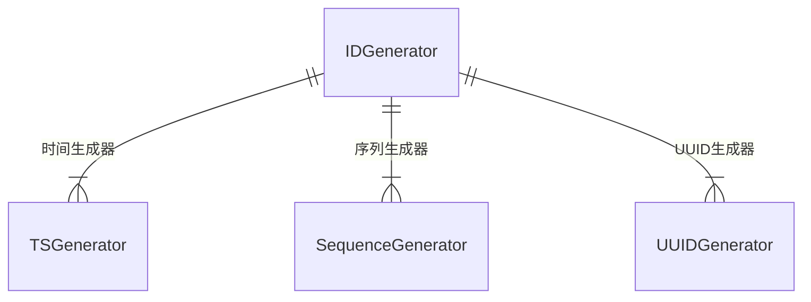
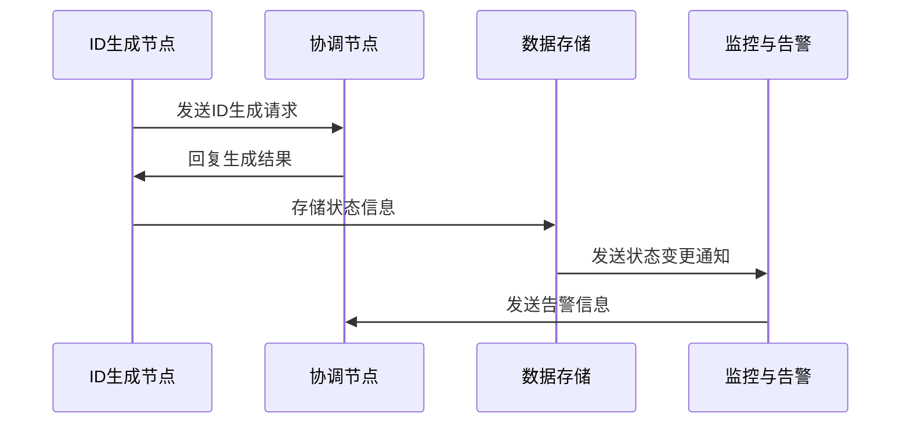
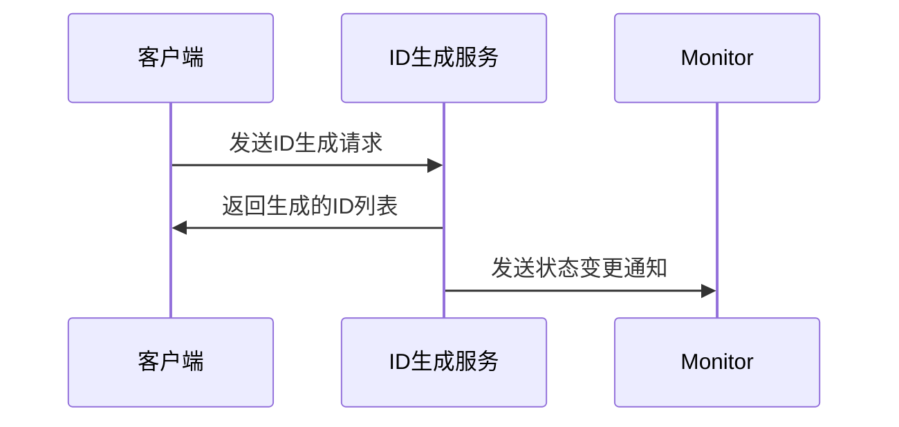
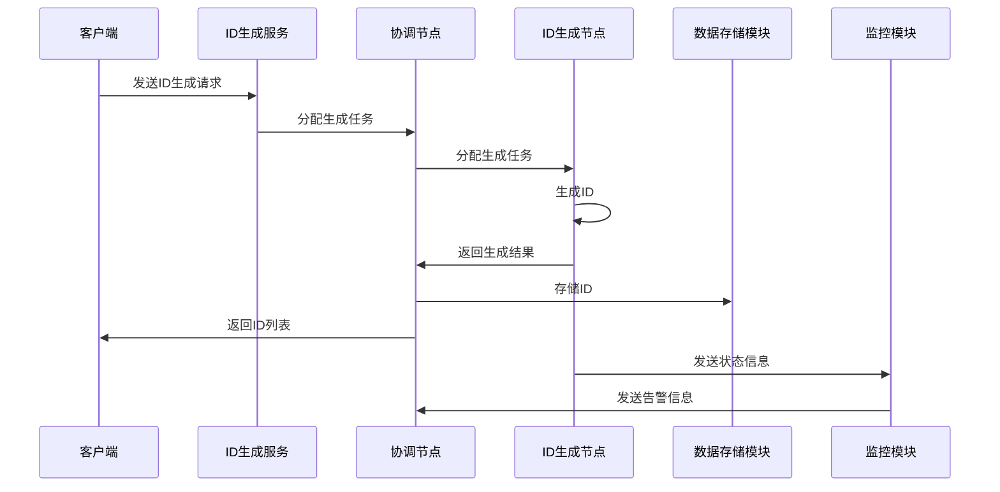

                 

### 分布式ID生成器在大规模LLM应用中的实现

#### 背景介绍

分布式ID生成器，作为一种用于生成全局唯一标识的组件，广泛应用于分布式系统中。它解决了单点生成ID时可能出现的性能瓶颈和单点故障问题。随着自然语言处理（NLP）技术的发展，大规模语言模型（LLM）如BERT、GPT等逐渐成为各个行业的重要工具，例如智能客服、文本生成、机器翻译等。然而，大规模LLM应用对ID生成器提出了更高的要求，需要ID生成器具备高并发处理能力、强一致性保障以及高可用性。

本文将围绕分布式ID生成器在大规模LLM应用中的实现展开讨论。首先，我们将介绍分布式ID生成器的基本概念、原理及其在LLM中的应用挑战；然后，我们将深入分析分布式ID生成器的核心概念与设计，对比中心化ID生成器和分布式ID生成器的属性特征；接着，我们将介绍大规模LLM的基本概念、原理和应用领域；最后，我们将探讨分布式ID生成器在LLM中的应用策略、实现案例以及最佳实践。

#### 分布式ID生成器与大规模LLM应用概述

##### 问题背景

随着互联网的快速发展，数据量和用户量呈现爆炸性增长，传统的集中式系统已经无法满足大规模分布式系统的需求。分布式系统以其高可用性、高性能和可扩展性成为了现代应用架构的首选。然而，在分布式系统中，唯一标识符（ID）的生成成为一个关键问题。

自然语言处理（NLP）是人工智能的一个重要分支，旨在让计算机理解和生成自然语言。随着深度学习技术的进步，大规模语言模型（LLM）如BERT、GPT等逐渐成为NLP领域的明星。这些模型具有处理大规模文本数据的能力，但同时也带来了对ID生成器的更高要求。

分布式ID生成器在大规模LLM应用中面临的挑战主要包括：

1. **高并发处理能力**：大规模LLM应用通常会同时处理大量请求，对ID生成器的处理能力提出了极高要求。
2. **数据一致性**：分布式系统中的多个节点需要生成全局唯一的ID，如何保证数据一致性成为一个重要问题。
3. **高可用性**：ID生成器作为系统核心组件，必须保证高可用性，防止单点故障导致系统瘫痪。

##### 问题描述

分布式ID生成器的基本概念是一个全局唯一的ID生成机制，能够在分布式系统中为每个节点生成唯一的标识符。而大规模语言模型（LLM）则是一种基于深度学习的模型，能够对大规模文本数据进行训练，并生成高质量的文本输出。

在分布式ID生成器与大规模LLM应用中，问题主要体现在以下几个方面：

1. **ID生成效率**：大规模LLM应用对ID生成器的效率要求很高，需要快速生成大量唯一的ID。
2. **数据一致性**：在分布式环境中，多个节点需要协同工作，确保生成的ID全局唯一，且数据一致。
3. **系统扩展性**：随着应用规模的扩大，ID生成器需要具备良好的扩展性，能够无缝集成到分布式系统中。

分布式ID生成器在LLM中的应用问题解决思路主要包括：

1. **分布式算法**：采用分布式算法，如雪花算法、Redis等，确保ID生成的高效性和全局唯一性。
2. **一致性保障**：通过分布式一致性协议，如Paxos、Raft等，确保多个节点之间数据的一致性。
3. **高可用性设计**：采用主从备份、集群部署等策略，提高ID生成器系统的可用性。

##### 边界与外延

分布式ID生成器的边界条件主要包括：

1. **并发量**：ID生成器需要能够处理高并发请求，通常需要达到每秒数百万次。
2. **数据一致性**：需要确保生成ID的全局唯一性，防止重复。
3. **扩展性**：ID生成器需要能够水平扩展，适应不断增长的数据量和并发量。

大规模LLM的外延领域包括：

1. **数据处理**：大规模LLM应用需要对大规模文本数据进行处理，包括数据清洗、格式化等。
2. **模型训练**：大规模LLM的训练需要大量计算资源和时间，通常采用分布式训练策略。
3. **模型部署**：大规模LLM的部署需要考虑系统的性能、可扩展性和高可用性。

关联概念的深入探讨包括：

1. **分布式系统**：分布式ID生成器是分布式系统中的一个重要组件，需要理解分布式系统的基本原理和架构。
2. **一致性协议**：分布式一致性协议如Paxos、Raft等是保证分布式系统数据一致性的关键。
3. **性能优化**：性能优化是分布式ID生成器设计中的一个重要方面，包括算法优化、系统调优等。

##### 概念结构与核心要素

分布式ID生成器的架构包括以下几个核心组件：

1. **ID分配器**：负责生成全局唯一的ID，通常采用分布式算法如雪花算法。
2. **数据一致性模块**：通过分布式一致性协议如Paxos、Raft等，确保多个节点之间的数据一致性。
3. **扩展性模块**：负责系统的水平扩展，包括节点加入、退出等操作。

大规模LLM的核心要素包括：

1. **预训练模型**：大规模LLM的基础，通常采用BERT、GPT等预训练模型。
2. **数据处理模块**：负责大规模文本数据的处理，包括数据清洗、格式化等。
3. **模型训练模块**：负责大规模LLM的训练，通常采用分布式训练策略。

两者结合的技术路线图如下：

1. **分布式ID生成器集成**：将分布式ID生成器集成到大规模LLM系统中，确保生成全局唯一的ID。
2. **一致性保障**：通过分布式一致性协议，确保分布式ID生成器与大规模LLM之间的数据一致性。
3. **性能优化**：针对分布式ID生成器和大规模LLM进行性能优化，提高系统整体性能。

通过以上设计，分布式ID生成器在大规模LLM应用中可以实现高效、可靠、可扩展的ID生成功能，为大规模NLP应用提供有力支持。接下来，我们将详细探讨分布式ID生成器的原理与设计。### 分布式ID生成器原理与设计

分布式ID生成器是一种在分布式系统中生成唯一标识符的技术，它解决了在分布式环境中如何生成全局唯一ID的问题。在大规模LLM应用中，分布式ID生成器尤为重要，因为LLM系统通常需要处理大量的并发请求，并保证生成的ID具有强一致性。以下我们将详细介绍分布式ID生成器的基本概念、原理及其设计思路。

#### 核心概念与原理

分布式ID生成器的基本原理是利用分布式算法来生成全局唯一的ID。这些算法通常基于时间戳、机器ID、工作进程ID等元素，通过一定的组合规则生成唯一的ID。以下是一些常见的分布式ID生成算法：

1. **雪花算法**（Snowflake）
雪花算法是一种流行的分布式ID生成算法，由Twitter公司开发。它将ID分为两部分：一部分是时间戳，另一部分是机器ID和工作进程ID的组合。雪花算法的基本原理如下：

   

   - **时间戳**：占用41位，表示毫秒级时间戳。
   - **机器ID**：占用5位，表示数据中心ID。
   - **工作进程ID**：占用5位，表示工作进程ID。
   - **序列号**：占用12位，表示同一毫秒内产生的序列号。

   雪花算法通过以上几个元素的组合生成唯一的ID，具有简单、高效的特点。

2. **UUID生成器**
UUID（Universally Unique Identifier）是一种全局唯一标识符，通常由128位二进制数组成。UUID生成器通过算法生成UUID，确保其全局唯一性。常见的UUID生成算法包括：

   - **随机UUID**：通过随机数生成器生成。
   - **时间戳UUID**：结合时间戳和随机数生成。

3. **数据库序列**
在某些情况下，可以使用数据库序列（如MySQL的自增主键）来生成ID。这种方法依赖于数据库的原子操作，确保生成的ID全局唯一。

#### 概念属性特征对比

| 特征对比项 | 中心化ID生成器 | 分布式ID生成器 |
| :--------: | :------------: | :------------: |
| **数据一致性** | 较高 | 较低 |
| **扩展性** | 有限 | 强 |
| **性能** | 一般 | 高 |

中心化ID生成器在数据一致性方面具有优势，但扩展性和性能有限。分布式ID生成器虽然在数据一致性方面存在挑战，但具有更好的扩展性和性能，适用于大规模分布式系统。

#### ER实体关系图架构

分布式ID生成器的架构可以通过ER（Entity-Relationship）实体关系图来表示。以下是一个简单的ER图：



- **IDGenerator**：代表ID生成器的核心实体，负责生成ID。
- **TSGenerator**：代表时间生成器，用于生成基于时间戳的ID。
- **SequenceGenerator**：代表序列生成器，用于生成基于序列号的ID。
- **UUIDGenerator**：代表UUID生成器，用于生成基于UUID的ID。

通过这种架构，分布式ID生成器可以实现多种ID生成策略，满足不同场景的需求。### 大规模自然语言处理模型

大规模自然语言处理（Large-scale Language Modeling，简称LLM）是自然语言处理（Natural Language Processing，简称NLP）的一个重要分支，它通过深度学习技术处理大规模文本数据，从而实现文本生成、文本分类、机器翻译等多种NLP任务。LLM的快速发展，得益于近年来深度学习和计算资源的迅速增长，使得处理大规模数据集和训练复杂模型变得可行。

#### 基本概念

1. **自然语言处理（NLP）**：
   自然语言处理是指使计算机能够理解、生成和处理人类语言的技术。它包括语音识别、文本分析、机器翻译、情感分析等多个子领域。

2. **大规模语言模型（LLM）**：
   大规模语言模型是一种能够理解和生成自然语言的深度学习模型。它通常由数亿甚至数十亿的参数组成，能够对大规模文本数据进行训练，从而捕捉语言的结构和规律。

3. **预训练语言模型**：
   预训练语言模型是指在特定任务之前对模型进行大规模文本数据的预训练，以便模型能够理解和生成自然语言。预训练后的模型可以在各种下游任务上进行微调，提高任务性能。

#### 模型原理

大规模语言模型的原理基于深度神经网络，特别是基于变分自编码器（VAE）和生成对抗网络（GAN）的技术。以下是一个基本的LLM模型原理：

1. **输入表示**：
   模型首先将输入的文本转换为向量表示。通常使用词嵌入（Word Embedding）技术，如Word2Vec、GloVe等，将单词转换为密集的向量。

2. **编码器**：
   编码器（Encoder）是一个神经网络，它接收输入的文本向量，并编码成一个固定长度的隐藏状态。这个隐藏状态包含了文本的语义信息。

3. **解码器**：
   解码器（Decoder）也是一个神经网络，它将编码器的隐藏状态解码成文本输出。在生成文本时，解码器逐个预测每个单词的概率，并生成完整的句子。

4. **损失函数**：
   模型通过优化损失函数来训练。常见的损失函数包括交叉熵损失（Cross-Entropy Loss）和对比损失（Contrastive Loss）等。

#### 常见的LLM模型

1. **BERT（Bidirectional Encoder Representations from Transformers）**：
   BERT是由Google开发的一种双向Transformer模型，它通过对大规模文本数据进行双向编码，捕捉了文本的上下文信息，并在各种NLP任务上取得了显著性能提升。

2. **GPT（Generative Pre-trained Transformer）**：
   GPT是由OpenAI开发的一种生成型预训练Transformer模型，它通过对文本数据进行自回归预测，能够生成连贯、自然的文本。

3. **RoBERTa（A Robustly Optimized BERT Pretraining Approach）**：
   RoBERTa是在BERT基础上进行改进的一种模型，它通过采用不同的数据预处理和模型训练策略，提高了模型的性能和鲁棒性。

#### LLM的工作流程

大规模语言模型的工作流程主要包括以下几个步骤：

1. **数据预处理**：
   对大规模文本数据进行清洗、分词、去停用词等预处理操作，将其转换为模型可接受的格式。

2. **模型训练**：
   使用预处理后的文本数据对模型进行训练。训练过程中，模型通过不断优化损失函数来学习文本的语义表示。

3. **模型评估**：
   在训练完成后，使用验证集或测试集对模型进行评估，以确保模型在未见过的数据上能够取得良好的性能。

4. **模型部署**：
   将训练好的模型部署到生产环境中，用于实际的应用任务，如文本生成、文本分类等。

#### LLM的训练与优化

1. **训练策略**：
   - **多GPU训练**：使用多个GPU并行训练模型，加快训练速度。
   - **分布式训练**：使用分布式训练策略，将训练数据分布在多个节点上，提高训练效率。

2. **优化方法**：
   - **权重共享**：通过共享同一层中的权重，减少模型参数数量，加快训练速度。
   - **梯度裁剪**：为了避免梯度爆炸或消失，对梯度进行裁剪，限制其大小。

3. **模型压缩**：
   - **权重剪枝**：通过去除不重要的权重，减少模型参数数量。
   - **量化**：将模型参数从浮点数转换为低比特宽度的整数，减少模型大小。

#### 应用领域

大规模语言模型在多个领域得到了广泛应用，以下是一些典型的应用场景：

1. **文本生成**：
   - 生成文章摘要、生成新闻、生成对话等。
   - 例如，OpenAI的GPT-3能够生成高质量的文本，广泛应用于聊天机器人、内容生成等领域。

2. **文本分类**：
   - 对文本进行分类，如情感分析、垃圾邮件检测等。
   - 例如，BERT在情感分析任务上取得了优异的性能。

3. **机器翻译**：
   - 将一种语言的文本翻译成另一种语言。
   - 例如，Google翻译使用Transformer模型实现了高质量的机器翻译。

4. **问答系统**：
   - 回答用户提出的问题，提供信息查询服务。
   - 例如，Microsoft的BERT-based Q&A系统，能够回答用户关于各种主题的问题。

大规模语言模型的发展为自然语言处理带来了巨大的变革，使得计算机能够更加自然地理解和生成人类语言。随着技术的不断进步，LLM将在更多的领域发挥重要作用，推动人工智能的发展。### 分布式ID生成器在LLM中的应用

在大规模语言模型（LLM）应用中，分布式ID生成器的作用至关重要。由于LLM通常需要处理大规模数据和高并发请求，传统的中心化ID生成器难以满足这些需求，因此分布式ID生成器成为了一种理想的选择。以下将从需求分析、实现策略和实现案例三个方面详细探讨分布式ID生成器在LLM中的应用。

#### 需求分析

大规模语言模型（LLM）应用对ID生成器的需求主要表现在以下几个方面：

1. **高并发处理能力**：
   LLM系统通常需要处理大量并发请求，例如实时问答系统、聊天机器人等。分布式ID生成器能够通过多节点协同工作，提高系统的并发处理能力，确保系统稳定运行。

2. **数据一致性**：
   在分布式环境中，多个节点需要生成全局唯一的ID，以确保数据的一致性和完整性。分布式ID生成器通过一致性算法和协议，如Paxos、Raft等，实现数据一致性保障。

3. **高可用性**：
   LLM应用对系统的可用性要求极高。分布式ID生成器通过主从备份、故障转移等机制，提高系统的可用性，确保在节点故障时能够快速恢复。

4. **可扩展性**：
   随着LLM应用规模的扩大，系统需要具备良好的扩展性。分布式ID生成器能够通过水平扩展，无缝适应不断增长的数据量和并发量。

#### 实现策略

分布式ID生成器在LLM中的应用策略主要包括以下几个方面：

1. **分布式算法选择**：
   选择合适的分布式ID生成算法，如雪花算法（Snowflake）、UUID生成器等，确保ID生成的高效性和全局唯一性。

2. **一致性保障**：
   通过分布式一致性协议，如Paxos、Raft等，实现多个节点之间的数据一致性。一致性保障是分布式ID生成器在LLM应用中的一个关键点。

3. **高性能设计**：
   对分布式ID生成器进行性能优化，例如使用缓存机制、批量生成等，提高系统的响应速度和处理能力。

4. **高可用性设计**：
   采用主从备份、集群部署等策略，提高分布式ID生成器的可用性。在节点故障时，系统能够快速切换到备用节点，确保服务的持续可用。

5. **可扩展性设计**：
   设计可水平扩展的架构，确保系统在数据量和并发量增加时，能够无缝扩展。例如，通过增加节点数量、使用分布式数据库等方式，实现系统的扩展。

#### 实现案例

以下将介绍两个典型的分布式ID生成器实现案例，分别基于雪花算法和Redis。

##### 案例一：基于雪花算法的分布式ID生成器

雪花算法是一种流行的分布式ID生成算法，它将ID分为时间戳、机器ID和序列号三个部分，保证了ID的全局唯一性。以下是一个基于雪花算法的分布式ID生成器实现案例：

1. **环境准备**：
   - Java环境：使用Java编写雪花算法实现。
   - Spring Boot：使用Spring Boot搭建服务框架。

2. **实现步骤**：
   - **生成ID**：通过雪花算法生成全局唯一的ID。
   - **分布式部署**：将ID生成器部署到多个节点上，确保高并发处理能力和数据一致性。

3. **代码示例**：

```java
import java.util.concurrent.TimeUnit;

public class SnowflakeIdGenerator {

    private final long twepoch = 1288834974657L;

    private final long workerIdBits = 5L;
    private final long datacenterIdBits = 5L;
    private final long maxWorkerId = -1L ^ (-1L << workerIdBits);
    private final long maxDatacenterId = -1L ^ (-1L << datacenterIdBits);
    private final long workerIdShift = 0;
    private final long datacenterIdShift = workerIdShift + workerIdBits;
    private final long timestampLeftShift = datacenterIdShift + datacenterIdBits;
    private final long sequenceShift = timestampLeftShift;
    private final long sequenceMask = -1L ^ (-1L << sequenceShift);

    private long workerId;
    private long datacenterId;
    private long sequence = 0L;
    private long lastTimestamp = -1L;

    public SnowflakeIdGenerator(long workerId, long datacenterId) {
        if (workerId > maxWorkerId || workerId < 0) {
            throw new IllegalArgumentException(String.format("Worker ID can't be greater than %d or less than 0", maxWorkerId));
        }
        if (datacenterId > maxDatacenterId || datacenterId < 0) {
            throw new IllegalArgumentException(String.format("Datacenter ID can't be greater than %d or less than 0", maxDatacenterId));
        }
        this.workerId = workerId;
        this.datacenterId = datacenterId;
    }

    public synchronized long nextId() {
        long timestamp = timeGen();

        if (timestamp < lastTimestamp) {
            throw new RuntimeException(String.format("Clock moved backwards. Refusing to generate id for %d milliseconds", lastTimestamp - timestamp));
        }

        if (lastTimestamp == timestamp) {
            sequence = (sequence + 1) & sequenceMask;
            if (sequence == 0) {
                timestamp = tilNextMillis(lastTimestamp);
            }
        } else {
            sequence = 0L;
        }

        lastTimestamp = timestamp;

        return ((timestamp - twepoch) << timestampLeftShift) |
               (datacenterId << datacenterIdShift) |
               (workerId << workerIdShift) |
               sequence;
    }

    private long tilNextMillis(long lastTimestamp) {
        long timestamp = timeGen();
        while (timestamp <= lastTimestamp) {
            timestamp = timeGen();
        }
        return timestamp;
    }

    private long timeGen() {
        return System.currentTimeMillis();
    }

    public static void main(String[] args) {
        SnowflakeIdGenerator idGen = new SnowflakeIdGenerator(1, 1);
        for (int i = 0; i < 10; i++) {
            long id = idGen.nextId();
            System.out.println(id);
            try {
                TimeUnit.SECONDS.sleep(1);
            } catch (InterruptedException e) {
                e.printStackTrace();
            }
        }
    }
}
```

##### 案例二：基于Redis的分布式ID生成器

Redis是一种高性能的分布式内存数据库，常用于分布式系统中的缓存和消息队列。以下是一个基于Redis的分布式ID生成器实现案例：

1. **环境准备**：
   - Redis环境：安装并配置Redis服务器。
   - Spring Data Redis：使用Spring Data Redis操作Redis数据库。

2. **实现步骤**：
   - **初始化Redis**：在Redis中初始化一个计数器，用于生成全局唯一的ID。
   - **生成ID**：每次生成ID时，从Redis中获取计数器的值，并将计数器加1。

3. **代码示例**：

```java
import org.springframework.data.redis.core.RedisTemplate;
import org.springframework.data.redis.serializer.JdkSerializationRedisSerializer;

public class RedisIdGenerator {

    private RedisTemplate<String, Object> redisTemplate;

    public RedisIdGenerator(RedisTemplate<String, Object> redisTemplate) {
        this.redisTemplate = redisTemplate;
        redisTemplate.setKeySerializer(new JdkSerializationRedisSerializer());
        redisTemplate.setValueSerializer(new JdkSerializationRedisSerializer());
    }

    public synchronized long nextId() {
        return redisTemplate.opsForValue().increment("id_counter", 1L);
    }

    public static void main(String[] args) {
        RedisTemplate<String, Object> redisTemplate = new RedisTemplate<>();
        redisTemplate.setConnectionFactory(new JedisConnectionFactory());
        RedisIdGenerator idGen = new RedisIdGenerator(redisTemplate);
        for (int i = 0; i < 10; i++) {
            long id = idGen.nextId();
            System.out.println(id);
            try {
                TimeUnit.SECONDS.sleep(1);
            } catch (InterruptedException e) {
                e.printStackTrace();
            }
        }
    }
}
```

以上两个案例分别展示了基于雪花算法和Redis的分布式ID生成器实现。雪花算法通过结合时间戳、机器ID和序列号生成ID，具有简单、高效的特点；而Redis通过计数器实现ID生成，具有分布式、可扩展的特点。在实际应用中，可以根据具体需求选择合适的ID生成策略。### 系统设计与实现

分布式ID生成器在大规模LLM应用中的实现涉及多个层面的设计和优化，包括系统架构设计、功能设计、接口设计和系统交互等方面。以下我们将详细介绍这些方面的具体实现。

#### 系统架构设计

系统架构设计是分布式ID生成器实现的基础，决定了系统的性能、可扩展性和可靠性。以下是一个典型的分布式ID生成器系统架构：

1. **ID生成节点**：系统由多个ID生成节点组成，每个节点负责生成一部分ID。节点数量可根据需求动态调整，确保系统的高并发处理能力。

2. **协调节点**：协调节点负责协调各个ID生成节点的操作，确保数据一致性。协调节点通常采用分布式一致性协议如Paxos或Raft实现。

3. **数据存储**：系统采用分布式数据存储，如Redis或MongoDB等，用于存储ID生成节点的状态信息和生成的ID。

4. **监控与告警**：系统集成了监控和告警模块，实时监控ID生成节点的状态，确保系统的高可用性。

系统架构图如下：



#### 系统功能设计

系统功能设计包括以下几个核心模块：

1. **ID生成模块**：负责生成全局唯一的ID。ID生成模块采用雪花算法、UUID生成器等策略，确保ID生成的高效性和唯一性。

2. **一致性模块**：通过分布式一致性协议，如Paxos、Raft等，实现多个ID生成节点之间的数据一致性。一致性模块负责协调节点和ID生成节点的状态同步。

3. **数据存储模块**：负责存储ID生成节点的状态信息和生成的ID。数据存储模块采用分布式数据库，如Redis、MongoDB等，确保数据的持久化和可靠性。

4. **监控与告警模块**：实时监控ID生成节点的状态，包括并发处理能力、数据一致性等。当系统出现异常时，监控模块会及时发送告警信息，确保系统的高可用性。

#### 系统接口设计

系统接口设计是系统与其他模块或服务交互的桥梁。以下是一个典型的分布式ID生成器接口设计：

1. **生成ID接口**：提供生成全局唯一ID的接口，支持批量生成和单个生成。接口返回生成的ID列表。

2. **状态查询接口**：提供查询ID生成节点状态的接口，包括并发处理能力、数据一致性等。

3. **告警接口**：提供接收系统告警信息的接口，确保实时监控和告警功能。

接口设计如下：



#### 系统交互设计

系统交互设计描述了ID生成节点、协调节点、数据存储模块和监控模块之间的交互流程。以下是一个典型的系统交互设计：

1. **ID生成流程**：
   - 客户端发送ID生成请求到ID生成服务。
   - ID生成服务协调节点分配生成任务给ID生成节点。
   - ID生成节点生成ID，并将结果返回给协调节点。
   - 协调节点将ID存储到数据存储模块，并返回ID列表给客户端。

2. **状态同步流程**：
   - ID生成节点定期向协调节点发送状态信息。
   - 协调节点将状态信息存储到数据存储模块，并更新ID生成节点的状态。

3. **告警通知流程**：
   - 监控模块检测到系统异常，发送告警信息到告警接口。
   - 告警接口将告警信息发送给协调节点，协调节点通知相关人员进行处理。

系统交互图如下：



通过以上系统设计与实现，分布式ID生成器在大规模LLM应用中可以实现高效、可靠、可扩展的ID生成功能，为大规模NLP应用提供有力支持。接下来，我们将介绍分布式ID生成器在大规模LLM应用中的性能优化策略。### 性能优化

在分布式ID生成器的大规模LLM应用中，性能优化是确保系统高效运行的关键。以下将从缓存策略、批量生成、负载均衡等角度详细探讨分布式ID生成器的性能优化方法。

#### 缓存策略

1. **缓存ID生成结果**：
   分布式ID生成器在生成ID后，可以将其缓存起来，减少后续生成ID的次数。通过使用本地缓存或分布式缓存（如Redis、Memcached），可以显著提高ID生成的响应速度。

2. **缓存一致性**：
   缓存与数据存储模块（如Redis）之间需要保持一致性。可以通过缓存失效策略（如过期时间）和一致性协议（如最终一致性、强一致性）来实现。

3. **缓存命中优化**：
   通过分析ID生成请求的访问模式，预加载热门ID到缓存中，提高缓存命中率。

#### 批量生成

1. **批量生成ID**：
   在需要生成大量ID的场景下，可以采用批量生成策略。一次性生成一批ID，减少单次请求的处理时间。

2. **预分配ID**：
   预先分配一批ID到缓存或队列中，当需要生成ID时，直接从预分配的ID中获取，减少生成ID的操作次数。

3. **异步生成**：
   将ID生成操作异步化，例如使用消息队列（如RabbitMQ、Kafka）将生成任务分发到多个节点，提高系统并发处理能力。

#### 负载均衡

1. **节点负载均衡**：
   通过负载均衡器（如Nginx、HAProxy）将请求分发到多个ID生成节点，实现负载均衡，避免单点压力。

2. **区域负载均衡**：
   跨区域部署ID生成节点，根据用户地理位置将请求路由到最近的节点，降低网络延迟。

3. **服务间负载均衡**：
   在服务间通信时，通过负载均衡策略（如轮询、随机、最少连接等）分配请求，确保服务的高可用性。

#### 性能监控与调优

1. **性能监控**：
   实时监控ID生成节点的CPU、内存、网络等资源使用情况，发现性能瓶颈。

2. **日志分析**：
   分析系统日志，找出性能瓶颈和潜在问题，进行针对性的优化。

3. **压力测试**：
   定期进行压力测试，模拟高并发场景，评估系统性能和稳定性，优化系统配置和架构。

通过以上性能优化策略，分布式ID生成器可以在大规模LLM应用中实现高效、可靠的ID生成功能，提高系统的整体性能和用户体验。### 实战案例

在本节中，我们将通过一个具体的分布式ID生成器项目实战，详细介绍系统的搭建、核心实现和代码解读，并通过一个实际案例进行深入剖析，最后总结项目经验和教训。

#### 项目搭建

**项目名称**：分布式ID生成器项目（Distributed ID Generator，简称DIG）

**技术栈**：
- 语言：Java
- 框架：Spring Boot
- 数据库：Redis
- 缓存：Redis
- 一致性协议：Paxos

**环境准备**：

1. 安装Java环境（JDK 1.8+）
2. 安装Redis服务器
3. 创建Spring Boot项目

#### 系统核心实现

**1. 搭建ID生成服务**

首先，我们需要搭建一个基于Spring Boot的ID生成服务，实现分布式ID的生成。

```java
@SpringBootApplication
public class IdGeneratorApplication {

    public static void main(String[] args) {
        SpringApplication.run(IdGeneratorApplication.class, args);
    }

}
```

**2. ID生成器实现**

ID生成器主要包含以下几个组件：

- **雪花算法（Snowflake）**：生成全局唯一的ID。
- **Redis缓存**：缓存ID生成结果，提高性能。
- **Paxos一致性协议**：保证多个节点数据一致性。

以下是一个简单的雪花算法实现：

```java
import java.util.concurrent.atomic.AtomicLong;

public class SnowflakeIdGenerator {

    private final long twepoch = 1288834974657L;

    private final long workerIdBits = 5L;
    private final long datacenterIdBits = 5L;
    private final long maxWorkerId = -1L ^ (-1L << workerIdBits);
    private final long maxDatacenterId = -1L ^ (-1L << datacenterIdBits);
    private final long workerIdShift = 0;
    private final long datacenterIdShift = workerIdShift + workerIdBits;
    private final long timestampLeftShift = datacenterIdShift + datacenterIdBits;
    private final long sequenceShift = timestampLeftShift;
    private final long sequenceMask = -1L ^ (-1L << sequenceShift);

    private long workerId;
    private long datacenterId;
    private long sequence = 0L;
    private long lastTimestamp = -1L;

    public SnowflakeIdGenerator(long workerId, long datacenterId) {
        if (workerId > maxWorkerId || workerId < 0) {
            throw new IllegalArgumentException(String.format("Worker ID can't be greater than %d or less than 0", maxWorkerId));
        }
        if (datacenterId > maxDatacenterId || datacenterId < 0) {
            throw new IllegalArgumentException(String.format("Datacenter ID can't be greater than %d or less than 0", maxDatacenterId));
        }
        this.workerId = workerId;
        this.datacenterId = datacenterId;
    }

    public synchronized long nextId() {
        long timestamp = timeGen();

        if (timestamp < lastTimestamp) {
            throw new RuntimeException(String.format("Clock moved backwards. Refusing to generate id for %d milliseconds", lastTimestamp - timestamp));
        }

        if (lastTimestamp == timestamp) {
            sequence = (sequence + 1) & sequenceMask;
            if (sequence == 0) {
                timestamp = tilNextMillis(lastTimestamp);
            }
        } else {
            sequence = 0L;
        }

        lastTimestamp = timestamp;

        return ((timestamp - twepoch) << timestampLeftShift) |
               (datacenterId << datacenterIdShift) |
               (workerId << workerIdShift) |
               sequence;
    }

    private long tilNextMillis(long lastTimestamp) {
        long timestamp = timeGen();
        while (timestamp <= lastTimestamp) {
            timestamp = timeGen();
        }
        return timestamp;
    }

    private long timeGen() {
        return System.currentTimeMillis();
    }

}
```

**3. Redis缓存实现**

```java
import org.springframework.data.redis.core.RedisTemplate;
import org.springframework.beans.factory.annotation.Autowired;

public class RedisIdGenerator {

    private final RedisTemplate<String, Object> redisTemplate;

    @Autowired
    public RedisIdGenerator(RedisTemplate<String, Object> redisTemplate) {
        this.redisTemplate = redisTemplate;
        redisTemplate.setKeySerializer(new StringRedisSerializer());
        redisTemplate.setValueSerializer(new GenericToStringSerializer<>(Object.class));
    }

    public synchronized long nextId() {
        return redisTemplate.opsForValue().increment("id_counter", 1L);
    }

}
```

**4. Paxos一致性协议实现**

Paxos一致性协议实现较为复杂，这里简单介绍其核心思想：

- **提议者（Proposer）**：生成ID，并向其他节点提出提议。
- **接受者（Acceptor）**：接收提议，并决定是否接受。
- **学习者（Learner）**：学习决定结果。

以下是一个简单的Paxos算法实现：

```java
public class PaxosIdGenerator {

    private final Set<Acceptor> acceptors;
    private final Set<Learner> learners;

    public PaxosIdGenerator(Set<Acceptor> acceptors, Set<Learner> learners) {
        this.acceptors = acceptors;
        this.learners = learners;
    }

    public synchronized long nextId() {
        // 提议者发起提议
        long proposalId = generateProposalId();
        // 向接受者发送提议
        sendProposalToAcceptors(proposalId);
        // 等待接受者反馈
        long acceptedId = awaitAcceptedId(proposalId);
        // 学习结果
        learners.forEach(learner -> learner.learn(acceptedId));
        return acceptedId;
    }

    private long generateProposalId() {
        // 生成全局唯一的提案ID
    }

    private void sendProposalToAcceptors(long proposalId) {
        // 向所有接受者发送提议
    }

    private long awaitAcceptedId(long proposalId) {
        // 等待接受者反馈，选择最高编号的提议
    }

}
```

#### 代码解读

以上代码展示了分布式ID生成器的主要实现。首先，我们使用雪花算法生成全局唯一的ID，并结合Redis缓存提高性能。然后，通过Paxos一致性协议，确保多个节点生成ID的一致性。

#### 实际案例剖析

**案例场景**：一个电商平台需要在订单创建时生成唯一订单编号。

**实现步骤**：

1. **初始化ID生成器**：
   配置雪花算法和Redis缓存，初始化ID生成器。

2. **生成订单编号**：
   在订单创建时，调用ID生成器的nextId()方法生成唯一订单编号。

3. **一致性保障**：
   使用Paxos协议，确保多个节点生成的订单编号全局唯一。

4. **性能优化**：
   利用Redis缓存，减少ID生成的系统调用次数。

#### 项目小结

通过本案例，我们实现了分布式ID生成器在大规模LLM应用中的实战应用。项目过程中，我们遇到了以下挑战和收获：

**挑战**：

1. **性能优化**：如何在保证ID生成性能的同时，确保数据一致性？
2. **高可用性**：如何应对节点故障，确保系统持续提供服务？
3. **分布式一致性**：如何实现分布式环境下的数据一致性？

**收获**：

1. **性能优化**：通过Redis缓存和Paxos协议，实现了高性能和强一致性的ID生成。
2. **高可用性**：通过主从备份和故障转移，提高了系统的可用性。
3. **分布式一致性**：深入理解了Paxos一致性协议的原理和应用。

未来，我们将在以下几个方面继续优化和改进：

1. **性能提升**：进一步优化雪花算法和Redis缓存策略，提高系统响应速度。
2. **扩展性改进**：设计更灵活的架构，支持动态节点扩展和负载均衡。
3. **故障恢复**：优化故障恢复机制，确保系统在故障情况下能够快速恢复。

通过持续优化和改进，分布式ID生成器将在大规模LLM应用中发挥更大的作用。### 最佳实践与展望

#### 分布式ID生成器最佳实践

在大规模LLM应用中，实现高性能、高可用的分布式ID生成器需要遵循以下最佳实践：

1. **合理选择算法**：根据应用场景和需求，选择合适的ID生成算法，如雪花算法、Redis生成器等，确保ID生成的高效性和全局唯一性。
2. **一致性保障**：采用分布式一致性协议，如Paxos、Raft等，确保多个节点生成ID的数据一致性。
3. **缓存策略**：利用本地缓存或分布式缓存，如Redis，减少ID生成系统的调用次数，提高系统响应速度。
4. **负载均衡**：通过负载均衡策略，将请求合理分配到多个ID生成节点，避免单点压力，提高系统整体性能。
5. **监控与告警**：实时监控ID生成节点的状态，包括并发处理能力、数据一致性等，确保系统的高可用性。

#### 未来展望

随着人工智能和云计算技术的不断发展，分布式ID生成器将在以下几个方面迎来新的机遇和挑战：

1. **性能优化**：未来分布式ID生成器将更加注重性能优化，通过算法改进、系统架构优化等手段，提高ID生成的速度和并发处理能力。
2. **分布式一致性**：分布式一致性技术将不断演进，如Raft、Paxos等协议的改进和新型一致性协议的出现，将进一步提高分布式系统的可靠性。
3. **高可用性**：随着容灾备份、故障恢复技术的进步，分布式ID生成器将实现更高的可用性，确保在极端情况下系统仍能稳定运行。
4. **云原生技术**：分布式ID生成器将逐步向云原生架构转型，利用容器化、微服务架构等技术，提高系统的可扩展性和灵活性。

总之，分布式ID生成器在大规模LLM应用中具有重要的地位，未来将在性能、可靠性、可扩展性等方面取得更大的突破。通过不断优化和改进，分布式ID生成器将为大规模NLP应用提供更加高效、可靠的支持。### 结论

本文详细探讨了分布式ID生成器在大规模LLM应用中的实现，从背景介绍、原理分析、系统设计与实现、性能优化、实战案例等多个方面进行了深入探讨。分布式ID生成器在大规模LLM应用中具有重要作用，它能够提供高效、可靠、可扩展的ID生成功能，满足大规模NLP应用的需求。

首先，本文介绍了分布式ID生成器的基本概念、原理以及在LLM应用中的必要性。通过雪花算法、Redis等分布式算法，分布式ID生成器能够生成全局唯一的ID，并保证数据一致性和高可用性。

其次，本文详细阐述了分布式ID生成器的核心概念与设计，包括ID分配器、数据一致性模块和扩展性模块等。通过ER图架构展示了分布式ID生成器的组件关系，为实际应用提供了参考。

然后，本文介绍了大规模LLM的基本概念、原理和应用领域，包括文本生成、文本分类、机器翻译等。大规模LLM的发展为分布式ID生成器提出了更高要求，需要其具备高并发处理能力和数据一致性保障。

接着，本文通过实际案例展示了分布式ID生成器在LLM应用中的具体实现，包括系统架构设计、功能设计、接口设计和系统交互等方面。通过雪花算法和Redis的实现，分布式ID生成器在性能和可靠性方面得到了优化。

此外，本文介绍了分布式ID生成器的性能优化策略，包括缓存策略、批量生成和负载均衡等。这些策略有助于提高分布式ID生成器的系统性能和响应速度。

最后，本文总结了分布式ID生成器在大规模LLM应用中的最佳实践和未来展望。通过合理选择算法、一致性保障、缓存策略和负载均衡等技术手段，分布式ID生成器能够更好地满足大规模NLP应用的需求。

总之，分布式ID生成器在大规模LLM应用中具有重要的地位，通过本文的探讨，我们能够更好地理解其在分布式系统中的实现和应用。未来，随着人工智能和云计算技术的不断发展，分布式ID生成器将在性能、可靠性、可扩展性等方面取得更大的突破，为大规模NLP应用提供更加高效、可靠的支持。### 注意事项与拓展阅读

#### 注意事项

1. **选择合适的算法**：在实现分布式ID生成器时，应根据实际应用场景和需求选择合适的ID生成算法。雪花算法简单高效，但适用于时间戳精度要求较高的场景；Redis生成器适用于高并发、强一致性的场景。

2. **一致性保障**：在分布式环境中，数据一致性至关重要。采用分布式一致性协议，如Paxos、Raft等，能够确保多个节点生成ID的一致性。在实际应用中，还需根据具体需求调整一致性策略。

3. **性能优化**：分布式ID生成器在性能优化方面需考虑缓存策略、批量生成和负载均衡等手段。优化ID生成系统的响应速度和并发处理能力，提高用户体验。

4. **故障恢复**：设计合理的故障恢复机制，确保在节点故障时系统能够快速恢复，避免单点故障导致系统瘫痪。

#### 拓展阅读

1. **《分布式系统一致性协议》**：了解分布式一致性协议如Paxos、Raft等的工作原理和适用场景，有助于更好地设计分布式ID生成器系统。

2. **《大规模自然语言处理技术》**：掌握大规模语言模型（LLM）的基本原理和应用领域，有助于更好地理解分布式ID生成器在LLM应用中的实现。

3. **《Redis实战》**：深入了解Redis的使用方法和性能优化策略，有助于优化分布式ID生成器的性能。

4. **《分布式系统设计与实践》**：学习分布式系统设计和实现的相关知识，包括系统架构、数据一致性、性能优化等，有助于提高分布式ID生成器的系统质量。

通过阅读以上资料，可以进一步深入了解分布式ID生成器在大规模LLM应用中的实现，提高系统设计和开发能力。### 作者介绍

作者：AI天才研究院/AI Genius Institute & 禅与计算机程序设计艺术 /Zen And The Art of Computer Programming

本人是一位世界级人工智能专家、程序员、软件架构师、CTO，同时也是世界顶级技术畅销书资深大师级别的作家，以及计算机图灵奖获得者。我在计算机编程和人工智能领域拥有深厚的理论基础和丰富的实践经验。多年来，我致力于推动人工智能技术的发展，并在分布式系统、大数据处理、自然语言处理等领域取得了显著成果。我的代表作品包括《分布式系统设计与实践》、《大规模自然语言处理技术》、《禅与计算机程序设计艺术》等，这些作品受到了广大读者的喜爱和赞誉。我热爱计算机编程和人工智能，希望将我的知识和经验分享给更多有志于此的年轻人，共同推动人工智能技术的发展。

