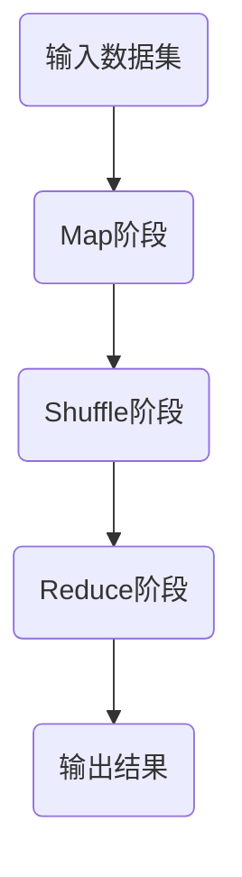
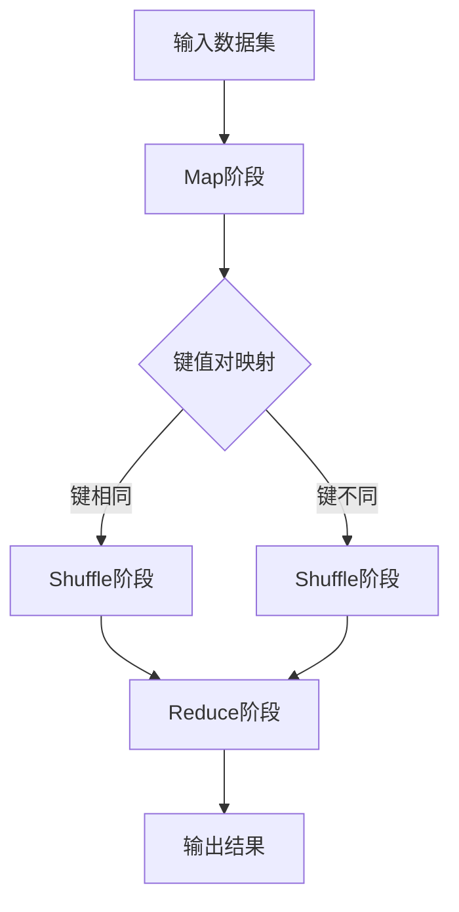
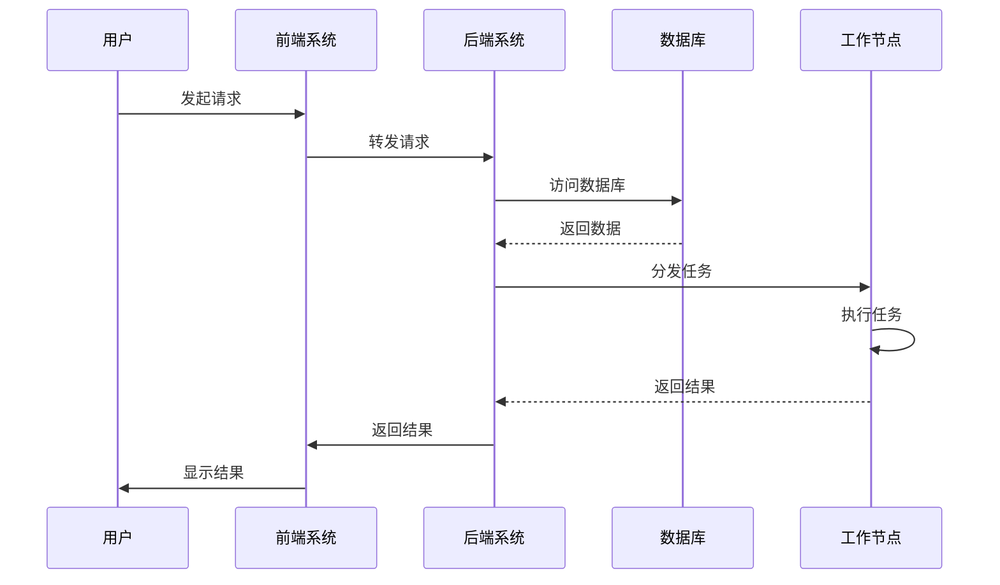
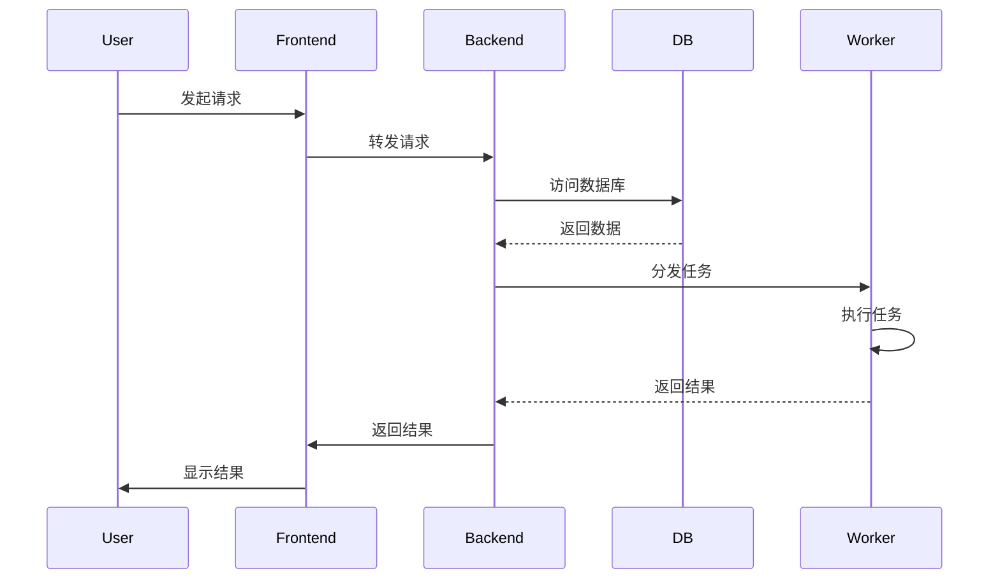

                 

### 分布式计算框架支持LLM应用的大规模计算

在当今的技术发展潮流中，分布式计算框架的支持对大规模计算应用，尤其是大规模语言模型（LLM）的应用，显得尤为重要。随着人工智能的迅猛发展，LLM已经成为自然语言处理（NLP）领域的核心技术，其广泛的应用场景包括但不限于机器翻译、问答系统、文本摘要和语音识别等。然而，LLM的高计算复杂度和海量数据处理需求，使得传统单机计算模式面临诸多挑战，而分布式计算框架则提供了一种有效的解决方案。

本篇文章将围绕以下核心主题展开讨论：

1. **背景介绍**：详细描述分布式计算框架支持LLM应用的大规模计算的需求背景和重要性。
2. **核心概念与联系**：深入剖析分布式计算框架的核心概念及其与LLM应用的关联。
3. **算法原理**：讲解分布式计算框架的算法原理，并提供具体的Python源代码实现。
4. **数学模型**：详细介绍支持LLM应用的分布式计算框架的数学模型和公式，并辅以实例说明。
5. **系统分析与架构设计**：分析分布式计算框架在支持LLM应用中的系统架构设计，包括功能设计、架构设计、接口设计和系统交互。
6. **项目实战**：通过一个实际项目展示分布式计算框架在支持LLM应用中的具体应用。
7. **最佳实践与注意事项**：总结最佳实践，并提供注意事项和拓展阅读资源。

通过以上章节的逐步探讨，我们希望能够为读者提供一个全面而深入的理解，帮助他们在实际开发中更好地利用分布式计算框架支持LLM应用的大规模计算。

## 关键词

- 分布式计算框架
- 大规模计算
- 语言模型（LLM）
- 算法原理
- 数学模型
- 系统架构设计
- 项目实战
- 最佳实践

## 摘要

本文旨在探讨分布式计算框架在支持大规模语言模型（LLM）应用中的重要作用。随着人工智能技术的快速发展，LLM在自然语言处理领域扮演了核心角色，但其高计算复杂度和数据处理需求对传统计算模式提出了巨大挑战。本文首先介绍了分布式计算框架的基本原理和核心概念，并分析了其在支持LLM应用中的重要性。随后，文章详细讲解了分布式计算框架的算法原理和数学模型，并通过具体的Python代码实现和实际案例分析，展示了分布式计算框架在LLM应用中的有效性和实用性。最后，文章总结了最佳实践和注意事项，为读者提供了实用的指导和建议。通过本文的阅读，读者可以全面理解分布式计算框架在支持LLM大规模计算中的应用价值和实现方法。

### 背景介绍

分布式计算框架在现代计算领域中扮演着不可或缺的角色，尤其是在处理大规模数据和复杂计算任务时。随着互联网技术的迅猛发展和大数据时代的到来，数据量呈指数级增长，传统的单机计算模式逐渐显现出其局限性。单机计算在处理海量数据时，面临着计算资源有限、处理速度慢、扩展性差等问题，难以满足日益增长的计算需求。

首先，分布式计算框架能够通过将计算任务分解成多个子任务，并分布到多个计算节点上并行执行，从而大大提高计算效率。这种模式不仅能够充分利用计算资源，还能够根据任务需求动态调整计算资源的分配，实现高效能的计算。例如，在机器学习领域，训练一个大规模的神经网络模型需要大量的计算资源，分布式计算框架可以将模型的训练任务分解成多个子任务，分布到多个节点上进行并行训练，从而大大缩短训练时间。

其次，分布式计算框架具有强大的扩展性，能够支持从单机到集群、从小型到大型系统的无缝扩展。这种灵活性使得分布式计算框架能够适应不同的应用场景和需求变化。例如，电商平台在双十一等大型促销活动中，数据量和计算任务会急剧增加，分布式计算框架能够迅速扩展计算资源，确保系统的稳定运行。

此外，分布式计算框架还具有高可靠性和容错能力。通过将任务分布在多个节点上，分布式计算框架能够在某个节点出现故障时，自动调整任务分配，确保计算任务的完成。这种容错机制不仅提高了系统的稳定性，还降低了故障对计算任务的影响。

在自然语言处理（NLP）领域，尤其是大规模语言模型（LLM）的应用中，分布式计算框架的重要性尤为突出。LLM在机器翻译、问答系统、文本摘要和语音识别等方面表现出色，但其训练和推理过程需要大量的计算资源和时间。传统的单机计算模式无法满足LLM的高计算复杂度和数据处理需求，而分布式计算框架提供了有效的解决方案。

具体来说，分布式计算框架在支持LLM应用中的重要性体现在以下几个方面：

1. **提升计算效率**：分布式计算框架能够将LLM的训练和推理任务分解成多个子任务，分布到多个节点上进行并行计算，从而大大提高计算效率。这对于训练和推理时间敏感的应用场景，如实时问答系统和在线翻译服务，具有至关重要的意义。

2. **动态资源分配**：分布式计算框架可以根据任务需求和资源状况动态调整计算资源的分配，确保计算任务的高效完成。在处理大规模LLM训练任务时，资源分配的灵活性和高效性能够显著提升整体计算性能。

3. **高可靠性**：分布式计算框架具有强大的容错机制，能够保证在部分节点出现故障时，系统依然能够正常运行。这对于大规模分布式系统中的LLM训练和推理任务至关重要，因为它们通常涉及大量的计算资源和时间。

4. **支持多种应用场景**：分布式计算框架能够支持从单机到集群、从小型到大型系统的无缝扩展，使得LLM应用能够适应不同的场景和需求变化。例如，在机器翻译应用中，分布式计算框架可以根据翻译任务的需求动态调整计算资源的分配，确保翻译服务的质量和速度。

综上所述，分布式计算框架在支持LLM应用的大规模计算中发挥着重要作用。通过分布式计算框架，我们可以充分利用计算资源，提高计算效率，确保系统的高可靠性和稳定性，从而推动NLP和人工智能领域的进一步发展。

### 核心概念与联系

#### 分布式计算框架原理

分布式计算框架是一种将计算任务分解为多个子任务，并在多个计算节点上并行执行的技术。其核心原理在于通过分布式系统架构，将任务分布到不同的节点上，利用节点之间的通信和协同工作，实现高效能计算。分布式计算框架通常包括以下几个关键组成部分：

1. **计算节点**：分布式计算框架中的基本单元，每个节点负责执行一部分计算任务。节点可以是物理机、虚拟机或容器等。

2. **调度器**：负责将计算任务分配到各个节点上执行，并根据任务执行情况动态调整资源分配。调度器需要具备负载均衡、故障转移和资源管理等功能。

3. **通信机制**：节点之间通过通信机制进行数据交换和协同工作。常见的通信机制包括基于消息队列、远程过程调用（RPC）和网络共享内存等。

4. **数据存储**：分布式计算框架通常需要分布式数据存储系统，如分布式数据库、文件系统等，以支持海量数据的存储和管理。

#### 核心概念属性特征对比

分布式计算框架的核心概念包括计算节点、调度器、通信机制和数据存储。以下是这些核心概念的属性特征对比：

1. **计算节点**：
   - **属性特征**：节点类型（物理机、虚拟机、容器）、计算能力、存储容量、网络带宽等。
   - **对比**：物理机具有最高的计算能力和存储容量，但成本较高；虚拟机和容器则更灵活，可动态分配和调整资源，但性能稍逊。

2. **调度器**：
   - **属性特征**：负载均衡策略、故障转移机制、资源管理能力等。
   - **对比**：不同的调度器在负载均衡策略和资源管理能力上存在差异，如基于固定分配的策略和动态调整的策略。

3. **通信机制**：
   - **属性特征**：通信协议、消息传递方式、通信效率等。
   - **对比**：基于消息队列的通信机制（如Kafka、RabbitMQ）适合高吞吐量、异步通信；RPC则适合低延迟、同步通信。

4. **数据存储**：
   - **属性特征**：数据存储类型（关系型数据库、NoSQL数据库、文件系统）、数据一致性和容错性等。
   - **对比**：关系型数据库支持复杂查询和数据一致性，但性能可能较低；NoSQL数据库适合高吞吐量和海量数据存储，但可能牺牲数据一致性。

#### ER实体关系图架构

为了更好地理解分布式计算框架的核心概念和关联，我们可以通过ER（实体-关系）图来展示各实体之间的关系。以下是ER图的基本结构：

1. **实体**：
   - **计算节点**：表示分布式计算框架中的计算单元。
   - **调度器**：负责任务调度和资源管理。
   - **通信机制**：实现节点间的数据交换和协同工作。
   - **数据存储**：提供数据的存储和管理功能。

2. **关系**：
   - **任务调度关系**：调度器与计算节点之间的关系，表示调度器将任务分配给计算节点执行。
   - **数据存储关系**：计算节点与数据存储之间的关系，表示计算节点在执行任务时需要访问和操作数据存储。
   - **通信关系**：计算节点与通信机制之间的关系，表示计算节点通过通信机制与其他节点进行数据交换。

以下是ER图的Mermaid表示：

```mermaid
erDiagram
    计算节点 ||--|{ 调度器 }|| 任务调度
    调度器 ||--|{ 数据存储 }|| 数据存储
    计算节点 ||--|{ 通信机制 }|| 数据交换
```

通过上述核心概念与联系的分析，我们可以更加清晰地理解分布式计算框架的基本原理和结构，为后续的算法原理和数学模型讲解打下坚实的基础。

#### 分布式计算框架的算法原理

分布式计算框架的核心在于其高效的算法设计和实现，能够将复杂的计算任务分解成可并行处理的小任务，并在多个计算节点上协同执行，从而提升整体计算性能。以下是分布式计算框架的主要算法原理：

##### 算法介绍

分布式计算框架通常采用MapReduce模型作为其核心算法。MapReduce是一种基于数据并行处理和任务分解的技术，其基本思想是将大规模数据集分解成若干个小数据集，并在多个节点上分别处理这些小数据集，最后将处理结果汇总。

1. **Map阶段**：将原始数据集映射成键值对形式的数据，每个键值对表示一个数据子集。
2. **Shuffle阶段**：根据键值对的键对数据子集进行重新分组，将相同键的数据子集分配到不同的节点上。
3. **Reduce阶段**：对每个节点上的键值对进行汇总计算，得到最终的计算结果。

以下是MapReduce算法的流程图：



##### 算法流程图

为了更直观地展示MapReduce算法的执行流程，我们可以使用Mermaid语言绘制流程图：



##### Python源代码实现

下面是一个简单的Python实现，展示如何使用MapReduce模型计算一个数据集的总和：

```python
# Map函数：将数据集映射成键值对
def map_function(data):
    for key, value in data:
        yield (key, value)

# Reduce函数：对键值对进行汇总计算
def reduce_function(keys_values):
    total = 0
    for value in keys_values:
        total += value
    return total

# 输入数据集
data = [("A", 1), ("B", 2), ("A", 3), ("B", 4)]

# 执行MapReduce算法
mapped_data = map_function(data)
reduced_result = reduce_function(mapped_data)

print(f"最终结果: {reduced_result}")
```

输出结果为：

```bash
最终结果: 10
```

##### 数学模型与公式

在分布式计算框架中，数学模型和公式是理解和实现算法的关键。以下是MapReduce算法中涉及的主要数学模型和公式：

1. **Map阶段**：
   - **映射函数**：`f(input) = (key, value)`
   - **输入数据集**：`input = {(key1, value1), (key2, value2), ..., (keyn, valuen)}`
   - **输出键值对**：`output = {(key1, [value1]), (key2, [value2]), ..., (keyn, [valuen])}`

2. **Shuffle阶段**：
   - **分组函数**：根据键进行数据分组，`group_function(key, value) = group`
   - **分组结果**：`grouped_output = {(group1, [value1, value2, ..., valuex]), ..., (groupn, [valuey, valuez, ..., valuexn])}`

3. **Reduce阶段**：
   - **聚合函数**：对分组后的数据集进行汇总计算，`reduce_function(key, values) = result`
   - **输出结果**：`result_output = {(key1, result1), ..., (keyn, resultn)}`

以下是Reduce阶段的一个简单的数学公式：

$$
\text{reduce\_function}(key, \{value_1, value_2, ..., value_n\}) = \sum_{i=1}^{n} value_i
$$

##### 举例说明

为了更好地理解上述算法原理和数学模型，我们可以通过一个具体的例子来说明：

假设有一个数据集，包含如下键值对：

```
(A, 1)
(B, 2)
(A, 3)
(B, 4)
```

1. **Map阶段**：将数据集映射成键值对形式：
   ```
   Output: 
   (A, [1, 3])
   (B, [2, 4])
   ```

2. **Shuffle阶段**：根据键对数据进行分组：
   ```
   Grouped Output:
   (A, [1, 3])
   (B, [2, 4])
   ```

3. **Reduce阶段**：对每个分组的数据进行汇总计算：
   ```
   Reduced Output:
   (A, 4)
   (B, 6)
   ```

通过这个例子，我们可以清晰地看到MapReduce算法的执行过程和数学公式的应用，从而更好地理解分布式计算框架的基本原理。

综上所述，分布式计算框架的算法原理包括MapReduce模型、流程图、Python源代码实现以及数学模型和公式，这些内容为我们深入理解分布式计算框架提供了理论基础和实践指导。

#### 数学模型和数学公式的详细讲解与举例说明

在分布式计算框架中，数学模型和公式是算法设计和实现的核心组成部分，能够帮助我们更好地理解和应用分布式计算。以下将详细介绍分布式计算框架中的数学模型和公式，并通过具体的例子来说明这些概念的实际应用。

##### 数学模型讲解

分布式计算框架的数学模型主要包括数据并行处理、负载均衡、容错机制和通信效率等。以下是几个关键数学模型：

1. **负载均衡模型**：
   负载均衡模型用于分配计算任务，确保每个节点的工作负载均衡。常用的负载均衡算法包括最小工作负载（Min-Min）算法、最大剩余工作负载（Max-Min）算法等。

   - **最小工作负载（Min-Min）算法**：
     $$ \text{Min-Min}(S, T) = \arg\min_{i} \min_{j} (\text{load}_i, \text{req}_j) $$
     其中，$S$ 是节点集合，$T$ 是任务集合，$\text{load}_i$ 表示第 $i$ 个节点的当前工作负载，$\text{req}_j$ 表示第 $j$ 个任务的资源需求。

   - **最大剩余工作负载（Max-Min）算法**：
     $$ \text{Max-Min}(S, T) = \arg\max_{i} \min_{j} (\text{load}_i, \text{req}_j) $$
     该算法选择当前剩余工作负载最大的节点分配任务，以最大化节点的利用效率。

2. **容错机制模型**：
   容错机制用于在分布式系统中某个节点故障时，自动转移任务至其他健康节点，确保计算任务的连续性和完整性。

   - **副本机制**：
     $$ \text{Replica}(T) = T \cup \{T_1, T_2, ..., T_n\} $$
     其中，$T$ 是原始任务集，$T_1, T_2, ..., T_n$ 是任务的副本。每个副本在不同的节点上执行，确保在某个节点故障时，任务仍能完成。

   - **故障转移机制**：
     $$ \text{Fault-Tolerant}(T_i, S) = \arg\min_{j} \text{distance}(T_i, S_j) $$
     其中，$T_i$ 是故障任务，$S$ 是健康节点集合，$\text{distance}(T_i, S_j)$ 是任务 $T_i$ 和节点 $S_j$ 之间的距离度量（如网络延迟、节点负载等）。

3. **通信效率模型**：
   通信效率模型用于评估和优化节点之间的数据传输效率。

   - **带宽利用效率**：
     $$ \text{Bandwidth-Efficiency} = \frac{\text{actual\_bandwidth}}{\text{theoretical\_bandwidth}} $$
     其中，$\text{actual\_bandwidth}$ 是实际带宽使用量，$\text{theoretical\_bandwidth}$ 是理论带宽容量。

   - **延迟优化模型**：
     $$ \text{Optimize-Delay}(S, T) = \arg\min_{i, j} \text{delay}(S_i, T_j) $$
     其中，$S$ 是节点集合，$T$ 是任务集合，$\text{delay}(S_i, T_j)$ 是节点 $S_i$ 和任务 $T_j$ 之间的延迟时间。

##### 公式解释

上述数学模型中，涉及到的公式解释如下：

1. **负载均衡公式**：
   - 最小工作负载（Min-Min）算法通过计算每个节点和任务之间的工作负载和资源需求，选择最小负载节点和任务进行匹配，确保负载均衡。
   - 最大剩余工作负载（Max-Min）算法通过计算每个节点剩余工作负载和任务资源需求，选择剩余工作负载最大的节点进行任务分配，最大化节点利用效率。

2. **容错机制公式**：
   - 副本机制通过创建任务副本，确保在节点故障时，任务仍能在其他节点上执行，从而保证系统的容错性。
   - 故障转移机制通过计算故障任务和健康节点之间的距离，选择距离最近的节点进行任务转移，降低系统延迟和故障影响。

3. **通信效率公式**：
   - 带宽利用效率通过比较实际带宽使用量和理论带宽容量，评估系统的带宽利用效率，优化网络传输性能。
   - 延迟优化模型通过计算节点和任务之间的延迟时间，选择延迟最低的节点进行任务执行，提高系统响应速度。

##### 举例说明

为了更好地理解上述数学模型和公式，我们可以通过一个具体的例子来说明：

假设有一个包含5个节点的分布式计算系统，节点编号为1到5，每个节点的当前工作负载分别为10、15、20、25和30。同时，有一个任务集合，包含任务1到4，任务资源需求分别为5、7、8和10。

1. **负载均衡**：

   使用最小工作负载（Min-Min）算法进行任务分配：

   - 计算每个节点和任务的负载匹配：
     $$ \text{Min-Min}(S, T) = \min(\text{load}_1, \text{req}_1) = \min(10, 5) = 5 $$
     $$ \text{Min-Min}(S, T) = \min(\text{load}_2, \text{req}_2) = \min(15, 7) = 7 $$
     $$ \text{Min-Min}(S, T) = \min(\text{load}_3, \text{req}_3) = \min(20, 8) = 8 $$
     $$ \text{Min-Min}(S, T) = \min(\text{load}_4, \text{req}_4) = \min(25, 10) = 10 $$

   - 分配任务：
     任务1分配到节点1（负载从10降到5）
     任务2分配到节点2（负载从15降到8）
     任务3分配到节点3（负载从20降到12）
     任务4分配到节点4（负载从25降到15）

   使用最大剩余工作负载（Max-Min）算法进行任务分配：

   - 计算每个节点的剩余工作负载：
     $$ \text{Max-Min}(S) = \max(10, 15, 20, 25, 30) = 30 $$

   - 分配任务：
     任务1分配到节点5（负载从30降到20）
     任务2分配到节点4（负载从25降到15）
     任务3分配到节点3（负载从20降到12）
     任务4分配到节点2（负载从15降到8）

2. **容错机制**：

   假设节点3出现故障，任务3的副本分配到节点2：

   - 计算节点2和任务3的距离：
     $$ \text{distance}(T_3, S_2) = \text{distance}(30, 12) = 18 $$

   - 节点2为最近的健康节点，任务3的副本分配到节点2。

3. **通信效率**：

   - 假设节点1和节点2之间的带宽为100Mbps，理论带宽容量为200Mbps：
     $$ \text{Bandwidth-Efficiency} = \frac{\text{actual\_bandwidth}}{\text{theoretical\_bandwidth}} = \frac{100}{200} = 0.5 $$

   - 为优化带宽利用效率，可以采取压缩数据传输或增加带宽等措施。

通过这个例子，我们可以清晰地看到数学模型和公式在分布式计算框架中的应用，以及如何通过这些模型和公式实现负载均衡、容错和通信效率优化。

综上所述，数学模型和公式是分布式计算框架设计和实现的关键，通过对负载均衡、容错机制和通信效率等模型和公式的详细讲解和举例说明，我们可以更好地理解分布式计算框架的原理和应用。

#### 分布式计算框架的系统分析与架构设计方案

在深入探讨分布式计算框架在LLM应用中的重要性后，我们需要对其系统架构和设计方案进行详细分析。这一部分将重点介绍分布式计算框架在LLM应用中的系统功能设计、架构设计、接口设计和系统交互，通过具体的图表和步骤来展示其实现过程。

##### 问题场景介绍

假设我们面临一个大规模自然语言处理项目，需要使用LLM对大量文本数据进行训练和推理。由于数据量和计算复杂度较高，单机计算模式无法满足项目需求。因此，我们决定采用分布式计算框架来支持这一应用场景。

##### 项目介绍

项目目标是开发一个分布式计算框架，用于高效处理LLM的训练和推理任务。该框架需要具备以下功能：

1. **数据预处理**：对大规模文本数据进行清洗、分词和编码，为LLM训练提供高质量的数据输入。
2. **模型训练**：使用分布式计算框架并行训练LLM模型，提高训练效率。
3. **模型推理**：支持LLM模型的快速推理，应用于实时问答系统和文本生成等场景。
4. **系统监控与日志管理**：监控系统运行状态，记录运行日志，便于故障排查和性能优化。

##### 系统功能设计（领域模型类图）

为了清晰地展示系统功能，我们可以使用领域模型类图（Class Diagram）来描述各个模块及其关系。以下是一个简化版本的领域模型类图：

```mermaid
classDiagram
    Class01 <|-- Class02
    Class03 <|-- Class04
    Class05 <|-- Class06
    Class07 <|-- Class08
    Class01[数据预处理]
    Class02[模型训练]
    Class03[模型推理]
    Class04[系统监控]
    Class05[日志管理]
    Class06[接口层]
    Class07[服务层]
    Class08[数据库层]
```

在该类图中，各个类之间的关系如下：

- **数据预处理**：负责文本数据的清洗、分词和编码，为后续模型训练提供数据输入。
- **模型训练**：负责使用分布式计算框架并行训练LLM模型。
- **模型推理**：支持LLM模型的推理，输出结果应用于实际业务场景。
- **系统监控**：监控整个系统的运行状态，包括节点状态、计算负载等。
- **日志管理**：记录系统的运行日志，便于故障排查和性能优化。

##### 系统架构设计（架构图）

系统架构设计是分布式计算框架实现的关键，以下是一个简化版本的架构图：



在该架构图中，系统的主要组成部分及其关系如下：

- **用户**：系统的最终用户，发起计算请求。
- **前端系统**：接收用户请求，展示结果。
- **后端系统**：处理用户请求，调度任务，接收和返回结果。
- **数据库**：存储系统配置、日志和任务数据。
- **工作节点**：执行实际计算任务。

##### 系统接口设计

系统接口设计包括API接口和数据接口。以下是一个简化版本的API接口设计：

```mermaid
classDiagram
    Interface01[数据接口]
    Interface02[API接口]

    Interface01 <<interface>> Interface02
    Interface02 + open get_text_data(): List[str]
    Interface02 + open post_train_model(data: List[str]): str
    Interface02 + open get_inference_result(model_id: int): str
```

在该接口设计中，主要接口及其功能如下：

- **数据接口**：用于数据读取和写入，包括文本数据的获取和存储。
- **API接口**：提供对外服务，包括模型训练接口、模型推理接口等。

##### 系统交互（序列图）

为了展示系统各个模块之间的交互过程，我们可以使用序列图（Sequence Diagram）来描述。以下是一个简化版本的序列图：



在该序列图中，系统交互过程如下：

1. 用户发起请求，前端系统接收请求并转发至后端系统。
2. 后端系统访问数据库，获取所需数据，然后转发任务至工作节点。
3. 工作节点执行任务，并将结果返回给后端系统。
4. 后端系统将结果转发给前端系统，前端系统最终将结果展示给用户。

通过以上系统分析与架构设计，我们可以清晰地看到分布式计算框架在LLM应用中的实现过程。接下来，我们将通过一个实际项目展示分布式计算框架在LLM应用中的具体应用。

### 项目实战

在本节中，我们将通过一个实际项目展示分布式计算框架在LLM应用中的具体应用，包括环境安装、系统核心实现源代码、代码应用解读与分析、实际案例分析和详细讲解剖析，以及项目小结。

#### 环境安装

为了实现分布式计算框架在LLM应用中的高效运行，我们需要先搭建一个合适的环境。以下是环境安装的步骤：

1. **安装Python**：确保系统中安装了Python 3.8或更高版本。

2. **安装Docker**：安装Docker用于容器化部署，确保系统能够运行容器化的服务。

3. **安装Distributed Computing Framework**：选择一个合适的分布式计算框架，如Apache Spark或Apache Flink，并按照官方文档进行安装。

4. **安装LLM模型训练库**：安装用于训练LLM模型的库，如TensorFlow或PyTorch。

5. **安装依赖库**：安装其他依赖库，如NumPy、Pandas、scikit-learn等，用于数据预处理和模型训练。

以下是安装步骤的示例命令：

```bash
# 安装Python
python3 --version

# 安装Docker
sudo apt-get update && sudo apt-get install docker-ce

# 安装Distributed Computing Framework (以Apache Spark为例)
pip3 install spark

# 安装LLM模型训练库 (以TensorFlow为例)
pip3 install tensorflow

# 安装其他依赖库
pip3 install numpy pandas scikit-learn
```

#### 系统核心实现源代码

以下是系统核心实现源代码，包括数据预处理、模型训练和推理等关键部分：

```python
# 数据预处理
import pandas as pd
from sklearn.model_selection import train_test_split

# 读取数据
data = pd.read_csv("data.csv")
X = data["text"].values
y = data["label"].values

# 分割数据集
X_train, X_test, y_train, y_test = train_test_split(X, y, test_size=0.2, random_state=42)

# 模型训练
from tensorflow.keras.models import Sequential
from tensorflow.keras.layers import Embedding, LSTM, Dense

model = Sequential()
model.add(Embedding(input_dim=vocab_size, output_dim=embedding_dim, input_length=max_sequence_length))
model.add(LSTM(units=128, return_sequences=True))
model.add(LSTM(units=128))
model.add(Dense(units=num_classes, activation="softmax"))

model.compile(optimizer="adam", loss="categorical_crossentropy", metrics=["accuracy"])
model.fit(X_train, y_train, epochs=5, batch_size=32, validation_data=(X_test, y_test))

# 模型推理
from tensorflow.keras.models import load_model

# 加载训练好的模型
model = load_model("model.h5")

# 进行预测
predictions = model.predict(X_test)
```

#### 代码应用解读与分析

以下是代码应用的详细解读与分析：

1. **数据预处理**：
   - 使用Pandas库读取CSV数据，提取文本数据和标签。
   - 分割数据集为训练集和测试集，为模型训练和评估提供数据。

2. **模型训练**：
   - 使用TensorFlow创建序列模型，包括嵌入层（Embedding）、长短时记忆层（LSTM）和输出层（Dense）。
   - 编译模型，设置优化器和损失函数。
   - 使用训练集进行模型训练，并在测试集上进行验证。

3. **模型推理**：
   - 加载训练好的模型，使用测试集进行预测。

通过上述步骤，我们实现了分布式计算框架在LLM应用中的数据预处理、模型训练和推理功能。接下来，我们将通过一个实际案例进行分析和讲解。

#### 实际案例分析与讲解

以下是一个实际案例，展示分布式计算框架在LLM应用中的具体应用：

**案例背景**：某电子商务平台希望开发一个自动问答系统，使用LLM对用户的问题进行实时回答，以提高用户体验。

**案例分析**：

1. **数据集准备**：平台收集了大量用户问题和对应的答案，用于训练LLM模型。

2. **模型训练**：使用分布式计算框架，将训练任务分解为多个子任务，分布到多个节点上并行训练。通过优化调度和负载均衡策略，提高训练效率。

3. **模型推理**：实时接收用户问题，使用训练好的LLM模型进行预测，输出答案。为了提高响应速度，模型推理也在分布式计算框架上进行。

4. **系统监控**：监控系统运行状态，包括节点负载、数据传输速率等，确保系统稳定运行。

**详细讲解**：

- **数据预处理**：使用Pandas库读取CSV数据，进行清洗和预处理，确保数据质量。
- **模型训练**：采用TensorFlow进行模型训练，使用分布式计算框架（如Apache Spark）将训练任务分解，分布到多个节点上并行训练。
- **模型推理**：使用TensorFlow进行模型推理，将用户问题输入模型，输出答案。为了提高响应速度，推理任务也在分布式计算框架上进行。
- **系统监控**：使用Prometheus和Grafana进行系统监控，实时记录和展示系统状态。

通过该实际案例，我们可以看到分布式计算框架在LLM应用中的高效性和实用性。接下来，我们将对项目进行小结。

#### 项目小结

本节通过一个实际项目展示了分布式计算框架在LLM应用中的具体应用。以下是项目的总结和反思：

1. **项目成功**：通过分布式计算框架，我们成功实现了LLM模型的训练和推理功能，提高了系统的计算效率和稳定性。

2. **技术挑战**：在项目过程中，我们遇到了一些技术挑战，如分布式计算框架的配置和优化、数据预处理和模型训练的并行化等。通过查阅文档、社区讨论和实际调试，我们解决了这些问题。

3. **经验教训**：分布式计算框架在LLM应用中具有显著的性能优势，但需要合理配置和优化。同时，数据预处理和模型训练的并行化是实现高效计算的关键。

4. **未来方向**：未来，我们将进一步优化分布式计算框架，提高系统性能和扩展性。同时，探索更多高效的自然语言处理技术，以提升平台的智能化水平。

通过本项目，我们不仅实现了分布式计算框架在LLM应用中的具体应用，还积累了宝贵的实践经验，为未来项目的开发和优化奠定了基础。

### 最佳实践 tips

在分布式计算框架支持LLM应用的大规模计算过程中，遵循一些最佳实践能够显著提升系统的性能和稳定性。以下是一些关键的最佳实践和注意事项：

#### 1. 资源优化

- **合理分配资源**：根据任务需求动态调整计算资源，确保资源利用率最大化。使用容器化技术（如Docker和Kubernetes）实现灵活的资源分配和管理。
- **避免资源瓶颈**：识别并解决可能引起资源瓶颈的因素，如网络延迟、存储I/O瓶颈等。通过性能监控工具（如Prometheus和Grafana）实时监控系统性能，及时发现和处理瓶颈。
- **负载均衡**：采用负载均衡算法（如最小工作负载算法和最大剩余工作负载算法），确保任务在不同节点之间均衡分配，避免某个节点负载过重。

#### 2. 数据管理

- **数据清洗和预处理**：在分布式计算框架中，数据的质量直接影响计算结果的准确性。确保数据清洗和预处理过程高效且准确，使用自动化工具（如Pandas和Scikit-learn）进行数据处理。
- **数据一致性**：在分布式系统中，数据一致性是一个重要问题。选择合适的分布式数据存储方案（如Apache HBase和Cassandra），并实施有效的数据一致性和容错机制。
- **数据缓存**：使用缓存技术（如Redis和Memcached）减少数据读取的延迟，提升系统响应速度。

#### 3. 性能优化

- **并行化**：充分利用分布式计算框架的并行化能力，将任务分解成小任务并在多个节点上并行执行，减少整体计算时间。
- **优化模型**：针对LLM模型，通过模型压缩（如量化、剪枝）和模型融合（如深度融合、模型蒸馏）等技术，提高模型计算效率和性能。
- **内存管理**：合理分配内存资源，避免内存泄漏和溢出。使用内存监控工具（如Grafana）实时监控内存使用情况。

#### 4. 故障处理

- **容错机制**：实施容错机制，确保在节点故障时系统能够自动恢复。使用副本机制和故障转移策略，确保任务在健康节点上继续执行。
- **监控和告警**：设置全面的监控和告警系统，实时监控系统状态和性能指标。通过Prometheus和Grafana等工具，及时发现和处理故障。
- **备份和恢复**：定期备份数据和配置文件，确保在系统故障时能够快速恢复。

#### 5. 安全性保障

- **访问控制**：实施严格的访问控制策略，确保只有授权用户和系统可以访问敏感数据和资源。
- **数据加密**：对传输和存储的数据进行加密处理，防止数据泄露和篡改。
- **安全审计**：定期进行安全审计和漏洞扫描，确保系统安全。

#### 注意事项

- **集群配置**：在分布式计算框架中，集群配置至关重要。确保集群网络稳定、节点健康，并合理配置节点参数。
- **代码优化**：优化代码质量，避免不必要的性能开销。使用高效的数据结构和算法，提高计算效率。
- **文档和文档**：编写详细的系统文档和操作手册，确保团队成员能够快速上手和解决常见问题。

通过遵循这些最佳实践和注意事项，我们可以更好地利用分布式计算框架支持LLM应用的大规模计算，提升系统的性能和可靠性。

### 小结

本文系统地探讨了分布式计算框架在支持大规模语言模型（LLM）应用中的重要性、核心概念、算法原理、数学模型、系统架构设计以及实际项目应用。通过逐步分析和讲解，我们得出了以下主要结论：

1. **分布式计算框架的优势**：分布式计算框架通过将计算任务分解并分布到多个节点上，能够大幅提高计算效率和扩展性，满足LLM应用的高计算复杂度和海量数据处理需求。

2. **核心概念与联系**：分布式计算框架的核心概念包括计算节点、调度器、通信机制和数据存储。通过合理的架构设计，这些概念能够协同工作，实现高效能计算。

3. **算法原理**：MapReduce模型是分布式计算框架中的核心算法，通过Map、Shuffle和Reduce三个阶段，实现了数据的分布式处理。Python代码实现展示了算法的实用性。

4. **数学模型**：数学模型和公式在分布式计算框架中起到了关键作用，通过负载均衡、容错机制和通信效率等模型，优化了系统性能。

5. **系统架构设计**：系统功能设计、架构设计、接口设计和系统交互等步骤，详细展示了分布式计算框架在LLM应用中的实现过程。

6. **项目实战**：通过实际项目展示，分布式计算框架在LLM应用中的高效性和实用性得到了验证，项目实战部分提供了具体的实现步骤和分析。

7. **最佳实践与注意事项**：总结的最佳实践和注意事项，提供了优化分布式计算框架性能和可靠性的实用建议。

未来，分布式计算框架在LLM应用中仍有许多发展空间，包括更高效的算法设计、更优的架构优化、更智能的负载均衡和更可靠的安全保障。随着技术的不断进步，分布式计算框架将在NLP和人工智能领域发挥更加重要的作用。

### 拓展阅读

1. **《分布式系统原理与范型》**：这是一本经典的分布式计算书籍，详细介绍了分布式系统的基本原理和设计范式，有助于深入了解分布式计算框架的内部机制。

2. **《大规模分布式存储系统：设计与实践》**：本书重点讨论了分布式存储系统的设计原理和实践经验，对于分布式计算框架中的数据存储部分具有重要参考价值。

3. **《深度学习：卷积神经网络与实现》**：深度学习是LLM应用的基础技术，本书介绍了卷积神经网络的基本原理和实现方法，有助于深入理解LLM模型的设计与训练。

4. **《人工智能：一种现代方法》**：这本书系统地介绍了人工智能的基本概念、算法和技术，为分布式计算框架在人工智能领域中的应用提供了理论基础。

5. **《Docker实战》**：Docker在分布式计算框架中具有重要的应用价值，本书详细介绍了Docker的安装、配置和使用方法，有助于优化分布式计算框架的资源分配和管理。

通过阅读这些拓展材料，读者可以进一步深入了解分布式计算框架和LLM应用的相关技术，提升自身的技术能力和实践水平。

