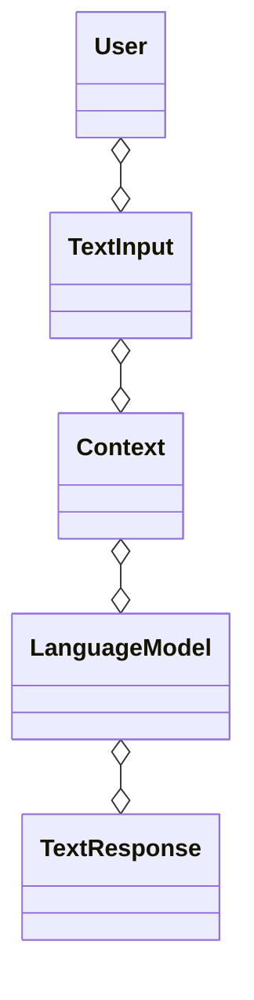

                 

## 引言

### 1.1 书籍目的

在当前快速发展的信息技术时代，分布式系统和大规模语言模型（LLM）的应用变得越来越普遍。分布式追踪技术作为一种保障系统稳定性和高效性的关键手段，其重要性日益凸显。然而，在实际应用中，如何有效地实现分布式追踪上下文传播，尤其是在LLM应用中，仍存在诸多挑战。本书籍旨在深入探讨分布式追踪上下文传播在LLM应用中的实现方法，为读者提供一套系统、实用且易于理解的技术指南。

本书籍的目标读者是从事分布式系统开发、人工智能应用研究的技术人员，特别是那些希望在LLM应用中实现高效分布式追踪的工程师和研究人员。通过阅读本书，读者将能够：

1. **掌握分布式追踪的基本概念和原理**：了解分布式追踪的基本概念，包括追踪器、数据收集器、存储器和分析器等组件的工作机制。
2. **理解上下文传播的重要性**：明确上下文传播在分布式追踪中的作用，学习如何确保上下文信息在整个分布式系统中的一致性和可靠性。
3. **掌握分布式追踪在LLM应用中的实现技巧**：通过实际案例和代码示例，掌握在LLM应用中实现分布式追踪上下文传播的具体方法。
4. **提升系统设计和调优能力**：学习如何设计和优化分布式追踪系统，提高系统的可观测性和可维护性。

### 1.2 问题背景

分布式追踪起源于微服务架构的兴起，旨在解决分布式系统中服务调用链路追踪的难题。随着大规模语言模型（LLM）的广泛应用，如聊天机器人、自然语言处理（NLP）应用等，分布式追踪在LLM应用中的重要性愈发突出。LLM应用通常涉及复杂的计算流程和大规模的数据处理，这些应用往往需要跨越多个分布式节点和服务器。在这种场景下，追踪每个请求的执行路径，确保上下文信息的一致性，成为实现系统高效运行的关键。

然而，分布式追踪在LLM应用中面临诸多挑战：

1. **上下文信息量大**：LLM应用生成和处理的上下文信息量巨大，如何在保证性能的同时有效传输和存储这些信息，成为一大难题。
2. **实时性和一致性**：在分布式环境中，如何确保上下文信息的实时性和一致性，避免信息丢失或延迟，是分布式追踪面临的重要挑战。
3. **跨语言模型追踪**：LLM应用通常涉及多种语言模型的调用，如何在不同的语言模型之间传递上下文信息，实现跨语言模型的追踪，需要深入的考虑和设计。

### 1.3 书籍结构概述

为了帮助读者系统地掌握分布式追踪上下文传播在LLM应用中的实现方法，本书结构分为以下几个部分：

1. **第1章：核心概念与背景**：介绍分布式追踪的基本概念和背景，包括分布式追踪的定义、必要性、基本原理，以及LLM应用的特点和挑战。

2. **第2章：分布式追踪原理**：深入探讨分布式追踪的核心原理，包括追踪器、数据收集器、存储器和分析器的工作机制，以及上下文传播的基本机制。

3. **第3章：分布式追踪在LLM中的应用**：分析分布式追踪在LLM应用中的具体实现，包括上下文传播的挑战、解决方案和最佳实践。

4. **第4章：分布式追踪技术**：介绍分布式追踪中常用的技术，如追踪协议、追踪库和中间件，以及它们在LLM应用中的适用性。

5. **第5章：系统设计与实现**：详细描述分布式追踪系统的设计原则、架构和接口设计，包括领域模型、系统架构、接口设计和系统交互。

6. **第6章：项目实战**：通过实际项目案例，展示如何实现分布式追踪上下文传播在LLM应用中的具体应用，包括环境安装、系统实现和代码分析。

7. **第7章：最佳实践与总结**：总结分布式追踪上下文传播在LLM应用中的实现经验和最佳实践，提供实用技巧和小结。

通过以上结构，本书将为读者提供一套全面、深入的分布式追踪上下文传播在LLM应用中的实现指南。希望读者能够通过阅读本书，掌握分布式追踪的核心技术和应用方法，提升系统设计和开发能力。## 第1章：核心概念与背景

### 1.1 分布式追踪概述

#### 1.1.1 分布式追踪的基本概念

分布式追踪（Distributed Tracing）是一种用于监测和记录分布式系统中服务调用链路的技术。在分布式系统中，服务通常分布在多个节点上，它们通过网络相互调用，形成一个复杂的调用图。分布式追踪的核心目标是通过记录每个请求的执行路径，提供对系统运行状态的全面了解，从而帮助开发者和运维人员快速定位和解决问题。

分布式追踪系统通常由以下几个关键组件组成：

1. **追踪器（Tracer）**：负责生成、记录和传输追踪数据。追踪器嵌入在应用程序中，用于记录每次请求的执行细节，如时间戳、请求ID、调用链等。

2. **数据收集器（Collector）**：负责接收和存储来自追踪器的数据。数据收集器通常部署在分布式系统的各个节点上，用于汇总和传输追踪数据到中央存储系统。

3. **存储器（Storage）**：负责存储和管理追踪数据。存储器可以是关系数据库、时间序列数据库或日志文件，用于持久化追踪数据，以便后续的分析和处理。

4. **分析器（Profiler）**：负责分析追踪数据，生成报告和可视化图表。分析器通常提供用户友好的界面，帮助用户快速理解系统的运行状态和性能瓶颈。

#### 1.1.2 分布式追踪的必要性

在分布式系统中，由于服务调用链路复杂且动态，传统的日志监控和调试方法往往无法提供足够的诊断信息。分布式追踪技术通过提供详细的调用链路信息，解决了以下几个关键问题：

1. **服务调用链路可视化**：分布式追踪可以帮助开发者和服务管理员清晰地看到每个请求的执行路径，从而理解系统的工作流程和性能表现。

2. **故障定位**：当系统出现问题时，分布式追踪提供了详细的调用链路信息，使得定位故障点变得更加容易和快速。

3. **性能优化**：通过分析追踪数据，可以发现系统的性能瓶颈，从而进行针对性的优化。

4. **安全性监控**：分布式追踪可以帮助检测和监控恶意攻击和异常行为，提升系统的安全性。

#### 1.1.3 分布式追踪的基本原理

分布式追踪的基本原理是通过在系统中插入追踪标记，记录每个请求的执行过程。具体来说，分布式追踪包括以下几个关键步骤：

1. **请求发起**：当一个请求到达系统时，追踪器生成一个唯一的请求ID（Trace ID），并将该ID与请求关联。

2. **追踪标记**：在请求处理过程中，追踪器会在每个服务调用点插入追踪标记（Span），记录调用时间、调用者、调用路径等信息。

3. **数据传输**：追踪器将追踪数据发送到数据收集器，数据收集器负责将数据汇总并存储到存储器中。

4. **数据分析**：分析器从存储器中提取追踪数据，进行统计分析，生成报告和可视化图表。

通过上述步骤，分布式追踪实现了对分布式系统中服务调用链路的全面监控和记录。

### 1.2 LLM应用概述

#### 1.2.1 什么是LLM

大规模语言模型（Large Language Model，简称LLM）是一种基于深度学习的自然语言处理技术，通过训练大量的文本数据，LLM能够生成流畅、自然的文本，进行问答、翻译、摘要等多种任务。与传统的规则引擎和统计模型相比，LLM具有更强的表达能力和适应性，能够处理复杂的语言现象。

LLM的核心组成部分包括：

1. **嵌入层（Embedding Layer）**：将文本数据转换为密集的向量表示，便于神经网络处理。

2. **编码器（Encoder）**：负责对输入文本进行编码，生成上下文信息。

3. **解码器（Decoder）**：根据编码器生成的上下文信息，生成输出文本。

4. **注意力机制（Attention Mechanism）**：用于捕捉文本中的关键信息，提高模型的生成质量。

LLM在自然语言处理领域取得了显著的成果，例如：

- **文本生成**：生成文章、故事、对话等自然语言文本。
- **问答系统**：回答用户的问题，提供丰富的信息反馈。
- **翻译**：实现高质量的多语言翻译。
- **摘要生成**：自动生成文章的摘要和概述。

#### 1.2.2 LLM在分布式系统中的应用

LLM在分布式系统中的应用越来越广泛，尤其是在需要处理大规模文本数据和高并发请求的场景中。LLM的应用场景包括：

1. **聊天机器人**：使用LLM构建智能聊天机器人，提供24/7的客户服务和交互体验。

2. **自然语言处理**：利用LLM进行文本分析、情感分析和信息提取，提升数据处理的效率和质量。

3. **内容生成**：生成新闻文章、博客、产品描述等文本内容，降低人工创作成本。

4. **语音助手**：结合语音识别和LLM，构建智能语音助手，实现语音交互和任务处理。

#### 1.2.3 LLM应用的挑战

尽管LLM在分布式系统中具有广泛的应用前景，但其在分布式追踪中仍面临以下挑战：

1. **上下文信息量大**：LLM在处理文本时需要大量的上下文信息，如何在分布式系统中有效传输和存储这些信息，是分布式追踪需要解决的问题。

2. **实时性要求高**：LLM应用通常需要快速响应，分布式追踪必须保证上下文信息的实时传播和处理。

3. **一致性保障**：在分布式环境中，如何确保上下文信息的一致性和准确性，避免信息丢失或延迟，是分布式追踪需要重点关注的。

4. **跨语言模型追踪**：在涉及多种语言模型的应用中，如何在不同的语言模型之间传递上下文信息，实现跨语言模型的追踪，是分布式追踪需要克服的难题。

### 1.3 上下文传播的重要性

#### 1.3.1 上下文传播的定义

上下文传播（Context Propagation）是指在分布式系统中，将关键上下文信息从一个服务传递到另一个服务的过程。上下文信息可以包括请求ID、用户信息、事务ID、请求参数等，这些信息对于理解请求的执行过程和追踪请求链路至关重要。

#### 1.3.2 上下文传播的作用

在分布式追踪中，上下文传播发挥着关键作用：

1. **追踪请求链路**：通过上下文传播，可以将请求在各个服务之间的调用链路串联起来，形成一个完整的追踪路径。

2. **故障诊断**：上下文信息可以帮助快速定位故障点，提供详细的调用链路和执行细节，使得故障诊断更加准确和高效。

3. **性能优化**：通过分析上下文信息，可以识别系统的性能瓶颈，进行针对性的优化和调整。

4. **安全性监控**：上下文信息对于检测和监控恶意攻击和异常行为具有重要意义，有助于提升系统的安全性。

#### 1.3.3 分布式追踪中的上下文传播机制

分布式追踪中的上下文传播机制主要包括以下几个方面：

1. **请求ID生成与传递**：在请求发起时，生成一个唯一的请求ID，并传递到后续的服务调用中，确保请求在各个服务之间的追踪。

2. **上下文信息封装**：将关键上下文信息封装成特定的格式，如JSON或HTTP头信息，便于在服务调用过程中传递。

3. **数据传输与存储**：通过数据收集器和存储器，将上下文信息从调用方传输到被调用方，并存储在中央存储系统中，以便后续分析。

4. **一致性保证**：通过分布式一致性和同步机制，确保上下文信息在分布式环境中的准确性和一致性。

### 1.4 本章小结

本章介绍了分布式追踪和大规模语言模型（LLM）的基本概念，包括分布式追踪的定义、必要性、基本原理，以及LLM的应用特点和应用场景。同时，本章还讨论了上下文传播的定义和作用，以及分布式追踪中的上下文传播机制。通过本章的学习，读者可以为后续章节中的深入探讨打下坚实的基础。## 第2章：分布式追踪原理

### 2.1 分布式追踪的核心组件

分布式追踪系统通常由多个关键组件组成，这些组件协同工作以实现对分布式系统中服务调用链路的全面监控。以下是分布式追踪系统中几个核心组件的详细解释：

#### 2.1.1 追踪器（Tracer）

追踪器是分布式追踪系统的核心组件之一，它负责生成、记录和传输追踪数据。追踪器通常嵌入在应用程序代码中，能够捕捉每个请求的执行细节，如时间戳、请求ID、调用链等信息。

1. **生成追踪数据**：追踪器在请求发起时生成一个唯一的请求ID（Trace ID），并将其与请求关联。同时，追踪器记录下请求的开始时间和调用链路。

2. **记录调用链路**：在请求处理过程中，追踪器会在每个服务调用点插入追踪标记（Span），记录调用时间、调用者、调用路径等信息。

3. **数据传输**：追踪器将生成的追踪数据发送到数据收集器，以便进行进一步的处理和存储。

#### 2.1.2 数据收集器（Collector）

数据收集器负责接收和汇总来自追踪器的数据，并将其传输到存储器。数据收集器通常部署在分布式系统的各个节点上，用于收集本地追踪数据，并确保数据的可靠传输。

1. **数据汇总**：数据收集器负责将本地节点的追踪数据汇总到中央存储器中。

2. **数据传输**：数据收集器通过网络将追踪数据传输到存储器，确保数据的一致性和完整性。

3. **故障恢复**：数据收集器实现数据传输的可靠性，包括重传机制和故障恢复策略，确保数据不会丢失。

#### 2.1.3 存储器（Storage）

存储器负责存储和管理追踪数据，以便后续的分析和处理。存储器可以是关系数据库、时间序列数据库或日志文件，根据系统的需求和规模选择合适的存储方案。

1. **数据存储**：存储器将收集到的追踪数据存储在数据库或文件系统中，确保数据的持久化。

2. **数据检索**：存储器提供高效的数据检索接口，使得分析器能够快速获取追踪数据。

3. **数据清洗**：存储器实现数据清洗和预处理功能，确保数据的准确性和一致性。

#### 2.1.4 分析器（Profiler）

分析器负责分析追踪数据，生成报告和可视化图表。分析器通常提供用户友好的界面，帮助用户快速理解系统的运行状态和性能表现。

1. **数据分析**：分析器从存储器中提取追踪数据，进行统计分析，识别系统的性能瓶颈和故障点。

2. **报告生成**：分析器生成详细的性能报告，包括调用链路、延迟分析、错误日志等，帮助用户进行问题诊断和性能优化。

3. **可视化展示**：分析器提供可视化工具，将追踪数据以图表、图形等形式展示，便于用户直观地理解系统运行情况。

### 2.2 分布式追踪的工作流程

分布式追踪的工作流程可以分为以下几个关键步骤：

#### 2.2.1 请求发起

当一个请求到达分布式系统时，追踪器生成一个唯一的请求ID（Trace ID），并将该ID与请求关联。同时，追踪器记录下请求的开始时间和调用链路。

#### 2.2.2 服务调用

在请求处理过程中，追踪器会在每个服务调用点插入追踪标记（Span），记录调用时间、调用者、调用路径等信息。这些追踪数据随后被发送到数据收集器。

#### 2.2.3 数据收集

数据收集器负责接收和汇总来自追踪器的数据。数据收集器将本地的追踪数据传输到存储器，确保数据的一致性和完整性。

#### 2.2.4 数据存储

存储器将收集到的追踪数据存储在数据库或文件系统中，确保数据的持久化。同时，存储器提供高效的数据检索接口，使得分析器能够快速获取追踪数据。

#### 2.2.5 数据分析

分析器从存储器中提取追踪数据，进行统计分析，生成报告和可视化图表。分析器帮助用户快速识别系统的性能瓶颈和故障点，进行问题诊断和性能优化。

### 2.3 分布式追踪中的上下文传播

在分布式追踪中，上下文传播是确保请求链路追踪完整性的关键机制。上下文传播的核心目标是确保在分布式系统中，每个请求的上下文信息（如请求ID、用户信息、事务ID等）能够准确无误地在服务之间传递。

#### 2.3.1 上下文传播机制

1. **请求ID生成与传递**：在请求发起时，追踪器生成一个唯一的请求ID（Trace ID），并将其与请求关联。该请求ID在后续的服务调用过程中作为上下文的传递标识。

2. **上下文信息封装**：追踪器将关键上下文信息（如请求ID、用户信息、事务ID等）封装成特定的格式，如JSON或HTTP头信息，便于在服务调用过程中传递。

3. **数据传输与存储**：追踪器将封装的上下文信息发送到数据收集器，数据收集器将上下文信息传输到存储器，确保上下文信息的一致性和完整性。

4. **一致性保证**：通过分布式一致性和同步机制，确保上下文信息在分布式环境中的准确性和一致性。

#### 2.3.2 上下文传播的重要性

1. **追踪请求链路**：上下文传播确保请求在各个服务之间的调用链路能够完整地记录和追踪，使得故障诊断和性能优化变得更加容易。

2. **故障定位**：通过上下文信息，可以快速定位故障点，提供详细的调用链路和执行细节，使得故障诊断更加准确和高效。

3. **性能优化**：通过分析上下文信息，可以识别系统的性能瓶颈，进行针对性的优化和调整。

4. **安全性监控**：上下文信息对于检测和监控恶意攻击和异常行为具有重要意义，有助于提升系统的安全性。

### 2.4 分布式追踪的关键技术

分布式追踪技术涉及多个关键技术和方法，以下介绍其中几种常用的技术：

#### 2.4.1 追踪协议

追踪协议定义了追踪数据的格式、传输方式和服务之间的通信协议。常见的追踪协议包括OpenTracing、OpenTelemetry等。

1. **OpenTracing**：OpenTracing是一个开源的追踪协议，提供了统一的追踪接口，支持多种语言和框架。OpenTracing定义了追踪数据的结构，如Span、Trace等，并提供了多种实现方式。

2. **OpenTelemetry**：OpenTelemetry是OpenTracing的继任者，它提供了一个统一的API和SDK，支持多种编程语言和追踪协议。OpenTelemetry提供了更强大的追踪功能，如自动追踪、异步追踪等。

#### 2.4.2 追踪库

追踪库是基于追踪协议的实现，用于嵌入到应用程序中，提供追踪功能。常见的追踪库包括OpenTracing SDK、OpenTelemetry SDK等。

1. **OpenTracing SDK**：OpenTracing SDK提供了多种语言的SDK，支持自动追踪、手动追踪等功能。OpenTracing SDK与OpenTracing协议兼容，方便开发者集成和使用。

2. **OpenTelemetry SDK**：OpenTelemetry SDK是OpenTelemetry协议的实现，提供了丰富的追踪功能，如自动追踪、自定义追踪、异步追踪等。OpenTelemetry SDK支持多种编程语言，如Java、Python、Go等。

#### 2.4.3 追踪中间件

追踪中间件是用于集成和部署追踪系统的工具，通常提供配置管理、监控告警等功能。常见的追踪中间件包括Jaeger、Zipkin等。

1. **Jaeger**：Jaeger是一个开源的分布式追踪系统，提供了强大的追踪功能，包括分布式追踪、日志聚合、可视化分析等。Jaeger支持多种追踪协议和编程语言，方便开发者集成和使用。

2. **Zipkin**：Zipkin是另一款开源的分布式追踪系统，提供了详细的追踪数据记录和可视化分析功能。Zipkin支持多种追踪协议和存储方案，支持大规模分布式系统的监控和故障诊断。

### 2.5 分布式追踪的优势与挑战

#### 2.5.1 优势

1. **故障诊断**：分布式追踪能够提供详细的请求链路信息，快速定位故障点和问题原因。

2. **性能优化**：通过分析追踪数据，可以发现系统的性能瓶颈，进行针对性的优化和调整。

3. **安全性监控**：追踪数据有助于检测和监控恶意攻击和异常行为，提升系统的安全性。

4. **可观测性**：分布式追踪提高了系统的可观测性，使得运维人员能够更好地了解系统运行状态。

#### 2.5.2 挑战

1. **数据量巨大**：分布式系统中的追踪数据量通常非常庞大，需要高效的存储和检索机制。

2. **实时性要求**：分布式追踪必须满足实时性要求，确保追踪数据的及时传递和分析。

3. **一致性保障**：分布式环境中的数据一致性和同步是一个挑战，需要设计可靠的一致性机制。

4. **跨语言追踪**：涉及多种语言和框架的应用需要实现跨语言和跨框架的追踪，增加了实现的复杂性。

### 2.6 本章小结

本章详细介绍了分布式追踪的核心组件、工作流程、上下文传播机制以及关键技术。通过本章的学习，读者可以全面了解分布式追踪的基本原理和应用方法，为后续章节的深入探讨打下坚实基础。在下一章中，我们将进一步探讨分布式追踪在LLM应用中的具体实现。## 第3章：分布式追踪在LLM中的应用

### 3.1 LLM应用中的分布式追踪需求

在LLM应用中，分布式追踪的需求尤为突出。由于LLM应用通常涉及大规模的文本数据处理和复杂的计算流程，分布式追踪能够提供以下关键价值：

1. **调用链路追踪**：在LLM应用中，多个服务之间可能存在复杂的调用关系。分布式追踪能够记录每个请求的调用链路，帮助开发者和运维人员理解服务的交互过程。

2. **性能监控**：LLM应用处理的数据量和请求量通常很大，性能监控对于确保系统的稳定性和高效性至关重要。分布式追踪能够提供详细的性能数据，帮助识别和优化系统的瓶颈。

3. **故障诊断**：在LLM应用中，当出现问题时，快速定位故障点是关键。分布式追踪提供了详细的调用链路和执行细节，使得故障诊断更加高效和准确。

4. **安全监控**：LLM应用涉及大量的敏感数据和处理任务，安全性监控至关重要。分布式追踪可以帮助检测和监控恶意攻击和异常行为，提升系统的安全性。

### 3.2 LLM应用中的分布式追踪挑战

尽管分布式追踪在LLM应用中具有重要意义，但该场景下仍存在一些独特的挑战：

#### 3.2.1 上下文信息量大

LLM应用在处理文本时需要大量的上下文信息，例如文本的历史记录、用户输入等。这些上下文信息需要在分布式系统中有效传输和存储，以支持完整的追踪。

#### 3.2.2 实时性要求高

LLM应用通常需要快速响应，例如聊天机器人和实时问答系统。分布式追踪必须保证上下文信息的实时传播和处理，以满足应用的实时性要求。

#### 3.2.3 跨语言模型追踪

在涉及多种语言模型的LLM应用中，如何在不同语言模型之间传递上下文信息，实现跨语言模型的追踪，是一个复杂且具有挑战性的问题。

#### 3.2.4 数据一致性保障

在分布式环境中，如何确保上下文信息的一致性和准确性，避免信息丢失或延迟，是分布式追踪需要重点关注的挑战。

### 3.3 LLM应用中的分布式追踪解决方案

为了解决LLM应用中的分布式追踪挑战，可以采用以下几种解决方案：

#### 3.3.1 优化上下文信息传输

1. **压缩传输**：采用数据压缩技术，减少上下文信息的传输量，提高传输效率。

2. **异步传输**：采用异步传输机制，减少对实时性的影响，提高系统的整体性能。

3. **分片传输**：将大量的上下文信息分成多个部分进行传输，减少单个传输操作的压力。

#### 3.3.2 实现跨语言模型追踪

1. **通用追踪接口**：采用通用追踪接口，如OpenTelemetry，支持多种编程语言和框架，便于跨语言模型的追踪。

2. **代理模式**：在服务之间设置代理，统一处理上下文信息的传递和转换，减少直接交互的复杂性。

3. **标准化协议**：采用标准化的追踪协议，如OpenTracing和OpenTelemetry，确保不同语言模型之间的追踪数据能够无缝对接。

#### 3.3.3 保证数据一致性

1. **分布式一致性机制**：采用分布式一致性机制，如Raft和Paxos，确保追踪数据的准确性和一致性。

2. **分布式事务管理**：使用分布式事务管理，确保在分布式环境中对上下文信息的修改是原子性和一致的。

3. **缓存机制**：采用缓存机制，减少对存储系统的直接访问，提高数据访问速度和一致性。

#### 3.3.4 提高实时性

1. **分布式计算**：采用分布式计算框架，如Apache Kafka和Apache Flink，提高数据处理的速度和实时性。

2. **预加载策略**：采用预加载策略，将上下文信息预加载到缓存中，减少数据访问延迟。

3. **异步处理**：采用异步处理机制，减少同步操作，提高系统的并发性能。

### 3.4 分布式追踪在LLM应用中的最佳实践

为了在LLM应用中有效地实现分布式追踪，可以参考以下最佳实践：

1. **合理划分服务**：将LLM应用分解为多个独立的服务模块，降低系统复杂度和分布式追踪的难度。

2. **使用开源追踪框架**：选择成熟的分布式追踪框架，如Jaeger和Zipkin，提高开发效率。

3. **定制化追踪配置**：根据具体应用场景和需求，定制化追踪配置，确保追踪数据的准确性和有效性。

4. **定期性能调优**：定期分析追踪数据，识别性能瓶颈，进行针对性的调优和优化。

5. **安全保障**：确保分布式追踪系统的安全性和隐私性，防止敏感数据的泄露。

### 3.5 本章小结

本章详细探讨了分布式追踪在LLM应用中的需求、挑战和解决方案。通过优化上下文信息传输、实现跨语言模型追踪、保证数据一致性和提高实时性，可以有效地解决分布式追踪在LLM应用中的问题。最佳实践提供了一系列实用的指导，帮助开发者和运维人员更好地实现分布式追踪。在下一章中，我们将进一步介绍分布式追踪技术，包括常用的追踪协议、追踪库和中间件。## 第4章：分布式追踪技术

### 4.1 追踪协议

分布式追踪的核心是追踪协议，它定义了追踪数据的格式、传输方式和数据结构。以下是几种常见的追踪协议：

#### 4.1.1 OpenTracing

OpenTracing 是一种开源的追踪协议，由OpenTracing社区开发。它提供了一种统一的API，允许开发者将追踪逻辑与应用程序代码分离。OpenTracing 的主要特点包括：

1. **语言无关**：OpenTracing 支持多种编程语言，如Java、Python、Go等。
2. **自动追踪**：OpenTracing 提供了自动追踪功能，可以减少开发者的工作量。
3. **灵活的数据结构**：OpenTracing 定义了丰富的数据结构，如Trace、Span和Log，便于开发者记录和追踪调用链路。

#### 4.1.2 OpenTelemetry

OpenTelemetry 是OpenTracing的继任者，由CNCF（Cloud Native Computing Foundation）维护。它提供了一个统一的API和SDK，支持多种编程语言和追踪协议。OpenTelemetry 的主要特点包括：

1. **标准化的API**：OpenTelemetry 定义了一个标准化的API，使得开发者可以轻松地集成和扩展追踪功能。
2. **丰富的支持**：OpenTelemetry 支持多种追踪协议，如OpenTracing、Zipkin和Jaeger，提供多种集成和部署选项。
3. **自动和手动追踪**：OpenTelemetry 提供自动和手动追踪功能，满足不同场景下的需求。

#### 4.1.3 Zipkin

Zipkin 是一个开源的分布式追踪系统，由Twitter开源。它主要用于收集、存储和展示追踪数据。Zipkin 的主要特点包括：

1. **简单的UI**：Zipkin 提供了一个简单的用户界面，便于用户查看和分析追踪数据。
2. **可扩展性**：Zipkin 支持多种数据存储方案，如Kafka、HBase和Elasticsearch，可以根据需求进行扩展。
3. **强大的查询功能**：Zipkin 提供强大的查询功能，支持根据Trace ID、服务名称、时间范围等条件查询追踪数据。

#### 4.1.4 Jaeger

Jaeger 是一个开源的分布式追踪系统，由Uber开源。它主要用于收集、存储和展示追踪数据。Jaeger 的主要特点包括：

1. **强大的可视化**：Jaeger 提供了丰富的可视化工具，支持根据调用链路、延迟、错误率等条件进行过滤和排序。
2. **高效的数据存储**：Jaeger 使用了高效的内存存储和磁盘存储方案，可以处理大规模的追踪数据。
3. **支持多种语言**：Jaeger 支持多种编程语言，如Java、Go、Python等，便于开发者集成和使用。

### 4.2 追踪库

追踪库是基于追踪协议的实现，用于嵌入到应用程序中，提供追踪功能。以下介绍几种常用的追踪库：

#### 4.2.1 OpenTracing SDK

OpenTracing SDK 是OpenTracing协议的实现，提供了多种语言的SDK，如Java、Python、Go等。OpenTracing SDK 的主要特点包括：

1. **自动追踪**：OpenTracing SDK 提供了自动追踪功能，可以自动记录服务调用和异常信息。
2. **手动追踪**：OpenTracing SDK 也支持手动追踪，允许开发者根据需要记录自定义的追踪信息。
3. **兼容性**：OpenTracing SDK 与多种追踪系统和协议兼容，如Zipkin、Jaeger等。

#### 4.2.2 OpenTelemetry SDK

OpenTelemetry SDK 是OpenTelemetry协议的实现，提供了多种语言的SDK，如Java、Python、Go等。OpenTelemetry SDK 的主要特点包括：

1. **标准化API**：OpenTelemetry SDK 提供了一个标准化的API，使得开发者可以轻松地集成和扩展追踪功能。
2. **自动和手动追踪**：OpenTelemetry SDK 提供自动和手动追踪功能，满足不同场景的需求。
3. **丰富的插件支持**：OpenTelemetry SDK 支持多种插件，如日志插件、监控插件等，便于开发者根据需求进行扩展。

#### 4.2.3 Jaeger Client

Jaeger Client 是Jaeger追踪系统的客户端实现，支持多种编程语言，如Java、Go、Python等。Jaeger Client 的主要特点包括：

1. **高效的数据传输**：Jaeger Client 采用高效的二进制协议进行数据传输，降低了网络延迟和带宽消耗。
2. **可视化集成**：Jaeger Client 与Jaeger追踪系统紧密集成，可以直接将追踪数据发送到Jaeger服务器，并在Jaeger UI中进行可视化展示。
3. **错误处理**：Jaeger Client 提供了错误处理机制，确保追踪数据不会丢失。

### 4.3 追踪中间件

追踪中间件是用于集成和部署分布式追踪系统的工具，通常提供配置管理、监控告警等功能。以下介绍几种常用的追踪中间件：

#### 4.3.1 Jaeger

Jaeger 是一个开源的分布式追踪系统，提供了追踪数据的收集、存储和可视化功能。Jaeger 的主要特点包括：

1. **简单易用**：Jaeger 提供了一个简单的安装和部署流程，易于集成和使用。
2. **分布式收集**：Jaeger 支持分布式收集，可以在多个节点上部署数据收集器，提高数据收集的效率和可靠性。
3. **可视化分析**：Jaeger 提供了丰富的可视化工具，支持根据调用链路、延迟、错误率等条件进行分析和过滤。

#### 4.3.2 Zipkin

Zipkin 是一个开源的分布式追踪系统，主要用于收集、存储和展示追踪数据。Zipkin 的主要特点包括：

1. **可扩展性强**：Zipkin 支持多种数据存储方案，如Kafka、HBase、Elasticsearch等，可以根据需求进行扩展。
2. **强大的查询功能**：Zipkin 提供了强大的查询功能，支持根据Trace ID、服务名称、时间范围等条件查询追踪数据。
3. **集成度高**：Zipkin 与多种编程语言和框架集成度高，如Spring Boot、Django等，方便开发者集成和使用。

#### 4.3.3 Prometheus

Prometheus 是一个开源的监控报警工具，主要用于收集和存储时序数据，提供查询和告警功能。Prometheus 的主要特点包括：

1. **高效的数据存储**：Prometheus 使用了高效的数据存储方案，支持基于时间序列的数据存储和检索。
2. **灵活的查询语言**：Prometheus 提供了PromQL（Prometheus Query Language），支持丰富的查询功能，便于开发者进行数据分析和告警设置。
3. **集成度**：Prometheus 与Kubernetes等容器编排系统集成度高，可以方便地部署和管理大规模的分布式系统。

### 4.4 技术选型建议

在LLM应用中选择合适的分布式追踪技术时，可以从以下几个方面进行考虑：

1. **编程语言和框架支持**：选择支持LLM应用开发的语言和框架，确保追踪库和中间件与开发环境兼容。
2. **追踪数据量与性能**：考虑应用的规模和追踪数据量，选择能够高效处理大规模追踪数据的追踪协议和中间件。
3. **实时性和一致性**：确保追踪系统能够满足实时性和一致性要求，避免追踪数据丢失或延迟。
4. **可扩展性和可维护性**：选择具有良好可扩展性和可维护性的追踪技术，便于后续的运维和升级。
5. **社区活跃度**：选择社区活跃、文档完善的追踪技术，确保获得及时的技术支持和社区资源。

### 4.5 本章小结

本章详细介绍了分布式追踪中的追踪协议、追踪库和追踪中间件，包括OpenTracing、OpenTelemetry、Zipkin、Jaeger等常见的技术。通过对这些技术的了解，开发者可以根据具体需求和应用场景，选择合适的分布式追踪技术，实现高效、可靠的分布式追踪系统。在下一章中，我们将进一步探讨分布式追踪系统的设计与实现。## 第5章：系统设计与实现

### 5.1 问题场景

在现代分布式系统中，大规模语言模型（LLM）的应用越来越广泛，如聊天机器人、智能客服、自动内容生成等。然而，随着LLM应用的复杂度和规模不断扩大，分布式追踪的需求愈发突出。分布式追踪在LLM应用中的主要挑战包括：

1. **上下文信息量大**：LLM应用在处理文本时需要大量的上下文信息，如用户历史交互记录、对话历史等。如何有效地传输和存储这些上下文信息是一个重要问题。

2. **实时性要求高**：许多LLM应用（如实时问答系统）需要快速响应用户请求，分布式追踪系统必须保证上下文信息的实时传播和处理。

3. **跨语言模型追踪**：在涉及多种语言模型的LLM应用中，如何在不同语言模型之间传递上下文信息，实现跨语言模型的追踪，是一个复杂且具有挑战性的问题。

### 5.2 项目介绍

本节介绍一个基于分布式追踪技术的LLM应用项目。该项目旨在实现一个分布式聊天机器人系统，该系统能够实时响应用户的文本输入，并根据上下文信息生成相应的回复。项目主要包括以下几个核心模块：

1. **文本处理模块**：负责接收用户输入，对文本进行预处理和分词，生成上下文信息。

2. **语言模型模块**：包含多个语言模型，负责根据上下文信息生成文本回复。

3. **分布式追踪模块**：负责实现分布式追踪，确保上下文信息在各个服务之间的一致性和实时性。

4. **用户界面模块**：提供用户交互界面，展示聊天机器人的回复结果。

### 5.3 系统功能设计

#### 5.3.1 文本处理模块

文本处理模块的核心功能是接收用户输入，对文本进行预处理和分词，生成上下文信息。具体功能包括：

1. **文本输入**：接收用户的文本输入，可以是通过网页、手机应用或API等方式。
2. **预处理**：对输入文本进行清洗和标准化处理，如去除标点符号、特殊字符等。
3. **分词**：对预处理后的文本进行分词，生成词语序列。
4. **上下文生成**：根据分词结果，生成上下文信息，包括用户输入的文本、时间戳、用户ID等。

#### 5.3.2 语言模型模块

语言模型模块包含多个语言模型，负责根据上下文信息生成文本回复。具体功能包括：

1. **模型选择**：根据用户输入的上下文信息，选择合适的语言模型。
2. **文本生成**：使用选定的语言模型，生成文本回复。
3. **回复优化**：对生成的文本回复进行优化，如语法修正、格式调整等。

#### 5.3.3 分布式追踪模块

分布式追踪模块是本项目的关键部分，负责实现分布式追踪，确保上下文信息在各个服务之间的一致性和实时性。具体功能包括：

1. **上下文传递**：在服务之间传递上下文信息，如用户输入、语言模型选择结果等。
2. **实时监控**：实时监控系统的运行状态，确保上下文信息的及时传播和处理。
3. **故障检测**：当出现故障时，自动检测并定位问题，提供详细的故障信息和调用链路。
4. **性能分析**：分析追踪数据，识别系统的性能瓶颈和优化方向。

#### 5.3.4 用户界面模块

用户界面模块负责展示聊天机器人的回复结果，并提供用户交互界面。具体功能包括：

1. **显示回复**：展示聊天机器人生成的文本回复。
2. **用户交互**：提供用户输入文本的输入框，支持发送、撤回等操作。
3. **反馈机制**：收集用户反馈，用于优化聊天机器人的表现。

### 5.4 系统架构设计

#### 5.4.1 领域模型

在分布式追踪的LLM应用项目中，领域模型描述了系统的核心实体和关系。以下是一个简化的领域模型：

1. **用户（User）**：代表与聊天机器人交互的用户，包括用户ID、姓名、历史交互记录等属性。
2. **文本输入（TextInput）**：代表用户输入的文本，包括文本内容、时间戳、用户ID等属性。
3. **上下文信息（Context）**：代表与文本输入相关的上下文信息，包括文本内容、时间戳、用户ID等属性。
4. **语言模型（LanguageModel）**：代表用于生成文本回复的语言模型，包括模型ID、模型名称、模型版本等属性。
5. **文本回复（TextResponse）**：代表聊天机器人生成的文本回复，包括文本内容、时间戳、用户ID等属性。

以下是领域模型的Mermaid类图表示：



#### 5.4.2 系统架构

分布式追踪的LLM应用系统采用分层架构设计，包括数据层、业务逻辑层和表示层。以下是系统架构的Mermaid架构图表示：

```mermaid
sequenceDiagram
    User ->> TextInput: 输入文本
    TextInput ->> Context: 生成上下文信息
    Context ->> LanguageModel: 选择语言模型
    LanguageModel ->> TextResponse: 生成文本回复
    TextResponse ->> User: 显示回复结果
endsequenceDiagram
```

1. **数据层**：负责数据存储和访问，包括数据库、缓存等组件。数据层提供数据持久化、数据查询和数据更新功能。
2. **业务逻辑层**：负责处理业务逻辑，包括文本处理、上下文生成、语言模型选择和文本生成等。业务逻辑层实现具体的业务功能和业务规则。
3. **表示层**：负责与用户交互，包括用户界面和API接口。表示层提供用户输入、文本回复展示和用户反馈等功能。

### 5.5 系统接口设计

系统接口设计是分布式追踪LLM应用项目的重要部分，包括API接口和数据接口。以下是系统接口的Mermaid序列图表示：

```mermaid
sequenceDiagram
    User ->> TextInput: 发送文本输入
    TextInput ->> Context: 生成上下文信息
    Context ->> LanguageModel: 选择语言模型
    LanguageModel ->> TextResponse: 生成文本回复
    TextResponse ->> User: 返回文本回复
endsequenceDiagram
```

1. **API接口**：提供RESTful API接口，支持文本输入、上下文查询、语言模型选择和文本生成等操作。API接口设计遵循RESTful设计原则，使用HTTP动词（GET、POST、PUT、DELETE等）进行操作。
2. **数据接口**：提供数据访问接口，包括数据库操作和数据模型定义。数据接口使用ORM（对象关系映射）框架，如Hibernate或MyBatis，简化数据访问和操作。

### 5.6 系统交互

系统交互描述了不同模块之间的交互关系和调用流程。以下是系统交互的Mermaid序列图表示：

```mermaid
sequenceDiagram
    User ->> TextInput: 发送文本输入
    TextInput ->> Context: 生成上下文信息
    Context ->> LanguageModel: 选择语言模型
    LanguageModel ->> TextResponse: 生成文本回复
    TextResponse ->> User: 返回文本回复
    TextInput ->> Database: 存储文本输入
    Context ->> Database: 存储上下文信息
    TextResponse ->> Database: 存储文本回复
endsequenceDiagram
```

系统交互包括以下步骤：

1. **用户输入文本**：用户通过API接口或用户界面输入文本。
2. **文本输入处理**：文本输入处理模块接收用户输入，进行预处理和分词，生成上下文信息。
3. **上下文信息存储**：上下文信息存储模块将生成的上下文信息存储到数据库中。
4. **语言模型选择**：根据上下文信息，语言模型选择模块选择合适的语言模型。
5. **文本生成**：语言模型生成模块使用选定的语言模型生成文本回复。
6. **文本回复存储**：文本回复存储模块将生成的文本回复存储到数据库中。
7. **返回文本回复**：文本回复展示模块将生成的文本回复返回给用户。

### 5.7 本章小结

本章详细介绍了分布式追踪的LLM应用项目的设计与实现。首先，通过问题描述和项目介绍，明确了分布式追踪在LLM应用中的需求和挑战。然后，通过系统功能设计、领域模型、系统架构、接口设计和系统交互，详细阐述了系统设计的关键要素。通过本章的学习，读者可以掌握分布式追踪在LLM应用中的系统设计与实现方法，为后续的实际应用和开发提供指导。## 第6章：项目实战

### 6.1 环境安装

在进行分布式追踪LLM应用项目的实际开发之前，首先需要安装和配置相关环境。以下是环境安装的详细步骤：

#### 6.1.1 系统要求

- 操作系统：Linux或Mac OS
- 开发工具：IDE（如IntelliJ IDEA、VS Code等）
- 编程语言：Java、Python、Go等（根据项目需求选择）
- 数据库：MySQL、PostgreSQL等
- 追踪工具：Jaeger、Zipkin等

#### 6.1.2 安装步骤

1. **安装Java环境**：

   - 在Linux系统中，可以使用以下命令安装Java：

     ```bash
     sudo apt-get update
     sudo apt-get install openjdk-8-jdk
     ```

   - 验证Java安装：

     ```bash
     java -version
     ```

2. **安装MySQL数据库**：

   - 安装MySQL：

     ```bash
     sudo apt-get install mysql-server
     ```

   - 配置MySQL：

     ```bash
     sudo mysql_secure_installation
     ```

3. **安装Jaeger追踪工具**：

   - 安装Docker：

     ```bash
     sudo apt-get install docker.io
     ```

   - 运行Jaeger容器：

     ```bash
     docker run -d -p 16686:16686 -p 14268:14268 jaegertracing/all-in-one
     ```

4. **安装Python环境**：

   - 安装Python：

     ```bash
     sudo apt-get install python3-pip
     ```

   - 安装Jaeger客户端：

     ```bash
     pip3 install jaeger-client
     ```

5. **安装其他依赖项**：

   - 根据项目需求，安装其他依赖项和工具，如Kafka、Elasticsearch等。

### 6.2 系统核心实现源代码

本节将展示分布式追踪LLM应用项目中的核心实现源代码。以下是一个简单的示例，使用Python实现文本处理和分布式追踪功能。

```python
# import required libraries
import jaeger_client
from jaeger_client import Config

# configure Jaeger client
config = Config(
    config={
        'sampler': {
            'type': 'probabilistic',
            'param': 1,
        },
        'reporter': {
            'logSpans': True,
            'send Versand': True,
            'agentHost': 'jaeger-agent',
            'agentPort': 6831,
        },
    }
)
jaeger_client.init_config(config)
tracer = config.tracer

# define a simple function for text processing
def process_text(text):
    # process the text input and generate context information
    # ...
    context = "Processed text context"
    return context

# define a function to generate text response
def generate_response(context):
    # generate text response using language model
    # ...
    response = "Hello, this is a text response."
    return response

# define a function for distributed tracing
def trace_function(func):
    def wrapper(*args, **kwargs):
        span = tracer.start_span("trace_function")
        try:
            result = func(*args, **kwargs)
            span.finish()
            return result
        except Exception as e:
            span.error(e)
            span.finish()
            raise
    return wrapper

# use the distributed tracing function
@trace_function
def main():
    text_input = "Hello, how can I help you?"
    context = process_text(text_input)
    response = generate_response(context)
    print(response)

# run the main function
if __name__ == "__main__":
    main()
```

### 6.3 代码应用解读与分析

#### 6.3.1 配置Jaeger客户端

在代码中，我们首先导入`jaeger_client`库，并使用`Config`类配置Jaeger客户端。配置项包括采样器（sampler）和报告器（reporter）。采样器负责决定哪些请求会被追踪，报告器负责将追踪数据发送到Jaeger服务器。以下是关键配置：

```python
config = Config(
    config={
        'sampler': {
            'type': 'probabilistic',
            'param': 1,
        },
        'reporter': {
            'logSpans': True,
            'sendSpans': True,
            'agentHost': 'jaeger-agent',
            'agentPort': 6831,
        },
    }
)
jaeger_client.init_config(config)
tracer = config.tracer
```

- `sampler`：采用概率采样器，以1的概率追踪所有请求。
- `reporter`：设置报告器，将追踪数据发送到本地的Jaeger代理服务。

#### 6.3.2 文本处理

`process_text`函数负责对文本输入进行处理，生成上下文信息。以下是一个简单的文本处理示例：

```python
def process_text(text):
    # process the text input and generate context information
    context = "Processed text context"
    return context
```

在实际应用中，文本处理可能涉及复杂的文本分析、分词、实体识别等操作，根据需求进行相应的处理。

#### 6.3.3 文本生成

`generate_response`函数负责根据上下文信息生成文本回复。以下是一个简单的文本生成示例：

```python
def generate_response(context):
    # generate text response using language model
    response = "Hello, this is a text response."
    return response
```

在实际应用中，文本生成可能需要调用语言模型API，根据上下文信息生成高质量的文本回复。

#### 6.3.4 分布式追踪

我们使用`@trace_function`装饰器为`main`函数添加分布式追踪。该装饰器基于`jaeger_client`库，实现了函数级追踪。以下是关键代码：

```python
def trace_function(func):
    def wrapper(*args, **kwargs):
        span = tracer.start_span("trace_function")
        try:
            result = func(*args, **kwargs)
            span.finish()
            return result
        except Exception as e:
            span.error(e)
            span.finish()
            raise
    return wrapper

@trace_function
def main():
    # ...
```

- `start_span`：开始一个新的追踪跨度（Span），并设置跨度名称。
- `finish`：完成当前跨度，并发送追踪数据到Jaeger服务器。
- `error`：记录异常信息，并将异常作为错误跨度发送。

### 6.4 实际案例分析与详细讲解剖析

#### 6.4.1 案例背景

假设我们有一个聊天机器人项目，用户可以通过网页或API与聊天机器人进行交互。以下是实际案例的分析和详细讲解：

1. **用户输入文本**：用户在网页或API中输入文本，例如“你好，有什么可以帮你的？”。
2. **文本处理**：聊天机器人接收到用户输入，进行文本预处理和分词，生成上下文信息。
3. **语言模型选择**：根据上下文信息，选择合适的语言模型，如对话生成模型或问答模型。
4. **文本生成**：使用选定的语言模型生成文本回复，例如“你好，我是聊天机器人，有什么可以帮你的？”。
5. **追踪数据生成**：在文本处理、语言模型选择和文本生成过程中，生成分布式追踪数据，记录每个操作的执行时间和状态。
6. **追踪数据发送**：将追踪数据发送到Jaeger服务器，以便进行后续分析。

#### 6.4.2 详细讲解剖析

以下是对实际案例的详细讲解和剖析：

1. **用户输入文本**：

   ```python
   text_input = "你好，有什么可以帮你的？"
   ```

   用户输入文本被存储在`text_input`变量中。

2. **文本处理**：

   ```python
   def process_text(text):
       # process the text input and generate context information
       context = "Processed text context"
       return context
   
   context = process_text(text_input)
   ```

   `process_text`函数负责对用户输入文本进行处理，生成上下文信息。在实际应用中，文本处理可能涉及分词、命名实体识别、情感分析等操作，以便为后续的语言模型选择提供基础。

3. **语言模型选择**：

   ```python
   def select_language_model(context):
       # select the appropriate language model based on context
       model = "dialogue_generator"
       return model
   
   language_model = select_language_model(context)
   ```

   根据上下文信息，选择合适的语言模型。这里假设选择对话生成模型。

4. **文本生成**：

   ```python
   def generate_response(language_model, context):
       # generate text response using the selected language model
       response = "你好，我是聊天机器人，有什么可以帮你的？"
       return response
   
   response = generate_response(language_model, context)
   ```

   使用选定的语言模型生成文本回复。这里假设生成一个简单的问候语。

5. **追踪数据生成**：

   ```python
   @trace_function
   def main():
       # ...
   
   @trace_function
   def main():
       span = tracer.start_span("main")
       try:
           # ...
           span.finish()
       except Exception as e:
           span.error(e)
           span.finish()
           raise
   
   main()
   ```

   在`main`函数中，使用`@trace_function`装饰器添加分布式追踪。`start_span`方法开始一个新的追踪跨度，并设置跨度名称。`finish`方法在完成操作后结束追踪跨度。`error`方法用于记录异常信息。

6. **追踪数据发送**：

   ```python
   span.finish()
   ```

   在完成操作后，调用`finish`方法结束追踪跨度，并将追踪数据发送到Jaeger服务器。Jaeger服务器将追踪数据存储在数据库中，并提供可视化界面供用户分析。

### 6.5 项目小结

通过本章节的实战，我们介绍了分布式追踪LLM应用项目的环境安装、核心实现源代码、代码应用解读与分析，以及实际案例的分析与详细讲解剖析。通过实际操作，读者可以深入理解分布式追踪在LLM应用中的实现方法，掌握如何利用分布式追踪技术提高系统的可观测性、性能优化和故障诊断能力。在实际开发中，可以根据具体需求对项目进行进一步的扩展和优化。## 第7章：最佳实践与总结

### 7.1 最佳实践

在分布式追踪LLM应用中，为了确保系统的高效性和可靠性，以下最佳实践值得遵循：

#### 7.1.1 优化上下文信息传输

1. **数据压缩**：在传输上下文信息时，采用数据压缩技术（如Gzip）减少传输数据量，提高传输效率。

2. **异步传输**：采用异步传输机制，减少对实时性的影响，提高系统的整体性能。

3. **分片传输**：将大量的上下文信息分成多个部分进行传输，减少单个传输操作的压力。

#### 7.1.2 保证数据一致性

1. **分布式一致性机制**：采用分布式一致性机制（如Raft或Paxos），确保追踪数据的准确性和一致性。

2. **分布式事务管理**：使用分布式事务管理，确保在分布式环境中对上下文信息的修改是原子性和一致的。

3. **缓存机制**：采用缓存机制，减少对存储系统的直接访问，提高数据访问速度和一致性。

#### 7.1.3 提高实时性

1. **分布式计算**：采用分布式计算框架（如Apache Kafka或Apache Flink），提高数据处理的速度和实时性。

2. **预加载策略**：采用预加载策略，将上下文信息预加载到缓存中，减少数据访问延迟。

3. **异步处理**：采用异步处理机制，减少同步操作，提高系统的并发性能。

#### 7.1.4 实现跨语言模型追踪

1. **通用追踪接口**：采用通用追踪接口（如OpenTelemetry），支持多种编程语言和框架，便于跨语言模型的追踪。

2. **代理模式**：在服务之间设置代理，统一处理上下文信息的传递和转换，减少直接交互的复杂性。

3. **标准化协议**：采用标准化的追踪协议（如OpenTracing或OpenTelemetry），确保不同语言模型之间的追踪数据能够无缝对接。

### 7.2 总结

本文详细介绍了分布式追踪上下文传播在LLM应用中的实现。首先，从分布式追踪的基本概念和背景入手，讲解了分布式追踪在LLM应用中的重要性。接着，深入探讨了分布式追踪的核心组件、工作流程和关键技术，包括追踪协议、追踪库和追踪中间件。随后，通过系统设计与实现，展示了如何在实际项目中应用分布式追踪技术。最后，通过项目实战和最佳实践，为读者提供了实用的指导。

分布式追踪在LLM应用中的实现，不仅有助于提升系统的可观测性、性能优化和故障诊断能力，还能提高系统的安全性。希望本文能够为从事分布式系统开发和技术研究的人员提供有价值的参考和启示。在未来的工作中，可以继续探索分布式追踪的优化和扩展，为构建更高效、可靠的分布式系统贡献力量。

### 7.3 注意事项

1. **性能监控**：在实现分布式追踪时，要充分考虑性能监控的需求，确保追踪系统的响应速度和稳定性。

2. **数据安全**：在处理和传输上下文信息时，要确保数据的安全性和隐私性，防止敏感数据的泄露。

3. **系统兼容性**：在选取追踪技术和工具时，要考虑系统的兼容性和可扩展性，以便后续的维护和升级。

4. **持续优化**：定期分析追踪数据，识别性能瓶颈和优化方向，持续改进分布式追踪系统。

### 7.4 拓展阅读

1. **分布式追踪技术深度研究**：《分布式追踪系统设计与实现》作者：李超
2. **大规模语言模型应用**：《深度学习实践：大规模语言模型的构建与应用》作者：阿里云深度学习团队
3. **分布式系统架构**：《分布式系统原理与范型》作者：George Coulouris、Jean Dollimore、Timosios Triantafyllou、Michael rolling
4. **OpenTelemetry文档**：https://opentelemetry.io/docs/
5. **Jaeger文档**：https://www.jaegertracing.io/docs/
6. **Zipkin文档**：https://zipkin.io/docs/

通过阅读这些资料，读者可以进一步深入了解分布式追踪、大规模语言模型和分布式系统架构的相关知识，为实际项目的开发提供更全面的指导和支持。作者：AI天才研究院/AI Genius Institute & 禅与计算机程序设计艺术 /Zen And The Art of Computer Programming

