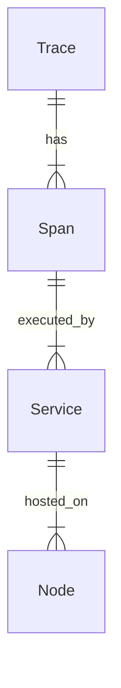
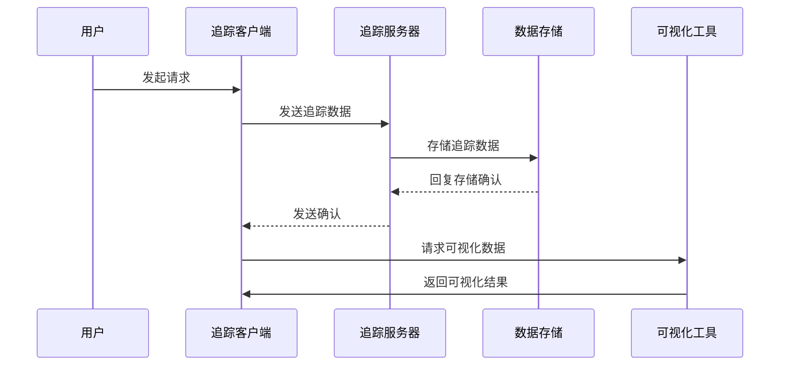

                 

## 第1章：分布式追踪的基本概念

### 1.1 问题背景

随着云计算和分布式系统的广泛应用，现代互联网应用变得越来越复杂。传统的单体应用逐渐被分布式架构所取代，这使得系统的各个组件可以独立部署和扩展。然而，这种分布式化带来了新的挑战，特别是在性能优化和故障排查方面。

在分布式系统中，多个组件协同工作，数据的流动和传输变得更加复杂。单个组件的性能优化可能无法解决全局性能问题，因此需要对整个分布式系统的性能进行监控和分析。分布式追踪（Distributed Tracing）技术应运而生，它提供了对分布式系统中请求路径的追踪能力，帮助开发者深入了解系统的性能瓶颈，从而进行优化。

### 1.2 问题描述

分布式追踪的主要问题是：
- **请求路径不透明**：在分布式系统中，一个请求可能跨越多个服务节点，路径不透明，难以追踪。
- **性能瓶颈定位困难**：系统中的性能问题可能是由于网络延迟、服务调用次数过多、数据库查询效率低下等原因引起，但很难直接定位。
- **故障排查效率低**：当系统出现故障时，传统的日志分析方式效率低下，难以快速定位问题。

### 1.3 问题解决

分布式追踪技术通过以下方式解决上述问题：
- **请求路径可视化**：分布式追踪能够记录请求的完整路径，并提供可视化的数据展示，使得开发者可以清晰地看到请求如何穿越分布式系统。
- **性能指标监控**：分布式追踪可以收集每个节点的性能指标，如响应时间、CPU使用率、内存占用等，帮助开发者定位性能瓶颈。
- **故障快速排查**：分布式追踪可以提供故障发生的详细日志，包括请求路径、相关节点的性能数据等，使得故障排查更加高效。

### 1.4 边界与外延

分布式追踪与以下技术密切相关：
- **监控与日志分析**：分布式追踪是对监控和日志分析的有力补充，但并不替代它们。
- **性能调优**：分布式追踪的结果可以为性能调优提供重要的数据支持。
- **服务网格**：服务网格（如Istio）提供了分布式追踪的框架，使得分布式追踪更加便捷和高效。

### 1.5 概念结构与核心要素组成

分布式追踪的核心概念和结构包括：
- **Trace**：分布式追踪的一个基本单位，代表了一个请求的完整生命周期。
- **Span**：Trace中的子部分，代表了请求在某个节点上的执行过程。
- **Service**：提供服务的实体，通常是一个微服务。
- **Sampler**：采样器，决定了哪些请求会被记录到追踪系统中。
- **Exporter**：数据导出器，负责将追踪数据导出到外部存储或监控系统。
- **Backend**：后端存储，用于存储和分析追踪数据。

### 1.6 核心概念原理

- **Trace**：Trace是分布式追踪的基本单位，代表了一个请求的完整生命周期。它由多个Span组成，每个Span代表了请求在某个节点上的执行过程。Trace通常有一个全局唯一的标识符（Trace ID），用于关联整个请求的生命周期。
- **Span**：Span是Trace的子部分，代表了请求在某个节点上的执行过程。每个Span都有开始和结束时间、服务名、节点标识等属性。Span之间通过Parent-Span关系进行关联，形成一个有向无环图（DAG）。
- **Service**：Service是提供服务的实体，通常是一个微服务。Service可以由多个节点组成，每个节点都可以是一个独立的实例。
- **Sampler**：Sampler是采样器，决定了哪些请求会被记录到追踪系统中。常见的采样策略包括随机采样、比例采样等。
- **Exporter**：Exporter是数据导出器，负责将追踪数据导出到外部存储或监控系统。Exporter通常是一个独立的组件，可以将追踪数据发送到不同的存储系统，如InfluxDB、Kafka等。
- **Backend**：Backend是后端存储，用于存储和分析追踪数据。Backend可以是各种数据存储系统，如MySQL、Elasticsearch、Kibana等。

### 1.7 概念属性特征对比表格

| 概念        | 定义                                                         | 属性                                                         | 特征                                                         |
| ----------- | ------------------------------------------------------------ | ------------------------------------------------------------ | ------------------------------------------------------------ |
| Trace       | 分布式追踪的基本单位，代表了一个请求的完整生命周期             | - Trace ID：全局唯一的标识符 - Start Time：开始时间 - End Time：结束时间 | - 全局唯一性 - 包含多个Span - 可追溯性                 |
| Span        | Trace中的子部分，代表了请求在某个节点上的执行过程             | - Span ID：全局唯一的标识符 - Parent Span ID：父Span标识符 - Start Time：开始时间 - End Time：结束时间 - Service Name：服务名 - Node Identifier：节点标识 | - 基础执行单元 - 关联关系 - 性能指标                   |
| Service     | 提供服务的实体，通常是一个微服务                             | - Service Name：服务名 - Node List：节点列表               | - 服务归类 - 分布式环境中的节点管理                           |
| Sampler     | 采样器，决定了哪些请求会被记录到追踪系统中                   | - Sampling Rate：采样比例 - Sampling Strategy：采样策略 | - 高效性 - 灵活性                                           |
| Exporter    | 数据导出器，负责将追踪数据导出到外部存储或监控系统             | - Export Format：导出格式 - Export Interval：导出间隔   | - 可扩展性 - 可定制性                                       |
| Backend     | 后端存储，用于存储和分析追踪数据                             | - Storage Type：存储类型 - Analysis Tools：分析工具     | - 数据安全性 - 高性能分析                                     |

### 1.8 ER实体关系图架构

### 1.9 分布式追踪工具对比

在分布式追踪领域，存在多种工具可供选择，如OpenTracing、OpenCensus、Jaeger、Zipkin等。以下是这些工具的对比表格：

| 工具            | 定义                                                         | 支持语言                   | 特点                                                         | 使用场景                   |
| --------------- | ------------------------------------------------------------ | -------------------------- | ------------------------------------------------------------ | -------------------------- |
| OpenTracing     | 一个分布式追踪标准，提供了一组API和定义，允许实现不同的分布式追踪系统 | Java、Go、C++、Python等     | - 标准化接口 - 支持多种追踪系统实现                       | 多语言支持的分布式系统      |
| OpenCensus      | 开放式跟踪、收集和报告框架，由Google开源                     | Java、Go、Python、Node.js等 | - 高度可配置 - 支持多种数据收集和报告方式                 | 复杂分布式系统性能监控      |
| Jaeger          | 一个开源的分布式追踪系统，提供追踪数据的可视化                 | Go、Java、Node.js、C++等    | - 易于使用 - 提供实时可视化分析功能                       | 分布式系统性能分析和故障排查 |
| Zipkin          | 一个分布式追踪系统，提供追踪数据的收集、存储和可视化           | Java、Go、Python、Node.js等 | - 易于集成 - 提供丰富的分析功能                         | 分布式系统性能监控和调优    |

### 1.10 分布式追踪系统架构

分布式追踪系统通常由以下几个核心组件组成：

1. **追踪客户端**：负责在分布式系统的各个节点上收集追踪数据，并将数据发送到追踪服务器。
2. **追踪服务器**：负责接收、存储和处理追踪数据，并提供查询和分析功能。
3. **数据存储**：用于存储追踪数据，支持快速查询和分析。
4. **可视化工具**：用于展示追踪数据，帮助开发者了解分布式系统的性能和故障情况。

以下是分布式追踪系统的基本架构：

### 1.11 分布式追踪的基本原理

分布式追踪的基本原理可以概括为以下几个步骤：

1. **数据采集**：在分布式系统的各个节点上部署追踪客户端，客户端会记录每个请求的执行情况，包括开始和结束时间、调用链信息、性能指标等。
2. **数据传输**：追踪客户端将采集到的数据发送到追踪服务器，通常使用HTTP协议进行传输。
3. **数据存储**：追踪服务器接收并存储追踪数据，可以将数据存储在内存、数据库或文件系统等不同类型的存储系统中。
4. **数据分析**：追踪服务器提供查询和分析接口，开发者可以使用这些接口对追踪数据进行查询和分析，以了解系统的性能和故障情况。
5. **数据可视化**：可视化工具将追踪数据转换成图表和报表，帮助开发者直观地了解系统的运行状况。

### 1.12 分布式追踪的应用场景

分布式追踪可以在以下场景中发挥重要作用：

- **性能优化**：通过分析追踪数据，可以定位系统中的性能瓶颈，进行针对性的优化。
- **故障排查**：当系统出现故障时，分布式追踪可以帮助快速定位故障节点，缩短故障排查时间。
- **服务治理**：分布式追踪可以提供服务的依赖关系和调用链信息，有助于进行服务治理和优化。
- **监控告警**：通过分析追踪数据，可以设置监控告警，提前发现潜在的性能问题和故障风险。

### 1.13 小结

分布式追踪是分布式系统中不可或缺的一部分，它提供了对系统性能和故障的全面监控和分析能力。通过对分布式追踪的基本概念、原理和应用场景的深入理解，开发者可以更好地优化分布式系统的性能，提高系统的可靠性和可维护性。在下一章中，我们将详细探讨分布式追踪的核心概念和联系，帮助读者建立更加清晰的认识。

