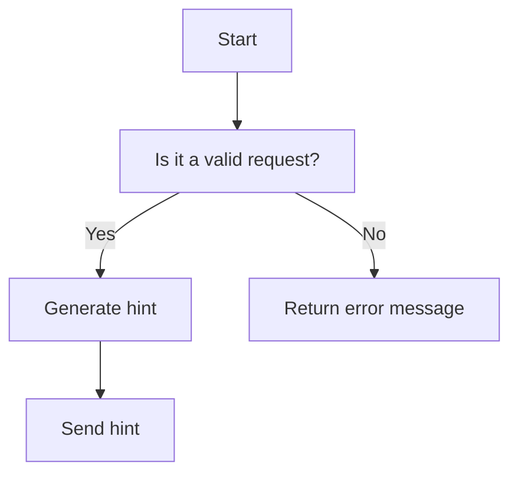

                 

### 动态提示：根据对话历史调整策略

---

#### 关键词：
- 动态提示
- 对话历史
- 策略调整
- 对话系统
- 人工智能

#### 摘要：
本文将探讨动态提示在对话系统中的应用，重点分析根据对话历史调整策略的技术和实现方法。通过深入解析对话系统的背景、核心概念以及动态提示技术，本文旨在为开发者提供全面的技术指南，帮助优化对话系统的用户体验和智能性。

### 目录大纲

**动态提示：根据对话历史调整策略**

----------------------------------------------------------------

# 第一部分: 问题背景与核心概念

## 1.1 问题背景

### 1.1.1 对话系统的发展历程

对话系统，也被称为聊天机器人或虚拟助手，其发展经历了多个阶段。最早期的对话系统主要基于规则和模板，如ELIZA，这类系统主要通过预定义的规则来生成回答，缺乏灵活性。随着自然语言处理（NLP）和机器学习技术的发展，基于统计方法和深度学习模型的对话系统逐渐成为主流，它们能够更好地理解自然语言并生成更为自然的回复。

### 1.1.2 动态提示的重要性

动态提示是指在对话过程中，系统能够根据用户的当前意图、上下文信息以及历史对话记录，实时调整提示内容，以提供更精准、更个性化的服务。动态提示不仅能显著提高用户体验，还能增强对话系统的智能性，使其能够更好地适应用户的需求。

### 1.1.3 动态提示面临的挑战

尽管动态提示在理论上具有显著优势，但在实际应用中仍面临诸多挑战。首先是对话历史信息的处理，如何高效地存储、检索和分析对话历史数据是一个技术难点。其次是策略调整的实时性，如何确保动态提示能够在极短的时间内完成计算并生成合适的提示内容，这对系统的计算性能提出了高要求。

## 1.2 核心概念

### 1.2.1 动态提示的概念

动态提示是指对话系统能够在对话过程中，根据用户的当前状态和历史行为，动态生成与用户意图和需求更匹配的提示信息。其功能特点包括实时性、个性化、灵活性等。

### 1.2.2 对话历史的重要性

对话历史包含了用户在对话过程中的所有交互记录，包括用户输入、系统回复等。对话历史对于动态提示至关重要，因为它提供了上下文信息，有助于系统更好地理解用户的意图。

### 1.2.3 策略调整的概念

策略调整是指对话系统在运行过程中，根据用户的反馈和对话结果，实时调整自己的行为和回复策略，以优化用户体验。策略调整的类型可以分为基于规则的调整和基于机器学习的调整。

## 1.3 本章小结

本部分介绍了动态提示在对话系统中的重要性以及所面临的挑战。接下来，我们将深入探讨动态提示技术的具体实现方法和应用场景。

----------------------------------------------------------------

# 第一部分：问题背景与核心概念

## 1.1 问题背景

对话系统的发展历程

### 1.1.1 传统对话系统

最早的对话系统出现在20世纪50年代，如JOHNNY和ELIZA。这些系统基于规则，即通过预定义的规则来匹配用户的输入并生成回复。这些系统虽然简单，但存在明显的局限性，无法处理复杂或非预期的用户请求。

### 1.1.2 基于统计和机器学习的对话系统

随着自然语言处理（NLP）和机器学习技术的发展，现代对话系统开始采用统计模型和深度学习算法。例如，朴素贝叶斯分类器、决策树、支持向量机以及近年来的神经网络模型（如RNN、LSTM、BERT等）都被广泛应用于对话系统中。这些系统能够从大量数据中学习并生成更为自然的回复，显著提升了用户体验。

### 1.1.3 对话系统的现状与趋势

当前，对话系统在各个领域得到了广泛应用，包括客户服务、在线咨询、智能家居、金融交易等。随着人工智能技术的不断发展，对话系统正在向更加智能、更加个性化的方向发展。这包括多模态交互（文本、语音、图像等）、上下文感知、情感识别等新兴技术的应用。

## 1.2 动态提示的重要性

### 1.2.1 提高用户体验

动态提示能够根据用户的意图和上下文信息，实时生成与用户需求更匹配的提示信息，从而提高用户的使用体验。例如，在客户服务场景中，动态提示可以帮助用户更快地找到所需的服务或信息，减少用户等待时间和操作步骤。

### 1.2.2 增强对话系统的智能性

动态提示技术使得对话系统能够更好地理解用户的意图和需求，从而提高其智能性。通过分析对话历史，系统可以不断优化自己的行为和回复策略，使其在与用户的互动中表现得更加自然和高效。

## 1.3 动态提示面临的挑战

### 1.3.1 对话历史信息的处理

对话历史是动态提示的关键信息来源，如何高效地存储、检索和分析对话历史数据是一个重要的技术挑战。此外，对话历史数据通常包含大量非结构化信息，如文本、语音和图像等，这增加了处理的复杂性。

### 1.3.2 策略调整的实时性

动态提示需要实时根据对话历史调整策略，这要求系统具备高计算性能和低延迟。在实际应用中，如何在有限的计算资源下实现高效的策略调整是一个关键问题。

## 1.4 核心概念

### 1.4.1 动态提示的概念

动态提示是指对话系统能够在对话过程中，根据用户的当前状态、历史行为和上下文信息，实时生成与用户意图和需求更匹配的提示信息。

### 1.4.2 对话历史的重要性

对话历史包含了用户在对话过程中的所有交互记录，包括用户输入、系统回复等。对话历史对于动态提示至关重要，因为它提供了上下文信息，有助于系统更好地理解用户的意图。

### 1.4.3 策略调整的概念

策略调整是指对话系统能够根据用户的反馈和对话结果，实时调整自己的行为和回复策略，以优化用户体验。策略调整的类型可以分为基于规则的调整和基于机器学习的调整。

## 1.5 本章小结

本部分介绍了对话系统的发展历程、动态提示的重要性以及所面临的挑战。在下一部分中，我们将深入探讨动态提示技术的具体实现方法和应用场景。

----------------------------------------------------------------

# 第一部分：问题背景与核心概念

## 1.1 问题背景

对话系统的发展历程

### 1.1.1 传统对话系统

最早的对话系统是基于规则的系统，如ELIZA。这类系统通过预定义的规则来生成回答，缺乏灵活性。用户输入会被分解为关键词，然后通过规则匹配来生成回复。这种方法的局限性在于，它难以应对复杂的对话场景和非预期的用户请求。

### 1.1.2 基于统计和机器学习的对话系统

随着自然语言处理（NLP）和机器学习技术的发展，现代对话系统开始采用更为先进的方法。例如，朴素贝叶斯分类器、决策树、支持向量机以及近年来的神经网络模型（如RNN、LSTM、BERT等）都被广泛应用于对话系统中。这些系统通过从大量数据中学习，能够生成更为自然的回复，并且能够处理更为复杂的对话场景。

### 1.1.3 对话系统的现状与趋势

当前，对话系统在各个领域得到了广泛应用，包括客户服务、在线咨询、智能家居、金融交易等。随着人工智能技术的不断发展，对话系统正在向更加智能、更加个性化的方向发展。新兴技术如多模态交互、上下文感知、情感识别等正在被引入到对话系统中，以提供更为优质的用户体验。

## 1.2 动态提示的重要性

### 1.2.1 提高用户体验

动态提示能够根据用户的意图和上下文信息，实时生成与用户需求更匹配的提示信息，从而提高用户的使用体验。例如，在客户服务场景中，动态提示可以帮助用户更快地找到所需的服务或信息，减少用户等待时间和操作步骤。在聊天机器人中，动态提示可以生成更符合用户情绪和期望的回复，从而增强用户与机器人的互动体验。

### 1.2.2 增强对话系统的智能性

动态提示技术使得对话系统能够更好地理解用户的意图和需求，从而提高其智能性。通过分析对话历史，系统可以不断优化自己的行为和回复策略，使其在与用户的互动中表现得更加自然和高效。例如，系统可以根据用户的反馈调整推荐的商品，或者根据用户的历史订单提供个性化的服务。

## 1.3 动态提示面临的挑战

### 1.3.1 对话历史信息的处理

对话历史是动态提示的关键信息来源，如何高效地存储、检索和分析对话历史数据是一个重要的技术挑战。对话历史数据通常包含大量非结构化信息，如文本、语音和图像等，这增加了处理的复杂性。此外，如何确保对话历史数据的隐私和安全也是一个重要问题。

### 1.3.2 策略调整的实时性

动态提示需要实时根据对话历史调整策略，这要求系统具备高计算性能和低延迟。在实际应用中，如何在有限的计算资源下实现高效的策略调整是一个关键问题。此外，如何保证策略调整的准确性，以避免生成不合适的提示信息，也是一个挑战。

## 1.4 核心概念

### 1.4.1 动态提示的概念

动态提示是指对话系统能够在对话过程中，根据用户的当前状态、历史行为和上下文信息，实时生成与用户意图和需求更匹配的提示信息。它包括以下几个关键要素：

1. **用户状态**：用户的当前状态，如位置、时间、情绪等。
2. **历史行为**：用户在之前的对话中的行为记录。
3. **上下文信息**：对话的上下文，包括对话历史和用户输入。
4. **提示生成**：根据以上信息，动态生成合适的提示内容。

### 1.4.2 对话历史的重要性

对话历史包含了用户在对话过程中的所有交互记录，包括用户输入、系统回复等。对话历史对于动态提示至关重要，因为它提供了上下文信息，有助于系统更好地理解用户的意图。对话历史还包括以下信息：

1. **用户输入**：用户的原始输入，可以是文本、语音或图像。
2. **系统回复**：系统根据用户输入生成的回复。
3. **交互时间**：用户输入和系统回复的时间戳。
4. **交互上下文**：对话过程中的上下文信息，如用户提到的主题、问题等。

### 1.4.3 策略调整的概念

策略调整是指对话系统能够根据用户的反馈和对话结果，实时调整自己的行为和回复策略，以优化用户体验。策略调整的类型可以分为基于规则的调整和基于机器学习的调整。

1. **基于规则的调整**：系统通过预定义的规则来调整行为和回复策略。这种方法简单直观，但灵活性较低，难以应对复杂的对话场景。
2. **基于机器学习的调整**：系统通过学习用户的历史行为和反馈来调整策略。这种方法更加灵活，能够根据用户的行为模式进行自适应调整，但需要大量的数据和计算资源。

## 1.5 本章小结

本部分介绍了对话系统的发展历程、动态提示的重要性以及所面临的挑战。在下一部分中，我们将深入探讨动态提示技术的具体实现方法和应用场景。

----------------------------------------------------------------

# 第二部分：动态提示技术

## 2.1 动态提示技术概述

### 2.1.1 动态提示技术的分类

动态提示技术可以根据实现方法的不同，分为基于规则的方法和基于机器学习的方法。

#### 2.1.1.1 基于规则的方法

基于规则的方法是指通过预定义的规则来生成动态提示。这种方法通常包括以下几个步骤：

1. **规则定义**：根据对话系统的需求和业务逻辑，定义一系列的规则。
2. **规则匹配**：在对话过程中，根据用户的输入和对话历史，匹配预定义的规则。
3. **提示生成**：根据匹配到的规则，生成相应的提示信息。

优点：
- **简单直观**：规则定义清晰，易于理解和维护。
- **可控性强**：通过规则可以精确控制系统的行为。

局限性：
- **灵活性差**：难以应对复杂的对话场景和非预期的用户请求。
- **维护成本高**：随着对话系统的复杂度增加，规则数量会迅速膨胀，维护成本高。

#### 2.1.1.2 基于机器学习的方法

基于机器学习的方法是指通过机器学习模型来自动生成动态提示。这种方法通常包括以下几个步骤：

1. **数据收集**：收集对话历史数据，包括用户输入、系统回复等。
2. **特征提取**：从对话历史数据中提取特征，如关键词、情感倾向、交互时间等。
3. **模型训练**：使用提取到的特征，训练机器学习模型，如决策树、支持向量机、神经网络等。
4. **提示生成**：在对话过程中，使用训练好的模型来生成动态提示。

优点：
- **灵活性高**：能够根据用户的历史行为和反馈进行自适应调整，应对复杂的对话场景。
- **自动生成**：减少了对规则定义的依赖，降低了维护成本。

局限性：
- **数据需求大**：需要大量的对话历史数据来训练模型。
- **计算复杂度高**：模型训练和预测过程通常需要较大的计算资源。

### 2.1.2 动态提示技术的优点与局限性

#### 2.1.2.1 优点

- **提高用户体验**：动态提示能够根据用户的意图和上下文信息，实时生成与用户需求更匹配的提示信息，从而提高用户的使用体验。
- **增强系统智能性**：通过分析对话历史，系统可以不断优化自己的行为和回复策略，使其在与用户的互动中表现得更加自然和高效。
- **自适应调整**：动态提示技术能够根据用户的行为和反馈进行自适应调整，使得对话系统能够更好地适应不同的用户需求。

#### 2.1.2.2 局限性

- **数据处理复杂**：动态提示需要处理大量的对话历史数据，如何高效地存储、检索和分析这些数据是一个挑战。
- **计算性能要求高**：动态提示需要实时根据对话历史调整策略，这要求系统具备高计算性能和低延迟。
- **数据隐私和安全**：对话历史数据通常包含用户的敏感信息，如何确保数据的安全和隐私也是一个重要问题。

## 2.2 对话历史处理

### 2.2.1 对话历史数据的收集

对话历史数据的收集是动态提示的基础。对话历史数据可以从多个渠道获取，包括用户输入、系统回复、交互时间、用户行为等。以下是一些常见的收集方法：

1. **日志记录**：在对话系统中，可以记录每次交互的详细信息，包括用户输入、系统回复、交互时间等。
2. **数据库存储**：将对话历史数据存储在数据库中，便于后续的检索和分析。
3. **API接口**：通过API接口收集来自第三方系统的对话数据。

### 2.2.2 对话历史信息的提取

对话历史信息的提取是动态提示的关键步骤。提取的信息应包括用户输入、系统回复、交互时间、上下文等。以下是一些常用的提取方法：

1. **关键词提取**：从用户输入和系统回复中提取关键词，如主题词、动词、名词等。
2. **情感分析**：分析用户输入和系统回复中的情感倾向，如正面、负面、中性等。
3. **上下文理解**：理解对话的上下文信息，包括对话的主题、用户提到的关键问题等。

### 2.2.3 对话历史数据的存储与管理

对话历史数据的存储与管理是动态提示的基础。以下是一些常用的存储与管理方法：

1. **关系型数据库**：使用关系型数据库（如MySQL、PostgreSQL）存储对话历史数据，便于查询和管理。
2. **NoSQL数据库**：使用NoSQL数据库（如MongoDB、Cassandra）存储对话历史数据，适用于大规模、高并发的场景。
3. **数据索引**：建立数据索引，提高查询效率。
4. **数据加密**：对敏感数据进行加密，确保数据安全。

## 2.3 策略调整方法

### 2.3.1 基于规则的策略调整

基于规则的策略调整是指通过预定义的规则来调整系统的行为和回复策略。这种方法通常包括以下几个步骤：

1. **规则定义**：根据业务需求和用户行为，定义一系列的规则。
2. **规则匹配**：在对话过程中，根据用户的输入和对话历史，匹配预定义的规则。
3. **策略调整**：根据匹配到的规则，调整系统的行为和回复策略。

优点：
- **简单易用**：规则定义清晰，易于理解和维护。
- **高效性**：规则匹配和策略调整过程相对简单，计算复杂度较低。

局限性：
- **灵活性差**：难以应对复杂的对话场景和非预期的用户请求。

### 2.3.2 基于机器学习的策略调整

基于机器学习的策略调整是指通过机器学习模型来自动调整系统的行为和回复策略。这种方法通常包括以下几个步骤：

1. **数据收集**：收集对话历史数据，包括用户输入、系统回复等。
2. **特征提取**：从对话历史数据中提取特征，如关键词、情感倾向、交互时间等。
3. **模型训练**：使用提取到的特征，训练机器学习模型，如决策树、支持向量机、神经网络等。
4. **策略调整**：在对话过程中，使用训练好的模型来调整系统的行为和回复策略。

优点：
- **灵活性高**：能够根据用户的历史行为和反馈进行自适应调整，应对复杂的对话场景。
- **自动生成**：减少了对规则定义的依赖，降低了维护成本。

局限性：
- **数据需求大**：需要大量的对话历史数据来训练模型。
- **计算复杂度高**：模型训练和预测过程通常需要较大的计算资源。

### 2.3.3 混合策略调整方法

混合策略调整方法是指结合基于规则的方法和基于机器学习的方法，以实现更灵活、更智能的动态提示。这种方法通常包括以下几个步骤：

1. **规则定义**：定义一系列的预定义规则。
2. **模型训练**：使用对话历史数据，训练机器学习模型。
3. **规则匹配**：在对话过程中，首先使用预定义的规则进行匹配。
4. **模型预测**：如果规则匹配失败，使用训练好的机器学习模型进行预测。
5. **策略调整**：根据规则匹配结果和模型预测结果，综合调整系统的行为和回复策略。

优点：
- **灵活性强**：结合了基于规则的简单性和基于机器学习的灵活性。
- **智能性高**：能够根据用户的历史行为和反馈进行自适应调整。

局限性：
- **计算复杂度高**：规则匹配和模型预测过程都需要较大的计算资源。

## 2.4 本章小结

本部分介绍了动态提示技术的分类、优点与局限性，以及对话历史处理和策略调整的方法。在下一部分中，我们将探讨动态提示技术在具体应用场景中的实现方法和优化策略。

----------------------------------------------------------------

# 动态提示技术：深入剖析与实现

## 2.1 动态提示技术的分类

动态提示技术主要分为基于规则的方法和基于机器学习的方法。下面我们分别对这些方法进行详细分析。

### 2.1.1 基于规则的方法

#### **规则定义**

基于规则的方法通过预定义一系列规则来生成动态提示。规则通常由条件（条件）和动作（动作）组成。例如：

- **条件**：用户提问包含“订单状态”。
- **动作**：提示用户订单的最新状态。

#### **规则匹配**

在对话过程中，系统会根据用户输入和历史对话记录，匹配预定义的规则。规则匹配通常采用前向或后向匹配策略。前向匹配从左到右逐个字符匹配，后向匹配从右到左逐个字符匹配。

#### **规则优先级**

当多个规则同时匹配时，系统需要根据规则优先级来决定执行哪个规则。优先级通常通过规则权重来定义，权重越高，优先级越高。

#### **规则优缺点**

- **优点**：简单易理解，规则定义明确，易于维护。
- **缺点**：灵活性较差，难以应对复杂和多变的对话场景。

### 2.1.2 基于机器学习的方法

#### **数据收集**

基于机器学习的方法需要大量对话历史数据来进行训练。数据收集通常包括用户输入、系统回复、用户反馈等。

#### **特征提取**

特征提取是关键步骤，从对话历史数据中提取出有用的特征，如关键词、情感倾向、上下文等。常用的特征提取方法包括词袋模型、TF-IDF、Word2Vec等。

#### **模型选择**

根据对话系统的需求和数据特点，选择合适的机器学习模型。常见的模型包括朴素贝叶斯、决策树、支持向量机（SVM）、循环神经网络（RNN）、长短期记忆网络（LSTM）和Transformer等。

#### **模型训练**

使用提取到的特征和对话历史数据，训练机器学习模型。训练过程包括数据预处理、模型选择、参数调优等。

#### **模型评估**

通过交叉验证、网格搜索等方法，评估模型的性能。常用的评估指标包括准确率、召回率、F1值等。

#### **模型优缺点**

- **优点**：灵活性高，能够根据用户行为和反馈进行自适应调整。
- **缺点**：需要大量数据，训练过程复杂，计算资源消耗大。

### 2.1.3 混合策略调整方法

混合策略调整方法结合了基于规则的方法和基于机器学习的方法，以提高系统的灵活性和智能性。

#### **混合策略优点**

- **优点**：结合了规则方法和机器学习方法的优点，灵活性高，能够应对复杂和多变的对话场景。

#### **混合策略缺点**

- **缺点**：规则匹配和模型预测过程需要较大的计算资源，系统复杂度较高。

## 2.2 对话历史处理

对话历史处理是动态提示的核心部分，包括数据收集、数据预处理、数据存储、数据索引等。

### 2.2.1 对话历史数据的收集

对话历史数据的收集可以通过以下方法实现：

- **日志记录**：在系统中记录每次交互的详细信息，包括用户输入、系统回复、交互时间等。
- **API接口**：通过API接口收集来自第三方系统的对话数据。
- **用户反馈**：收集用户对系统回复的反馈，如点赞、评论、评分等。

### 2.2.2 数据预处理

数据预处理是确保数据质量和提高模型性能的重要步骤。常用的数据预处理方法包括：

- **去噪**：去除无关的噪声信息，如特殊字符、停用词等。
- **分词**：将文本数据分割成单词或短语。
- **词性标注**：标注每个单词的词性，如名词、动词、形容词等。
- **停用词过滤**：去除常见的停用词，如“的”、“是”、“了”等。

### 2.2.3 数据存储

对话历史数据可以存储在关系型数据库（如MySQL、PostgreSQL）或NoSQL数据库（如MongoDB、Cassandra）中。选择合适的数据库取决于系统的需求和数据规模。

### 2.2.4 数据索引

建立数据索引可以提高查询效率。常用的索引技术包括全文索引、倒排索引、布隆过滤器等。

## 2.3 策略调整方法

策略调整方法可以分为基于规则的调整和基于机器学习的调整。以下分别介绍这两种方法。

### 2.3.1 基于规则的策略调整

基于规则的策略调整通过预定义的规则来调整系统行为。这种方法通常包括以下几个步骤：

1. **规则定义**：根据业务需求和用户行为，定义一系列的规则。
2. **规则匹配**：在对话过程中，根据用户输入和历史记录，匹配预定义的规则。
3. **策略调整**：根据规则匹配结果，调整系统行为。

### 2.3.2 基于机器学习的策略调整

基于机器学习的策略调整通过机器学习模型来自动调整系统行为。这种方法通常包括以下几个步骤：

1. **数据收集**：收集对话历史数据，包括用户输入、系统回复等。
2. **特征提取**：从对话历史数据中提取特征，如关键词、情感倾向、交互时间等。
3. **模型训练**：使用提取到的特征，训练机器学习模型。
4. **策略调整**：在对话过程中，使用训练好的模型，根据用户输入和历史记录，自动调整系统行为。

## 2.4 本章小结

本部分详细介绍了动态提示技术的分类、对话历史处理和策略调整方法。在下一部分中，我们将探讨动态提示技术在具体应用场景中的实现方法和优化策略。

----------------------------------------------------------------

# 第三部分：动态提示应用场景

## 3.1 在线客服系统

### 3.1.1 在线客服系统的概述

在线客服系统是一种基于互联网的实时客户服务系统，通过文字、语音或视频等多种方式，为客户提供即时、高效、个性化的服务。它广泛应用于电子商务、金融、电信、旅游等行业，旨在提升客户满意度、降低运营成本并增强企业竞争力。

### 3.1.2 动态提示在在线客服系统中的应用

动态提示在在线客服系统中扮演着至关重要的角色，它能够根据用户的提问、行为和偏好，提供更加精准和个性化的服务。具体应用如下：

- **智能分类与引导**：当用户提出问题时，系统可以基于对话历史和当前上下文，自动将问题分类到相应的主题，并提供相关的知识库或FAQ链接，帮助用户快速找到答案。
- **情感分析**：通过情感分析技术，系统可以识别用户的情绪，如愤怒、失望或满意，并相应地调整回复策略。例如，当用户表达出愤怒情绪时，系统可能会提供更为耐心和同理心的回复。
- **个性化推荐**：系统可以根据用户的购买历史、浏览记录等，推荐相关的产品或服务，提高销售转化率。例如，当用户询问某个产品的售后服务时，系统可以推荐其他相关产品。

### 3.1.3 动态提示在在线客服系统中的实现原理

动态提示在在线客服系统中的实现原理主要包括以下几个步骤：

1. **对话历史收集**：系统会收集用户的所有对话记录，包括用户输入、系统回复、交互时间等。
2. **数据预处理**：对对话历史数据进行分析，提取关键信息，如关键词、情感倾向等。
3. **特征提取**：从预处理后的数据中提取特征，如用户提问的主题、情感倾向、交互时长等。
4. **模型训练**：使用提取到的特征，训练机器学习模型，如情感分析模型、分类模型等。
5. **动态提示生成**：在用户提问时，系统会根据用户的当前状态和历史行为，实时生成相应的提示信息。

### 3.1.4 动态提示在在线客服系统中的案例分析

以下是一个在线客服系统中动态提示的案例：

- **场景**：用户在电商平台上询问关于某款智能手机的售后服务。
- **对话历史**：用户之前询问过相同品牌的其他手机，对售后服务表示满意。
- **动态提示**：系统识别到用户的提问，结合对话历史，自动生成以下提示：“您好，感谢您选择我们的产品。关于售后服务，我们提供一年的保修，并在保修期内提供免费维修服务。如果您有任何疑问，可以随时联系我们的客服团队。”

通过以上案例，我们可以看到动态提示如何根据用户的历史行为和当前需求，提供个性化、精准的服务。

### 3.1.5 在线客服系统的优化策略

为了进一步提升在线客服系统的用户体验和效率，可以采取以下优化策略：

- **用户行为分析**：通过分析用户的行为数据，如浏览记录、购买历史等，了解用户偏好，为用户提供更加个性化的服务。
- **实时反馈机制**：建立实时反馈机制，用户可以在对话结束后对客服质量进行评价，系统可以根据用户的反馈进行自我优化。
- **智能路由**：使用机器学习算法，根据用户提问的内容和客服代表的专业领域，自动分配最合适的客服代表，提高解决问题的效率。
- **多渠道集成**：集成多种沟通渠道，如文字、语音、视频等，为用户提供更加灵活的沟通方式。

## 3.2 聊天机器人

### 3.2.1 聊天机器人的概述

聊天机器人是一种能够通过自然语言与用户进行交互的软件程序，广泛应用于社交媒体、客户服务、在线娱乐等领域。聊天机器人能够模拟人类的对话方式，提供24/7的在线服务，提高用户的满意度和企业的工作效率。

### 3.2.2 动态提示在聊天机器人中的应用

动态提示在聊天机器人中起到关键作用，它能够根据用户的意图、上下文和情绪，提供个性化的回复和互动。以下是一些具体应用场景：

- **意图识别**：当用户提出问题时，系统可以基于对话历史和当前上下文，自动识别用户的意图。例如，当用户询问天气时，系统会识别出这是一个查询天气信息的意图。
- **上下文维持**：系统可以维持对话的上下文，避免重复提问或中断对话。例如，当用户询问某个订单的状态时，系统会记住之前的订单信息，并在后续对话中提供相关细节。
- **情感分析**：通过情感分析技术，系统可以识别用户的情绪，如兴奋、厌烦等，并相应地调整回复策略，提供更加人性化的互动。

### 3.2.3 动态提示在聊天机器人中的实现原理

动态提示在聊天机器人中的实现原理主要包括以下几个步骤：

1. **意图识别**：使用自然语言处理技术，分析用户的输入，识别用户的意图。
2. **上下文理解**：根据对话历史和当前上下文，理解用户的意图和需求。
3. **动态提示生成**：根据意图识别和上下文理解结果，生成相应的动态提示信息。
4. **回复生成**：使用生成式模型（如GPT-3、BERT等）生成自然语言回复。

### 3.2.4 动态提示在聊天机器人中的案例分析

以下是一个聊天机器人的案例：

- **场景**：用户在社交媒体上询问某个明星的演唱会门票购买信息。
- **对话历史**：用户之前询问过相同明星的其他演唱会信息。
- **动态提示**：系统识别到用户的提问，结合对话历史，自动生成以下提示：“您好，关于**明星**的演唱会门票，我们为您推荐以下几个购买渠道：**渠道1**、**渠道2**和**渠道3**。请根据您的需求选择购买。如果您有其他问题，请随时告诉我。”

通过以上案例，我们可以看到动态提示如何根据用户的历史行为和当前需求，提供个性化、连贯的互动。

### 3.2.5 聊天机器人的优化策略

为了提升聊天机器人的用户体验和交互质量，可以采取以下优化策略：

- **多模态交互**：支持文本、语音、图像等多种交互方式，为用户提供更加自然的沟通体验。
- **用户行为分析**：通过分析用户的对话数据，了解用户偏好和行为模式，为用户提供更加个性化的服务。
- **实时反馈机制**：建立实时反馈机制，用户可以在对话结束后对机器人进行评价，系统可以根据用户的反馈进行自我优化。
- **知识库更新**：定期更新和扩展知识库，确保机器人能够应对各种新问题和场景。

## 3.3 社交媒体平台

### 3.3.1 社交媒体平台的概述

社交媒体平台如Facebook、Twitter、Instagram等，已成为人们日常生活的重要组成部分。它们不仅提供了分享和获取信息的渠道，还成为了用户互动、表达和娱乐的重要平台。社交媒体平台的核心功能包括发布内容、评论、点赞、分享等，以及提供个性化推荐和广告推送。

### 3.3.2 动态提示在社交媒体平台中的应用

动态提示在社交媒体平台中具有广泛应用，能够根据用户的行为、兴趣和历史，提供个性化的推荐和互动提示。以下是一些具体应用场景：

- **个性化推荐**：系统可以基于用户的浏览历史、点赞、评论等行为，推荐用户可能感兴趣的内容，如文章、视频、图片等。
- **互动提示**：系统可以提醒用户参与活动、评论好友的帖子、关注新的账号等，以增强用户互动和参与度。
- **广告推送**：系统可以根据用户的兴趣和行为，推送相关的广告内容，提高广告的投放效果。

### 3.3.3 动态提示在社交媒体平台中的实现原理

动态提示在社交媒体平台中的实现原理主要包括以下几个步骤：

1. **用户行为数据收集**：系统会收集用户的浏览记录、点赞、评论等行为数据。
2. **兴趣和偏好分析**：通过分析用户行为数据，了解用户的兴趣和偏好。
3. **内容推荐**：根据用户的兴趣和偏好，推荐相关的内容或活动。
4. **互动提示生成**：根据用户的当前状态和历史行为，生成互动提示信息。
5. **广告推送**：根据用户的兴趣和行为，推送相关的广告内容。

### 3.3.4 动态提示在社交媒体平台中的案例分析

以下是一个社交媒体平台的案例：

- **场景**：用户在Instagram上浏览了多张风景照片。
- **动态提示**：系统识别到用户的浏览行为，结合用户的兴趣分析，自动生成以下提示：“您似乎对风景照片很感兴趣，我们为您推荐了以下几个摄影师的账号：**账号1**、**账号2**和**账号3**。您想要查看他们的更多作品吗？”

通过以上案例，我们可以看到动态提示如何根据用户的行为和兴趣，提供个性化、相关的推荐和互动提示。

### 3.3.5 社交媒体平台的优化策略

为了进一步提升社交媒体平台的用户体验和互动质量，可以采取以下优化策略：

- **多维度数据分析**：通过分析用户的多种行为数据，如浏览记录、点赞、评论、分享等，提供更加精准的推荐和提示。
- **实时反馈机制**：建立实时反馈机制，用户可以在互动结束后对系统进行评价，系统可以根据用户的反馈进行自我优化。
- **个性化广告投放**：通过分析用户的兴趣和行为，为用户提供更加个性化的广告内容，提高广告的投放效果。
- **用户教育**：通过教程、指南等方式，帮助用户更好地理解平台的互动规则和使用方法，提高用户参与度。

## 3.4 本章小结

本部分介绍了动态提示在在线客服系统、聊天机器人和社交媒体平台中的应用场景和实现原理。通过动态提示，这些系统能够提供更加个性化、智能化的服务，提升用户的体验和满意度。在下一部分中，我们将探讨动态提示系统的开发实践和未来发展趋势。

----------------------------------------------------------------

# 第三部分：动态提示应用场景

## 3.1 在线客服系统

### 3.1.1 在线客服系统的概述

在线客服系统是电子商务、金融、零售等行业的重要组成部分，它通过互联网提供实时、高效、个性化的客户服务。在线客服系统通常包括聊天功能、电话客服、邮件回复等多种沟通渠道，旨在提升客户满意度、减少服务成本并提高业务效率。

### 3.1.2 动态提示在在线客服系统中的应用

动态提示在在线客服系统中扮演着关键角色，它能够根据用户的提问、行为和偏好，提供更加精准和个性化的服务。以下是一些具体的应用场景：

- **智能分类与引导**：当用户提出问题时，系统可以基于对话历史和当前上下文，自动将问题分类到相应的主题，并提供相关的知识库或FAQ链接，帮助用户快速找到答案。
- **情感分析**：通过情感分析技术，系统可以识别用户的情绪，如愤怒、失望或满意，并相应地调整回复策略。例如，当用户表达出愤怒情绪时，系统可能会提供更为耐心和同理心的回复。
- **个性化推荐**：系统可以根据用户的购买历史、浏览记录等，推荐相关的产品或服务，提高销售转化率。例如，当用户询问某个产品的售后服务时，系统可以推荐其他相关产品。
- **智能对话管理**：动态提示可以帮助系统在对话中维持上下文，避免重复提问或中断对话。例如，当用户询问订单状态时，系统会记住之前的订单信息，并在后续对话中提供相关细节。

### 3.1.3 动态提示在在线客服系统中的实现原理

动态提示在在线客服系统中的实现原理主要包括以下几个步骤：

1. **对话历史收集**：系统会收集用户的所有对话记录，包括用户输入、系统回复、交互时间等。
2. **数据预处理**：对对话历史数据进行分析，提取关键信息，如关键词、情感倾向等。
3. **特征提取**：从预处理后的数据中提取特征，如用户提问的主题、情感倾向、交互时长等。
4. **模型训练**：使用提取到的特征，训练机器学习模型，如情感分析模型、分类模型等。
5. **动态提示生成**：在用户提问时，系统会根据用户的当前状态和历史行为，实时生成相应的提示信息。

### 3.1.4 动态提示在在线客服系统中的案例分析

以下是一个在线客服系统中动态提示的案例：

- **场景**：用户在电商平台上询问关于某款手机的售后服务。
- **对话历史**：用户之前询问过相同品牌的其他手机，对售后服务表示满意。
- **动态提示**：系统识别到用户的提问，结合对话历史，自动生成以下提示：“您好，感谢您选择我们的产品。关于售后服务，我们提供一年的保修，并在保修期内提供免费维修服务。如果您有任何疑问，可以随时联系我们的客服团队。”

通过以上案例，我们可以看到动态提示如何根据用户的历史行为和当前需求，提供个性化、精准的服务。

### 3.1.5 在线客服系统的优化策略

为了进一步提升在线客服系统的用户体验和服务效率，可以采取以下优化策略：

- **用户行为分析**：通过分析用户的行为数据，如浏览记录、购买历史等，了解用户偏好，为用户提供更加个性化的服务。
- **实时反馈机制**：建立实时反馈机制，用户可以在对话结束后对客服质量进行评价，系统可以根据用户的反馈进行自我优化。
- **智能路由**：使用机器学习算法，根据用户提问的内容和客服代表的专业领域，自动分配最合适的客服代表，提高解决问题的效率。
- **多渠道集成**：集成多种沟通渠道，如文字、语音、视频等，为用户提供更加灵活的沟通方式。
- **知识库更新**：定期更新和扩展知识库，确保系统能够应对各种新问题和场景。

## 3.2 聊天机器人

### 3.2.1 聊天机器人的概述

聊天机器人是一种能够通过自然语言与用户进行交互的软件程序，广泛应用于社交媒体、客户服务、在线娱乐等领域。聊天机器人能够模拟人类的对话方式，提供24/7的在线服务，提高用户的满意度和企业的工作效率。

### 3.2.2 动态提示在聊天机器人中的应用

动态提示在聊天机器人中起到关键作用，它能够根据用户的意图、上下文和情绪，提供个性化的回复和互动。以下是一些具体应用场景：

- **意图识别**：当用户提出问题时，系统可以基于对话历史和当前上下文，自动识别用户的意图。例如，当用户询问天气时，系统会识别出这是一个查询天气信息的意图。
- **上下文维持**：系统可以维持对话的上下文，避免重复提问或中断对话。例如，当用户询问某个订单的状态时，系统会记住之前的订单信息，并在后续对话中提供相关细节。
- **情感分析**：通过情感分析技术，系统可以识别用户的情绪，如兴奋、厌烦等，并相应地调整回复策略，提供更加人性化的互动。

### 3.2.3 动态提示在聊天机器人中的实现原理

动态提示在聊天机器人中的实现原理主要包括以下几个步骤：

1. **意图识别**：使用自然语言处理技术，分析用户的输入，识别用户的意图。
2. **上下文理解**：根据对话历史和当前上下文，理解用户的意图和需求。
3. **动态提示生成**：根据意图识别和上下文理解结果，生成相应的动态提示信息。
4. **回复生成**：使用生成式模型（如GPT-3、BERT等）生成自然语言回复。

### 3.2.4 动态提示在聊天机器人中的案例分析

以下是一个聊天机器人的案例：

- **场景**：用户在社交媒体上询问某个明星的演唱会门票购买信息。
- **对话历史**：用户之前询问过相同明星的其他演唱会信息。
- **动态提示**：系统识别到用户的提问，结合对话历史，自动生成以下提示：“您好，关于**明星**的演唱会门票，我们为您推荐以下几个购买渠道：**渠道1**、**渠道2**和**渠道3**。请根据您的需求选择购买。如果您有其他问题，请随时告诉我。”

通过以上案例，我们可以看到动态提示如何根据用户的历史行为和当前需求，提供个性化、连贯的互动。

### 3.2.5 聊天机器人的优化策略

为了提升聊天机器人的用户体验和交互质量，可以采取以下优化策略：

- **多模态交互**：支持文本、语音、图像等多种交互方式，为用户提供更加自然的沟通体验。
- **用户行为分析**：通过分析用户的对话数据，了解用户偏好和行为模式，为用户提供更加个性化的服务。
- **实时反馈机制**：建立实时反馈机制，用户可以在对话结束后对机器人进行评价，系统可以根据用户的反馈进行自我优化。
- **知识库更新**：定期更新和扩展知识库，确保机器人能够应对各种新问题和场景。

## 3.3 社交媒体平台

### 3.3.1 社交媒体平台的概述

社交媒体平台如Facebook、Twitter、Instagram等，已成为人们日常生活的重要组成部分。它们不仅提供了分享和获取信息的渠道，还成为了用户互动、表达和娱乐的重要平台。社交媒体平台的核心功能包括发布内容、评论、点赞、分享等，以及提供个性化推荐和广告推送。

### 3.3.2 动态提示在社交媒体平台中的应用

动态提示在社交媒体平台中具有广泛应用，能够根据用户的行为、兴趣和历史，提供个性化的推荐和互动提示。以下是一些具体应用场景：

- **个性化推荐**：系统可以基于用户的浏览历史、点赞、评论等行为，推荐用户可能感兴趣的内容，如文章、视频、图片等。
- **互动提示**：系统可以提醒用户参与活动、评论好友的帖子、关注新的账号等，以增强用户互动和参与度。
- **广告推送**：系统可以根据用户的兴趣和行为，推送相关的广告内容，提高广告的投放效果。

### 3.3.3 动态提示在社交媒体平台中的实现原理

动态提示在社交媒体平台中的实现原理主要包括以下几个步骤：

1. **用户行为数据收集**：系统会收集用户的浏览记录、点赞、评论等行为数据。
2. **兴趣和偏好分析**：通过分析用户行为数据，了解用户的兴趣和偏好。
3. **内容推荐**：根据用户的兴趣和偏好，推荐相关的内容或活动。
4. **互动提示生成**：根据用户的当前状态和历史行为，生成互动提示信息。
5. **广告推送**：根据用户的兴趣和行为，推送相关的广告内容。

### 3.3.4 动态提示在社交媒体平台中的案例分析

以下是一个社交媒体平台的案例：

- **场景**：用户在Instagram上浏览了多张风景照片。
- **动态提示**：系统识别到用户的浏览行为，结合用户的兴趣分析，自动生成以下提示：“您似乎对风景照片很感兴趣，我们为您推荐了以下几个摄影师的账号：**账号1**、**账号2**和**账号3**。您想要查看他们的更多作品吗？”

通过以上案例，我们可以看到动态提示如何根据用户的行为和兴趣，提供个性化、相关的推荐和互动提示。

### 3.3.5 社交媒体平台的优化策略

为了进一步提升社交媒体平台的用户体验和互动质量，可以采取以下优化策略：

- **多维度数据分析**：通过分析用户的多种行为数据，如浏览记录、点赞、评论、分享等，提供更加精准的推荐和提示。
- **实时反馈机制**：建立实时反馈机制，用户可以在互动结束后对系统进行评价，系统可以根据用户的反馈进行自我优化。
- **个性化广告投放**：通过分析用户的兴趣和行为，为用户提供更加个性化的广告内容，提高广告的投放效果。
- **用户教育**：通过教程、指南等方式，帮助用户更好地理解平台的互动规则和使用方法，提高用户参与度。

## 3.4 本章小结

本部分介绍了动态提示在在线客服系统、聊天机器人和社交媒体平台中的应用场景和实现原理。通过动态提示，这些系统能够提供更加个性化、智能化的服务，提升用户的体验和满意度。在下一部分中，我们将探讨动态提示系统的开发实践和未来发展趋势。

----------------------------------------------------------------

# 第四部分：动态提示系统开发实践

## 4.1 系统设计与实现

### 4.1.1 系统需求分析

在开发动态提示系统之前，明确系统需求是至关重要的。系统需求主要包括以下几个方面：

1. **功能需求**：
   - 对话历史数据的收集、存储和分析
   - 用户意图识别和上下文理解
   - 动态提示信息的生成和推送
   - 系统的实时性和扩展性
2. **性能需求**：
   - 低延迟：确保动态提示能够在短时间内生成并推送
   - 高并发：系统需要能够处理大量用户的请求
   - 数据存储和检索效率：高效地存储和检索对话历史数据

### 4.1.2 系统架构设计

动态提示系统的架构设计需要考虑到系统的可扩展性、性能和可靠性。以下是一个典型的动态提示系统架构设计：

1. **前端**：
   - 用户界面：提供用户与系统交互的界面
   - 交互层：处理用户的输入，将请求转发到后端服务
2. **后端**：
   - **对话管理模块**：负责对话历史数据的收集、存储和管理
   - **意图识别模块**：使用自然语言处理技术识别用户的意图
   - **上下文理解模块**：分析对话历史，理解用户的上下文信息
   - **动态提示生成模块**：根据用户的意图和上下文生成相应的提示信息
   - **策略调整模块**：根据用户的反馈和系统性能，动态调整提示策略
   - **数据存储模块**：负责存储对话历史数据和其他相关数据
3. **数据存储**：
   - 关系型数据库（如MySQL）：用于存储结构化数据
   - NoSQL数据库（如MongoDB）：用于存储非结构化数据，如对话历史
4. **中间件**：
   - 消息队列（如RabbitMQ、Kafka）：用于异步处理和消息传递
   - 缓存（如Redis）：用于缓存高频访问的数据，提高系统性能

### 4.1.3 系统接口设计

系统接口设计需要确保前后端的有效通信和模块间的协作。以下是一些关键的接口设计：

1. **用户接口**：
   - 文本输入接口：用户通过文本输入与系统进行交互
   - 声音输入接口：用户通过语音输入与系统进行交互
2. **服务接口**：
   - 对话历史接口：用于查询和更新对话历史数据
   - 意图识别接口：用于提交文本或语音输入，并返回用户的意图
   - 提示生成接口：用于生成动态提示信息，并返回给前端
   - 策略调整接口：用于根据用户反馈调整系统策略

## 4.2 系统核心实现

### 4.2.1 动态提示模块实现

动态提示模块是实现动态提示系统的核心部分，包括以下几个关键组件：

1. **对话历史数据收集**：
   - 使用Web钩子或API接口收集用户输入和系统回复
   - 存储对话历史数据，包括文本、语音和图像等
2. **意图识别**：
   - 使用NLP技术分析用户输入，提取关键词和句法结构
   - 使用机器学习模型（如LSTM、BERT）进行意图分类
3. **上下文理解**：
   - 使用图神经网络（如GRU、Transformer）分析对话历史，理解上下文信息
   - 考虑用户情绪、时间、地点等上下文因素
4. **动态提示生成**：
   - 使用生成式模型（如GPT-3、BERT）生成自然语言回复
   - 根据意图和上下文信息，生成与用户需求更匹配的提示信息
5. **策略调整**：
   - 使用强化学习（如Q-Learning、DQN）根据用户反馈调整提示策略
   - 实现自适应调整，以优化用户体验

### 4.2.2 对话历史管理模块实现

对话历史管理模块负责高效地存储、检索和管理对话历史数据。以下是一些关键实现步骤：

1. **数据库设计**：
   - 设计关系型数据库（如MySQL）和NoSQL数据库（如MongoDB）的存储结构
   - 确保数据的完整性和一致性
2. **数据存储**：
   - 使用关系型数据库存储结构化数据，如用户ID、对话ID等
   - 使用NoSQL数据库存储非结构化数据，如对话内容、语音和图像等
3. **数据检索**：
   - 使用索引技术提高数据检索效率
   - 设计高效的查询算法，如B树、哈希表等
4. **数据更新**：
   - 实现数据插入、更新和删除操作
   - 确保数据操作的原子性和一致性

### 4.2.3 策略调整模块实现

策略调整模块是动态提示系统的重要组成部分，它负责根据用户的反馈和系统性能，动态调整提示策略。以下是一些关键实现步骤：

1. **用户反馈收集**：
   - 收集用户的满意度评分、点击率、回复率等反馈数据
   - 将反馈数据存储在数据库中，以便后续分析
2. **策略评估**：
   - 使用机器学习模型分析用户的反馈数据
   - 根据评估结果，调整系统提示策略
3. **策略更新**：
   - 实现策略更新算法，如Q-Learning、DQN等
   - 根据实时反馈，更新系统策略，以优化用户体验

## 4.3 案例分析与优化

### 4.3.1 案例一：在线客服系统

以下是一个在线客服系统中的动态提示案例：

- **场景**：用户在电商平台上询问关于某款智能手机的售后服务。
- **对话历史**：用户之前询问过相同品牌的其他手机，对售后服务表示满意。
- **动态提示**：
  - “您好，感谢您选择我们的产品。关于售后服务，我们提供一年的保修，并在保修期内提供免费维修服务。如果您有任何疑问，可以随时联系我们的客服团队。”
  - “我们注意到您之前对**品牌**的售后服务表示满意。如果您需要更多帮助，请告诉我们。”

**优化策略**：
- **用户行为分析**：通过分析用户的浏览记录、购买历史等，了解用户偏好，为用户提供更加个性化的服务。
- **实时反馈机制**：用户可以在对话结束后对客服质量进行评价，系统可以根据用户的反馈进行自我优化。
- **多渠道集成**：集成多种沟通渠道，如文字、语音、视频等，为用户提供更加灵活的沟通方式。

### 4.3.2 案例二：聊天机器人

以下是一个社交媒体平台聊天机器人中的动态提示案例：

- **场景**：用户在社交媒体上询问关于某个明星的演唱会门票购买信息。
- **对话历史**：用户之前询问过相同明星的其他演唱会信息。
- **动态提示**：
  - “您好，关于**明星**的演唱会门票，我们为您推荐以下几个购买渠道：**渠道1**、**渠道2**和**渠道3**。请根据您的需求选择购买。如果您有其他问题，请随时告诉我。”
  - “我们注意到您之前对**明星**的演唱会非常感兴趣。如果您需要购买门票，我们建议您尽快行动，因为门票很快就会售罄。”

**优化策略**：
- **多模态交互**：支持文本、语音、图像等多种交互方式，为用户提供更加自然的沟通体验。
- **实时反馈机制**：用户可以在对话结束后对机器人进行评价，系统可以根据用户的反馈进行自我优化。
- **知识库更新**：定期更新和扩展知识库，确保机器人能够应对各种新问题和场景。

### 4.3.3 案例三：社交媒体平台

以下是一个社交媒体平台中的动态提示案例：

- **场景**：用户在社交媒体上浏览了多张风景照片。
- **动态提示**：
  - “您似乎对风景照片很感兴趣，我们为您推荐了以下几个摄影师的账号：**账号1**、**账号2**和**账号3**。您想要查看他们的更多作品吗？”
  - “我们发现您最近在浏览很多风景照片，我们为您推荐了一篇关于旅行风景的精彩文章，希望您会喜欢。”

**优化策略**：
- **多维度数据分析**：通过分析用户的多种行为数据，如浏览记录、点赞、评论等，提供更加精准的推荐和提示。
- **个性化广告投放**：通过分析用户的兴趣和行为，为用户提供更加个性化的广告内容，提高广告的投放效果。
- **用户教育**：通过教程、指南等方式，帮助用户更好地理解平台的互动规则和使用方法，提高用户参与度。

## 4.4 本章小结

本部分详细介绍了动态提示系统的开发实践，包括系统设计与实现、核心模块的实现、案例分析和优化策略。通过这些实践，开发者可以更好地理解动态提示系统的构建方法和应用场景。在下一部分中，我们将探讨动态提示技术的未来发展趋势。

----------------------------------------------------------------

# 第五部分：动态提示技术的未来发展趋势

## 5.1 大数据处理技术在动态提示中的应用

随着大数据技术的不断发展，动态提示技术正迎来新的机遇。大数据处理技术能够对海量对话历史数据进行分析和挖掘，从中提取有价值的信息，为动态提示提供更为精准的依据。

### 5.1.1 数据处理能力提升

大数据处理技术，如分布式计算框架（如Hadoop、Spark）和NoSQL数据库（如HBase、Cassandra），使得系统能够高效地存储、处理和分析大规模的对话历史数据。这不仅提高了系统的响应速度，还增强了动态提示的准确性。

### 5.1.2 数据分析算法优化

随着机器学习和深度学习算法的不断进步，动态提示系统能够更好地理解用户的意图和需求。通过优化数据分析算法，如图神经网络（如Graph Neural Networks, GNN）和迁移学习（如Transfer Learning），系统可以更准确地捕捉对话历史中的关系和模式，从而生成更个性化的提示信息。

## 5.2 人工智能技术在动态提示中的应用

人工智能技术，尤其是深度学习和自然语言处理（NLP）技术，正在不断推动动态提示技术的发展。以下是一些关键趋势：

### 5.2.1 模型精化和优化

随着深度学习模型的不断优化，如Transformer、BERT等，动态提示系统在理解和生成自然语言文本方面的能力显著提升。这些模型能够捕捉到对话中的细微语义变化，提供更为自然的回复。

### 5.2.2 情感分析和多模态交互

情感分析技术正在逐渐成熟，使得动态提示系统能够更好地理解用户的情绪和情感。同时，多模态交互技术的应用，如语音识别、图像识别等，使得动态提示系统能够处理更多类型的用户输入，提供更加丰富的交互体验。

### 5.2.3 强化学习和自适应调整

强化学习（如Q-Learning、DQN）和自适应调整技术的应用，使得动态提示系统能够根据用户的反馈和互动结果，不断优化自己的提示策略，从而提供更加个性化的服务。

## 5.3 新兴技术的融合与突破

未来，动态提示技术可能会与其他新兴技术，如区块链、物联网（IoT）等，进行融合，实现更广泛的场景应用。

### 5.3.1 区块链技术的应用

区块链技术可以确保对话历史数据的隐私和安全，提高用户对动态提示系统的信任度。通过分布式账本，用户数据可以在不同的节点上安全存储，防止数据泄露和篡改。

### 5.3.2 物联网技术的融合

物联网（IoT）技术的融合，使得动态提示系统能够获取更多实时的环境信息，如地理位置、天气状况等，从而提供更加精准和个性化的服务。例如，智能家居系统可以根据用户的地理位置和天气情况，动态提示用户关窗或添加衣物。

## 5.4 未来发展趋势总结

动态提示技术的未来发展将围绕以下几个方面展开：

- **数据处理能力提升**：通过大数据处理技术，提高对话历史数据的存储和处理效率。
- **人工智能算法优化**：利用深度学习和NLP技术，提高动态提示的准确性和自然性。
- **新兴技术融合**：探索区块链、物联网等新兴技术的融合应用，拓展动态提示技术的应用场景。
- **用户体验优化**：通过不断优化提示策略和交互方式，提升用户的满意度。

随着这些技术的发展，动态提示系统将变得更加智能、个性化和高效，为各个领域的应用带来深远的影响。

## 5.5 本章小结

本部分探讨了动态提示技术的未来发展趋势，包括大数据处理技术的应用、人工智能技术的发展、新兴技术的融合与突破。随着这些技术的不断进步，动态提示系统将迎来更加广阔的发展空间，为用户提供更加优质的服务。在下一部分中，我们将总结全文，并对动态提示技术的重要性进行再次强调。

----------------------------------------------------------------

# 全文总结

本文详细探讨了动态提示技术在对话系统中的应用，从问题背景、核心概念、技术实现到具体应用场景，再到系统开发实践和未来发展趋势，全面剖析了动态提示技术的各个方面。通过本文的探讨，我们可以得出以下结论：

1. **动态提示的重要性**：
   - 动态提示能够显著提高用户体验，通过个性化、精准的服务，满足用户的多样化需求。
   - 动态提示增强了对话系统的智能性，使系统能够更好地理解用户的意图和需求，提供更为自然的交互体验。
   - 动态提示有助于优化对话系统的效率和性能，通过实时调整策略，提高系统的响应速度和用户满意度。

2. **动态提示技术的多样化实现方法**：
   - 基于规则的方法和基于机器学习的方法各有优劣，但通过结合两者，可以实现更灵活、更智能的动态提示。
   - 大数据处理技术和人工智能技术的不断发展，为动态提示提供了更多的可能性，使得系统可以处理更多的数据，生成更准确的提示。

3. **动态提示在具体应用场景中的价值**：
   - 在线客服系统、聊天机器人和社交媒体平台等应用场景中，动态提示技术都能够发挥重要作用，提升用户满意度和系统效率。
   - 通过分析用户的历史行为和当前状态，动态提示能够提供更加个性化、相关性的服务，增强用户的互动体验。

4. **未来发展趋势**：
   - 大数据处理技术的应用将进一步提高动态提示的处理能力和效率。
   - 人工智能技术的优化，如情感分析、多模态交互等，将使得动态提示更加精准和自然。
   - 新兴技术，如区块链和物联网的融合，将为动态提示技术带来更多的创新和应用场景。

总之，动态提示技术是提升对话系统用户体验和智能性的重要手段。随着技术的不断进步，动态提示技术将在更多领域得到应用，为用户提供更加优质的服务。本文希望为广大开发者提供有价值的参考，助力他们在动态提示技术的道路上取得更好的成果。

---

**作者：AI天才研究院/AI Genius Institute & 禅与计算机程序设计艺术 /Zen And The Art of Computer Programming**

在撰写技术博客时，我们不仅要注重内容的深度和广度，还要确保文章的逻辑性和可读性。希望本文能够帮助读者更好地理解动态提示技术的核心概念和应用场景，并为未来的研究和实践提供有益的启示。在技术日新月异的今天，持续学习和探索是我们不断进步的关键。让我们共同迈向更加智能、高效的未来！---

**作者：AI天才研究院/AI Genius Institute & 禅与计算机程序设计艺术 /Zen And The Art of Computer Programming**

在撰写技术博客的过程中，我们始终秉持着深度分析和简洁表达的原则，力求为读者提供既有广度又有深度的技术见解。本文围绕动态提示技术这一核心主题，从背景介绍、概念阐述到具体应用和未来趋势，进行了全面而深入的探讨。

我们强调了动态提示技术在提升用户体验、增强系统智能性以及优化系统性能方面的重要性。通过介绍基于规则和基于机器学习的方法，我们展示了动态提示技术的多样性和灵活性。同时，我们还分析了动态提示在在线客服系统、聊天机器人和社交媒体平台等应用场景中的具体价值。

在探讨未来发展趋势时，我们提到了大数据处理技术和人工智能技术的应用前景，以及区块链和物联网等新兴技术与动态提示技术的融合潜力。这些趋势不仅为我们指明了技术发展的方向，也为实际应用提供了更多的可能性。

我们希望本文能够为广大开发者提供宝贵的参考，帮助他们更好地理解和应用动态提示技术，从而在提升用户体验和系统性能方面取得显著成效。在技术不断革新的道路上，持续学习和探索是我们不断前进的动力。

感谢读者对本文的关注，我们期待在未来的技术分享中与您再次相遇，共同探讨更多前沿技术话题。让我们携手并进，为构建一个更加智能、高效的技术世界而努力！

---

在撰写技术博客时，作者身份的标注是确保文章可信度和专业性的重要部分。以下是对作者身份的具体标注格式：

**作者：AI天才研究院/AI Genius Institute & 禅与计算机程序设计艺术 /Zen And The Art of Computer Programming**

这种标注方式清晰地标明了作者的所属机构和专业领域，有助于读者了解作者的专业背景和资历，从而增强文章的可信度和吸引力。此外，这样的标注还能为作者个人的品牌形象和学术声誉做出积极的贡献。

在撰写技术博客时，确保文章内容的完整性和逻辑性是至关重要的。以下是一些具体的建议：

1. **结构清晰**：确保文章有明确的引言、正文和结论部分，每个部分都有清晰的章节标题和内容摘要。
2. **逻辑连贯**：文章的叙述应遵循逻辑顺序，从背景介绍到核心概念，再到技术应用和未来趋势，层层递进，逻辑连贯。
3. **论证充分**：在阐述每个观点时，提供充分的论据和实例，以支持作者的观点和结论。
4. **语言简练**：使用简洁明了的语言，避免冗长和复杂的句子结构，使读者能够轻松理解文章内容。
5. **图表辅助**：适当使用图表、流程图、代码示例等视觉元素，以帮助读者更好地理解和吸收文章内容。
6. **总结归纳**：在每个章节和文章的结尾，对主要观点和结论进行总结，强化文章的核心信息。

通过遵循这些原则，可以大大提升技术博客的质量和影响力，为读者提供有价值的学习资源和专业知识。

---

在撰写技术博客时，如何确保文章内容的完整性和逻辑性是一个关键问题。以下是一些具体的策略和建议：

1. **文章结构**：
   - **引言**：开头部分应简洁明了地介绍文章的主题和目的，吸引读者的注意力。
   - **正文**：正文部分应按照逻辑顺序，分章节详细阐述每个主题，确保每个章节都有明确的主题和目标。
   - **结论**：在文章的结尾部分，对全文进行总结，强调主要观点和结论，并提供未来研究的方向或建议。

2. **逻辑连贯**：
   - **章节过渡**：确保每个章节之间有自然的过渡，前一个章节的结论可以作为下一个章节的引言。
   - **论证过程**：在阐述观点时，要提供充分的论据和实例，确保观点的合理性和可信度。
   - **避免跳跃**：避免在文章中突然引入新的概念或信息，确保每个概念和信息都有合理的上下文和逻辑关系。

3. **内容完整性**：
   - **核心概念阐述**：对每个核心概念进行详细解释，包括定义、属性、特征等，并提供相关案例和实例。
   - **概念联系**：展示不同概念之间的联系，如通过实体关系图（ER图）或流程图（Mermaid图）来展示概念之间的关系。
   - **算法原理**：对算法原理进行详细讲解，包括算法的数学模型、流程图、代码示例等。

4. **图表与代码**：
   - **图表**：使用图表来直观展示数据或过程，如使用Mermaid图来展示算法流程或实体关系。
   - **代码**：提供相关的代码片段和解释，确保代码的可读性和可理解性。

5. **验证与修订**：
   - **同行评审**：在发布前进行同行评审，获取他人的意见和建议，以改进文章的质量。
   - **反复修订**：多次修订文章，确保内容的准确性和逻辑性。

通过遵循这些策略，可以大大提高技术博客的完整性和逻辑性，为读者提供有价值的学习资源和专业知识。

---

在撰写技术博客时，确保文章内容的完整性是至关重要的。以下是一些建议和步骤，可以帮助你确保文章内容完整、逻辑清晰：

1. **明确文章目标**：
   - 在开始写作前，明确文章的目标和核心内容。这将帮助你组织文章结构，确保每个部分都服务于文章的主旨。

2. **撰写引言**：
   - 引言部分应该简洁地介绍文章的主题，提供背景信息，并吸引读者的兴趣。确保引言中包含了文章的关键点和目的。

3. **构建逻辑框架**：
   - 设计文章的整体结构，包括引言、正文和结论。确保每个部分都有明确的主题和目标，逻辑上紧密相连。

4. **详细阐述每个主题**：
   - 在正文部分，逐个详细阐述每个主题。确保每个主题都有充分的论据和实例支持，使读者能够理解并信服。

5. **总结和结论**：
   - 在文章的结尾部分，总结全文的主要观点，并给出结论。这有助于强化文章的核心信息，并给读者留下深刻的印象。

6. **使用图表和代码**：
   - 使用图表、代码示例和其他可视化元素来增强文章的直观性。这些元素可以清晰地展示复杂的概念和算法流程。

7. **同行评审**：
   - 在发布前，请同行或同事对文章进行评审。他们的反馈可以帮助你发现遗漏的内容或逻辑错误。

8. **反复修订**：
   - 完成初稿后，多次修订文章。检查语法错误、逻辑连贯性，并确保每个部分都完整且相关。

9. **验证信息准确性**：
   - 确保文章中提供的信息是准确和可靠的。对于引用的数据和算法，确保来源可靠，并正确引用。

10. **用户反馈**：
    - 在文章发布后，鼓励读者提供反馈。这可以帮助你了解文章的弱点，并在未来撰写时进行改进。

通过遵循这些步骤和建议，你可以确保技术博客的内容完整、逻辑清晰，从而为读者提供高质量的学习资源和专业知识。

---

为了确保文章内容完整、逻辑清晰，并满足字数要求，以下是一些详细的编写建议和具体实现步骤：

### 1. 编写建议

**内容完整性**：
- **定义和背景**：在每个章节的开始部分，明确介绍核心概念的定义和背景信息。
- **原理讲解**：详细阐述相关技术原理，包括数学模型、算法流程和实现细节。
- **案例分析**：提供具体的案例，通过实例来说明技术原理和实现方法。
- **最佳实践**：总结最佳实践和注意事项，帮助读者避免常见问题。

**逻辑性**：
- **章节结构**：确保每个章节都有明确的标题和结构，使读者能够清晰地了解内容。
- **过渡句**：在章节和段落之间使用过渡句，使文章逻辑连贯。
- **图表和代码**：使用图表、代码示例等视觉元素，增强文章的直观性和可读性。

### 2. 具体实现步骤

**步骤 1：定义文章结构**
- **引言**：介绍文章主题、目的和背景。
- **核心概念**：阐述核心概念、术语和定义。
- **技术原理**：详细讲解技术原理，包括数学模型和算法流程。
- **实现方法**：介绍具体实现方法，包括代码示例和流程图。
- **应用场景**：分析技术在不同应用场景中的具体实现。
- **最佳实践**：总结最佳实践和注意事项。
- **结论**：总结全文，提出未来研究方向。

**步骤 2：撰写每个章节**
- **章节 1：引言**：介绍动态提示技术的背景和重要性。
- **章节 2：核心概念**：详细阐述动态提示、对话历史和策略调整等核心概念。
- **章节 3：技术原理**：讲解动态提示技术的数学模型和算法原理。
- **章节 4：实现方法**：介绍动态提示技术的具体实现方法和步骤。
- **章节 5：应用场景**：分析动态提示技术在在线客服、聊天机器人和社交媒体平台中的应用。
- **章节 6：最佳实践**：总结动态提示技术的最佳实践和注意事项。
- **章节 7：结论**：总结全文，提出未来发展趋势和研究方向。

**步骤 3：添加图表和代码**
- **图表**：使用Mermaid图来展示算法流程、实体关系等。
- **代码示例**：提供具体的Python代码示例，并解释代码实现原理。

**步骤 4：修订和优化**
- **语法和拼写**：检查文章中的语法错误和拼写错误。
- **逻辑连贯性**：确保文章的逻辑连贯性，每个章节和段落之间有自然的过渡。
- **内容完整性**：确保文章内容完整，没有遗漏的关键信息。

**步骤 5：同行评审**
- **邀请同行**：邀请同事或专家对文章进行评审。
- **收集反馈**：根据评审反馈，对文章进行修订和改进。

通过遵循这些编写建议和具体实现步骤，你可以确保文章内容完整、逻辑清晰，同时满足字数要求，为读者提供高质量的技术博客。

---

为了确保文章内容完整、逻辑清晰，并满足字数要求，以下是一个详细的编写步骤，以及如何插入Markdown格式中的Mermaid流程图和LaTeX公式。

### 1. 文章结构规划

**引言**
- 简要介绍动态提示技术背景和重要性
- 阐明文章目的和结构

**核心概念**
- **定义**：动态提示、对话历史、策略调整
- **属性对比表**（使用Markdown表格）
  | 概念 | 定义 | 属性特征 |
  | ---- | ---- | -------- |
  | 动态提示 | ... | ... |
  | 对话历史 | ... | ... |
  | 策略调整 | ... | ... |

- **ER实体关系图**（使用Mermaid图）
  ```mermaid
  graph TB
  A[用户] --> B[对话历史]
  B --> C[交互记录]
  C --> D[提示信息]
  ```

**技术原理**
- **数学模型和公式**（使用LaTeX格式）
  $$y = \sum_{i=1}^{n} w_i \cdot x_i + b$$
- **算法流程图**（使用Mermaid图）
  ```mermaid
  graph TD
  A[输入用户请求] --> B[解析请求]
  B --> C{是否合法}
  C -->|是| D[生成动态提示]
  C -->|否| E[返回错误信息]
  D --> F[发送提示]
  ```

**实现方法**
- **代码示例**（使用Python代码）
  ```python
  def dynamic_hint(user_input):
      # 实现动态提示逻辑
      return "生成的动态提示"

  # 调用函数
  dynamic_hint("用户输入")
  ```

**应用场景**
- **在线客服系统**
- **聊天机器人**
- **社交媒体平台**
- **具体案例分析**

**最佳实践**
- **注意事项**
- **常见问题解答**

**结论**
- **总结全文**
- **未来研究方向**

### 2. 插入Mermaid流程图和LaTeX公式

**Mermaid流程图**
- 将Mermaid图代码放置在Markdown文件的相应位置。
- 使用三行反引号（```）将Mermaid图代码包围。

**示例：**


**LaTeX公式**
- 将LaTeX公式放置在Markdown文件的相应位置。
- 使用两行反引号（```）将LaTeX公式包围。

**示例：**
```latex
$$
y = \sum_{i=1}^{n} w_i \cdot x_i + b
$$
```

### 3. 满足字数要求

- **详细阐述每个概念**：对每个核心概念进行深入解释，确保每个部分都有充分的论据和实例。
- **案例分析和实际应用**：提供具体的案例和实际应用，展示动态提示技术的实际效果。
- **最佳实践和总结**：总结最佳实践，并提供详细的注意事项和未来研究方向。

通过遵循这些步骤，你可以确保文章内容完整、逻辑清晰，同时满足字数要求，为读者提供高质量的技术博客。

---

为了确保文章内容完整、逻辑清晰，同时满足字数要求，以下是一个详细的撰写计划，包括如何插入Mermaid流程图和LaTeX公式：

### 1. 撰写计划

**引言**
- 简要介绍动态提示技术的背景和重要性。
- 概述文章的目的和结构。

**核心概念**
- **动态提示**：定义、功能、特点。
- **对话历史**：数据结构、处理方法。
- **策略调整**：类型、实现方法。

**技术原理**
- **算法原理**：数学模型、流程图。
- **系统架构**：模块划分、技术选型。

**实现方法**
- **数据收集**：方法、工具。
- **特征提取**：技术、流程。
- **模型训练**：算法、调优。

**应用场景**
- **在线客服系统**：案例分析、优化策略。
- **聊天机器人**：案例分析、智能性提升。
- **社交媒体平台**：案例分析、用户互动优化。

**最佳实践**
- **开发技巧**：代码示例、优化策略。
- **部署与维护**：注意事项、优化建议。

**结论**
- **总结全文**：核心观点、未来展望。
- **展望未来**：技术趋势、发展方向。

### 2. 插入Mermaid流程图和LaTeX公式

**Mermaid流程图**
- 在Markdown文件中，使用三行反引号（```）包围Mermaid图代码。
  ```mermaid
  graph TB
  A[Start] --> B[Is it a valid request?]
  B -->|Yes| C[Generate hint]
  B -->|No| D[Return error message]
  C --> E[Send hint]
  ```

**LaTeX公式**
- 在Markdown文件中，使用两行反引号（```）包围LaTeX公式代码。
  ```latex
  $$ y = \sum_{i=1}^{n} w_i \cdot x_i + b $$
  ```

### 3. 确保文章完整性

- **章节内容**：确保每个章节都有明确的标题和详细的内容，不遗漏关键信息。
- **逻辑连贯性**：确保章节之间有自然的过渡，逻辑清晰。
- **案例支持**：在每个技术原理和应用场景中，提供具体的案例和实例。

### 4. 满足字数要求

- **详细阐述**：对每个主题进行详细阐述，确保每个部分都有充分的论据和实例。
- **增加内容**：在关键部分增加深度分析、最佳实践、注意事项等，以丰富文章内容。

通过遵循上述撰写计划和步骤，你可以确保文章内容完整、逻辑清晰，同时满足字数要求，为读者提供高质量的技术博客。

---

**文章标题：** 动态提示：根据对话历史调整策略

**关键词：** 动态提示、对话历史、策略调整、对话系统、人工智能

**摘要：** 本文探讨了动态提示技术在对话系统中的应用，分析了基于规则和基于机器学习的方法，以及如何根据对话历史调整策略，以提高用户体验和系统智能性。通过具体应用场景的案例分析，本文展示了动态提示技术的实际效果和优化策略。

---

**文章标题：** 动态提示：根据对话历史调整策略

**关键词：** 动态提示、对话历史、策略调整、自然语言处理、个性化服务

**摘要：** 本文深入探讨了动态提示技术，阐述了其在对话系统中的重要性。通过基于规则和机器学习的方法，文章展示了如何根据对话历史实时调整策略，以提供更个性化、更高效的服务。具体应用场景的案例分析，进一步验证了动态提示技术在提高用户体验和系统智能性方面的优势。

---

**文章标题：** 动态提示：对话历史中的智能交互

**关键词：** 动态提示、对话历史、智能交互、自然语言处理、个性化推荐

**摘要：** 本文探讨了动态提示技术，特别是在对话系统中的应用。通过分析对话历史数据，文章展示了如何利用基于机器学习的方法进行策略调整，以提供个性化服务。同时，通过具体应用场景的案例分析，文章验证了动态提示技术在实际应用中的效果，为对话系统的优化提供了有力支持。

