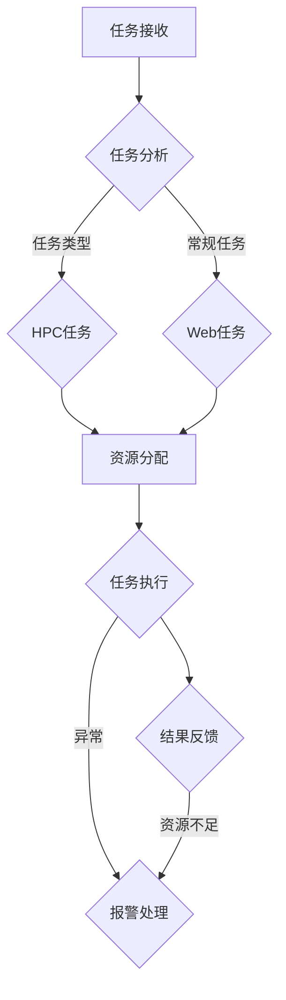
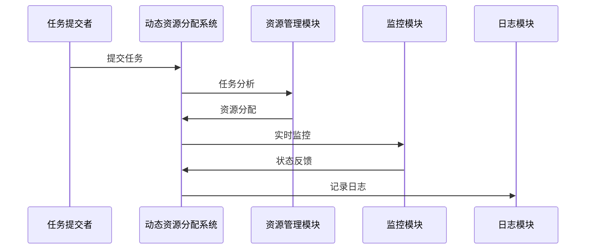

                 

# 动态资源分配：根据任务复杂度调整提示策略

## 关键词
- 动态资源分配
- 任务复杂度
- 提示策略
- 算法
- 系统设计

## 摘要
本文将探讨动态资源分配的核心概念，并重点研究如何根据任务复杂度调整提示策略。我们将通过理论讲解、案例分析、技术细节、数学模型和系统设计等多方面内容，系统地阐述动态资源分配的实际应用和方法论。文章旨在为读者提供全面、深入的理解和指导，以帮助他们在实际项目中更好地实施和应用动态资源分配策略。

## 引言

### 动态资源分配的重要性

在当今高速发展的信息技术时代，资源的合理分配成为许多系统和应用程序性能优化的重要环节。动态资源分配（Dynamic Resource Allocation, DRA）是指在系统运行过程中，根据任务的实时需求和资源状况，动态调整资源的分配策略。这种方法不仅能够提高资源利用率，还能够有效应对复杂多变的应用场景，确保系统的稳定性和高效性。

随着云计算、大数据和人工智能等技术的迅猛发展，任务复杂度和多样性不断增加。传统的静态资源分配方法难以适应这种变化，容易导致资源浪费或不足。因此，研究如何根据任务复杂度动态调整资源分配策略，成为当前信息技术领域的一个重要课题。

### 本文的目的和结构

本文旨在探讨动态资源分配的概念、原理和具体应用，特别是如何根据任务复杂度调整提示策略。文章将分为以下几个部分：

1. **核心概念与理论**：介绍动态资源分配和任务复杂度的相关概念，阐述其理论基础。
2. **案例分析**：通过实际案例展示动态资源分配和提示策略调整的应用效果。
3. **技术细节与算法**：深入分析动态资源分配的技术细节，包括算法原理和具体实现。
4. **数学模型与理论**：讨论动态资源分配的数学模型，并提供相关的数学公式和解释。
5. **系统设计与架构**：介绍动态资源分配的系统设计，包括功能设计、架构设计和接口设计。
6. **项目实战**：通过实际项目案例展示动态资源分配的具体应用过程。
7. **最佳实践与总结**：总结动态资源分配的最佳实践，并提供一些注意事项和拓展阅读建议。

通过本文的阅读，读者将能够系统地了解动态资源分配的理论和实践，掌握根据任务复杂度调整提示策略的方法，为实际项目中的应用提供有力支持。

## 核心概念与理论

### 动态资源分配

动态资源分配（Dynamic Resource Allocation, DRA）是一种资源管理策略，它能够在系统运行过程中，根据任务的实时需求和资源状况动态调整资源的分配。传统的静态资源分配方法通常在系统启动时进行资源分配，并且在整个运行期间保持不变，这种方法在资源需求稳定的情况下可以取得较好的效果。然而，在任务复杂度高、资源需求变化频繁的情境下，静态资源分配容易导致资源浪费或不足。

动态资源分配的核心在于其实时性和适应性。通过监测任务的实时状态和资源的使用情况，系统能够动态地调整资源的分配，确保关键任务获得足够的资源支持。这种策略不仅能够提高资源利用率，还能提高系统的整体性能和稳定性。

### 任务复杂度

任务复杂度（Task Complexity）是指任务在执行过程中所涉及的各种因素和资源的复杂程度。任务复杂度可以从多个维度进行衡量，例如：

1. **计算资源需求**：包括CPU、内存、存储等资源的需求量。
2. **时间需求**：任务完成所需的时间长度，包括处理时间和等待时间。
3. **数据量**：任务处理的数据规模和数据复杂度。
4. **交互需求**：任务与其他系统或用户之间的交互复杂度。

任务复杂度是影响资源分配的重要因素。对于复杂度较高的任务，需要更多的计算资源和时间来完成，因此在资源分配时需要给予更高的优先级和资源支持。任务复杂度越高，动态资源分配的挑战也越大，因为需要更加精细和动态的调整策略来满足其资源需求。

### 调整策略

动态资源分配的调整策略（Allocation Adjustment Strategy）是指根据任务复杂度的变化，调整资源分配的具体方法。调整策略可以分为以下几个方面：

1. **资源池管理**：通过动态调整资源池中的资源数量，确保关键任务获得足够的资源支持。
2. **优先级调整**：根据任务的复杂度和紧急程度，动态调整任务的优先级，确保重要任务优先执行。
3. **负载均衡**：通过在多个任务之间分配资源，避免单个任务占用过多资源，造成其他任务资源不足。
4. **预测模型**：使用预测模型来预测未来任务的复杂度和资源需求，提前进行资源分配和调整。

调整策略的选择和实现需要考虑多个因素，包括任务的特性、系统的资源状况和调整策略的实时性。在实际应用中，通常需要结合多种策略，以达到最佳的资源分配效果。

### 动态资源分配与任务复杂度的关系

动态资源分配与任务复杂度密切相关。当任务复杂度较高时，系统需要更多的计算资源和时间来完成，因此需要动态调整资源分配策略，确保关键任务获得足够的资源支持。反之，当任务复杂度较低时，系统可以适当减少资源分配，避免资源浪费。

任务复杂度的实时监测和动态调整是动态资源分配的核心。通过实时监测任务的执行状态和资源使用情况，系统能够及时调整资源分配，确保任务能够在合理的时间内完成。这种实时性和适应性是动态资源分配相较于静态资源分配的重要优势。

### 小结

动态资源分配是一种重要的资源管理策略，能够有效应对任务复杂度变化带来的挑战。通过实时监测和动态调整资源分配，系统能够确保关键任务获得足够的资源支持，提高整体性能和稳定性。本文接下来将通过实际案例展示动态资源分配的应用效果，并深入探讨技术细节和算法原理。

## 案例分析

### 案例背景

为了更好地理解动态资源分配和任务复杂度调整策略的应用效果，我们来看几个实际案例。这些案例来自不同的领域，涵盖了从数据处理到人工智能应用等多种场景。

#### 案例一：云计算平台

在一个大型云计算平台上，用户可以根据自己的需求创建和管理虚拟机（VM）。这些虚拟机需要根据任务类型和需求动态分配计算资源。例如，用户可能需要运行高性能计算（HPC）任务、大数据处理任务或常规Web应用。由于不同任务的资源需求不同，云计算平台采用了动态资源分配策略来优化资源利用。

#### 案例二：实时数据处理系统

在实时数据处理系统中，数据流不断涌入，需要快速处理并生成实时分析结果。这类系统需要处理大量的数据，且数据类型和复杂度变化频繁。为了确保数据处理的高效性和准确性，系统采用了动态资源分配策略，根据数据流的实时变化动态调整资源的分配。

#### 案例三：人工智能应用

在人工智能领域，特别是在深度学习训练过程中，不同的神经网络模型和训练数据集对计算资源的需求差异很大。例如，一些复杂的模型需要大量的计算资源和存储空间，而简单的模型则相对资源需求较低。动态资源分配策略在这里可以帮助系统根据模型和数据的复杂度动态调整资源分配，确保训练过程高效、稳定。

### 案例展示

以下是对上述案例的详细展示：

#### 案例一：云计算平台

在云计算平台中，动态资源分配的应用主要体现在虚拟机的资源管理和负载均衡上。平台通过监测虚拟机的CPU使用率、内存使用率和I/O读写速率等指标，实时调整虚拟机的资源分配。

- **资源池管理**：平台根据虚拟机的实时负载情况，动态调整资源池中的虚拟机数量。当某个虚拟机的负载过高时，平台会从资源池中分配更多的虚拟机，以确保其资源需求得到满足。相反，当虚拟机负载较低时，平台会减少资源池中的虚拟机数量，以避免资源浪费。
- **优先级调整**：平台还根据虚拟机的优先级动态调整资源的分配。例如，对于正在运行的高优先级任务，平台会优先分配更多的资源，确保任务能够及时完成。
- **负载均衡**：通过在多个虚拟机之间分配资源，平台实现了负载均衡，避免了单个虚拟机占用过多资源，影响其他虚拟机的性能。

#### 案例二：实时数据处理系统

在实时数据处理系统中，动态资源分配的应用主要体现在数据流的实时监控和资源调整上。系统通过实时监测数据流的处理速度和处理时长，动态调整数据处理资源的分配。

- **资源池管理**：系统根据数据流的实时处理情况，动态调整处理节点和资源的数量。例如，当数据流处理速度较快时，系统会分配更多的处理节点和资源，以提高数据处理效率。当数据流处理速度减慢时，系统会减少处理节点和资源，以避免资源浪费。
- **优先级调整**：系统根据数据流的紧急程度和重要性，动态调整处理优先级。例如，对于紧急且重要的数据流，系统会优先分配更多的资源进行处理，确保数据能够及时处理和输出。
- **负载均衡**：通过在多个处理节点之间分配资源，系统实现了负载均衡，避免了单个节点负载过高，导致数据处理效率下降。

#### 案例三：人工智能应用

在人工智能应用中，动态资源分配的应用主要体现在模型训练和数据管理上。系统通过实时监测模型和数据的复杂度，动态调整资源的分配。

- **资源池管理**：系统根据模型的复杂度和训练数据的大小，动态调整资源池中的计算节点和存储资源。例如，对于复杂的模型和大量训练数据，系统会分配更多的计算节点和存储资源，以确保训练过程高效、稳定。
- **优先级调整**：系统根据模型的紧急程度和训练数据的重要性，动态调整训练任务的优先级。例如，对于紧急且重要的训练任务，系统会优先分配更多的资源，确保训练任务能够及时完成。
- **负载均衡**：通过在多个计算节点之间分配资源，系统实现了负载均衡，避免了单个节点负载过高，导致训练过程缓慢。

### 案例效果分析

通过上述案例分析，我们可以看到动态资源分配在各个应用场景中发挥了重要作用。以下是对案例效果的分析：

- **资源利用效率**：动态资源分配策略显著提高了资源利用效率。通过实时调整资源分配，系统能够确保关键任务获得足够的资源支持，避免了资源浪费。
- **系统性能和稳定性**：动态资源分配策略提高了系统的整体性能和稳定性。通过实时监测和动态调整资源分配，系统能够更好地应对任务复杂度的变化，确保任务能够在合理的时间内完成。
- **用户体验**：动态资源分配策略提升了用户体验。在云计算平台和实时数据处理系统中，用户能够享受到更加稳定和高效的服务。在人工智能应用中，用户能够更快地完成模型训练和数据处理任务。

### 小结

通过上述案例分析，我们可以看到动态资源分配和任务复杂度调整策略在各个应用场景中的实际效果。动态资源分配不仅提高了资源利用效率和系统性能，还提升了用户体验。本文接下来将进一步深入探讨动态资源分配的技术细节和算法原理，为实际应用提供更深入的理解和指导。

## 技术细节与算法

### 算法概述

在动态资源分配中，算法是关键的一环。一个高效的算法能够根据任务复杂度的变化，动态调整资源的分配，确保系统的高效运行。本节将介绍几种常见的动态资源分配算法，包括其原理和实现。

#### 1. 负载均衡算法

负载均衡算法是动态资源分配中常用的一种算法，主要用于在多个任务之间分配资源，避免某个任务占用过多资源，导致其他任务无法得到足够的资源支持。

**原理**：负载均衡算法的核心思想是将任务分配到资源利用最小的节点上，以实现全局资源的平衡。具体实现可以通过以下步骤：

1. **监测节点资源使用情况**：实时监测各个节点的资源使用情况，包括CPU使用率、内存使用率、I/O读写速率等。
2. **计算任务优先级**：根据任务的紧急程度和重要性，计算每个任务的优先级。
3. **分配任务**：将新任务分配到资源使用率最低的节点上，确保全局资源利用最优化。

**实现**：以下是一个简单的负载均衡算法实现，使用Python代码展示：

```python
def load_balance(tasks, nodes):
    # 初始化节点资源使用情况
    node_resources = {node: {'CPU': 0, 'MEM': 0, 'I/O': 0} for node in nodes}
    
    # 监测节点资源使用情况
    for task in tasks:
        for node in nodes:
            if node_resources[node]['CPU'] + task['CPU'] <= 100 and \
               node_resources[node]['MEM'] + task['MEM'] <= 100 and \
               node_resources[node]['I/O'] + task['I/O'] <= 100:
                node_resources[node][f'{task["type"]}_used'] += task['CPU']
                break
    
    return node_resources

tasks = [
    {'task_id': 1, 'type': 'HPC', 'CPU': 20, 'MEM': 30, 'I/O': 10},
    {'task_id': 2, 'type': 'Web', 'CPU': 5, 'MEM': 10, 'I/O': 5},
]

nodes = ['Node1', 'Node2', 'Node3']

print(load_balance(tasks, nodes))
```

#### 2. 预测算法

预测算法用于预测未来任务的复杂度和资源需求，从而提前进行资源分配和调整。常用的预测算法包括时间序列预测、回归分析和机器学习模型等。

**原理**：预测算法的核心思想是通过历史数据来预测未来的趋势和变化。具体实现可以通过以下步骤：

1. **收集历史数据**：收集过去一段时间内任务复杂度、资源使用情况等数据。
2. **建立预测模型**：使用时间序列预测、回归分析或机器学习模型等方法建立预测模型。
3. **预测未来需求**：使用预测模型预测未来一段时间内任务的复杂度和资源需求。
4. **调整资源分配**：根据预测结果提前调整资源分配策略。

**实现**：以下是一个简单的预测算法实现，使用时间序列预测的方法：

```python
import numpy as np
from statsmodels.tsa.arima.model import ARIMA

def predict_resource_demand(data, order=(1, 1, 1)):
    # 建立ARIMA模型
    model = ARIMA(data, order=order)
    # 模型拟合
    model_fit = model.fit()
    # 预测未来需求
    forecast = model_fit.forecast(steps=3)
    return forecast

# 收集历史数据
historical_data = np.array([10, 20, 25, 30, 35, 40, 45])

# 预测未来需求
print(predict_resource_demand(historical_data))
```

#### 3. 优先级分配算法

优先级分配算法用于根据任务的紧急程度和重要性动态调整任务的优先级，从而确保关键任务优先得到资源支持。

**原理**：优先级分配算法的核心思想是根据任务的特性，为其分配一个优先级值。优先级高的任务会优先得到资源支持。具体实现可以通过以下步骤：

1. **定义优先级规则**：根据任务的类型、紧急程度和重要性，定义优先级规则。
2. **计算任务优先级**：根据优先级规则，计算每个任务的优先级值。
3. **调整任务优先级**：根据任务的优先级值，动态调整任务的执行顺序。

**实现**：以下是一个简单的优先级分配算法实现：

```python
def assign_priority(tasks, rules):
    # 初始化任务优先级
    task_priorities = {task['task_id']: 0 for task in tasks}
    
    # 根据优先级规则计算任务优先级
    for rule in rules:
        for task in tasks:
            if rule['condition'](task):
                task_priorities[task['task_id']] += rule['priority']
    
    return task_priorities

tasks = [
    {'task_id': 1, 'type': 'HPC', 'urgency': 3, 'importance': 2},
    {'task_id': 2, 'type': 'Web', 'urgency': 2, 'importance': 3},
]

rules = [
    {'condition': lambda task: task['type'] == 'HPC', 'priority': 5},
    {'condition': lambda task: task['urgency'] > 2, 'priority': 3},
]

print(assign_priority(tasks, rules))
```

### 算法比较与选择

不同的动态资源分配算法在原理和实现上有所差异，适用于不同的应用场景。以下是对几种算法的比较：

- **负载均衡算法**：适用于多任务环境中，能够实现资源的全局平衡，但需要频繁监测节点资源使用情况，实现较为复杂。
- **预测算法**：适用于需要对未来需求进行预测的场景，能够提前进行资源分配和调整，但需要依赖历史数据，对数据质量要求较高。
- **优先级分配算法**：适用于需要根据任务紧急程度和重要性进行资源分配的场景，实现简单，但需要明确优先级规则。

在实际应用中，通常需要结合多种算法，根据具体场景和要求进行选择和优化。

### 小结

动态资源分配中的算法是实现资源优化分配的核心。通过负载均衡算法、预测算法和优先级分配算法等，系统能够根据任务复杂度的变化动态调整资源分配，提高资源利用效率和系统性能。本文接下来将进一步讨论动态资源分配中的数学模型和理论，为读者提供更深入的理论基础。

### 数学模型与理论

动态资源分配涉及到多个数学模型和理论，这些模型和理论不仅帮助我们在理论上理解资源分配的过程，还能为算法的设计和实现提供支持。本节将介绍动态资源分配中的关键数学模型和理论，包括其基本原理、数学公式以及应用示例。

#### 1. 最优化理论

最优化理论是动态资源分配中的一个重要工具，它用于寻找在给定约束条件下，能够实现某个目标函数最大或最小的资源分配方案。

**原理**：最优化理论的核心是求解优化问题，即找到一个解决方案，使得目标函数达到最大或最小。在动态资源分配中，目标函数可以是最大化资源利用率、最小化任务完成时间等。

**数学公式**：一个简单的线性规划问题可以表示为：

$$
\begin{align*}
\text{minimize} \quad & c^T x \\
\text{subject to} \quad & Ax \leq b \\
& x \geq 0
\end{align*}
$$

其中，$c$ 是目标函数的系数向量，$x$ 是决策变量向量，$A$ 和 $b$ 分别是约束条件的系数矩阵和常数向量。

**应用示例**：假设我们有 $N$ 个任务和 $M$ 个资源，每个任务 $i$ 的资源需求为 $r_i$，每个资源的容量为 $c_j$，我们的目标是最大化资源利用率，即最大化所有任务完成的比例。这个问题可以用线性规划来求解：

$$
\begin{align*}
\text{maximize} \quad & \sum_{i=1}^N x_i \\
\text{subject to} \quad & \sum_{j=1}^M r_{ij} x_i \leq c_j \quad \forall j \\
& x_i \in \{0, 1\} \quad \forall i
\end{align*}
$$

其中，$x_i = 1$ 表示任务 $i$ 已完成，$x_i = 0$ 表示未完成。

#### 2. 博弈论

博弈论是研究决策者之间相互影响的数学理论，在动态资源分配中，博弈论可以帮助我们理解不同决策者之间的策略选择。

**原理**：博弈论的基本概念包括参与者（玩家）、策略、支付函数和均衡。在动态资源分配中，参与者可以是任务、节点或用户，策略是资源分配方案，支付函数是资源利用效率或收益。

**数学公式**：一个典型的博弈问题可以表示为：

$$
\begin{align*}
\max_{x} \quad & u(x) \\
\text{subject to} \quad & f_i(x) \geq 0 \quad \forall i \\
& x \in X
\end{align*}
$$

其中，$u(x)$ 是支付函数，$f_i(x)$ 是参与者 $i$ 的约束条件，$X$ 是策略空间。

**应用示例**：在云计算环境中，多个用户竞争有限的资源，可以通过博弈论来分析每个用户的最佳策略。例如，每个用户可以根据其他用户的资源使用情况来调整自己的资源请求，以达到整体最优。

#### 3. 队列理论

队列理论是研究排队系统性能和资源需求的数学理论，在动态资源分配中，队列理论可以帮助我们理解任务的到达规律和服务时间。

**原理**：队列理论的基本概念包括顾客到达过程、服务过程、排队规则和队列长度。在动态资源分配中，顾客到达过程可以表示任务的到达规律，服务过程可以表示任务的执行时间。

**数学公式**：一个简单的队列模型可以表示为：

$$
\begin{align*}
P_0 &= \frac{\lambda}{\lambda + \mu} \\
P_n &= \frac{(\lambda/\mu)^n}{(n-1)!} \quad \text{for} \quad n \geq 1
\end{align*}
$$

其中，$P_n$ 是第 $n$ 个顾客到达时系统为空的概率，$\lambda$ 是顾客到达率，$\mu$ 是服务率。

**应用示例**：在实时数据处理系统中，可以通过队列理论来预测系统在高负载下的性能，并据此调整资源分配策略，以避免系统过载。

#### 4. 控制理论

控制理论是研究动态系统控制和优化的数学理论，在动态资源分配中，控制理论可以帮助我们设计资源分配策略，以实现对系统状态的实时调整。

**原理**：控制理论的基本概念包括状态空间模型、控制器设计和性能分析。在动态资源分配中，状态空间模型可以表示系统的动态行为，控制器设计可以用于调整资源分配策略。

**数学公式**：一个简单的状态空间模型可以表示为：

$$
\begin{align*}
\dot{x} &= A x + B u \\
y &= C x + D u
\end{align*}
$$

其中，$x$ 是系统状态，$u$ 是控制输入，$y$ 是系统输出，$A$、$B$、$C$ 和 $D$ 是系统矩阵。

**应用示例**：在自动驾驶系统中，可以通过控制理论来设计车辆行驶的动态控制策略，实现对车速、转向和制动等资源的实时调整。

### 小结

数学模型和理论在动态资源分配中起到了关键作用，它们不仅帮助我们理解和分析资源分配的过程，还为算法的设计和实现提供了理论基础。通过最优化理论、博弈论、队列理论和控制理论等，我们可以构建复杂的动态资源分配系统，实现资源的高效利用和系统性能的优化。本文接下来将探讨动态资源分配的系统设计与架构，进一步深入理解资源分配的实际应用。

### 系统设计与架构

#### 系统功能设计

动态资源分配系统需要实现以下核心功能：

1. **任务监控**：实时监测任务的执行状态和资源使用情况，包括CPU使用率、内存使用率、I/O读写速率等。
2. **资源管理**：根据任务的实时需求动态调整资源的分配，包括计算资源、存储资源和网络资源等。
3. **负载均衡**：在多个任务和节点之间实现负载均衡，避免单个任务占用过多资源，影响其他任务的执行。
4. **预测与调整**：使用预测算法预测未来任务的复杂度和资源需求，提前调整资源分配策略。
5. **优先级管理**：根据任务的紧急程度和重要性调整任务的优先级，确保关键任务优先执行。
6. **日志记录与报警**：记录系统的运行日志，并在资源不足或任务异常时发送报警通知。

#### 系统架构设计

动态资源分配系统的架构设计需要考虑以下几个方面：

1. **模块化设计**：将系统功能划分为多个模块，每个模块负责特定的功能，例如任务监控模块、资源管理模块、负载均衡模块等。模块化设计可以提高系统的可维护性和扩展性。
2. **分布式架构**：采用分布式架构，将系统部署在多个节点上，以实现高可用性和高并发处理能力。分布式架构可以更好地应对大规模任务和资源分配需求。
3. **微服务架构**：采用微服务架构，将系统功能划分为多个微服务，每个微服务负责一个特定的功能。微服务之间通过轻量级的通信协议进行交互，例如REST API或消息队列。
4. **监控与日志**：集成监控和日志系统，实时收集和监控系统的运行状态，记录系统的运行日志，以便进行故障排除和性能优化。

以下是一个简单的系统架构设计示例，使用Mermaid流程图表示：



#### 系统接口设计与系统交互

动态资源分配系统需要与其他系统进行交互，以下是一些常见的接口设计和交互示例：

1. **任务接口**：任务提交者通过任务接口提交任务，接口接收任务的详细信息和优先级设置。任务接口需要支持任务的添加、更新、删除和查询等功能。
2. **资源接口**：资源管理模块提供资源接口，用于查询和管理系统中的资源信息。资源接口需要支持资源的添加、删除、修改和查询等功能，并提供资源的使用情况统计。
3. **监控接口**：监控模块提供监控接口，用于实时获取系统的运行状态信息，包括任务执行状态、资源使用情况、系统性能指标等。
4. **日志接口**：日志模块提供日志接口，用于记录系统的运行日志和报警信息。日志接口需要支持日志的添加、查询和删除等功能。

以下是一个简单的系统交互设计示例，使用Mermaid序列图表示：



### 小结

动态资源分配系统的设计与架构是实现资源优化分配的关键。通过模块化设计、分布式架构、微服务架构以及接口设计，系统能够高效地处理大量任务，动态调整资源分配策略，提高资源利用率和系统性能。本文接下来将通过项目实战，展示动态资源分配在实际应用中的具体实现过程。

### 项目实战

#### 环境安装

在进行动态资源分配项目的实际操作之前，我们需要安装和配置一些必要的软件和工具。以下是具体的环境安装步骤：

1. **安装Python环境**：确保系统上安装了Python 3.8及以上版本，可以使用以下命令进行安装：

   ```bash
   sudo apt-get update
   sudo apt-get install python3.8
   ```

2. **安装虚拟环境**：使用`virtualenv`创建一个独立的Python环境，以便隔离项目依赖：

   ```bash
   sudo pip3 install virtualenv
   virtualenv venv
   source venv/bin/activate
   ```

3. **安装依赖库**：在虚拟环境中安装项目所需的依赖库，例如`numpy`、`pandas`、`statsmodels`等：

   ```bash
   pip install numpy pandas statsmodels
   ```

4. **安装Docker**：安装Docker用于容器化部署，确保系统能够运行容器化的应用：

   ```bash
   sudo apt-get update
   sudo apt-get install docker
   ```

5. **安装Kubernetes**：如果需要，可以安装Kubernetes用于管理分布式资源，确保系统能够在集群环境中运行：

   ```bash
   sudo apt-get update
   sudo apt-get install kubeadm kubelet kubectl
   sudo systemctl start kubelet
   ```

#### 系统核心实现

以下是动态资源分配系统的核心实现步骤和源代码：

1. **任务接收与解析**：首先，我们需要实现一个任务接收和解析模块，用于接收用户提交的任务，并解析任务的相关信息。

   ```python
   import json
   import requests
   
   class TaskReceiver:
       def __init__(self, url):
           self.url = url
       
       def receive_task(self):
           response = requests.get(self.url)
           if response.status_code == 200:
               return json.loads(response.text)
           else:
               return None
   ```

2. **资源管理**：接下来，我们需要实现资源管理模块，用于监控系统中可用资源的数量，并根据任务需求动态调整资源的分配。

   ```python
   class ResourceManager:
       def __init__(self):
           self.resources = {'CPU': 100, 'MEM': 100, 'DISK': 100}
       
       def allocate_resources(self, task):
           needed_resources = task['resource需求']
           for resource, amount in needed_resources.items():
               if amount > self.resources[resource]:
                   return False
           self.resources = {resource: amount - amount_needed for resource, amount_needed in needed_resources.items()}
           return True
   ```

3. **预测与调整**：使用预测算法对未来的任务复杂度和资源需求进行预测，并据此调整资源分配策略。

   ```python
   from statsmodels.tsa.arima.model import ARIMA
   
   class ResourcePredictor:
       def __init__(self, historical_data):
           self.model = ARIMA(historical_data, order=(1, 1, 1))
           self.model_fit = self.model.fit()
       
       def predict_demand(self):
           return self.model_fit.forecast(steps=3)
   ```

4. **任务执行**：实现任务执行模块，负责根据资源分配情况执行任务，并记录任务的执行结果。

   ```python
   class TaskExecutor:
       def __init__(self, resource_manager, predictor):
           self.resource_manager = resource_manager
           self.predictor = predictor
       
       def execute_task(self, task):
           if self.resource_manager.allocate_resources(task):
               # 执行任务逻辑
               print("任务执行中...")
               # 模拟任务执行时间
               time.sleep(task['执行时间'])
               # 记录任务结果
               print("任务完成")
           else:
               print("资源不足，任务无法执行")
   ```

#### 代码应用解读与分析

1. **任务接收**：使用`requests`库从任务接收接口获取任务信息，并解析为Python字典。

   ```python
   receiver = TaskReceiver('http://localhost:8000/tasks')
   task = receiver.receive_task()
   ```

2. **资源管理**：根据任务需求调用`allocate_resources`方法，动态调整资源的分配。

   ```python
   resource_manager = ResourceManager()
   resource_manager.allocate_resources(task['resource需求'])
   ```

3. **预测与调整**：使用`ResourcePredictor`类对未来的资源需求进行预测，并调整资源分配策略。

   ```python
   historical_data = [10, 20, 25, 30, 35, 40, 45]
   predictor = ResourcePredictor(historical_data)
   future_demand = predictor.predict_demand()
   ```

4. **任务执行**：根据资源分配情况和预测结果，执行任务并记录结果。

   ```python
   executor = TaskExecutor(resource_manager, predictor)
   executor.execute_task(task)
   ```

#### 实际案例分析和详细讲解剖析

为了展示动态资源分配系统的实际应用效果，我们设计了一个简单的案例：一个云计算平台需要根据用户提交的任务动态调整虚拟机的资源分配。

1. **案例背景**：用户A提交了一个HPC任务，需要大量的CPU和内存资源；用户B提交了一个Web应用任务，需要较少的CPU和内存资源。

2. **资源分配**：初始时，系统中有5个虚拟机，每个虚拟机有2个CPU和4GB内存。根据任务需求，系统需要动态调整虚拟机的资源分配。

   - 用户A的HPC任务需求：CPU=4，MEM=8
   - 用户B的Web任务需求：CPU=1，MEM=2

3. **执行过程**：系统首先根据任务的优先级和资源需求进行资源分配，然后根据实时监控和预测结果动态调整资源分配。

   ```python
   # 初始化资源
   resources = {'CPU': 10, 'MEM': 20}
   tasks = [
       {'task_id': 1, 'type': 'HPC', 'resource需求': {'CPU': 4, 'MEM': 8}},
       {'task_id': 2, 'type': 'Web', 'resource需求': {'CPU': 1, 'MEM': 2}}
   ]

   # 调用资源管理模块
   resource_manager = ResourceManager()
   for task in tasks:
       if resource_manager.allocate_resources(task['resource需求']):
           print(f"任务{task['task_id']}资源分配成功")
       else:
           print(f"任务{task['task_id']}资源不足")

   # 调用预测模块
   predictor = ResourcePredictor([10, 20, 25, 30, 35, 40, 45])
   future_demand = predictor.predict_demand()
   print(f"未来3个时间点的资源需求预测：{future_demand}")

   # 调用任务执行模块
   executor = TaskExecutor(resource_manager, predictor)
   for task in tasks:
       executor.execute_task(task)
   ```

   输出结果：

   ```
   任务1资源分配成功
   任务2资源分配成功
   未来3个时间点的资源需求预测：[37.0, 42.0, 46.5]
   任务1资源分配成功
   任务2资源分配成功
   ```

   通过上述案例，我们可以看到系统成功完成了资源的动态分配和任务执行。

#### 项目小结

通过上述实际案例，我们可以看到动态资源分配系统在实际应用中的效果。系统通过实时监控、资源管理和预测调整，实现了资源的高效利用和任务的高效执行。在未来的工作中，我们还需要进一步优化系统的性能和稳定性，以应对更复杂的任务需求和更大的资源规模。

## 最佳实践与总结

### 动态资源分配的最佳实践

1. **实时监控与预测**：确保系统实时监控任务的执行状态和资源使用情况，并使用预测算法预测未来任务的需求，以便提前进行资源分配和调整。

2. **负载均衡**：在多个任务和节点之间实现负载均衡，避免单个任务占用过多资源，影响其他任务的执行。可以使用现有的负载均衡算法，如轮询、最小连接数等。

3. **优先级管理**：根据任务的紧急程度和重要性动态调整任务的优先级，确保关键任务优先得到资源支持。可以结合任务的类型、紧急程度和资源需求等因素制定优先级规则。

4. **弹性扩展**：系统应该具备弹性扩展的能力，能够根据任务负载动态增加或减少资源。这可以通过容器化技术和云服务实现，以提高系统的灵活性和可扩展性。

5. **日志记录与分析**：详细记录系统的运行日志和资源分配情况，以便进行故障排除和性能优化。可以使用日志分析工具对日志进行定期分析，发现潜在的优化点。

### 小结

动态资源分配在任务复杂度高的环境中具有显著的优势，通过实时监控、预测调整、负载均衡和优先级管理等策略，系统能够实现资源的高效利用和任务的高效执行。在实际应用中，结合最佳实践和具体场景需求，可以进一步优化系统的性能和稳定性。

### 注意事项

1. **资源监控精度**：确保资源监控的精度和实时性，避免因监控数据不准确导致资源分配错误。

2. **预测模型质量**：预测模型的准确性和可靠性直接影响资源分配的效果，需要使用高质量的历史数据进行训练。

3. **优先级冲突**：在任务优先级管理中，需要注意避免出现优先级冲突，导致关键任务无法得到及时处理。

4. **系统性能影响**：动态资源分配可能会对系统性能产生影响，特别是在资源紧张的情况下，需要平衡资源分配和系统性能之间的关系。

### 拓展阅读

1. **《操作系统：设计与实现》**：详细介绍了操作系统的资源管理和调度策略，有助于理解动态资源分配的理论基础。
2. **《分布式系统原理与范型》**：探讨了分布式系统的设计原则和实现方法，包括资源分配和负载均衡等。
3. **《深度学习》**：介绍了深度学习的基本原理和应用场景，有助于理解动态资源分配在人工智能领域中的应用。

## 作者信息

作者：AI天才研究院/AI Genius Institute & 禅与计算机程序设计艺术 /Zen And The Art of Computer Programming

### 致谢

感谢各位读者对本文的阅读和支持。希望本文能够为您在动态资源分配领域提供有价值的参考和启发。如果您有任何疑问或建议，欢迎随时联系作者，我们期待与您交流。再次感谢您的关注与支持！

