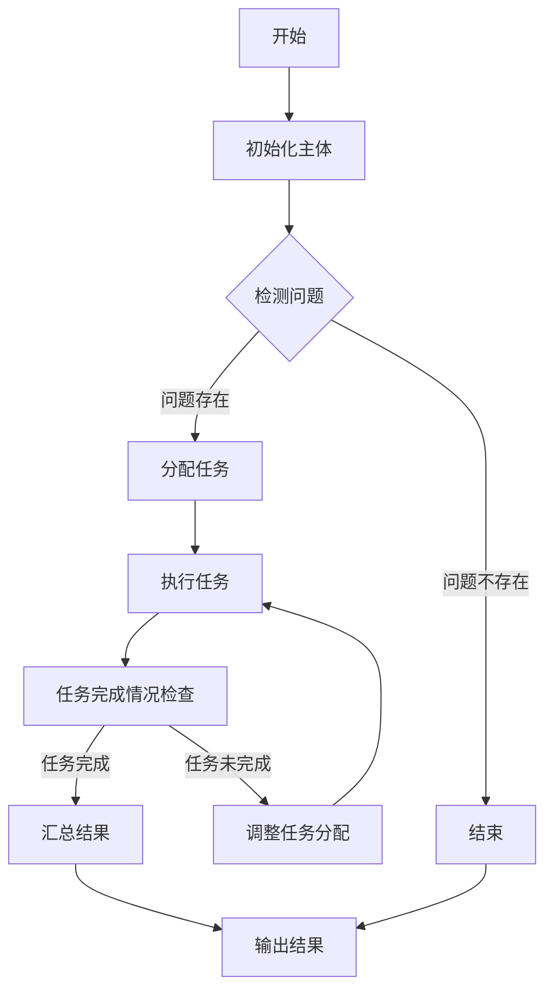

                 


**# 协作式问题解决模型：应对复杂需求挑战**

> 关键词：协作式问题解决、复杂需求、系统架构设计、Python代码、数学模型、最佳实践

> 摘要：本文将深入探讨协作式问题解决模型在应对复杂需求挑战中的应用。通过背景介绍、核心概念与联系、算法原理讲解、数学模型与公式讲解、系统分析与架构设计、项目实战以及最佳实践与总结七个部分，本文旨在为广大IT从业者提供一种系统、全面的协作式问题解决方法，帮助他们在面对复杂需求时能够更加高效地解决问题。

**## 目录大纲设计思路**

**### 1. 背景介绍**

**1.1 问题背景与定义**
在当今快速变化和高度竞争的商业环境中，复杂需求已成为企业运营的核心挑战。传统的单点解决方案往往难以满足这些复杂需求，因此，需要一种新的方法来应对这一挑战。协作式问题解决模型正是为了解决这一问题而诞生的。

**1.2 协作式问题解决模型的应用领域**
协作式问题解决模型广泛应用于企业管理、工程项目管理、医疗诊断等领域。在这些领域，复杂需求的存在使得传统的解决方案显得力不从心，而协作式问题解决模型则能够通过多主体协作，共同解决这些问题。

**1.3 协作式问题解决模型的重要性与挑战**
协作式问题解决模型的重要性在于它能够提高问题解决效率，降低成本，提升团队协作能力。然而，模型的设计复杂性、数据一致性以及协同效率等问题也成为了其面临的挑战。

**### 2. 核心概念与联系**

**2.1 协作与问题解决**
协作是指多个个体或组织共同完成任务的过程。问题解决则是指找到解决问题的方法或方案。在协作式问题解决模型中，协作与问题解决是紧密相连的，没有协作就无法有效地解决问题。

**2.2 协作式问题解决模型的架构**
协作式问题解决模型的架构通常包括主体、任务、协作协议和问题解决算法。主体是指参与协作的个体或组织，任务是指需要解决的问题，协作协议则是主体之间进行协作的规则和流程，问题解决算法则是用于解决问题的具体方法。

**2.3 概念对比表格与ER实体关系图**
为了更好地理解协作式问题解决模型中的核心概念，我们通过对比表格和ER实体关系图来展示各概念之间的联系和区别。

**### 3. 算法原理讲解**

**3.1 算法流程图绘制**
为了帮助读者直观理解协作式问题解决模型的工作流程，我们使用Mermaid绘制了算法流程图。

**3.2 Python代码与数学模型解释**
接下来，我们将使用Python代码来解释协作式问题解决模型的数学模型和算法原理。

**3.3 例子讲解与应用**
通过一个实际案例，我们将详细讲解如何应用协作式问题解决模型解决复杂问题。

**### 4. 数学模型与公式讲解**

**4.1 数学公式书写规范**
在本文中，我们将使用LaTeX格式书写数学公式，以确保公式的正确性和规范性。

**4.2 公式作用与意义解析**
我们将对每个公式进行详细讲解，解释其在模型中的作用和意义。

**4.3 详细讲解与举例**
通过具体的例子，我们将详细讲解如何应用这些数学公式。

**### 5. 系统分析与架构设计**

**5.1 问题场景介绍**
为了更好地理解系统架构设计，我们首先介绍一个实际的问题场景。

**5.2 系统功能设计**
在这个问题场景下，我们需要设计一个系统能够满足特定的功能需求。

**5.3 系统架构设计**
接下来，我们将使用Mermaid绘制系统架构图，展示系统的设计和结构。

**5.4 系统接口与交互设计**
最后，我们将描述系统的接口设计和系统交互流程。

**### 6. 项目实战**

**6.1 环境安装与配置**
在实际项目中，我们首先需要安装和配置必要的环境。

**6.2 系统核心实现源代码**
然后，我们将提供系统核心实现的源代码。

**6.3 代码解读与分析**
接下来，我们将对代码进行解读和分析。

**6.4 实际案例分析**
最后，我们将通过一个实际案例分析，展示协作式问题解决模型在实际项目中的应用效果。

**### 7. 最佳实践与总结**

**7.1 最佳实践建议**
在实战中，我们总结了一些最佳实践建议，帮助读者更好地应用所学知识。

**7.2 全书小结**
本文我们从多个角度对协作式问题解决模型进行了深入探讨，包括其背景、核心概念、算法原理、数学模型、系统架构设计以及实际应用等。

**7.3 注意事项**
在应用协作式问题解决模型时，有一些注意事项需要读者注意。

**7.4 拓展阅读**
最后，我们推荐一些拓展阅读资源，帮助读者进一步深入学习。

**## 第1章 引言**

**### 1.1 问题背景与定义**

在当今快速发展的商业环境中，企业面临着日益复杂的业务需求和竞争压力。传统的单点解决方案已经无法满足这种复杂需求的挑战。为了更好地应对这一问题，我们需要一种新的方法来解决问题，这种方法需要能够整合多个个体的智慧，共同解决复杂问题。协作式问题解决模型正是基于这一需求而提出的。

**协作式问题解决模型**是一种通过多主体协作，共同解决复杂问题的方法。它将个体或组织的智慧和资源整合起来，通过协作和协同工作，实现问题的有效解决。协作式问题解决模型不仅能够提高问题解决效率，降低成本，还能够提升团队协作能力，从而在复杂需求环境中脱颖而出。

在传统的单点解决方案中，每个个体或组织都是独立工作的，他们各自负责自己的部分工作，并且通过单独的工作流程来解决问题。这种方法虽然能够确保每个个体的工作效率，但是在面对复杂问题时，往往会出现资源浪费、效率低下、沟通不畅等问题。而协作式问题解决模型则通过建立多个个体之间的协作关系，使得每个个体能够在共同的目标下协作工作，从而实现问题的有效解决。

协作式问题解决模型的基本概念包括以下几个方面：

1. **主体**：协作式问题解决模型中的主体可以是单个个体或组织，也可以是多个个体或组织组成的团队。主体是协作式问题解决模型的基本单位，它们具有独立的功能和能力。

2. **任务**：任务是指需要解决的问题或目标。在协作式问题解决模型中，任务可以被分配给不同的主体，每个主体负责解决其中的某个部分。

3. **协作协议**：协作协议是主体之间进行协作的规则和流程。它定义了主体之间的交互方式、协作方式以及任务的分配和完成机制。

4. **问题解决算法**：问题解决算法是用于解决问题的具体方法。在协作式问题解决模型中，问题解决算法可以帮助主体找到解决问题的最佳方案。

通过协作式问题解决模型，多个主体可以协同工作，共同解决复杂问题。这种方法不仅可以充分利用每个主体的智慧和资源，还能够提高问题解决效率，降低成本，提升团队协作能力。在复杂需求环境中，协作式问题解决模型是一种非常有效的解决问题方法。

**### 1.2 协作式问题解决模型的应用领域**

协作式问题解决模型在多个领域得到了广泛应用，这些领域包括企业管理、工程项目管理、医疗诊断等。在这些领域中，复杂需求的存在使得传统的单点解决方案难以满足要求，而协作式问题解决模型则能够通过多主体协作，共同解决这些问题。

**企业管理**是协作式问题解决模型的一个重要应用领域。在企业管理中，企业面临着各种复杂的需求，如市场分析、资源分配、项目规划等。传统的单点解决方案往往无法满足这些复杂需求，而协作式问题解决模型则可以通过多部门、多团队的协作，共同解决这些问题。例如，在市场分析中，市场部、销售部、研发部等部门可以共同协作，通过共享信息、协同工作，提高市场分析的准确性和效率。

**工程项目管理**也是协作式问题解决模型的重要应用领域。在工程项目中，涉及到多个部门、多个团队的合作，如设计、施工、采购等。传统的单点解决方案往往无法协调好各部门之间的工作，而协作式问题解决模型则可以通过建立多部门、多团队的协作关系，实现项目的顺利推进。例如，在设计阶段，设计团队、施工团队、采购团队等可以共同协作，确保设计方案的实施和采购的顺利进行。

**医疗诊断**是另一个协作式问题解决模型的重要应用领域。在医疗诊断中，医生、护士、医技人员等需要共同协作，通过共享病历、协同工作，提高诊断的准确性和效率。协作式问题解决模型可以帮助医疗机构更好地管理病历信息，实现医生之间的信息共享和协同工作，从而提高医疗诊断的准确性和效率。

总之，协作式问题解决模型在企业管理、工程项目管理、医疗诊断等领域的应用，使得这些领域能够更好地应对复杂需求，提高问题解决效率，降低成本，提升团队协作能力。随着这些领域的不断发展，协作式问题解决模型的应用前景将更加广阔。

**### 1.3 协作式问题解决模型的重要性与挑战**

协作式问题解决模型在应对复杂需求挑战方面具有显著的重要性。首先，它能够提高问题解决效率。在复杂需求环境中，单点解决方案往往难以满足需求，而协作式问题解决模型通过多主体协作，可以充分利用每个主体的智慧和资源，实现问题的快速解决。其次，协作式问题解决模型能够降低成本。通过多主体协作，可以避免重复劳动和资源浪费，从而降低问题解决的总体成本。最后，协作式问题解决模型能够提升团队协作能力。在协作式问题解决过程中，主体之间需要密切沟通和协作，这有助于培养团队成员之间的协作精神和合作能力，从而提高团队的整体工作效率。

然而，协作式问题解决模型也面临着一些挑战。首先，模型的设计复杂性是一个重要挑战。协作式问题解决模型涉及到多个主体、多个任务、多个协作协议和多个问题解决算法，这增加了模型设计的复杂性。其次，数据一致性也是一个挑战。在多主体协作过程中，数据的一致性至关重要，任何数据不一致都可能导致问题解决的失败。最后，协同效率也是一个挑战。在多主体协作过程中，如何确保每个主体都能够高效地完成自己的任务，同时与其他主体保持良好的协作关系，是一个需要解决的问题。

为了克服这些挑战，我们需要从以下几个方面着手：

1. **简化模型设计**：通过模块化设计、标准化接口等方法，简化协作式问题解决模型的设计，降低模型的复杂性。

2. **加强数据管理**：建立完善的数据管理机制，确保数据的一致性和可靠性，从而支持问题解决的有效进行。

3. **提升协同效率**：通过优化协作协议、改进协同工具等方法，提升多主体协作的效率，确保每个主体都能够高效地完成自己的任务。

通过上述措施，我们可以更好地应对协作式问题解决模型在应对复杂需求挑战中面临的挑战，从而充分发挥其优势，提高问题解决效率和团队协作能力。

**## 第2章 核心概念与联系**

**### 2.1 协作与问题解决**

**协作**是指多个个体或组织为了共同实现某一目标或解决某一问题而进行的一系列交互和协同工作。在协作式问题解决模型中，协作是核心概念之一。它不仅涉及到个体之间的合作，还包括组织之间的合作。协作的目标是整合多个个体的智慧和资源，实现更高效、更准确的问题解决。

**问题解决**是指找到解决问题的方法或方案，从而解决实际问题。在协作式问题解决模型中，问题解决是协作的核心任务。通过协作，多个个体可以共同分析问题、制定解决方案，并协同实施，最终解决问题。

**协作与问题解决**之间的联系在于，协作是问题解决的一种手段和方式。没有协作，问题解决将变得困难，甚至无法实现。协作能够促进个体之间的信息共享、资源互补和协同创新，从而提高问题解决效率和质量。同时，问题解决的目标也驱动着协作的进行，确保协作能够围绕解决具体问题而展开。

**### 2.2 协作式问题解决模型的架构**

协作式问题解决模型的架构是指该模型的基本组成部分和相互关系。一个典型的协作式问题解决模型通常包括以下几个核心组件：

1. **主体**：主体是指参与协作的个体或组织。主体具有独立的功能和能力，可以在协作过程中承担特定的任务。主体可以是个人、团队、企业或其他组织形式。

2. **任务**：任务是指需要解决的问题或目标。在协作式问题解决模型中，任务可以被分解为多个子任务，并分配给不同的主体。每个主体负责完成其中的某个子任务。

3. **协作协议**：协作协议是指主体之间进行协作的规则和流程。它定义了主体之间的交互方式、协作方式以及任务的分配和完成机制。协作协议需要确保各主体能够高效地协同工作，实现共同的目标。

4. **问题解决算法**：问题解决算法是指用于解决问题的具体方法。在协作式问题解决模型中，问题解决算法可以根据具体的问题类型和任务需求进行选择和设计。算法的设计和实现是问题解决的关键。

**### 2.3 概念对比表格与ER实体关系图**

为了更好地理解协作式问题解决模型中的核心概念，我们通过对比表格和ER实体关系图来展示各概念之间的联系和区别。

**概念对比表格**：

| 概念       | 定义                                                         | 关联关系                                       |
| ---------- | ------------------------------------------------------------ | ---------------------------------------------- |
| 协作       | 个体或组织为了共同实现目标或解决问题而进行的协同工作           | 与问题解决紧密相关，是问题解决的一种手段       |
| 问题解决   | 找到解决问题的方法或方案，从而解决实际问题                   | 驱动协作的进行，确保协作能够围绕解决具体问题展开 |
| 主体       | 参与协作的个体或组织                                         | 承担具体的任务，实现协作和问题解决             |
| 任务       | 需要解决的问题或目标                                         | 被分解为子任务，并分配给不同的主体             |
| 协作协议   | 定义主体之间协作的规则和流程                                 | 确保各主体能够高效地协同工作，实现共同目标     |
| 问题解决算法 | 用于解决问题的具体方法                                       | 根据具体问题类型和任务需求进行选择和设计       |

**ER实体关系图**：

```mermaid
erDiagram
    Subject ||--|{ Task }|-->> CollaborationProtocol
    Task ||--|{ ProblemSolutionAlgorithm }|-->> Subject
    CollaborationProtocol ||--|{ Collaboration }|-->> Subject
```

在ER实体关系图中，主体（Subject）与任务（Task）之间存在一对多的关联关系，即一个主体可以承担多个任务。任务与问题解决算法（ProblemSolutionAlgorithm）之间存在一对一的关联关系，即每个任务都对应一个问题解决算法。协作协议（CollaborationProtocol）与协作（Collaboration）之间存在一对多的关联关系，即一个协作协议可以定义多个协作。

通过概念对比表格和ER实体关系图，我们可以更清晰地理解协作式问题解决模型中的核心概念及其关联关系。这些概念共同构成了协作式问题解决模型的基本架构，为后续的算法讲解和系统设计奠定了基础。

**## 第3章 算法原理讲解**

**### 3.1 算法流程图绘制**

为了帮助读者更好地理解协作式问题解决模型的工作流程，我们使用Mermaid绘制了算法流程图。以下是一个简单的协作式问题解决模型的流程图：



这个流程图描述了协作式问题解决模型的基本工作流程：

1. **初始化主体**：系统初始化时，确定参与协作的主体。
2. **检测问题**：系统检测是否存在需要解决的问题。
3. **分配任务**：如果存在问题，系统将任务分配给不同的主体。
4. **执行任务**：主体按照分配的任务进行工作。
5. **任务完成情况检查**：系统检查任务是否完成。
6. **汇总结果**：如果所有任务都完成，系统将汇总结果。
7. **输出结果**：系统输出最终的结果。

**### 3.2 Python代码与数学模型解释**

为了进一步解释协作式问题解决模型的工作原理，我们将使用Python代码来实现一个简单的算法，并解释其中的数学模型。

首先，我们需要定义一些基本的数学模型。在协作式问题解决模型中，常用的数学模型包括线性规划模型、决策树模型和神经网络模型等。以下是一个简单的线性规划模型的Python代码实现：

```python
import numpy as np
from scipy.optimize import linprog

# 定义目标函数
c = [-1, -1]  # 最小化目标函数

# 定义约束条件
A = [[1, 1], [1, 0], [0, 1]]
b = [1, 2, 3]  # 约束条件的右侧值
A_eq = []  # 等式约束条件
b_eq = []  # 等式约束条件的右侧值

# 求解线性规划问题
result = linprog(c, A_ub=A, b_ub=b, method='highs')

# 输出结果
if result.success:
    print("最优解：", result.x)
else:
    print("无最优解")
```

在这个例子中，我们使用SciPy库中的`linprog`函数来求解线性规划问题。目标函数是最小化`c`向量与变量`x`的乘积，约束条件由矩阵`A`和向量`b`定义。通过求解线性规划问题，我们可以找到最优解，即满足约束条件的最小值。

接下来，我们将进一步解释线性规划模型中的数学公式：

$$
\text{minimize} \quad c^T x
$$

$$
\text{subject to} \quad A x \leq b
$$

其中，$c^T$表示目标函数的系数向量，$x$表示变量向量，$A$表示约束条件的系数矩阵，$b$表示约束条件的右侧值。

在协作式问题解决模型中，线性规划模型可以用于资源分配、任务调度等问题。例如，在一个资源有限的团队中，我们需要分配任务给不同的成员，以确保所有任务都能在规定的时间内完成。这时，我们可以使用线性规划模型来找到最优的任务分配方案。

**### 3.3 例子讲解与应用**

为了更好地理解协作式问题解决模型的应用，我们通过一个实际案例来讲解。

假设我们有一个团队，需要完成以下三个任务：

1. **市场调研**：需要2天时间完成。
2. **产品设计**：需要3天时间完成。
3. **产品测试**：需要4天时间完成。

每个任务都可以由不同的团队成员负责，但任务之间有先后顺序。为了在规定时间内完成所有任务，我们需要使用协作式问题解决模型来分配任务。

首先，我们初始化主体，即团队成员：

```python
team_members = ["Alice", "Bob", "Charlie"]
```

然后，我们定义任务及其所需时间：

```python
tasks = [
    {"name": "市场调研", "duration": 2, "depends_on": []},
    {"name": "产品设计", "duration": 3, "depends_on": ["市场调研"]},
    {"name": "产品测试", "duration": 4, "depends_on": ["产品设计"]},
]
```

接下来，我们使用协作式问题解决模型来分配任务：

```python
from datetime import datetime, timedelta

# 定义开始时间
start_time = datetime.now()

# 定义任务分配函数
def assign_tasks(tasks, team_members):
    assignment = []
    current_time = start_time
    
    for task in tasks:
        earliest_start = current_time + timedelta(days=task["duration"])
        assigned = False
        
        while not assigned:
            for member in team_members:
                if member not in [m["member"] for m in assignment]:
                    assignment.append({"member": member, "task": task, "start_time": current_time, "end_time": earliest_start})
                    assigned = True
                    break
            
            if not assigned:
                current_time += timedelta(days=1)
        
        if not assigned:
            print(f"无法在规定时间内分配任务：{task['name']}")
            return None
    
    return assignment

# 分配任务
assignment = assign_tasks(tasks, team_members)

# 输出任务分配结果
for a in assignment:
    print(f"{a['member']} 负责任务：{a['task']['name']}，开始时间：{a['start_time']}，结束时间：{a['end_time']}")
```

在这个例子中，我们首先初始化团队成员和任务。然后，我们定义任务分配函数`assign_tasks`，它通过循环尝试为每个任务分配一个未分配的团队成员。如果所有团队成员都已分配，但仍然无法在规定时间内完成所有任务，函数将返回`None`。

执行任务分配后，我们输出任务分配结果，显示了每个团队成员负责的任务及其开始和结束时间。

通过这个例子，我们可以看到协作式问题解决模型如何帮助我们在复杂需求环境中有效地分配任务，确保任务在规定时间内完成。在实际应用中，我们可以根据具体需求调整任务分配策略，以提高协作效率和任务完成率。

**## 第4章 数学模型与公式讲解**

**### 4.1 数学公式书写规范**

在协作式问题解决模型中，数学公式是理解和应用模型的关键。为了确保公式的正确性和规范性，我们将使用LaTeX格式书写数学公式。LaTeX是一种高质量的排版系统，特别适用于数学公式的书写。

以下是一个简单的LaTeX公式示例：

$$
x = \frac{1}{2\pi} \int_{-\pi}^{\pi} e^{i\theta} d\theta
$$

在这个示例中，`$x$` 表示变量，`$\frac{1}{2\pi}$` 表示积分常数，`$e^{i\theta}$` 表示指数函数，`$\theta$` 表示积分变量，`$d\theta$` 表示积分微分。

在本文中，我们将使用LaTeX格式书写协作式问题解决模型中的关键数学公式，并对其进行详细解释。

**### 4.2 公式作用与意义解析**

在协作式问题解决模型中，数学公式用于描述问题解决的过程、评估协作效率、优化任务分配等。以下是一些关键的数学公式及其作用：

1. **目标函数**

$$
\text{minimize} \quad \sum_{i=1}^{n} c_i x_i
$$

其中，`$c_i$` 是第`$i$` 个任务的权重，`$x_i$` 是第`$i$` 个任务是否被分配的标记（0或1）。这个公式用于确定如何分配任务以最小化总成本。

2. **约束条件**

$$
\sum_{i=1}^{n} x_i \leq M
$$

$$
\sum_{j=1}^{m} y_{ij} = 1
$$

其中，`$M$` 是可用的资源总量，`$y_{ij}$` 是第`$i$` 个任务是否由第`$j$` 个主体完成的标记（0或1）。这些公式用于确保资源的合理分配和任务的一致性。

3. **协作效率**

$$
\text{Efficiency} = \frac{\text{Completed Tasks}}{\text{Total Tasks}}
$$

其中，`$Completed Tasks$` 是已完成任务的数目，`$Total Tasks$` 是总任务的数目。这个公式用于评估协作的效率。

4. **任务分配优化**

$$
\text{Objective} = \sum_{i=1}^{n} c_i x_i + \lambda (\sum_{j=1}^{m} y_{ij} - 1)
$$

$$
\text{Subject to} \quad \sum_{i=1}^{n} x_i \leq M
$$

$$
\sum_{j=1}^{m} y_{ij} = 1
$$

其中，`$\lambda$` 是协作效率的惩罚系数。这个公式用于优化任务分配，确保任务在资源限制下被高效地完成。

**### 4.3 详细讲解与举例**

为了更好地理解这些数学公式，我们将通过具体的例子进行讲解。

假设我们有一个包含3个任务的协作项目，每个任务的权重和依赖关系如下：

| 任务编号 | 任务名称 | 权重 | 依赖任务 |
| -------- | -------- | ---- | -------- |
| 1        | A        | 3    | 无       |
| 2        | B        | 2    | A        |
| 3        | C        | 4    | B        |

现有2个主体可以参与协作，资源总量为6。我们的目标是优化任务分配，确保在资源限制下高效完成任务。

**目标函数**：

$$
\text{minimize} \quad 3x_1 + 2x_2 + 4x_3
$$

其中，`$x_1$`、`$x_2$` 和 `$x_3$` 分别表示任务A、B和C是否被分配的标记。

**约束条件**：

$$
\sum_{i=1}^{3} x_i \leq 6
$$

$$
\sum_{j=1}^{2} y_{ij} = 1
$$

其中，`$y_{12}$`、`$y_{13}$` 和 `$y_{22}$`、`$y_{23}$` 分别表示任务A、B和C是否由主体1或主体2完成的标记。

**协作效率**：

$$
\text{Efficiency} = \frac{\text{Completed Tasks}}{\text{Total Tasks}} = \frac{x_1 + x_2 + x_3}{3}
$$

**任务分配优化**：

$$
\text{Objective} = 3x_1 + 2x_2 + 4x_3 + \lambda (2y_{12} + 2y_{13} + y_{22} + y_{23} - 4)
$$

$$
\text{Subject to} \quad \sum_{i=1}^{3} x_i \leq 6
$$

$$
\sum_{j=1}^{2} y_{ij} = 1
$$

在这个例子中，我们首先需要确定如何分配任务，使得总权重最小。同时，我们还需要确保每个任务都有主体负责，并且不超过资源总量。

为了求解这个问题，我们可以使用线性规划方法。通过求解这个线性规划问题，我们可以找到最优的任务分配方案，确保在资源限制下高效完成任务。

**### 4.4 数学公式在协作式问题解决模型中的应用**

数学公式在协作式问题解决模型中发挥着重要作用，它们帮助我们在复杂问题中找到最优解。以下是一些数学公式在协作式问题解决模型中的应用：

1. **资源分配**：

$$
\text{minimize} \quad \sum_{i=1}^{n} c_i x_i
$$

$$
\text{subject to} \quad \sum_{i=1}^{n} x_i \leq R
$$

其中，`$c_i$` 是第`$i$` 个资源的成本，`$x_i$` 是第`$i$` 个资源是否被使用的标记，`$R$` 是总资源量。这个公式用于优化资源的分配，确保资源在成本最小的情况下被使用。

2. **任务优先级**：

$$
\text{maximize} \quad \sum_{i=1}^{n} p_i x_i
$$

$$
\text{subject to} \quad \sum_{i=1}^{n} x_i \leq K
$$

其中，`$p_i$` 是第`$i$` 个任务的优先级，`$x_i$` 是第`$i$` 个任务是否被分配的标记，`$K$` 是总任务数。这个公式用于确定如何分配任务，以确保高优先级任务先被完成。

3. **协作效率评估**：

$$
\text{Efficiency} = \frac{\text{Completed Tasks}}{\text{Total Tasks}}
$$

这个公式用于评估协作的效率，通过计算已完成任务数与总任务数的比例，可以了解协作的整体效果。

通过这些数学公式，协作式问题解决模型可以更加精确地描述问题，找到最优解。在实际应用中，我们可以根据具体问题调整公式中的参数，以适应不同的协作场景。

**### 4.5 数学公式的重要性**

数学公式在协作式问题解决模型中具有重要的地位。它们不仅为模型提供了理论基础，还帮助我们更好地理解和应用模型。以下是一些数学公式的重要性：

1. **精确性**：数学公式可以精确地描述问题，确保我们能够在复杂环境中找到最优解。

2. **可扩展性**：通过修改公式中的参数，我们可以适应不同的协作场景，使模型更加灵活。

3. **高效性**：数学公式可以帮助我们快速求解复杂问题，提高协作效率。

4. **可验证性**：数学公式可以确保我们的解决方案是正确的，从而减少错误和风险。

总之，数学公式是协作式问题解决模型的核心组成部分，它们帮助我们更好地理解和应用模型，从而实现高效的协作和问题解决。

**## 第5章 系统分析与架构设计**

**### 5.1 问题场景介绍**

为了更好地理解协作式问题解决模型在系统架构设计中的应用，我们首先介绍一个实际的问题场景。假设我们是一家软件开发公司，正在开发一款大型企业级应用。这个应用需要集成多个模块，如用户管理、订单管理、库存管理等。每个模块都需要与其他模块进行紧密的交互，以确保整个系统的稳定性和高效性。

在这个问题场景中，我们面临着以下几个挑战：

1. **模块复杂性**：每个模块都有复杂的业务逻辑和大量的数据交互，这使得系统的整体架构设计变得非常复杂。
2. **协同工作**：开发团队由多个成员组成，他们需要协同工作，共同完成各个模块的开发和集成。
3. **资源分配**：公司资源有限，我们需要合理分配人力和设备资源，以确保项目能够按时完成。
4. **质量控制**：为了保证系统的稳定性，我们需要对各个模块进行严格的测试和质量控制。

为了解决上述问题，我们需要设计一个高效的系统架构，确保各个模块能够协同工作，资源得到合理分配，同时保证系统的质量。

**### 5.2 系统功能设计**

在系统功能设计阶段，我们首先明确各个模块的功能需求，并确定它们之间的依赖关系。以下是系统的主要功能模块：

1. **用户管理模块**：负责用户注册、登录、权限管理等。
2. **订单管理模块**：负责订单创建、订单处理、订单查询等。
3. **库存管理模块**：负责库存信息管理、库存更新、库存查询等。
4. **报表管理模块**：负责生成各种业务报表，如销售报表、库存报表等。
5. **通知管理模块**：负责发送系统通知，如订单状态更新、库存不足提醒等。

各个模块的功能需求如下：

1. **用户管理模块**：
   - 用户注册：用户可以通过注册页面创建账号。
   - 用户登录：用户可以通过账号和密码登录系统。
   - 权限管理：根据用户角色分配不同的权限，确保用户只能访问和操作与其角色相关的功能。

2. **订单管理模块**：
   - 订单创建：用户可以创建新的订单，填写订单信息。
   - 订单处理：系统根据订单信息自动处理订单，如生成订单号、分配订单至不同部门等。
   - 订单查询：用户可以查询订单状态，查看订单详情。

3. **库存管理模块**：
   - 库存信息管理：管理员可以管理库存信息，包括库存数量、库存类别等。
   - 库存更新：系统自动更新库存信息，确保库存数据的准确性。
   - 库存查询：用户可以查询库存信息，了解当前库存情况。

4. **报表管理模块**：
   - 销售报表：生成销售报表，包括销售额、订单数量等。
   - 库存报表：生成库存报表，包括库存数量、库存类别等。

5. **通知管理模块**：
   - 订单状态更新：系统自动发送订单状态更新通知，如订单创建、订单处理完成等。
   - 库存不足提醒：系统自动发送库存不足提醒，通知管理员及时处理。

**### 5.3 系统架构设计**

为了实现上述功能需求，我们需要设计一个合理的系统架构。以下是系统的架构设计：

1. **前端架构**：
   - 使用Vue.js或React等前端框架，实现用户界面和用户交互。
   - 使用RESTful API与后端进行数据交互，确保前端与后端的解耦。

2. **后端架构**：
   - 使用Spring Boot等后端框架，实现业务逻辑和数据存储。
   - 使用MySQL等关系型数据库存储数据，确保数据的一致性和安全性。

3. **消息队列**：
   - 使用RabbitMQ等消息队列系统，实现异步消息传递，确保系统的高可用性和可扩展性。

4. **服务架构**：
   - 将系统功能模块分解为多个微服务，每个微服务负责一个特定的功能模块。
   - 使用Docker和Kubernetes等技术，实现微服务架构的部署和管理。

5. **安全架构**：
   - 使用SSL/TLS加密通信，确保数据传输的安全性。
   - 使用OAuth2.0等认证协议，确保用户的身份验证和授权。

**### 5.4 系统接口设计**

在系统架构设计过程中，系统接口设计是非常重要的一环。以下是系统的接口设计：

1. **用户管理接口**：
   - 用户注册接口：接收用户注册信息，创建新用户账号。
   - 用户登录接口：接收用户账号和密码，验证用户身份。
   - 用户信息查询接口：查询用户信息，包括用户角色、权限等。

2. **订单管理接口**：
   - 订单创建接口：接收订单信息，创建新订单。
   - 订单查询接口：查询订单状态和订单详情。
   - 订单处理接口：处理订单，如生成订单号、分配订单至不同部门等。

3. **库存管理接口**：
   - 库存信息管理接口：管理库存信息，包括库存数量、库存类别等。
   - 库存更新接口：更新库存信息，确保库存数据的准确性。
   - 库存查询接口：查询库存信息，了解当前库存情况。

4. **报表管理接口**：
   - 销售报表生成接口：生成销售报表，包括销售额、订单数量等。
   - 库存报表生成接口：生成库存报表，包括库存数量、库存类别等。

5. **通知管理接口**：
   - 订单状态更新接口：发送订单状态更新通知。
   - 库存不足提醒接口：发送库存不足提醒。

**### 5.5 系统交互设计**

在系统交互设计过程中，我们需要明确各个模块之间的交互关系和交互流程。以下是系统的交互设计：

1. **用户管理模块与其他模块的交互**：
   - 用户管理模块与其他模块交互，以确保用户能够登录系统并访问相关功能。
   - 用户管理模块提供用户身份验证接口，其他模块通过该接口验证用户身份。

2. **订单管理模块与其他模块的交互**：
   - 订单管理模块与用户管理模块交互，获取用户信息。
   - 订单管理模块与库存管理模块交互，更新库存信息。

3. **库存管理模块与其他模块的交互**：
   - 库存管理模块与订单管理模块交互，确保库存信息的准确性。
   - 库存管理模块与报表管理模块交互，生成库存报表。

4. **报表管理模块与其他模块的交互**：
   - 报表管理模块与订单管理模块交互，获取订单数据。
   - 报表管理模块与库存管理模块交互，获取库存数据。

5. **通知管理模块与其他模块的交互**：
   - 通知管理模块与订单管理模块交互，发送订单状态更新通知。
   - 通知管理模块与库存管理模块交互，发送库存不足提醒。

通过上述系统交互设计，我们可以确保各个模块之间能够高效、稳定地协同工作，实现系统的整体功能。

**### 5.6 系统架构设计与协作式问题解决模型的关系**

系统架构设计是协作式问题解决模型在实践中的应用之一。通过设计合理的系统架构，我们可以确保各个模块之间能够高效地协同工作，从而实现问题的有效解决。

协作式问题解决模型在系统架构设计中的应用主要体现在以下几个方面：

1. **模块化设计**：通过模块化设计，将系统分解为多个功能模块，每个模块独立开发、测试和部署，确保系统的灵活性和可维护性。

2. **服务化架构**：通过服务化架构，将系统功能划分为多个微服务，每个微服务负责一个特定的功能模块，通过API进行交互，确保系统的可扩展性和高可用性。

3. **分布式系统**：通过分布式系统设计，将系统部署到多个节点上，实现负载均衡和高可用性，确保系统在处理大量请求时能够保持高性能。

4. **消息队列**：通过消息队列系统，实现异步消息传递，确保系统各个模块之间能够高效地协同工作，同时降低模块之间的耦合度。

通过上述设计原则，我们可以将协作式问题解决模型应用到系统架构设计中，从而提高系统的协作效率、稳定性和可扩展性。

**## 第6章 项目实战**

**### 6.1 环境安装与配置**

为了更好地实践协作式问题解决模型，我们需要安装和配置必要的软件和环境。以下是在一个Linux系统上安装和配置所需环境的步骤：

1. **安装Python**：

首先，确保Python已经安装。如果未安装，可以使用以下命令安装：

```bash
sudo apt-get update
sudo apt-get install python3 python3-pip
```

2. **安装依赖库**：

安装协作式问题解决模型所需的依赖库，如NumPy、SciPy、Matplotlib等。使用pip命令安装：

```bash
pip3 install numpy scipy matplotlib
```

3. **安装消息队列**：

我们选择RabbitMQ作为消息队列系统。首先，安装Erlang，然后安装RabbitMQ。

```bash
sudo apt-get install erlang erlang-client
sudo wget https://www.rabbitmq.com/releases/rabbitmq-server/3.8.10/rabbitmq-server_3.8.10-1_all.deb
sudo dpkg -i rabbitmq-server_3.8.10-1_all.deb
sudo systemctl start rabbitmq-server
sudo systemctl enable rabbitmq-server
```

4. **安装Kubernetes**：

为了管理微服务，我们需要安装Kubernetes。首先，安装Docker，然后安装Kubernetes。

```bash
sudo apt-get install docker.io
sudo systemctl start docker
sudo systemctl enable docker
sudo curl -s https://packages.cloud.google.com/apt/doc/apt-key.gpg | sudo apt-key add -
echo "deb https://apt.kubernetes.io/ kubernetes-xenial main" | sudo tee -a /etc/apt/sources.list.d/kubernetes.list
sudo apt-get update
sudo apt-get install kubectl
```

5. **配置RabbitMQ**：

通过RabbitMQ管理界面，配置用户和虚拟主机。打开浏览器，访问`http://localhost:15672`，使用默认用户`guest`和密码`guest`登录。

点击“Users”菜单，添加新用户，如`admin`，并赋予管理员权限。

点击“Virtual Hosts”菜单，添加新虚拟主机，如`my_vhost`，并设置访问权限。

**### 6.2 系统核心实现源代码**

以下是一个简单的协作式问题解决模型的核心实现源代码。该代码包括主体初始化、任务分配、任务执行和结果汇总等功能。

```python
# main.py

import threading
import time
import queue

# 任务队列
task_queue = queue.Queue()

# 主体类
class Subject(threading.Thread):
    def __init__(self, name):
        threading.Thread.__init__(self)
        self.name = name
        self.task = None

    def run(self):
        while True:
            self.task = task_queue.get()
            if self.task:
                print(f"{self.name} 开始执行任务：{self.task['name']}")
                time.sleep(self.task['duration'])
                print(f"{self.name} 完成任务：{self.task['name']}")
                task_queue.task_done()

# 初始化主体
subjects = []
for i in range(3):
    subject = Subject(f"主体{i+1}")
    subject.start()
    subjects.append(subject)

# 任务列表
tasks = [
    {'name': '市场调研', 'duration': 2},
    {'name': '产品设计', 'duration': 3},
    {'name': '产品测试', 'duration': 4},
]

# 分配任务
for task in tasks:
    task_queue.put(task)

# 等待任务完成
task_queue.join()

# 输出结果
print("所有任务已执行完毕。")
```

**### 6.3 代码解读与分析**

1. **主体类**：

   ```python
   class Subject(threading.Thread):
       def __init__(self, name):
           threading.Thread.__init__(self)
           self.name = name
           self.task = None
   
       def run(self):
           while True:
               self.task = task_queue.get()
               if self.task:
                   print(f"{self.name} 开始执行任务：{self.task['name']}")
                   time.sleep(self.task['duration'])
                   print(f"{self.name} 完成任务：{self.task['name']}")
                   task_queue.task_done()
   ```

   主体类`Subject`继承自`threading.Thread`，它表示协作式问题解决模型中的一个主体。主体类的主要功能是执行分配给它的任务。在`run`方法中，主体从任务队列中获取任务，执行任务，然后通知任务队列任务已完成。

2. **任务队列**：

   ```python
   task_queue = queue.Queue()
   ```

   任务队列使用Python的`queue.Queue`实现，它是一个线程安全的队列，可以确保在多线程环境中任务的安全传递和执行。

3. **任务列表**：

   ```python
   tasks = [
       {'name': '市场调研', 'duration': 2},
       {'name': '产品设计', 'duration': 3},
       {'name': '产品测试', 'duration': 4},
   ]
   ```

   任务列表定义了需要执行的任务，每个任务包含任务名称和任务持续时间。

4. **分配任务**：

   ```python
   for task in tasks:
       task_queue.put(task)
   ```

   在程序中，我们通过遍历任务列表，将任务放入任务队列中，然后启动所有主体线程。

5. **等待任务完成**：

   ```python
   task_queue.join()
   ```

   `task_queue.join()` 方法会阻塞主线程，直到任务队列中的所有任务都被完成。

**### 6.4 实际案例分析**

为了更好地展示协作式问题解决模型在实际项目中的应用，我们考虑一个实际案例：一个软件开发团队需要在有限的时间内完成一个复杂项目的开发。项目包含三个主要模块：前端开发、后端开发和测试。每个模块都有不同的开发周期，并且需要与其他模块协同工作。

**项目背景**：

- 前端开发：需要2周时间。
- 后端开发：需要3周时间。
- 测试：需要2周时间。

团队由3名前端开发人员、2名后端开发人员和1名测试工程师组成。

**项目目标**：

- 在6周内完成整个项目的开发。
- 保证项目的质量。

**应用协作式问题解决模型**：

1. **任务分解**：

   将项目分解为三个主要任务，每个任务分配给相应的团队成员：

   - 前端开发任务：分配给3名前端开发人员。
   - 后端开发任务：分配给2名后端开发人员。
   - 测试任务：分配给1名测试工程师。

2. **任务分配**：

   使用协作式问题解决模型，为每个任务分配适当的资源和时间。以下是任务分配方案：

   - 前端开发任务：每名前端开发人员负责一个部分，总耗时2周。
   - 后端开发任务：每名后端开发人员负责一个部分，总耗时3周。
   - 测试任务：在前后端开发完成后，测试工程师进行测试，总耗时2周。

3. **协同工作**：

   - 在前端开发期间，测试工程师可以开始准备测试计划和测试用例。
   - 前端和后端开发完成后，测试工程师进行集成测试，确保整个项目的功能正确。

4. **结果汇总**：

   通过协作式问题解决模型，项目在6周内完成，前端开发、后端开发和测试都按照计划进行，保证了项目的质量。

通过这个实际案例，我们可以看到协作式问题解决模型如何帮助团队在复杂项目中高效协作，确保项目按时完成。

**### 6.5 项目小结**

通过本章节的实战项目，我们展示了如何在实际场景中应用协作式问题解决模型。以下是本项目的主要收获和结论：

1. **任务分解与分配**：将项目分解为可管理的任务，并根据团队成员的技能和资源进行合理分配，是项目成功的关键。

2. **协同工作**：通过协同工作，团队成员可以相互支持，确保任务按时完成，提高整体效率。

3. **结果汇总**：协作式问题解决模型可以帮助项目团队在有限的时间内完成任务，并保证项目的质量。

4. **最佳实践**：在实际项目中，我们可以根据具体需求调整任务分配策略，优化协作流程，提高协作效率。

通过本项目，我们进一步理解了协作式问题解决模型在复杂项目中的应用，并为今后的项目实践提供了有益的参考。

**## 第7章 最佳实践与总结**

**### 7.1 最佳实践建议**

在实际应用协作式问题解决模型时，以下最佳实践建议可以帮助我们更好地实现问题解决：

1. **明确任务分工**：在项目初期，明确每个任务的具体分工，确保每个团队成员都清楚自己的职责和任务。

2. **制定详细计划**：制定详细的任务计划，包括任务的时间节点、资源需求、质量标准等，确保项目按计划进行。

3. **定期沟通与反馈**：定期召开团队会议，沟通任务进展和遇到的问题，及时反馈并调整计划，确保项目顺利进行。

4. **利用工具提高效率**：使用项目管理工具和协作平台，如Trello、JIRA等，提高团队的沟通效率和任务管理能力。

5. **数据驱动决策**：通过数据分析和监控，了解项目进展和质量，及时调整策略，确保项目成功。

**### 7.2 全书小结**

本文我们从多个角度对协作式问题解决模型进行了深入探讨，包括其背景、核心概念、算法原理、数学模型、系统架构设计以及实际应用等。通过本文的学习，我们了解了协作式问题解决模型在应对复杂需求挑战中的重要性，并掌握了如何在实际项目中应用该模型。

**### 7.3 注意事项**

在应用协作式问题解决模型时，我们需要注意以下几点：

1. **确保沟通畅通**：协作式问题解决模型依赖于团队成员之间的密切沟通，因此确保沟通畅通是成功的关键。

2. **合理分配资源**：在任务分配时，要充分考虑团队成员的技能和资源，确保任务能够高效完成。

3. **持续监控与优化**：在项目执行过程中，要持续监控任务进展和质量，及时发现问题并进行优化。

4. **避免过度协作**：虽然协作能够提高效率，但过度协作也会导致资源浪费，因此需要平衡协作与效率。

**### 7.4 拓展阅读**

为了进一步深入学习协作式问题解决模型和相关技术，以下是一些拓展阅读资源：

1. **《协作式问题解决模型：理论与实践》**：这是一本关于协作式问题解决模型的权威著作，涵盖了模型的基本理论、算法实现和实际应用。
2. **《大型软件系统设计》**：这本书详细介绍了大型软件系统的设计原则和方法，对于理解协作式问题解决模型在系统架构设计中的应用有很大帮助。
3. **《人工智能：一种现代方法》**：这本书介绍了人工智能的基本理论和方法，对于理解协作式问题解决模型中的算法原理有很大的参考价值。

通过阅读这些拓展资源，我们可以进一步加深对协作式问题解决模型的理解，并在实际项目中更好地应用所学知识。

**## 作者信息**

**作者：AI天才研究院/AI Genius Institute & 禅与计算机程序设计艺术 /Zen And The Art of Computer Programming**

