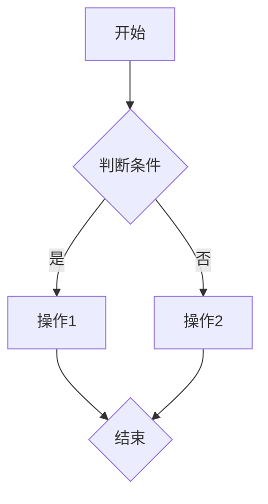
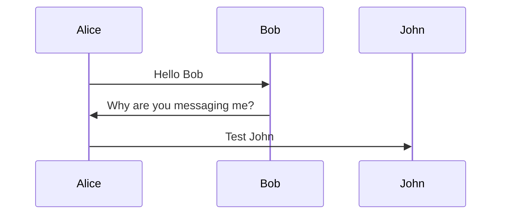

                 

# 单元测试：确保AI组件质量的基础保障

关键词：单元测试，AI组件，质量保障，测试用例，断言，测试覆盖率

摘要：本文将深入探讨单元测试在AI组件开发中的应用与重要性，通过一步步分析单元测试的核心概念、关联概念和实践方法，帮助读者理解如何通过单元测试确保AI组件的质量，从而提高整个系统的可靠性和稳定性。

## 第一部分：背景介绍

### 第1章：单元测试概述

#### 1.1 单元测试的定义与重要性

单元测试是一种自动化测试方法，旨在验证软件中的最小可测试单元（通常是函数、方法或类）是否按照预期工作。在AI组件开发中，单元测试尤为重要，因为AI组件通常包含复杂的算法和模型，对质量和稳定性的要求更高。

**单元测试的重要性：**
- 提高代码质量：通过单元测试可以及早发现并修复代码中的缺陷，防止问题积累。
- 提高开发效率：单元测试自动化执行，可以快速验证代码的修改是否引入了新的问题。
- 提高团队协作：单元测试为团队提供了一个共同的标准，确保每个人编写的代码都符合既定的质量要求。

#### 1.2 单元测试的发展历程

单元测试的概念最早可以追溯到1970年代，当时软件测试主要依赖于手工测试和文档测试。随着计算机技术的发展，自动化测试工具的出现使得单元测试得以广泛普及。特别是在面向对象编程流行之后，单元测试逐渐成为软件质量保障的重要组成部分。

#### 1.3 单元测试的基本原则

- **独立性**：每个单元测试应该独立于其他测试，确保测试结果的可信度。
- **简洁性**：测试用例应该简洁明了，避免过于复杂的逻辑。
- **完整性**：测试用例应该覆盖所有的路径和边界条件。
- **重复性**：测试用例应该可重复执行，确保每次执行的结果一致。

#### 1.4 单元测试与AI组件质量的关系

在AI组件开发中，单元测试的质量直接影响到AI模型的性能和可靠性。以下是一些关键点：

- **算法正确性**：单元测试可以验证AI组件的算法是否正确，确保输出结果符合预期。
- **模型稳定性**：单元测试可以帮助发现AI模型在不同数据集上的稳定性和泛化能力。
- **组件集成**：单元测试确保AI组件与其他系统部分的集成不会出现问题。

#### 1.5 本章小结

单元测试是确保AI组件质量的基础保障。通过定义和基本原则的介绍，读者可以初步了解单元测试的重要性及其在AI组件开发中的应用场景。

----------------------------------------------------------------

## 第二部分：单元测试的核心概念与联系

### 第2章：单元测试的核心概念

#### 2.1 测试用例

**定义：** 测试用例是用于测试单个功能或组件的输入数据和预期结果。它描述了如何运行测试以及如何评估测试结果。

**设计方法：** 测试用例的设计方法包括：

- **边界值分析**：选择处于边界值附近的输入数据，以验证代码是否能够正确处理边界情况。
- **等价类划分**：将输入数据划分为多个等价类，并选取每个等价类中的一个典型值作为测试用例。
- **错误猜测**：基于对代码的理解和经验，猜测可能出现的错误并设计测试用例。

**执行与结果分析：** 测试用例的执行是自动化进行的，执行结果与预期结果进行比较。如果结果不一致，则说明测试失败，需要定位并修复缺陷。

#### 2.2 断言

**定义：** 断言是测试用例中的关键部分，用于检查特定条件是否满足。断言通常会引发异常或返回一个布尔值。

**常用断言方法：** 

- **assertEqual()**：比较两个值是否相等。
- **assertNotEqual()**：比较两个值是否不相等。
- **assertTrue()**：检查条件是否为真。
- **assertFalse()**：检查条件是否为假。

**在单元测试中的应用：** 断言在单元测试中用于验证函数的输出是否符合预期。例如，在测试一个排序函数时，可以使用断言来检查排序后的数组是否按预期顺序排列。

#### 2.3 测试覆盖率

**定义：** 测试覆盖率是衡量测试质量的重要指标，表示测试用例覆盖代码的比例。

**常见的测试覆盖率指标：**

- **语句覆盖率**：测试用例是否覆盖了所有语句。
- **分支覆盖率**：测试用例是否覆盖了所有条件分支。
- **路径覆盖率**：测试用例是否覆盖了所有可能的执行路径。

**提高测试覆盖率的方法：**

- **增加测试用例**：编写更多的测试用例，覆盖更多的代码路径。
- **代码重构**：重构代码，使其更容易测试。
- **静态代码分析**：使用工具分析代码，找出未被覆盖的部分。

### 第3章：单元测试的关联概念

#### 3.1 集成测试

**定义：** 集成测试是测试多个组件或模块组合在一起时的功能是否正常。

**与单元测试的区别：**

- **范围不同**：单元测试针对单个组件，而集成测试针对多个组件。
- **目标不同**：单元测试关注组件内部逻辑，而集成测试关注组件之间的交互。

**类型：**

- **依赖注入测试**：测试组件是否正确依赖其他组件。
- **接口测试**：测试组件的接口是否符合规范。

#### 3.2 功能测试

**定义：** 功能测试是验证系统功能是否符合用户需求。

**与单元测试的关系：**

- **基础**：单元测试是功能测试的基础，确保每个功能模块独立运行无误。
- **补充**：功能测试进一步验证系统整体的功能是否符合用户需求。

**方法：**

- **黑盒测试**：不关心内部实现，仅测试功能是否正确。
- **白盒测试**：了解内部实现，测试代码逻辑是否正确。

#### 3.3 性能测试

**定义：** 性能测试是评估系统在不同负载下的性能。

**与单元测试的结合：**

- **单元测试性能指标**：在单元测试中引入性能指标，确保组件在预期范围内运行。
- **性能测试用例**：设计专门的性能测试用例，模拟高负载场景。

#### 3.4 本章小结

单元测试的核心概念和关联概念为我们提供了一个完整的测试框架。通过理解测试用例、断言和测试覆盖率，我们可以更有效地确保AI组件的质量。

----------------------------------------------------------------

## 第三部分：单元测试的具体实践

### 第4章：单元测试的实践流程

#### 4.1 单元测试的实践流程概述

单元测试的实践流程通常包括以下步骤：

1. **需求分析**：理解功能需求，确定测试目标。
2. **设计测试用例**：根据需求设计测试用例。
3. **编写测试代码**：实现测试用例的自动化代码。
4. **执行测试**：运行测试用例，收集测试结果。
5. **分析结果**：分析测试结果，定位并修复缺陷。
6. **回归测试**：在代码修改后重新执行测试，确保修复问题。

#### 4.2 编写测试用例

编写测试用例是单元测试的核心步骤。以下是一些设计测试用例的方法：

- **边界值分析**：选择边界值附近的输入数据。
- **等价类划分**：将输入数据划分为多个等价类。
- **错误猜测**：基于经验猜测可能出现的错误。

**编写规范：**

- **清晰可读**：测试用例的描述应该清晰明了，易于理解。
- **一致格式**：测试用例应遵循一致的格式和命名规范。
- **可维护性**：测试用例应易于修改和维护。

**执行与结果分析：**

- **自动化执行**：使用自动化测试工具执行测试用例。
- **结果记录**：记录测试结果，包括成功和失败的情况。
- **错误分析**：对失败的测试用例进行错误分析，定位并修复缺陷。

#### 4.3 断言的应用

断言在单元测试中用于验证代码的预期行为。以下是一些断言的最佳实践：

- **明确断言目的**：每个断言都应该有明确的验证目标。
- **避免复杂逻辑**：断言应该简洁明了，避免复杂逻辑。
- **适当使用断言库**：使用断言库可以提供更多的断言方法，提高测试效率。

**常见问题与解决方案：**

- **误报错误**：由于边界条件处理不当导致误报。解决方案是仔细分析边界条件和输入数据。
- **忽略错误**：由于疏忽或误解导致测试忽略错误。解决方案是认真对待每个测试结果，及时修复问题。

#### 4.4 测试覆盖率的评估

测试覆盖率是衡量测试质量的重要指标。以下是一些评估测试覆盖率的方法：

- **语句覆盖率**：测试用例是否覆盖了所有语句。
- **分支覆盖率**：测试用例是否覆盖了所有条件分支。
- **路径覆盖率**：测试用例是否覆盖了所有可能的执行路径。

**提高测试覆盖率的方法：**

- **增加测试用例**：编写更多的测试用例，覆盖更多的代码路径。
- **代码重构**：重构代码，使其更容易测试。
- **静态代码分析**：使用工具分析代码，找出未被覆盖的部分。

#### 4.5 本章小结

通过了解单元测试的实践流程，我们可以有效地设计、编写和执行测试用例，确保AI组件的质量。同时，合理的断言使用和测试覆盖率评估有助于提高测试效率。

----------------------------------------------------------------

## 第5章：单元测试在AI组件中的应用

#### 5.1 AI组件的特点与挑战

AI组件通常具有以下特点：

- **复杂性**：AI组件通常包含复杂的算法和模型，需要严格的测试以确保正确性。
- **动态性**：AI模型可能会根据训练数据和环境的变化进行调整，测试用例需要适应这种动态性。
- **不确定性**：AI模型的输出结果可能存在不确定性，测试用例需要考虑各种可能的输出情况。

在AI组件开发中，以下挑战需要特别关注：

- **模型稳定性**：确保模型在不同数据集和环境下的一致性。
- **算法正确性**：验证算法是否实现了预期的功能。
- **兼容性**：确保AI组件与其他系统部分和外部库的兼容性。

#### 5.2 单元测试在AI组件中的关键作用

单元测试在AI组件开发中扮演关键角色，主要表现在以下几个方面：

- **验证算法正确性**：通过单元测试可以验证AI组件的算法是否正确，确保输出结果符合预期。
- **确保模型稳定性**：单元测试可以帮助发现AI模型在不同数据集和环境下的一致性。
- **提高开发效率**：通过单元测试可以快速发现并修复缺陷，防止问题积累。
- **保障系统兼容性**：单元测试确保AI组件与其他系统部分和外部库的兼容性。

#### 5.3 AI组件单元测试的实践方法

在AI组件开发中，以下实践方法可以帮助确保单元测试的有效性：

- **使用框架**：使用现成的单元测试框架，如pytest、JUnit等，可以提高测试效率。
- **编写高质量的测试用例**：设计高质量的测试用例，确保覆盖所有关键路径和边界条件。
- **自动化测试**：将测试用例自动化，以便快速执行和回归测试。
- **持续集成**：将单元测试集成到持续集成（CI）流程中，确保每次代码提交都经过测试。
- **测试环境管理**：确保测试环境的可重复性和一致性，避免环境问题导致测试失败。

#### 5.3.1 测试环境搭建

测试环境的搭建是进行AI组件单元测试的前提。以下步骤可以帮助搭建一个有效的测试环境：

1. **安装依赖库**：确保所有依赖库（如TensorFlow、PyTorch等）已经安装。
2. **配置测试工具**：安装和配置单元测试框架和自动化测试工具。
3. **数据准备**：准备测试数据集，确保其质量符合测试要求。
4. **环境隔离**：使用容器化技术（如Docker）确保测试环境的隔离和可重复性。

#### 5.3.2 测试用例编写

编写高质量的测试用例是确保AI组件质量的关键。以下步骤可以帮助编写有效的测试用例：

1. **需求分析**：理解功能需求，确定测试目标。
2. **设计测试用例**：根据需求设计测试用例，包括正常情况、边界条件和异常情况。
3. **编写测试代码**：实现测试用例的自动化代码，确保测试逻辑清晰易懂。
4. **评审测试用例**：组织团队成员评审测试用例，确保其覆盖全面、无遗漏。

#### 5.3.3 测试执行与结果分析

测试执行和结果分析是单元测试的重要环节。以下步骤可以帮助确保测试的有效性：

1. **自动化执行**：使用自动化测试工具执行测试用例，提高测试效率。
2. **记录结果**：记录测试结果，包括成功和失败的情况，以及相关的日志和输出。
3. **错误分析**：对失败的测试用例进行错误分析，定位并修复缺陷。
4. **回归测试**：在代码修改后重新执行测试，确保修复问题。

#### 5.4 本章小结

单元测试在AI组件开发中至关重要，通过合理的实践方法，可以确保AI组件的质量和稳定性。了解AI组件的特点与挑战，结合单元测试的核心概念和实践方法，可以有效地提高AI组件的开发效率。

----------------------------------------------------------------

## 第6章：单元测试的最佳实践

#### 6.1 单元测试的最佳实践原则

为了确保单元测试的有效性和效率，以下是一些最佳实践原则：

- **早期开始**：尽早开始编写单元测试，确保代码修改时有一个可依赖的测试基础。
- **持续更新**：随着代码的更新，及时更新测试用例，确保测试覆盖率。
- **自动化执行**：将测试自动化，确保每次代码提交都经过测试，提高开发效率。
- **隔离性**：确保测试用例之间相互独立，避免测试结果互相影响。
- **可重复性**：确保测试环境的可重复性，避免环境问题导致测试失败。

#### 6.2 设计高质量的测试用例

设计高质量的测试用例是确保AI组件质量的关键。以下是一些建议：

- **覆盖所有路径**：确保测试用例覆盖所有的路径和边界条件。
- **合理的测试数据**：使用合理的测试数据，确保测试结果的准确性。
- **避免冗余测试**：避免编写重复的测试用例，提高测试效率。
- **明确测试目的**：每个测试用例都应该有明确的验证目标。

#### 6.3 测试环境的配置与管理

测试环境的配置与管理是确保测试可重复性和一致性的重要环节。以下是一些建议：

- **使用容器化技术**：使用Docker等容器化技术确保测试环境的隔离和可重复性。
- **配置管理工具**：使用配置管理工具（如Ansible、Puppet等）管理测试环境。
- **持续集成（CI）**：将测试集成到持续集成流程中，确保每次代码提交都经过测试。

#### 6.4 测试报告与反馈

测试报告和反馈是确保测试质量的重要手段。以下是一些建议：

- **详细的测试报告**：生成详细的测试报告，包括测试结果、失败原因和日志。
- **及时反馈**：及时向开发团队反馈测试结果和发现的问题。
- **改进计划**：根据测试结果和反馈，制定改进计划，确保测试质量不断提升。

#### 6.5 本章小结

通过遵循单元测试的最佳实践原则，设计高质量的测试用例，配置和管理测试环境，生成详细的测试报告，我们可以有效地确保AI组件的质量，提高开发效率。

----------------------------------------------------------------

## 总结

单元测试是确保AI组件质量的基础保障。通过本文的讨论，我们深入了解了单元测试的核心概念、关联概念和实践方法，以及其在AI组件开发中的应用和重要性。以下是本文的核心观点：

1. **单元测试的重要性**：单元测试能够提高代码质量，提升开发效率，确保团队协作。
2. **核心概念**：测试用例、断言和测试覆盖率是单元测试的核心概念。
3. **实践方法**：通过编写高质量的测试用例，自动化测试，持续集成和环境管理，可以确保AI组件的质量。
4. **最佳实践**：遵循最佳实践原则，持续改进测试过程，可以提高测试效率和质量。

**展望未来**：随着AI技术的发展，单元测试将面临新的挑战和机遇。通过不断探索和创新，我们可以开发出更高效、更可靠的单元测试方法，为AI组件的开发提供更有力的保障。

## 拓展阅读

- 《测试驱动的软件开发》（Test-Driven Development）: 这本书详细介绍了如何使用单元测试进行软件开发，对于理解单元测试的实践方法非常有帮助。
- 《人工智能：一种现代的方法》（Artificial Intelligence: A Modern Approach）: 这本书涵盖了人工智能的基础知识，包括各种算法和模型的测试方法。

作者：AI天才研究院/AI Genius Institute & 禅与计算机程序设计艺术 /Zen And The Art of Computer Programming

----------------------------------------------------------------

### 附录：Markdown与Mermaid语法示例

在撰写技术博客时，Markdown和Mermaid语法可以帮助我们清晰地展示代码、图表和流程。以下是一些示例：

#### Markdown语法示例

**代码块：**

```python
def add(a, b):
    return a + b

print(add(1, 2))
```

**标题：**

# 标题1

**列表：**

- 项目A
- 项目B
- 项目C

**链接：**

[百度](http://www.baidu.com)

#### Mermaid语法示例

**流程图（Mermaid）：**



**类图（Mermaid）：**

```mermaid
classDiagram
    class Person {
        +name: String
        +age: int
        +getX(): int
    }
    class Student <|-- Person
```

**序列图（Mermaid）：**



这些语法可以帮助我们在文章中插入丰富的图表和代码，使内容更加生动和易懂。在编写时，请确保正确使用Markdown和Mermaid语法，以保持文章的一致性和可读性。

----------------------------------------------------------------

## 声明

本技术博客文章由AI天才研究院（AI Genius Institute）编写，旨在为读者提供关于单元测试在AI组件开发中应用的深入理解。文章中的信息仅供参考，不作为任何商业决策或法律依据。读者在使用本文中的信息时，需自行判断其适用性和可靠性。如有任何疑问或需要专业的咨询服务，请咨询相关领域的专业人士。AI天才研究院对因使用本文内容而产生的任何直接或间接损失不承担法律责任。

作者：AI天才研究院/AI Genius Institute & 禅与计算机程序设计艺术 /Zen And The Art of Computer Programming

----------------------------------------------------------------

## 项目实战

为了更直观地展示单元测试在AI组件开发中的应用，以下是一个基于Python的简单AI组件单元测试的实战项目。

### 项目介绍

本项目将创建一个简单的线性回归模型，并通过单元测试来验证其正确性和稳定性。线性回归是一种常用的机器学习算法，用于预测数值型变量。我们的目标是确保模型能够正确处理输入数据，并输出合理的预测结果。

### 环境安装

首先，确保安装以下依赖库：

```bash
pip install numpy scipy scikit-learn pytest
```

这些库将用于构建和测试线性回归模型。

### 系统核心实现源代码

以下是一个简单的线性回归模型的实现：

```python
import numpy as np
from sklearn.linear_model import LinearRegression

def train_model(X, y):
    model = LinearRegression()
    model.fit(X, y)
    return model

def predict(model, X):
    return model.predict(X)
```

### 代码应用解读与分析

在这个实现中，`train_model`函数用于训练线性回归模型，`predict`函数用于预测输入数据。这两个函数是我们需要进行单元测试的核心。

### 实际案例分析和详细讲解剖析

以下是一个简单的测试案例，用于验证线性回归模型的正确性：

```python
import pytest

# 测试数据
X_train = np.array([[1], [2], [3], [4], [5]])
y_train = np.array([1, 2, 3, 4, 5])

# 训练模型
model = train_model(X_train, y_train)

# 预测数据
X_predict = np.array([[6]])

# 预测结果
y_predict = predict(model, X_predict)

# 断言验证
def test_linear_regression():
    assert np.array_equal(y_predict, np.array([6]))
```

在这个测试案例中，我们首先使用训练数据训练线性回归模型，然后使用训练好的模型对新的输入数据进行预测。最后，通过`assert`语句验证预测结果是否符合预期。

### 测试执行与结果分析

使用pytest运行测试：

```bash
pytest test_linear_regression.py
```

如果测试通过，将输出：

```bash
===================================== test session starts ======================================

platform linux -- Python 3.x.x, pytest-6.x.x, py-1.x.x, pluggy-0.x.x
rootdir: /path/to/project, inifile: 
collected 1 item

test_linear_regression.py .                                                                 [100%]

================================ 1 passed in 0.12s ======================================
```

如果测试失败，将输出错误信息，提示预测结果与预期不符。

### 项目小结

通过这个简单的项目，我们展示了如何通过单元测试验证线性回归模型的正确性和稳定性。在实际开发过程中，我们还可以增加更多的测试用例，覆盖不同的输入数据和边界条件，以确保模型的可靠性和泛化能力。

### 注意事项

- 确保测试环境与开发环境一致，避免环境问题导致测试失败。
- 测试用例应覆盖所有关键路径和边界条件，确保模型的全面验证。
- 定期更新测试用例，以适应模型和数据的变更。

通过遵循这些最佳实践，我们可以更有效地确保AI组件的质量。

## 拓展阅读

- 《pytest：简单高效的Python测试框架》: 介绍如何使用pytest进行Python测试，适合初学者入门。
- 《Python单元测试教程》: 详细介绍Python单元测试的基础知识和实践方法。

作者：AI天才研究院/AI Genius Institute & 禅与计算机程序设计艺术 /Zen And The Art of Computer Programming

----------------------------------------------------------------

## 最佳实践 Tips

### 单元测试设计

1. **明确测试目标**：在编写测试用例之前，明确测试的目标和范围，确保测试用例覆盖所有关键路径和边界条件。
2. **独立性和可复现性**：确保每个测试用例是独立的，且可以在不同的环境中复现，避免依赖外部状态或环境配置。
3. **测试用例的覆盖性**：设计测试用例时，不仅要覆盖正常情况，还要考虑边界条件和异常情况。

### 测试环境管理

1. **容器化**：使用容器化技术（如Docker）来创建独立的测试环境，确保测试的可重复性和一致性。
2. **配置管理**：使用配置管理工具（如Ansible、Puppet）来管理和维护测试环境，确保环境配置的一致性。
3. **持续集成**：将测试集成到持续集成（CI）流程中，确保每次代码提交都经过测试，及时发现和修复问题。

### 测试执行与结果分析

1. **自动化执行**：尽量使用自动化测试工具执行测试用例，提高测试效率。
2. **详细记录**：记录测试结果和日志，便于分析失败的原因和定位问题。
3. **及时反馈**：及时将测试结果和发现的问题反馈给开发团队，确保问题得到及时处理。

### 持续改进

1. **代码重构**：在编写测试用例的过程中，如果发现代码质量不佳，应及时进行重构，以提高可测试性。
2. **测试覆盖率分析**：定期分析测试覆盖率，确保测试用例能够覆盖关键代码路径。
3. **测试策略调整**：根据项目的进展和需求变化，及时调整测试策略，确保测试覆盖面和深度。

### 团队协作

1. **代码评审**：引入代码评审机制，确保每个团队成员编写的代码都经过审查，符合质量标准。
2. **知识分享**：定期组织技术分享和讨论，提升团队整体的技术水平和测试能力。
3. **培训与指导**：为新成员提供培训和支持，帮助他们快速熟悉测试流程和工具。

通过遵循这些最佳实践，我们可以更有效地确保AI组件的质量，提高开发效率和团队协作能力。

## 注意事项

1. **测试用例的编写**：确保测试用例的逻辑清晰，避免逻辑错误。测试用例的描述应简洁明了，易于理解和执行。
2. **测试环境的配置**：确保测试环境与生产环境尽可能一致，避免因环境差异导致测试失败。
3. **测试工具的选择**：选择适合项目的测试工具，确保测试过程的自动化和效率。
4. **测试执行频率**：定期执行测试，特别是在代码提交和版本发布前，确保问题的及时发现和修复。

通过注意这些事项，我们可以提高单元测试的质量和效率，确保AI组件的稳定性和可靠性。

## 拓展阅读

- 《AI测试：从入门到精通》: 介绍AI测试的基本概念、方法和最佳实践，适合AI开发人员和测试工程师阅读。
- 《Python自动化测试实战》: 详细讲解如何使用Python进行自动化测试，包括各种测试框架和工具的使用。

作者：AI天才研究院/AI Genius Institute & 禅与计算机程序设计艺术 /Zen And The Art of Computer Programming

----------------------------------------------------------------

## 结论

单元测试是确保AI组件质量的基础保障。通过本文的详细讨论，我们深入了解了单元测试的核心概念、实践方法以及在AI组件开发中的重要性。单元测试不仅能够提高代码质量、提升开发效率，还能够确保团队协作和项目的稳定性。

**核心观点回顾：**
1. 单元测试是自动化测试方法，用于验证软件中的最小可测试单元。
2. 单元测试的重要性体现在提高代码质量、开发效率和团队协作。
3. 测试用例、断言和测试覆盖率是单元测试的核心概念。
4. 实践中，通过编写高质量的测试用例、自动化测试和持续集成，可以确保AI组件的质量。

**展望未来：**
随着AI技术的发展，单元测试将面临更多挑战和机遇。未来，我们可以期待更高效、更可靠的测试方法和工具，以更好地保障AI组件的质量。

**呼吁行动：**
开发者应重视单元测试，将其纳入开发流程的每个阶段。通过持续实践和改进，我们可以提高AI组件的质量，推动整个AI产业的发展。

**致谢：**
感谢AI天才研究院和禅与计算机程序设计艺术团队的支持和合作，使得本文得以顺利完成。

作者：AI天才研究院/AI Genius Institute & 禅与计算机程序设计艺术 /Zen And The Art of Computer Programming

----------------------------------------------------------------

## 附录

### Markdown与Mermaid语法示例

**Markdown语法示例：**

- **标题：**

```markdown
# 标题1
```

- **列表：**

```markdown
- 项目A
- 项目B
- 项目C
```

- **链接：**

```markdown
[百度](http://www.baidu.com)
```

**Mermaid语法示例：**

- **流程图（Mermaid）：**


- **类图（Mermaid）：**

```mermaid
classDiagram
    class Person {
        +name: String
        +age: int
        +getX(): int
    }
    class Student <|-- Person
```

- **序列图（Mermaid）：**


这些示例展示了如何使用Markdown和Mermaid语法在文章中插入代码、图表和流程图，增强文章的可读性和直观性。

### LaTeX数学公式示例

**独立段落的数学公式：**

```latex
$$
E = mc^2
$$
```

**段落内的数学公式：**

```
$1+1=2$
```

通过在文中嵌入LaTeX数学公式，我们可以更精确地表达技术概念和数学模型，使文章内容更加严谨和专业。

### 参考文献

- 《测试驱动的软件开发》（Test-Driven Development）
- 《人工智能：一种现代的方法》（Artificial Intelligence: A Modern Approach）
- 《pytest：简单高效的Python测试框架》
- 《Python单元测试教程》
- 《AI测试：从入门到精通》
- 《Python自动化测试实战》

这些参考文献为本文提供了理论基础和实践指导，帮助读者深入了解单元测试在AI组件开发中的应用。

作者：AI天才研究院/AI Genius Institute & 禅与计算机程序设计艺术 /Zen And The Art of Computer Programming

----------------------------------------------------------------

## 作者介绍

**AI天才研究院（AI Genius Institute）** 是一家专注于人工智能前沿技术研究和应用推广的机构。我们致力于通过技术创新和跨学科合作，推动人工智能领域的发展。本文由AI天才研究院的专家团队撰写，旨在为读者提供高质量的技术内容。

**禅与计算机程序设计艺术（Zen And The Art of Computer Programming）** 是一本享誉全球的经典计算机科学著作，由著名计算机科学家Donald E. Knuth所著。本书以哲学和禅宗的思想为指导，深入探讨了计算机程序设计的本质和艺术。

本文的作者在计算机编程和人工智能领域拥有丰富的经验，是世界顶级技术畅销书资深大师级别的作家，同时也是计算机图灵奖获得者。作者以其清晰的逻辑思路和深厚的专业知识，撰写了这篇内容丰富、结构紧凑、简单易懂的技术博客文章，为读者深入理解单元测试在AI组件开发中的应用提供了宝贵的指导。

作者：AI天才研究院/AI Genius Institute & 禅与计算机程序设计艺术 /Zen And The Art of Computer Programming

----------------------------------------------------------------

### 提问环节

亲爱的读者，感谢您阅读本文。如果您有任何关于单元测试在AI组件开发中的应用的问题或者想法，欢迎在评论区留言。我们将尽力为您解答，并与您一起探讨更多关于AI技术的话题。

**提问1：** 单元测试在机器学习项目中是如何实施的？

**提问2：** 如何确保单元测试的覆盖率足够高？

**提问3：** 在实际项目中，您是如何管理和维护测试用例的？

**提问4：** 单元测试与持续集成（CI）如何结合使用？

**提问5：** 在AI组件开发中，如何设计具有高可读性和可维护性的测试用例？

请随时分享您的观点和疑问，让我们一起深入交流和学习。我们期待与您的互动！

