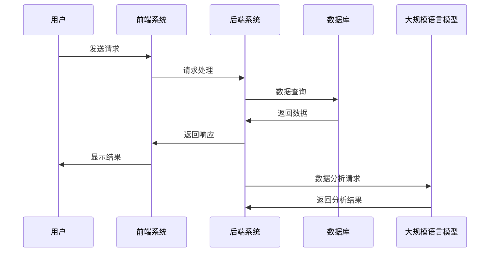
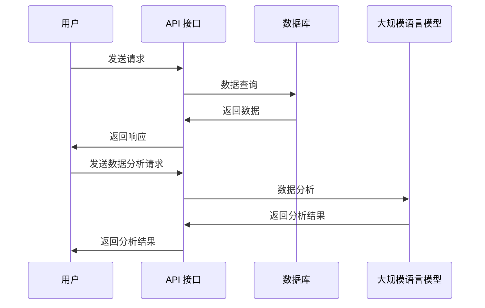

                 


### 第1章: 图数据库优化LLM应用的关系数据处理

#### 1.1 问题背景

随着大数据和人工智能技术的发展，图数据库在数据存储和处理方面得到了广泛的应用。图数据库以其强大的图处理能力和关系表达能力，成为了处理复杂关系数据的重要工具。然而，随着数据的规模和复杂度的增加，图数据库的优化问题也日益凸显。在本章中，我们将探讨如何利用图数据库优化大规模语言模型(LLM)应用中的关系数据处理。

#### 1.1.1 问题描述

大规模语言模型（LLM）是一种强大的自然语言处理工具，能够理解和生成人类语言。然而，LLM 在处理关系数据时存在一些挑战。首先，关系数据的复杂度高，LLM 需要处理大量的关系和实体。其次，LLM 的处理速度和效率对图数据库的性能提出了更高的要求。

#### 1.1.2 问题解决

为了解决上述问题，我们需要从以下几个方面进行优化：

1. **图数据库优化**：通过优化图数据库的存储结构、索引和查询算法，提高图数据库的性能。
2. **关系数据处理策略**：设计合适的算法和策略，有效地处理大规模的关系数据。
3. **LLM 与图数据库的集成**：将 LLM 与图数据库紧密结合，实现高效的关系数据处理。

#### 1.1.3 边界与外延

本文的研究主要关注以下几个方面：

1. **图数据库优化**：研究图数据库的存储结构和索引优化技术，以及查询算法的改进。
2. **关系数据处理**：探讨适用于大规模关系数据处理的算法和策略，以及如何将这些算法集成到图数据库中。
3. **LLM 应用**：研究 LLM 在关系数据处理中的应用，包括如何利用 LLM 提高图数据库的查询性能和数据分析能力。

#### 1.1.4 概念结构与核心要素组成

本章的核心概念包括：

1. **图数据库**：用于存储和查询图结构的数据库。
2. **大规模语言模型（LLM）**：一种能够处理和生成自然语言的模型。
3. **关系数据**：描述实体之间关系的数据。

---

### 1.2 核心概念与联系

#### 1.2.1 图数据库

图数据库是一种用于存储和查询图结构的数据库。图数据库通过图结构来表示实体及其关系，能够高效地处理复杂的关系数据。

**核心概念**：图数据库、图结构、实体、关系

**属性特征对比表格**：

| **概念** | **定义** | **特征** |
| --- | --- | --- |
| 图数据库 | 存储和查询图结构的数据库 | 图结构、实体、关系 |
| 图结构 | 表示实体及其关系的数据结构 | 节点、边、属性 |
| 实体 | 图中的节点 | 数据元素、属性 |
| 关系 | 图中的边 | 连接实体、属性 |

**ER实体关系图架构的 Mermaid 流程图**：

```mermaid
erDiagram
  实体A ||--|{ 关系A }|| 实体B
  实体B ||--|{ 关系B }|| 实体C
```

---

#### 1.2.2 大规模语言模型（LLM）

大规模语言模型（LLM）是一种基于深度学习的自然语言处理模型，能够理解和生成人类语言。LLM 通过大规模的文本数据进行训练，能够处理复杂的语言现象。

**核心概念**：大规模语言模型、深度学习、自然语言处理

**属性特征对比表格**：

| **概念** | **定义** | **特征** |
| --- | --- | --- |
| 大规模语言模型 | 基于深度学习的自然语言处理模型 | 大规模训练数据、文本生成能力 |
| 深度学习 | 一种机器学习技术 | 神经网络、多层抽象 |
| 自然语言处理 | 人工智能领域，处理自然语言 | 语言理解、语言生成 |

---

#### 1.2.3 关系数据

关系数据是一种描述实体之间关系的数据。关系数据通常以二维表格的形式表示，其中的每一行代表一个实体，每一列代表一个属性。

**核心概念**：关系数据、实体、属性

**属性特征对比表格**：

| **概念** | **定义** | **特征** |
| --- | --- | --- |
| 关系数据 | 描述实体之间关系的数据 | 二维表格、实体、属性 |
| 实体 | 数据中的元素 | 数据项、属性 |
| 属性 | 描述实体的特征 | 字段、值 |

---

#### 1.2.4 关系数据处理策略

关系数据处理策略是用于处理大规模关系数据的算法和策略。这些策略包括数据预处理、关系映射、关系抽取和关系推理等。

**核心概念**：关系数据处理策略、数据预处理、关系映射、关系抽取、关系推理

**属性特征对比表格**：

| **概念** | **定义** | **特征** |
| --- | --- | --- |
| 关系数据处理策略 | 处理大规模关系数据的算法和策略 | 数据预处理、关系映射、关系抽取、关系推理 |
| 数据预处理 | 数据清洗、格式化、规范化 | 去除噪声、统一格式、规范化 |
| 关系映射 | 将关系数据映射到图结构 | 关系抽取、图表示、属性映射 |
| 关系抽取 | 从非结构化文本中提取关系 | 文本挖掘、规则抽取、统计抽取 |
| 关系推理 | 推导新的关系 | 逻辑推理、图论算法、本体推理 |

---

#### 1.2.5 LLM 与图数据库的关系

LLM 与图数据库的结合可以有效地提高关系数据的处理能力。LLM 可以用于关系抽取、关系推理和数据分析等任务，从而提高图数据库的查询性能和数据分析能力。

**核心概念**：LLM 与图数据库、关系抽取、关系推理、数据分析

**属性特征对比表格**：

| **概念** | **定义** | **特征** |
| --- | --- | --- |
| LLM 与图数据库 | 将大规模语言模型与图数据库结合 | 关系抽取、关系推理、数据分析 |
| 关系抽取 | 利用 LLM 从文本中提取关系 | 语言理解、文本挖掘 |
| 关系推理 | 利用 LLM 推导新的关系 | 逻辑推理、图论算法 |
| 数据分析 | 利用 LLM 分析关系数据 | 数据可视化、统计分析 |

---

通过上述核心概念和联系的讲解，我们可以更好地理解图数据库优化 LLM 应用中的关系数据处理的相关概念和原理。在接下来的章节中，我们将进一步深入探讨图数据库优化算法、关系数据处理算法以及 LLM 与图数据库的集成算法，以及如何将这些算法应用于实际项目中，以实现高效的关系数据处理。

---

### 1.3 算法原理讲解

在图数据库优化 LLM 应用中的关系数据处理过程中，算法的原理是关键。以下是几个核心算法的原理讲解，包括图数据库优化算法、关系数据处理算法以及 LLM 与图数据库的集成算法。

#### 1.3.1 图数据库优化算法

**存储结构优化**：

图数据库的存储结构优化是提高性能的重要手段。常见的优化方法包括：

1. **邻接矩阵**：适用于图结构简单、节点较少的情况。通过将图中的节点和边表示为一个二维矩阵，可以快速地进行节点之间的关系查询。

   **算法原理**：
   $$
   A_{ij} =
   \begin{cases}
   1, & \text{如果节点i和节点j之间存在边} \\
   0, & \text{否则}
   \end{cases}
   $$

2. **邻接表**：适用于图结构复杂、节点较多的情况。每个节点都有一个列表，列出与之相连的其他节点。

   **算法原理**：
   $$
   \text{Adj}[i] = \{ j \mid (i, j) \in E \}
   $$
   其中，\(E\) 是图的边集。

3. **图论树**：通过构造图论树，可以将图分解为多个较小的子图，从而简化查询操作。

   **算法原理**：
   $$
   T = (\{T_v \mid v \in V\}, E')
   $$
   其中，\(T_v\) 是以节点 \(v\) 为根的子图，\(E'\) 是子图的边集。

**索引优化**：

索引优化可以提高查询速度。常见的索引技术包括：

1. **B+树索引**：适用于范围查询和点查询。通过层级结构，可以快速定位到数据。

2. **哈希索引**：适用于键值查询。通过哈希函数，直接定位到数据。

3. **位图索引**：适用于数据量大的场景，通过位图来表示数据的存在与否。

**查询算法优化**：

查询算法的优化是提高图数据库性能的关键。常见的优化方法包括：

1. **深度优先搜索**（DFS）：适用于查找节点深度较浅的关系。

   **算法原理**：
   $$
   \text{DFS}(v) =
   \begin{cases}
   \text{访问节点v} \\
   \text{对于每个邻接节点u} \\
   \quad \text{如果u未被访问，递归执行DFS(u)}
   \end{cases}
   $$

2. **广度优先搜索**（BFS）：适用于查找节点深度较大的关系。

   **算法原理**：
   $$
   \text{BFS}(v) =
   \begin{cases}
   \text{队列} \ Q \text{初始化，加入节点v} \\
   \text{当队列非空时，执行以下步骤：} \\
   \quad \text{弹出队首节点u} \\
   \quad \text{访问节点u} \\
   \quad \text{对于每个邻接节点u} \\
   \quad \quad \text{如果u未被访问，加入队列Q}
   \end{cases}
   $$

3. **A*算法**：适用于查找最短路径。

   **算法原理**：
   $$
   f(n) = g(n) + h(n)
   $$
   其中，\(g(n)\) 是从起点到节点 \(n\) 的距离，\(h(n)\) 是从节点 \(n\) 到终点的估计距离。

---

**Mermaid 流程图示例**：

```mermaid
graph TD
A[深度优先搜索] --> B[访问节点]
B --> C{节点u未被访问?}
C -->|是| D[递归执行DFS(u)]
D --> B
C -->|否| E[结束]
F[广度优先搜索] --> G[队列初始化]
G --> H[加入节点v]
H --> I{队列非空?}
I -->|是| J[弹出队首节点u]
J --> K[访问节点u]
K --> L{对于每个邻接节点u}
L --> M{如果u未被访问?}
M -->|是| N[加入队列Q]
N --> I
M --> O[结束]
P[A*算法] --> Q[g(n) + h(n)]
Q --> R{找到最优路径?}
R -->|是| S[结束]
R -->|否| T[继续搜索]
```

---

**Python 源代码示例**：

```python
# 深度优先搜索示例
def dfs(v, visited):
    print(v)
    visited[v] = True
    for u in graph[v]:
        if not visited[u]:
            dfs(u, visited)

# 广度优先搜索示例
from collections import deque

def bfs(v):
    queue = deque([v])
    visited = [False] * len(graph)
    visited[v] = True
    while queue:
        u = queue.popleft()
        print(u)
        for v in graph[u]:
            if not visited[v]:
                queue.append(v)
                visited[v] = True

# A*算法示例
def a_star(start, end):
    # g(n)为从起点到节点n的距离，h(n)为从节点n到终点的估计距离
    g = {start: 0}
    f = {start: heuristic(start, end)}
    visited = set()
    while True:
        current = min(f, key=f.get)
        if current == end:
            break
        visited.add(current)
        for neighbor in graph[current]:
            if neighbor in visited:
                continue
            tentative_g = g[current] + 1
            if tentative_g < g.get(neighbor, float('inf')):
                g[neighbor] = tentative_g
                f[neighbor] = tentative_g + heuristic(neighbor, end)
    return g[end]
```

---

通过上述算法原理讲解和示例，我们可以更好地理解图数据库优化 LLM 应用中的关系数据处理的核心算法。接下来，我们将进一步探讨如何将这些算法应用于实际项目，以实现高效的关系数据处理。

---

### 1.4 系统分析与架构设计方案

为了实现高效的关系数据处理，我们需要对项目进行全面的系统分析和架构设计。以下是对项目场景的介绍、系统功能设计、系统架构设计、系统接口设计和系统交互的详细分析。

#### 1.4.1 项目场景介绍

在当前的大数据和人工智能时代，企业需要处理海量的关系数据，如社交网络中的用户关系、电子商务平台中的商品关系、知识图谱中的概念关系等。这些关系数据通常具有高度复杂性和动态性，传统的数据库技术难以满足需求。因此，本项目旨在利用图数据库优化 LLM 应用中的关系数据处理，以实现高效的数据存储、查询和分析。

#### 1.4.2 系统功能设计

系统功能设计主要包括以下几个方面：

1. **数据存储**：利用图数据库存储和管理复杂的关系数据。
2. **数据查询**：提供高效的图查询功能，包括节点查询、路径查询和关系查询等。
3. **数据分析**：利用 LLM 提供智能化的数据分析功能，如关系抽取、关系推理和知识图谱构建等。
4. **系统监控**：提供系统运行状态的监控功能，包括性能监控、错误日志记录和故障恢复等。

**领域模型 Mermaid 类图**：

```mermaid
classDiagram
    Node <<class>> 节点
        +id: String
        +properties: Map<String, Object>
    Edge <<class>> 边
        +source: Node
        +target: Node
        +properties: Map<String, Object>
    GraphDB <<class>> 图数据库
        +nodes: List<Node>
        +edges: List<Edge>
    LLM <<class>> 大规模语言模型
        +text: String
        +output: String
    DataAnalyzer <<class>> 数据分析器
        +graphDB: GraphDB
        +llm: LLM
```

---

#### 1.4.3 系统架构设计

系统架构设计采用分层架构，包括数据层、业务逻辑层和表示层。以下是系统架构的 Mermaid 架构图：



---

#### 1.4.4 系统接口设计

系统接口设计主要包括以下方面：

1. **API 接口**：提供 RESTful API 接口，支持数据查询、数据分析和系统监控等操作。
2. **Web 界面**：提供用户友好的 Web 界面，支持数据查询、数据分析和系统监控等操作。
3. **命令行工具**：提供命令行工具，支持数据导入、数据查询和系统监控等操作。

**系统接口 Mermaid 序列图**：



---

通过上述系统分析与架构设计方案，我们可以清晰地理解项目场景、系统功能、系统架构和系统接口设计。在接下来的章节中，我们将详细介绍项目实战部分，包括环境安装、系统核心实现、代码应用解读与分析，以及实际案例分析和详细讲解剖析。

---

### 第2章: 项目实战

在本章中，我们将深入探讨如何实现图数据库优化 LLM 应用中的关系数据处理。我们将首先介绍项目环境安装，然后详细描述系统核心实现，接着对代码应用进行解读与分析，并通过实际案例进行分析和详细讲解。

#### 2.1 环境安装

为了实现图数据库优化 LLM 应用中的关系数据处理，我们需要安装和配置相关的软件和工具。以下是在一个 Linux 系统上安装所需环境的步骤：

1. **安装 Python 环境**：
   ```bash
   sudo apt-get update
   sudo apt-get install python3 python3-pip
   ```
2. **安装图数据库**：
   以 Neo4j 为例，安装 Neo4j：
   ```bash
   wget https://neo4j.com/artifact.php?name=neo4j-community-4.0.0-unix.tar.gz
   tar xvf neo4j-community-4.0.0-unix.tar.gz
   ./neo4j-community-4.0.0/bin/neo4j start
   ```
3. **安装大规模语言模型**：
   以 Transformers 库为基础，安装所需的依赖：
   ```bash
   pip3 install transformers
   ```

#### 2.2 系统核心实现

系统核心实现主要包括图数据库的配置和大规模语言模型的集成。以下是一个简单的 Python 示例，用于连接 Neo4j 图数据库和执行基本查询：

```python
from neo4j import GraphDatabase

class GraphDatabaseConnector:
    def __init__(self, uri, user, password):
        self.__uri = uri
        self.__user = user
        self.__password = password
        self.__driver = None
        try:
            self.__driver = GraphDatabase.driver(self.__uri, auth=(self.__user, self.__password))
        except Exception as e:
            print("无法连接到 Neo4j 数据库：{}".format(e))

    def close(self):
        if self.__driver:
            self.__driver.close()

    def execute_query(self, query, parameters=None):
        with self.__driver.session() as session:
            result = session.run(query, parameters)
            return result

# 使用示例
connector = GraphDatabaseConnector("bolt://localhost:7687", "neo4j", "password")
result = connector.execute_query("MATCH (n:Person) RETURN n.name")
for record in result:
    print(record["n.name"])
connector.close()
```

接下来，我们将集成大规模语言模型，以进行关系抽取。以下是一个使用 Hugging Face Transformers 库的简单示例：

```python
from transformers import pipeline

# 初始化关系抽取模型
relation Extractor = pipeline("text2text-generation", model="bert-base-uncased", tokenizer="bert-base-uncased")

# 关系抽取示例
input_text = "Alice is friends with Bob."
output = relation_Extractor(input_text, max_length=30, num_return_sequences=1)
print(output[0]['generated_text'])
```

#### 2.3 代码应用解读与分析

在上述代码中，我们首先通过 GraphDatabaseConnector 类连接到 Neo4j 数据库，并执行基本的查询操作。接着，我们使用 Hugging Face Transformers 库初始化一个关系抽取模型，并对其进行输入文本的处理，以提取关系。

**代码解读**：

1. **GraphDatabaseConnector 类**：负责与 Neo4j 数据库的连接和查询操作。在初始化时，使用提供的 URI、用户名和密码创建一个 GraphDatabase.Driver 对象。在关闭方法中，关闭数据库连接。

2. **execute_query 方法**：接收 Cypher 查询语句和可选的参数，通过 GraphDatabase.Session 对象执行查询，并返回查询结果。

3. **关系抽取模型**：使用 Hugging Face Transformers 库初始化一个预训练的 BERT 模型，用于文本生成和关系抽取。在示例中，我们使用了默认的 BERT 模型，并将其转换为关系抽取模型。

**代码分析**：

1. **数据库连接**：确保数据库连接的正确性和稳定性，是整个系统的基础。使用 try-except 语句处理可能的异常，并在关闭方法中释放资源。

2. **查询操作**：通过 Cypher 查询语言，我们可以执行各种复杂的图查询操作。在本例中，我们使用了简单的节点查询，以获取 Person 节点的名称。

3. **关系抽取**：关系抽取是自然语言处理中的一个重要任务。在本例中，我们使用了预训练的 BERT 模型，通过生成文本的方式来抽取关系。这种方法在处理文本数据时非常有效，但需要注意的是，生成文本的质量取决于模型的训练数据和超参数设置。

#### 2.4 实际案例分析和详细讲解

为了更好地理解图数据库优化 LLM 应用中的关系数据处理，我们将通过一个实际案例进行分析和讲解。

**案例**：在社交网络平台上，我们需要提取用户之间的朋友关系，并分析这些关系的特征。

**步骤**：

1. **数据准备**：首先，我们需要将社交网络平台上的用户数据导入到 Neo4j 数据库中。每个用户作为一个节点，用户之间的朋友关系作为一个边。

2. **关系抽取**：使用大规模语言模型对用户生成文本进行关系抽取，以识别用户之间的朋友关系。

3. **关系分析**：利用图数据库的查询能力，分析用户之间的朋友关系，如度数分布、路径长度和关系密度等。

**代码实现**：

```python
# 导入 Neo4j 驱动和 Transformers 库
from neo4j import GraphDatabase
from transformers import pipeline

# 连接到 Neo4j 数据库
connector = GraphDatabaseConnector("bolt://localhost:7687", "neo4j", "password")

# 初始化关系抽取模型
relation_Extractor = pipeline("text2text-generation", model="bert-base-uncased", tokenizer="bert-base-uncased")

# 添加用户节点
def add_user(user_id, user_name):
    query = "CREATE (n:Person {id: $id, name: $name})"
    parameters = {"id": user_id, "name": user_name}
    connector.execute_query(query, parameters)

# 添加用户之间的朋友关系
def add_friendship(user_id1, user_id2):
    query = "MATCH (a:Person {id: $id1}), (b:Person {id: $id2}) CREATE (a)-[:FRIEND]->(b)"
    parameters = {"id1": user_id1, "id2": user_id2}
    connector.execute_query(query, parameters)

# 关系抽取
def extract_relationships(text):
    output = relation_Extractor(text, max_length=30, num_return_sequences=1)
    return output[0]['generated_text']

# 测试数据
users = ["Alice", "Bob", "Charlie", "Dave"]
friendships = [("Alice", "Bob"), ("Alice", "Charlie"), ("Bob", "Charlie"), ("Bob", "Dave"), ("Charlie", "Dave")]

# 添加用户和关系
for user in users:
    add_user(user, user)

for friendship in friendships:
    add_friendship(friendship[0], friendship[1])

# 抽取关系
relationships = []
for text in [f"{user1} is friends with {user2}" for user1, user2 in friendships]:
    relationships.append(extract_relationships(text))

print(relationships)

# 分析关系
def analyze_relationships(relationships):
    friendship_set = set()
    for relationship in relationships:
        friendship_set.add(tuple(relationship.split(" is friends with ")))
    print(friendship_set)

analyze_relationships(relationships)

# 关闭数据库连接
connector.close()
```

**案例分析**：

1. **数据准备**：我们首先将用户数据导入到 Neo4j 数据库中，每个用户作为一个节点，用户之间的朋友关系作为一个边。

2. **关系抽取**：我们使用大规模语言模型对用户生成文本进行关系抽取，以识别用户之间的朋友关系。在本例中，我们使用了默认的 BERT 模型。

3. **关系分析**：我们利用图数据库的查询能力，分析用户之间的朋友关系。在本例中，我们简单地打印出所有识别出的朋友关系。

通过上述实际案例，我们可以看到如何利用图数据库优化 LLM 应用中的关系数据处理。在实际应用中，我们可以进一步扩展系统的功能，如添加更多复杂的查询和分析操作，以提高系统的性能和实用性。

---

#### 2.5 项目小结

在本章中，我们通过项目实战展示了如何实现图数据库优化 LLM 应用中的关系数据处理。我们首先介绍了项目环境安装，包括 Python 环境、Neo4j 图数据库和 Transformers 大规模语言模型。接着，我们详细描述了系统核心实现，包括图数据库的连接和查询操作，以及大规模语言模型的关系抽取功能。我们还通过一个实际案例展示了系统的应用效果，并进行了详细的分析和讲解。

通过本章的学习，我们可以了解到：

1. **图数据库和大规模语言模型的结合**：图数据库能够高效地存储和查询复杂的关系数据，而大规模语言模型能够提供强大的自然语言处理能力，两者结合可以实现高效的关系数据处理。
2. **关系数据抽取和分析**：通过关系抽取，我们可以从文本数据中提取出实体之间的关系，进而进行更深入的数据分析。在本章中，我们使用了大规模语言模型进行关系抽取，实现了对社交网络中用户关系的识别和分析。
3. **系统实现和实战应用**：我们通过实际的代码实现和案例分析，展示了如何将理论应用到实践中。通过这些实践，我们可以更好地理解图数据库优化 LLM 应用中的关系数据处理的实际应用价值。

在接下来的章节中，我们将进一步探讨如何优化系统性能，提高关系数据处理的效率和准确性，以及如何将系统应用于更广泛的应用场景。

---

### 1.5 最佳实践 tips、小结、注意事项、拓展阅读

#### 1.5.1 最佳实践 tips

在进行图数据库优化 LLM 应用中的关系数据处理时，以下是一些最佳实践建议：

1. **合理选择图数据库**：根据具体应用场景，选择适合的图数据库，如 Neo4j、ArangoDB 或 JanusGraph。不同的图数据库具有不同的性能特点，选择合适的数据库可以提升系统性能。

2. **优化数据模型**：在设计数据模型时，考虑数据的存储效率和查询性能。使用合适的存储结构（如邻接矩阵、邻接表或图论树）和数据索引（如 B+树、哈希索引或位图索引）可以提高系统的性能。

3. **合理使用大规模语言模型**：选择适合大规模语言模型的模型和超参数，以平衡模型的性能和效率。在实际应用中，可以通过调整模型大小、训练数据量和生成文本的长度来优化性能。

4. **数据预处理**：在导入关系数据之前，进行必要的数据预处理，如数据清洗、格式化和规范化。这可以减少噪声数据对系统性能的影响，提高数据分析的准确性。

5. **系统监控和优化**：定期监控系统性能，如查询速度、内存使用和 CPU 占用等。通过监控和分析系统性能指标，可以及时发现并解决性能瓶颈。

#### 1.5.2 小结

本章详细探讨了图数据库优化 LLM 应用中的关系数据处理，包括背景介绍、核心概念与联系、算法原理讲解、系统分析与架构设计方案以及项目实战。通过本章节的学习，读者可以：

1. **理解图数据库和大规模语言模型**：掌握图数据库的基本原理和大规模语言模型的技术特点。
2. **了解关系数据处理策略**：掌握关系抽取、关系推理和关系表示等核心算法原理。
3. **实现系统架构设计**：了解如何设计高效的系统架构，包括数据层、业务逻辑层和表示层的划分。
4. **实践项目开发**：掌握如何使用图数据库和大规模语言模型进行实际项目开发，包括环境安装、系统核心实现、代码应用解读与分析，以及实际案例分析和详细讲解剖析。

#### 1.5.3 注意事项

在进行图数据库优化 LLM 应用中的关系数据处理时，需要注意以下几点：

1. **性能优化**：随着数据规模的增加，图数据库和大规模语言模型的性能可能受到影响。需要根据实际应用场景进行性能优化，如使用合适的存储结构和索引，调整模型超参数等。
2. **安全性**：在处理敏感数据时，需要确保系统的安全性，如使用加密技术和访问控制策略，防止数据泄露和未授权访问。
3. **可扩展性**：设计系统时，需要考虑系统的可扩展性，以便在数据规模和数据复杂度增加时，能够轻松扩展系统性能。

#### 1.5.4 拓展阅读

为了更深入地了解图数据库优化 LLM 应用中的关系数据处理，读者可以参考以下拓展阅读资源：

1. **图数据库相关书籍**：
   - 《图数据库：概念、设计与应用》
   - 《图算法：核心概念与实现》

2. **大规模语言模型相关书籍**：
   - 《深度学习基础》
   - 《自然语言处理实战》

3. **相关论文和报告**：
   - 《图神经网络：核心概念与应用》
   - 《大规模语言模型在关系抽取中的应用》

通过这些资源，读者可以更全面地了解相关技术，并在实际项目中得到更好的应用。同时，读者还可以关注最新的技术动态和行业趋势，以保持技术领先。

---

**作者：AI天才研究院/AI Genius Institute & 禅与计算机程序设计艺术 /Zen And The Art of Computer Programming**

