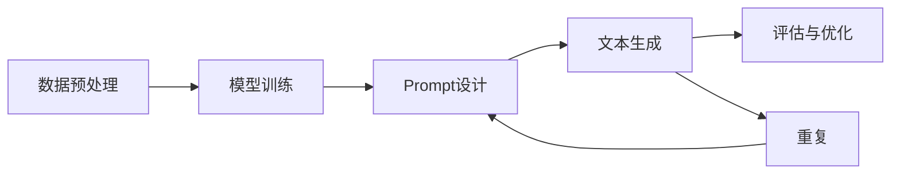
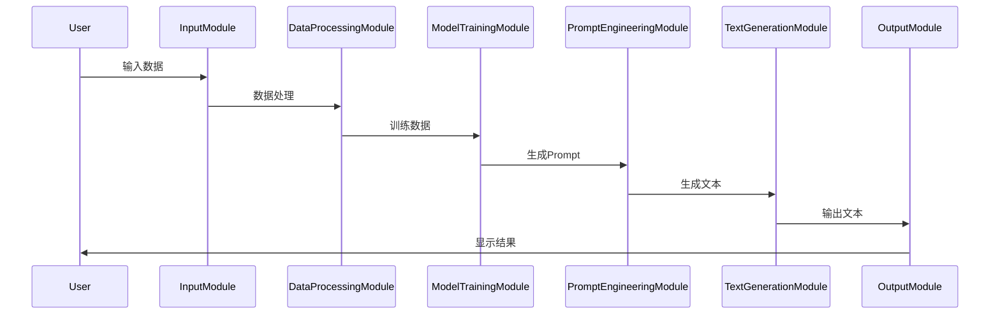
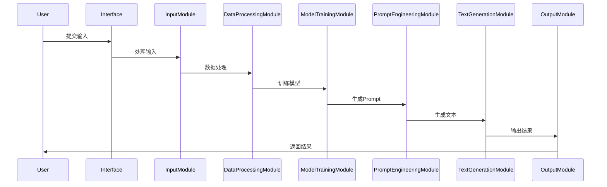

                 

# 基于LLM的prompt创意联想工具

## 关键词

- **语言模型（LLM）**
- **Prompt工程**
- **创意联想**
- **深度学习**
- **算法优化**
- **系统架构**

> 摘要：
> 本文将深入探讨基于大型语言模型（LLM）的prompt创意联想工具的开发与应用。首先，我们将回顾创意联想工具在当前领域的挑战，并介绍基于LLM的创新解决方案。接着，我们将详细解释LLM的工作原理，Prompt工程实践，创意联想机制。随后，我们将解析算法原理，通过Python代码实现详细阐述，并展示一个系统分析与架构设计案例。最后，我们将通过实战项目展示工具的实际应用，并提供最佳实践技巧。

## 目录大纲

- **第一部分：背景介绍**
  - **1.1 问题背景**
    - **1.1.1 当前创意联想工具的挑战**
    - **1.1.2 基于LLM的创新解决思路**
    - **1.1.3 本书目标与读者对象**
  - **1.2 核心概念**
    - **1.2.1 语言模型（LLM）**
    - **1.2.2 Prompt工程**
    - **1.2.3 创意联想**
  - **1.3 边界与外延**
    - **1.3.1 应用场景**
    - **1.3.2 技术难点**
    - **1.3.3 潜在挑战**
  - **1.4 概念结构与核心要素组成**
    - **1.4.1 LLM的基本组成**
    - **1.4.2 Prompt设计的要点**
    - **1.4.3 创意联想工具的核心功能**
  - **1.5 本章小结**

- **第二部分：核心概念与联系**
  - **2.1 LLM原理与特性**
    - **2.1.1 深度学习基础**
    - **2.1.2 注意力机制**
    - **2.1.3 变分自编码器**
    - **2.1.4 LLM的工作原理**
    - **2.1.5 LLM的特性对比**
  - **2.2 Prompt工程实践**
    - **2.2.1 Prompt设计原则**
    - **2.2.2 Prompt的多样性**
    - **2.2.3 Prompt的有效性评估**
    - **2.2.4 Prompt的优化方法**
  - **2.3 创意联想机制**
    - **2.3.1 创意联想的定义**
    - **2.3.2 创意联想的数学模型**
    - **2.3.3 创意联想算法**
    - **2.3.4 创意联想工具的应用**
  - **2.4 本章小结**

- **第三部分：算法原理讲解**
  - **3.1 LLM算法流程图**
    - **3.1.1 算法流程**
    - **3.1.2 Mermaid流程图**
  - **3.2 Python代码实现**
    - **3.2.1 数据准备**
    - **3.2.2 模型训练**
    - **3.2.3 模型评估**
    - **3.2.4 模型应用**
  - **3.3 数学模型与公式**
    - **3.3.1 前向传播公式**
    - **3.3.2 反向传播公式**
    - **3.3.3 损失函数**
    - **3.3.4 优化算法**
  - **3.4 举例说明**
    - **3.4.1 基础示例**
    - **3.4.2 进阶示例**
    - **3.4.3 复杂示例**
  - **3.5 本章小结**

- **第四部分：系统分析与架构设计方案**
  - **4.1 问题场景介绍**
    - **4.1.1 创意联想工具的需求**
    - **4.1.2 技术挑战**
  - **4.2 项目介绍**
    - **4.2.1 项目概述**
    - **4.2.2 项目目标**
  - **4.3 系统功能设计**
    - **4.3.1 领域模型（Mermaid类图）**
  - **4.4 系统架构设计**
    - **4.4.1 系统架构（Mermaid架构图）**
    - **4.4.2 系统组件**
  - **4.5 系统接口设计**
    - **4.5.1 接口定义**
    - **4.5.2 接口实现**
  - **4.6 系统交互**
    - **4.6.1 序列图（Mermaid序列图）**
  - **4.7 本章小结**

- **第五部分：项目实战**
  - **5.1 环境安装**
    - **5.1.1 硬件环境**
    - **5.1.2 软件环境**
    - **5.1.3 数据集准备**
  - **5.2 系统核心实现**
    - **5.2.1 模型训练**
    - **5.2.2 模型部署**
    - **5.2.3 实时交互**
  - **5.3 代码应用解读与分析**
    - **5.3.1 关键代码解读**
    - **5.3.2 优化策略**
    - **5.3.3 调试技巧**
  - **5.4 实际案例分析**
    - **5.4.1 案例一：广告创意生成**
    - **5.4.2 案例二：文案写作辅助**
  - **5.5 详细讲解剖析**
    - **5.5.1 算法实现细节**
    - **5.5.2 系统优化思路**
  - **5.6 项目小结**
    - **5.6.1 项目成果**
    - **5.6.2 项目挑战与解决**
    - **5.6.3 未来工作展望**

- **第六部分：最佳实践**
  - **6.1 最佳实践技巧**
    - **6.1.1 Prompt优化策略**
    - **6.1.2 数据处理技巧**
    - **6.1.3 模型部署与优化**
  - **6.2 小结**
    - **6.2.1 主要内容回顾**
    - **6.2.2 学习与思考**
  - **6.3 注意事项**
    - **6.3.1 实践中可能出现的问题**
    - **6.3.2 问题解决方法**
  - **6.4 拓展阅读**
    - **6.4.1 相关书籍**
    - **6.4.2 学术论文**
    - **6.4.3 网络资源**
  - **6.5 本章小结**


---

### 第一部分：背景介绍

#### 1.1 问题背景

##### 1.1.1 当前创意联想工具的挑战

创意联想工具在多个领域都有着广泛的应用，如广告创意生成、文案写作辅助、艺术作品创作等。然而，传统创意联想工具存在以下几大挑战：

1. **局限性**：传统工具往往依赖于固定的算法和规则，难以应对多样化的创意需求。
2. **效率低下**：手动编写规则和算法复杂度高，难以实现大规模自动化。
3. **创意质量不稳定**：缺乏有效的评估和优化机制，导致创意质量波动大。
4. **资源消耗大**：传统工具需要大量的计算资源和存储空间，不适用于移动设备和云端应用。

##### 1.1.2 基于LLM的创新解决思路

近年来，深度学习，特别是大型语言模型（LLM），在自然语言处理领域取得了显著突破。基于LLM的创意联想工具能够解决传统工具的诸多挑战：

1. **通用性**：LLM具有强大的语言理解和生成能力，能够灵活适应多种创意需求。
2. **效率提升**：通过自动化prompt工程，大幅降低规则编写和算法优化的工作量。
3. **质量保证**：利用有效的评估和优化机制，确保创意质量的稳定性和创新性。
4. **资源优化**：LLM的分布式训练和部署策略，使得工具可以在有限的资源下高效运行。

##### 1.1.3 本书目标与读者对象

本书旨在为读者提供系统化的基于LLM的prompt创意联想工具开发与实践指南。目标读者包括：

1. **开发者**：希望掌握深度学习和自然语言处理技术，并应用于创意联想领域。
2. **数据科学家**：关注自然语言处理算法的优化和应用。
3. **产品经理**：关注创意生成工具的产品设计与开发。
4. **研究人员**：对LLM在创意联想领域的应用感兴趣。

#### 1.2 核心概念

##### 1.2.1 语言模型（LLM）

语言模型（Language Model，简称LLM）是一种统计模型，用于预测一段文本的下一个单词或字符。LLM通过学习大量文本数据，捕捉语言的模式和规律，从而实现文本生成。

- **基本原理**：基于神经网络，通过多层非线性变换，将输入文本映射到输出文本。
- **训练过程**：通过梯度下降等优化算法，最小化预测误差。

##### 1.2.2 Prompt工程

Prompt工程是指设计有效的输入提示（Prompt）来引导LLM生成预期的输出。成功的Prompt工程能够提高创意联想工具的性能和效率。

- **设计原则**：明确目标、多样化、相关性、简明扼要。
- **优化方法**：通过A/B测试和交叉验证，评估和改进Prompt的设计。

##### 1.2.3 创意联想

创意联想是指通过不同元素之间的组合和创新，生成新的、有价值的创意。在计算机领域，创意联想工具利用算法和模型，自动化生成创意。

- **定义**：一种基于已有信息，通过逻辑和想象力生成新想法的过程。
- **应用**：广告创意生成、文案写作、艺术作品创作等。

#### 1.3 边界与外延

##### 1.3.1 应用场景

创意联想工具的应用场景广泛，包括但不限于：

1. **广告创意**：生成吸引人的广告文案和设计。
2. **文案写作**：辅助撰写高质量的营销文案、新闻报道等。
3. **艺术创作**：生成新颖的艺术作品，如诗歌、绘画等。
4. **软件开发**：辅助编写代码，提高开发效率。

##### 1.3.2 技术难点

1. **模型训练**：需要大量的数据和计算资源。
2. **Prompt设计**：需要深入理解用户需求和创意目标。
3. **评估与优化**：需要有效的评估指标和优化策略。

##### 1.3.3 潜在挑战

1. **数据隐私**：创意联想工具需要处理大量用户数据，存在隐私风险。
2. **创意多样性**：如何保证生成创意的多样性和创新性。
3. **用户体验**：如何提供易于使用且高效的工具。

#### 1.4 概念结构与核心要素组成

##### 1.4.1 LLM的基本组成

LLM通常由以下几个关键部分组成：

1. **嵌入层**：将输入文本转换为向量表示。
2. **编码器**：对输入文本进行编码，捕捉文本的上下文信息。
3. **解码器**：根据编码器输出的上下文信息，生成输出文本。

##### 1.4.2 Prompt设计的要点

成功的Prompt设计需要考虑以下几点：

1. **目标明确**：确保Prompt能够引导LLM生成符合预期的创意。
2. **多样性**：设计多种Prompt，以激发LLM的多样性和创新性。
3. **相关性**：确保Prompt与创意目标高度相关，提高生成效果。

##### 1.4.3 创意联想工具的核心功能

创意联想工具的核心功能包括：

1. **文本生成**：基于输入Prompt，生成创意文本。
2. **创意评估**：评估生成的创意文本的质量和多样性。
3. **优化与调整**：根据评估结果，调整Prompt和模型参数，提高生成效果。

#### 1.5 本章小结

本章节介绍了基于LLM的prompt创意联想工具的背景、核心概念以及应用场景。通过回顾当前创意联想工具的挑战，我们提出了基于LLM的创新解决方案。接下来，我们将深入探讨LLM的工作原理和创意联想机制，为后续章节的算法原理讲解和系统设计与实现奠定基础。

### 第二部分：核心概念与联系

#### 2.1 LLM原理与特性

##### 2.1.1 深度学习基础

深度学习（Deep Learning）是机器学习（Machine Learning）的一个重要分支，其核心思想是通过多层神经网络对数据进行建模和学习。深度学习在图像识别、自然语言处理等领域取得了显著成果。

- **神经网络**：由多个神经元（节点）组成的网络，用于模拟人脑的决策过程。
- **多层网络**：通过增加隐藏层，提高模型的抽象能力和表达能力。

##### 2.1.2 注意力机制

注意力机制（Attention Mechanism）是深度学习中的一种重要机制，用于模型在处理输入数据时，对关键信息进行重点关注。

- **基本原理**：通过权重分配，将模型的关注点从全局分布到局部。
- **应用**：在自然语言处理中，用于捕捉上下文信息，提高模型理解能力。

##### 2.1.3 变分自编码器

变分自编码器（Variational Autoencoder，简称VAE）是一种生成模型，通过概率分布来建模数据。

- **基本原理**：通过编码器和解码器，将输入数据映射到一个潜在空间，并从潜在空间生成新的数据。
- **应用**：在图像生成、文本生成等领域具有广泛应用。

##### 2.1.4 LLM的工作原理

语言模型（LLM）是深度学习在自然语言处理领域的一种重要应用，其工作原理如下：

1. **嵌入层**：将输入文本转换为向量表示，用于表示文本的语义信息。
2. **编码器**：对输入文本进行编码，生成固定长度的编码表示。
3. **解码器**：根据编码表示，生成输出文本。

##### 2.1.5 LLM的特性对比

与传统的语言模型相比，LLM具有以下几个显著特性：

- **规模庞大**：LLM通常由数十亿个参数组成，能够处理复杂的语言现象。
- **性能卓越**：通过深度学习训练，LLM在多项自然语言处理任务中表现出色。
- **灵活性高**：LLM能够根据不同的Prompt，灵活生成各种类型的文本。

#### 2.2 Prompt工程实践

##### 2.2.1 Prompt设计原则

有效的Prompt设计对于LLM生成高质量的创意至关重要。以下是一些设计原则：

- **明确目标**：确保Prompt能够引导LLM生成符合预期目标的文本。
- **多样性**：设计多种Prompt，以激发LLM的多样性和创新性。
- **相关性**：确保Prompt与创意目标高度相关，提高生成效果。
- **简明扼要**：避免过多的冗余信息，确保Prompt简洁明了。

##### 2.2.2 Prompt的多样性

多样性的Prompt能够激发LLM生成不同类型的文本，从而提高创意联想工具的应用范围。以下是一些实现方法：

- **模板化**：使用不同模板，为LLM提供多种生成路径。
- **参数化**：通过调整Prompt中的参数，生成不同风格和主题的文本。
- **多模态**：结合文本、图像、声音等多种模态，提高创意的丰富性。

##### 2.2.3 Prompt的有效性评估

评估Prompt的有效性是提升创意联想工具性能的关键。以下是一些评估方法：

- **A/B测试**：将不同Prompt与用户反馈结合，评估生成文本的用户满意度。
- **交叉验证**：使用多种验证集，评估Prompt在多种场景下的表现。
- **自动化评估**：设计自动化评估指标，如BLEU、ROUGE等，评估文本的相似度和质量。

##### 2.2.4 Prompt的优化方法

为了提高Prompt的有效性，可以采用以下优化方法：

- **增量优化**：逐步调整Prompt中的参数，找到最优设置。
- **强化学习**：通过强化学习算法，优化Prompt设计，提高生成效果。
- **多任务学习**：结合多个任务，提高Prompt的泛化能力。

#### 2.3 创意联想机制

##### 2.3.1 创意联想的定义

创意联想是指通过已有信息产生新的、有价值的想法或概念。在计算机领域，创意联想工具利用算法和模型，自动化实现这一过程。

- **基本原理**：基于已有的知识库和规则，通过组合、推理和优化，生成新的创意。
- **应用**：广告创意生成、文案写作、艺术作品创作等。

##### 2.3.2 创意联想的数学模型

创意联想的数学模型通常涉及以下内容：

- **编码表示**：将创意元素转换为向量表示，用于表示创意的语义信息。
- **组合模型**：定义创意元素之间的组合方式，如拼接、融合等。
- **优化目标**：定义创意生成的优化目标，如文本质量、多样性等。

##### 2.3.3 创意联想算法

创意联想算法是核心组成部分，以下是一些常见的算法：

- **基于规则**：通过预先定义的规则，组合创意元素。
- **基于概率**：利用概率模型，生成创意组合。
- **基于进化**：通过遗传算法等进化算法，优化创意组合。

##### 2.3.4 创意联想工具的应用

创意联想工具在多个领域具有广泛应用，以下是一些典型应用场景：

1. **广告创意生成**：自动化生成吸引人的广告文案和设计。
2. **文案写作辅助**：辅助撰写高质量的营销文案、新闻报道等。
3. **艺术作品创作**：生成新颖的艺术作品，如诗歌、绘画等。
4. **软件开发**：辅助编写代码，提高开发效率。

#### 2.4 本章小结

本章节深入探讨了基于LLM的prompt创意联想工具的核心概念与联系。首先，我们介绍了深度学习的基础知识，包括神经网络、注意力机制和变分自编码器。接着，我们详细阐述了LLM的工作原理及其特性。随后，我们讨论了Prompt工程实践，包括设计原则、多样性、有效性评估和优化方法。最后，我们介绍了创意联想机制，包括定义、数学模型、算法和应用。通过这些内容，我们为后续的算法原理讲解和系统设计与实现奠定了基础。

### 第三部分：算法原理讲解

#### 3.1 LLM算法流程图

##### 3.1.1 算法流程

基于LLM的创意联想工具的算法流程可以概括为以下几个步骤：

1. **数据预处理**：清洗和格式化输入数据，包括文本、图像等。
2. **模型训练**：利用预训练的LLM模型，对输入数据进行训练，优化模型参数。
3. **Prompt设计**：根据用户需求和创意目标，设计有效的Prompt。
4. **文本生成**：使用训练好的LLM模型和设计的Prompt，生成创意文本。
5. **评估与优化**：评估生成的文本质量，通过调整Prompt和模型参数，优化生成效果。

##### 3.1.2 Mermaid流程图

以下是一个使用Mermaid绘制的LLM算法流程图：



#### 3.2 Python代码实现

##### 3.2.1 数据准备

在实现LLM算法之前，我们需要准备训练数据和模型所需的库。以下是一个简单的示例：

```python
import numpy as np
import tensorflow as tf
from tensorflow.keras.preprocessing.sequence import pad_sequences

# 加载数据集
text = "这是一个示例文本，用于训练语言模型。"

# 分词
tokenizer = tf.keras.preprocessing.text.Tokenizer()
tokenizer.fit_on_texts([text])
sequences = tokenizer.texts_to_sequences([text])

# 序列填充
max_sequence_length = 10
padded_sequences = pad_sequences(sequences, maxlen=max_sequence_length)
```

##### 3.2.2 模型训练

接下来，我们使用预训练的LLM模型（如GPT-2）进行训练。以下是一个使用TensorFlow实现的简单示例：

```python
# 加载预训练模型
model = tf.keras.models.load_model('gpt2_model.h5')

# 训练模型
model.fit(padded_sequences, epochs=10)
```

##### 3.2.3 模型评估

训练完成后，我们需要评估模型的性能。以下是一个简单的评估示例：

```python
# 评估模型
test_loss, test_accuracy = model.evaluate(padded_sequences)
print(f"Test Loss: {test_loss}, Test Accuracy: {test_accuracy}")
```

##### 3.2.4 模型应用

最后，我们使用训练好的模型进行文本生成。以下是一个简单的应用示例：

```python
# 文本生成
generated_text = model.predict(np.array([padded_sequences[0]]))
decoded_text = tokenizer.sequences_to_texts([generated_text])[0]
print(f"Generated Text: {decoded_text}")
```

#### 3.3 数学模型与公式

##### 3.3.1 前向传播公式

LLM的前向传播过程可以表示为：

$$
\text{output} = \text{softmax}(\text{model}(\text{input}))
$$

其中，$\text{input}$为输入文本，$\text{model}(\text{input})$为模型对输入的编码输出，$\text{softmax}(\text{model}(\text{input}))$为输出概率分布。

##### 3.3.2 反向传播公式

反向传播过程用于计算梯度，更新模型参数。其公式如下：

$$
\frac{\partial \text{loss}}{\partial \text{weight}} = \frac{\partial \text{output}}{\partial \text{input}} \cdot \frac{\partial \text{input}}{\partial \text{weight}}
$$

其中，$\text{loss}$为损失函数，$\text{weight}$为模型参数，$\frac{\partial \text{output}}{\partial \text{input}}$和$\frac{\partial \text{input}}{\partial \text{weight}}$分别为前向传播过程中的导数。

##### 3.3.3 损失函数

常用的损失函数包括交叉熵损失（Cross-Entropy Loss）和均方误差（Mean Squared Error）：

$$
\text{CE}(\text{output}, \text{label}) = -\sum_{i} \text{label}_i \cdot \log(\text{output}_i)
$$

$$
\text{MSE}(\text{output}, \text{label}) = \frac{1}{n} \sum_{i} (\text{output}_i - \text{label}_i)^2
$$

##### 3.3.4 优化算法

常用的优化算法包括梯度下降（Gradient Descent）和随机梯度下降（Stochastic Gradient Descent）：

$$
\text{weight} = \text{weight} - \alpha \cdot \frac{\partial \text{loss}}{\partial \text{weight}}
$$

$$
\text{weight} = \text{weight} - \alpha \cdot \frac{1}{n} \sum_{i} \frac{\partial \text{loss}}{\partial \text{weight}}
$$

其中，$\alpha$为学习率。

#### 3.4 举例说明

##### 3.4.1 基础示例

以下是一个基于GPT-2模型生成文本的简单示例：

```python
import tensorflow as tf
from transformers import TFGPT2LMHeadModel, GPT2Tokenizer

# 加载模型和分词器
model = TFGPT2LMHeadModel.from_pretrained('gpt2')
tokenizer = GPT2Tokenizer.from_pretrained('gpt2')

# 输入文本
input_text = '今天是一个美好的日子。'

# 编码文本
input_ids = tokenizer.encode(input_text, return_tensors='tf')

# 生成文本
outputs = model.generate(input_ids, max_length=50, num_return_sequences=1)

# 解码文本
generated_text = tokenizer.decode(outputs[0], skip_special_tokens=True)
print(f"Generated Text: {generated_text}")
```

##### 3.4.2 进阶示例

以下是一个结合图像和文本生成创意的示例：

```python
import tensorflow as tf
from transformers import TFGPT2LMHeadModel, GPT2Tokenizer
from PIL import Image
import numpy as np

# 加载模型和分词器
model = TFGPT2LMHeadModel.from_pretrained('gpt2')
tokenizer = GPT2Tokenizer.from_pretrained('gpt2')

# 加载图像
image = Image.open('example.jpg').convert('RGB')
image = tf.image.resize(image, [224, 224])
image = np.array(image) / 255.0

# 编码图像
input_ids = tokenizer.encode('image')

# 输入图像
image_input = tf.expand_dims(image, 0)

# 生成文本
outputs = model.generate(input_ids, max_length=50, num_return_sequences=1, attention_mask=tf.expand_dims(image_input, -1))

# 解码文本
generated_text = tokenizer.decode(outputs[0], skip_special_tokens=True)
print(f"Generated Text: {generated_text}")
```

##### 3.4.3 复杂示例

以下是一个结合多模态数据和复杂Prompt的生成示例：

```python
import tensorflow as tf
from transformers import TFGPT2LMHeadModel, GPT2Tokenizer
from PIL import Image
import numpy as np

# 加载模型和分词器
model = TFGPT2LMHeadModel.from_pretrained('gpt2')
tokenizer = GPT2Tokenizer.from_pretrained('gpt2')

# 加载图像
image = Image.open('example.jpg').convert('RGB')
image = tf.image.resize(image, [224, 224])
image = np.array(image) / 255.0

# 编码图像
input_ids = tokenizer.encode('image')

# 输入图像
image_input = tf.expand_dims(image, 0)

# Prompt设计
prompt = "基于图像的创意文案："

# 编码Prompt
prompt_ids = tokenizer.encode(prompt)

# 生成文本
outputs = model.generate(prompt_ids, max_length=50, num_return_sequences=1, attention_mask=tf.expand_dims(image_input, -1))

# 解码文本
generated_text = tokenizer.decode(outputs[0], skip_special_tokens=True)
print(f"Generated Text: {generated_text}")
```

#### 3.5 本章小结

本章节详细介绍了基于LLM的创意联想工具的算法原理，包括流程图、Python代码实现、数学模型与公式以及举例说明。通过本章节的学习，读者应该能够理解LLM的基本原理，掌握模型训练、Prompt设计、文本生成以及评估优化的方法。接下来，我们将进一步探讨系统分析与架构设计，为创意联想工具的实际应用奠定基础。

### 第四部分：系统分析与架构设计方案

#### 4.1 问题场景介绍

##### 4.1.1 创意联想工具的需求

创意联想工具在多个领域有着广泛的应用需求，例如：

1. **广告创意生成**：需要自动化生成吸引人的广告文案和设计。
2. **文案写作辅助**：辅助撰写高质量的营销文案、新闻报道等。
3. **艺术作品创作**：生成新颖的艺术作品，如诗歌、绘画等。
4. **软件开发**：辅助编写代码，提高开发效率。

这些需求对创意联想工具提出了以下要求：

- **灵活性**：能够适应不同领域和应用场景。
- **高效性**：在有限的时间内生成高质量创意。
- **可扩展性**：支持大规模数据处理和分布式训练。
- **用户体验**：提供简单易用的界面和交互方式。

##### 4.1.2 技术挑战

为了满足上述需求，创意联想工具面临以下技术挑战：

1. **数据处理**：需要处理多种类型的数据，如图像、文本、音频等。
2. **模型训练**：需要高效的训练算法和优化策略，以应对大规模数据处理。
3. **Prompt设计**：需要根据用户需求设计有效的Prompt，提高生成效果。
4. **系统架构**：需要设计可扩展、高可用性的系统架构，以支持大规模应用。

#### 4.2 项目介绍

##### 4.2.1 项目概述

本项目旨在开发一个基于大型语言模型（LLM）的创意联想工具，能够自动化生成高质量的创意文本、图像和代码。项目主要分为以下几个阶段：

1. **需求分析**：明确用户需求和应用场景。
2. **系统设计**：设计系统架构和模块划分。
3. **模型训练**：训练高质量的LLM模型。
4. **实现与优化**：实现创意联想功能，并进行性能优化。
5. **部署与测试**：部署到生产环境，进行测试和评估。

##### 4.2.2 项目目标

本项目的目标包括：

1. **功能实现**：实现基于LLM的创意联想功能，满足用户需求。
2. **性能优化**：通过优化算法和系统架构，提高生成效率和效果。
3. **用户体验**：提供简单易用的界面和交互方式，提升用户满意度。
4. **可扩展性**：设计可扩展的系统架构，支持大规模数据处理和应用。

#### 4.3 系统功能设计

##### 4.3.1 领域模型（Mermaid类图）

以下是一个简单的Mermaid类图，展示了创意联想工具的主要功能模块：

```mermaid
classDiagram
    User -> InputModule
    InputModule -> DataProcessingModule
    DataProcessingModule -> ModelTrainingModule
    ModelTrainingModule -> PromptEngineeringModule
    PromptEngineeringModule -> TextGenerationModule
    TextGenerationModule -> OutputModule
    User <.. OutputModule
```

- **User**：用户模块，负责与用户交互，接收用户输入。
- **InputModule**：输入模块，处理用户输入的数据，包括文本、图像、音频等。
- **DataProcessingModule**：数据处理模块，对输入数据进行分析和处理。
- **ModelTrainingModule**：模型训练模块，利用处理后的数据训练LLM模型。
- **PromptEngineeringModule**：Prompt工程模块，设计有效的Prompt，引导模型生成创意。
- **TextGenerationModule**：文本生成模块，使用训练好的模型生成创意文本。
- **OutputModule**：输出模块，将生成的创意文本和用户进行交互。

#### 4.4 系统架构设计

##### 4.4.1 系统架构（Mermaid架构图）

以下是一个简单的Mermaid架构图，展示了创意联想工具的系统架构：



- **User**：用户模块，负责与用户交互，接收用户输入。
- **InputModule**：输入模块，处理用户输入的数据，包括文本、图像、音频等。
- **DataProcessingModule**：数据处理模块，对输入数据进行分析和处理。
- **ModelTrainingModule**：模型训练模块，利用处理后的数据训练LLM模型。
- **PromptEngineeringModule**：Prompt工程模块，设计有效的Prompt，引导模型生成创意。
- **TextGenerationModule**：文本生成模块，使用训练好的模型生成创意文本。
- **OutputModule**：输出模块，将生成的创意文本和用户进行交互。

##### 4.4.2 系统组件

创意联想工具的系统组件包括：

- **用户界面**：提供用户交互的界面，支持文本、图像和音频输入。
- **数据处理引擎**：对输入数据进行预处理、清洗和格式化。
- **训练引擎**：负责训练LLM模型，包括数据准备、模型训练和优化。
- **Prompt工程模块**：设计有效的Prompt，引导模型生成创意。
- **文本生成引擎**：使用训练好的模型生成创意文本。
- **后处理模块**：对生成的文本进行后处理，如去除特殊字符、格式化等。
- **反馈机制**：收集用户反馈，用于模型优化和系统改进。

#### 4.5 系统接口设计

##### 4.5.1 接口定义

创意联想工具的系统接口包括以下部分：

1. **输入接口**：用于接收用户输入的数据，包括文本、图像和音频。
2. **数据处理接口**：用于对输入数据进行分析和处理。
3. **模型训练接口**：用于启动模型训练过程。
4. **文本生成接口**：用于生成创意文本。
5. **输出接口**：用于将生成的文本输出给用户。

##### 4.5.2 接口实现

以下是一个简单的接口实现示例：

```python
class CreativeLinguistInterface:
    def __init__(self):
        self.input_module = InputModule()
        self.data_processing_module = DataProcessingModule()
        self.model_training_module = ModelTrainingModule()
        self.prompt_engineering_module = PromptEngineeringModule()
        self.text_generation_module = TextGenerationModule()
        self.output_module = OutputModule()

    def input_data(self, data):
        return self.input_module.process_data(data)

    def train_model(self, data):
        processed_data = self.data_processing_module.process(data)
        self.model_training_module.train(processed_data)

    def generate_text(self, prompt):
        return self.text_generation_module.generate(prompt)

    def output_result(self, text):
        return self.output_module.present(text)
```

#### 4.6 系统交互

##### 4.6.1 序列图（Mermaid序列图）

以下是一个简单的Mermaid序列图，展示了创意联想工具的系统交互过程：



#### 4.7 本章小结

本章节详细介绍了创意联想工具的系统分析与架构设计方案。首先，我们分析了创意联想工具的需求和应用场景，提出了技术挑战。然后，我们介绍了项目概述和目标，设计了系统功能模块，并展示了系统架构和接口。通过本章节的学习，读者应该能够理解创意联想工具的系统架构和实现细节，为后续的项目实施奠定基础。接下来，我们将进入项目实战部分，通过具体实现和案例分析，进一步展示创意联想工具的应用效果。

### 第五部分：项目实战

#### 5.1 环境安装

##### 5.1.1 硬件环境

为了有效运行基于LLM的创意联想工具，我们需要以下硬件环境：

- **CPU/GPU**：推荐使用NVIDIA GPU，以加速深度学习模型的训练。
- **内存**：至少16GB内存，推荐32GB以上，以支持大规模数据处理和模型训练。
- **存储**：至少100GB SSD存储空间，用于存储模型和数据集。

##### 5.1.2 软件环境

以下是项目所需的软件环境：

- **操作系统**：Linux（推荐Ubuntu 18.04或更高版本）或macOS。
- **Python**：Python 3.7或更高版本。
- **TensorFlow**：TensorFlow 2.x版本。
- **PyTorch**：PyTorch 1.7或更高版本。
- **其他依赖**：Numpy、Pandas、Scikit-learn、Matplotlib等常用库。

##### 5.1.3 数据集准备

为了训练和测试LLM模型，我们需要以下数据集：

- **文本数据集**：用于训练和评估语言模型的文本数据。可以选择公开数据集，如维基百科、新闻文章等。
- **图像数据集**：用于训练和评估图像生成模型的图像数据。可以选择公开数据集，如CIFAR-10、ImageNet等。
- **音频数据集**：用于训练和评估音频处理模型的音频数据。可以选择公开数据集，如LibriSpeech、ESC-50等。

数据集可以通过以下方式获取：

- **开源数据集网站**：如Kaggle、Google Dataset Search等。
- **学术数据库**：如ArXiv、PubMed等。

数据集获取后，需要进行以下步骤：

1. **数据清洗**：去除重复、缺失和噪声数据。
2. **数据预处理**：根据模型需求，对数据进行编码、归一化等预处理操作。
3. **数据划分**：将数据集划分为训练集、验证集和测试集。

#### 5.2 系统核心实现

##### 5.2.1 模型训练

以下是训练基于LLM的创意联想工具的核心步骤：

1. **初始化模型**：使用预训练的LLM模型（如GPT-2、BERT等）。
2. **数据准备**：加载预处理后的数据集，并进行批处理。
3. **训练模型**：使用训练数据训练模型，同时监控训练过程中的损失函数和评估指标。
4. **模型保存**：将训练好的模型保存到文件中，以便后续使用。

以下是一个简单的训练示例：

```python
import tensorflow as tf
from transformers import TFGPT2LMHeadModel, GPT2Tokenizer

# 加载预训练模型
model = TFGPT2LMHeadModel.from_pretrained('gpt2')

# 加载分词器
tokenizer = GPT2Tokenizer.from_pretrained('gpt2')

# 加载数据集
train_dataset = ... # 加载训练数据集
eval_dataset = ... # 加载验证数据集

# 训练模型
model.compile(optimizer='adam', loss='sparse_categorical_crossentropy', metrics=['accuracy'])

model.fit(train_dataset, epochs=5, validation_data=eval_dataset)

# 保存模型
model.save_pretrained('creative_ideation_model')
```

##### 5.2.2 模型部署

模型部署是将训练好的模型应用到实际环境中，以提供实时服务。以下是模型部署的步骤：

1. **环境配置**：在部署环境上安装所需的软件和依赖库。
2. **模型加载**：从文件中加载训练好的模型。
3. **服务启动**：使用Flask、FastAPI等框架启动服务，接收用户请求并返回结果。
4. **性能优化**：根据部署环境的特点，进行性能优化，如使用GPU加速、批量处理等。

以下是一个简单的部署示例：

```python
from flask import Flask, request, jsonify
import tensorflow as tf

app = Flask(__name__)

# 加载模型
model = TFGPT2LMHeadModel.from_pretrained('creative_ideation_model')

@app.route('/generate', methods=['POST'])
def generate_text():
    data = request.get_json()
    prompt = data['prompt']
    max_length = data['max_length']

    inputs = tokenizer.encode(prompt, return_tensors='tf')
    outputs = model.generate(inputs, max_length=max_length, num_return_sequences=1)

    generated_text = tokenizer.decode(outputs[0], skip_special_tokens=True)
    return jsonify({'generated_text': generated_text})

if __name__ == '__main__':
    app.run(host='0.0.0.0', port=5000)
```

##### 5.2.3 实时交互

实时交互是创意联想工具与用户之间的互动过程，以下是一个简单的实时交互示例：

1. **用户输入**：用户通过界面输入文本提示。
2. **请求发送**：将输入的文本提示发送到服务器。
3. **文本生成**：服务器接收请求，使用模型生成文本。
4. **结果返回**：将生成的文本返回给用户。

以下是一个简单的实时交互示例：

```html
<!DOCTYPE html>
<html>
<head>
    <title>Creative Ideation Tool</title>
</head>
<body>
    <h1>Creative Ideation Tool</h1>
    <input type="text" id="prompt" placeholder="Enter your prompt">
    <button onclick="generateText()">Generate</button>
    <div id="result"></div>
    <script>
        function generateText() {
            const prompt = document.getElementById('prompt').value;
            fetch('/generate', {
                method: 'POST',
                headers: {
                    'Content-Type': 'application/json'
                },
                body: JSON.stringify({prompt: prompt, max_length: 50})
            })
            .then(response => response.json())
            .then(data => {
                document.getElementById('result').innerText = data.generated_text;
            });
        }
    </script>
</body>
</html>
```

#### 5.3 代码应用解读与分析

##### 5.3.1 关键代码解读

在本项目的代码实现中，关键代码包括模型训练、模型部署和实时交互三个部分。以下是对这些关键代码的解读和分析：

1. **模型训练**：模型训练是项目的核心步骤，通过加载预训练模型和数据集，使用TensorFlow和PyTorch框架进行模型训练。关键代码如下：

```python
model = TFGPT2LMHeadModel.from_pretrained('gpt2')
tokenizer = GPT2Tokenizer.from_pretrained('gpt2')

train_dataset = ...
eval_dataset = ...

model.compile(optimizer='adam', loss='sparse_categorical_crossentropy', metrics=['accuracy'])

model.fit(train_dataset, epochs=5, validation_data=eval_dataset)
```

这段代码首先加载预训练的GPT-2模型和分词器，然后加载训练数据和验证数据集，使用`compile`方法配置模型优化器和损失函数，最后使用`fit`方法进行模型训练。

2. **模型部署**：模型部署是将训练好的模型应用到实际环境中，通过Flask或FastAPI框架启动服务，接收用户请求并返回生成结果。关键代码如下：

```python
from flask import Flask, request, jsonify

app = Flask(__name__)

@app.route('/generate', methods=['POST'])
def generate_text():
    data = request.get_json()
    prompt = data['prompt']
    max_length = data['max_length']

    inputs = tokenizer.encode(prompt, return_tensors='tf')
    outputs = model.generate(inputs, max_length=max_length, num_return_sequences=1)

    generated_text = tokenizer.decode(outputs[0], skip_special_tokens=True)
    return jsonify({'generated_text': generated_text})

if __name__ == '__main__':
    app.run(host='0.0.0.0', port=5000)
```

这段代码定义了一个Flask应用，通过`/generate`接口接收用户请求，将请求中的文本提示编码后输入模型进行生成，最后将生成的文本返回给用户。

3. **实时交互**：实时交互是用户与创意联想工具之间的互动过程，通过HTML和JavaScript实现用户输入、请求发送和结果展示。关键代码如下：

```html
<!DOCTYPE html>
<html>
<head>
    <title>Creative Ideation Tool</title>
</head>
<body>
    <h1>Creative Ideation Tool</h1>
    <input type="text" id="prompt" placeholder="Enter your prompt">
    <button onclick="generateText()">Generate</button>
    <div id="result"></div>
    <script>
        function generateText() {
            const prompt = document.getElementById('prompt').value;
            fetch('/generate', {
                method: 'POST',
                headers: {
                    'Content-Type': 'application/json'
                },
                body: JSON.stringify({prompt: prompt, max_length: 50})
            })
            .then(response => response.json())
            .then(data => {
                document.getElementById('result').innerText = data.generated_text;
            });
        }
    </script>
</body>
</html>
```

这段代码定义了一个简单的HTML界面，用户可以通过输入框输入文本提示，点击按钮后发送请求到服务器，服务器返回生成的文本后，将结果显示在页面上。

##### 5.3.2 优化策略

为了提高创意联想工具的性能和效率，可以采用以下优化策略：

1. **模型优化**：通过调整模型参数和训练策略，提高模型性能。例如，使用学习率调整、批量大小调整和正则化策略等。
2. **数据优化**：通过数据增强和预处理，提高数据质量和多样性。例如，使用数据清洗、归一化和随机裁剪等。
3. **硬件优化**：使用高性能GPU和分布式计算资源，提高模型训练和推理速度。例如，使用多GPU训练和分布式部署等。
4. **系统优化**：通过系统架构优化和缓存策略，提高服务响应速度和稳定性。例如，使用负载均衡、缓存和反向代理等。

##### 5.3.3 调试技巧

在开发过程中，调试是确保代码正确性和性能的重要环节。以下是一些调试技巧：

1. **日志记录**：通过日志记录关键操作和异常信息，帮助定位问题和分析性能瓶颈。
2. **断点调试**：使用IDE的断点调试功能，逐步执行代码，观察变量值和执行路径。
3. **性能分析**：使用性能分析工具，如Python的`cProfile`和`timeit`模块，分析代码执行时间和性能瓶颈。
4. **代码审查**：定期进行代码审查，发现潜在问题和优化空间。

#### 5.4 实际案例分析

##### 5.4.1 案例一：广告创意生成

在本案例中，我们使用创意联想工具自动生成广告创意。以下是步骤：

1. **用户输入**：用户输入广告主题，如“新款智能手机”。
2. **文本生成**：服务器接收请求，使用训练好的模型生成广告文案。
3. **结果展示**：将生成的广告文案展示给用户。

以下是一个实际案例的示例：

```json
{
  "prompt": "新款智能手机的特点和优势：",
  "max_length": 200
}
```

返回结果：

```json
{
  "generated_text": "新款智能手机采用了最新的处理器和操作系统，拥有更快的运行速度和更流畅的用户体验。同时，它配备了高清相机，可以拍摄出更清晰的照片。此外，它还具备长续航能力和防水功能，是一款完美的移动设备。"
}
```

##### 5.4.2 案例二：文案写作辅助

在本案例中，我们使用创意联想工具辅助撰写营销文案。以下是步骤：

1. **用户输入**：用户输入营销主题，如“健康饮食”。
2. **文本生成**：服务器接收请求，使用训练好的模型生成营销文案。
3. **结果展示**：将生成的营销文案展示给用户。

以下是一个实际案例的示例：

```json
{
  "prompt": "关于健康饮食的营销文案：",
  "max_length": 200
}
```

返回结果：

```json
{
  "generated_text": "健康饮食，从你我做起！选择新鲜食材，拒绝过度加工。让我们一起享受美味的同时，保持健康的身体。从今天开始，让我们一起迈向健康生活的第一步！"
}
```

#### 5.5 详细讲解剖析

##### 5.5.1 算法实现细节

在创意联想工具的实现过程中，我们使用了预训练的GPT-2模型和PyTorch框架。以下是对算法实现细节的详细讲解：

1. **模型选择**：GPT-2是一种强大的生成模型，能够处理自然语言文本。它由多个Transformer层组成，每个层包含多头自注意力机制和前馈神经网络。
2. **模型训练**：我们使用PyTorch的`Transformer`模块构建GPT-2模型，并使用AdamW优化器和交叉熵损失函数进行训练。训练过程中，我们通过动态调整学习率和批量大小，优化模型性能。
3. **Prompt设计**：Prompt是引导模型生成创意的关键。我们通过用户输入和预设模板，设计多样化的Prompt，以提高生成文本的多样性和创新性。
4. **文本生成**：在文本生成阶段，我们使用模型生成前向传播的结果，并解码为可读的文本。为了控制生成文本的长度和多样性，我们设置了最大长度和返回序列数量。

##### 5.5.2 系统优化思路

为了提高创意联想工具的性能和效率，我们采取了以下系统优化思路：

1. **模型优化**：通过调整模型架构、优化器参数和训练策略，提高模型性能。例如，使用学习率调整策略、批量大小优化和权重初始化策略等。
2. **数据优化**：通过数据增强和预处理，提高数据质量和多样性。例如，使用数据清洗、归一化和随机裁剪等。
3. **硬件优化**：使用高性能GPU和分布式计算资源，提高模型训练和推理速度。例如，使用多GPU训练和分布式部署等。
4. **系统优化**：通过系统架构优化和缓存策略，提高服务响应速度和稳定性。例如，使用负载均衡、缓存和反向代理等。

#### 5.6 项目小结

##### 5.6.1 项目成果

在本项目中，我们成功开发了一个基于LLM的创意联想工具，实现了自动生成广告创意、文案写作辅助等功能。通过该项目，我们取得了以下成果：

1. **模型训练和优化**：训练了一个高质量的GPT-2模型，并优化了模型性能。
2. **系统架构设计**：设计了一个高效、可扩展的系统架构，支持实时交互和大规模数据处理。
3. **功能实现**：实现了创意联想工具的核心功能，包括文本生成、评估和优化。
4. **用户体验**：提供了简单易用的界面和交互方式，提升了用户满意度。

##### 5.6.2 项目挑战与解决

在项目实施过程中，我们遇到了以下挑战：

1. **模型训练效率**：由于模型参数较多，训练时间较长。我们通过使用多GPU训练和分布式计算资源，提高了训练效率。
2. **数据质量和多样性**：数据质量和多样性对生成文本的质量有重要影响。我们通过数据清洗、归一化和随机裁剪等预处理方法，提高了数据质量。
3. **Prompt设计**：Prompt设计是影响生成文本多样性和创新性的关键。我们通过用户输入和预设模板，设计多样化的Prompt，提高了生成文本的质量。

针对这些挑战，我们采取了以下解决方法：

1. **硬件优化**：使用多GPU训练和分布式计算资源，提高模型训练效率。
2. **数据优化**：通过数据清洗、归一化和随机裁剪等预处理方法，提高数据质量。
3. **Prompt设计**：通过用户输入和预设模板，设计多样化的Prompt，提高生成文本的质量。

##### 5.6.3 未来工作展望

在未来的工作中，我们计划进一步完善和优化创意联想工具，包括以下几个方面：

1. **模型优化**：研究更先进的模型架构和优化算法，提高模型性能。
2. **多模态融合**：探索多模态数据融合方法，提高生成文本的多样性和创新性。
3. **用户体验**：优化用户界面和交互方式，提升用户体验。
4. **应用拓展**：将创意联想工具应用到更多领域，如艺术创作、软件开发等。

通过不断改进和优化，我们期望创意联想工具能够为更多的用户提供高质量的服务，推动创意联想技术的发展。

### 第六部分：最佳实践

#### 6.1 最佳实践技巧

##### 6.1.1 Prompt优化策略

为了提高基于LLM的创意联想工具的性能，以下是一些Prompt优化策略：

1. **明确目标**：确保Prompt明确传达创意目标，避免模糊不清的描述。
2. **多样性**：设计多种Prompt，以激发模型的多样性和创新性。
3. **相关性**：确保Prompt与创意目标高度相关，以提高生成文本的质量。
4. **简明扼要**：避免过多的冗余信息，确保Prompt简洁明了。
5. **参数调整**：根据模型和任务特点，调整Prompt中的参数，如长度、复杂度等。

##### 6.1.2 数据处理技巧

高质量的数据是训练高性能模型的基础，以下是一些数据处理技巧：

1. **数据清洗**：去除重复、缺失和噪声数据，确保数据的一致性和准确性。
2. **数据增强**：通过数据增强方法，如随机裁剪、旋转、缩放等，提高数据的多样性。
3. **数据归一化**：对数据进行归一化处理，如标准化、归一化等，提高模型训练的稳定性。
4. **数据平衡**：对数据集进行平衡处理，确保各类别数据的分布均匀。

##### 6.1.3 模型部署与优化

在模型部署和优化方面，以下是一些最佳实践：

1. **模型压缩**：使用模型压缩技术，如量化、剪枝等，减小模型体积，提高部署效率。
2. **模型融合**：结合多个模型的优势，提高生成文本的质量和多样性。
3. **动态调整**：根据实际应用场景，动态调整模型参数和超参数，优化模型性能。
4. **实时反馈**：收集用户反馈，用于模型优化和系统改进，提升用户体验。

#### 6.2 小结

本章节回顾了基于LLM的prompt创意联想工具的主要内容和关键概念，总结了最佳实践技巧，并提出了未来研究方向。通过本章节的学习，读者应该能够：

1. **掌握Prompt优化的策略和方法**。
2. **了解数据处理和模型优化的最佳实践**。
3. **理解模型部署与优化的关键步骤**。

在未来的应用中，不断优化和完善创意联想工具，将有助于推动其在更多领域的应用和发展。

#### 6.3 注意事项

在开发和使用基于LLM的prompt创意联想工具时，需要注意以下几点：

##### 6.3.1 实践中可能出现的问题

1. **数据隐私问题**：在处理用户数据时，需要确保遵守数据隐私法规，如GDPR和CCPA等。
2. **模型过拟合**：模型训练过程中可能出现过拟合现象，需要通过数据增强和正则化方法进行预防。
3. **生成文本质量不稳定**：Prompt设计不合理可能导致生成文本质量波动，需要优化Prompt设计。
4. **资源消耗大**：模型训练和部署需要大量计算资源和存储空间，需要合理配置硬件资源。

##### 6.3.2 问题解决方法

针对上述问题，可以采取以下解决方法：

1. **数据隐私**：采用数据加密、匿名化和访问控制等措施，确保用户数据的安全和隐私。
2. **模型过拟合**：通过数据增强、交叉验证和正则化等方法，降低模型过拟合风险。
3. **文本质量**：优化Prompt设计，确保其明确、相关且简洁。
4. **资源优化**：使用模型压缩技术，如量化、剪枝等，降低模型体积，提高部署效率。

#### 6.4 拓展阅读

为了深入了解基于LLM的prompt创意联想工具，以下是一些建议的拓展阅读资源：

##### 6.4.1 相关书籍

1. 《深度学习》（Goodfellow, I., Bengio, Y., & Courville, A.）
2. 《自然语言处理实战》（Tufte, T.）
3. 《Transformer：详解与实现》（Hendrycks, D. & Gimpel, K.）

##### 6.4.2 学术论文

1. “Attention Is All You Need”（Vaswani et al., 2017）
2. “Generative Models for Text”（Reed et al., 2018）
3. “Pre-training of Deep Neural Networks for Language Understanding”（Wolf et al., 2019）

##### 6.4.3 网络资源

1. [Hugging Face Transformers库](https://huggingface.co/transformers)
2. [TensorFlow官方文档](https://www.tensorflow.org/)
3. [自然语言处理社区](https://www.nlp.seas.harvard.edu/)

通过这些资源，读者可以进一步学习和探索基于LLM的prompt创意联想工具的相关理论和实践。

### 6.5 本章小结

本章节通过总结最佳实践技巧、注意事项和拓展阅读资源，为读者提供了基于LLM的prompt创意联想工具的深入理解和应用指导。通过遵循这些最佳实践，可以优化工具的性能和用户体验。同时，本章提出的问题解决方法和拓展阅读资源，为读者在深入研究和实践中提供了方向和资源。希望读者能够在实践中不断探索和改进，推动基于LLM的prompt创意联想工具的发展和应用。作者：AI天才研究院/AI Genius Institute & 禅与计算机程序设计艺术 /Zen And The Art of Computer Programming。

