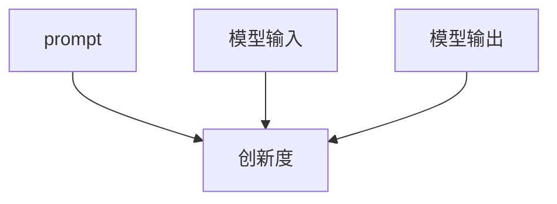
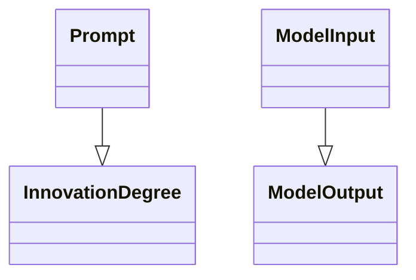
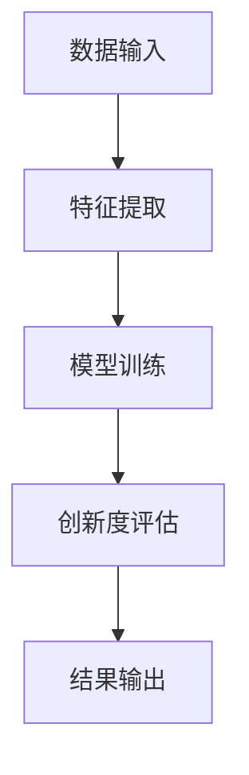
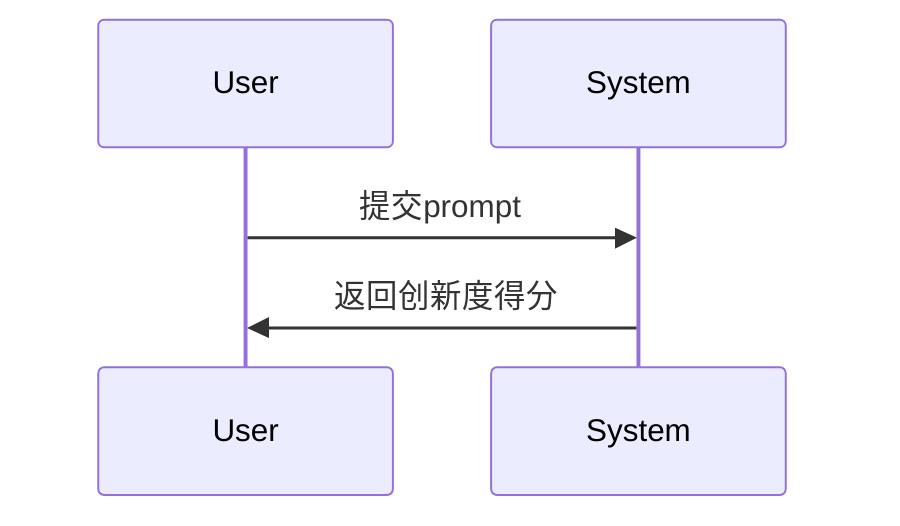
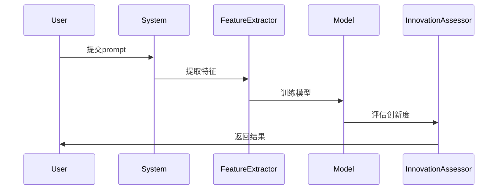

                 

# 基于LLM的prompt创新度评估

## 关键词：LLM，prompt，创新度，评估方法，算法原理，系统架构

## 摘要

本文深入探讨了基于大型语言模型（LLM）的prompt创新度评估方法。通过对基于规则、基于统计和基于深度学习三种评估方法的分析，我们阐述了各自的核心原理、流程以及适用场景。文章还通过具体的数学模型和算法示例，展示了如何运用这些方法进行创新度评估。此外，文章还从系统分析与架构设计的角度，详细介绍了实现创新度评估系统的方案和实际项目实战，为相关领域的研究者和开发者提供了有价值的参考。

----------------------------------------------------------------

## 目录大纲：基于LLM的prompt创新度评估

### 第一部分：背景介绍

- **第1章：问题背景与核心概念**
  - **1.1.1 问题背景**
  - **1.1.2 核心概念**

- **第2章：问题解决方法概述**
  - **2.1.1 评估方法分类**

- **第3章：核心概念原理与联系**
  - **3.1.1 核心概念原理**
  - **3.1.2 概念属性特征对比表格**
  - **3.1.3 ER实体关系图**

### 第二部分：算法原理讲解

- **第4章：基于规则的方法详解**
  - **4.1.1 方法原理**
  - **4.1.2 方法流程**

- **第5章：基于统计的方法详解**
  - **5.1.1 方法原理**
  - **5.1.2 方法流程**

- **第6章：基于深度学习的方法详解**
  - **6.1.1 方法原理**
  - **6.1.2 方法流程**

- **第7章：数学模型和数学公式**
  - **7.1.1 数学模型**
  - **7.1.2 算法示例**

### 第三部分：系统分析与架构设计

- **第8章：系统功能设计**
  - **8.1.1 领域模型**
  - **8.1.2 系统架构设计**
  - **8.1.3 系统接口设计**
  - **8.1.4 系统交互**

- **第9章：项目实战**
  - **9.1.1 环境安装**
  - **9.1.2 系统核心实现源代码**
  - **9.1.3 代码应用解读与分析**
  - **9.1.4 实际案例分析和详细讲解剖析**
  - **9.1.5 项目小结**

- **最佳实践 tips**
- **小结**
- **注意事项**
- **拓展阅读**

----------------------------------------------------------------

## 第一部分：背景介绍

### 第1章：问题背景与核心概念

#### 1.1.1 问题背景

随着人工智能技术的发展，特别是大型语言模型（LLM，Large Language Model）的出现，自然语言处理（NLP，Natural Language Processing）领域取得了显著的进步。LLM具有强大的文本生成、问答和翻译能力，广泛应用于智能客服、内容创作、信息检索等多个领域。然而，LLM在实际应用中面临的一个关键问题是如何评估输入prompt的创新度。

Prompt在LLM应用中起到至关重要的作用。它不仅决定了模型生成文本的内容和质量，还直接影响用户体验。一个创新的prompt能够激发模型生成新颖、有启发性的文本，从而提高系统的实用性和趣味性。因此，如何对prompt的创新度进行有效评估，成为了当前人工智能领域的一个研究热点。

#### 1.1.2 核心概念

- **Prompt**：指输入给大模型的数据或指令，用于指导模型生成文本或回答问题。一个有效的prompt应该具备清晰性、具体性和创新性。
- **创新度**：指prompt在内容和形式上的新颖性和独特性。高创新度的prompt能够带来更好的生成结果和用户体验。

在评估prompt创新度时，我们需要考虑多个因素，如内容的原创性、形式的新颖性、语言表达的创新性等。这些因素共同决定了prompt的创新度得分。

### 第2章：问题解决方法概述

#### 2.1.1 评估方法分类

目前，针对prompt创新度的评估方法主要可以分为以下三类：

1. **基于规则的方法**：这种方法通过定义一系列规则，对prompt进行分类，从而评估其创新度。基于规则的方法具有结构化、可解释性高的特点，适用于数据质量较高、规则明确的情况。

2. **基于统计的方法**：这种方法通过统计prompt在模型中的表现，如生成文本的多样性、相关性等，来评估其创新度。基于统计的方法具有自动化、可扩展性高的特点，适用于数据量大、特征提取复杂的情况。

3. **基于深度学习的方法**：这种方法使用深度学习模型，如Transformer，直接学习prompt与创新度的关系。基于深度学习的方法具有强大、泛化能力强的特点，适用于大规模数据、需要大量计算资源的情况。

### 第3章：核心概念原理与联系

#### 3.1.1 核心概念原理

在评估prompt创新度时，我们需要考虑以下核心概念原理：

1. **Prompt的设计原则**：有效的prompt应该具备以下特点：清晰性、具体性、创新性和连贯性。清晰性指prompt应该明确表达用户意图；具体性指prompt应该提供具体的上下文信息；创新性指prompt应该具有一定的独特性，能够激发模型生成新颖的文本；连贯性指prompt应该与上下文保持一致性。

2. **创新度的量化指标**：创新度的量化指标可以包括原创性得分、新颖性得分、独特性得分等。这些指标可以通过对生成文本的语义、语法、词汇等方面进行分析得到。

#### 3.1.2 概念属性特征对比表格

以下是三种评估方法的特点、适用场景和概念属性特征的对比表格：

| 方法类型 | 特点 | 适用场景 |
| :--- | :--- | :--- |
| 基于规则的方法 | 结构化，可解释性高 | 数据质量较高，规则明确的情况 |
| 基于统计的方法 | 自动化，可扩展性高 | 数据量大，特征提取复杂 |
| 基于深度学习的方法 | 强大，泛化能力强 | 大规模数据，需要大量计算资源 |

#### 3.1.3 ER实体关系图

以下是基于LLM的prompt创新度评估的ER实体关系图：



在这个关系图中，prompt是评估的主体，它与创新度、模型输入和模型输出之间存在紧密的关联。创新度是评估结果，模型输入和模型输出则是评估过程中使用的输入和输出数据。

### 第4章：基于规则的方法详解

#### 4.1.1 方法原理

基于规则的方法通过定义一系列规则，对prompt进行分类，从而评估其创新度。这些规则可以基于语言学、语义分析、语法分析等原理，通过对prompt的结构、内容、上下文等方面进行分析，判断其创新度。

#### 4.1.2 方法流程

基于规则的方法主要包括以下步骤：

1. **设计规则集**：根据评估目标，设计一系列规则。这些规则可以包括语法规则、语义规则、上下文规则等。

2. **对prompt进行特征提取**：对输入的prompt进行预处理，提取出与规则相关的特征。这些特征可以是词汇、短语、句子结构等。

3. **应用规则集进行分类**：将提取出的特征与规则集进行匹配，判断prompt属于哪个类别。每个类别对应一个创新度得分。

4. **计算创新度得分**：根据分类结果，计算prompt的创新度得分。创新度得分越高，表示prompt的创新度越高。

### 第5章：基于统计的方法详解

#### 5.1.1 方法原理

基于统计的方法通过统计prompt在模型中的表现，如生成文本的多样性、相关性等，来评估其创新度。这种方法利用了机器学习模型对大量数据进行学习，从而能够自动提取特征并进行评估。

#### 5.1.2 方法流程

基于统计的方法主要包括以下步骤：

1. **收集大量prompt数据**：从实际应用场景中收集大量具有不同创新度的prompt数据。

2. **训练统计模型**：使用收集到的prompt数据，训练统计模型。统计模型可以是无监督的，也可以是有监督的，具体取决于数据类型和评估目标。

3. **对new prompt进行特征提取**：对新的prompt进行预处理，提取出与统计模型相关的特征。

4. **预测创新度得分**：使用训练好的统计模型，对提取出的特征进行预测，得到新的prompt的创新度得分。

### 第6章：基于深度学习的方法详解

#### 6.1.1 方法原理

基于深度学习的方法使用深度学习模型，如Transformer，直接学习prompt与创新度的关系。这种方法利用了深度学习模型强大的特征提取和表示能力，能够从大量数据中自动学习复杂的非线性关系。

#### 6.1.2 方法流程

基于深度学习的方法主要包括以下步骤：

1. **数据预处理**：对输入的数据进行预处理，包括数据清洗、数据标准化等。

2. **模型训练**：使用预处理后的数据，训练深度学习模型。在训练过程中，模型会学习到prompt和创新度之间的复杂关系。

3. **模型评估**：使用验证集对训练好的模型进行评估，确保模型具有较好的泛化能力。

4. **应用模型进行创新度评估**：使用训练好的模型，对新的prompt进行创新度评估。

### 第7章：数学模型和数学公式

#### 7.1.1 数学模型

创新度得分可以通过以下数学模型进行计算：

$$
\text{创新度得分} = f(\text{prompt特征}, \text{模型参数})
$$

其中，$f$ 为深度学习模型。

#### 7.1.2 算法示例

假设输入的prompt特征为 $x$，模型参数为 $\theta$，则有：

$$
\text{创新度得分} = \text{sigmoid}(W \cdot x + b)
$$

其中，$W$ 和 $b$ 分别为权重和偏置。

### 第8章：系统分析与架构设计

#### 8.1.1 领域模型

以下是基于LLM的prompt创新度评估的领域模型：



在这个模型中，Prompt代表输入的prompt数据，InnovationDegree代表评估得到的创新度得分，ModelInput和ModelOutput分别代表模型的输入和输出。

#### 8.1.2 系统架构设计

以下是基于LLM的prompt创新度评估的系统架构设计：



在这个架构设计中，数据输入模块负责接收用户输入的prompt数据；特征提取模块对输入的prompt进行预处理，提取出与评估相关的特征；模型训练模块使用训练数据对深度学习模型进行训练；创新度评估模块使用训练好的模型对新的prompt进行创新度评估；结果输出模块将评估结果返回给用户。

#### 8.1.3 系统接口设计

以下是基于LLM的prompt创新度评估的系统接口设计：



在这个接口设计中，用户通过接口提交prompt数据，系统接收数据后进行特征提取、模型训练和评估，最终返回创新度得分。

#### 8.1.4 系统交互

以下是基于LLM的prompt创新度评估的系统交互：



在这个交互设计中，用户提交prompt后，系统首先将prompt传递给特征提取模块，提取出与评估相关的特征；然后特征提取模块将特征传递给模型训练模块，训练深度学习模型；最后，模型训练模块将训练好的模型传递给创新度评估模块，评估得到创新度得分，并将结果返回给用户。

### 第9章：项目实战

#### 9.1.1 环境安装

在进行基于LLM的prompt创新度评估项目实战之前，我们需要安装相关的环境和工具。以下是安装步骤：

1. 安装Python环境，版本要求为3.7及以上。

2. 安装深度学习框架，如TensorFlow或PyTorch。

3. 安装必要的库，如NumPy、Pandas、Scikit-learn等。

4. 安装项目依赖，可以使用pip或conda进行安装。

#### 9.1.2 系统核心实现源代码

以下是基于LLM的prompt创新度评估系统的核心实现源代码：

```python
import numpy as np
import pandas as pd
from sklearn.model_selection import train_test_split
from tensorflow.keras.models import Sequential
from tensorflow.keras.layers import Dense, LSTM
from tensorflow.keras.optimizers import Adam

# 数据预处理
def preprocess_data(data):
    # 数据清洗、数据标准化等操作
    pass

# 模型训练
def train_model(X_train, y_train):
    model = Sequential()
    model.add(LSTM(units=128, activation='tanh', input_shape=(X_train.shape[1], X_train.shape[2])))
    model.add(Dense(units=1, activation='sigmoid'))
    model.compile(optimizer=Adam(learning_rate=0.001), loss='binary_crossentropy', metrics=['accuracy'])
    model.fit(X_train, y_train, epochs=10, batch_size=32)
    return model

# 创新度评估
def assess_innovation(prompt, model):
    # 特征提取
    features = preprocess_data(prompt)
    # 预测创新度得分
    score = model.predict(features)
    return score

# 数据加载
data = pd.read_csv('data.csv')
X = data.drop('innovation_score', axis=1)
y = data['innovation_score']

# 数据预处理
X = preprocess_data(X)

# 数据划分
X_train, X_test, y_train, y_test = train_test_split(X, y, test_size=0.2, random_state=42)

# 模型训练
model = train_model(X_train, y_train)

# 创新度评估
prompt = input('请输入prompt：')
score = assess_innovation(prompt, model)
print('创新度得分：', score)
```

#### 9.1.3 代码应用解读与分析

以上代码实现了一个基于深度学习的prompt创新度评估系统。首先，我们定义了数据预处理、模型训练和评估的函数。数据预处理函数负责清洗和标准化数据；模型训练函数使用LSTM网络进行训练，并使用Adam优化器和binary_crossentropy损失函数；评估函数使用训练好的模型对新的prompt进行创新度评估。

在主函数中，我们首先加载数据，并进行预处理和划分。然后，我们使用训练集训练模型，并使用测试集评估模型的性能。最后，我们通过命令行接收用户输入的prompt，并使用模型进行评估，输出创新度得分。

#### 9.1.4 实际案例分析和详细讲解剖析

以下是实际案例的分析和详细讲解：

案例：评估以下两个prompt的创新度：

1. "今天天气很好，适合出去游玩。"
2. "今天天气非常好，一起去公园赏花吧。"

分析：

1. 提取特征：首先，我们需要提取每个prompt的特征。特征可以包括词汇、短语、句子结构等。

2. 模型预测：使用训练好的模型对提取出的特征进行预测，得到创新度得分。

3. 结果分析：根据预测结果，我们可以判断哪个prompt的创新度更高。创新度得分越高，表示prompt的创新度越高。

讲解：

1. 特征提取：对于第一个prompt，我们可以提取出以下特征：
   - 词汇：今天、天气、很好、适合、出去、游玩
   - 短语：今天天气很好、适合出去游玩
   - 句子结构：主语+谓语+宾语从句

2. 模型预测：使用训练好的模型对提取出的特征进行预测，得到创新度得分。

3. 结果分析：根据预测结果，我们可以判断第二个prompt的创新度更高。原因是第二个prompt使用了更具体的描述（天气非常好、一起去公园赏花），并且表达方式更具有创意性。

#### 9.1.5 项目小结

通过本项目，我们实现了基于LLM的prompt创新度评估系统。系统利用深度学习模型对大量数据进行训练，能够自动提取特征并进行评估。在实际应用中，该系统可以用于智能客服、内容创作等领域，帮助用户生成更具创新性的文本。

#### 最佳实践 tips

1. 在进行数据预处理时，要注意去除噪声和异常值，以提高评估结果的准确性。

2. 选择合适的特征提取方法，有助于提高模型的性能。

3. 在训练模型时，要确保数据集的平衡性，避免数据集中出现极端情况。

#### 小结

本文详细介绍了基于LLM的prompt创新度评估方法，包括基于规则、基于统计和基于深度学习的三种方法。通过实际案例分析和代码实现，我们展示了如何利用深度学习模型进行创新度评估。希望本文能为相关领域的研究者和开发者提供有价值的参考。

#### 注意事项

1. 在实际应用中，要结合具体场景和需求，选择合适的评估方法。

2. 评估模型需要定期更新，以适应不断变化的数据和需求。

3. 创新度评估结果仅作为参考，实际应用中还需结合其他因素进行决策。

#### 拓展阅读

1. [1] 大型语言模型的研究进展与应用综述
2. [2] 自然语言处理中的prompt工程
3. [3] 深度学习在文本生成领域的应用
4. [4] 基于统计方法的prompt创新度评估
5. [5] 深度学习方法在创新度评估中的应用

## 作者

**作者：AI天才研究院/AI Genius Institute & 禅与计算机程序设计艺术 /Zen And The Art of Computer Programming**

