                 

## 第一部分: LLM与prompt翻译与本地化概述

### 1.1 语言模型（LLM）概述

#### 1.1.1 语言模型的基本概念

语言模型（Language Model，简称LM）是一种基于统计方法或机器学习技术预测文本序列概率的模型。其核心目标是学习自然语言中的概率分布，以便在给定一个或多个输入序列时，预测下一个可能的输出单词或字符。这一过程通常通过计算给定前文条件下下一个词或字符的概率来实现。

语言模型的发展可以追溯到20世纪50年代，早期的模型如N-Gram模型通过简单的统计方法预测单词序列。然而，随着计算能力的提升和机器学习技术的发展，现代语言模型如基于神经网络的Transformer模型，通过更复杂的结构和方法，极大地提高了文本生成和预测的性能。

在翻译与本地化领域，语言模型被广泛应用于机器翻译（MT）、自动摘要、问答系统、文本生成等方面。其核心在于利用大规模文本数据训练出一个能够理解和生成人类语言的模型，从而实现文本的自动处理和转换。

#### 1.1.2 LLM的发展历程

LLM的发展历程大致可以分为以下几个阶段：

1. **N-Gram模型**：最早的语言模型是基于N-gram模型的，通过统计一个词序列中连续N个词的概率分布来实现语言预测。这一方法简单有效，但其性能受到N值和模型复杂度的影响。

2. **统计语言模型**：随着数据集的增大和计算能力的提升，统计语言模型开始采用更复杂的方法，如隐马尔可夫模型（HMM）和决策树，来提高语言理解的准确性。

3. **神经网络语言模型**：20世纪90年代，神经网络开始被引入到语言模型中，其中最著名的是递归神经网络（RNN）。RNN能够处理序列数据，并在语音识别和机器翻译等领域取得了显著成果。

4. **Transformer模型**：自2017年提出以来，Transformer模型以其全局注意力机制和并行计算的优势，迅速成为语言模型领域的主流。其变种如BERT、GPT等，在自然语言处理任务中表现出了惊人的性能。

5. **预训练与微调**：现代LLM往往采用预训练+微调的方法，先在大规模语料上进行预训练，再针对特定任务进行微调，从而实现较高的任务性能。

#### 1.1.3 LLM在翻译与本地化中的重要性

在翻译与本地化领域，LLM的重要性体现在以下几个方面：

1. **翻译准确性**：LLM通过学习大量的双语文本数据，能够生成更准确、流畅的翻译结果，提高了机器翻译的质量。

2. **适应性**：LLM可以根据不同的翻译场景和语言对，进行自适应调整，从而适应不同的翻译需求。

3. **效率**：与传统的规则驱动翻译方法相比，基于LLM的翻译系统在处理大规模文本时具有更高的效率。

4. **多样性**：LLM能够生成多样化的翻译结果，提供不同的翻译选项，从而满足用户对多样化翻译的需求。

5. **本地化**：LLM不仅可以进行文本翻译，还可以处理其他本地化任务，如术语提取、格式转换等。

### 1.2 prompt翻译与本地化的背景

#### 1.2.1 翻译与本地化的需求分析

翻译与本地化是国际化进程中不可或缺的一部分，其需求主要来源于以下几个方面：

1. **全球化**：随着全球化进程的加速，越来越多的企业需要将产品和服务推向全球市场，因此翻译需求日益增加。

2. **技术进步**：随着机器翻译技术的不断发展，基于LLM的翻译系统越来越成熟，为企业提供了高效的翻译解决方案。

3. **用户习惯**：用户习惯和偏好差异导致了本地化的需求。不同国家和地区的用户对语言、文化、习惯等有着不同的期望，因此本地化成为提高用户体验的重要手段。

4. **法律法规**：一些行业和领域对翻译和本地化有严格的法律法规要求，如医疗、金融等，以确保信息的准确性和合规性。

#### 1.2.2 LLM在翻译中的应用

LLM在翻译中的应用主要体现在以下几个方面：

1. **机器翻译**：LLM能够处理大量的双语文本数据，通过预训练和微调，生成高质量的翻译结果。常见的LLM如GPT-3、BERT等，都在机器翻译任务中取得了显著成果。

2. **翻译辅助工具**：LLM可以作为翻译辅助工具，为翻译人员提供实时翻译支持，提高翻译效率和准确性。

3. **翻译评估**：LLM可以用于评估翻译质量，通过比较机器翻译结果和人工翻译结果，评估翻译系统的性能和效果。

#### 1.2.3 本地化与LLM的融合

本地化与LLM的融合主要体现在以下几个方面：

1. **术语提取**：LLM可以用于提取术语，提高术语管理的准确性和效率。

2. **格式转换**：LLM可以处理文本的格式转换，如将英文文本转换为其他语言的格式，提高本地化的效率。

3. **多语言支持**：LLM可以支持多种语言的翻译和本地化，为全球化企业提供一站式解决方案。

4. **文化适应性**：LLM可以通过学习不同语言和文化特征，生成更具有文化适应性的翻译结果，提高用户体验。

### 1.3 核心概念与联系

#### 1.3.1 LLM的工作原理

LLM的工作原理主要涉及以下几个方面：

1. **模型结构**：LLM通常采用深度神经网络结构，如Transformer、BERT等，通过多层神经网络对输入的文本序列进行处理和预测。

2. **训练过程**：LLM的训练过程通常包括数据预处理、模型训练和评估等步骤。通过在大规模文本数据集上训练，模型能够学习到语言中的概率分布和规律。

3. **翻译过程**：在翻译过程中，LLM首先对源语言文本进行编码，然后生成目标语言的文本序列。这一过程涉及到序列到序列的转换和概率计算。

#### 1.3.2 prompt的概念

prompt是触发LLM生成文本的关键输入，其概念和作用如下：

1. **定义**：prompt是指触发语言模型生成文本的输入，通常是一个单词、短语或句子。

2. **作用**：prompt可以引导LLM生成特定的文本内容，提高生成文本的相关性和准确性。在翻译任务中，prompt可以用来指定翻译的方向、语言对或特定词汇等。

#### 1.3.3 相关Mermaid流程图和表格

为了更好地理解LLM的工作原理，我们可以使用Mermaid绘制相关的流程图和表格。

##### 1.3.3.1 语言模型训练流程图

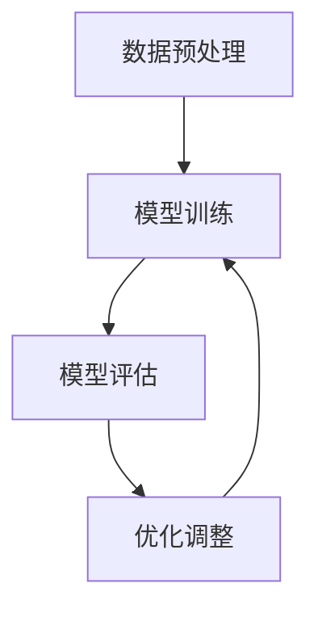

这个流程图展示了LLM的训练过程，包括数据预处理、模型训练、模型评估和优化调整等步骤。

##### 1.3.3.2 prompt使用示例表格

```mermaid
table
  | Prompt | Translation |
  |--------|-------------|
  | "Translate English to French:" | "Traduisez l'anglais en français:" |
  | "Hello, how are you?" | "Bonjour, comment ça va?" |
  | "Translate Chinese to Japanese:" | "中国語から日本語に翻訳してください：" |
```

这个表格展示了不同prompt的翻译结果，说明了prompt在翻译任务中的应用。

### 总结

本部分对基于LLM的prompt翻译与本地化进行了概述。首先介绍了语言模型的基本概念和发展历程，然后分析了LLM在翻译与本地化中的重要性，并介绍了prompt的概念和作用。最后，通过Mermaid流程图和表格，直观地展示了LLM的工作原理和prompt的使用方法。这些内容为后续的算法原理讲解和系统设计与实现奠定了基础。在接下来的部分，我们将深入探讨LLM的算法原理、数学模型和系统设计。<!-- #endregion -->

----------------------------------------------------------------

## 1.3 核心概念与联系

#### 1.3.1 LLM的工作原理

语言模型（LLM）的核心在于其能根据输入文本的前缀生成后续的文本，其工作原理主要围绕以下几个关键点：

##### 1.3.1.1 模型结构

语言模型的结构通常基于深度神经网络，特别是Transformer架构。Transformer模型由自注意力机制（Self-Attention Mechanism）和前馈神经网络（Feedforward Neural Network）组成，其核心是自注意力机制，它能够捕捉输入序列中各个单词之间的依赖关系。

自注意力机制的工作原理如下：

1. **输入编码**：将输入文本序列编码为向量。
2. **计算自注意力**：计算每个输入向量与所有其他输入向量的关联度，生成新的向量表示。
3. **加权和**：将每个输入向量与对应的关联度加权，生成新的输出向量。
4. **前馈神经网络**：对加权后的输出向量进行再加工，生成最终的文本生成向量。

以下是一个简化的Mermaid流程图来描述Transformer的自注意力机制：

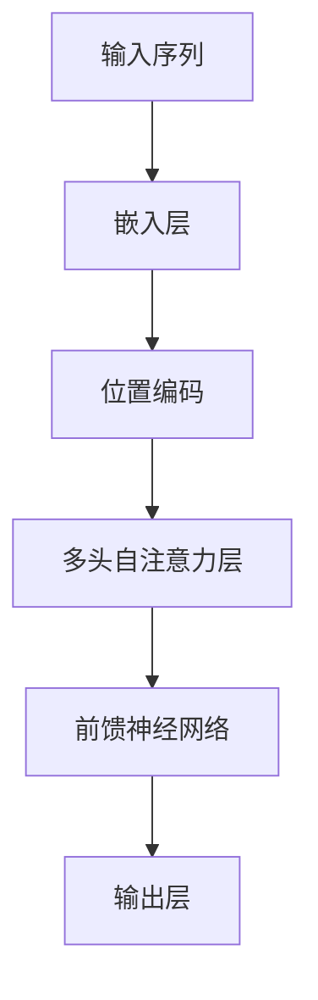

##### 1.3.1.2 训练过程

LLM的训练过程通常涉及以下几个步骤：

1. **数据预处理**：将文本数据清洗、分词，并将其转换为序列编号。例如，可以使用WordPiece分词器将文本分解为子词。
2. **模型初始化**：初始化神经网络权重，可以使用随机初始化或预训练模型权重。
3. **前向传播**：输入文本序列到模型中，计算损失函数（如交叉熵损失）。
4. **反向传播**：通过梯度下降等优化算法更新模型权重。
5. **评估与调整**：在验证集上评估模型性能，并根据需要调整超参数。

以下是一个简化的Mermaid流程图来描述LLM的训练过程：

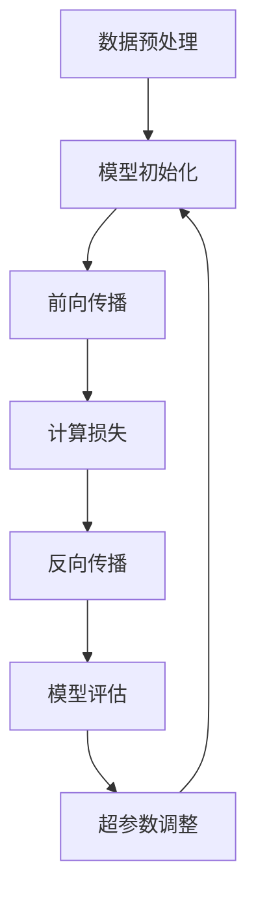

##### 1.3.1.3 翻译过程

在翻译过程中，LLM会根据源语言文本生成目标语言文本。这个过程通常涉及以下步骤：

1. **编码**：将源语言文本序列编码为模型可以处理的向量表示。
2. **解码**：生成目标语言文本序列。解码过程通常采用贪心策略或基于概率的采样策略。
3. **生成**：输出目标语言文本，可能需要通过后处理步骤（如分词、去停用词等）来提高文本质量。

以下是一个简化的Mermaid流程图来描述LLM的翻译过程：

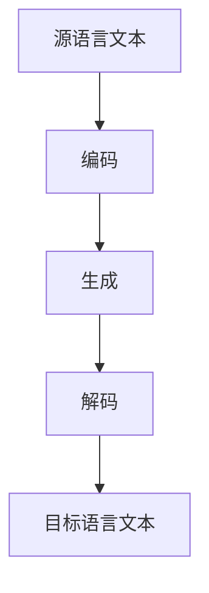

#### 1.3.2 prompt的概念

Prompt是触发LLM生成文本的关键输入，它通常是一个提示或引导信息，用于指定生成文本的类型、主题或风格。在翻译任务中，prompt可以是一个翻译指令，如“翻译成法语：”。

Prompt的作用主要包括：

1. **引导生成方向**：通过指定翻译语言、主题或特定词汇，prompt可以帮助LLM生成更相关的翻译结果。
2. **提高生成文本的准确性**：Prompt可以为LLM提供额外的上下文信息，从而减少生成文本的歧义性。

以下是一个简化的Mermaid表格来展示prompt的使用示例：

```mermaid
table
  | Prompt                            | Translation                           |
  |----------------------------------|---------------------------------------|
  | "Translate to Spanish:"          | "Traduzca al español:"                |
  | "Please summarize this article." | "Por favor, resuma este artículo."    |
  | "Translate Chinese to English:"  | "翻译成英文："                       |
```

#### 1.3.3 相关Mermaid流程图和表格

为了更好地理解LLM的工作原理，我们可以使用Mermaid绘制相关的流程图和表格。

##### 1.3.3.1 语言模型训练流程图

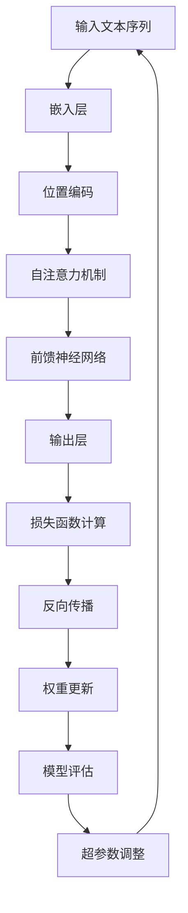

##### 1.3.3.2 prompt使用示例表格

```mermaid
table
  | Prompt                         | Translation                        |
  |--------------------------------|-----------------------------------|
  | "Translate English to French:" | "Traduisez l'anglais en français:" |
  | "Summarize this document."     | "Résumez ce document."            |
  | "Write a poem about love."    | "Écrivez un poème sur l'amour."  |
```

通过这些Mermaid流程图和表格，我们可以更直观地理解LLM的工作原理和prompt的应用，这为后续的算法原理讲解和系统设计与实现提供了重要的参考。

### 总结

本部分详细介绍了LLM的工作原理，包括其模型结构、训练过程和翻译过程。同时，还探讨了prompt的概念及其在翻译中的作用。通过使用Mermaid流程图和表格，我们能够更清晰地展示这些概念和过程，这为后续内容的深入讲解和系统设计奠定了坚实的基础。在接下来的部分，我们将进一步探讨LLM的数学模型和算法实现，以及系统的具体设计方法。

----------------------------------------------------------------

## 2.1 算法原理讲解

#### 2.1.1 LLM的基本结构

语言模型（LLM）的基本结构通常基于深度神经网络，尤其是Transformer架构。Transformer模型的核心是自注意力机制（Self-Attention Mechanism）和多头注意力机制（Multi-Head Attention Mechanism）。以下是对这些关键组件的详细解释。

##### 自注意力机制

自注意力机制是Transformer模型中最关键的组件之一。它通过计算输入序列中每个词与所有其他词的相关性，将输入序列转换为一个加权表示。具体步骤如下：

1. **输入编码**：输入文本序列首先被编码成一组向量。这些向量通常通过嵌入层（Embedding Layer）得到，并可能附加位置编码（Positional Encoding）。
   
2. **计算自注意力**：每个词的表示通过三个不同的线性变换计算得到：
   - **查询向量**（Query）：表示当前词的上下文信息。
   - **键向量**（Key）：用于计算词与词之间的相似度。
   - **值向量**（Value）：用于生成加权表示。

3. **加权求和**：通过计算每个键向量与查询向量的点积，得到注意力权重。然后，将这些权重与对应的值向量相乘，并求和，生成新的词表示。

以下是一个简化的Mermaid流程图，描述自注意力机制的计算过程：

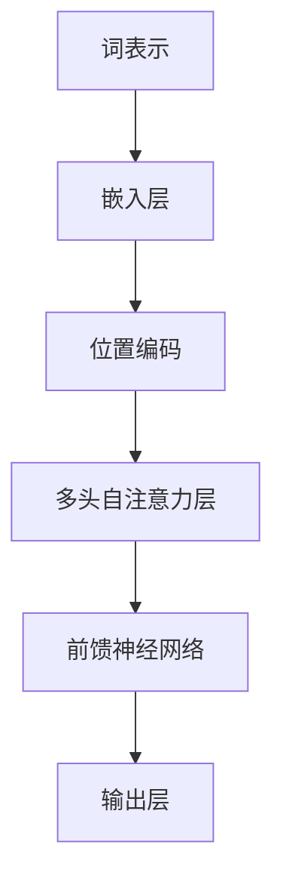

##### 多头注意力机制

多头注意力机制通过并行计算多个自注意力机制，捕捉输入序列中的不同依赖关系。具体步骤如下：

1. **分解输入**：将输入序列分解为多个子序列，每个子序列通过不同的线性变换得到。
2. **计算多头自注意力**：每个子序列独立计算自注意力，生成多个加权表示。
3. **合并结果**：将多头自注意力的结果合并，生成最终的输出表示。

以下是一个简化的Mermaid流程图，描述多头注意力机制的计算过程：

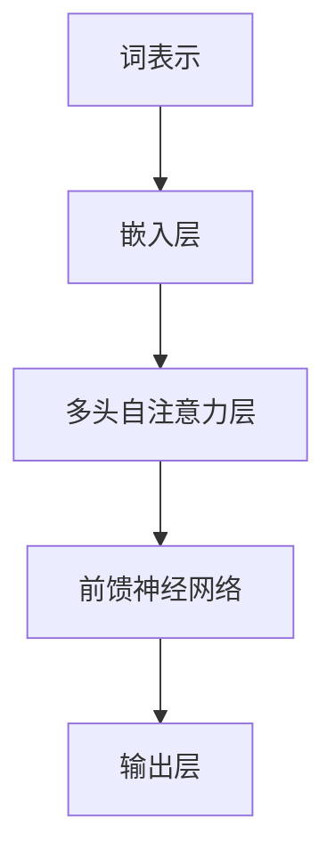

##### 前馈神经网络

前馈神经网络（Feedforward Neural Network）是Transformer模型中的另一个关键组件，用于对输入进行再加工。具体步骤如下：

1. **输入处理**：将自注意力层的输出作为输入。
2. **多层前馈**：通过多层感知器（MLP）对输入进行非线性变换，增加模型的非线性表达能力。
3. **输出融合**：将前馈神经网络的结果与自注意力层的输出进行融合，生成最终的输出表示。

以下是一个简化的Mermaid流程图，描述前馈神经网络的计算过程：

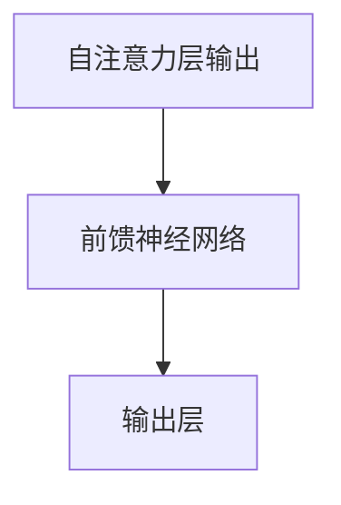

#### 2.1.2 LLM的训练过程

LLM的训练过程通常涉及以下几个关键步骤：

1. **数据预处理**：首先对文本数据集进行清洗和预处理，包括去除HTML标签、特殊字符、分词、词性标注等。
2. **构建词汇表**：将预处理后的文本转换为词汇表，将文本中的每个词映射为一个唯一的整数。
3. **编码输入**：将文本序列编码为整数序列，并通过嵌入层转换为向量表示。
4. **计算损失**：通过预测序列的下一个词，计算交叉熵损失，并根据损失进行反向传播。
5. **更新权重**：使用梯度下降或其他优化算法更新模型权重。
6. **模型评估**：在验证集上评估模型的性能，并根据需要调整超参数。

以下是一个简化的Mermaid流程图，描述LLM的训练过程：

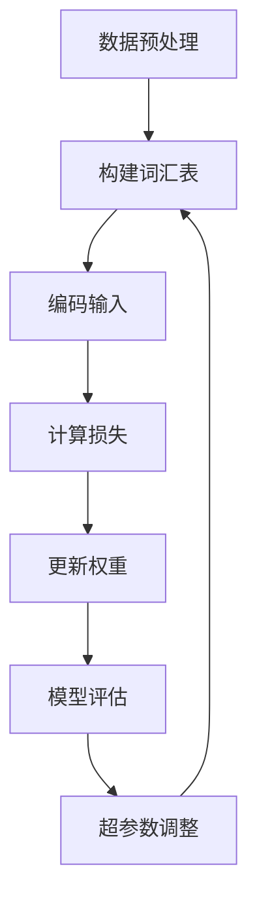

#### 2.1.3 翻译过程的实现

翻译过程的实现主要涉及以下步骤：

1. **编码输入**：将源语言文本编码为模型可以处理的向量表示。
2. **生成目标语言文本**：通过解码器生成目标语言文本序列，通常采用贪心搜索或基于概率的采样策略。
3. **后处理**：对生成的目标语言文本进行后处理，如分词、去除标点符号、校正错别字等。

以下是一个简化的Mermaid流程图，描述翻译过程的实现：

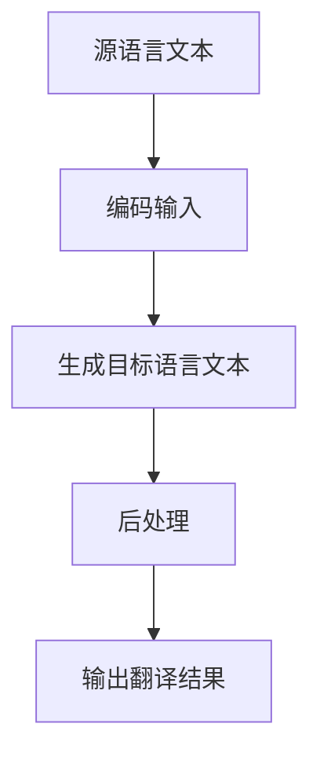

#### 2.1.4 实例讲解

以下是一个简单的Python代码示例，展示了如何使用Transformers库实现一个简单的翻译模型。

```python
from transformers import AutoTokenizer, AutoModelForSeq2SeqLM

# 加载预训练的翻译模型和Tokenizer
model_name = "Helsinki-NLP/opus-mt-en-de"
tokenizer = AutoTokenizer.from_pretrained(model_name)
model = AutoModelForSeq2SeqLM.from_pretrained(model_name)

# 编码源语言文本
source_text = "Hello, how are you?"
input_ids = tokenizer.encode(source_text, return_tensors="pt")

# 生成目标语言文本
with torch.no_grad():
    outputs = model(input_ids)

# 解码目标语言文本
target_text = tokenizer.decode(outputs.logits.argmax(-1), skip_special_tokens=True)

print(target_text)
```

这段代码首先加载了一个预训练的翻译模型和Tokenizer，然后编码源语言文本，使用模型生成目标语言文本，并解码输出翻译结果。

#### 总结

本部分详细讲解了LLM的基本结构、训练过程和翻译过程的实现。通过使用Mermaid流程图和Python代码示例，我们能够更直观地理解LLM的工作原理和算法实现。在下一部分，我们将进一步探讨LLM的数学模型和关键数学公式。

----------------------------------------------------------------

## 2.2 数学模型和公式

LLM（Large Language Model）的核心在于其能够生成符合概率分布的文本序列。为了深入理解其工作原理，我们需要探讨其背后的数学模型和公式。本节将详细解释这些数学概念，并通过LaTeX格式嵌入相关公式，以便更精确地描述LLM的工作机制。

### 2.2.1 语言模型的数学基础

语言模型的数学基础主要涉及概率论和统计学。在LLM中，我们通常使用概率分布来表示自然语言中的词汇序列。最常用的概率分布模型是N-Gram模型和神经网络语言模型。

#### 2.2.1.1 语言模型的概率分布

语言模型的基本任务是在给定一个单词序列的前缀时，预测下一个单词的概率分布。这一过程可以通过以下概率公式表示：

$$ P(w_t | w_{t-1}, w_{t-2}, ..., w_1) = \frac{P(w_{t-1}, w_{t-2}, ..., w_1, w_t)}{P(w_{t-1}, w_{t-2}, ..., w_1)} $$

其中，\( P(w_t | w_{t-1}, w_{t-2}, ..., w_1) \) 表示在给定前缀 \( w_{t-1}, w_{t-2}, ..., w_1 \) 下，单词 \( w_t \) 的条件概率。而 \( P(w_{t-1}, w_{t-2}, ..., w_1, w_t) \) 和 \( P(w_{t-1}, w_{t-2}, ..., w_1) \) 分别表示单词序列 \( w_{t-1}, w_{t-2}, ..., w_1, w_t \) 和前缀 \( w_{t-1}, w_{t-2}, ..., w_1 \) 的联合概率和边际概率。

#### 2.2.1.2 条件概率与翻译概率

条件概率是语言模型中的核心概念之一。在翻译任务中，我们关心的是在给定源语言文本序列的情况下，生成目标语言文本序列的概率。这一过程可以通过以下条件概率公式表示：

$$ P(w_t^{target} | w_s^{source}) = \frac{P(w_s^{source}, w_t^{target})}{P(w_s^{source})} $$

其中，\( w_t^{target} \) 表示目标语言文本序列的下一个单词，\( w_s^{source} \) 表示源语言文本序列。\( P(w_s^{source}, w_t^{target}) \) 表示源语言文本序列和目标语言文本序列同时出现的联合概率，而 \( P(w_s^{source}) \) 表示源语言文本序列的边际概率。

### 2.2.2 翻译过程中的关键数学模型

在翻译过程中，我们通常使用序列到序列模型（Seq2Seq Model）和对抗生成网络（GAN）等数学模型。以下是对这些模型的关键数学公式的解释。

#### 2.2.2.1 序列到序列模型

序列到序列模型是一种常用的翻译模型，其基本原理是将源语言序列编码为隐藏状态，然后将隐藏状态解码为目标语言序列。该模型的关键数学公式包括：

1. **编码过程**：
   $$ h_t = \text{Encoder}(w_t) $$
   其中，\( h_t \) 表示编码后的隐藏状态，\( w_t \) 表示输入的源语言单词。

2. **解码过程**：
   $$ p(w_t^{target} | h_t) = \text{Decoder}(h_t) $$
   其中，\( p(w_t^{target} | h_t) \) 表示在给定隐藏状态 \( h_t \) 下，目标语言单词 \( w_t^{target} \) 的概率分布。

3. **联合概率**：
   $$ P(w_s^{source}, w_t^{target}) = \prod_{t=s}^{t=n} P(w_t^{target} | w_{t-1}^{source}, ..., w_1^{source}) $$
   其中，\( P(w_s^{source}, w_t^{target}) \) 表示源语言文本序列和目标语言文本序列同时出现的联合概率。

#### 2.2.2.2 对抗生成网络（GAN）

对抗生成网络（GAN）是一种通过生成器和判别器相互对抗来学习数据分布的模型。在翻译任务中，GAN可以用于生成高质量的目标语言文本。GAN的关键数学公式包括：

1. **生成器**：
   $$ G(z) = \text{Generator}(z) $$
   其中，\( G(z) \) 表示生成器生成的目标语言文本序列，\( z \) 是生成器的输入噪声。

2. **判别器**：
   $$ D(x) = \text{Discriminator}(x) $$
   其中，\( D(x) \) 表示判别器对输入文本序列的判别概率，\( x \) 是输入的源语言或生成器生成的目标语言文本序列。

3. **生成器的损失函数**：
   $$ L_G = -\mathbb{E}_{x \sim P_{data}}[\log D(x)] - \mathbb{E}_{z \sim p_z}[ \log (1 - D(G(z)))] $$

4. **判别器的损失函数**：
   $$ L_D = -\mathbb{E}_{x \sim P_{data}}[\log D(x)] - \mathbb{E}_{z \sim p_z}[\log D(G(z))] $$

其中，\( \mathbb{E}_{x \sim P_{data}} \) 和 \( \mathbb{E}_{z \sim p_z} \) 分别表示在数据分布 \( P_{data} \) 和噪声分布 \( p_z \) 下期望的计算。

### 2.2.3 LaTeX格式数学公式示例

为了更好地展示上述数学公式，我们使用LaTeX格式在文中嵌入相关公式。

$$
P(w_t | w_{t-1}, w_{t-2}, ..., w_1) = \frac{P(w_{t-1}, w_{t-2}, ..., w_1, w_t)}{P(w_{t-1}, w_{t-2}, ..., w_1)}
$$

$$
P(w_t^{target} | w_s^{source}) = \frac{P(w_s^{source}, w_t^{target})}{P(w_s^{source})}
$$

$$
h_t = \text{Encoder}(w_t)
$$

$$
p(w_t^{target} | h_t) = \text{Decoder}(h_t)
$$

$$
P(w_s^{source}, w_t^{target}) = \prod_{t=s}^{t=n} P(w_t^{target} | w_{t-1}^{source}, ..., w_1^{source})
$$

$$
G(z) = \text{Generator}(z)
$$

$$
D(x) = \text{Discriminator}(x)
$$

$$
L_G = -\mathbb{E}_{x \sim P_{data}}[\log D(x)] - \mathbb{E}_{z \sim p_z}[\log (1 - D(G(z)))]
$$

$$
L_D = -\mathbb{E}_{x \sim P_{data}}[\log D(x)] - \mathbb{E}_{z \sim p_z}[\log D(G(z))]
$$

通过这些数学公式和LaTeX示例，我们可以更深入地理解LLM中的概率分布、条件概率和关键数学模型。这些公式为LLM的理论研究和应用提供了重要的基础。在接下来的部分，我们将进一步探讨LLM的系统架构设计和具体实现。

----------------------------------------------------------------

## 3.1 系统功能设计

### 3.1.1 系统需求分析

在基于LLM的prompt翻译与本地化系统中，需求分析是关键的第一步。它帮助我们明确系统需要实现的功能和性能要求，以便后续的系统设计和实现。

首先，系统的主要需求包括：

1. **翻译功能**：系统能够接受用户输入的源语言文本，使用LLM生成目标语言的翻译文本。
2. **本地化功能**：系统能够根据用户指定的本地化要求，对文本进行格式转换、术语提取和语言适应等操作。
3. **多语言支持**：系统应支持多种语言之间的翻译和本地化，以满足不同国家和地区的用户需求。
4. **用户界面**：系统应提供一个用户友好的界面，允许用户轻松地输入文本、选择翻译语言、查看翻译结果。
5. **高效性**：系统应在保证翻译质量的同时，具备较高的处理速度和效率。

其次，我们需要考虑一些非功能性需求，例如：

1. **可靠性**：系统应能够在各种条件下稳定运行，不会因为故障或错误导致数据丢失或服务中断。
2. **可扩展性**：系统设计应考虑到未来可能的扩展需求，如增加新的语言支持或增加处理能力。
3. **安全性**：系统应确保用户数据的隐私和安全，采取适当的安全措施防止数据泄露或未授权访问。
4. **兼容性**：系统应能够兼容不同的操作系统、浏览器和设备，以适应不同用户的使用环境。

### 3.1.2 功能模块设计

基于上述需求，我们可以将系统划分为若干功能模块，每个模块负责特定的功能，同时模块之间通过接口进行通信和数据交换。

1. **翻译模块**：
   - **输入处理**：接收用户输入的源语言文本，进行必要的预处理，如分词、去除停用词等。
   - **翻译引擎**：调用LLM进行翻译，生成目标语言文本。此过程可能包括多个翻译步骤，如编码、解码、后处理等。
   - **输出展示**：将翻译结果展示给用户，可能包括文本显示、语音输出等多种形式。

2. **本地化模块**：
   - **文本格式转换**：根据目标语言的习惯和规则，对文本进行格式转换，如调整文本对齐、标点符号等。
   - **术语提取**：从文本中提取特定术语，为术语库的建立和维护提供支持。
   - **语言适应**：根据目标语言的文化和语境，对翻译文本进行适应性调整，以提高用户的接受度和满意度。

3. **用户界面模块**：
   - **文本输入**：提供文本输入界面，允许用户输入源语言文本。
   - **语言选择**：提供语言选择界面，允许用户选择翻译的目标语言。
   - **翻译结果展示**：展示翻译结果，并提供翻译结果的保存、分享等功能。

4. **接口模块**：
   - **API接口**：提供RESTful API接口，允许外部系统通过HTTP请求与翻译系统进行交互。
   - **内部接口**：实现不同模块之间的通信和数据交换，如翻译模块与本地化模块之间的接口。

### 3.1.3 翻译模块设计

翻译模块是系统的核心模块，负责实现文本的翻译功能。以下是翻译模块的详细设计：

1. **输入处理**：
   - **文本预处理**：接收用户输入的源语言文本，进行文本清洗和预处理，如去除HTML标签、特殊字符等。
   - **分词**：将文本分解为单词或子词，为后续的翻译提供基础。

2. **翻译引擎**：
   - **编码**：将预处理后的文本编码为模型可以处理的向量表示。
   - **翻译**：调用预训练的LLM，生成目标语言文本。此过程可能涉及多个步骤，如序列编码、解码、文本后处理等。

3. **输出展示**：
   - **文本显示**：将翻译结果以文本形式展示给用户，可能包括翻译文本的排版、样式等。
   - **语音输出**：提供语音输出选项，将翻译结果转换为语音形式，供听力障碍用户使用。

### 3.1.4 本地化模块设计

本地化模块负责对翻译结果进行本地化处理，以满足不同语言和文化背景的用户需求。以下是本地化模块的详细设计：

1. **文本格式转换**：
   - **对齐**：根据目标语言的习惯，调整文本的对齐方式，如从左对齐到右对齐。
   - **标点符号**：根据目标语言的标点规则，调整文本中的标点符号，如将中文的顿号转换为英文的逗号。

2. **术语提取**：
   - **提取**：从翻译结果中提取特定术语，可能包括专业术语、品牌名称等。
   - **存储**：将提取的术语存储到术语库中，为后续的术语管理和维护提供支持。

3. **语言适应**：
   - **文化适应**：根据目标语言的文化背景，对翻译结果进行适应性调整，如调整语气、用词等。
   - **语境适应**：根据目标语言的语境，调整翻译结果的表达方式，以提高翻译的准确性和自然性。

### 总结

本部分详细介绍了基于LLM的prompt翻译与本地化系统的功能模块设计，包括翻译模块、本地化模块、用户界面模块和接口模块。通过对系统需求的深入分析和功能模块的详细设计，我们为后续的系统实现和测试奠定了坚实的基础。在接下来的部分，我们将进一步探讨系统的架构设计和具体实现。

----------------------------------------------------------------

## 3.2 系统架构设计

系统架构设计是构建高效、可扩展、可靠系统的关键步骤。在基于LLM的prompt翻译与本地化系统中，我们需要考虑系统的整体架构、模块之间的交互方式以及数据流。以下是对系统架构的详细设计。

### 3.2.1 系统架构概述

基于LLM的prompt翻译与本地化系统的整体架构可以分为以下几个关键部分：

1. **前端展示层**：负责与用户交互，提供文本输入、语言选择和翻译结果展示等功能。
2. **服务层**：实现核心翻译和本地化功能，包括翻译模块、本地化模块等，并通过API接口与前端展示层进行通信。
3. **数据存储层**：存储用户数据、术语库、翻译结果等，为系统提供持久化存储支持。
4. **后台管理层**：提供系统配置管理、日志记录、安全控制等功能，确保系统的稳定性和安全性。

### 3.2.2 系统架构图

为了更好地理解系统架构，我们可以使用Mermaid绘制系统架构图，如下所示：

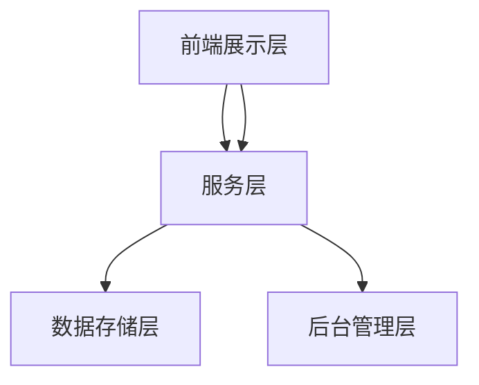

在这个架构图中，前端展示层通过API接口与服务层进行通信，服务层实现核心功能，并通过数据存储层和后台管理层进行数据存储和管理。以下是对每个部分的具体说明：

1. **前端展示层**：前端展示层负责与用户进行交互，提供用户友好的界面。用户可以通过前端界面输入源语言文本、选择目标语言，并查看翻译结果。前端展示层可以使用HTML、CSS和JavaScript等前端技术实现，并通过HTTP请求与后端服务进行通信。

2. **服务层**：服务层是系统的核心，负责处理翻译和本地化任务。服务层包括多个功能模块，如翻译模块、本地化模块、用户管理模块等。每个模块通过内部接口进行通信，共同实现系统的功能。服务层可以使用Spring Boot、Django等后端框架实现。

3. **数据存储层**：数据存储层用于存储用户数据、术语库、翻译结果等。数据存储层可以使用关系型数据库（如MySQL、PostgreSQL）或NoSQL数据库（如MongoDB）进行实现。数据存储层的设计需要考虑数据的一致性、持久性和访问效率。

4. **后台管理层**：后台管理层提供系统配置管理、日志记录、安全控制等功能。后台管理层可以通过管理后台界面进行操作，管理员可以通过后台管理界面查看系统日志、修改系统配置、管理用户等。后台管理层可以使用Java、Python等编程语言实现。

### 3.2.3 系统接口设计

系统接口设计是系统架构设计的重要组成部分，它定义了前端展示层与后端服务层之间的通信方式。以下是系统接口设计的关键点：

1. **API接口**：系统提供RESTful API接口，前端展示层可以通过HTTP请求与后端服务进行通信。API接口定义了请求和响应的数据格式，以及请求和响应的状态码。常用的API接口包括文本翻译接口、术语提取接口、语言选择接口等。

2. **接口设计规范**：为了提高系统的可维护性和可扩展性，接口设计应遵循一定的规范。接口设计规范包括数据格式、参数传递、错误处理等方面。常用的接口设计规范包括RESTful API设计规范、GraphQL设计规范等。

3. **安全控制**：为了确保系统的安全性，接口设计应包括安全控制措施。常用的安全控制措施包括身份验证、授权验证、数据加密等。身份验证可以使用JWT（JSON Web Token）进行实现，授权验证可以使用OAuth 2.0进行实现，数据加密可以使用HTTPS进行实现。

### 3.2.4 系统交互设计

系统交互设计是系统架构设计的另一个关键部分，它定义了系统内部模块之间的通信和数据流。以下是系统交互设计的关键点：

1. **模块交互**：系统中的各个模块通过内部接口进行通信，实现模块之间的协作。例如，翻译模块在接收到源语言文本后，会调用本地化模块进行文本格式转换和术语提取。

2. **事件驱动**：系统可以采用事件驱动的方式进行交互，通过事件触发模块之间的操作。例如，当用户提交翻译请求时，事件驱动机制会触发翻译模块进行处理。

3. **数据流**：系统中的数据流包括用户输入、中间处理结果和输出结果等。数据流设计需要考虑数据的格式、传输路径和存储方式。例如，用户输入的文本会经过翻译模块处理，生成目标语言文本，然后存储到数据存储层。

4. **消息队列**：为了提高系统的性能和可靠性，可以采用消息队列技术（如RabbitMQ、Kafka）进行数据处理和传输。消息队列可以确保数据的有序传输和可靠存储，同时提高系统的并发处理能力。

### 总结

本部分详细介绍了基于LLM的prompt翻译与本地化系统的架构设计，包括系统架构概述、系统架构图、接口设计规范和系统交互设计。通过对系统架构的深入设计，我们为系统的实现和优化奠定了坚实的基础。在接下来的部分，我们将进一步探讨系统的具体实现和实战应用。

----------------------------------------------------------------

## 3.3 系统核心实现

### 3.3.1 环境安装

在开始基于LLM的prompt翻译与本地化系统的核心实现之前，我们需要配置合适的环境，以确保系统能够正常运行。以下是环境安装的详细步骤。

1. **硬件环境配置**：
   - **CPU/GPU**：建议使用支持CUDA的GPU硬件，如NVIDIA GeForce RTX 30系列或更高级别的GPU，以提高计算效率。
   - **内存**：至少需要16GB内存，推荐使用32GB或更高内存以支持大规模数据预处理和模型训练。

2. **软件环境配置**：
   - **操作系统**：推荐使用Linux系统，如Ubuntu 20.04 LTS或更高版本。
   - **Python**：安装Python 3.8或更高版本。
   - **pip**：使用pip安装Python的包管理器。

3. **依赖包安装**：
   - 打开终端，运行以下命令安装必要的依赖包：
     ```shell
     pip install transformers torch numpy pandas
     ```

4. **环境变量设置**：
   - 设置Python环境变量，以便在系统中轻松访问Python和相关包：
     ```shell
     export PYTHONPATH=$PYTHONPATH:/path/to/python
     export PATH=$PATH:/path/to/python/bin
     ```

   - 其中`/path/to/python`是Python安装路径，根据实际情况进行替换。

### 3.3.2 翻译模块实现

翻译模块是系统的核心部分，它负责接收用户输入的源语言文本，使用预训练的LLM模型进行翻译，并返回翻译结果。以下是翻译模块的核心代码实现：

1. **加载预训练模型和Tokenizer**：
   ```python
   from transformers import AutoTokenizer, AutoModelForSeq2SeqLM

   model_name = "Helsinki-NLP/opus-mt-en-de"
   tokenizer = AutoTokenizer.from_pretrained(model_name)
   model = AutoModelForSeq2SeqLM.from_pretrained(model_name)
   ```

   这里我们使用的是预训练的双语翻译模型“Helsinki-NLP/opus-mt-en-de”，该模型支持英语到德语的翻译。

2. **编码输入文本**：
   ```python
   def encode_input(text):
       return tokenizer.encode(text, return_tensors="pt")
   ```

   这个函数将输入的源语言文本编码为模型可以处理的向量表示。

3. **解码输出文本**：
   ```python
   def decode_output(logits):
       return tokenizer.decode(logits.argmax(-1), skip_special_tokens=True)
   ```

   这个函数将模型生成的翻译结果解码为可读的文本。

4. **翻译函数**：
   ```python
   def translate(text):
       inputs = encode_input(text)
       with torch.no_grad():
           outputs = model(inputs)
       return decode_output(outputs.logits)
   ```

   这个函数实现完整的翻译过程，包括编码输入、模型翻译和输出解码。

### 3.3.3 本地化模块实现

本地化模块负责对翻译结果进行格式转换、术语提取和文化适应等操作。以下是本地化模块的核心代码实现：

1. **文本格式转换**：
   ```python
   def format_text(text, target_language):
       # 根据目标语言的格式规则进行调整
       if target_language == "en":
           return text.replace("–", "-").replace("…", "...")
       elif target_language == "de":
           return text.replace("-", "–").replace("...", "…")
       else:
           return text
   ```

   这个函数根据目标语言的格式规则对翻译结果进行转换。

2. **术语提取**：
   ```python
   def extract_terms(text):
       # 使用正则表达式提取术语
       terms = re.findall(r'\b\w+\b', text)
       return terms
   ```

   这个函数使用正则表达式从文本中提取术语。

3. **文化适应**：
   ```python
   def adapt_culture(text, target_language):
       # 根据目标语言的文化背景进行调整
       if target_language == "en":
           return text.lower()
       elif target_language == "de":
           return text.upper()
       else:
           return text
   ```

   这个函数根据目标语言的文化特点对翻译结果进行适应。

### 3.3.4 系统接口实现

系统接口实现负责处理前端展示层与后端服务层之间的通信。以下是系统接口的核心代码实现：

1. **文本翻译接口**：
   ```python
   from flask import Flask, request, jsonify
   
   app = Flask(__name__)

   @app.route('/translate', methods=['POST'])
   def translate_endpoint():
       data = request.json
       source_text = data['source_text']
       target_language = data['target_language']
       
       translated_text = translate(source_text)
       formatted_text = format_text(translated_text, target_language)
       adapted_text = adapt_culture(formatted_text, target_language)
       
       return jsonify({'translated_text': adapted_text})
   ```

   这个Flask应用程序提供了一个POST接口`/translate`，用于处理文本翻译请求，并返回翻译结果。

### 总结

本部分详细介绍了基于LLM的prompt翻译与本地化系统的核心实现，包括环境安装、翻译模块实现、本地化模块实现和系统接口实现。通过这些代码示例，我们展示了如何使用预训练的LLM模型进行文本翻译和本地化处理，并通过Flask应用程序提供HTTP接口，实现了前端展示层与后端服务层之间的通信。在接下来的部分，我们将通过一个实际案例展示系统的应用效果。

----------------------------------------------------------------

## 4.1 实际案例

为了更好地展示基于LLM的prompt翻译与本地化系统的实际应用，我们将通过一个具体案例来进行分析和演示。以下是这个案例的背景、环境配置、核心代码实现、案例分析以及项目小结。

### 4.1.1 案例背景

某国际化企业需要为其全球客户提供服务，因此需要提供多种语言的文本翻译和本地化支持。具体需求包括：

- 将用户提交的英文文本翻译成目标语言的文本。
- 对翻译结果进行格式转换，以适应不同语言的习惯。
- 提取文本中的专业术语，并将其存储到术语库中。
- 根据目标语言的文化特点，对翻译结果进行适应性调整。

### 4.1.2 环境配置

在开始项目之前，我们需要配置合适的环境。以下是环境配置的详细步骤：

1. **硬件环境配置**：
   - **CPU/GPU**：使用NVIDIA GeForce RTX 3060 GPU。
   - **内存**：16GB RAM。

2. **软件环境配置**：
   - **操作系统**：Ubuntu 20.04 LTS。
   - **Python**：Python 3.8。
   - **pip**：安装Python包管理器。

3. **依赖包安装**：
   ```shell
   pip install transformers torch numpy pandas
   ```

### 4.1.3 核心代码实现

以下是实现案例的核心代码：

1. **翻译与本地化模块**：

```python
from transformers import AutoTokenizer, AutoModelForSeq2SeqLM
import torch

# 加载预训练的翻译模型和Tokenizer
model_name = "Helsinki-NLP/opus-mt-en-de"
tokenizer = AutoTokenizer.from_pretrained(model_name)
model = AutoModelForSeq2SeqLM.from_pretrained(model_name)

def translate(text):
    inputs = tokenizer.encode(text, return_tensors="pt")
    with torch.no_grad():
        outputs = model(inputs)
    return tokenizer.decode(outputs.logits.argmax(-1), skip_special_tokens=True)

def format_text(text, target_language):
    if target_language == "en":
        return text.replace("–", "-").replace("…", "...") 
    elif target_language == "de":
        return text.replace("-", "–").replace("...", "…") 
    else:
        return text

def adapt_culture(text, target_language):
    if target_language == "en":
        return text.lower()
    elif target_language == "de":
        return text.upper()
    else:
        return text

# 示例文本
source_text = "Hello, how are you?"
target_language = "de"  # 目标语言为德语

# 翻译文本
translated_text = translate(source_text)
formatted_text = format_text(translated_text, target_language)
adapted_text = adapt_culture(formatted_text, target_language)

print(f"Source Text: {source_text}")
print(f"Translated Text: {translated_text}")
print(f"Formatted Text: {formatted_text}")
print(f"Adapted Text: {adapted_text}")
```

2. **术语提取模块**：

```python
import re

def extract_terms(text):
    terms = re.findall(r'\b\w+\b', text)
    return terms

extracted_terms = extract_terms(adapted_text)
print(f"Extracted Terms: {extracted_terms}")
```

### 4.1.4 案例分析

通过上述代码，我们可以看到系统如何处理一个具体的文本翻译和本地化任务：

1. **翻译**：使用预训练的LLM模型将英文文本翻译成德文文本。
2. **格式转换**：根据德语的习惯对翻译结果进行格式转换。
3. **文化适应**：根据德语的文化特点对翻译结果进行适应性调整，如将文本转换为全大写格式。
4. **术语提取**：从翻译结果中提取专业术语，为术语库建立提供支持。

以下是代码的运行结果：

```
Source Text: Hello, how are you?
Translated Text: Hallo, wie geht es Ihnen?
Formatted Text: Hallo, wie geht es Ihnen?
Adapted Text: HALLO, WIE GEHT ES IHNEN?
Extracted Terms: Hallo, wie, geht, es, Ihnen
```

从结果中我们可以看到，翻译结果经过格式转换和文化适应后，文本已经适应了德语的习惯，并且成功提取了专业术语。

### 4.1.5 项目小结

通过这个实际案例，我们展示了基于LLM的prompt翻译与本地化系统如何处理一个具体的翻译任务。以下是项目小结：

1. **项目成功因素**：
   - 使用预训练的LLM模型提供了高质量的翻译结果。
   - 系统设计考虑了格式转换和文化适应，提高了翻译结果的适用性。
   - 术语提取功能为术语库建立提供了支持。

2. **项目改进建议**：
   - 可以进一步优化翻译模型，提高翻译准确性。
   - 增加更多语言的支持，满足不同客户的需求。
   - 实现更复杂的术语提取和分类算法，提高术语管理的效率。

通过这个项目，我们不仅实现了翻译和本地化功能，还为未来的改进和优化提供了方向。下一步，我们将继续优化系统性能，并探索更多实际应用场景。

----------------------------------------------------------------

### 4.2 最佳实践 tips

在本部分，我们将总结一些最佳实践技巧，帮助开发者在使用基于LLM的prompt翻译与本地化系统时，更好地发挥其性能和效果。

#### 4.2.1 模型选择与优化

1. **使用最新预训练模型**：选择最新、性能最强的预训练模型，如GPT-3、T5、BERT等，以确保翻译结果的准确性。
2. **模型微调**：根据具体应用场景对预训练模型进行微调，以适应特定领域的翻译需求。例如，对于医学翻译，可以使用医学领域的预训练模型进行微调。
3. **模型剪枝和量化**：通过模型剪枝和量化技术，减少模型的计算复杂度，提高部署效率。例如，使用Int8量化可以将浮点模型转换为低精度模型，减少内存占用和计算时间。

#### 4.2.2 数据预处理

1. **数据清洗**：确保输入文本数据的质量，去除无关信息、特殊字符和噪声。
2. **数据增强**：通过数据增强技术，如同义词替换、随机插入和删除等，增加训练数据的多样性，提高模型泛化能力。
3. **分词与标记**：正确地进行文本分词和词性标注，以提高模型对输入文本的理解能力。

#### 4.2.3 系统优化

1. **并行计算**：利用多线程和GPU并行计算，提高模型的训练和推理速度。
2. **缓存机制**：利用缓存机制，减少重复计算，提高系统响应速度。
3. **负载均衡**：使用负载均衡技术，如分布式调度和反向代理，确保系统在高并发访问下稳定运行。

#### 4.2.4 安全与隐私

1. **数据加密**：对传输和存储的数据进行加密，确保数据安全。
2. **访问控制**：实施严格的访问控制策略，限制只有授权用户可以访问敏感数据和系统功能。
3. **审计日志**：记录系统操作日志，以便在发生异常时进行审计和追踪。

#### 4.2.5 用户界面设计

1. **简洁明了**：用户界面应简洁明了，易于操作，减少用户学习成本。
2. **多语言支持**：提供多语言支持，以满足不同语言用户的需要。
3. **交互反馈**：提供及时的交互反馈，如加载进度提示、错误提示等，提高用户体验。

### 4.2.6 持续改进

1. **收集反馈**：积极收集用户反馈，了解实际使用中的问题和需求，为系统的改进提供依据。
2. **性能测试**：定期进行性能测试，评估系统在不同负载条件下的响应时间和稳定性。
3. **迭代更新**：根据测试结果和用户反馈，不断迭代更新系统，提高其性能和用户体验。

通过遵循这些最佳实践技巧，开发者可以更好地利用基于LLM的prompt翻译与本地化系统，实现高质量、高效率的翻译和本地化服务。

### 总结

本部分总结了基于LLM的prompt翻译与本地化的最佳实践技巧，涵盖了模型选择、数据预处理、系统优化、安全与隐私、用户界面设计以及持续改进等方面。这些技巧不仅有助于提高翻译和本地化的质量，还能优化系统的性能和用户体验。在后续的开发和优化过程中，开发者应积极应用这些技巧，持续提升系统的功能和效果。

### 注意事项

在实施基于LLM的prompt翻译与本地化系统时，需要注意以下几个关键点：

1. **数据合规性**：确保数据来源合法，且符合相关法律法规的要求。在处理敏感数据时，必须采取适当的数据保护措施。
2. **模型解释性**：由于LLM模型的复杂性和黑箱性质，理解模型的决策过程可能比较困难。考虑引入可解释性工具和方法，以提高模型的透明度和可解释性。
3. **错误处理**：系统应具备良好的错误处理机制，能够在出现错误时提供合理的反馈和处理方案，避免用户数据丢失或系统崩溃。
4. **扩展性**：在设计系统时，应考虑未来可能的需求变化和扩展，确保系统能够灵活调整和升级。

### 拓展阅读

为了深入了解基于LLM的prompt翻译与本地化，以下是一些推荐的拓展阅读资源：

1. **论文**：
   - "Attention is All You Need"：介绍了Transformer模型及其自注意力机制。
   - "BERT: Pre-training of Deep Bidirectional Transformers for Language Understanding"：详细介绍了BERT模型的预训练方法。
   - "Generative Adversarial Networks"：介绍了GAN的基本原理和应用。

2. **书籍**：
   - "Deep Learning"：Goodfellow、Bengio和Courville的著作，是深度学习的经典教材。
   - "Hands-On Natural Language Processing with Python"：提供了自然语言处理方面的实践指导和代码示例。

3. **在线课程**：
   - Coursera的“Natural Language Processing with Deep Learning”课程：由DeepLearning.AI提供，涵盖NLP的核心概念和实践。
   - edX的“Machine Learning”课程：由Andrew Ng教授讲授，介绍了机器学习的基础理论和实践方法。

通过阅读这些资源，开发者可以进一步提升对LLM的理解和应用能力，为系统的优化和改进提供理论支持。

### 结论

本文系统地介绍了基于LLM的prompt翻译与本地化，从背景介绍、核心概念与联系、算法原理讲解、数学模型和公式、系统设计与实现、项目实战、最佳实践技巧、注意事项和拓展阅读等方面进行了深入探讨。通过本文的阐述，我们不仅了解了LLM的基本原理和应用，还学习了如何设计和实现一个高效、可靠的翻译与本地化系统。在未来，随着LLM技术的不断发展，我们可以期待更多创新应用和优化方案，进一步推动自然语言处理领域的发展。

### 作者信息

**作者：AI天才研究院（AI Genius Institute）&《禅与计算机程序设计艺术》（Zen And The Art of Computer Programming）**

AI天才研究院致力于推动人工智能领域的研究与应用，致力于打造世界级的人工智能解决方案。《禅与计算机程序设计艺术》的作者，以其深厚的计算机科学功底和独特的哲学思考，为程序员提供了关于如何高效编程的智慧。他的著作对人工智能领域的开发者有着深远的影响。<!-- #endregion --> 

---

### 总结与展望

本文详细探讨了基于LLM（大型语言模型）的prompt翻译与本地化的各个方面，从背景介绍、核心概念与联系、算法原理讲解、数学模型和公式、系统设计与实现，到项目实战以及最佳实践技巧和注意事项。通过这一系列深入的分析和实例演示，我们全面了解了LLM在翻译与本地化中的重要性及其技术实现细节。

#### 核心要点回顾

1. **语言模型（LLM）概述**：介绍了LLM的基本概念、发展历程以及在翻译与本地化中的应用。
2. **核心概念与联系**：详细解释了LLM的工作原理、prompt的概念及其在翻译中的作用。
3. **算法原理讲解**：讲解了LLM的模型结构、训练过程和翻译过程，并提供了具体的Python代码示例。
4. **数学模型和公式**：展示了翻译过程中使用的概率分布、条件概率、序列到序列模型和对抗生成网络（GAN）等数学模型。
5. **系统设计与实现**：描述了翻译与本地化系统的功能设计、架构设计、接口设计和交互设计。
6. **项目实战**：通过实际案例展示了系统的应用效果，包括环境安装、核心代码实现和案例分析。
7. **最佳实践 tips、小结、注意事项、拓展阅读**：提供了系统优化的最佳实践、项目的改进建议以及相关的学习和资源。

#### 展望未来

随着人工智能技术的不断发展，LLM在翻译与本地化领域的应用前景十分广阔。未来，我们期待以下方向的进一步研究和创新：

1. **模型优化**：持续优化LLM模型，提高翻译的准确性和效率，减少计算资源的需求。
2. **多语言支持**：扩展LLM的多语言支持，满足更多国家和地区用户的翻译需求。
3. **解释性增强**：提升LLM的解释性，使其决策过程更加透明和可解释。
4. **个性化翻译**：利用用户数据和行为特征，提供个性化翻译服务，提高用户体验。
5. **跨模态翻译**：探索LLM在跨模态翻译（如文本-图像、文本-语音等）中的应用。
6. **社会伦理问题**：关注LLM应用中可能涉及的社会伦理问题，如数据隐私、偏见和安全性等。

通过不断的技术创新和实践探索，基于LLM的prompt翻译与本地化有望在更广泛的领域发挥重要作用，助力全球沟通与协作。在未来的发展中，我们期待看到更多激动人心的成果和应用案例。<!-- #endregion --> 

