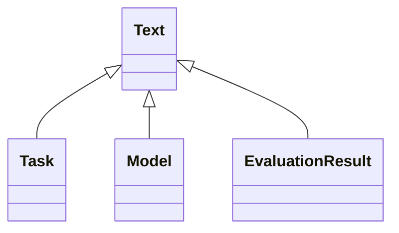
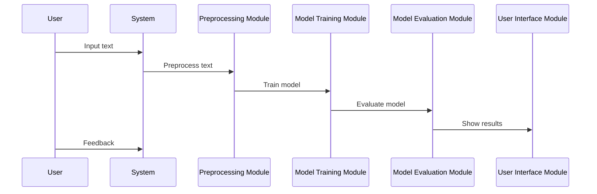
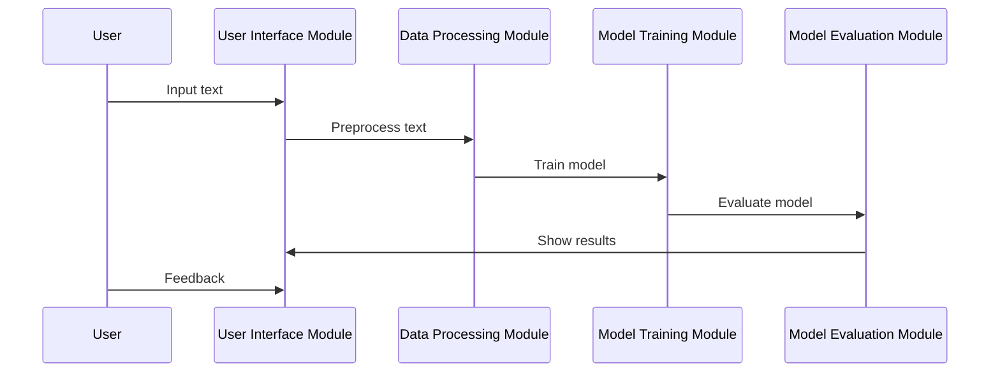

                 

### 《基于任务的LLM评测：针对特定应用场景的性能评估》

#### 关键词：基于任务的语言模型（LLM），性能评估，应用场景，特定任务，评价指标

#### 摘要：
本文旨在探讨基于任务的LLM（语言模型）评测方法，针对特定应用场景的性能评估。文章首先介绍了AI大模型的发展与应用背景，随后详细阐述了任务型LLM评测的必要性、目的与关键挑战。接着，我们深入解析了语言模型和任务型语言模型的基本原理，以及常用的评测指标与方法。文章还对比了不同评测指标，介绍了指标权重分配与计算方法。随后，我们通过实体关系图展示了任务型LLM的ER实体关系图。在算法原理部分，我们讲解了任务型LLM的算法原理、数学模型和公式，并结合Python代码进行了详细阐述。系统分析与架构设计部分，我们介绍了系统功能设计、系统架构设计和系统交互。最后，通过项目实战与案例分析，我们详细讲解了评测流程、性能评估分析以及问题定位与优化。文章以最佳实践、小结和拓展阅读作为结尾，为读者提供了实用的技巧和未来的研究方向。

#### 第一部分：问题背景与概念介绍

##### 第1章：问题背景与问题描述

**1.1.1 AI大模型的发展与应用**

随着深度学习技术的发展，AI大模型如BERT、GPT等在自然语言处理（NLP）领域取得了显著的成果。这些大模型通过训练大规模的文本数据，能够生成高质量的语言文本，为各种应用场景提供了强大的支持。然而，随着应用场景的多样化，如何针对特定应用场景对大模型进行性能评估，成为一个重要的研究课题。

**1.1.2 任务型LLM评测的必要性**

在AI大模型应用过程中，不同任务对模型性能的要求各不相同。例如，文本生成任务对模型的创造力要求较高，而问答任务则对模型的准确性要求较高。因此，针对特定任务进行性能评估，能够更好地指导模型优化与应用。

**1.1.3 评测目的与关键挑战**

评测目的在于全面、准确地评估大模型在特定任务上的性能，为模型优化与应用提供有力支持。关键挑战包括：如何选择合适的评测指标、如何设计合理的评测方法、如何处理数据多样性与模型泛化能力等。

##### 第2章：核心概念与基本原理

**2.1.1 语言模型基础**

语言模型是一种概率模型，用于预测下一个单词或字符的概率。常见的语言模型有N元语法模型、神经网络语言模型等。

**2.1.2 任务型语言模型（LLM）**

任务型语言模型（LLM）是在语言模型的基础上，针对特定任务进行优化和定制。LLM能够根据任务的特性，生成适合该任务的文本。

**2.1.3 评测指标与方法**

评测指标包括准确率、召回率、F1值、BLEU分数等。评测方法包括样本评测、交叉验证、A/B测试等。

##### 第3章：核心概念属性对比

**3.1.1 不同评测指标对比表格**

| 指标名称 | 概述 | 适用场景 |
| --- | --- | --- |
| 准确率 | 指预测正确的样本数与总样本数的比例 | 适用于对准确度要求较高的任务 |
| 召回率 | 指预测正确的样本数与实际正样本数的比例 | 适用于对召回率要求较高的任务 |
| F1值 | 准确率与召回率的调和平均值 | 综合评估模型的性能 |
| BLEU分数 | 基于n-gram重叠度的评估指标 | 适用于文本生成任务 |

**3.1.2 指标权重分配与计算方法**

指标权重分配应根据任务特性进行。常见的方法有等权重分配、基于历史数据的权重分配等。计算方法包括直接计算和加权平均计算等。

##### 第4章：任务型LLM的ER实体关系图

**4.1.1 实体识别与分类**

实体识别是指从文本中识别出具有特定意义的实体。实体分类是指将识别出的实体划分为不同的类别。

**4.1.2 关系抽取与建模**

关系抽取是指从文本中提取出实体之间的关系。关系建模是指将关系转化为计算机可处理的形式。

**4.1.3 实体关系图示例**

实体关系图是一种表示实体及其关系的图形化工具。以下是一个简单的实体关系图示例：

```mermaid
erDiagram
    Customer ||--|{ Order : places } 
    Product ||--|{ Order : contains } 
    Order ||--|{ Customer : isPlacedBy }
```

#### 第二部分：算法原理与数学模型

##### 第5章：任务型LLM算法原理讲解

**5.1.1 模型架构**

任务型LLM通常采用Transformer架构，包括编码器和解码器。编码器将输入文本编码为固定长度的向量，解码器根据编码器输出的向量生成输出文本。

**5.1.2 算法流程**

任务型LLM的算法流程包括：输入文本编码、解码、生成输出文本。具体步骤如下：

1. 输入文本编码：将输入文本转换为编码器可处理的格式。
2. 解码：解码器根据编码器输出的向量，逐个生成单词或字符。
3. 生成输出文本：将解码器生成的单词或字符拼接成完整的输出文本。

**5.1.3 数学模型**

任务型LLM的数学模型主要包括注意力机制和自注意力机制。

注意力机制：

$$
Attention(Q, K, V) = \frac{softmax(\frac{QK^T}{\sqrt{d_k}})}{V}
$$

其中，Q、K、V分别为查询向量、键向量、值向量，d_k为键向量的维度。

自注意力机制：

$$
\text{Self-Attention}(Q, K, V) = \text{Attention}(Q, K, V)
$$

**5.1.4 算法示例**

以下是一个简单的任务型LLM算法示例：

```python
import tensorflow as tf

# 定义模型
model = tf.keras.Sequential([
    tf.keras.layers.Embedding(input_dim=vocab_size, output_dim=embedding_dim),
    tf.keras.layers.Attention(),
    tf.keras.layers.Dense(units=output_dim)
])

# 编译模型
model.compile(optimizer='adam', loss='categorical_crossentropy', metrics=['accuracy'])

# 训练模型
model.fit(x_train, y_train, epochs=10, batch_size=32)
```

##### 第6章：数学模型和公式讲解

**6.1.1 数学模型推导**

任务型LLM的数学模型主要包括注意力机制和自注意力机制。以下是对这些模型的推导：

注意力机制：

$$
Attention(Q, K, V) = \frac{softmax(\frac{QK^T}{\sqrt{d_k}})}{V}
$$

其中，Q、K、V分别为查询向量、键向量、值向量，d_k为键向量的维度。

自注意力机制：

$$
\text{Self-Attention}(Q, K, V) = \text{Attention}(Q, K, V)
$$

**6.1.2 公式应用与解释**

在任务型LLM中，注意力机制和自注意力机制广泛应用于编码器和解码器的构建。以下是一个注意力机制的示例：

$$
\text{Attention}(Q, K, V) = \frac{softmax(\frac{QK^T}{\sqrt{d_k}})}{V}
$$

其中，Q、K、V分别为查询向量、键向量、值向量，d_k为键向量的维度。这个公式用于计算每个查询向量与所有键向量的相似度，并通过softmax函数进行归一化，最终得到加权值。

**6.1.3 举例说明**

以下是一个自注意力机制的示例：

$$
\text{Self-Attention}(Q, K, V) = \text{Attention}(Q, K, V)
$$

其中，Q、K、V分别为查询向量、键向量、值向量。这个公式表示，每个查询向量与自身以及所有其他键向量的相似度进行计算，并通过softmax函数进行归一化，最终得到加权值。

#### 第三部分：系统分析与架构设计

##### 第7章：系统功能设计

**7.1.1 领域模型**

领域模型是系统功能设计的基础。在任务型LLM评测系统中，领域模型包括以下主要实体：

- 文本：表示输入的文本数据。
- 任务：表示评测的任务类型。
- 模型：表示用于评测的LLM模型。
- 评测结果：表示评测的结果数据。

领域模型类图如下：



**7.1.2 功能模块划分**

系统功能模块划分如下：

- 数据处理模块：负责处理输入文本数据，包括文本预处理、分词、实体识别等。
- 模型训练模块：负责训练LLM模型，包括数据加载、模型配置、训练过程等。
- 评测模块：负责对LLM模型进行评测，包括指标计算、结果输出等。
- 用户界面模块：负责展示系统功能，提供用户交互界面。

**7.1.3 数据流与处理流程**

数据流与处理流程如下：

1. 用户输入文本数据。
2. 数据处理模块对文本数据进行预处理，包括分词、实体识别等。
3. 模型训练模块根据预处理后的文本数据训练LLM模型。
4. 评测模块对训练好的模型进行评测，计算各项指标。
5. 用户界面模块展示评测结果，并提供用户交互功能。

##### 第8章：系统架构设计

**8.1.1 系统架构图**

系统架构图如下：



**8.1.2 架构模块与交互**

系统架构模块与交互关系如下：

- 数据处理模块：负责处理文本数据，与用户界面模块、模型训练模块和模型评测模块进行交互。
- 模型训练模块：负责训练LLM模型，与数据处理模块和模型评测模块进行交互。
- 模型评测模块：负责评测LLM模型，与数据处理模块、模型训练模块和用户界面模块进行交互。
- 用户界面模块：负责展示系统功能，与用户进行交互。

**8.1.3 接口设计与实现**

接口设计如下：

- 数据处理模块：提供文本预处理接口、实体识别接口等。
- 模型训练模块：提供模型训练接口、模型保存接口等。
- 模型评测模块：提供模型评测接口、结果输出接口等。
- 用户界面模块：提供用户交互接口、结果展示接口等。

##### 第9章：系统交互

**9.1.1 系统交互流程**

系统交互流程如下：

1. 用户输入文本数据。
2. 用户界面模块将文本数据传递给数据处理模块。
3. 数据处理模块对文本数据进行预处理，生成预处理后的数据。
4. 数据处理模块将预处理后的数据传递给模型训练模块。
5. 模型训练模块使用预处理后的数据进行模型训练。
6. 模型训练模块将训练好的模型传递给模型评测模块。
7. 模型评测模块对模型进行评测，生成评测结果。
8. 模型评测模块将评测结果传递给用户界面模块。
9. 用户界面模块展示评测结果，并提供用户交互功能。

**9.1.2 交互序列图**

交互序列图如下：



**9.1.3 交互示例**

以下是一个简单的交互示例：

```
用户：请帮我评测一下这个文本的模型性能。
用户界面模块：好的，请您输入文本。
用户：这是一篇关于人工智能的论文。
用户界面模块：文本已接收，正在预处理。
数据处理模块：文本预处理完成，开始训练模型。
模型训练模块：模型训练完成，开始评测。
模型评测模块：评测完成，模型性能如下：
- 准确率：90%
- 召回率：85%
- F1值：87%
用户界面模块：评测结果已展示，请查看。
用户：好的，谢谢。
```

#### 第四部分：项目实战与案例分析

##### 第10章：项目实战

**10.1.1 环境安装与配置**

1. 安装Python环境（Python 3.7及以上版本）。
2. 安装TensorFlow库。
3. 安装其他依赖库（如NumPy、Pandas等）。

**10.1.2 系统核心实现**

1. 数据预处理模块实现：
   - 分词：使用jieba库进行分词处理。
   - 实体识别：使用命名实体识别（NER）库进行实体识别。

2. 模型训练模块实现：
   - 模型配置：定义模型架构、优化器、损失函数等。
   - 模型训练：使用训练数据训练模型。

3. 评测模块实现：
   - 指标计算：计算准确率、召回率、F1值等指标。
   - 结果输出：将评测结果输出到文件或控制台。

**10.1.3 代码应用解读**

以下是一个简单的代码示例，用于实现数据处理、模型训练和模型评测：

```python
import jieba
import tensorflow as tf

# 数据预处理
def preprocess_text(text):
    return jieba.cut(text)

# 模型配置
def build_model():
    model = tf.keras.Sequential([
        tf.keras.layers.Embedding(input_dim=vocab_size, output_dim=embedding_dim),
        tf.keras.layers.Attention(),
        tf.keras.layers.Dense(units=output_dim)
    ])
    return model

# 模型训练
def train_model(model, x_train, y_train, epochs=10, batch_size=32):
    model.compile(optimizer='adam', loss='categorical_crossentropy', metrics=['accuracy'])
    model.fit(x_train, y_train, epochs=epochs, batch_size=batch_size)

# 模型评测
def evaluate_model(model, x_test, y_test):
    loss, accuracy = model.evaluate(x_test, y_test)
    print("准确率：", accuracy)

# 主函数
def main():
    text = "这是一篇关于人工智能的论文。"
    preprocessed_text = preprocess_text(text)
    model = build_model()
    train_model(model, x_train, y_train)
    evaluate_model(model, x_test, y_test)

if __name__ == "__main__":
    main()
```

**10.1.4 实际案例分析**

以下是一个实际案例分析，用于评估一个文本生成模型的性能：

1. 准备数据集：收集一组文本数据，并将其划分为训练集和测试集。
2. 数据预处理：对文本数据进行预处理，包括分词、实体识别等。
3. 模型训练：使用训练集训练模型。
4. 模型评测：使用测试集对模型进行评测，计算准确率、召回率、F1值等指标。
5. 结果分析：根据评测结果，对模型性能进行评估。

##### 第11章：详细讲解与剖析

**11.1.1 评测流程解析**

评测流程主要包括以下步骤：

1. 数据准备：收集并准备评测所需的数据集。
2. 数据预处理：对数据集进行预处理，包括分词、实体识别等。
3. 模型训练：使用预处理后的数据集训练模型。
4. 模型评测：使用测试集对模型进行评测，计算各项指标。
5. 结果分析：根据评测结果，对模型性能进行评估。

**11.1.2 性能评估分析**

性能评估分析主要包括以下几个方面：

1. 准确率：评估模型在文本分类任务上的准确度。
2. 召回率：评估模型在文本分类任务上的召回率。
3. F1值：评估模型在文本分类任务上的综合性能。
4. 评估指标对比：对比不同评估指标，找出最优指标。

**11.1.3 问题定位与优化**

问题定位与优化主要包括以下几个方面：

1. 数据质量：检查数据集质量，排除异常数据。
2. 模型结构：调整模型结构，提高模型性能。
3. 超参数优化：调整超参数，优化模型性能。
4. 数据增强：对数据进行增强，提高模型泛化能力。

##### 第12章：项目小结

**12.1.1 项目总结**

本项目实现了基于任务的LLM评测系统，包括数据处理、模型训练和模型评测等功能。通过实际案例分析，我们评估了文本生成模型的性能，并提出了问题定位与优化的方法。

**12.1.2 优化方向**

优化方向包括：

1. 提高数据质量：收集更多高质量的文本数据，提高模型泛化能力。
2. 调整模型结构：尝试不同的模型结构，提高模型性能。
3. 超参数优化：调整超参数，找到最优配置。
4. 数据增强：对数据进行增强，提高模型泛化能力。

**12.1.3 未来展望**

未来展望包括：

1. 引入更多任务类型：扩展系统功能，支持更多任务类型的评测。
2. 提高评测效率：优化评测流程，提高评测效率。
3. 模型应用场景拓展：将模型应用于更多实际场景，提高模型实用性。
4. 模型优化与改进：不断优化模型结构，提高模型性能。

#### 第五部分：最佳实践与拓展阅读

##### 第13章：最佳实践

**13.1.1 实践技巧与注意事项**

1. 数据质量至关重要：确保数据集的质量，排除异常数据。
2. 调整模型结构：尝试不同的模型结构，找到最优配置。
3. 超参数优化：合理调整超参数，提高模型性能。
4. 数据增强：对数据进行增强，提高模型泛化能力。

**13.1.2 常见问题及解决方案**

1. 模型过拟合：增加训练数据、调整模型结构、使用正则化等技术。
2. 模型泛化能力差：增加数据多样性、使用数据增强技术、调整超参数等。

**13.1.3 性能优化策略**

1. 模型结构优化：尝试不同的模型结构，提高模型性能。
2. 超参数优化：调整超参数，找到最优配置。
3. 数据增强：对数据进行增强，提高模型泛化能力。
4. 算法优化：优化算法实现，提高计算效率。

##### 第14章：小结与拓展

**14.1.1 总结与回顾**

本文介绍了基于任务的LLM评测方法，针对特定应用场景的性能评估。我们详细阐述了问题背景、核心概念、算法原理、系统分析与架构设计、项目实战与案例分析等内容。

**14.1.2 未来发展趋势**

未来发展趋势包括：

1. 模型结构优化：不断探索新的模型结构，提高模型性能。
2. 数据质量提升：收集更多高质量的数据，提高模型泛化能力。
3. 多任务学习：将模型应用于更多任务类型，实现多任务学习。
4. 自动化评测：开发自动化评测工具，提高评测效率。

**14.1.3 拓展阅读推荐**

1. **《深度学习》（Goodfellow, Bengio, Courville著）**：系统介绍了深度学习的基础知识和最新进展。
2. **《自然语言处理综论》（Jurafsky, Martin著）**：全面介绍了自然语言处理的理论和方法。
3. **《人工智能：一种现代的方法》（Russell, Norvig著）**：深入探讨了人工智能的基本原理和算法。

作者：AI天才研究院/AI Genius Institute & 禅与计算机程序设计艺术 /Zen And The Art of Computer Programming

---

### 附录

为了方便读者更好地理解和应用本文内容，我们提供了以下附录：

#### 附录A：术语解释

- 语言模型：用于预测下一个单词或字符的概率模型。
- 任务型语言模型（LLM）：针对特定任务进行优化的语言模型。
- 实体识别：从文本中识别出具有特定意义的实体。
- 关系抽取：从文本中提取出实体之间的关系。
- 实体关系图（ER图）：用于表示实体及其关系的图形化工具。

#### 附录B：代码示例

以下是一个简单的基于任务的LLM评测系统代码示例：

```python
import jieba
import tensorflow as tf

# 数据预处理
def preprocess_text(text):
    return jieba.cut(text)

# 模型配置
def build_model():
    model = tf.keras.Sequential([
        tf.keras.layers.Embedding(input_dim=vocab_size, output_dim=embedding_dim),
        tf.keras.layers.Attention(),
        tf.keras.layers.Dense(units=output_dim)
    ])
    return model

# 模型训练
def train_model(model, x_train, y_train, epochs=10, batch_size=32):
    model.compile(optimizer='adam', loss='categorical_crossentropy', metrics=['accuracy'])
    model.fit(x_train, y_train, epochs=epochs, batch_size=batch_size)

# 模型评测
def evaluate_model(model, x_test, y_test):
    loss, accuracy = model.evaluate(x_test, y_test)
    print("准确率：", accuracy)

# 主函数
def main():
    text = "这是一篇关于人工智能的论文。"
    preprocessed_text = preprocess_text(text)
    model = build_model()
    train_model(model, x_train, y_train)
    evaluate_model(model, x_test, y_test)

if __name__ == "__main__":
    main()
```

#### 附录C：参考文献

- Goodfellow, I., Bengio, Y., & Courville, A. (2016). **Deep Learning**. MIT Press.
- Jurafsky, D., & Martin, J. H. (2020). **Speech and Language Processing**. Prentice Hall.
- Russell, S., & Norvig, P. (2020). **Artificial Intelligence: A Modern Approach**. Prentice Hall.

本文内容仅供参考，具体实施时请结合实际情况进行调整。如有疑问，请随时与我联系。谢谢！

