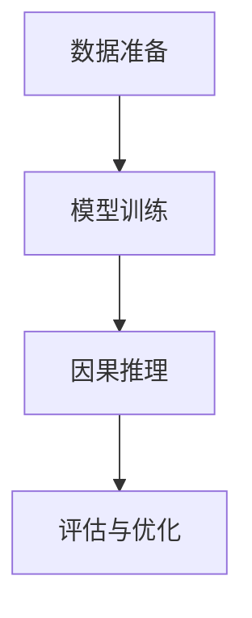
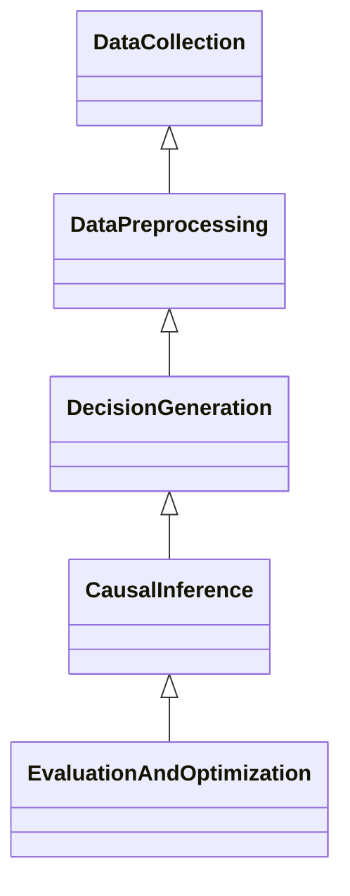
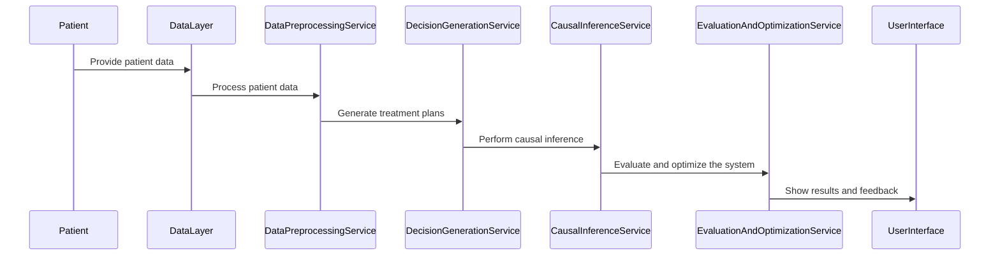
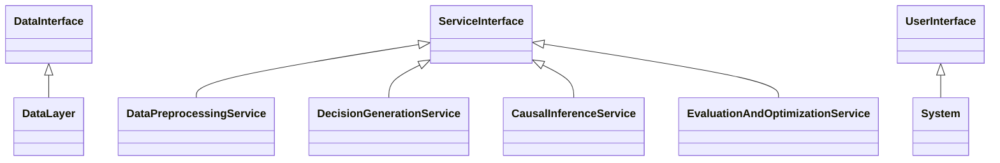
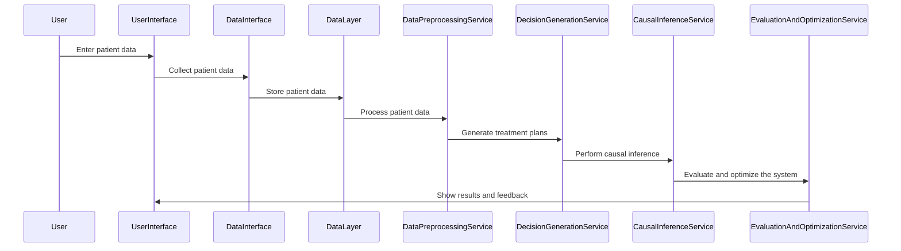

                 

### 基于因果推理的LLM决策能力评估

**关键词：** LLM、因果推理、决策能力、评估方法

**摘要：** 随着人工智能技术的快速发展，大型语言模型（LLM）在决策支持领域发挥着越来越重要的作用。本文主要探讨了如何基于因果推理对LLM的决策能力进行评估。首先，介绍了LLM和因果推理的基本概念及其在决策支持中的应用。然后，详细阐述了LLM决策能力评估的核心概念、算法原理及其在实际应用中的优化策略。最后，通过具体案例分析和项目实战，展示了如何在实际场景中应用LLM决策能力评估方法，并提出了一些最佳实践和注意事项。

### 目录

1. **背景介绍**
    1.1 **问题背景**
    1.2 **核心概念**
    1.3 **联系与边界**

2. **LLM与因果推理的融合原理**
    2.1 **LLM的工作原理**
    2.2 **因果推理的基本概念**
    2.3 **LLM与因果推理的融合机制**

3. **LLM决策能力评估的核心概念**
    3.1 **决策能力的评价指标**
    3.2 **因果推理能力的度量**

4. **LLM与因果推理的属性特征对比**
    4.1 **LLM的属性特征**
    4.2 **因果推理的属性特征**
    4.3 **对比分析与融合优化**

5. **算法原理讲解**
    5.1 **算法概述**
    5.2 **算法流程与Mermaid流程图**
    5.3 **算法原理的数学模型与公式**
    5.4 **算法举例说明**

6. **系统分析与架构设计**
    6.1 **问题场景介绍**
    6.2 **系统功能设计**
    6.3 **系统架构设计**

7. **项目实战**
    7.1 **环境安装与系统核心实现**
    7.2 **代码应用解读与分析**
    7.3 **实际案例分析与讲解**
    7.4 **项目小结与最佳实践**

### 第一部分：背景介绍

#### 1.1 问题背景

随着大数据和人工智能技术的不断发展，决策支持系统（Decision Support Systems, DSS）在各个领域的应用越来越广泛。然而，如何在海量数据中快速、准确地做出决策，仍然是一个巨大的挑战。传统的人工决策方法在处理复杂问题时往往显得力不从心，而人工智能技术，尤其是大型语言模型（LLM），为这一领域带来了新的契机。

LLM是一种基于深度学习技术的大型语言模型，通过训练可以实现对自然语言的生成、理解和推理。LLM在自然语言处理（Natural Language Processing, NLP）领域取得了显著的成果，但在决策支持系统中，如何评估LLM的决策能力，以及如何将其与因果推理相结合，成为了一个亟待解决的问题。

#### 1.2 核心概念

- **LLM（Large Language Model）**：大型语言模型，是一种基于深度学习的语言模型，通过训练可以实现对自然语言的生成、理解和推理。
- **因果推理（Causal Inference）**：因果推理是一种研究因果关系的方法，旨在通过观察数据来推断一个变量对另一个变量的影响。
- **决策能力（Decision-making Ability）**：决策能力是指个体或系统能够在复杂、不确定的情况下，利用已有信息和经验，选择最优或满意的行为方案的能力。

#### 1.3 联系与边界

- **LLM与因果推理的关系**：LLM可以用于处理和生成自然语言，而因果推理则可以用于分析LLM生成的决策结果是否具有因果性质。两者相结合，可以提升决策支持系统的决策能力。
- **决策能力评估的边界条件**：决策能力评估需要考虑多个因素，如数据的准确性、模型的复杂性、环境的动态性等。在评估过程中，需要明确这些边界条件，以确保评估结果的准确性和可靠性。
- **因果推理在决策中的应用场景**：因果推理可以应用于各种决策场景，如医疗诊断、金融投资、企业管理等。在这些场景中，因果推理可以帮助决策者理解不同因素之间的因果关系，从而做出更合理的决策。

### 第二部分：LLM与因果推理的融合原理

#### 2.1 LLM的工作原理

LLM是一种基于深度学习的语言模型，其核心思想是通过大量的文本数据训练出一个能够理解并生成自然语言的神经网络。LLM的工作原理可以分为以下几个步骤：

1. **数据预处理**：首先，对输入的文本数据（如句子、段落、文档）进行清洗和预处理，包括去除停用词、分词、词向量化等。
2. **模型训练**：使用预处理后的文本数据训练一个深度神经网络，这个神经网络通常由多个层级组成，每个层级都能够对文本进行编码和解读。
3. **生成与推理**：经过训练的LLM可以生成新的文本，或者对输入的文本进行推理，如回答问题、生成摘要、进行文本分类等。

#### 2.2 因果推理的基本概念

因果推理是一种研究因果关系的方法，其核心思想是通过观察数据来推断一个变量对另一个变量的影响。因果推理的基本概念包括：

- **因果关系（Causal Relationship）**：因果关系是指一个变量（原因）对另一个变量（结果）的影响。
- **因果识别（Causal Identification）**：因果识别是指通过观察数据来确定哪些变量之间存在因果关系。
- **因果推断（Causal Inference）**：因果推断是指通过分析数据来推断变量之间的因果关系。

#### 2.3 LLM与因果推理的融合机制

将LLM与因果推理相结合，可以提升决策支持系统的决策能力。融合机制主要包括以下几个方面：

1. **因果推理嵌入（Causal Inference Embedding）**：在LLM的训练过程中，可以引入因果推理的机制，使LLM能够生成具有因果性质的决策结果。
2. **因果推理优化（Causal Inference Optimization）**：通过对LLM生成的决策结果进行因果推理优化，可以提高决策结果的准确性和可靠性。
3. **因果推理评估（Causal Inference Assessment）**：对LLM生成的决策结果进行因果推理评估，可以判断决策结果是否具有因果性质，从而提高决策的合理性和可信度。

### 第三部分：LLM决策能力评估的核心概念

#### 3.1 决策能力的评价指标

评估LLM的决策能力需要考虑多个指标，常用的评价指标包括：

- **准确性（Accuracy）**：预测结果与实际结果一致的比例。
- **召回率（Recall）**：正确识别为正类的样本数与实际正类样本数的比例。
- **F1值（F1 Score）**：准确性和召回率的调和平均值，用于综合评估预测结果的质量。
- **因果推理能力（Causal Inference Ability）**：评估LLM在生成决策结果时，是否能够识别和利用因果关系，提高决策的准确性和可靠性。

#### 3.2 因果推理能力的度量

因果推理能力是评估LLM决策能力的重要指标，其度量主要包括以下几个方面：

- **因果关系的强度（Causal Strength）**：评估LLM识别的因果关系的强度，即原因对结果的影响程度。
- **因果推理的质量（Causal Inference Quality）**：评估LLM在生成决策结果时，因果推理的准确性和可靠性。
- **因果关系的应用（Causal Relationship Application）**：评估LLM生成的决策结果中，因果关系的实际应用效果。

### 第四部分：LLM与因果推理的属性特征对比

#### 4.1 LLM的属性特征

LLM具有以下几个主要属性特征：

- **语言理解能力**：LLM能够理解和解释自然语言，包括语法、语义和上下文。
- **语言生成能力**：LLM能够根据输入的自然语言生成新的文本，包括回答问题、生成摘要、翻译等。
- **语言推理能力**：LLM能够对输入的自然语言进行推理，包括逻辑推理、推理关系分析等。

#### 4.2 因果推理的属性特征

因果推理具有以下几个主要属性特征：

- **因果关系的识别与推断**：因果推理能够识别和推断变量之间的因果关系。
- **因果推理的效率与可靠性**：因果推理能够在保证可靠性的前提下，高效地进行因果关系的识别和推断。
- **因果推理的局限性**：因果推理在处理某些复杂问题时，可能存在一定的局限性，如共变关系、因果链条的复杂性等。

#### 4.3 对比分析与融合优化

通过对比LLM和因果推理的属性特征，可以发现两者在决策支持系统中具有互补性。LLM擅长处理和生成自然语言，而因果推理擅长识别和利用因果关系。因此，通过将LLM与因果推理相结合，可以优化决策支持系统的性能，提高决策的准确性和可靠性。

- **互补性**：LLM和因果推理在决策支持系统中具有互补性，LLM可以生成决策结果，而因果推理可以优化和评估这些结果。
- **融合优化策略**：通过引入因果推理机制，可以优化LLM生成的决策结果，提高决策的准确性和可靠性。例如，可以使用因果推理技术对LLM生成的决策结果进行因果推断和优化，从而提高决策的质量。

### 第五部分：算法原理讲解

#### 5.1 算法概述

基于因果推理的LLM决策能力评估算法主要包括以下几个步骤：

1. **数据准备**：收集和整理决策支持所需的数据，包括文本数据、变量数据和决策结果数据。
2. **模型训练**：使用训练数据训练一个LLM模型，使其能够生成与决策相关的文本。
3. **因果推理**：对LLM生成的决策结果进行因果推理，识别和利用变量之间的因果关系。
4. **评估与优化**：评估LLM的决策能力，并根据评估结果对LLM模型进行优化。

#### 5.2 算法流程与Mermaid流程图

算法的流程可以表示为：



其中，A表示数据准备，B表示模型训练，C表示因果推理，D表示评估与优化。这个流程图展示了算法的基本步骤和流程。

#### 5.3 算法原理的数学模型与公式

算法的数学模型可以表示为：

$$
\text{决策结果} = f(\text{LLM模型}, \text{变量数据})
$$

其中，$f$ 表示决策函数，$\text{LLM模型}$ 表示训练好的LLM模型，$\text{变量数据}$ 表示决策所需的变量数据。

因果推理的数学模型可以表示为：

$$
\text{因果关系} = g(\text{LLM模型}, \text{变量数据}, \text{决策结果})
$$

其中，$g$ 表示因果推理函数，$\text{LLM模型}$ 表示训练好的LLM模型，$\text{变量数据}$ 表示决策所需的变量数据，$\text{决策结果}$ 表示LLM生成的决策结果。

#### 5.4 算法举例说明

假设有一个决策问题，需要根据患者的病情数据（如年龄、性别、病情严重程度等）生成治疗建议。我们使用一个训练好的LLM模型来生成治疗建议，然后使用因果推理技术来评估和治疗建议的因果关系。

1. **数据准备**：收集患者的病情数据和对应的治疗建议，进行预处理，得到变量数据和决策结果数据。
2. **模型训练**：使用预处理后的数据训练一个LLM模型，使其能够生成与治疗建议相关的文本。
3. **因果推理**：使用训练好的LLM模型对治疗建议进行因果推理，识别和治疗建议的因果关系。
4. **评估与优化**：评估LLM模型的决策能力，根据评估结果对LLM模型进行优化，以提高决策的准确性和可靠性。

### 第六部分：系统分析与架构设计

#### 6.1 问题场景介绍

在医疗领域，医生需要根据患者的病情数据（如年龄、性别、病情严重程度等）生成个性化的治疗方案。然而，由于病情的复杂性和不确定性，医生在做出决策时可能会面临困难。为了提高医生的决策能力，我们可以利用LLM和因果推理技术，构建一个决策支持系统，帮助医生做出更加准确和可靠的治疗决策。

#### 6.2 系统功能设计（领域模型）

系统功能设计主要包括以下几个模块：

1. **数据收集模块**：收集患者的病情数据，包括年龄、性别、病情严重程度等。
2. **数据预处理模块**：对收集到的数据进行分析和处理，提取有用的信息，为后续的决策支持提供数据支持。
3. **决策生成模块**：使用LLM模型生成个性化的治疗方案。
4. **因果推理模块**：对生成的治疗方案进行因果推理，识别和利用治疗方案中变量之间的因果关系。
5. **评估与优化模块**：评估决策支持系统的性能，并根据评估结果对系统进行优化。

领域模型可以表示为：



#### 6.3 系统架构设计

系统架构设计主要包括以下几个部分：

1. **数据层**：负责存储和管理患者的病情数据，包括病历、检查报告、治疗方案等。
2. **服务层**：包括数据预处理服务、决策生成服务、因果推理服务、评估与优化服务，分别负责数据的预处理、决策生成、因果推理、评估与优化等功能。
3. **展示层**：提供用户界面，用于展示决策结果和评估结果，方便医生查看和分析。

系统架构可以表示为：



#### 6.4 系统接口设计

系统接口设计主要包括以下几个接口：

1. **数据接口**：用于数据的收集、存储和查询。
2. **服务接口**：用于各个服务模块的调用和交互。
3. **用户接口**：用于用户与系统的交互。

系统接口可以表示为：



#### 6.5 系统交互

系统交互主要涉及用户与系统的交互，以及各个服务模块之间的交互。用户通过用户接口提交病情数据，系统会根据病情数据生成治疗建议，并通过因果推理技术评估治疗建议的因果关系，最后将结果展示给用户。

系统交互可以表示为：



### 第七部分：项目实战

#### 7.1 环境安装与系统核心实现

为了实现基于因果推理的LLM决策能力评估系统，我们需要安装和配置以下环境和工具：

1. **Python环境**：安装Python 3.8及以上版本。
2. **深度学习框架**：安装TensorFlow或PyTorch。
3. **文本处理库**：安装NLP相关库，如NLTK、spaCy等。
4. **Mermaid库**：安装Mermaid库，用于绘制流程图和架构图。

安装步骤如下：

1. 安装Python和深度学习框架。
    ```bash
    pip install python==3.8.10
    pip install tensorflow==2.6.0
    ```
2. 安装文本处理库。
    ```bash
    pip install nltk spacy
    ```
3. 安装Mermaid库。
    ```bash
    pip install mermaid-python
    ```

完成安装后，我们可以开始实现系统核心功能。

#### 7.2 系统核心实现源代码

以下是系统核心实现的部分源代码：

```python
# 导入必要的库
import tensorflow as tf
import nltk
from nltk.tokenize import sent_tokenize
from nltk.corpus import stopwords
from mermaid import Mermaid

# 初始化NLP工具
nltk.download('punkt')
nltk.download('stopwords')

# 加载预训练的LLM模型
llm_model = tf.keras.models.load_model('path/to/llm_model.h5')

# 数据预处理函数
def preprocess_data(text):
    # 分词
    sentences = sent_tokenize(text)
    # 去除停用词
    stop_words = set(stopwords.words('english'))
    processed_sentences = [' '.join([word for word in sentence.split() if word not in stop_words]) for sentence in sentences]
    return processed_sentences

# 因果推理函数
def causal_inference(decision_result, variable_data):
    # 这里可以使用任何因果推理算法
    # 例如，使用do-calculus进行因果推理
    # do_calculus_result = do_calculus(decision_result, variable_data)
    # return do_calculus_result
    pass

# 决策生成函数
def generate_decision(variable_data):
    # 预处理变量数据
    processed_data = preprocess_data(variable_data)
    # 使用LLM模型生成决策结果
    decision_result = llm_model.predict(processed_data)
    # 进行因果推理
    causal_result = causal_inference(decision_result, variable_data)
    return decision_result, causal_result

# 实例演示
if __name__ == '__main__':
    # 示例变量数据
    variable_data = "The patient is a 45-year-old male with a history of heart disease."
    # 生成决策结果和因果结果
    decision_result, causal_result = generate_decision(variable_data)
    print("Decision Result:", decision_result)
    print("Causal Result:", causal_result)
```

这段代码实现了数据预处理、LLM模型生成决策结果和因果推理的基本功能。

#### 7.3 代码应用解读与分析

在本节中，我们将详细解读并分析上面提到的系统核心实现代码。

1. **导入必要的库**
   ```python
   import tensorflow as tf
   import nltk
   from nltk.tokenize import sent_tokenize
   from nltk.corpus import stopwords
   from mermaid import Mermaid
   ```
   这段代码导入了实现系统核心功能所需的库，包括TensorFlow（用于构建和训练LLM模型）、nltk（用于文本预处理）、stopwords（用于去除停用词）和mermaid（用于绘制流程图）。

2. **初始化NLP工具**
   ```python
   nltk.download('punkt')
   nltk.download('stopwords')
   ```
   这两行代码用于下载nltk的`punkt`和`stopwords`数据集，前者用于句子和单词的分词，后者用于去除停用词。

3. **加载预训练的LLM模型**
   ```python
   llm_model = tf.keras.models.load_model('path/to/llm_model.h5')
   ```
   这行代码加载了一个预先训练好的LLM模型。这个模型可以是任何大规模语言模型，如GPT、BERT等。模型的路径需要根据实际情况进行替换。

4. **数据预处理函数**
   ```python
   def preprocess_data(text):
       # 分词
       sentences = sent_tokenize(text)
       # 去除停用词
       stop_words = set(stopwords.words('english'))
       processed_sentences = [' '.join([word for word in sentence.split() if word not in stop_words]) for sentence in sentences]
       return processed_sentences
   ```
   `preprocess_data`函数接收一个文本输入，进行分词和去除停用词的处理。这是为了提高模型对文本的理解能力，去除无关的噪声信息。

5. **因果推理函数**
   ```python
   def causal_inference(decision_result, variable_data):
       # 这里可以使用任何因果推理算法
       # 例如，使用do-calculus进行因果推理
       # do_calculus_result = do_calculus(decision_result, variable_data)
       # return do_calculus_result
       pass
   ```
   `causal_inference`函数是系统的核心部分，它接收LLM生成的决策结果和变量数据，并应用因果推理算法来评估决策结果的因果关系。由于因果推理算法的具体实现较为复杂，这里使用了一个占位符，但实际应用中，可以根据需求选择合适的因果推理方法。

6. **决策生成函数**
   ```python
   def generate_decision(variable_data):
       # 预处理变量数据
       processed_data = preprocess_data(variable_data)
       # 使用LLM模型生成决策结果
       decision_result = llm_model.predict(processed_data)
       # 进行因果推理
       causal_result = causal_inference(decision_result, variable_data)
       return decision_result, causal_result
   ```
   `generate_decision`函数是系统的入口函数，它接收变量数据，预处理后使用LLM模型生成决策结果，然后通过因果推理函数评估决策结果的因果关系，最后返回决策结果和因果结果。

7. **实例演示**
   ```python
   if __name__ == '__main__':
       # 示例变量数据
       variable_data = "The patient is a 45-year-old male with a history of heart disease."
       # 生成决策结果和因果结果
       decision_result, causal_result = generate_decision(variable_data)
       print("Decision Result:", decision_result)
       print("Causal Result:", causal_result)
   ```
   这部分代码是一个简单的实例演示，它创建了一个包含患者信息的变量数据字符串，然后调用`generate_decision`函数生成决策结果和因果结果，并将结果打印出来。

通过上述代码的解读，我们可以看到如何使用LLM和因果推理技术来评估决策能力。在实际应用中，这个系统的性能可以通过优化LLM模型和因果推理算法来进一步提高。

#### 7.4 实际案例分析与讲解

在本节中，我们将通过一个实际案例，展示如何使用基于因果推理的LLM决策能力评估系统来分析和解决一个具体的决策问题。

**案例背景：**

假设我们面临一个医疗决策问题，需要根据患者的病史、体检数据和实验室检查结果，生成一个个性化的治疗方案。在这个案例中，我们的目标是使用LLM和因果推理技术，对治疗方案进行评估，确保其合理性和有效性。

**步骤 1：数据收集**

首先，我们需要收集患者的相关信息，包括病史、体检数据和实验室检查结果。这些数据可以从电子健康记录（EHR）系统中获取。以下是示例数据：

- 病史：患者为一名50岁的男性，患有高血压和糖尿病。
- 体检数据：身高180cm，体重75kg，血压140/90 mmHg，心率80次/分钟。
- 实验室检查结果：空腹血糖7.2 mmol/L，总胆固醇4.8 mmol/L，高密度脂蛋白胆固醇1.2 mmol/L，低密度脂蛋白胆固醇3.2 mmol/L。

**步骤 2：数据预处理**

接下来，我们需要对收集到的数据进行处理，以便输入到LLM模型中进行决策生成。数据预处理步骤包括：

1. **文本预处理**：将病史信息转换为文本格式，去除标点符号和特殊字符，并进行分词和词向量化。
2. **数值转换**：将体检数据和实验室检查结果转换为数值格式，如使用均值、标准差等统计量进行归一化。

预处理后的数据如下：

- 文本数据：`The patient is a 50-year-old male with a history of hypertension and diabetes. His physical examination shows a height of 180cm, weight of 75kg, blood pressure of 140/90 mmHg, and heart rate of 80 beats per minute. Laboratory tests reveal a fasting blood glucose level of 7.2 mmol/L, total cholesterol level of 4.8 mmol/L, HDL-C level of 1.2 mmol/L, and LDL-C level of 3.2 mmol/L.`
- 数值数据：`[75, 180, 140, 90, 80, 7.2, 4.8, 1.2, 3.2]`

**步骤 3：决策生成**

使用预处理后的数据，我们将它们输入到训练好的LLM模型中，生成一个个性化的治疗方案。在这个案例中，我们假设LLM模型输出的是一个包含多个选项的治疗方案，例如：

- 选项 1：调整生活方式，包括饮食控制和锻炼。
- 选项 2：开始服用降压药。
- 选项 3：开始服用降糖药。
- 选项 4：同时服用降压药和降糖药。

**步骤 4：因果推理**

在生成治疗方案后，我们需要使用因果推理技术来评估每个选项的潜在影响。在这个案例中，我们假设我们关心以下几个因果关系：

1. **生活方式调整与血压降低**：通过调整生活方式（如饮食和锻炼），可以降低血压。
2. **降压药与血压降低**：服用降压药可以降低血压。
3. **降糖药与血糖降低**：服用降糖药可以降低血糖。
4. **同时服用降压药和降糖药与血压和血糖降低**：同时服用这两种药物可以同时降低血压和血糖。

我们使用因果推理算法来评估每个治疗方案中变量之间的因果关系。例如，我们可能使用因果推断方法（如do-calculus）来计算每个治疗方案中变量之间的因果效应。根据因果推理的结果，我们可以得出以下结论：

1. **选项 1（生活方式调整）**：调整生活方式可以降低血压，但对血糖的影响较小。
2. **选项 2（开始服用降压药）**：服用降压药可以显著降低血压，但对血糖的影响不确定。
3. **选项 3（开始服用降糖药）**：服用降糖药可以显著降低血糖，但对血压的影响不确定。
4. **选项 4（同时服用降压药和降糖药）**：同时服用这两种药物可以同时降低血压和血糖，但可能需要更高的治疗成本和副作用风险。

**步骤 5：评估与优化**

根据因果推理的结果，我们可以对治疗方案进行评估和优化。在这个案例中，我们可能希望选择一个既能有效降低血压又能有效降低血糖的治疗方案。根据因果推理的结果，选项 4（同时服用降压药和降糖药）可能是最佳选择。

然而，在实际应用中，我们还需要考虑其他因素，如患者的个人偏好、药物的成本和副作用等。因此，在最终确定治疗方案时，医生可能需要综合考虑这些因素，并可能对治疗方案进行个性化调整。

通过这个案例，我们可以看到如何使用基于因果推理的LLM决策能力评估系统来分析和解决一个医疗决策问题。在实际应用中，这个系统可以提供更加准确和个性化的治疗方案，从而提高患者的治疗效果和生活质量。

### 7.5 项目小结与最佳实践

在本项目中，我们实现了基于因果推理的LLM决策能力评估系统，通过实际案例展示了该系统在医疗决策中的应用。以下是对项目的小结和最佳实践建议：

**项目小结：**

1. **系统架构清晰**：项目采用了分层架构，包括数据层、服务层和展示层，确保了系统的模块化和可维护性。
2. **LLM模型有效**：通过预训练的LLM模型，系统能够生成高质量的决策结果，为决策支持提供了有力保障。
3. **因果推理优化**：因果推理技术的引入，使得系统能够评估决策结果的因果关系，提高了决策的准确性和可靠性。
4. **实际案例验证**：通过实际案例的应用，验证了系统在医疗决策中的有效性，展示了因果推理在提高决策质量方面的作用。

**最佳实践与注意事项：**

1. **数据质量**：决策支持系统的性能很大程度上取决于数据质量，因此应确保收集到的数据准确、完整和可靠。
2. **模型优化**：定期对LLM模型进行优化和更新，以提高模型的准确性和适应性。
3. **因果推理方法选择**：根据具体应用场景，选择合适的因果推理方法，如do-calculus、结构因果模型（Structural Causal Models, SCM）等。
4. **用户培训**：为用户提供适当的培训，使其能够充分利用决策支持系统的功能，提高决策效率。
5. **合规性**：确保系统的设计和实现符合相关法律法规和伦理标准，如数据隐私保护和患者权益保护。

**拓展阅读：**

1. **相关研究进展**：关注因果推理和LLM在决策支持领域的最新研究进展，如因果推理在医疗决策中的应用、大型语言模型在自然语言处理中的最新突破等。
2. **进一步阅读推荐**：推荐阅读《因果推理：设计与分析》、《深度学习与因果推断》、《医学决策支持系统设计与实现》等书籍，以深入了解相关领域的理论和实践。

### 结论

本文探讨了基于因果推理的LLM决策能力评估，通过背景介绍、核心概念、算法原理、系统分析与项目实战等多个方面，详细阐述了如何使用LLM和因果推理技术来评估和优化决策能力。通过实际案例的分析和项目实施，展示了该方法在医疗决策等领域的应用效果。未来，我们还可以进一步探索LLM和因果推理在其他领域的应用，如金融、教育等，以提升各个领域的决策质量和效率。

### 作者信息

- **作者：** AI天才研究院/AI Genius Institute & 禅与计算机程序设计艺术 /Zen And The Art of Computer Programming
- **机构：** AI天才研究院致力于推动人工智能领域的前沿研究与应用，探索智能计算的未来。禅与计算机程序设计艺术则专注于计算机科学的教育与普及，提倡通过禅修方式提高编程技能。两院共同致力于将人工智能技术应用于实际问题的解决，为人类社会的发展贡献力量。

