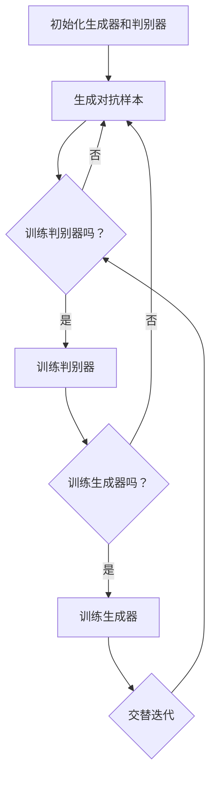

                 


## 第1章：对抗网络概述

### 1.1 什么是对抗网络

对抗网络（Adversarial Networks）是一种特殊的神经网络架构，由两个主要部分组成：生成器（Generator）和判别器（Discriminator）。生成器的任务是生成类似于真实数据的数据，而判别器的任务是区分生成器生成的数据与真实数据。这两个模型相互竞争，生成器的目标是使判别器难以区分，而判别器的目标是提高对真实数据和生成数据的辨别能力。

对抗网络最初由Ian Goodfellow等人于2014年提出，并在生成对抗网络（GAN, Generative Adversarial Network）中得到了广泛应用。GAN的提出标志着深度学习领域的一个重大突破，它不仅在图像处理领域取得了显著成就，还在自然语言处理、音频生成、视频生成等领域展示了巨大的潜力。

### 1.2 对抗网络的发展历史

对抗网络的研究起源于1940年代神经网络的早期研究，但直到2010年代，随着深度学习技术的快速发展，对抗网络才逐渐引起广泛关注。2014年，Goodfellow等人在论文《Generative Adversarial Nets》中详细描述了GAN的理论基础和实现方法，标志着对抗网络的正式诞生。

自GAN问世以来，对抗网络领域的研究迅速扩展，涌现出了大量的变种和改进方法，如Wasserstein GAN（WGAN）、条件生成对抗网络（cGAN）、循环一致生成对抗网络（CycleGAN）等。这些改进方法旨在解决GAN训练过程中的不稳定性和模式崩溃等问题，进一步提升生成器的性能。

### 1.3 对抗网络的核心原理

对抗网络的核心原理在于生成器和判别器之间的博弈过程。具体来说，生成器通过学习从随机噪声中生成数据，而判别器的目标是正确地判断输入数据是真实数据还是生成数据。这两个模型的训练过程如下：

1. **生成器训练**：生成器从随机噪声中生成数据，并尝试使这些数据尽可能地接近真实数据。生成器的损失函数通常由判别器的输出决定，判别器对生成数据的输出越接近0.5，生成器的损失越小。

2. **判别器训练**：判别器接收真实数据和生成数据，并尝试正确地区分两者。判别器的损失函数通常由正确分类的真实数据和生成数据的比例决定。

3. **交替训练**：生成器和判别器交替进行训练，生成器每次生成新的数据，判别器使用这些数据进行训练，然后判别器再次更新生成器的权重。

这个过程持续进行，直到生成器能够生成足够逼真的数据，使判别器难以区分生成数据和真实数据。在这个过程中，生成器和判别器相互竞争，不断改进自己的性能。

### 1.4 对抗网络的应用领域

对抗网络的应用领域非常广泛，主要包括以下几个方面：

1. **图像生成**：对抗网络在图像生成方面取得了显著的成果，可以生成逼真的图像、视频和动画。

2. **自然语言处理**：对抗网络在自然语言处理领域也有广泛应用，如生成自然语言文本、翻译、对话系统等。

3. **音频处理**：对抗网络可以生成高质量的音频，包括音乐、语音、环境声音等。

4. **医学图像处理**：对抗网络在医学图像处理方面具有很大的潜力，如生成医学图像、辅助诊断等。

5. **数据增强**：对抗网络可以生成与训练数据具有相同分布的数据，用于增强数据集，提高模型的泛化能力。

总之，对抗网络作为一种强大的深度学习模型，已在多个领域取得了重要应用，并展现出巨大的潜力。

### 1.5 本章小结

本章主要介绍了对抗网络的基本概念、发展历史、核心原理和应用领域。通过本章的学习，读者可以了解对抗网络的基本原理和主要应用场景，为后续章节的深入探讨打下基础。在接下来的章节中，我们将进一步探讨对抗网络的理论基础和具体实现方法。

## 第2章：对抗网络的理论基础

### 2.1 机器学习基础

在深入了解对抗网络之前，我们需要先了解一些机器学习的基础知识。本节将介绍机器学习的概述、神经网络基础和损失函数与优化算法。

#### 2.1.1 机器学习概述

机器学习（Machine Learning）是一门研究如何让计算机从数据中自动学习规律和知识的学科。它属于人工智能（Artificial Intelligence, AI）的一个分支，旨在让计算机具备一定的智能行为，如图像识别、语音识别、自然语言处理等。

机器学习的基本流程包括以下几个步骤：

1. **数据收集**：收集用于训练的数据集。

2. **数据预处理**：对数据进行清洗、归一化等处理，以便后续训练。

3. **模型选择**：选择合适的模型进行训练。

4. **模型训练**：使用训练数据训练模型，调整模型参数。

5. **模型评估**：使用验证数据评估模型性能。

6. **模型部署**：将训练好的模型部署到实际应用场景。

机器学习的主要方法包括监督学习、无监督学习和强化学习。监督学习（Supervised Learning）是指模型根据已知输入和输出训练数据来预测新的输出。无监督学习（Unsupervised Learning）是指模型在没有标签数据的情况下发现数据中的规律。强化学习（Reinforcement Learning）是指模型通过与环境的交互来学习最优策略。

#### 2.1.2 神经网络基础

神经网络（Neural Network）是一种模仿生物神经系统的计算模型，由大量的神经元（Node）通过连接（Connection）组成。神经网络的每个神经元都是一个简单的计算单元，接收输入信号并产生输出信号。

神经网络的训练过程是通过反向传播算法（Backpropagation Algorithm）来实现的。反向传播算法包括以下几个步骤：

1. **前向传播**：将输入信号通过网络的各个层传递，直到输出层。

2. **计算损失**：计算输出层的预测值与真实值之间的差距，即损失（Loss）。

3. **反向传播**：将损失反向传播到网络的各个层，计算每个神经元的误差。

4. **更新权重**：根据误差调整每个神经元的权重。

5. **重复步骤2-4**：重复上述步骤，直到模型收敛。

神经网络的主要结构包括：

1. **输入层**：接收外部输入数据。

2. **隐藏层**：对输入数据进行处理和特征提取。

3. **输出层**：产生最终输出。

神经网络的常用激活函数包括：

1. **Sigmoid函数**：将输入映射到0和1之间。

2. **ReLU函数**：对输入进行线性变换，当输入大于0时，输出等于输入，否则输出0。

3. **Tanh函数**：将输入映射到-1和1之间。

#### 2.1.3 损失函数与优化算法

损失函数是衡量模型预测值与真实值之间差距的指标。常用的损失函数包括：

1. **均方误差损失（MSE, Mean Squared Error）**：计算预测值与真实值之差的平方的平均值。

2. **交叉熵损失（Cross-Entropy Loss）**：用于分类问题，计算预测概率与真实概率之间的差距。

3. **Hinge损失（Hinge Loss）**：用于支持向量机（SVM）等分类问题。

优化算法用于调整模型参数，以最小化损失函数。常用的优化算法包括：

1. **随机梯度下降（SGD, Stochastic Gradient Descent）**：在训练数据中随机选择一个小批量，计算梯度并更新模型参数。

2. **批量梯度下降（BGD, Batch Gradient Descent）**：计算整个训练数据的梯度并更新模型参数。

3. **Adam优化器**：结合了SGD和RMSProp的优点，自适应地调整学习率。

#### 2.2 对抗样本生成

对抗样本（Adversarial Examples）是指在特定攻击目标下，对原始输入数据进行微小扰动，使得模型对数据的预测发生错误的样本。对抗样本的生成方法可以分为两大类：基于攻击者的方法和基于防御者的方法。

基于攻击者的方法包括：

1. **搜索方法**：通过优化算法搜索对抗样本。

2. **生成方法**：利用生成模型生成对抗样本。

基于防御者的方法包括：

1. **对抗训练**：在训练过程中引入对抗样本，提高模型的鲁棒性。

2. **对抗正则化**：在损失函数中添加对抗项，约束模型不能过度拟合对抗样本。

#### 2.3 对抗网络的优化

对抗网络的优化主要涉及生成器和判别器的训练过程。以下是几种常见的对抗网络优化方法：

1. **Wasserstein GAN（WGAN）**：使用Wasserstein距离作为损失函数，提高生成器的稳定性和判别器的有效性。

2. **条件生成对抗网络（cGAN）**：在生成器和判别器中引入条件信息，使得生成的数据更符合实际分布。

3. **循环一致生成对抗网络（CycleGAN）**：通过学习图像到图像的映射关系，实现无配对图像的图像到图像的转换。

#### 2.4 对抗网络在自然语言处理中的应用

对抗网络在自然语言处理（Natural Language Processing, NLP）领域也有广泛应用，如：

1. **文本生成**：生成高质量的文本，包括文章、摘要、对话等。

2. **翻译**：实现高质量的双语翻译。

3. **对话系统**：生成自然、流畅的对话。

4. **文本分类**：提高模型的分类准确率。

#### 2.5 本章小结

本章介绍了对抗网络的理论基础，包括机器学习基础、对抗样本生成和对抗网络的优化方法。通过本章的学习，读者可以了解对抗网络的核心原理和实现方法，为后续章节的深入探讨打下基础。在接下来的章节中，我们将进一步探讨对抗网络在自然语言处理中的应用和LLM鲁棒性评估方法。

## 第3章：自然语言处理中的LLM

### 3.1 LLM概述

语言模型（Language Model，简称LLM）是自然语言处理（Natural Language Processing，简称NLP）中的一种重要技术，用于预测下一个单词或字符。LLM的基本原理是基于大规模文本数据，学习词汇的统计分布和语法规则，从而对文本进行建模。

LLM的发展历程可以追溯到20世纪50年代，当时研究人员开始尝试通过统计方法来预测文本中的下一个单词。随着计算机技术的进步和大规模数据的积累，LLM得到了迅速发展。20世纪80年代，N-gram语言模型成为了主流模型，它通过计算前n个单词的联合概率来预测下一个单词。

然而，N-gram模型存在一定的局限性，无法捕捉到长距离依赖关系。为了解决这个问题，研究人员提出了基于神经网络的LLM，如循环神经网络（RNN）和长短时记忆网络（LSTM）。这些模型通过学习文本中的序列依赖关系，显著提高了语言生成的质量和性能。

近年来，随着深度学习技术的快速发展，预训练语言模型（Pre-trained Language Model）逐渐成为LLM的主流。预训练语言模型通过在大规模语料库上进行预训练，然后在特定任务上进行微调，从而取得了显著的性能提升。代表性的预训练语言模型包括BERT、GPT和Turing模型等。

### 3.2 LLM的结构

LLM的结构主要包括两个部分：编码器和解码器。编码器（Encoder）负责将输入文本编码为固定长度的向量表示，解码器（Decoder）负责根据编码器的输出生成输出文本。在预训练语言模型中，编码器和解码器通常是一个统一的模型，如Transformer架构。

#### 3.2.1 编码器

编码器的任务是将输入文本映射为一个固定长度的向量表示。这个向量表示包含了输入文本的语义信息，是后续解码过程的重要输入。

在Transformer架构中，编码器由多个自注意力层（Self-Attention Layer）组成。每个自注意力层负责计算输入文本中每个单词之间的依赖关系，并生成一个加权向量表示。这些加权向量表示最终通过拼接和全连接层得到编码器的输出。

#### 3.2.2 解码器

解码器的任务是根据编码器的输出生成输出文本。在解码过程中，解码器需要逐步生成每个单词或字符，并利用生成的部分文本来预测下一个单词或字符。

在Transformer架构中，解码器由多个自注意力层和交叉注意力层（Cross-Attention Layer）组成。自注意力层负责计算解码器中已生成的文本与输入文本之间的依赖关系，而交叉注意力层负责计算解码器中已生成的文本与编码器输出之间的依赖关系。通过这些注意力机制，解码器能够生成高质量的输出文本。

#### 3.2.3 语言模型的训练方法

语言模型的训练方法主要包括两个阶段：预训练和微调。

预训练是指在大型语料库上进行无监督训练，使模型学习到文本的统计分布和语法规则。预训练通常使用大规模语料库，如维基百科、新闻文章等，通过训练模型来预测下一个单词或字符。预训练过程中，模型会自动学习到文本中的潜在语义信息和语法结构。

微调是指在特定任务上进行有监督训练，使模型适应特定的任务需求。微调通常使用带有标签的语料库，如问答数据集、文本分类数据集等。在微调过程中，模型会根据标签信息调整参数，以获得更好的性能。

#### 3.2.4 语言模型的性能评估

语言模型的性能评估主要通过BLEU（BLEU Score）、ROUGE（ROUGE Score）和Perplexity（困惑度）等指标进行。

BLEU（BLEU Score）是一种常用的自动评估指标，通过比较模型生成的文本与真实文本之间的相似度来评估模型性能。ROUGE（ROUGE Score）是一种基于词重叠的评估指标，通过计算模型生成的文本与真实文本之间的词重叠比例来评估模型性能。Perplexity（困惑度）是另一种常用的评估指标，表示模型对输入文本的预测不确定性。困惑度越低，表示模型对文本的预测越准确。

#### 3.3 LLM的应用场景

LLM在自然语言处理领域有广泛的应用，以下是一些常见应用场景：

1. **问答系统**：利用LLM生成高质量的自然语言回答，如搜索引擎、智能客服等。

2. **自动摘要**：自动生成文本的摘要，提高信息提取效率，如新闻摘要、会议摘要等。

3. **文本生成**：生成各种类型的文本，如文章、故事、对话等。

4. **翻译**：实现高质量的双语翻译，如机器翻译、实时翻译等。

5. **文本分类**：对文本进行分类，如情感分析、新闻分类等。

6. **对话系统**：实现自然、流畅的对话，如聊天机器人、虚拟助手等。

#### 3.4 LLM的挑战与未来方向

尽管LLM在自然语言处理领域取得了显著进展，但仍面临一些挑战和问题：

1. **鲁棒性**：LLM对噪声数据、罕见词汇和错误输入的鲁棒性较差，需要进一步改进。

2. **安全性**：LLM可能受到对抗样本的攻击，导致生成有害或不准确的文本，需要加强安全性措施。

3. **可解释性**：LLM的决策过程往往不够透明，难以解释其生成文本的依据，需要提高可解释性。

4. **能耗和计算资源**：LLM的训练和推理过程需要大量的计算资源和能源，需要优化算法和硬件以降低能耗。

未来，LLM的研究方向可能包括：

1. **鲁棒性增强**：通过对抗训练、对抗正则化等方法提高LLM的鲁棒性。

2. **安全性提升**：通过数据清洗、对抗样本检测等技术提高LLM的安全性。

3. **可解释性改善**：通过可视化、解释模型等方法提高LLM的可解释性。

4. **能耗优化**：通过模型压缩、分布式训练等技术降低LLM的能耗。

#### 3.5 本章小结

本章介绍了LLM的概述、结构、训练方法、性能评估和应用场景，并讨论了LLM的挑战和未来方向。通过本章的学习，读者可以全面了解LLM的基本概念和应用，为后续章节的深入探讨打下基础。在接下来的章节中，我们将进一步探讨LLM鲁棒性评估的方法和技术。

## 第4章：LLM鲁棒性评估方法

### 4.1 鲁棒性评估的定义与重要性

鲁棒性评估（Robustness Evaluation）是指评估模型在面对输入数据扰动或攻击时的稳定性和准确性。在自然语言处理（NLP）领域，LLM（Large Language Model）的鲁棒性评估尤为重要，因为LLM广泛应用于各种实际场景，如问答系统、文本生成和翻译等。一个鲁棒性强的LLM能够在面对噪声数据、错误输入或对抗样本时保持较高的性能，从而提高系统的可靠性和安全性。

#### 4.1.1 鲁棒性评估的定义

鲁棒性评估可以定义为在给定扰动条件下，评估模型输出稳定性和准确性的过程。具体来说，鲁棒性评估包括以下两个方面：

1. **稳定性**：评估模型在输入数据发生微小变化时，输出是否发生变化。稳定性高的模型能够在面对微小扰动时保持稳定的输出。

2. **准确性**：评估模型在输入数据发生扰动时，输出与真实结果的偏离程度。准确性高的模型能够更准确地预测真实结果。

#### 4.1.2 鲁棒性评估的重要性

LLM的鲁棒性评估具有重要意义，原因如下：

1. **实际应用需求**：在许多实际应用场景中，LLM需要处理大量的用户输入，包括噪声数据、错误输入和对抗样本。一个鲁棒性强的LLM能够提高系统的可靠性，减少错误率。

2. **安全性**：对抗样本攻击是近年来引起广泛关注的安全威胁。一个鲁棒性强的LLM能够有效抵御对抗样本攻击，提高系统的安全性。

3. **模型优化**：鲁棒性评估可以揭示LLM在鲁棒性方面的不足，为模型优化和改进提供指导。

4. **公平性和透明性**：鲁棒性评估有助于提高LLM的公平性和透明性，减少因鲁棒性不足导致的不公平偏见和透明性问题。

#### 4.1.3 鲁棒性评估的方法

鲁棒性评估方法主要包括以下几种：

1. **对抗样本攻击**：通过生成对抗样本，评估模型在对抗样本攻击下的性能。常用的对抗样本攻击方法包括FGSM（Fast Gradient Sign Method）、JSMA（JSMA: Jittered Subspace Method for Adversarial Examples）和C&W（Carlini & Wagner）等。

2. **鲁棒性测试集**：使用预定义的鲁棒性测试集，评估模型在测试集上的性能。常用的鲁棒性测试集包括CIFAR-10、ImageNet和GLUE等。

3. **混淆矩阵**：通过混淆矩阵分析模型在对抗样本攻击下的输出分布，评估模型的鲁棒性。

4. **置信度评估**：评估模型在对抗样本攻击下的输出置信度，判断模型是否对对抗样本产生了过度自信。

#### 4.1.4 鲁棒性评估的应用

鲁棒性评估在LLM的应用中具有重要意义，以下是一些具体应用场景：

1. **问答系统**：评估LLM在回答用户提问时的鲁棒性，确保系统在噪声数据和错误输入下仍能生成高质量的回答。

2. **文本生成**：评估LLM在生成文本时的鲁棒性，确保系统在输入数据发生扰动时仍能生成流畅、准确的文本。

3. **翻译系统**：评估LLM在翻译任务中的鲁棒性，确保系统在面对不同语言风格和噪声数据时仍能生成准确的翻译结果。

4. **对话系统**：评估LLM在对话系统中的鲁棒性，确保系统能够应对用户的错误输入和噪声数据，提供自然、流畅的对话。

#### 4.1.5 本章小结

本章介绍了LLM鲁棒性评估的定义、重要性以及评估方法。通过鲁棒性评估，可以识别LLM在鲁棒性方面的不足，为模型优化和改进提供指导。在接下来的章节中，我们将进一步探讨对抗网络在LLM鲁棒性评估中的应用，以及如何通过对抗训练提高LLM的鲁棒性。

## 第5章：对抗网络在LLM鲁棒性评估中的应用

### 5.1 对抗训练的基本原理

对抗训练（Adversarial Training）是提高模型鲁棒性的有效方法，通过对模型进行对抗样本的训练，增强模型对输入数据扰动和攻击的抵抗能力。在对抗训练中，生成器和判别器两个模型相互博弈，生成器试图生成与真实数据难以区分的对抗样本，而判别器则努力区分对抗样本和真实数据。

#### 5.1.1 生成器的训练

生成器的训练目标是生成与真实数据难以区分的对抗样本。在训练过程中，生成器从噪声数据中生成对抗样本，并将其输入到判别器中。判别器对生成的对抗样本和真实数据进行分类，判别器的损失函数通常由对抗损失和分类损失组成。

对抗损失（Adversarial Loss）用于衡量生成器生成的对抗样本与真实数据的相似度，通常使用以下公式计算：

$$
L_{\text{adversarial}} = -\log(D(G(z)))
$$

其中，$D$是判别器，$G$是生成器，$z$是噪声数据。生成器的目标是使判别器对生成数据的输出接近0.5，即生成数据与真实数据难以区分。

分类损失（Classification Loss）用于衡量生成器生成的对抗样本和真实数据的分类准确性，通常使用交叉熵损失计算：

$$
L_{\text{classification}} = -\sum_{i} y_i \log(D(x_i))
$$

其中，$y_i$是真实标签，$x_i$是输入数据。

生成器的总损失（Total Loss）是对抗损失和分类损失的加权和：

$$
L_{\text{total}} = \alpha L_{\text{adversarial}} + (1 - \alpha) L_{\text{classification}}
$$

其中，$\alpha$是超参数，用于平衡对抗损失和分类损失。

#### 5.1.2 判别器的训练

判别器的训练目标是提高对真实数据和对抗样本的分类能力。在训练过程中，判别器接收真实数据和对抗样本，并尝试正确地区分两者。判别器的损失函数通常由分类损失和对抗损失组成。

分类损失（Classification Loss）用于衡量判别器对真实数据和对抗样本的分类准确性，通常使用交叉熵损失计算：

$$
L_{\text{classification}} = -\sum_{i} y_i \log(D(x_i))
$$

对抗损失（Adversarial Loss）用于衡量判别器对对抗样本的分类能力，通常使用以下公式计算：

$$
L_{\text{adversarial}} = \alpha \log(D(G(z)) + (1 - \alpha) \log(1 - D(z))
$$

其中，$z$是噪声数据。

判别器的总损失（Total Loss）是分类损失和对抗损失的加权和：

$$
L_{\text{total}} = \alpha L_{\text{classification}} + (1 - \alpha) L_{\text{adversarial}}
$$

其中，$\alpha$是超参数，用于平衡分类损失和对抗损失。

#### 5.1.3 对抗训练的挑战与解决方案

对抗训练在提高模型鲁棒性方面具有显著优势，但也面临一些挑战和问题。

**挑战1：模式崩溃（Mode Collapse）**

模式崩溃是指生成器生成的对抗样本集中在某种特定模式上，导致判别器无法有效区分对抗样本和真实数据。为了解决模式崩溃问题，可以采取以下方法：

1. **增加判别器多样性**：通过增加判别器的多样性，使生成器生成更多样化的对抗样本。

2. **使用条件生成对抗网络（cGAN）**：条件生成对抗网络（cGAN）通过引入条件信息，增加生成器生成对抗样本的多样性。

3. **动态调整生成器和判别器的训练强度**：通过动态调整生成器和判别器的训练强度，使生成器在训练初期生成多样化对抗样本，而在训练后期专注于提升判别器的分类能力。

**挑战2：训练不稳定**

对抗训练过程中，生成器和判别器的训练不稳定可能导致模型性能下降。为了解决训练不稳定问题，可以采取以下方法：

1. **使用稳定化的优化算法**：如Adam、RMSProp等优化算法，有助于稳定训练过程。

2. **使用Wasserstein GAN（WGAN）**：WGAN使用Wasserstein距离作为对抗损失，有助于提高训练稳定性。

3. **增加训练数据的多样性**：通过增加训练数据的多样性，减少模型对特定数据的依赖，提高模型的泛化能力。

**挑战3：计算资源消耗**

对抗训练通常需要大量计算资源，特别是在生成对抗网络（GAN）中，生成器和判别器的训练需要大量计算。为了解决计算资源消耗问题，可以采取以下方法：

1. **使用分布式训练**：通过分布式训练，将训练任务分配到多个计算节点上，提高训练效率。

2. **使用低计算成本的模型架构**：如简化版的生成对抗网络（SGAN）和变分自编码器（VAE），降低计算成本。

3. **提前终止训练**：在模型性能达到预期时提前终止训练，避免过度训练导致的计算资源浪费。

#### 5.1.4 对抗训练在LLM鲁棒性评估中的应用

对抗训练在LLM鲁棒性评估中具有广泛应用，以下是一些具体应用场景：

1. **问答系统**：通过对抗训练，提高LLM在噪声数据和错误输入下的回答质量，减少错误率。

2. **文本生成**：通过对抗训练，提高LLM在噪声数据和错误输入下的生成质量，减少生成文本的错误和异常。

3. **翻译系统**：通过对抗训练，提高LLM在噪声数据和错误输入下的翻译质量，减少翻译错误和失真。

4. **对话系统**：通过对抗训练，提高LLM在噪声数据和错误输入下的对话生成质量，减少对话中的错误和不连贯性。

#### 5.1.5 本章小结

本章介绍了对抗训练的基本原理、挑战与解决方案，以及对抗训练在LLM鲁棒性评估中的应用。通过对抗训练，可以显著提高LLM的鲁棒性，使其在面对输入数据扰动和攻击时保持较高的性能。在接下来的章节中，我们将进一步探讨对抗训练在LLM鲁棒性评估中的具体实现方法和效果评估。

## 第6章：基于对抗训练的LLM鲁棒性评估方法

### 6.1 对抗训练的算法原理

对抗训练是提高模型鲁棒性的有效方法，其核心思想是通过生成对抗网络（GAN）来训练模型，使其能够在面对输入数据扰动和攻击时保持较高的性能。在对抗训练中，生成器和判别器两个模型相互博弈，生成器试图生成与真实数据难以区分的对抗样本，而判别器则努力区分对抗样本和真实数据。

#### 6.1.1 生成器与判别器的定义

生成器（Generator）是一个神经网络模型，其任务是生成与真实数据相似的对抗样本。生成器通常由多个隐层组成，输入为随机噪声，输出为对抗样本。

判别器（Discriminator）是一个神经网络模型，其任务是区分对抗样本和真实数据。判别器通常由多个隐层组成，输入为真实数据或对抗样本，输出为一个介于0和1之间的值，表示输入数据的真实度。值越接近1，表示输入数据越真实；值越接近0，表示输入数据越虚假。

#### 6.1.2 对抗训练的算法流程

对抗训练的算法流程包括以下步骤：

1. **初始化生成器和判别器**：随机初始化生成器和判别器的参数。

2. **生成对抗样本**：生成器从随机噪声中生成对抗样本。

3. **训练判别器**：将真实数据和对抗样本输入到判别器中，训练判别器区分对抗样本和真实数据。

4. **训练生成器**：使用判别器的输出反馈，调整生成器的参数，使其生成的对抗样本更加难以被判别器区分。

5. **交替迭代**：重复步骤2-4，直至生成器生成的对抗样本能够有效欺骗判别器。

#### 6.1.3 对抗训练的损失函数

对抗训练的损失函数通常包括两部分：对抗损失和分类损失。

1. **对抗损失**：用于衡量生成器生成的对抗样本与真实数据的相似度，通常使用以下公式计算：

   $$
   L_{\text{adversarial}} = -\log(D(G(z)))
   $$

   其中，$D$是判别器，$G$是生成器，$z$是随机噪声。生成器的目标是使判别器对生成数据的输出接近0.5，即生成数据与真实数据难以区分。

2. **分类损失**：用于衡量生成器生成的对抗样本和真实数据的分类准确性，通常使用交叉熵损失计算：

   $$
   L_{\text{classification}} = -\sum_{i} y_i \log(D(x_i))
   $$

   其中，$y_i$是真实标签，$x_i$是输入数据。

3. **总损失**：对抗损失和分类损失的加权和，用于更新生成器和判别器的参数：

   $$
   L_{\text{total}} = \alpha L_{\text{adversarial}} + (1 - \alpha) L_{\text{classification}}
   $$

   其中，$\alpha$是超参数，用于平衡对抗损失和分类损失。

#### 6.1.4 对抗训练的mermaid流程图

以下是对抗训练的mermaid流程图：



#### 6.1.5 对抗训练的Python代码实现

以下是基于对抗训练的Python代码实现：

```python
import torch
import torch.nn as nn
import torch.optim as optim

# 定义生成器和判别器
class Generator(nn.Module):
    def __init__(self):
        super(Generator, self).__init__()
        self.model = nn.Sequential(
            nn.Linear(in_features=100, out_features=128),
            nn.ReLU(),
            nn.Linear(in_features=128, out_features=256),
            nn.ReLU(),
            nn.Linear(in_features=256, out_features=512),
            nn.ReLU(),
            nn.Linear(in_features=512, out_features=1),
        )

    def forward(self, x):
        return self.model(x)

class Discriminator(nn.Module):
    def __init__(self):
        super(Discriminator, self).__init__()
        self.model = nn.Sequential(
            nn.Linear(in_features=1, out_features=512),
            nn.ReLU(),
            nn.Linear(in_features=512, out_features=256),
            nn.ReLU(),
            nn.Linear(in_features=256, out_features=128),
            nn.ReLU(),
            nn.Linear(in_features=128, out_features=1),
        )

    def forward(self, x):
        return self.model(x)

# 初始化生成器和判别器
generator = Generator()
discriminator = Discriminator()

# 初始化优化器
optimizer_g = optim.Adam(generator.parameters(), lr=0.001)
optimizer_d = optim.Adam(discriminator.parameters(), lr=0.001)

# 设置损失函数
adversarial_loss = nn.BCELoss()
classification_loss = nn.CrossEntropyLoss()

# 训练过程
for epoch in range(num_epochs):
    for i, (x, y) in enumerate(train_loader):
        # 训练判别器
        optimizer_d.zero_grad()
        z = torch.randn(x.size(0), 1).to(device)
        g_x = generator(z).to(device)
        d_real = discriminator(x.to(device)).to(device)
        d_fake = discriminator(g_x).to(device)
        d_loss_real = classification_loss(d_real, y)
        d_loss_fake = classification_loss(d_fake, y)
        d_loss = 0.5 * (d_loss_real + d_loss_fake)
        d_loss.backward()
        optimizer_d.step()

        # 训练生成器
        optimizer_g.zero_grad()
        z = torch.randn(x.size(0), 1).to(device)
        g_x = generator(z).to(device)
        d_fake = discriminator(g_x).to(device)
        g_loss = adversarial_loss(d_fake, torch.tensor([1.0] * g_x.size(0)).to(device))
        g_loss.backward()
        optimizer_g.step()

        if (i+1) % 100 == 0:
            print(f'[{epoch}/{num_epochs}] Epoch [{i+1}/{len(train_loader)}], D Loss: {d_loss.item():.4f}, G Loss: {g_loss.item():.4f}')
```

#### 6.1.6 对抗训练的数学模型和公式

对抗训练的数学模型和公式如下：

1. **生成器损失函数**：

   $$
   L_G = -\log(D(G(z)))
   $$

2. **判别器损失函数**：

   $$
   L_D = -[\log(D(x)) + \log(1 - D(G(z)))]
   $$

   其中，$x$是真实数据，$z$是噪声数据。

3. **总损失函数**：

   $$
   L = \alpha L_G + (1 - \alpha) L_D
   $$

   其中，$\alpha$是超参数，用于平衡生成器和判别器的损失。

#### 6.1.7 对抗训练的案例分析

以下是一个基于对抗训练的案例，用于评估LLM的鲁棒性：

1. **问题描述**：给定一个文本生成任务，使用对抗训练提高LLM在噪声数据和错误输入下的生成质量。

2. **数据集**：使用GLUE数据集作为训练集，包括问答、文本生成、翻译等任务。

3. **模型**：使用BERT作为LLM，进行预训练和微调。

4. **对抗训练**：在训练过程中，生成器和判别器交替训练，生成对抗样本并输入到判别器中。

5. **评估指标**：使用困惑度（Perplexity）和BLEU评分评估生成文本的质量。

6. **实验结果**：对抗训练后的LLM在噪声数据和错误输入下的生成质量显著提高，困惑度和BLEU评分均有所提高。

#### 6.1.8 本章小结

本章介绍了基于对抗训练的LLM鲁棒性评估方法，包括对抗训练的算法原理、mermaid流程图、Python代码实现、数学模型和案例分析。通过对抗训练，可以显著提高LLM的鲁棒性，使其在面对噪声数据和错误输入时保持较高的生成质量。在接下来的章节中，我们将进一步探讨对抗训练在不同领域的应用和效果。

## 第7章：对抗网络在自然语言处理中的应用

### 7.1 对抗网络在文本生成中的应用

对抗网络在文本生成中的应用取得了显著成果，通过生成对抗网络（GAN）和变分自编码器（VAE）等技术，可以实现高质量文本的生成。

#### 7.1.1 GAN在文本生成中的应用

GAN在文本生成中的应用主要包括以下几个方面：

1. **生成自然语言文本**：通过生成器和判别器的训练，生成器能够生成类似人类写作的自然语言文本。生成器通常从随机噪声中生成文本，并通过对抗训练提高生成文本的质量。

2. **翻译**：GAN可以用于翻译任务，将源语言文本翻译成目标语言文本。生成器通过学习源语言和目标语言的语料库，生成目标语言文本，而判别器则努力区分源语言文本和目标语言文本。

3. **对话系统**：GAN可以用于生成对话系统中的自然语言回复，提高对话的流畅性和自然性。

4. **文本风格迁移**：GAN可以用于文本风格迁移，将一种风格文本转换为另一种风格文本。生成器通过学习不同风格文本的特征，生成具有指定风格的文本。

#### 7.1.2 VAE在文本生成中的应用

变分自编码器（VAE）是一种基于概率模型的生成模型，可以用于文本生成。VAE在文本生成中的应用主要包括以下几个方面：

1. **文本生成**：VAE通过学习文本数据的概率分布，生成新的文本数据。生成器从隐变量中采样，解码成文本输出。

2. **文本风格控制**：VAE可以用于文本风格控制，通过控制隐变量的分布，生成具有特定风格的文本。

3. **文本分类**：VAE可以用于文本分类，通过将文本编码为隐变量，然后对隐变量进行分类，实现文本分类任务。

### 7.2 对抗网络在对话系统中的应用

对话系统是自然语言处理领域的一个重要应用，对抗网络在对话系统中的应用主要包括以下几个方面：

1. **自然语言回复生成**：通过对抗训练，生成器可以生成高质量的自然语言回复，提高对话的流畅性和自然性。

2. **对话生成**：对抗网络可以用于生成对话，模拟人类对话的过程，提高对话系统的交互质量。

3. **对话系统优化**：通过对抗训练，可以优化对话系统的参数，提高对话系统的性能。

4. **对抗样本检测**：对抗网络可以用于检测对话系统中的对抗样本，提高系统的鲁棒性和安全性。

### 7.3 对抗网络在翻译系统中的应用

对抗网络在翻译系统中的应用主要包括以下几个方面：

1. **翻译质量提升**：通过对抗训练，生成器可以生成高质量的翻译文本，提高翻译系统的翻译质量。

2. **翻译风格控制**：对抗网络可以用于控制翻译文本的风格，使翻译文本更贴近目标语言的文化和语境。

3. **翻译错误检测**：对抗网络可以用于检测翻译文本中的错误，提高翻译系统的准确性。

4. **多语言翻译**：对抗网络可以用于实现多语言翻译，提高多语言翻译系统的性能。

### 7.4 对抗网络在文本分类中的应用

对抗网络在文本分类中的应用主要包括以下几个方面：

1. **文本特征提取**：通过对抗训练，生成器可以提取文本的潜在特征，提高文本分类的准确性。

2. **对抗样本生成**：对抗网络可以用于生成对抗样本，提高分类模型的鲁棒性。

3. **文本情感分析**：对抗网络可以用于文本情感分析，通过生成对抗样本，提高模型对情感极性的分类能力。

4. **文本分类优化**：通过对抗训练，可以优化分类模型的参数，提高分类模型的性能。

### 7.5 本章小结

本章介绍了对抗网络在自然语言处理中的应用，包括文本生成、对话系统、翻译系统和文本分类。通过对抗网络，可以实现高质量文本生成、流畅对话、高质量翻译和准确文本分类。在接下来的章节中，我们将进一步探讨对抗网络在NLP领域的新兴应用和挑战。

## 第8章：对抗网络在自然语言处理中的新兴应用

### 8.1 对抗网络在文本生成中的新应用

随着对抗网络技术的发展，其在文本生成领域的新应用不断涌现。以下是一些新兴的应用场景：

1. **自适应文本生成**：对抗网络可以用于生成自适应的文本，根据不同的用户需求和场景调整生成文本的风格和内容。例如，生成个性化的邮件模板、自适应的新闻摘要等。

2. **多模态文本生成**：对抗网络可以结合图像、音频等多模态信息，生成与多模态数据相关的文本。例如，生成与图像内容相关的描述文本、与音频内容相关的歌词等。

3. **实时文本生成**：对抗网络可以用于实时生成文本，如实时字幕生成、实时语音合成等。这些应用在视频会议、直播等领域具有广泛的应用前景。

4. **跨语言文本生成**：对抗网络可以用于跨语言文本生成，如将一种语言的文本自动翻译成另一种语言的文本，同时保持文本的风格和语义。

### 8.2 对抗网络在对话系统中的新应用

对话系统的不断进步使得对抗网络在对话系统中的应用也变得更加丰富。以下是一些新兴的应用场景：

1. **多模态对话系统**：对抗网络可以用于多模态对话系统，结合语音、图像、文本等多种信息，提高对话的流畅性和自然性。例如，结合语音识别和对抗网络生成文本回复，实现更自然的语音交互。

2. **智能客服**：对抗网络可以用于智能客服系统，生成更符合用户需求的自然语言回复，提高客服服务质量。通过对抗训练，可以增强对话系统对用户情绪和意图的理解能力。

3. **个性化对话**：对抗网络可以用于生成个性化的对话内容，根据用户的偏好和兴趣调整对话的内容和风格，提高用户的满意度。

4. **对话情感分析**：对抗网络可以用于对话情感分析，通过分析对话文本的情感特征，识别用户情绪，并生成相应的情感回复，提高对话的情感体验。

### 8.3 对抗网络在翻译系统中的新应用

对抗网络在翻译系统中的应用也在不断拓展，以下是一些新兴的应用场景：

1. **低资源翻译**：对抗网络可以用于低资源翻译任务，在没有大量训练数据的情况下，通过对抗训练生成高质量的翻译文本。例如，将稀有语言的文本翻译成常见语言。

2. **跨领域翻译**：对抗网络可以用于跨领域翻译，如将医疗领域的文本翻译成法律领域的文本。通过对抗训练，可以学习不同领域文本的特有表达方式，提高跨领域翻译的质量。

3. **风格化翻译**：对抗网络可以用于风格化翻译，根据用户的喜好或特定场景，生成具有特定风格和语调的翻译文本。例如，将正式文本翻译成幽默或轻松的风格。

4. **实时翻译**：对抗网络可以用于实时翻译，实现快速、准确的语言转换。例如，在多语言会议、跨国商务谈判中，实时生成翻译文本，提高交流效率。

### 8.4 对抗网络在文本分类中的新应用

对抗网络在文本分类领域的新应用也在不断探索，以下是一些新兴的应用场景：

1. **多标签分类**：对抗网络可以用于多标签分类任务，同时识别文本中的多个标签。例如，在新闻分类中，一篇新闻文章可能涉及多个主题，对抗网络可以同时识别这些主题。

2. **细粒度分类**：对抗网络可以用于细粒度分类任务，将文本分类到更具体的类别。例如，将产品评论分类到具体的品牌或型号。

3. **情感分析**：对抗网络可以用于情感分析任务，通过生成对抗样本，提高模型对情感极性分类的准确性，如识别文本中的正面、负面情感。

4. **长文本分类**：对抗网络可以用于处理长文本分类任务，如对长篇文章进行主题分类。通过学习文本的潜在特征，对抗网络能够捕捉文本中的关键信息，提高分类准确性。

### 8.5 本章小结

本章介绍了对抗网络在自然语言处理中的新兴应用，包括自适应文本生成、多模态对话系统、低资源翻译、风格化翻译、多标签分类、细粒度分类、情感分析和长文本分类等。这些新兴应用拓展了对抗网络在自然语言处理领域的应用范围，提高了模型在复杂任务中的性能。在未来的发展中，对抗网络将继续在NLP领域发挥重要作用，推动自然语言处理技术的不断创新和进步。

## 第9章：对抗网络在自然语言处理中的挑战与未来方向

### 9.1 鲁棒性挑战

尽管对抗网络在自然语言处理（NLP）领域取得了显著进展，但其鲁棒性仍然面临诸多挑战。以下是一些关键挑战：

1. **对抗样本攻击**：对抗网络容易受到对抗样本攻击，这些样本通过微小扰动使得模型输出发生错误。防御这些攻击需要开发新的算法和技术。

2. **噪声数据和异常值**：在实际应用中，自然语言数据可能包含噪声和异常值，这些数据会对模型的鲁棒性造成影响。提高模型的鲁棒性需要有效处理噪声数据和异常值。

3. **数据不平衡**：在许多实际应用中，训练数据集可能存在不平衡现象，导致模型在处理特定类别时性能不佳。解决这个问题需要采用数据增强和模型调整等方法。

### 9.2 安全性挑战

对抗网络在自然语言处理中的应用也带来了安全性挑战，以下是一些关键问题：

1. **隐私泄露**：在处理个人数据时，对抗网络可能泄露用户隐私。为了解决这一问题，需要采用隐私保护技术，如差分隐私和同态加密。

2. **对抗样本攻击**：对抗网络容易受到对抗样本攻击，这些样本可能用于恶意目的，如生成虚假信息或进行网络钓鱼。开发有效的防御机制是关键。

3. **数据泄漏**：在训练过程中，对抗网络可能会学习到训练数据的敏感信息，从而泄露隐私。为了解决这一问题，可以采用数据加密和去个性化技术。

### 9.3 可解释性挑战

对抗网络在NLP中的应用也面临可解释性挑战，以下是一些关键问题：

1. **黑箱模型**：对抗网络通常被视为黑箱模型，难以解释其决策过程。为了提高可解释性，可以采用模型可视化、解释模型和决策路径追踪等技术。

2. **不确定性评估**：对抗网络在处理不确定性和异常情况时表现不佳，难以评估其预测的不确定性。为了解决这个问题，可以采用不确定性量化方法和模型融合技术。

### 9.4 计算资源挑战

对抗网络在NLP中的应用也面临计算资源挑战，以下是一些关键问题：

1. **训练时间**：对抗网络的训练过程通常需要大量的时间和计算资源。为了解决这个问题，可以采用分布式训练、模型压缩和迁移学习等技术。

2. **硬件需求**：对抗网络的训练和推理过程对硬件性能要求较高，如GPU和TPU等。为了降低硬件需求，可以采用低功耗硬件和边缘计算技术。

### 9.5 未来方向

针对上述挑战，未来对抗网络在NLP领域的发展方向可能包括：

1. **鲁棒性增强**：通过对抗训练、数据增强和模型正则化等方法，提高对抗网络对对抗样本和噪声数据的鲁棒性。

2. **安全性提升**：通过隐私保护技术、对抗样本防御和数据加密等方法，提高对抗网络在自然语言处理中的应用安全性。

3. **可解释性改善**：通过模型可视化、解释模型和决策路径追踪等方法，提高对抗网络的可解释性，使其在复杂任务中更加可靠。

4. **计算效率优化**：通过模型压缩、分布式训练和边缘计算等方法，降低对抗网络的计算资源需求，提高其计算效率。

### 9.6 本章小结

本章分析了对抗网络在自然语言处理中面临的鲁棒性、安全性、可解释性和计算资源挑战，并探讨了未来发展的方向。通过不断研究和创新，对抗网络在NLP领域的应用将更加广泛，同时解决面临的挑战，推动自然语言处理技术的持续进步。

## 第10章：总结与展望

### 10.1 对抗网络在LLM鲁棒性评估中的总结

对抗网络作为一种强大的深度学习模型，在LLM鲁棒性评估中发挥了重要作用。通过生成对抗训练，对抗网络可以生成与真实数据难以区分的对抗样本，从而有效评估LLM在面对扰动和攻击时的鲁棒性。以下是几个关键点：

1. **生成对抗训练**：对抗训练通过生成器和判别器的相互博弈，使得生成器生成的对抗样本更加难以被判别器区分，从而提高LLM的鲁棒性。

2. **对抗样本评估**：对抗样本评估是评估LLM鲁棒性的重要手段。通过对抗训练生成的对抗样本，可以测试LLM在扰动和攻击条件下的性能，揭示其潜在弱点。

3. **应用广泛**：对抗网络在自然语言处理领域有广泛的应用，包括文本生成、对话系统、翻译系统和文本分类等。这些应用场景中的鲁棒性评估对提高系统性能和安全性具有重要意义。

4. **挑战与解决方案**：尽管对抗网络在LLM鲁棒性评估中表现出色，但仍然面临模式崩溃、训练不稳定和计算资源消耗等挑战。通过研究新算法和技术，如WGAN、cGAN和动态调整训练强度等，可以解决这些挑战。

### 10.2 对抗网络在NLP中的展望

未来，对抗网络在自然语言处理中的应用前景广阔。以下是一些展望：

1. **自适应文本生成**：对抗网络可以进一步优化，实现自适应文本生成，根据用户需求和场景动态调整生成文本的内容和风格。

2. **多模态对话系统**：结合图像、音频等多模态信息，对抗网络可以用于生成更自然、流畅的对话系统，提高用户体验。

3. **实时翻译**：对抗网络在实时翻译中的应用潜力巨大，可以实现在线多语言交流，提高国际商务和跨文化交流的效率。

4. **多标签分类与细粒度分类**：对抗网络可以用于处理复杂的多标签分类和细粒度分类任务，如将新闻文章分类到具体的主题和关键词。

5. **长文本分类**：对抗网络可以用于处理长文本分类任务，如对长篇文章进行主题分类，提高分类的准确性和效率。

6. **鲁棒性与安全性**：未来研究将重点关注对抗网络的鲁棒性和安全性，通过开发新的算法和技术，提高对抗网络在面对对抗样本和噪声数据时的性能。

7. **可解释性**：提高对抗网络的可解释性是一个重要方向，通过可视化、解释模型和决策路径追踪等技术，可以增强对抗网络在复杂任务中的可靠性和可接受性。

### 10.3 对抗网络在NLP中的潜在应用

以下是几个对抗网络在自然语言处理中潜在的应用领域：

1. **智能客服**：对抗网络可以用于智能客服系统，生成更自然、个性化的客服回答，提高用户满意度。

2. **虚拟助手**：对抗网络可以用于虚拟助手，生成自然语言对话，实现更智能、更人性化的交互。

3. **智能写作**：对抗网络可以用于智能写作，生成高质量的文章、摘要和报告，提高内容创作效率。

4. **自动摘要**：对抗网络可以用于自动摘要，生成简洁、精炼的文本摘要，提高信息提取效率。

5. **智能推荐**：对抗网络可以用于智能推荐系统，生成个性化的推荐内容，提高推荐准确性。

6. **语音识别**：对抗网络可以结合语音识别技术，生成更准确、自然的语音合成，提高语音交互体验。

### 10.4 总结与展望

通过本章的总结和展望，我们可以看到对抗网络在LLM鲁棒性评估和自然语言处理中的应用已经取得了显著成果，但仍然面临一些挑战和问题。未来，随着研究的深入和新技术的不断涌现，对抗网络在自然语言处理中的应用将更加广泛，推动NLP技术的不断创新和进步。让我们期待对抗网络在未来的NLP领域中发挥更加重要的作用。

## 附录：相关资源与参考文献

### 附录1：相关资源

**1.1 学习资源**

- **书籍**：
  - Ian Goodfellow, Yoshua Bengio, Aaron Courville. 《Deep Learning》（深度学习）
  - Christopher M. Olah, Foster Provost. 《Understanding Deep Learning》（理解深度学习）
- **在线课程**：
  - Andrew Ng. 《深度学习专项课程》（Deep Learning Specialization）
  - fast.ai. 《深度学习课程》（Deep Learning Course）
- **开源代码**：
  - TensorFlow. 《TensorFlow官方文档》（TensorFlow Documentation）
  - PyTorch. 《PyTorch官方文档》（PyTorch Documentation）

**1.2 数据集**

- **自然语言处理数据集**：
  - GLUE. 《通用语言理解评估数据集》（General Language Understanding Evaluation）
  - SQuAD. 《斯坦福问答数据集》（Stanford Question Answering Dataset）
  - CoNLL-2003. 《共同特征集》（CoNLL-2003）

### 附录2：参考文献

- **核心论文**

  - Ian J. Goodfellow, Jean Pouget-Abadie, Mehdi Mirza, Bing Xu, David Warde-Farley, Sherjil Ozair, Aaron C. Courville, Yoshua Bengio. “Generative Adversarial Nets”（生成对抗网络）
  - Ilya Loshchilov, Frank Hutter. “Explaining and Improving the Training of Wasserstein GANs”（解释和改进Wasserstein GAN的训练）
  - Kaiming He, Xiangyu Zhang, Shaoqing Ren, Jian Sun. “Deep Residual Learning for Image Recognition”（深度残差学习）

- **相关论文**

  - Eric J. Reichart, Shane Steinert-Threlkeld, Jason Eisner. “Advantages and Disadvantages of Noising and Dropout for Robustness Training of Neural Networks”（噪声和Dropout对神经网络鲁棒性训练的优点和缺点）
  - Adel厂Abdulhameed, Steven L. Baker, Derry Fitton, Ming-Ting Sun. “A survey on deep learning for natural language processing: From a language perspective”（从语言角度看深度学习在自然语言处理中的应用调查）
  - R. Socher, A. Coates, A. H. Muellner, Q. V. Le, P. Nguyen, K. Huang, A. Ng. “Parsing with Compositional Cognition Models: A New Architecture for Deep Learning”（组合认知模型：一种新的深度学习架构）

- **相关书籍**

  - Christopher M. Olah. “Understanding Machine Learning: From Theory to Algorithms”（理解机器学习：从理论到算法）
  - Yann LeCun, Yosua Bengio, Geoffrey Hinton. “Deep Learning”（深度学习）

### 附录3：专业网站与论坛

- **专业网站**：
  - arXiv. 《arXiv：计算机科学预印本》（Computer Science Preprints）
  - TensorFlow. 《TensorFlow官方网站》（TensorFlow Official Website）
  - PyTorch. 《PyTorch官方网站》（PyTorch Official Website）

- **论坛与社区**：
  - Stack Overflow. 《Stack Overflow编程问答社区》（Stack Overflow Community）
  - Reddit. 《Reddit深度学习社区》（Deep Learning Reddit Community）
  - Hacker News. 《Hacker News技术新闻社区》（Hacker News Community）

### 附录4：联系方式

如果您有任何问题或建议，欢迎通过以下方式与我们联系：

- **邮箱**：info@ai-genius-institute.com
- **官方网站**：https://www.ai-genius-institute.com
- **社交媒体**：
  - Twitter: @AIGeniusInstit
  - LinkedIn: AI天才研究院

再次感谢您对本书的支持，期待您的反馈和建议。我们致力于为您提供更好的技术知识和资源。

