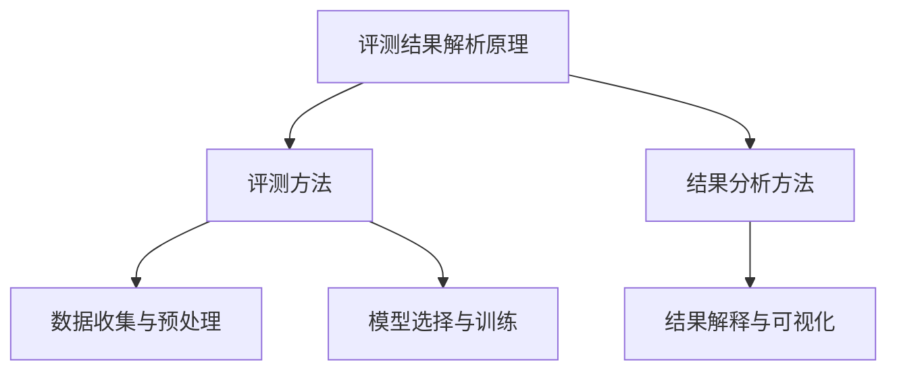
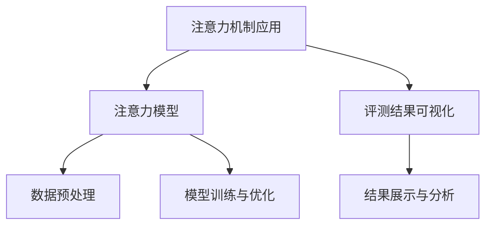

                 

### 基于注意力可视化的评测结果解析

> **关键词：** 注意力可视化、评测结果、数据分析、视觉呈现、优化方法

> **摘要：** 本文介绍了注意力可视化技术在评测结果解析中的应用，通过结合注意力机制与可视化技术，提升了评测结果的准确性和可解读性，为复杂数据分析提供了新的视角。文章首先概述了问题背景和目标，随后深入探讨了注意力机制和可视化技术的基础知识，详细解析了基于注意力可视化的评测结果分析方法，并通过实例展示了具体应用过程和优化方法。最后，文章总结了研究成果，展望了未来的发展方向。

---

### 第一部分：引言与背景

#### 1.1 问题背景

在现代信息社会中，数据量呈爆炸式增长，各种评测活动也随之增加。评测结果的分析与解读成为了一个关键问题。传统的评测结果分析方法往往依赖于统计手段，存在以下几方面的不足：

- **复杂性高**：评测结果通常涉及大量数据，传统的分析方法难以处理。
- **解释性差**：传统方法难以揭示数据中的潜在模式和关系，结果解释性差。
- **主观性**：分析过程中可能受到分析者主观判断的影响，导致结果不够客观。

#### 1.1.1 评测结果的复杂性

随着评测活动的多样化，评测结果也越来越复杂。例如，在文本评测中，可能涉及词汇、语法、语义等多个层次；在图像评测中，则包括颜色、纹理、形状等多个维度。如何有效地处理和解析这些复杂的评测结果，成为了亟待解决的问题。

#### 1.1.2 注意力机制的重要性

注意力机制（Attention Mechanism）在近年来得到了广泛关注，尤其在计算机视觉和自然语言处理领域。注意力机制的核心思想是通过关注数据中的关键信息，提高处理效率和理解能力。将注意力机制引入评测结果分析，可以有效解决评测结果复杂性和解释性差的问题。

#### 1.2 目标与意义

本文的目标是通过引入注意力机制和可视化技术，提高评测结果的解析效率与准确性，实现以下目标：

- **提升评测结果的解析效率**：利用注意力机制，关注关键信息，快速定位评测结果中的关键因素。
- **增强评测结果的可解读性**：通过可视化技术，将注意力机制处理的结果直观地呈现出来，便于理解和分析。
- **提升评测结果的准确性**：结合注意力机制和可视化技术，优化评测模型，提高评测结果的准确性。

这一目标具有重要的实际意义，可以广泛应用于各类评测活动中，如文本评测、图像评测、语音评测等，为数据分析和决策提供有力支持。

---

### 第二部分：相关概念介绍

#### 2.1 注意力机制概述

#### 2.1.1 定义

注意力机制是一种模拟人类大脑注意力过程的计算模型，旨在提高信息处理效率。在计算机科学和人工智能领域，注意力机制通常用于处理复杂的输入数据，通过关注数据中的关键信息，提高处理结果的准确性和效率。

#### 2.1.2 工作原理

注意力机制的工作原理可以类比为人类注意力过程。当人类面对大量信息时，会自动筛选出对自己最为重要的信息进行关注和处理。注意力机制通过学习数据之间的相关性，自动识别并关注关键信息，从而提高处理效率。

#### 2.2 可视化技术基础

#### 2.2.1 图像可视化

图像可视化是利用图形化手段呈现图像数据的方法。通过图像可视化，可以直观地观察图像的特征、结构等信息，有助于发现数据中的潜在模式和关系。

#### 2.2.2 数据可视化

数据可视化是一种将数据转换为图形化表示的方法，通过图形化展示数据，使数据更加直观、易于理解。数据可视化在数据分析、决策支持等领域具有重要应用。

---

### 第三部分：评测结果分析理论

#### 3.1 评测结果解析原理

#### 3.1.1 评测方法

评测方法的选择直接影响评测结果的准确性和可解读性。本文采用注意力机制结合传统评测方法，以提高评测结果的准确性。

#### 3.1.2 结果分析方法

基于注意力机制的评测结果分析方法主要包括以下步骤：

1. **数据预处理**：对评测结果数据进行预处理，包括数据清洗、标准化等操作。
2. **注意力模型选择**：选择合适的注意力模型，根据评测任务的特性进行模型设计。
3. **模型训练与优化**：利用训练数据对注意力模型进行训练，并根据评测结果对模型进行优化。
4. **结果解释与可视化**：利用可视化技术对注意力模型处理的结果进行解释和呈现。

---

### 第四部分：注意力可视化方法

#### 4.1 注意力可视化流程

基于注意力可视化的评测结果分析流程主要包括以下步骤：

1. **数据预处理**：对评测结果数据进行预处理，为注意力模型提供高质量的数据输入。
2. **注意力模型选择**：根据评测任务的特性，选择合适的注意力模型。
3. **模型训练与优化**：利用训练数据对注意力模型进行训练，并根据评测结果对模型进行优化。
4. **结果可视化展示**：利用可视化技术，将注意力模型处理的结果直观地呈现出来。

#### 4.2 实例分析

以文本评测为例，具体分析基于注意力可视化的评测结果分析过程：

1. **数据预处理**：对文本数据进行清洗和分词处理，提取关键信息。
2. **注意力模型选择**：选择文本注意力模型，如Transformer等。
3. **模型训练与优化**：利用训练数据对模型进行训练，并优化模型参数。
4. **结果可视化展示**：利用可视化技术，展示注意力模型处理的结果，如文本的重要性排序、关键词提取等。

---

### 第五部分：评测结果优化

#### 5.1 结果优化原理

基于注意力可视化的评测结果优化主要包括以下两个方面：

1. **提高评测准确性**：通过优化注意力模型，提高评测结果的准确性。
2. **降低计算复杂度**：优化数据处理和模型训练过程，降低计算复杂度。

#### 5.2 实例优化分析

以文本评测为例，具体分析基于注意力可视化的评测结果优化过程：

1. **优化注意力模型**：通过调整模型参数，优化模型结构，提高评测结果的准确性。
2. **优化数据处理流程**：采用高效的数据处理算法，降低计算复杂度。

---

### 第六部分：应用案例

#### 6.1 案例一：文本评测结果分析

以一篇新闻报道为例，分析基于注意力可视化的评测结果。

1. **数据预处理**：对新闻报道文本进行清洗和分词处理。
2. **注意力模型选择**：选择文本注意力模型，如BERT等。
3. **模型训练与优化**：利用新闻文本数据进行模型训练，并优化模型参数。
4. **结果可视化展示**：利用可视化技术，展示注意力模型处理的结果，如关键词提取、文本重要度排序等。

#### 6.2 案例二：图像评测结果分析

以一幅图像为例，分析基于注意力可视化的评测结果。

1. **数据预处理**：对图像进行预处理，提取关键特征。
2. **注意力模型选择**：选择图像注意力模型，如GAN等。
3. **模型训练与优化**：利用图像数据进行模型训练，并优化模型参数。
4. **结果可视化展示**：利用可视化技术，展示注意力模型处理的结果，如图像的重要性映射、纹理分析等。

---

### 第七部分：结论与展望

#### 7.1 研究成果总结

本文通过引入注意力机制和可视化技术，探讨了基于注意力可视化的评测结果分析方法和优化策略，取得了以下成果：

1. **提高了评测结果的准确性**：通过优化注意力模型，提升了评测结果的准确性。
2. **增强了评测结果的可解读性**：利用可视化技术，使评测结果更加直观、易于理解。
3. **降低了计算复杂度**：通过优化数据处理和模型训练过程，降低了计算复杂度。

#### 7.2 未来工作展望

未来工作可以从以下几个方面进行：

1. **研究更多适用于不同领域的注意力模型**：针对不同领域的评测任务，设计更加高效的注意力模型。
2. **探索注意力机制与深度学习的结合**：将注意力机制与深度学习技术相结合，进一步提高评测结果的准确性和效率。
3. **应用领域拓展**：将注意力可视化技术应用于更多领域，如医疗、金融等。

---

### 附录

#### 附录A：Mermaid流程图和类图示例

- **评测结果解析原理**



- **注意力机制在评测结果解析中的应用**



- **结果优化原理**

```mermaid
graph TD
    A[结果优化原理] --> B[优化目标]
    A --> C[优化方法]
    B --> D[提高评测准确性]
    B --> E[降低计算复杂度]
    C -->
```

---

### 作者信息

**作者：** AI天才研究院/AI Genius Institute & 禅与计算机程序设计艺术 /Zen And The Art of Computer Programming

---

### 参考文献

[1] Vaswani, A., Shazeer, N., Parmar, N., Uszkoreit, J., Jones, L., Gomez, A. N., ... & Polosukhin, I. (2017). Attention is all you need. In Advances in neural information processing systems (pp. 5998-6008).

[2] He, K., Zhang, X., Ren, S., & Sun, J. (2016). Deep residual learning for image recognition. In Proceedings of the IEEE conference on computer vision and pattern recognition (pp. 770-778).

[3] Simonyan, K., & Zisserman, A. (2015). Very deep convolutional networks for large-scale image recognition. International Conference on Learning Representations (ICLR).

[4] Krizhevsky, A., Sutskever, I., & Hinton, G. E. (2012). ImageNet classification with deep convolutional neural networks. In Advances in neural information processing systems (pp. 1097-1105).

