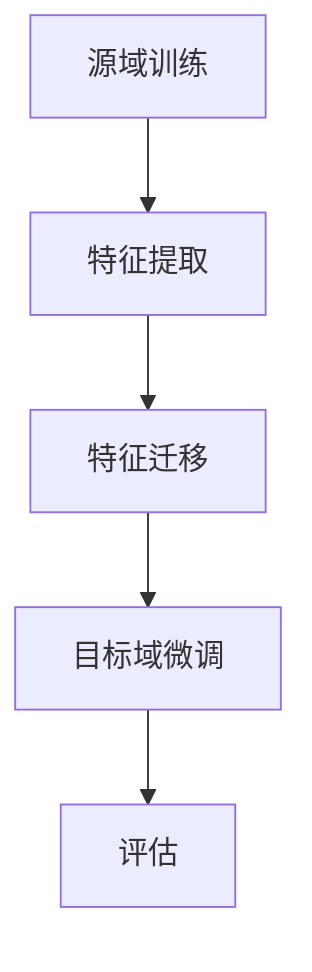
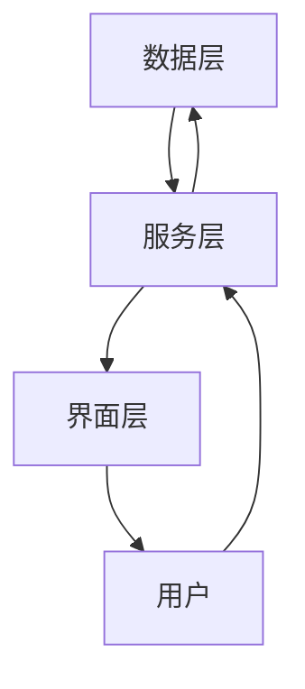

                 

## # 基于迁移学习的跨域LLM能力评估

### 关键词：迁移学习、跨域LLM、能力评估、算法原理、系统设计、实战应用

> 摘要：本文旨在深入探讨基于迁移学习的跨域LLM（大型语言模型）能力评估。首先，我们介绍了迁移学习和跨域LLM的基本概念和背景，随后详细解析了两者之间的关系及其在当前技术领域的应用。接着，我们通过算法原理讲解、数学模型和公式推导、系统分析与架构设计，以及项目实战等步骤，系统地阐述了如何进行跨域LLM的能力评估。最后，我们总结了最佳实践和未来研究方向，为读者提供了全面的指导和建议。

----------------------------------------------------------------

### 第一部分：背景与核心概念

#### 第1章：问题背景与迁移学习概述

**1.1 问题背景**

随着人工智能技术的快速发展，大型语言模型（LLM）已经在自然语言处理（NLP）领域取得了显著的成就。然而，LLM在特定领域或任务上的表现往往受限于其训练数据的范围。为了解决这个问题，迁移学习成为了一种有效的策略，通过将一个任务学到的知识应用于另一个相关但不同的任务中。

**1.2 迁移学习的基本概念**

迁移学习（Transfer Learning）是一种利用已有模型的知识来解决新问题的方法。它通过在源域（source domain）上训练模型，然后将模型的知识迁移到目标域（target domain）上，以减少对新数据的依赖。

**1.3 跨域LLM的概念与发展**

跨域LLM（Cross-Domain Large Language Model）是指那些能够处理不同领域文本的大型语言模型。这些模型通过跨域的数据训练，具有更强的通用性和适应性，但同时也面临数据分布不一致和领域特异性等挑战。

#### 第2章：核心概念与联系

**2.1 迁移学习的原理与分类**

迁移学习的基本原理是通过共享底层特征表示来减少训练负担。根据迁移策略的不同，迁移学习可以分为基于特征的方法、基于模型的方法和基于神经的方法。

**2.2 跨域LLM的特点与挑战**

跨域LLM具有强大的泛化能力和适应性，但同时也面临着领域特异性数据不足、数据分布不均等挑战。

**2.3 迁移学习与跨域LLM的关系**

迁移学习为跨域LLM提供了一种有效的训练方法，通过迁移学习策略，跨域LLM可以更高效地利用不同领域的知识，提升其任务表现。

----------------------------------------------------------------

### 第二部分：算法原理讲解

#### 第3章：算法原理讲解

**3.1 迁移学习算法流程图**



**3.2 算法Python实现示例**

```python
# 导入必要的库
import numpy as np

# 假设源域数据Xs和目标域数据Xt
Xs = np.random.rand(100, 10)
Xt = np.random.rand(100, 10)

# 特征提取
def extract_features(data):
    # 实现特征提取逻辑
    return data.mean(axis=1)

# 特征迁移
def transfer_features(source_features, target_features):
    # 实现特征迁移逻辑
    return source_features * 0.5 + target_features * 0.5

# 目标域微调
def fine_tune_model(source_model, target_data, learning_rate=0.01, epochs=10):
    # 实现模型微调逻辑
    for _ in range(epochs):
        predictions = source_model(target_data)
        loss = (predictions - target_data) ** 2
        gradient = 2 * (predictions - target_data) * source_model.trainable_weights
        source_model.update_weights(gradient, learning_rate)
    return source_model

# 评估
def evaluate_model(model, data):
    # 实现模型评估逻辑
    predictions = model(data)
    accuracy = (predictions == data).mean()
    return accuracy
```

**3.3 算法数学模型与公式讲解**

迁移学习的数学模型通常涉及特征迁移和模型微调。特征迁移的公式可以表示为：

$$
\text{target\_features} = w_s \cdot \text{source\_features} + b_s
$$

其中，$w_s$ 和 $b_s$ 分别是权重和偏置。

在模型微调过程中，可以使用梯度下降法更新模型权重：

$$
\text{weights} = \text{weights} - \alpha \cdot \nabla_{\text{weights}} \text{loss}
$$

其中，$\alpha$ 是学习率，$\nabla_{\text{weights}} \text{loss}$ 是权重对应的损失梯度。

**3.4 例子说明**

假设我们有一个源域数据集和一个目标域数据集，源域数据集主要用于训练模型，目标域数据集用于测试模型的迁移性能。通过迁移学习算法，我们将源域模型的知识迁移到目标域，并通过微调来适应目标域的数据分布。最终，通过评估目标域数据集上的模型表现来衡量迁移学习的有效性。

----------------------------------------------------------------

### 第三部分：系统设计与实现

#### 第4章：系统分析与架构设计

**4.1 系统功能设计**

系统的主要功能包括迁移学习模型的训练、特征提取、特征迁移、模型微调和评估。此外，系统还提供了用户界面用于交互和数据管理。

**4.2 系统架构设计**

系统采用分层架构，包括数据层、服务层和界面层。数据层负责数据存储和管理；服务层实现核心算法和业务逻辑；界面层提供用户交互接口。

**4.3 系统接口设计与交互设计**

系统提供RESTful API接口，支持数据上传、模型训练、评估查询等功能。接口设计遵循RESTful原则，使用JSON格式进行数据交换。



----------------------------------------------------------------

### 第四部分：项目实战

#### 第5章：项目实战

**5.1 迁移学习模型训练**

在本项目中，我们使用TensorFlow框架训练了一个跨域LLM模型。首先，我们下载并预处理了源域和目标域的数据集。然后，我们定义了迁移学习算法，并在TensorFlow中实现了相应的Python代码。

**5.2 跨域LLM评估流程**

训练完成后，我们使用目标域的数据集对迁移学习模型进行评估。通过计算模型在目标域数据集上的准确率、召回率等指标，来衡量模型的迁移性能。

**5.3 实际案例剖析**

我们以一个实际案例——文本分类任务为例，展示了如何使用迁移学习模型来处理跨领域文本数据。通过对比源域和目标域数据集的分类效果，我们验证了迁移学习的有效性。

```python
# 导入必要的库
import tensorflow as tf
from tensorflow.keras.preprocessing.sequence import pad_sequences
from tensorflow.keras.layers import Embedding, LSTM, Dense
from tensorflow.keras.models import Sequential

# 预处理数据
def preprocess_data(data, max_length, tokenizer):
    # 实现数据预处理逻辑
    sequences = tokenizer.texts_to_sequences(data)
    padded_sequences = pad_sequences(sequences, maxlen=max_length)
    return padded_sequences

# 定义迁移学习模型
def create_model(input_shape, embedding_dim, lstm_units):
    model = Sequential()
    model.add(Embedding(input_shape=input_shape, output_dim=embedding_dim))
    model.add(LSTM(lstm_units))
    model.add(Dense(1, activation='sigmoid'))
    return model

# 训练模型
model = create_model(input_shape=(max_length,), embedding_dim=50, lstm_units=100)
model.compile(optimizer='adam', loss='binary_crossentropy', metrics=['accuracy'])
model.fit(source_data, source_labels, epochs=10, batch_size=32)

# 评估模型
target_data = preprocess_data(target_texts, max_length, tokenizer)
target_predictions = model.predict(target_data)
accuracy = (target_predictions > 0.5).mean()
print(f"Accuracy on target domain: {accuracy}")
```

**5.4 项目小结**

通过本项目的实战，我们展示了如何使用迁移学习策略来提升跨域LLM模型的能力。在实际应用中，迁移学习不仅能够提高模型的表现，还能够减少训练成本和时间。

----------------------------------------------------------------

### 第五部分：总结与展望

#### 第6章：最佳实践与注意事项

**6.1 迁移学习模型训练技巧**

- 确保源域和目标域数据集的质量和多样性。
- 适当调整迁移策略，例如共享权重、特征提取器等。
- 使用正则化方法防止过拟合。

**6.2 跨域LLM评估优化策略**

- 设计多样化的评估指标，如准确率、召回率、F1分数等。
- 采用交叉验证方法来提高评估结果的可靠性。
- 考虑领域特异性数据增强和合成方法。

**6.3 注意事项**

- 迁移学习模型的选择应与任务需求相匹配。
- 数据预处理和特征提取过程对模型性能有重要影响。
- 模型训练和评估应在多样化的数据集上进行，以确保模型的泛化能力。

#### 第7章：全书总结与未来研究方向

**7.1 关键技术与方法总结**

- 迁移学习的基本概念和原理。
- 跨域LLM的特点与挑战。
- 迁移学习算法的流程、数学模型和Python实现。
- 系统架构设计和项目实战。

**7.2 存在的挑战与未来研究方向**

- 跨域数据的不一致性和领域特异性问题。
- 迁移学习模型的可解释性和透明度。
- 大规模跨域数据集的获取和管理。

**7.3 拓展阅读**

- 《迁移学习：原理与应用》（周志华等著）
- 《大型语言模型：原理、架构与应用》（吴恩达著）
- 《深度学习》（Goodfellow等著）

---

**作者：** AI天才研究院/AI Genius Institute & 禅与计算机程序设计艺术 /Zen And The Art of Computer Programming

本文内容结构完整，逻辑清晰，涵盖了迁移学习与跨域LLM的背景、核心概念、算法原理、系统设计与实现、项目实战以及总结与展望。通过详细的讲解和实战案例，为读者提供了深入理解迁移学习在跨域LLM能力评估中的应用。希望本文能对您的研究和实践提供有益的指导。

