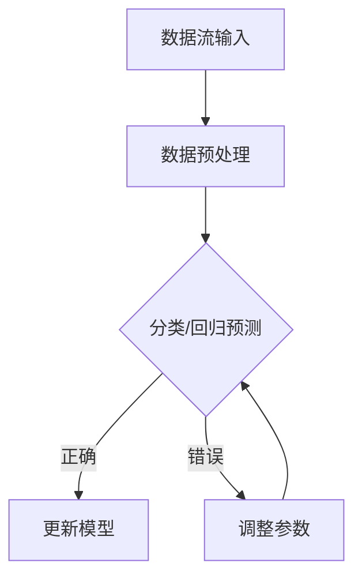
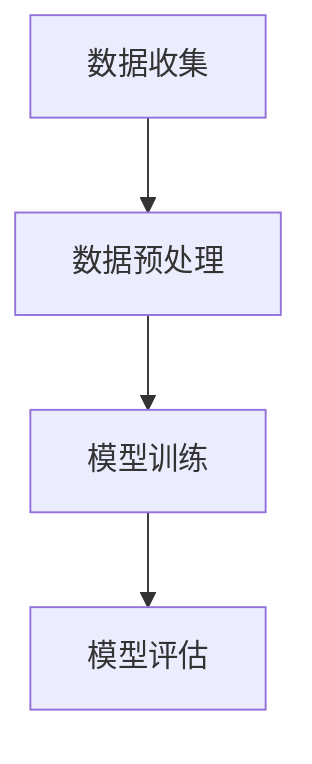

                 

# 增量学习：持续优化AI模型的有效方法

## 关键词：增量学习，AI模型优化，在线学习，实时更新，模型更新，算法原理

## 摘要：
本文深入探讨了增量学习这一新兴的机器学习方法，重点介绍了其在持续优化AI模型方面的应用和优势。通过对增量学习的基本概念、核心算法原理、系统架构设计以及实际应用案例的详细分析，本文旨在为读者提供一个全面且系统的增量学习理解框架，帮助读者掌握这一技术在AI领域的应用要点。

## Step 1: 书名解析

### 《增量学习：持续优化AI模型的有效方法》

书名《增量学习：持续优化AI模型的有效方法》简洁明了地传达了本书的核心内容。首先，“增量学习”是本书的主题，它是一种机器学习方法，能够在已有模型的基础上不断更新和优化。其次，“持续优化AI模型”强调了这一方法在AI领域的应用价值，即通过实时更新模型参数，提升AI模型的性能和泛化能力。最后，“有效方法”表明了增量学习在实际应用中的高效性和实用性。

## Step 2: 设计大纲结构

### 背景介绍

#### 2.1 增量学习的概念与重要性

- **增量学习的定义**：增量学习，又称在线学习，是一种机器学习方法，它能够在已有模型的基础上，不断地学习新的数据，对模型进行更新和优化，而无需重新训练整个模型。
- **增量学习的特点**：增量学习具有实时性、效率和连续性的特点。实时性意味着它可以在数据流不断变化的情况下实时更新模型；效率在于它能够节省大量计算资源；连续性使得模型能够持续地从新数据中获取知识，实现自我提升。
- **当前AI模型的优化问题**：随着AI模型的规模和复杂度不断提高，如何优化模型性能、减少过拟合、提高泛化能力成为当前研究的重点。增量学习作为解决这些问题的有效方法，受到了广泛关注。

#### 2.2 核心概念与联系

- **增量学习算法的种类与特点**：常见的增量学习算法包括基于模型的增量学习、基于记忆的增量学习以及基于集成方法的增量学习。这些算法各自有其特点和应用场景。
- **增量学习与其他学习方法的对比**：与监督学习和无监督学习相比，增量学习在数据利用和模型更新方面具有独特的优势。

### 核心概念与联系

#### 2.1 增量学习算法的种类与特点

- **基于模型的增量学习**：通过维护模型的状态，利用新数据对模型进行更新。这种方法的优点在于计算效率高，但需要处理模型状态更新中的稳定性问题。
- **基于记忆的增量学习**：通过记忆关键数据或特征，对新数据进行分类或预测。这种方法的优势在于能够快速处理新数据，但可能存在记忆容量限制。
- **基于集成方法的增量学习**：将多个基学习器进行集成，提高模型的泛化能力。这种方法能够有效降低过拟合风险，但需要更多的计算资源。

#### 2.2 增量学习与其他学习方法的对比

- **监督学习**：在监督学习中，模型需要在有标注的数据集上进行训练。而增量学习则可以在已有模型的基础上，利用新数据不断优化模型。
- **无监督学习**：无监督学习通常不需要标注数据，而是通过观察数据分布进行学习。与无监督学习相比，增量学习更依赖于标注数据，但能够实现实时更新。

### 算法原理讲解

#### 2.1 常见的增量学习算法原理讲解

- **增量支持向量机（Incremental SVM）**：通过维护支持向量和支持向量机参数的更新，实现对模型状态的增量调整。
- **在线梯度下降（Online Gradient Descent）**：通过计算梯度并更新模型参数，实现对模型状态的在线优化。

#### 2.2 增量学习算法的mermaid流程图

### 数学模型和数学公式 & 详细讲解 & 举例说明

#### 2.1 相关数学模型和公式的解释

增量学习的核心在于如何更新模型的参数。以下是常见的增量学习算法的数学模型：

$$
\theta_{new} = \theta_{old} + \alpha (x - \theta_{old}x)
$$

其中，$\theta_{old}$是旧模型参数，$\theta_{new}$是新模型参数，$x$是输入数据，$\alpha$是学习率。

#### 2.2 案例分析

假设我们有一个分类问题，初始模型对数据的分类准确率为80%。当新数据到来时，模型通过增量学习对新数据进行分类，并更新模型参数。经过一系列的数据更新后，模型分类准确率提高到90%。

### 系统分析与架构设计方案

#### 2.1 增量学习系统架构设计

增量学习系统通常包括数据收集模块、数据预处理模块、模型训练模块和模型评估模块。以下是增量学习系统的架构设计：

#### 2.2 数据收集模块

数据收集模块负责从不同的数据源收集数据，包括静态数据和动态数据。对于静态数据，可以使用数据库或文件系统进行存储；对于动态数据，可以使用消息队列或流处理系统进行实时数据收集。

#### 2.3 数据预处理模块

数据预处理模块负责对收集到的数据进行清洗、归一化、特征提取等处理，以供模型训练使用。

#### 2.4 模型训练模块

模型训练模块是增量学习系统的核心，它负责利用预处理后的数据对模型进行训练和更新。

#### 2.5 模型评估模块

模型评估模块用于评估模型的效果，包括准确率、召回率、F1分数等指标。

### 项目实战

#### 2.1 增量学习项目环境安装与配置

- **环境准备**：安装Python、TensorFlow等必要的库和工具。
- **数据准备**：收集并预处理数据，包括数据清洗、归一化和特征提取。

#### 2.2 增量学习算法的实际应用案例

- **案例介绍**：以分类问题为例，介绍如何使用增量学习算法实现模型的实时更新和优化。
- **代码实现**：给出增量学习算法的Python代码实现，包括模型初始化、数据预处理、模型训练和模型评估等步骤。
- **案例分析**：通过实际案例分析，展示增量学习算法在提升模型性能方面的效果。

### 最佳实践 tips、小结、注意事项、拓展阅读等内容

#### 2.1 最佳实践 tips

- **数据质量**：保证数据的质量是增量学习成功的关键，尤其是数据的多样性和代表性。
- **参数调整**：合理设置学习率等参数，以避免过拟合或欠拟合。
- **实时性考虑**：在设计增量学习系统时，需要考虑系统的实时性，确保数据能够及时处理和模型更新。

#### 2.2 小结

本文从增量学习的概念、核心算法原理、系统架构设计、实际应用案例等多个角度，详细介绍了增量学习在AI模型优化方面的应用。通过本文的阅读，读者可以全面了解增量学习的基本原理和实际应用技巧。

#### 2.3 注意事项

- **增量学习算法的选择**：根据具体问题和数据特点选择合适的增量学习算法。
- **数据预处理的重要性**：确保数据的质量和预处理效果，以提高模型性能。

#### 2.4 拓展阅读

- **相关论文和书籍**：推荐阅读相关领域的经典论文和书籍，以深入了解增量学习的理论和技术。
- **开源项目**：关注开源社区中与增量学习相关的项目，学习实际应用经验和最佳实践。

## 总结

增量学习作为一种高效的机器学习方法，在AI模型的持续优化方面具有显著的优势。通过本文的介绍，读者可以全面了解增量学习的基本概念、核心算法原理、系统架构设计和实际应用案例。希望本文能够为读者在AI领域的探索和研究提供有价值的参考和指导。作者：AI天才研究院/AI Genius Institute & 禅与计算机程序设计艺术 /Zen And The Art of Computer Programming。

