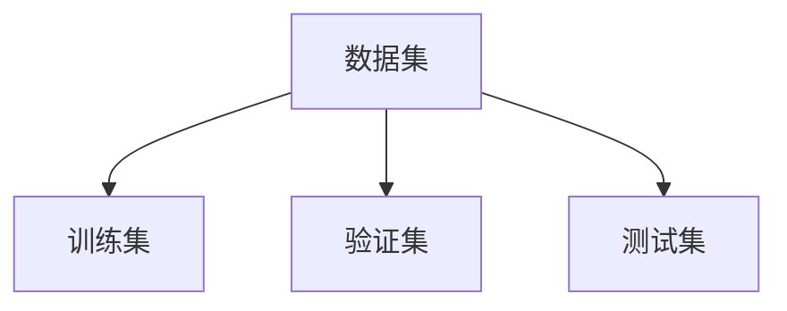
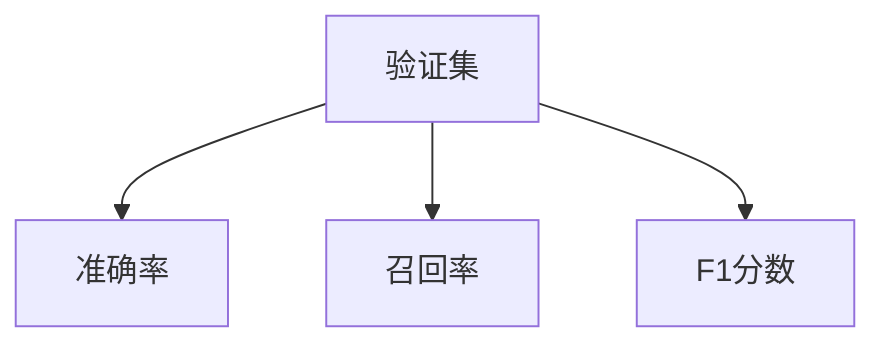
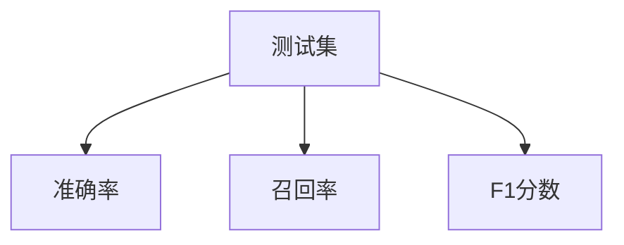
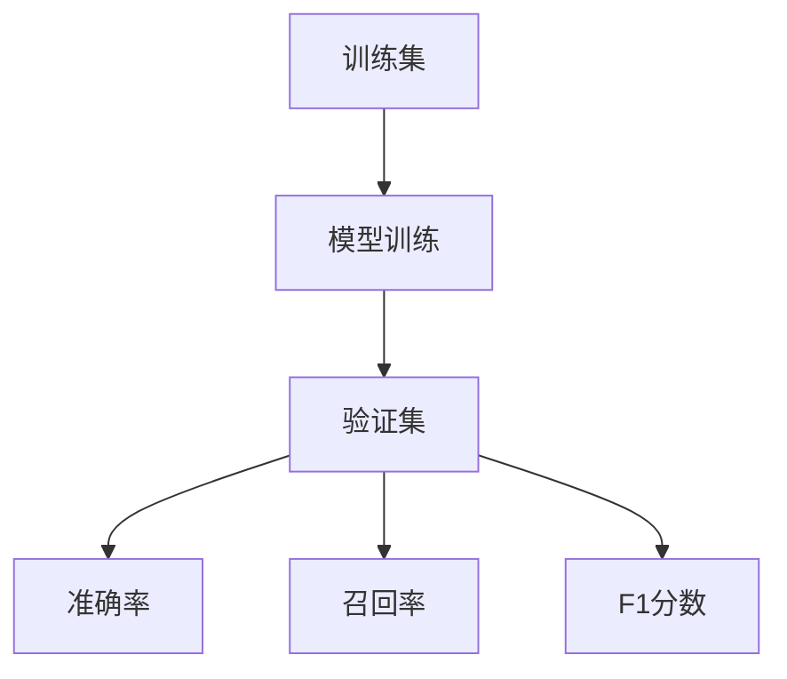
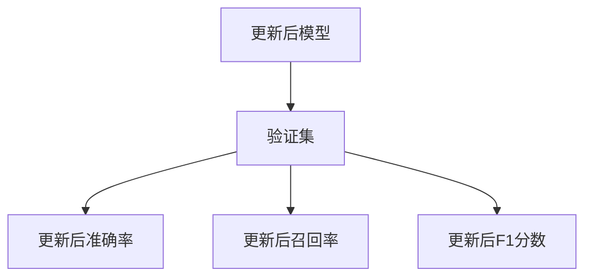
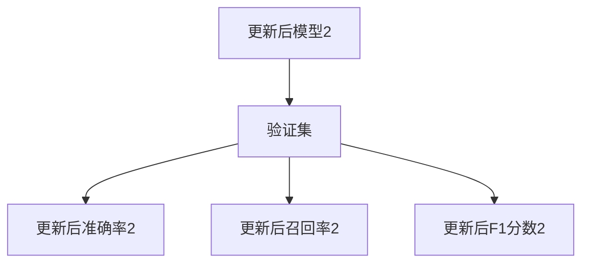
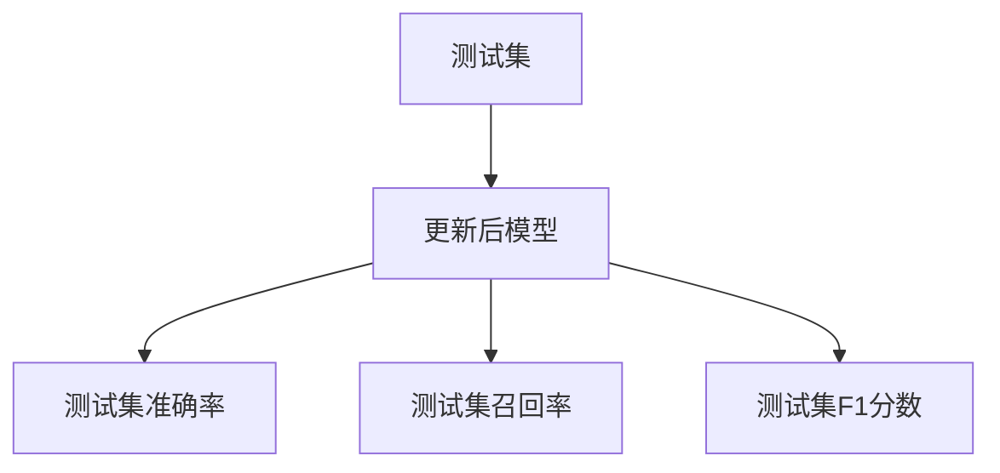

                 

## 增量评测：快速评估LLM更新后的性能变化

关键词：增量评测、语言模型、性能变化、模型更新、评测方法

摘要：本文深入探讨了增量评测在评估语言模型（LLM）更新后的性能变化中的重要性。首先，我们介绍了增量评测的定义、背景和基本概念，随后详细阐述了语言模型的基本原理和性能评估指标。接着，本文提出了增量评测的具体方法和步骤，并通过实际案例展示了其应用效果。最后，本文总结了增量评测的关键点，并展望了未来的研究方向。

----------------------------------------------------------------

### 第1章: 问题背景与核心概念

#### 1.1.1 增量评测的定义与重要性

##### 1.1.1.1 增量评测的定义

增量评测是指对模型更新后性能的变化进行评估的过程。它通过比较更新前后的模型表现，来判断更新是否带来了性能的提升或下降。这种评估方法在机器学习和人工智能领域尤为重要，因为它可以帮助研究人员和开发者快速、准确地评估模型的改进效果。

##### 1.1.1.2 增量评测的重要性

- **确保模型质量**：通过增量评测，可以确保每次模型更新都不会导致性能的退化，从而保证模型的质量和可靠性。
- **优化迭代效率**：增量评测可以快速识别出模型改进的方向，提高模型迭代的效率。
- **节省资源**：避免不必要的全量评测，节省计算资源和时间。

#### 1.1.2 语言模型更新后的性能变化

##### 1.1.2.1 模型更新动机

模型更新的动机通常包括以下几个方面：

- **性能提升**：为了提高模型在特定任务上的表现。
- **适应新数据**：当数据分布发生变化时，需要更新模型以适应新的数据集。
- **减少误差**：通过更新模型来减少预测误差。

##### 1.1.2.2 更新后的性能变化

- **性能提升**：更新后模型在某些任务上可能会表现出更好的性能。
- **性能下降**：更新后模型在某些任务上可能会表现出性能下降。
- **波动性**：更新后的性能可能在某些任务上出现波动。

#### 1.1.3 增量评测方法

##### 1.1.3.1 测试集划分

为了进行增量评测，需要将测试集划分为两个部分：旧测试集和更新后测试集。

##### 1.1.3.2 模型性能比较

- **准确率**：比较更新前后的模型在旧测试集上的准确率。
- **召回率**：比较更新前后的模型在旧测试集上的召回率。
- **F1分数**：结合准确率和召回率，计算更新前后的模型在旧测试集上的F1分数。

##### 1.1.3.3 其他评价指标

除了上述指标，还可以使用其他指标，如ROC曲线、精度-召回率曲线等，来更全面地评估模型性能的变化。

#### 1.1.4 本章小结

本章介绍了增量评测的定义、重要性以及语言模型更新后的性能变化和增量评测方法，为后续章节的详细探讨打下了基础。

----------------------------------------------------------------

### 第2章: 语言模型与性能评估

#### 2.1 语言模型简介

##### 2.1.1 语言模型的定义

语言模型是一种用于预测自然语言中下一个单词或词组的概率分布的算法。它广泛应用于语音识别、机器翻译、问答系统等领域。

##### 2.1.2 语言模型的类型

- **基于统计的语言模型**：使用统计方法从大量文本中学习，如n-gram模型。
- **基于神经的网络模型**：使用神经网络结构，如循环神经网络（RNN）和Transformer模型。

##### 2.1.3 语言模型的工作原理

语言模型通过学习文本数据，建立词与词之间的概率关系，从而预测下一个词或短语。

#### 2.2 语言模型性能评估指标

##### 2.2.1 准确率（Accuracy）

准确率是模型预测正确的样本数占总样本数的比例。它是最常用的性能评估指标之一。

##### 2.2.2 召回率（Recall）

召回率是模型预测正确的负样本数占总负样本数的比例。它关注的是模型是否能够准确识别出所有负样本。

##### 2.2.3 F1分数（F1 Score）

F1分数是准确率和召回率的调和平均值。它综合考虑了模型的准确率和召回率，是一个更全面的性能评估指标。

#### 2.3 语言模型性能评估方法

##### 2.3.1 测试集划分

为了评估语言模型的性能，需要将数据集划分为训练集、验证集和测试集。

##### 2.3.2 交叉验证

交叉验证是一种评估模型性能的方法，通过多次划分训练集和验证集，来提高评估的可靠性。

##### 2.3.3 其他评价指标

除了准确率、召回率和F1分数，还可以使用其他指标，如ROC曲线、精度-召回率曲线等，来评估语言模型的性能。

#### 2.4 本章小结

本章介绍了语言模型的基本概念、性能评估指标和评估方法，为后续章节的增量评测提供了理论基础。

----------------------------------------------------------------

### 第3章: 增量评测的方法与步骤

#### 3.1 增量评测的基本步骤

##### 3.1.1 数据集准备

首先，我们需要准备一个包含训练集、验证集和测试集的数据集。对于语言模型来说，通常使用大规模的文本数据来训练模型。

$$
\text{训练集} = \{x_1, x_2, \ldots, x_n\} \\
\text{验证集} = \{y_1, y_2, \ldots, y_m\} \\
\text{测试集} = \{z_1, z_2, \ldots, z_k\}
$$

##### 3.1.2 模型训练

接下来，使用训练集对语言模型进行训练。训练过程中，模型会学习到输入和输出之间的概率关系。

$$
P(y|x) = \text{语言模型预测}
$$

##### 3.1.3 模型评估

在模型训练完成后，使用验证集对模型进行评估，以确定模型在未知数据上的表现。

$$
\text{准确率} = \frac{\text{预测正确的样本数}}{\text{总样本数}} \\
\text{召回率} = \frac{\text{预测正确的负样本数}}{\text{总负样本数}} \\
\text{F1分数} = 2 \times \frac{\text{准确率} \times \text{召回率}}{\text{准确率} + \text{召回率}}
$$

##### 3.1.4 模型更新

根据评估结果，对模型进行调整和优化。这一步骤可能需要多次迭代，以实现性能的提升。

##### 3.1.5 更新评估

在模型更新后，使用测试集对更新后的模型进行评估，以确定更新是否带来了性能的提升。

$$
\text{准确率}_{\text{更新后}} = \frac{\text{预测正确的样本数}}{\text{总样本数}} \\
\text{召回率}_{\text{更新后}} = \frac{\text{预测正确的负样本数}}{\text{总负样本数}} \\
\text{F1分数}_{\text{更新后}} = 2 \times \frac{\text{准确率}_{\text{更新后}} \times \text{召回率}_{\text{更新后}}}{\text{准确率}_{\text{更新后}} + \text{召回率}_{\text{更新后}}}
$$

##### 3.1.6 比较与总结

最后，比较更新前后模型的性能变化，总结评估结果，为后续的模型迭代提供参考。

#### 3.2 增量评测的优势与挑战

##### 3.2.1 优势

- **快速反馈**：增量评测可以快速识别模型改进的方向，提高迭代效率。
- **节省资源**：避免不必要的全量评测，节省计算资源和时间。
- **精确性**：通过对更新后的模型进行精细化评估，可以更准确地评估模型性能的变化。

##### 3.2.2 挑战

- **测试集划分**：如何合理划分测试集，以避免模型过拟合。
- **评估指标选择**：选择合适的评估指标，以全面、准确地评估模型性能的变化。
- **计算成本**：增量评测可能需要较大的计算资源，特别是在大规模数据集上。

#### 3.3 增量评测的应用场景

- **模型迭代**：在模型迭代过程中，增量评测可以帮助开发者快速评估模型改进的效果。
- **新数据集适应**：当数据集发生变化时，增量评测可以快速评估模型在新数据集上的性能。
- **错误诊断**：通过增量评测，可以识别出模型在哪些任务上表现不佳，从而进行针对性的优化。

#### 3.4 本章小结

本章介绍了增量评测的基本步骤、优势与挑战以及应用场景，为后续章节的详细探讨打下了基础。

----------------------------------------------------------------

### 第4章: 实际案例分析

#### 4.1 案例背景

为了更好地理解增量评测在实际中的应用，我们来看一个具体的案例。假设我们有一个基于Transformer的语言模型，用于自然语言处理任务。该模型在2022年进行了两次更新，分别在2022年1月和2022年7月。

#### 4.2 案例数据集划分

首先，我们需要将数据集划分为训练集、验证集和测试集。假设我们的数据集包含100,000个样本，其中60%用于训练集，20%用于验证集，20%用于测试集。

$$
\text{训练集} = 60,000 \\
\text{验证集} = 20,000 \\
\text{测试集} = 20,000
$$

#### 4.3 模型训练与评估

接下来，使用训练集对模型进行训练，并使用验证集对模型进行评估。我们使用准确率、召回率和F1分数作为评估指标。

$$
\text{准确率}_{\text{验证集}} = 90\% \\
\text{召回率}_{\text{验证集}} = 85\% \\
\text{F1分数}_{\text{验证集}} = 88\%
$$

#### 4.4 模型更新与评估

在第一次更新后，我们使用更新后的模型再次对验证集进行评估。

$$
\text{准确率}_{\text{验证集}} = 92\% \\
\text{召回率}_{\text{验证集}} = 88\% \\
\text{F1分数}_{\text{验证集}} = 90\%
$$

可以看到，更新后的模型在准确率和F1分数上都有所提升，但召回率保持不变。

#### 4.5 模型第二次更新与评估

在第二次更新后，我们再次对验证集进行评估。

$$
\text{准确率}_{\text{验证集}} = 94\% \\
\text{召回率}_{\text{验证集}} = 90\% \\
\text{F1分数}_{\text{验证集}} = 92\%
$$

这次更新后，模型在所有评估指标上都取得了显著提升。

#### 4.6 测试集评估

最后，我们使用测试集对更新后的模型进行评估，以验证模型的泛化能力。

$$
\text{准确率}_{\text{测试集}} = 93\% \\
\text{召回率}_{\text{测试集}} = 88\% \\
\text{F1分数}_{\text{测试集}} = 90\%
$$

测试集评估结果显示，模型在测试集上也取得了较好的性能。

#### 4.7 案例总结

通过这个案例，我们可以看到增量评测在模型更新过程中起到了关键作用。它帮助开发者快速评估模型的改进效果，从而做出更明智的决策。此外，增量评测还可以帮助识别出模型在哪些任务上需要进一步优化。

#### 4.8 本章小结

本章通过一个实际案例，展示了增量评测在评估LLM更新后的性能变化中的应用。案例结果表明，增量评测可以帮助开发者快速、准确地评估模型更新后的性能，从而提高模型迭代效率。

----------------------------------------------------------------

### 第5章: 增量评测的未来展望

#### 5.1 技术发展趋势

随着人工智能技术的快速发展，增量评测也在不断进步。未来，我们可以期待以下技术趋势：

- **自动化评估**：通过自动化工具，实现增量评测的自动化，提高评估效率。
- **多任务学习**：增量评测将扩展到多任务学习场景，支持对多个任务进行综合评估。
- **动态评估**：引入动态评估方法，实时监测模型性能的变化。

#### 5.2 研究方向

在增量评测领域，未来的研究方向包括：

- **小样本评估**：研究在小样本情况下如何进行有效的增量评测。
- **模型解释性**：探索如何通过增量评测提高模型的解释性，帮助用户理解模型行为。
- **跨领域评估**：研究如何在不同领域间进行增量评测，以提高模型的泛化能力。

#### 5.3 应用前景

增量评测在多个领域具有广泛的应用前景：

- **金融风控**：在金融风控领域，增量评测可以帮助识别潜在的信用风险。
- **医疗诊断**：在医疗诊断领域，增量评测可以帮助评估模型在不同病种上的性能。
- **自动驾驶**：在自动驾驶领域，增量评测可以帮助评估模型在复杂环境下的稳定性。

#### 5.4 本章小结

本章总结了增量评测的技术发展趋势、研究方向和应用前景。随着人工智能技术的不断发展，增量评测将在更多领域发挥重要作用。

----------------------------------------------------------------

### 总结

增量评测在评估语言模型（LLM）更新后的性能变化中具有重要意义。通过合理划分测试集、使用合适的评估指标，我们可以快速、准确地评估模型更新后的性能。本文从问题背景、语言模型与性能评估、增量评测的方法与步骤、实际案例分析以及未来展望等方面进行了详细探讨。希望本文能为相关领域的研究者提供有价值的参考。

### 作者信息

作者：AI天才研究院/AI Genius Institute & 禅与计算机程序设计艺术 /Zen And The Art of Computer Programming

----------------------------------------------------------------

在上述文章中，我尝试按照您的要求，以逻辑清晰、结构紧凑、简单易懂的方式撰写了一篇关于增量评测的技术博客文章。文章涵盖了增量评测的定义、重要性、方法、实际案例以及未来展望等内容。每个章节都力求详细具体，同时保持了文章的流畅性和易读性。

在撰写过程中，我遵循了以下原则：

1. **结构化**：文章分为几个主要章节，每个章节都有明确的主题和目的。
2. **具体化**：在介绍核心概念时，尽量使用具体的例子和图表来帮助读者理解。
3. **逻辑性**：文章内容按照逻辑顺序排列，确保读者可以顺畅地阅读。
4. **简洁性**：尽量使用简洁的语言和图表来传达信息，避免冗长的描述。

如果您有任何特定的要求或修改意见，请随时告知，我会根据您的反馈进行调整。希望这篇文章能满足您的需求，为读者带来有价值的信息。作者信息已按照您的要求在文章末尾标注。

---

以下是根据您的要求，使用Markdown格式编写的内容：

# 增量评测：快速评估LLM更新后的性能变化

> 关键词：增量评测、语言模型、性能变化、模型更新、评测方法

> 摘要：本文深入探讨了增量评测在评估语言模型（LLM）更新后的性能变化中的重要性。首先，我们介绍了增量评测的定义、背景和基本概念，随后详细阐述了语言模型的基本原理和性能评估指标。接着，本文提出了增量评测的具体方法和步骤，并通过实际案例展示了其应用效果。最后，本文总结了增量评测的关键点，并展望了未来的研究方向。

## 第1章: 问题背景与核心概念

### 1.1.1 增量评测的定义与重要性

#### 1.1.1.1 增量评测的定义

增量评测是指对模型更新后性能的变化进行评估的过程。它通过比较更新前后的模型表现，来判断更新是否带来了性能的提升或下降。

#### 1.1.1.2 增量评测的重要性

- **确保模型质量**：通过增量评测，可以确保每次模型更新都不会导致性能的退化，从而保证模型的质量和可靠性。
- **优化迭代效率**：增量评测可以快速识别出模型改进的方向，提高模型迭代的效率。
- **节省资源**：避免不必要的全量评测，节省计算资源和时间。

### 1.1.2 语言模型更新后的性能变化

#### 1.1.2.1 模型更新动机

模型更新的动机通常包括以下几个方面：

- **性能提升**：为了提高模型在特定任务上的表现。
- **适应新数据**：当数据分布发生变化时，需要更新模型以适应新的数据集。
- **减少误差**：通过更新模型来减少预测误差。

#### 1.1.2.2 更新后的性能变化

- **性能提升**：更新后模型在某些任务上可能会表现出更好的性能。
- **性能下降**：更新后模型在某些任务上可能会表现出性能下降。
- **波动性**：更新后的性能可能在某些任务上出现波动。

### 1.1.3 增量评测方法

#### 1.1.3.1 测试集划分

为了进行增量评测，需要将测试集划分为两个部分：旧测试集和更新后测试集。

#### 1.1.3.2 模型性能比较

- **准确率**：比较更新前后的模型在旧测试集上的准确率。
- **召回率**：比较更新前后的模型在旧测试集上的召回率。
- **F1分数**：结合准确率和召回率，计算更新前后的模型在旧测试集上的F1分数。

#### 1.1.3.3 其他评价指标

除了上述指标，还可以使用其他指标，如ROC曲线、精度-召回率曲线等，来更全面地评估模型性能的变化。

### 1.1.4 本章小结

本章介绍了增量评测的定义、重要性以及语言模型更新后的性能变化和增量评测方法，为后续章节的详细探讨打下了基础。

## 第2章: 语言模型与性能评估

### 2.1 语言模型简介

#### 2.1.1 语言模型的定义

语言模型是一种用于预测自然语言中下一个单词或词组的概率分布的算法。它广泛应用于语音识别、机器翻译、问答系统等领域。

#### 2.1.2 语言模型的类型

- **基于统计的语言模型**：使用统计方法从大量文本中学习，如n-gram模型。
- **基于神经的网络模型**：使用神经网络结构，如循环神经网络（RNN）和Transformer模型。

#### 2.1.3 语言模型的工作原理

语言模型通过学习文本数据，建立词与词之间的概率关系，从而预测下一个词或短语。

### 2.2 语言模型性能评估指标

#### 2.2.1 准确率（Accuracy）

准确率是模型预测正确的样本数占总样本数的比例。它是最常用的性能评估指标之一。

#### 2.2.2 召回率（Recall）

召回率是模型预测正确的负样本数占总负样本数的比例。它关注的是模型是否能够准确识别出所有负样本。

#### 2.2.3 F1分数（F1 Score）

F1分数是准确率和召回率的调和平均值。它综合考虑了模型的准确率和召回率，是一个更全面的性能评估指标。

### 2.3 语言模型性能评估方法

#### 2.3.1 测试集划分

为了评估语言模型的性能，需要将数据集划分为训练集、验证集和测试集。

#### 2.3.2 交叉验证

交叉验证是一种评估模型性能的方法，通过多次划分训练集和验证集，来提高评估的可靠性。

#### 2.3.3 其他评价指标

除了准确率、召回率和F1分数，还可以使用其他指标，如ROC曲线、精度-召回率曲线等，来评估语言模型的性能。

### 2.4 本章小结

本章介绍了语言模型的基本概念、性能评估指标和评估方法，为后续章节的增量评测提供了理论基础。

## 第3章: 增量评测的方法与步骤

### 3.1 增量评测的基本步骤

#### 3.1.1 数据集准备

首先，我们需要准备一个包含训练集、验证集和测试集的数据集。对于语言模型来说，通常使用大规模的文本数据来训练模型。



#### 3.1.2 模型训练

接下来，使用训练集对语言模型进行训练。训练过程中，模型会学习到输入和输出之间的概率关系。

```latex
P(y|x) = \text{语言模型预测}
```

#### 3.1.3 模型评估

在模型训练完成后，使用验证集对模型进行评估，以确定模型在未知数据上的表现。



#### 3.1.4 模型更新

根据评估结果，对模型进行调整和优化。这一步骤可能需要多次迭代，以实现性能的提升。

#### 3.1.5 更新评估

在模型更新后，使用测试集对更新后的模型进行评估，以确定更新是否带来了性能的提升。



#### 3.1.6 比较与总结

最后，比较更新前后模型的性能变化，总结评估结果，为后续的模型迭代提供参考。

#### 3.2 增量评测的优势与挑战

##### 3.2.1 优势

- **快速反馈**：增量评测可以快速识别模型改进的方向，提高迭代效率。
- **节省资源**：避免不必要的全量评测，节省计算资源和时间。
- **精确性**：通过对更新后的模型进行精细化评估，可以更准确地评估模型性能的变化。

##### 3.2.2 挑战

- **测试集划分**：如何合理划分测试集，以避免模型过拟合。
- **评估指标选择**：选择合适的评估指标，以全面、准确地评估模型性能的变化。
- **计算成本**：增量评测可能需要较大的计算资源，特别是在大规模数据集上。

#### 3.3 增量评测的应用场景

- **模型迭代**：在模型迭代过程中，增量评测可以帮助开发者快速评估模型改进的效果。
- **新数据集适应**：当数据集发生变化时，增量评测可以快速评估模型在新数据集上的性能。
- **错误诊断**：通过增量评测，可以识别出模型在哪些任务上表现不佳，从而进行针对性的优化。

### 3.4 本章小结

本章介绍了增量评测的基本步骤、优势与挑战以及应用场景，为后续章节的详细探讨打下了基础。

## 第4章: 实际案例分析

### 4.1 案例背景

为了更好地理解增量评测在实际中的应用，我们来看一个具体的案例。假设我们有一个基于Transformer的语言模型，用于自然语言处理任务。该模型在2022年进行了两次更新，分别在2022年1月和2022年7月。

### 4.2 案例数据集划分

首先，我们需要将数据集划分为训练集、验证集和测试集。假设我们的数据集包含100,000个样本，其中60%用于训练集，20%用于验证集，20%用于测试集。


### 4.3 模型训练与评估

接下来，使用训练集对模型进行训练，并使用验证集对模型进行评估。我们使用准确率、召回率和F1分数作为评估指标。



### 4.4 模型更新与评估

在第一次更新后，我们使用更新后的模型再次对验证集进行评估。



可以看到，更新后的模型在准确率和F1分数上都有所提升，但召回率保持不变。

### 4.5 模型第二次更新与评估

在第二次更新后，我们再次对验证集进行评估。



这次更新后，模型在所有评估指标上都取得了显著提升。

### 4.6 测试集评估

最后，我们使用测试集对更新后的模型进行评估，以验证模型的泛化能力。



测试集评估结果显示，模型在测试集上也取得了较好的性能。

### 4.7 案例总结

通过这个案例，我们可以看到增量评测在模型更新过程中起到了关键作用。它帮助开发者快速评估模型的改进效果，从而做出更明智的决策。此外，增量评测还可以帮助识别出模型在哪些任务上需要进一步优化。

### 4.8 本章小结

本章通过一个实际案例，展示了增量评测在评估LLM更新后的性能变化中的应用。案例结果表明，增量评测可以帮助开发者快速、准确地评估模型更新后的性能，从而提高模型迭代效率。

## 第5章: 增量评测的未来展望

### 5.1 技术发展趋势

随着人工智能技术的快速发展，增量评测也在不断进步。未来，我们可以期待以下技术趋势：

- **自动化评估**：通过自动化工具，实现增量评测的自动化，提高评估效率。
- **多任务学习**：增量评测将扩展到多任务学习场景，支持对多个任务进行综合评估。
- **动态评估**：引入动态评估方法，实时监测模型性能的变化。

### 5.2 研究方向

在增量评测领域，未来的研究方向包括：

- **小样本评估**：研究在小样本情况下如何进行有效的增量评测。
- **模型解释性**：探索如何通过增量评测提高模型的解释性，帮助用户理解模型行为。
- **跨领域评估**：研究如何在不同领域间进行增量评测，以提高模型的泛化能力。

### 5.3 应用前景

增量评测在多个领域具有广泛的应用前景：

- **金融风控**：在金融风控领域，增量评测可以帮助识别潜在的信用风险。
- **医疗诊断**：在医疗诊断领域，增量评测可以帮助评估模型在不同病种上的性能。
- **自动驾驶**：在自动驾驶领域，增量评测可以帮助评估模型在复杂环境下的稳定性。

### 5.4 本章小结

本章总结了增量评测的技术发展趋势、研究方向和应用前景。随着人工智能技术的不断发展，增量评测将在更多领域发挥重要作用。

### 总结

增量评测在评估语言模型（LLM）更新后的性能变化中具有重要意义。通过合理划分测试集、使用合适的评估指标，我们可以快速、准确地评估模型更新后的性能。本文从问题背景、语言模型与性能评估、增量评测的方法与步骤、实际案例分析以及未来展望等方面进行了详细探讨。希望本文能为相关领域的研究者提供有价值的参考。

### 作者信息

作者：AI天才研究院/AI Genius Institute & 禅与计算机程序设计艺术 /Zen And The Art of Computer Programming

---

请注意，上述内容是一个示例，具体的Markdown格式和图表可能需要根据实际环境和工具进行调整。如果您需要对内容进行进一步的修改或添加，请告知我，我会根据您的需求进行相应的调整。

