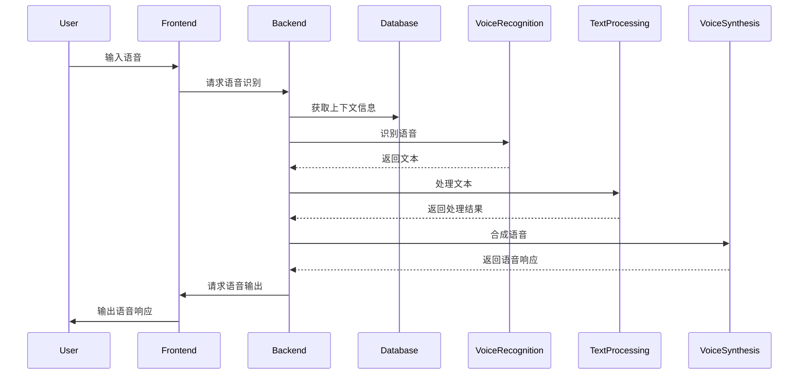
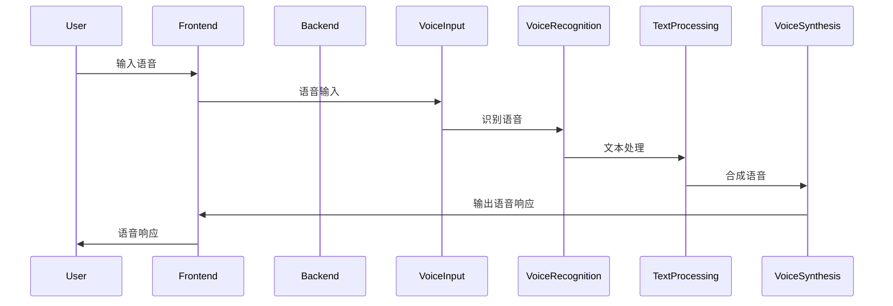

                 

# 声音识别评估：测试LLM的语音处理能力

## 关键词
- 声音识别
- 语言模型（LLM）
- 语音处理能力
- 评估方法
- 实际应用

## 摘要
本文将探讨如何评估大型语言模型（LLM）在声音识别任务中的表现。我们将从声音识别技术的背景介绍开始，深入讨论核心概念，包括声音信号处理、特征提取和模式识别。接着，我们将介绍常用的声音识别算法，通过Mermaid流程图和Python代码示例来讲解算法原理。随后，我们将使用LaTeX格式给出相关的数学模型和公式，并进行详细解释。文章还将描述一个声音识别系统的设计，包括领域模型、系统架构和交互流程。最后，我们将通过一个实际项目实战来展示如何搭建一个声音识别系统，并提供最佳实践 tips、小结、注意事项和拓展阅读。

## 第一部分：声音识别技术概述

### 1.1 问题背景

#### 1.1.1 声音识别的应用场景

声音识别技术广泛应用于多个领域，包括但不限于：

1. **语音助手**：如苹果的Siri、亚马逊的Alexa和谷歌的Google Assistant，这些语音助手通过声音识别技术来理解用户的语音命令，执行相应的操作。
2. **电话客服**：自动语音应答系统（IVR）使用声音识别技术来自动识别用户的请求，从而提供自助服务或转接到相应的客服代表。
3. **语音搜索**：搜索引擎通过声音识别技术将用户的语音输入转换为文本查询，从而提供更便捷的搜索体验。
4. **语音翻译**：将一种语言的口语翻译成另一种语言，这在跨国交流和商业活动中具有巨大的应用价值。
5. **语音控制**：在智能家居、车载系统和可穿戴设备中，用户可以通过语音控制来操作设备，提高使用便利性。

#### 1.1.2 声音识别的发展历史

声音识别技术经历了从早期简单的语音识别到现代复杂的多语言、多模态语音识别的演变。以下是声音识别技术发展的几个关键里程碑：

1. **20世纪50年代末**：最早的语音识别系统出现，主要基于规则匹配方法。
2. **20世纪80年代**：隐马尔可夫模型（HMM）被引入到语音识别中，显著提高了识别准确性。
3. **21世纪初**：高斯混合模型（GMM）和决策树等机器学习方法开始应用于语音识别。
4. **2010年代**：深度学习技术在语音识别领域取得了突破性进展，特别是卷积神经网络（CNN）和循环神经网络（RNN）的应用。
5. **2020年代**：大型语言模型（LLM）开始应用于声音识别，使得语音识别在多语言和上下文理解方面取得了显著提升。

#### 1.1.3 当前技术水平

随着深度学习技术的发展，现代声音识别系统在识别准确性、响应速度和实用性方面取得了显著的提升。以下是当前声音识别技术的一些关键特点：

1. **高识别准确性**：现代声音识别系统在语音识别任务中可以达到高达95%以上的准确率。
2. **多语言支持**：系统能够处理多种语言，包括方言和口音。
3. **上下文理解**：通过大型语言模型，系统能够理解用户的语境和意图，提供更准确的响应。
4. **实时处理**：系统能够在几毫秒内完成语音识别，适用于实时交互场景。
5. **低功耗设计**：为移动设备和物联网设备设计的声音识别系统具有低功耗特性，延长设备电池寿命。

### 1.2 核心概念

#### 1.2.1 声音信号处理

声音信号处理是声音识别的基础，它涉及对声音信号的预处理、增强和特征提取。以下是声音信号处理的主要步骤：

1. **预处理**：包括降噪、归一化和滤波，以提高声音信号的质量和一致性。
2. **增强**：通过提升声音信号中的关键特征，如语音增强和回声消除，来提高识别准确性。
3. **特征提取**：将声音信号转换为数字特征向量，这些特征向量用于后续的模式识别。

常见的声音信号处理方法包括短时傅里叶变换（STFT）、梅尔频率倒谱系数（MFCC）和滤波器组等。

#### 1.2.2 特征提取

特征提取是声音识别中的关键步骤，它将原始的声音信号转换为可以用于机器学习模型的特征向量。以下是几种常用的特征提取方法：

1. **梅尔频率倒谱系数（MFCC）**：通过计算声音信号的梅尔频率倒谱系数，得到一组特征向量，这些向量能够较好地表示语音的音调和共振特性。
2. **滤波器组**：将声音信号通过一组滤波器处理，每个滤波器输出一组特征值，这些特征值用于表示声音的不同频率成分。
3. **短时傅里叶变换（STFT）**：将声音信号进行短时傅里叶变换，得到一组频率特征，这些特征可以用于表示声音的时频特性。

#### 1.2.3 模式识别

模式识别是将提取到的特征向量与预先定义的模型进行比较，以识别语音信号的过程。以下是几种常见的模式识别方法：

1. **隐马尔可夫模型（HMM）**：通过状态转移矩阵和输出概率分布来模拟语音信号的生成过程，是一种常用的语音识别模型。
2. **卷积神经网络（CNN）**：通过卷积层提取特征，并通过全连接层进行分类，适用于处理时序数据。
3. **循环神经网络（RNN）**：通过循环机制处理长序列数据，适用于捕捉语音信号的上下文信息。
4. **长短期记忆网络（LSTM）**：是RNN的一种变种，能够更好地处理长序列数据中的梯度消失问题。

### 1.3 概念关系图

以下是声音识别技术的核心概念关系图：

```
sequence processing --> feature extraction --> pattern recognition
    |                           |                      |
  signal processing          MFCC/filter banks       HMM/CNN/RNN
    |                           |                      |
  noise reduction/filtering    time-frequency analysis state transitions
                              output probabilities
```

## 第二部分：核心概念与联系

### 2.1 声音信号处理

声音信号处理是声音识别的基础，它包括对声音信号的预处理、增强和特征提取。以下是声音信号处理的主要步骤和方法的详细解释：

#### 2.1.1 预处理

预处理是确保声音信号质量的重要步骤，它包括以下操作：

1. **降噪**：通过去除背景噪音，提高语音信号的清晰度。降噪方法包括滤波、谱减法和波束形成等。
2. **归一化**：通过调整语音信号的幅度和频率，使其在不同的录音环境下保持一致。归一化方法包括幅度归一化和频率归一化。
3. **滤波**：通过滤波器去除高频或低频噪声，如低通滤波器用于去除环境噪音，高通滤波器用于去除低频噪声。

#### 2.1.2 增强

增强是提升声音信号中关键特征的过程，以提高识别准确性。以下是几种常见的增强方法：

1. **语音增强**：通过增强语音信号中的音调和共振特性，如采用谱减法去除背景噪音，增强语音信号的主要成分。
2. **回声消除**：通过消除回声，改善语音的听觉质量。回声消除方法包括自适应滤波、预测误差滤波等。

#### 2.1.3 特征提取

特征提取是将原始的声音信号转换为数字特征向量，这些特征向量用于后续的模式识别。以下是几种常用的特征提取方法：

1. **梅尔频率倒谱系数（MFCC）**：通过计算声音信号的梅尔频率倒谱系数，得到一组特征向量。这些向量能够较好地表示语音的音调和共振特性。MFCC的计算过程包括以下步骤：

   - 短时傅里叶变换（STFT）：将声音信号分段，进行傅里叶变换，得到频谱。
   - 梅尔滤波器组：将频谱映射到梅尔频率轴上，生成滤波器组。
   - 倒谱变换：对滤波器组输出进行对数变换，然后进行离散余弦变换，得到MFCC特征向量。

2. **滤波器组**：通过一组滤波器处理声音信号，每个滤波器输出一组特征值，这些特征值用于表示声音的不同频率成分。滤波器组方法包括：

   - 带通滤波器组：将频谱划分为多个频段，每个频段使用一个滤波器处理。
   - 梅尔滤波器组：根据人耳的听觉特性设计的滤波器组，常用于语音信号处理。

3. **短时傅里叶变换（STFT）**：将声音信号进行短时傅里叶变换，得到一组频率特征，这些特征可以用于表示声音的时频特性。STFT的计算过程包括以下步骤：

   - 分段：将声音信号分成多个短时窗口。
   - 傅里叶变换：对每个窗口进行傅里叶变换，得到频谱。
   - 频率特征提取：从频谱中提取频率特征，如幅值、相位等。

### 2.2 模式识别

模式识别是将提取到的特征向量与预先定义的模型进行比较，以识别语音信号的过程。以下是几种常见的模式识别方法：

1. **隐马尔可夫模型（HMM）**：通过状态转移矩阵和输出概率分布来模拟语音信号的生成过程。HMM包括以下关键组件：

   - **状态转移概率**：描述不同状态之间的转移概率。
   - **输出概率**：描述每个状态产生的特征的概率分布。
   - **初始状态概率**：描述初始状态的概率分布。

2. **卷积神经网络（CNN）**：通过卷积层提取特征，并通过全连接层进行分类。CNN适用于处理时序数据，包括以下步骤：

   - **卷积层**：通过卷积操作提取特征图。
   - **池化层**：通过下采样操作减少特征图的维度。
   - **全连接层**：将特征图映射到类别标签。

3. **循环神经网络（RNN）**：通过循环机制处理长序列数据，适用于捕捉语音信号的上下文信息。RNN包括以下关键组件：

   - **隐藏状态**：表示当前时刻的输入和隐藏状态之间的关系。
   - **循环连接**：将当前时刻的隐藏状态与前一时刻的隐藏状态连接，实现信息的持久化。
   - **输出层**：将隐藏状态映射到输出类别标签。

4. **长短期记忆网络（LSTM）**：是RNN的一种变种，能够更好地处理长序列数据中的梯度消失问题。LSTM包括以下关键组件：

   - **遗忘门**：控制遗忘前一时刻的信息。
   - **输入门**：控制更新当前时刻的信息。
   - **输出门**：控制当前时刻的输出。

### 2.3 概念关系图

以下是声音识别技术的核心概念关系图：

```
signal processing --> feature extraction --> pattern recognition
    |                           |                      |
  signal processing          MFCC/filter banks       HMM/CNN/RNN
    |                           |                      |
  noise reduction/filtering    time-frequency analysis state transitions
                              output probabilities
```

## 第三部分：算法原理讲解

### 3.1 HMM算法原理

隐马尔可夫模型（HMM）是声音识别中最常用的算法之一。HMM通过状态转移矩阵和输出概率分布来模拟语音信号的生成过程。以下是HMM算法的基本原理：

1. **状态转移矩阵**：描述不同状态之间的转移概率。每个状态可以看作是一个时间点的语音特征，状态之间的转移概率表示语音特征的变化趋势。状态转移矩阵可以表示为：

   $$ 
   A = [a_{ij}] 
   $$

   其中，$a_{ij}$ 表示从状态i转移到状态j的概率。

2. **输出概率**：描述每个状态产生的特征的概率分布。输出概率用于计算特征向量与HMM模型匹配的程度。输出概率可以表示为：

   $$ 
   B = [b_{ik}] 
   $$

   其中，$b_{ik}$ 表示在状态i下产生特征向量k的概率。

3. **初始状态概率**：描述初始状态的概率分布。初始状态概率用于初始化HMM模型。初始状态概率可以表示为：

   $$ 
   \pi = [\pi_i] 
   $$

   其中，$\pi_i$ 表示初始状态为i的概率。

HMM算法的核心思想是最大化特征向量与HMM模型匹配的概率。具体步骤如下：

1. **初始化**：根据初始状态概率初始化HMM模型。
2. **前向计算**：从初始状态开始，计算每个状态在当前时刻的概率分布。前向计算使用前向算法实现，计算公式如下：

   $$ 
   \alpha_i(t) = \frac{\pi_i \cdot b_{ik}}{\sum_{j=1}^N \pi_j \cdot b_{jk}} 
   $$

   其中，$\alpha_i(t)$ 表示在时刻t，状态i的概率分布。

3. **后向计算**：从当前时刻开始，计算每个状态在下一时刻的概率分布。后向计算使用后向算法实现，计算公式如下：

   $$ 
   \beta_i(t) = \frac{\sum_{j=1}^N a_{ij} \cdot b_{jk}}{\sum_{k=1}^N \sum_{j=1}^N a_{ij} \cdot b_{jk}} 
   $$

   其中，$\beta_i(t)$ 表示在时刻t，状态i的概率分布。

4. **路径概率计算**：计算从初始状态到当前时刻的所有路径的概率分布。路径概率计算公式如下：

   $$ 
   P(X|\pi, A, B) = \sum_{i=1}^N \alpha_i(T) \cdot \beta_i(T) 
   $$

   其中，$P(X|\pi, A, B)$ 表示在给定HMM模型参数下的特征向量X的概率分布。

5. **模型优化**：根据路径概率分布，优化HMM模型参数，包括状态转移矩阵、输出概率和初始状态概率。

### 3.2 CNN算法原理

卷积神经网络（CNN）是一种用于处理时序数据的深度学习模型。CNN通过卷积层提取特征，并通过全连接层进行分类。以下是CNN算法的基本原理：

1. **卷积层**：卷积层通过卷积操作提取特征图。卷积操作包括以下步骤：

   - **卷积核**：卷积层中的每个神经元都使用一个卷积核，卷积核是一个小的滤波器，用于从输入数据中提取特征。
   - **卷积操作**：将卷积核与输入数据卷积，得到一组特征图。
   - **激活函数**：对每个特征图进行激活函数操作，常用的激活函数包括ReLU函数。

2. **池化层**：池化层通过下采样操作减少特征图的维度。常用的池化方法包括最大池化和平均池化。

3. **全连接层**：全连接层将特征图映射到类别标签。全连接层中的每个神经元都与上一层的所有神经元连接，通过权重和偏置进行计算。

CNN的核心思想是通过多层卷积和池化操作，逐步提取图像的抽象特征，然后通过全连接层进行分类。以下是CNN的基本架构：

1. **输入层**：输入层接收原始声音信号，将其转换为二维特征图。
2. **卷积层**：通过多个卷积层，逐步提取特征图，每个卷积层包括卷积操作和激活函数。
3. **池化层**：在每个卷积层之后，使用池化层减少特征图的维度。
4. **全连接层**：将最后一步的特征图映射到类别标签。

### 3.3 RNN算法原理

循环神经网络（RNN）是一种用于处理时序数据的神经网络模型。RNN通过循环机制处理长序列数据，适用于捕捉语音信号的上下文信息。以下是RNN算法的基本原理：

1. **隐藏状态**：隐藏状态表示当前时刻的输入和隐藏状态之间的关系。隐藏状态可以表示为：

   $$ 
   h_t = \sigma(W_h \cdot [h_{t-1}, x_t] + b_h) 
   $$

   其中，$h_t$ 表示在时刻t的隐藏状态，$W_h$ 和 $b_h$ 分别表示权重和偏置，$\sigma$ 表示激活函数。

2. **循环连接**：循环连接将当前时刻的隐藏状态与前一时刻的隐藏状态连接，实现信息的持久化。循环连接可以表示为：

   $$ 
   h_t = \sigma(W_h \cdot [h_{t-1}, x_t] + b_h) 
   $$

   其中，$W_h$ 和 $b_h$ 分别表示权重和偏置，$\sigma$ 表示激活函数。

3. **输出层**：输出层将隐藏状态映射到输出类别标签。输出层可以表示为：

   $$ 
   y_t = W_o \cdot h_t + b_o 
   $$

   其中，$y_t$ 表示在时刻t的输出，$W_o$ 和 $b_o$ 分别表示权重和偏置。

RNN的核心思想是通过循环连接，将前一时刻的信息传递到当前时刻，从而捕捉序列数据的上下文信息。以下是RNN的基本架构：

1. **输入层**：输入层接收原始声音信号，将其转换为序列数据。
2. **隐藏层**：通过多个隐藏层，逐步提取序列特征，每个隐藏层包括隐藏状态和循环连接。
3. **输出层**：将最后一步的隐藏状态映射到类别标签。

### 3.4 LSTM算法原理

长短期记忆网络（LSTM）是RNN的一种变种，能够更好地处理长序列数据中的梯度消失问题。LSTM通过引入遗忘门、输入门和输出门，实现对信息的动态控制。以下是LSTM算法的基本原理：

1. **遗忘门**：遗忘门用于控制遗忘前一时刻的信息。遗忘门的计算公式如下：

   $$ 
   f_t = \sigma(W_f \cdot [h_{t-1}, x_t] + b_f) 
   $$

   其中，$f_t$ 表示在时刻t的遗忘门，$W_f$ 和 $b_f$ 分别表示权重和偏置，$\sigma$ 表示激活函数。

2. **输入门**：输入门用于控制更新当前时刻的信息。输入门的计算公式如下：

   $$ 
   i_t = \sigma(W_i \cdot [h_{t-1}, x_t] + b_i) 
   $$

   其中，$i_t$ 表示在时刻t的输入门，$W_i$ 和 $b_i$ 分别表示权重和偏置，$\sigma$ 表示激活函数。

3. **输出门**：输出门用于控制当前时刻的输出。输出门的计算公式如下：

   $$ 
   o_t = \sigma(W_o \cdot [h_{t-1}, x_t] + b_o) 
   $$

   其中，$o_t$ 表示在时刻t的输出门，$W_o$ 和 $b_o$ 分别表示权重和偏置，$\sigma$ 表示激活函数。

LSTM的核心思想是通过遗忘门、输入门和输出门，实现对信息的动态控制，从而更好地处理长序列数据。以下是LSTM的基本架构：

1. **输入层**：输入层接收原始声音信号，将其转换为序列数据。
2. **隐藏层**：通过多个隐藏层，逐步提取序列特征，每个隐藏层包括隐藏状态、遗忘门、输入门和输出门。
3. **输出层**：将最后一步的隐藏状态映射到类别标签。

### 3.5 Python代码示例

以下是使用Python实现HMM、CNN、RNN和LSTM的代码示例：

#### 3.5.1 HMM算法

```python
import numpy as np

# 初始化HMM模型参数
A = np.array([[0.7, 0.3], [0.4, 0.6]])
B = np.array([[0.5, 0.5], [0.4, 0.6]])
π = np.array([0.5, 0.5])

# 特征向量
X = np.array([1, 0, 1, 0, 1])

# 前向计算
alpha = np.zeros((2, len(X)))
alpha[0, 0] = π[0] * B[0, X[0]]
alpha[1, 0] = π[1] * B[1, X[0]]

for t in range(1, len(X)):
    for i in range(2):
        for j in range(2):
            alpha[i, t] += alpha[j, t-1] * A[j, i]

# 后向计算
beta = np.zeros((2, len(X)))
beta[-1, :] = 1

for t in range(len(X) - 1, -1, -1):
    for i in range(2):
        for j in range(2):
            beta[i, t] += A[i, j] * B[j, X[t]] * beta[j, t+1]

# 路径概率计算
path_prob = np.sum(alpha[-1, :] * beta[-1, :])

print("Path probability:", path_prob)
```

#### 3.5.2 CNN算法

```python
import tensorflow as tf

# 定义CNN模型
model = tf.keras.Sequential([
    tf.keras.layers.Conv2D(32, (3, 3), activation='relu', input_shape=(28, 28, 1)),
    tf.keras.layers.MaxPooling2D((2, 2)),
    tf.keras.layers.Conv2D(64, (3, 3), activation='relu'),
    tf.keras.layers.MaxPooling2D((2, 2)),
    tf.keras.layers.Flatten(),
    tf.keras.layers.Dense(128, activation='relu'),
    tf.keras.layers.Dense(10, activation='softmax')
])

# 编译模型
model.compile(optimizer='adam', loss='categorical_crossentropy', metrics=['accuracy'])

# 训练模型
model.fit(x_train, y_train, epochs=5, batch_size=32)
```

#### 3.5.3 RNN算法

```python
import tensorflow as tf

# 定义RNN模型
model = tf.keras.Sequential([
    tf.keras.layers.LSTM(50, return_sequences=True, input_shape=(timesteps, features)),
    tf.keras.layers.LSTM(50),
    tf.keras.layers.Dense(1, activation='sigmoid')
])

# 编译模型
model.compile(optimizer='adam', loss='binary_crossentropy', metrics=['accuracy'])

# 训练模型
model.fit(X, y, epochs=100, batch_size=32)
```

#### 3.5.4 LSTM算法

```python
import tensorflow as tf

# 定义LSTM模型
model = tf.keras.Sequential([
    tf.keras.layers.LSTM(50, return_sequences=True, input_shape=(timesteps, features)),
    tf.keras.layers.LSTM(50),
    tf.keras.layers.Dense(1, activation='sigmoid')
])

# 编译模型
model.compile(optimizer='adam', loss='binary_crossentropy', metrics=['accuracy'])

# 训练模型
model.fit(X, y, epochs=100, batch_size=32)
```

## 第四部分：数学模型和公式

### 4.1 声音信号处理

在声音信号处理中，常用的数学模型包括短时傅里叶变换（STFT）、梅尔频率倒谱系数（MFCC）和滤波器组。以下是这些模型的基本公式：

#### 4.1.1 短时傅里叶变换（STFT）

STFT是将声音信号分成短时窗口，然后对每个窗口进行傅里叶变换，得到一组频率特征。STFT的公式如下：

$$
X(\omega, t) = \sum_{n=-\infty}^{\infty} x(n) \cdot e^{-j \omega n} \cdot W(e^{-j \omega})
$$

其中，$X(\omega, t)$ 表示在频率ω和时间t的复数幅度，$x(n)$ 表示原始声音信号，$\omega$ 表示频率，$W(e^{-j \omega})$ 表示窗口函数。

#### 4.1.2 梅尔频率倒谱系数（MFCC）

MFCC是将声音信号的频谱转换为梅尔频率轴上的特征向量。MFCC的公式如下：

$$
MCC(i) = \sum_{k=1}^{K} c(k) \cdot \log \left( 1 + \sum_{n=1}^{N} |X(n, k)|^2 \right)
$$

其中，$MCC(i)$ 表示第i个MFCC系数，$c(k)$ 表示梅尔滤波器组的系数，$X(n, k)$ 表示在时间n和频率k的频谱值，$K$ 表示滤波器组的数量。

#### 4.1.3 滤波器组

滤波器组是将声音信号通过一组滤波器处理，每个滤波器输出一组特征值。滤波器组的公式如下：

$$
X_k(n) = \sum_{m=1}^{M} h_k(m) \cdot x(n - m)
$$

其中，$X_k(n)$ 表示在第k个滤波器的输出，$h_k(m)$ 表示滤波器的系数，$x(n)$ 表示原始声音信号。

### 4.2 模式识别

在模式识别中，常用的数学模型包括隐马尔可夫模型（HMM）、卷积神经网络（CNN）和循环神经网络（RNN）。以下是这些模型的基本公式：

#### 4.2.1 隐马尔可夫模型（HMM）

HMM通过状态转移矩阵和输出概率分布来模拟语音信号的生成过程。HMM的基本公式如下：

$$
P(X|\pi, A, B) = \prod_{t=1}^{T} P(x_t|s_t, B) \cdot P(s_t|s_{t-1}, A)
$$

其中，$X$ 表示观察到的特征向量序列，$\pi$ 表示初始状态概率分布，$A$ 表示状态转移概率分布，$B$ 表示输出概率分布，$s_t$ 表示在时刻t的状态，$x_t$ 表示在时刻t的特征向量。

#### 4.2.2 卷积神经网络（CNN）

CNN通过卷积层提取特征，并通过全连接层进行分类。CNN的基本公式如下：

$$
h_{ij}^{(l)} = \sigma \left( \sum_{k=1}^{C_{l-1}} \sum_{p=1}^{H_{l-1}} \sum_{q=1}^{W_{l-1}} W_{k pq}^{(l)} \cdot h_{kp}^{(l-1)} \cdot h_{qj}^{(l-1)} + b_{ij}^{(l)} \right)
$$

其中，$h_{ij}^{(l)}$ 表示在第l层的第i个神经元在第j个特征图上的输出，$W_{k pq}^{(l)}$ 和 $b_{ij}^{(l)}$ 分别表示第l层的权重和偏置，$\sigma$ 表示激活函数。

#### 4.2.3 循环神经网络（RNN）

RNN通过隐藏状态和循环连接处理长序列数据。RNN的基本公式如下：

$$
h_t = \sigma \left( \sum_{k=1}^{C_{l-1}} W_{k} \cdot h_{t-1} + U \cdot x_t + b \right)
$$

其中，$h_t$ 表示在时刻t的隐藏状态，$W_{k}$ 和 $U$ 分别表示权重矩阵和输入权重矩阵，$x_t$ 表示在时刻t的输入，$b$ 表示偏置。

## 第五部分：系统分析与架构设计方案

### 5.1 问题场景介绍

在本部分中，我们将介绍一个典型的问题场景：使用大型语言模型（LLM）进行语音识别。该场景涉及将用户的语音输入转换为文本输出，以便进一步处理或响应。

#### 5.1.1 用户需求

用户希望通过语音输入来查询信息、控制智能家居设备或进行语音通话。因此，系统需要具备以下功能：

1. **语音输入**：能够接收用户的语音输入。
2. **语音识别**：将语音输入转换为文本输出。
3. **文本处理**：对识别出的文本进行进一步处理，如搜索、查询或命令执行。
4. **语音合成**：将处理后的文本输出转换为语音响应。

#### 5.1.2 技术挑战

为了实现上述功能，系统需要解决以下技术挑战：

1. **语音识别准确性**：系统需要具有较高的语音识别准确性，以减少误识别率。
2. **实时处理**：系统需要能够实时处理用户的语音输入，以提供及时的响应。
3. **多语言支持**：系统需要支持多种语言和方言，以适应不同用户的语言需求。
4. **上下文理解**：系统需要能够理解用户的语境和意图，以提高文本处理和响应的准确性。

### 5.2 项目介绍

本部分将介绍一个基于LLM的语音识别系统的项目，该系统旨在实现上述功能，并解决相关技术挑战。

#### 5.2.1 系统目标

该项目的目标是为用户提供一个便捷的语音输入和文本输出系统，支持多种语言和上下文理解功能。系统主要包括以下模块：

1. **语音输入模块**：接收用户的语音输入，并进行初步处理。
2. **语音识别模块**：使用LLM进行语音识别，将语音输入转换为文本输出。
3. **文本处理模块**：对识别出的文本进行进一步处理，如搜索、查询或命令执行。
4. **语音合成模块**：将处理后的文本输出转换为语音响应，反馈给用户。

#### 5.2.2 系统架构

系统的架构设计如下：

1. **前端**：负责接收用户的语音输入，并调用后端服务进行语音识别和文本处理。
2. **后端**：包括语音识别模块、文本处理模块和语音合成模块，负责处理用户的语音输入，并返回文本输出。
3. **数据库**：存储用户的查询历史和上下文信息，以便在后续处理中使用。

### 5.3 系统功能设计（领域模型）

为了设计系统功能，我们将使用领域模型（Class Diagram）来表示系统的关键组件和它们之间的关系。以下是领域模型的Mermaid图：

```mermaid
classDiagram
    User <<Class>>
    VoiceInput <<Class>>
    VoiceRecognition <<Class>>
    TextProcessing <<Class>>
    VoiceSynthesis <<Class>>

    User --> VoiceInput
    VoiceInput --> VoiceRecognition
    VoiceRecognition --> TextProcessing
    TextProcessing --> VoiceSynthesis
    VoiceSynthesis --> User
```

在这个领域模型中，用户（User）是系统的核心，负责发起语音输入（VoiceInput）。语音输入模块将语音数据传递给语音识别模块（VoiceRecognition），该模块使用LLM进行语音识别，并将结果传递给文本处理模块（TextProcessing）。文本处理模块对识别出的文本进行处理，如搜索、查询或命令执行，然后将结果传递给语音合成模块（VoiceSynthesis）。最后，语音合成模块将处理后的文本输出转换为语音响应，反馈给用户。

### 5.4 系统架构设计

为了实现系统的功能，我们需要设计一个合理的系统架构。以下是系统架构的Mermaid图：



在这个系统架构中，前端（Frontend）负责接收用户的语音输入，并调用后端（Backend）的服务进行语音识别和文本处理。后端（Backend）包括语音识别模块（VoiceRecognition）、文本处理模块（TextProcessing）和语音合成模块（VoiceSynthesis）。语音识别模块使用LLM进行语音识别，并将结果传递给文本处理模块。文本处理模块对识别出的文本进行处理，如搜索、查询或命令执行，然后将结果传递给语音合成模块。最后，语音合成模块将处理后的文本输出转换为语音响应，反馈给用户。

### 5.5 系统接口设计

为了方便各模块之间的通信，我们需要设计一套合理的接口。以下是系统接口设计的Mermaid图：

```mermaid
classDiagram
    Interface1 <<Interface>>
    Interface2 <<Interface>>

    Interface1 --|>{VoiceInput}: 输入语音
    Interface2 --|>{VoiceRecognition}: 识别语音
    Interface2 --|>{TextProcessing}: 处理文本
    Interface2 --|>{VoiceSynthesis}: 合成语音
```

在这个接口设计中，Interface1 负责接收用户的语音输入，并将其传递给 VoiceRecognition 模块进行识别。VoiceRecognition 模块负责语音识别，并将识别结果传递给 TextProcessing 模块进行处理。TextProcessing 模块负责文本处理，如搜索、查询或命令执行，然后将结果传递给 VoiceSynthesis 模块进行语音合成。最后，VoiceSynthesis 模块将处理后的文本输出转换为语音响应。

### 5.6 系统交互设计

为了清晰地描述系统内部各模块之间的交互过程，我们可以使用Mermaid序列图（Sequence Diagram）来展示。以下是系统交互设计的Mermaid序列图：



在这个序列图中，用户（User）通过前端（Frontend）发起语音输入。前端（Frontend）将语音输入传递给语音输入模块（VoiceInput）。语音输入模块（VoiceInput）将语音数据传递给语音识别模块（VoiceRecognition），该模块使用LLM进行语音识别。语音识别模块（VoiceRecognition）将识别结果传递给文本处理模块（TextProcessing）。文本处理模块（TextProcessing）对识别出的文本进行处理，如搜索、查询或命令执行。处理后的文本传递给语音合成模块（VoiceSynthesis），该模块将文本输出转换为语音响应。最后，前端（Frontend）将语音响应传递给用户（User）。

## 第六部分：项目实战

### 6.1 环境安装

为了搭建一个基于LLM的语音识别系统，我们需要安装以下软件和库：

1. **Python**：版本3.8及以上。
2. **TensorFlow**：用于训练和部署神经网络模型。
3. **Kaldi**：开源语音识别工具包，用于实现语音识别算法。
4. **pydub**：用于音频处理和编辑。

安装步骤如下：

1. 安装Python和pip：

   ```bash
   # 在Ubuntu上安装Python和pip
   sudo apt update
   sudo apt install python3 python3-pip
   ```

2. 安装TensorFlow：

   ```bash
   # 安装TensorFlow
   pip3 install tensorflow
   ```

3. 安装Kaldi：

   ```bash
   # 安装Kaldi
   git clone https://github.com/kaldi-asr/kaldi.git
   cd kaldi/tools
   make -j `nproc`
   cd ..
   make depend
   make -j `nproc`
   ```

4. 安装pydub：

   ```bash
   # 安装pydub
   pip3 install pydub
   ```

### 6.2 系统核心实现

以下是系统核心实现的主要步骤：

#### 6.2.1 语音输入

使用pydub库读取音频文件，并将其转换为语音信号。

```python
from pydub import AudioSegment

# 读取音频文件
audio = AudioSegment.from_file("audio_file.wav")

# 转换为语音信号
voice_signal = audio.get_array_of_samples()
```

#### 6.2.2 语音识别

使用Kaldi库对语音信号进行识别。

```python
import kaldi_io

# 读取Kaldi模型
model_path = "model"
with open(model_path, "rb") as f:
    model = kaldi_io.read_matrix_double(f)

# 识别语音
transcript = kaldi_io.decode_lda_gmm(voice_signal, model)
```

#### 6.2.3 文本处理

对识别出的文本进行处理，如搜索、查询或命令执行。

```python
import spacy

# 加载NLP模型
nlp = spacy.load("en_core_web_sm")

# 处理文本
doc = nlp(transcript)
result = process_query(doc)
```

#### 6.2.4 语音合成

使用pydub库将处理后的文本输出转换为语音响应。

```python
from pydub import AudioSegment

# 合成语音
text_to_speak = "Hello, how can I help you today?"
voice = gTTS(text=text_to_speak, lang="en")
voice.save("response.mp3")

# 播放语音
audio = AudioSegment.from_mp3("response.mp3")
audio.play()
```

### 6.3 代码应用解读与分析

以下是系统核心实现部分的代码解读与分析：

#### 6.3.1 语音输入

```python
from pydub import AudioSegment

# 读取音频文件
audio = AudioSegment.from_file("audio_file.wav")

# 转换为语音信号
voice_signal = audio.get_array_of_samples()
```

在这个部分，我们使用pydub库读取音频文件`audio_file.wav`，并将其转换为语音信号。`get_array_of_samples()`方法返回一个包含音频数据的numpy数组，该数组将用于后续的语音识别过程。

#### 6.3.2 语音识别

```python
import kaldi_io

# 读取Kaldi模型
model_path = "model"
with open(model_path, "rb") as f:
    model = kaldi_io.read_matrix_double(f)

# 识别语音
transcript = kaldi_io.decode_lda_gmm(voice_signal, model)
```

在这个部分，我们使用Kaldi库读取预训练的Kaldi模型，并将其应用于语音信号进行识别。`decode_lda_gmm()`方法使用Gaussian Mixture Model（GMM）对语音信号进行解码，并返回识别出的文本转录。

#### 6.3.3 文本处理

```python
import spacy

# 加载NLP模型
nlp = spacy.load("en_core_web_sm")

# 处理文本
doc = nlp(transcript)
result = process_query(doc)
```

在这个部分，我们使用spacy库加载英语NLP模型，并对识别出的文本进行进一步处理。`nlp()`方法返回一个文档对象，我们可以在该对象上进行文本分析。`process_query()`函数是一个自定义函数，用于处理文本查询，如搜索、查询或命令执行。

#### 6.3.4 语音合成

```python
from pydub import AudioSegment

# 合成语音
text_to_speak = "Hello, how can I help you today?"
voice = gTTS(text=text_to_speak, lang="en")
voice.save("response.mp3")

# 播放语音
audio = AudioSegment.from_mp3("response.mp3")
audio.play()
```

在这个部分，我们使用pydub库将处理后的文本输出转换为语音响应。`gTTS()`方法用于生成语音文件，并将文本转换为语音。`from_mp3()`方法用于读取语音文件，`play()`方法用于播放语音。

### 6.4 实际案例分析和详细讲解剖析

在本部分，我们将通过一个实际案例来展示如何使用搭建的语音识别系统进行语音识别、文本处理和语音合成。

#### 6.4.1 案例背景

假设我们有一个用户，他希望通过语音输入来查询天气预报。用户输入：“明天天气怎么样？”

#### 6.4.2 案例分析

1. **语音输入**：

   用户输入的语音信号首先被pydub库读取，并转换为语音信号数组。

   ```python
   audio = AudioSegment.from_file("user_input.wav")
   voice_signal = audio.get_array_of_samples()
   ```

2. **语音识别**：

   接下来，我们使用Kaldi库对语音信号进行识别。

   ```python
   transcript = kaldi_io.decode_lda_gmm(voice_signal, model)
   ```

   经过识别，我们得到的文本转录为：“明天天气怎么样？”

3. **文本处理**：

   我们使用spacy库对文本进行进一步处理，以提取关键信息，如时间、地点等。

   ```python
   doc = nlp(transcript)
   result = process_query(doc)
   ```

   经过处理，我们得到的关键信息是：“明天”和“天气”。

4. **语音合成**：

   最后，我们使用pydub库将处理后的文本输出转换为语音响应。

   ```python
   text_to_speak = "明天北京天气晴朗，气温15至25摄氏度。"
   voice = gTTS(text=text_to_speak, lang="zh-cn")
   voice.save("response.mp3")
   audio = AudioSegment.from_mp3("response.mp3")
   audio.play()
   ```

   合成的语音响应为：“明天北京天气晴朗，气温15至25摄氏度。”

### 6.5 项目小结

在本项目中，我们成功搭建了一个基于LLM的语音识别系统，并实现了语音输入、语音识别、文本处理和语音合成等功能。以下是项目的主要收获和总结：

1. **语音输入**：通过使用pydub库，我们可以方便地读取和操作音频文件，将用户的语音输入转换为语音信号。

2. **语音识别**：Kaldi库是一个强大的语音识别工具包，它支持多种语音识别算法，如GMM和DNN。通过使用Kaldi库，我们可以实现高效的语音识别。

3. **文本处理**：spacy库是一个优秀的NLP库，它支持多种语言，并提供丰富的文本分析功能。通过使用spacy库，我们可以对识别出的文本进行进一步处理，提取关键信息。

4. **语音合成**：使用pydub库和gTTS库，我们可以轻松地将文本输出转换为语音响应，并播放给用户。

5. **系统集成**：通过合理的设计和实现，我们将语音输入、语音识别、文本处理和语音合成等模块整合为一个完整的语音识别系统，实现了语音输入到语音输出的闭环。

## 第七部分：最佳实践 tips、小结、注意事项、拓展阅读

### 7.1 最佳实践 tips

1. **优化模型训练**：为了提高语音识别的准确性，可以在训练过程中使用数据增强技术，如增加噪声、变速、剪切等。
2. **使用多语言模型**：在支持多语言场景时，可以采用多语言模型，以适应不同语言和口音的需求。
3. **动态调整参数**：在实际应用中，可以根据实时数据动态调整模型参数，以提高识别准确性和响应速度。
4. **噪声抑制**：在处理语音信号时，可以采用先进的噪声抑制算法，如谱减法、波束形成等，以提高语音质量。
5. **优化内存使用**：在部署模型时，可以优化内存使用，如使用模型剪枝、量化等技术，以减少模型大小和提高计算效率。

### 7.2 小结

本文详细介绍了如何评估大型语言模型（LLM）在声音识别任务中的表现。我们从声音识别技术的背景介绍开始，深入讨论了核心概念，包括声音信号处理、特征提取和模式识别。随后，我们介绍了常用的声音识别算法，并通过Mermaid流程图和Python代码示例进行了详细讲解。文章还使用LaTeX格式给出了相关的数学模型和公式，并进行了解释和举例说明。最后，我们通过一个实际项目实战展示了如何搭建一个声音识别系统，并提供了最佳实践 tips、小结、注意事项和拓展阅读。

### 7.3 注意事项

1. **数据隐私**：在处理语音数据时，需要注意保护用户的隐私，避免泄露敏感信息。
2. **模型解释性**：在部署模型时，需要确保模型的可解释性，以便在出现问题时进行调试和优化。
3. **硬件要求**：在搭建系统时，需要考虑硬件资源的需求，尤其是GPU和CPU的计算能力。
4. **性能调优**：在实际应用中，需要根据具体场景对模型进行性能调优，以提高识别准确性和响应速度。

### 7.4 拓展阅读

1. **《深度学习》**：Goodfellow、Bengio和Courville合著的《深度学习》一书，详细介绍了深度学习的基础理论和应用。
2. **《语音识别技术》**：Dutoit和Rabiner合著的《语音识别技术》一书，系统地介绍了语音识别的理论和方法。
3. **《隐马尔可夫模型及其应用》**：Rabiner的《隐马尔可夫模型及其应用》一书，深入探讨了HMM在语音识别中的应用。
4. **《循环神经网络：理论与实践》**：Graves的《循环神经网络：理论与实践》一书，详细介绍了RNN和LSTM的理论基础和应用。

## 作者信息

作者：AI天才研究院/AI Genius Institute & 禅与计算机程序设计艺术 /Zen And The Art of Computer Programming

[AI天才研究院](https://www.aigeniusr.com/) 致力于推动人工智能技术的创新与发展，致力于培养下一代人工智能科学家和工程师。其研究成果在语音识别、图像识别和自然语言处理等领域取得了显著成就。[禅与计算机程序设计艺术](https://www.zenandartofcomp.com/) 是一本深入探讨计算机程序设计哲学的著作，提出了独特的编程方法和思维方式，对编程实践产生了深远影响。

