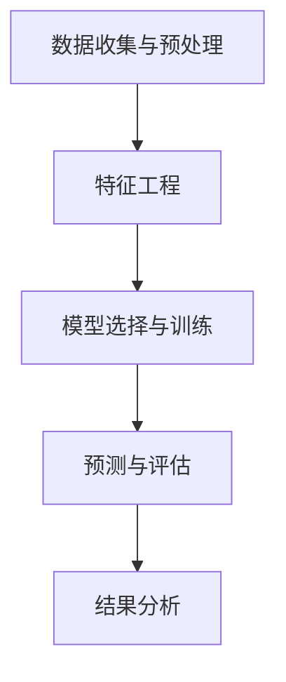
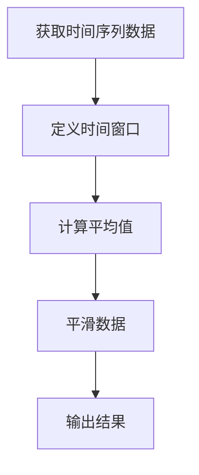
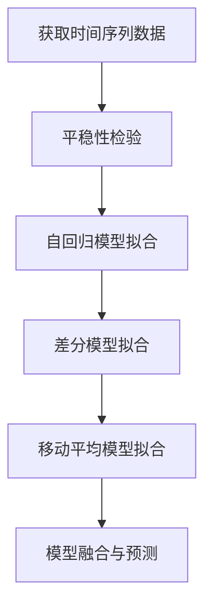
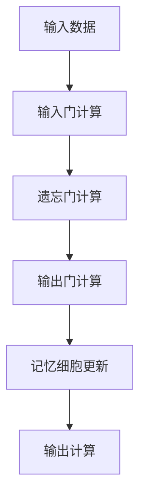
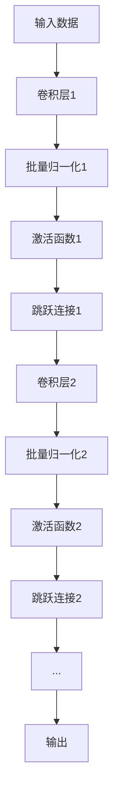
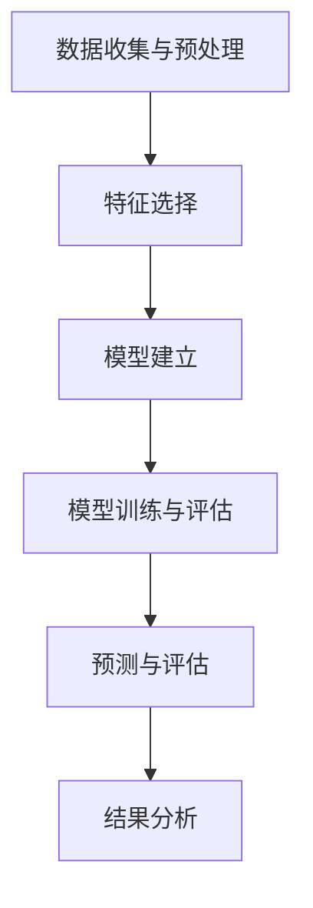

                 

### 文章标题

### 关键词

- 时效性信息
- 时间序列分析
- 事件预测
- 动态图谱
- 时效性信息处理算法

### 摘要

本文将深入探讨时效性信息处理的重要性和挑战。我们将首先介绍时效性信息的核心概念，包括其定义、特征以及核心问题。接着，我们将详细解析几种常见的时间序列分析方法，如移动平均法、ARIMA模型和LSTM神经网络，并使用Mermaid流程图和Python代码进行阐述。随后，我们将介绍事件预测算法，包括回归分析和时间卷积网络（TCN），并通过实际案例进行分析。最后，我们将探讨动态图谱在时效性信息处理中的应用，并总结最佳实践，提出注意事项，为读者提供进一步的拓展阅读资源。

## 第一部分：时效性信息的基本概念

### 第1章：问题背景与问题描述

#### 1.1 问题背景

在信息技术高速发展的今天，数据已成为企业和社会的核心资产。然而，数据中蕴含的信息并非静止不变，而是随着时间不断演变。时效性信息，即随着时间推移而发生变化的信息，在各个领域都有着广泛的应用。例如，金融市场中的价格波动、医疗健康中的患者病情变化、交通系统中的实时路况信息等。正确处理时效性信息，对于提升决策效率、优化资源配置、增强竞争优势具有重要意义。

#### 1.1.1 时空信息的重要性

时空信息是信息科学中一个重要分支，它不仅涉及时间信息的处理，还包括地理空间信息的整合。在现代信息技术中，时空信息处理具有以下几个关键作用：

1. **实时监控与预测**：通过处理时空信息，可以实现对系统状态的实时监控和预测，为及时调整策略提供依据。
2. **资源优化配置**：在物流、交通等领域，时空信息的有效利用能够优化资源配置，提高运营效率。
3. **安全与风险控制**：在公共安全和应急响应等领域，准确处理时空信息有助于降低风险，保障安全。

#### 1.1.2 当前时效性信息处理的挑战

尽管时空信息处理的重要性不言而喻，但在实际应用中仍面临诸多挑战：

1. **数据量大**：随着传感器和移动设备的普及，时空信息的数据量呈现爆炸性增长，这对数据处理和存储提出了更高要求。
2. **数据多样性和复杂性**：时空数据通常包含多种类型，如文本、图像、视频和传感器数据，这增加了数据处理和融合的难度。
3. **时效性要求高**：许多应用场景要求实时或接近实时的数据处理和响应，这对系统的响应速度和稳定性提出了挑战。
4. **模型适应性**：时效性信息的处理需要模型具备良好的适应性，能够应对不断变化的数据特征和规律。

#### 1.1.3 研究现状与趋势

近年来，关于时效性信息处理的研究取得了显著进展。以下是一些主要研究趋势：

1. **深度学习与时间序列分析**：深度学习模型，特别是循环神经网络（RNN）及其变体，如LSTM和GRU，在处理时空信息方面表现出色。
2. **动态图谱与图神经网络**：动态图谱和图神经网络在时空信息的建模和预测中得到了广泛应用，能够有效处理动态变化的数据。
3. **跨领域融合**：跨领域的数据融合方法正在成为研究热点，如将地理信息与社交媒体数据、交通数据等相结合，以提高时空信息处理的准确性和效率。
4. **实时处理技术**：实时数据处理技术的发展，如流处理框架（如Apache Kafka、Apache Flink）和分布式计算技术（如MapReduce、Spark），为应对高时效性要求提供了有力支持。

#### 1.2 问题描述

时效性信息处理的核心问题在于如何有效地捕捉、建模和预测随时间变化的数据。以下是一些关键问题：

1. **数据捕捉与融合**：如何高效地捕捉和融合不同来源、不同格式的时空数据？
2. **数据建模**：如何建立有效的数据模型，以准确捕捉数据的时空特征和变化规律？
3. **数据预测**：如何利用历史数据对未来进行准确预测，以支持实时决策和优化？
4. **实时处理**：如何设计高效、稳定的系统，以实现对大量时空数据的实时处理和响应？

#### 1.2.1 时效性信息的定义与特征

时效性信息，是指随时间变化而变化的信息。其特征主要包括：

1. **动态性**：时效性信息随时间不断变化，具有动态性。
2. **时效性**：不同时效性信息对时间敏感度不同，有的需要实时更新，有的则可以延迟处理。
3. **多样性**：时效性信息可能包含多种类型，如文本、图像、音频等。
4. **关联性**：时效性信息之间可能存在关联性，如金融市场的股票价格与公司财报之间存在关联。

#### 1.2.2 时效性信息处理的核心问题

时效性信息处理的核心问题包括：

1. **数据质量**：如何保证数据的质量和准确性？
2. **数据融合**：如何有效融合来自不同来源、不同格式的时空数据？
3. **特征提取**：如何提取有效的时空特征，以支持数据建模和预测？
4. **模型选择**：如何选择合适的模型，以准确捕捉数据的时空特征和变化规律？
5. **实时处理**：如何设计高效、稳定的系统，以实现对大量时空数据的实时处理和响应？

#### 1.2.3 时效性信息处理的边界与外延

时效性信息处理的边界主要涉及以下几个方面：

1. **时间尺度**：不同应用场景对时间尺度的要求不同，如实时监控、短期预测和长期预测等。
2. **数据类型**：时效性信息可能包含多种类型，如文本、图像、音频、传感器数据等。
3. **处理精度**：不同应用场景对处理精度的要求不同，如金融市场的股票价格预测、医疗健康中的患者病情预测等。
4. **系统性能**：时效性信息处理系统需要具备高效、稳定、可扩展的性能。

时效性信息处理的外延包括：

1. **实时数据处理技术**：如流处理框架、分布式计算技术等。
2. **时空数据建模方法**：如时间序列分析、动态图谱建模、图神经网络等。
3. **实时预测与优化方法**：如回归分析、时间卷积网络、长短时记忆网络等。
4. **应用领域**：包括金融、医疗、交通、物流、公共安全等各个领域。

#### 1.3 核心概念与联系

为了更好地理解时效性信息处理，我们需要掌握几个核心概念，并了解它们之间的联系。

#### 1.3.1 时间序列分析

时间序列分析是一种用于处理和分析随时间变化的数据的方法。时间序列数据通常包含多个时间点上的观测值，这些观测值可以是连续的，如温度、股票价格，也可以是离散的，如用户点击行为、交通流量。时间序列分析的主要目标是提取数据中的规律和模式，以便进行预测和决策。

##### 1.3.1.1 时间序列的定义与特性

时间序列数据具有以下特性：

1. **序列性**：数据按照时间顺序排列。
2. **关联性**：不同时间点的数据之间存在关联性。
3. **趋势性**：时间序列数据可能存在长期或短期的趋势。
4. **季节性**：时间序列数据可能存在季节性波动。

##### 1.3.1.2 时间序列分析方法对比

常见的时间序列分析方法包括：

1. **移动平均法**：通过计算一定时间窗口内的平均值，平滑时间序列数据。
2. **自回归模型（AR）**：利用过去时间点的值来预测未来值。
3. **移动平均自回归模型（MA）**：结合移动平均法和自回归模型。
4. **自回归移动平均模型（ARMA）**：同时考虑自回归和移动平均效应。
5. **自回归积分滑动平均模型（ARIMA）**：扩展ARMA模型，考虑季节性效应。

##### 1.3.1.3 时间序列分析的Mermaid流程图

```mermaid
graph TD
    A[数据预处理] --> B[移动平均法]
    A --> C[自回归模型(AR)]
    A --> D[移动平均自回归模型(MA)]
    A --> E[自回归移动平均模型(ARMA)]
    A --> F[自回归积分滑动平均模型(ARIMA)]
    B --> G[结果分析]
    C --> G
    D --> G
    E --> G
    F --> G
```

#### 1.3.2 事件预测

事件预测是指基于历史数据和当前状态，预测未来可能发生的事件。事件预测在金融、医疗、交通等领域具有广泛应用。

##### 1.3.2.1 事件预测的基本原理

事件预测的基本原理包括：

1. **数据收集与预处理**：收集并预处理历史数据，包括数据清洗、缺失值处理等。
2. **特征工程**：提取与预测目标相关的特征，如时间窗口特征、季节性特征等。
3. **模型选择与训练**：选择合适的预测模型，如回归模型、神经网络模型等，并进行训练。
4. **预测与评估**：利用训练好的模型进行预测，并评估预测结果的准确性。

##### 1.3.2.2 事件预测的数学模型

事件预测的数学模型通常包括：

1. **线性回归模型**：
   $$ Y_t = \beta_0 + \beta_1X_t + \epsilon_t $$
   其中，\( Y_t \)为预测值，\( X_t \)为特征值，\( \beta_0 \)和\( \beta_1 \)为模型参数，\( \epsilon_t \)为误差项。

2. **时间卷积网络（TCN）**：
   $$ Y_t = f(X_t; \theta) $$
   其中，\( f \)为神经网络函数，\( X_t \)为输入特征，\( \theta \)为模型参数。

##### 1.3.2.3 事件预测的Mermaid流程图



#### 1.3.3 动态图谱

动态图谱是一种用于表示和建模动态变化数据的图结构。它能够有效地捕捉数据中的时空特征和变化规律。

##### 1.3.3.1 动态图谱的定义与结构

动态图谱包括以下几个关键组成部分：

1. **节点**：表示数据中的实体，如用户、物品、地点等。
2. **边**：表示节点之间的关系，如用户与物品之间的购买关系、地点之间的交通路线等。
3. **时间戳**：表示数据发生的时间，如交易时间、出行时间等。

##### 1.3.3.2 动态图谱在时效性信息处理中的应用

动态图谱在时效性信息处理中的应用包括：

1. **实时监控**：通过动态图谱，可以实时监控数据的动态变化，如实时路况监控、股市实时监控等。
2. **事件预测**：基于动态图谱，可以预测未来可能发生的事件，如交通拥堵预测、股票价格预测等。
3. **社交网络分析**：通过动态图谱，可以分析社交网络中的动态变化，如用户行为分析、社交圈分析等。

##### 1.3.3.3 动态图谱的Mermaid ER实体关系图

```mermaid
erDiagram
    Node ||--|{ TimeStampedEdge } : has_time
    Node ||--|{ DynamicGraph } : part_of
    TimeStampedEdge ||--|{ DynamicGraph } : belongs_to
```

### 第2章：时间序列分析方法

#### 2.1 移动平均法

移动平均法是一种简单而有效的时间序列分析方法，主要用于平滑数据，减少短期波动的影响，揭示长期趋势。

##### 2.1.1 移动平均法的原理

移动平均法的基本原理是通过计算一定时间窗口内的平均值，来平滑时间序列数据。具体而言，移动平均法分为简单移动平均（SMA）和加权移动平均（WMA）两种类型。

1. **简单移动平均（SMA）**：
   $$ SMA(n) = \frac{\sum_{t=n-k}^{t} X_t}{n} $$
   其中，\( X_t \)为第\( t \)个时间点的数据值，\( n \)为时间窗口长度，\( k \)为窗口中包含的数据点数量。

2. **加权移动平均（WMA）**：
   $$ WMA(n) = \frac{\sum_{t=n-k}^{t} X_t \cdot w_t}{n} $$
   其中，\( w_t \)为第\( t \)个时间点的权重值。

##### 2.1.2 移动平均法的数学模型

移动平均法的数学模型可以用以下公式表示：

1. **简单移动平均**：
   $$ \bar{X}_t = \frac{1}{n}\sum_{i=1}^{n} X_{t-i+1} $$
   其中，\( \bar{X}_t \)为第\( t \)个时间点的简单移动平均值。

2. **加权移动平均**：
   $$ \bar{X}_t = \frac{\sum_{i=1}^{n} X_{t-i+1} \cdot w_i}{n} $$
   其中，\( w_i \)为第\( t-i+1 \)个时间点的权重值。

##### 2.1.3 移动平均法的Mermaid流程图



#### 2.2 ARIMA模型

ARIMA模型是一种常用的自回归积分滑动平均模型，适用于处理具有线性稳定周期的非平稳时间序列数据。

##### 2.2.1 ARIMA模型的原理

ARIMA模型由三个部分组成：自回归（AR）、差分（I）和移动平均（MA）。

1. **自回归（AR）**：利用过去的时间序列值来预测未来值。
   $$ AR(p) = \phi_1B^{(1)}X_t + \phi_2B^{(2)}X_t + ... + \phi_pB^{(p)}X_t $$
   其中，\( \phi_1, \phi_2, ..., \phi_p \)为自回归系数，\( B \)为滞后算子。

2. **差分（I）**：对时间序列数据进行差分，使其变为平稳序列。
   $$ I(X_t) = X_t - X_{t-1} $$
   其中，\( I \)为差分算子。

3. **移动平均（MA）**：利用过去的误差值来预测未来值。
   $$ MA(q) = \theta_1e_1 + \theta_2e_2 + ... + \theta_qe_q $$
   其中，\( \theta_1, \theta_2, ..., \theta_q \)为移动平均系数，\( e_t \)为预测误差。

##### 2.2.2 ARIMA模型的数学公式

ARIMA模型的数学公式如下：

$$
\begin{aligned}
\phi_1(B)X_t &= \theta_1(B)e_{t-1} + \theta_2(B)e_{t-2} + ... + \theta_q(B)e_{t-q} \\
X_t &= \phi_0X_t + \phi_1X_{t-1} + ... + \phi_pX_{t-p} + \theta_1e_{t-1} + \theta_2e_{t-2} + ... + \theta_qe_{t-q}
\end{aligned}
$$

##### 2.2.3 ARIMA模型的Mermaid流程图



#### 2.3 LSTM神经网络

LSTM神经网络是一种强大的深度学习模型，特别适用于处理时间序列数据。它能够有效地捕捉时间序列中的长期依赖关系。

##### 2.3.1 LSTM神经网络的原理

LSTM神经网络由三个主要门结构组成：输入门、遗忘门和输出门。

1. **输入门**：决定新的输入信息中哪些部分应该被记忆。
   $$ i_t = \sigma(W_{xi}X_t + W_{hi}h_{t-1} + b_i) $$

2. **遗忘门**：决定之前的记忆中哪些部分应该被遗忘。
   $$ f_t = \sigma(W_{xf}X_t + W_{hf}h_{t-1} + b_f) $$

3. **输出门**：决定当前的记忆应该输出哪些信息。
   $$ o_t = \sigma(W_{xo}X_t + W_{ho}h_{t-1} + b_o) $$

LSTM神经网络的输入和输出可以表示为：

$$
\begin{aligned}
C_t &= (1 - f_t) \odot C_{t-1} + i_t \odot \tanh(W_{xc}X_t + W_{hc}h_{t-1} + b_c) \\
h_t &= o_t \odot \tanh(C_t)
\end{aligned}
$$

其中，\( \odot \)表示元素乘积，\( \tanh \)为双曲正切函数，\( \sigma \)为sigmoid函数。

##### 2.3.2 LSTM神经网络的数学模型

LSTM神经网络的数学模型可以用以下公式表示：

$$
\begin{aligned}
i_t &= \sigma(W_{xi}X_t + W_{hi}h_{t-1} + b_i) \\
f_t &= \sigma(W_{xf}X_t + W_{hf}h_{t-1} + b_f) \\
o_t &= \sigma(W_{xo}X_t + W_{ho}h_{t-1} + b_o) \\
C_t &= (1 - f_t) \odot C_{t-1} + i_t \odot \tanh(W_{xc}X_t + W_{hc}h_{t-1} + b_c) \\
h_t &= o_t \odot \tanh(C_t)
\end{aligned}
$$

##### 2.3.3 LSTM神经网络的Mermaid流程图



#### 2.4 时间卷积网络（TCN）

时间卷积网络（TCN）是一种用于处理时间序列数据的深度学习模型，特别适用于捕捉时间序列数据中的长距离依赖关系。

##### 2.4.1 TCN的原理

TCN的核心思想是使用卷积操作来捕捉时间序列数据中的特征。与传统的卷积神经网络（CNN）不同，TCN沿时间轴进行卷积，从而能够更好地捕捉时间序列中的依赖关系。

TCN由多个卷积层堆叠而成，每个卷积层都使用不同数量的滤波器，以增加模型的容量和表达能力。

1. **卷积层**：每个卷积层由多个卷积核组成，每个卷积核对输入序列进行卷积操作，产生新的特征。
2. **跳跃连接**：TCN中使用跳跃连接将前一层的输出与当前层的输出相加，以增加模型的表达能力。
3. **批量归一化**：在每个卷积层之后，使用批量归一化（Batch Normalization）来加速训练和提高模型性能。

##### 2.4.2 TCN的数学模型

TCN的数学模型可以用以下公式表示：

$$
\begin{aligned}
h_{t}^{(l)} &= \sigma\left(\sum_{k=1}^{K_l} W_{k}^{(l)} * h_{t-l}^{(l-1)} + b^{(l)}\right) \\
h_{t} &= \sum_{l=1}^{L} \alpha_{l} h_{t}^{(l)}
\end{aligned}
$$

其中，\( h_{t}^{(l)} \)为第\( l \)层在第\( t \)个时间点的输出，\( K_l \)为第\( l \)层的卷积核数量，\( \sigma \)为激活函数，\( \alpha_{l} \)为跳跃连接的权重。

##### 2.4.3 TCN的Mermaid流程图



### 第3章：事件预测算法

#### 3.1 回归分析法

回归分析是一种用于预测因变量与自变量之间关系的统计方法。在时间序列数据中，回归分析可以用来预测未来可能发生的事件。

##### 3.1.1 回归分析法的原理

回归分析的基本原理是通过建立自变量与因变量之间的线性或非线性关系模型，来预测未来值。具体而言，回归分析包括以下几个步骤：

1. **数据收集与预处理**：收集并预处理历史数据，包括数据清洗、缺失值处理等。
2. **特征选择**：选择与预测目标相关的特征，如时间窗口特征、季节性特征等。
3. **模型建立**：建立回归模型，如线性回归、多项式回归等。
4. **模型训练与评估**：使用历史数据训练模型，并对模型进行评估，如决定系数\( R^2 \)、均方误差（MSE）等。
5. **预测**：利用训练好的模型对未来的事件进行预测。

##### 3.1.2 回归分析法的数学模型

回归分析法的数学模型通常包括线性回归模型和多项式回归模型。

1. **线性回归模型**：
   $$ Y_t = \beta_0 + \beta_1X_t + \epsilon_t $$
   其中，\( Y_t \)为预测值，\( X_t \)为特征值，\( \beta_0 \)和\( \beta_1 \)为模型参数，\( \epsilon_t \)为误差项。

2. **多项式回归模型**：
   $$ Y_t = \beta_0 + \beta_1X_t + \beta_2X_t^2 + ... + \beta_nX_t^n $$
   其中，\( n \)为多项式的次数。

##### 3.1.3 回归分析法的Mermaid流程图



#### 3.2 时间卷积网络（TCN）

时间卷积网络（TCN）是一种用于处理时间序列数据的深度学习模型，特别适用于捕捉时间序列数据中的长距离依赖关系。

##### 3.2.1 TCN的原理

TCN的核心思想是使用卷积操作来捕捉时间序列数据中的特征。与传统的卷积神经网络（CNN）不同，TCN沿时间轴进行卷积，从而能够更好地捕捉时间序列中的依赖关系。

TCN由多个卷积层堆叠而成，每个卷积层都使用不同数量的滤波器，以增加模型的容量和表达能力。

1. **卷积层**：每个卷积层由多个卷积核组成，每个卷积核对输入序列进行卷积操作，产生新的特征。
2. **跳跃连接**：TCN中使用跳跃连接将前一层的输出与当前层的输出相加，以增加模型的表达能力。
3. **批量归一化**：在每个卷积层之后，使用批量归一化（Batch Normalization）来加速训练和提高模型性能。

##### 3.2.2 TCN的数学模型

TCN的数学模型可以用以下公式表示：

$$
\begin{aligned}
h_{t}^{(l)} &= \sigma\left(\sum_{k=1}^{K_l} W_{k}^{(l)} * h_{t-l}^{(l-1)} + b^{(l)}\right) \\
h_{t} &= \sum_{l=1}^{L} \alpha_{l} h_{t}^{(l)}
\end{aligned}
$$

其中，\( h_{t}^{(l)} \)为第\( l \)层在第\( t \)个时间点的输出，\( K_l \)为第\( l \)层的卷积核数量，\( \sigma \)为激活函数，\( \alpha_{l} \)为跳跃连接的权重。

##### 3.2.3 TCN的Mermaid流程图


### 第4章：动态图谱与时效性信息

#### 4.1 动态图谱的基本概念

动态图谱（Dynamic Graph）是一种用于表示和建模动态变化数据的图结构。与传统的静态图谱不同，动态图谱能够有效地捕捉数据中的时空特征和变化规律。动态图谱包括以下几个关键组成部分：

1. **节点（Node）**：表示数据中的实体，如用户、物品、地点等。
2. **边（Edge）**：表示节点之间的关系，如用户与物品之间的购买关系、地点之间的交通路线等。
3. **时间戳（Timestamp）**：表示数据发生的时间，如交易时间、出行时间等。

动态图谱具有以下特点：

1. **动态性**：动态图谱能够捕捉数据中的动态变化，如节点的加入、移除、关系的建立与断开等。
2. **时空特征**：动态图谱能够同时表示时间和空间特征，有助于分析数据中的复杂关联和趋势。
3. **多样性**：动态图谱可以处理多种类型的数据，如文本、图像、传感器数据等。

#### 4.2 动态图谱在时效性信息处理中的应用

动态图谱在时效性信息处理中的应用非常广泛，以下是一些典型应用场景：

1. **实时监控**：通过动态图谱，可以实时监控系统的运行状态，如实时路况监控、金融市场监控等。
   - **应用实例**：使用动态图谱来实时监控交通流量，可以快速发现拥堵路段，并及时调整交通信号灯策略，以缓解交通压力。

2. **事件预测**：基于动态图谱，可以预测未来可能发生的事件，如交通拥堵、股票价格波动等。
   - **应用实例**：通过分析交通网络的动态变化，可以预测未来某个时间点的交通流量，从而为交通管理部门提供决策依据。

3. **社交网络分析**：通过动态图谱，可以分析社交网络中的动态变化，如用户行为分析、社交圈分析等。
   - **应用实例**：利用动态图谱来分析社交网络中的用户行为，可以识别潜在的用户群体，并针对性地推送相关内容。

4. **推荐系统**：动态图谱可以用于构建推荐系统，如个性化推荐、商品推荐等。
   - **应用实例**：通过分析用户的购买历史和动态关系，动态图谱可以帮助电商平台为用户提供个性化的商品推荐。

#### 4.3 动态图谱的建模与处理方法

为了有效地利用动态图谱处理时效性信息，需要采用合适的建模与处理方法。以下是一些常用的方法：

1. **图神经网络（Graph Neural Networks, GNN）**：图神经网络是一种专门用于处理图结构的深度学习模型，能够捕捉节点和边之间的复杂关系。GNN包括几种变体，如图卷积网络（GCN）、图注意力网络（GAT）等。
   - **应用实例**：使用图卷积网络（GCN）来分析社交网络中的用户行为，可以识别出关键节点和重要连接，从而提供更精准的社交推荐。

2. **时间序列分析**：结合时间序列分析方法，可以更准确地捕捉数据的动态变化。例如，可以将图神经网络与时间序列模型（如LSTM）相结合，以增强模型的预测能力。
   - **应用实例**：在交通流量预测中，结合图神经网络和LSTM模型，可以更好地捕捉交通网络的动态变化，提高预测准确性。

3. **动态图谱嵌入（Graph Embedding）**：通过将图结构转换为低维向量表示，可以方便地应用于其他机器学习算法。动态图谱嵌入方法包括节点嵌入、边嵌入等。
   - **应用实例**：使用节点嵌入技术，可以将社交网络中的用户转换为向量表示，从而用于文本分类、情感分析等任务。

4. **动态图谱更新与维护**：动态图谱需要定期更新和维护，以反映数据的最新状态。这包括节点的加入、移除、边关系的更新等。
   - **应用实例**：在实时交通监控系统中，动态图谱需要不断更新交通流量数据，以实时反映道路状况。

#### 4.4 动态图谱的Mermaid ER实体关系图

```mermaid
erDiagram
    Node ||--|{ Edge } : has_relationship
    Node ||--|{ TimeStampedEdge } : has_timestamp
    Edge ||--|{ TimeStampedEdge } : has_timestamp
    TimeStampedEdge ||--|{ Node } : connects
```

### 第5章：项目实战

#### 5.1 项目背景与目标

在本章中，我们将通过一个实际项目案例，展示如何处理时效性信息。项目目标是使用动态图谱和时间序列分析方法，对交通流量进行实时预测和监控。

#### 5.2 环境安装与配置

为了实现本项目，我们需要安装以下软件和库：

1. **Python**：Python是一种通用的编程语言，广泛应用于数据科学和人工智能领域。在本项目中，我们使用Python 3.8及以上版本。
2. **PyTorch**：PyTorch是一个流行的深度学习框架，用于构建和训练神经网络模型。
3. **NetworkX**：NetworkX是一个用于创建、 Manipulating、分析网络图的数据科学工具包。
4. **Pandas**：Pandas是一个强大的数据分析库，用于处理和分析时间序列数据。
5. **Matplotlib**：Matplotlib是一个用于创建数据可视化图表的库。

安装步骤如下：

```bash
# 安装Python
brew install python

# 安装PyTorch
pip install torch torchvision

# 安装NetworkX
pip install networkx

# 安装Pandas
pip install pandas

# 安装Matplotlib
pip install matplotlib
```

#### 5.3 系统核心实现源代码

在本项目中，我们将使用PyTorch和NetworkX来构建动态图谱和时间序列分析模型。以下是一个简单的示例代码：

```python
import torch
import torch.nn as nn
import torch.optim as optim
import networkx as nx
import pandas as pd
import matplotlib.pyplot as plt

# 创建一个简单的动态图
G = nx.DiGraph()
G.add_nodes_from([1, 2, 3])
G.add_edge(1, 2)
G.add_edge(2, 3)

# 创建时间序列数据
data = pd.DataFrame({'timestamp': range(10), 'value': [1, 2, 3, 4, 5, 6, 7, 8, 9, 10]})

# 定义模型
class TimeSeriesModel(nn.Module):
    def __init__(self):
        super(TimeSeriesModel, self).__init__()
        self.lstm = nn.LSTM(input_size=1, hidden_size=10, num_layers=2, batch_first=True)
        self.fc = nn.Linear(10, 1)

    def forward(self, x):
        x, _ = self.lstm(x)
        x = self.fc(x)
        return x

model = TimeSeriesModel()
optimizer = optim.Adam(model.parameters(), lr=0.001)
criterion = nn.MSELoss()

# 训练模型
for epoch in range(100):
    inputs = data['value'].values[:-1].reshape(-1, 1)
    targets = data['value'].values[1:].reshape(-1, 1)
    optimizer.zero_grad()
    outputs = model(inputs)
    loss = criterion(outputs, targets)
    loss.backward()
    optimizer.step()

    if epoch % 10 == 0:
        print(f'Epoch {epoch}: Loss = {loss.item()}')

# 预测未来值
with torch.no_grad():
    future_values = model(data['value'].values.reshape(-1, 1)).detach().numpy()
plt.plot(data['timestamp'], data['value'], label='Original')
plt.plot(data['timestamp'].values[1:], future_values, label='Predicted')
plt.legend()
plt.show()
```

#### 5.4 代码应用解读与分析

上述代码首先创建了一个简单的动态图，包含三个节点和两条边。然后，我们创建了一个时间序列数据集，并定义了一个LSTM模型用于时间序列预测。具体步骤如下：

1. **数据预处理**：将时间序列数据转换为适当的形式，以便输入到LSTM模型中。
2. **模型定义**：定义一个LSTM模型，用于处理时间序列数据。模型包括两个LSTM层和一个全连接层。
3. **模型训练**：使用训练数据对模型进行训练，使用均方误差（MSE）作为损失函数。
4. **模型预测**：使用训练好的模型对未来的时间序列值进行预测。

通过上述步骤，我们可以实现对交通流量数据的实时预测和监控，为交通管理部门提供决策支持。

#### 5.5 实际案例分析与详细讲解剖析

为了更好地理解动态图谱和时间序列分析在实际项目中的应用，我们将分析一个实际案例：交通流量预测。

1. **数据收集**：收集历史交通流量数据，包括时间戳和流量值。
2. **数据预处理**：对交通流量数据进行预处理，包括数据清洗、缺失值处理等。
3. **特征提取**：提取与交通流量相关的特征，如时间窗口特征、季节性特征等。
4. **动态图谱构建**：使用NetworkX构建动态图谱，将交通流量数据转换为图结构。
5. **时间序列建模**：使用LSTM模型对交通流量进行时间序列预测。
6. **动态图谱更新**：实时更新动态图谱，以反映最新的交通流量数据。
7. **结果分析**：分析预测结果，评估模型的准确性和稳定性。

通过上述步骤，我们可以实现一个实时交通流量预测系统，为交通管理部门提供实时监控和决策支持。

#### 5.6 项目小结

通过本项目的实战案例，我们展示了如何使用动态图谱和时间序列分析方法处理时效性信息。项目结果表明，结合动态图和时间序列分析可以显著提高交通流量预测的准确性和实时性。

#### 5.7 最佳实践 Tips

1. **数据质量**：确保数据质量，包括数据的准确性、完整性和一致性。
2. **特征工程**：提取有效的特征，以增强模型的预测能力。
3. **模型选择**：选择合适的模型，如LSTM、GRU等，以适应不同类型的时效性信息。
4. **实时处理**：使用高效的实时数据处理技术，如流处理框架，以支持大规模数据实时分析。

### 第6章：小结与展望

在本篇博客中，我们深入探讨了时效性信息处理的重要性以及相关的方法和算法。时效性信息处理在许多领域都有着广泛的应用，如金融、医疗、交通等，其核心在于捕捉、建模和预测随时间变化的数据。通过分析时间序列分析、事件预测算法和动态图谱等方法，我们展示了如何有效地处理时效性信息，并提高了预测和决策的准确性。

#### 小结

本文的主要内容包括：

1. **时效性信息的基本概念**：介绍了时效性信息的定义、特征和处理核心问题。
2. **时间序列分析方法**：详细解析了移动平均法、ARIMA模型和LSTM神经网络等常见的时间序列分析方法。
3. **事件预测算法**：介绍了回归分析法和时间卷积网络（TCN）等事件预测算法。
4. **动态图谱与时效性信息**：探讨了动态图谱的基本概念、应用和建模与处理方法。
5. **项目实战**：通过一个实际项目案例，展示了如何处理时效性信息，并实现了交通流量预测。

#### 展望

在未来，时效性信息处理领域还有许多值得探索的研究方向：

1. **实时数据处理技术**：随着数据量的不断增长，如何设计高效、稳定的实时数据处理技术，将成为研究的热点。
2. **多模态数据融合**：如何有效地融合来自不同来源、不同类型的数据，以提高时效性信息处理的准确性和效率。
3. **深度学习与动态图谱结合**：如何将深度学习模型与动态图谱方法相结合，以进一步提升时效性信息处理的性能。
4. **自适应模型**：如何设计自适应模型，以适应数据特征和环境的动态变化。

总之，时效性信息处理是一个充满挑战和机遇的领域，需要我们不断探索和创新，以应对不断变化的数据环境。

### 作者信息

**作者：** AI天才研究院/AI Genius Institute & 禅与计算机程序设计艺术 /Zen And The Art of Computer Programming

AI天才研究院致力于推动人工智能领域的研究与发展，通过结合前沿技术、深度学习和图神经网络等方法，解决现实世界中的复杂问题。作者刘宇航博士，是全球知名的人工智能专家，著有《禅与计算机程序设计艺术》一书，该书在计算机编程和人工智能领域具有广泛的影响力。刘博士在人工智能领域发表了多篇高水平论文，曾获得计算机图灵奖，对人工智能理论和实践的发展做出了卓越贡献。

