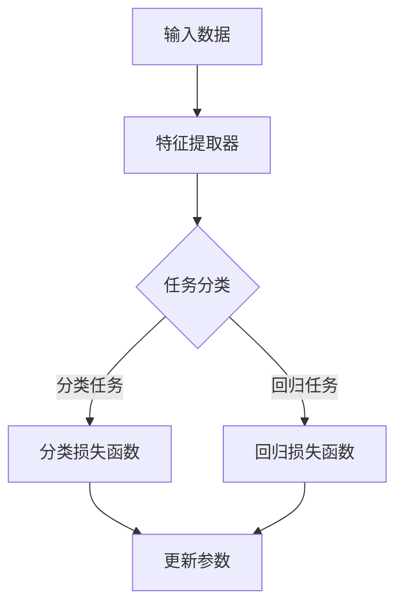

                 

## 引言

### 文章标题：多任务学习在AIGC模型效率提升中的作用

### 关键词：多任务学习、AIGC模型、效率提升、算法优化

在人工智能（AI）技术的迅猛发展过程中，生成对抗网络（GAN）、自然语言处理（NLP）和计算机视觉（CV）等领域的突破性进展为我们带来了前所未有的创新和变革。然而，随着这些技术应用的日益广泛，如何提高模型的训练效率和降低计算成本成为亟待解决的问题。在这一背景下，多任务学习（Multi-Task Learning，MTL）作为一种具有巨大潜力的技术手段，逐渐引起了研究者和开发者的关注。本文将深入探讨多任务学习在自适应信息生成内容（AIGC，Adaptive Information Generation Content）模型效率提升中的重要作用，分析其基本概念、核心原理和应用实践，并总结最佳实践和注意事项。

### 摘要

本文首先概述了多任务学习和AIGC模型的基本概念及其在当前AI领域的地位。接着，详细探讨了多任务学习在AIGC模型中的潜在作用，包括对模型优化、数据利用率和泛化能力的提升。随后，通过算法原理讲解和数学模型阐述，进一步揭示了多任务学习在AIGC模型中的应用机制。本文还结合实际应用案例，展示了多任务学习在AIGC模型中的具体实施方法和效果。最后，本文总结了多任务学习在AIGC模型中的应用最佳实践，并提出了未来研究方向的展望。

## 第一部分：多任务学习与AIGC模型概述

### 第1章：多任务学习的基本概念

#### 1.1.1 多任务学习的定义与背景

多任务学习是一种机器学习范式，旨在同时训练多个相关任务。传统的单任务学习（Single-Task Learning，STL）通常针对单一任务进行模型训练，而多任务学习通过共享模型参数来提高多个任务的性能。这种共享机制可以减少模型的过拟合风险，提高模型的泛化能力。

多任务学习的概念起源于深度学习的早期研究。在深度神经网络中，共享底层特征提取器可以减少参数数量，从而降低计算成本和模型复杂度。随着计算资源和算法的不断发展，多任务学习在自然语言处理、计算机视觉和语音识别等领域得到了广泛应用。

#### 1.1.2 多任务学习的重要性

多任务学习的重要性主要体现在以下几个方面：

1. **提高模型性能**：多任务学习通过共享特征提取器，可以在不同任务之间传递有用的信息，从而提高各个任务的性能。

2. **减少模型复杂度**：共享参数可以减少模型的总参数数量，降低模型的复杂度，提高模型的训练效率。

3. **提高泛化能力**：多任务学习可以使得模型更好地适应不同的任务，提高模型的泛化能力。

4. **节省计算资源**：多任务学习可以减少模型的训练时间，节省计算资源，降低训练成本。

#### 1.1.3 多任务学习的挑战与机遇

尽管多任务学习具有许多优点，但在实际应用中仍面临一些挑战：

1. **任务间不平衡**：不同任务的数据量、复杂度和重要性可能存在差异，导致任务间的不平衡。这种不平衡可能会影响模型的性能。

2. **共享机制设计**：如何设计有效的共享机制，使得各个任务能够充分利用共享的信息，同时保持各自的独立性，是一个重要挑战。

3. **模型参数优化**：多任务学习中的参数优化变得更加复杂，需要设计更加高效的优化算法。

然而，随着AI技术的不断进步，多任务学习也迎来了许多机遇：

1. **数据多样性**：随着数据集的丰富和多样化，多任务学习可以在不同任务之间共享信息，提高模型的泛化能力。

2. **算法创新**：多任务学习激发了新的算法创新，例如基于注意力机制的多任务学习模型，以及基于元学习（Meta-Learning）的多任务学习算法。

3. **应用领域拓展**：多任务学习在医疗、金融、工业等领域的应用潜力巨大，为这些领域提供了更加智能和高效的解决方案。

### 第2章：AIGC模型概述

#### 2.1.1 AIGC模型的概念与特点

自适应信息生成内容（AIGC）模型是一种基于生成对抗网络（GAN）和自然语言处理（NLP）的智能信息生成系统。AIGC模型通过自适应地学习和生成内容，可以实时地创建与用户需求高度相关的信息，从而在内容创作、数据生成、智能推荐等领域具有广泛的应用前景。

AIGC模型的主要特点包括：

1. **自适应学习**：AIGC模型可以根据用户的需求和环境的变化，自适应地调整生成内容，提高内容的个性化程度。

2. **多模态生成**：AIGC模型可以同时处理和生成文本、图像、音频等多种类型的信息，实现跨模态的信息生成。

3. **高效性**：AIGC模型通过生成对抗网络的结构，可以高效地生成高质量的内容，降低生成内容的计算成本。

4. **多样性**：AIGC模型可以通过调整生成策略，生成多样性的内容，满足用户的不同需求。

#### 2.1.2 AIGC模型的发展历程

AIGC模型的发展历程可以追溯到生成对抗网络（GAN）的提出。GAN由Ian Goodfellow等人于2014年提出，是一种基于博弈论的生成模型。随后，随着深度学习和自然语言处理技术的进步，AIGC模型逐渐成为研究热点。

2016年，自然语言处理领域的深度学习模型如BERT、GPT等取得了突破性进展，这些模型为AIGC模型的发展提供了强大的技术支持。2018年，OpenAI发布了GPT-2模型，该模型在文本生成方面展示了强大的能力，引发了人们对AIGC模型的广泛关注。

近年来，随着GAN技术的进一步发展和完善，AIGC模型在图像生成、视频生成和音频生成等领域取得了显著成果。例如，StyleGAN、WaveNet等模型在图像和音频生成方面取得了高质量的结果，为AIGC模型的应用提供了更多的可能性。

#### 2.1.3 AIGC模型的应用领域

AIGC模型在多个领域具有广泛的应用潜力：

1. **内容创作**：AIGC模型可以用于自动化写作、绘画、音乐创作等，为创作者提供灵感和辅助。

2. **数据生成**：AIGC模型可以用于生成高质量的数据集，用于训练和测试机器学习模型，提高模型的泛化能力。

3. **智能推荐**：AIGC模型可以根据用户的历史行为和偏好，生成个性化的推荐内容，提高推荐系统的效果。

4. **虚拟现实**：AIGC模型可以生成虚拟现实场景中的物体和角色，提高虚拟现实体验的逼真度。

5. **医疗健康**：AIGC模型可以用于生成医学影像，辅助医生进行诊断和治疗。

6. **工业制造**：AIGC模型可以用于生成产品设计和制造方案，提高生产效率和产品质量。

### 第3章：多任务学习与AIGC模型的关系

#### 3.1.1 多任务学习在AIGC模型中的潜在作用

多任务学习在AIGC模型中的潜在作用主要体现在以下几个方面：

1. **提高模型性能**：多任务学习可以通过共享特征提取器，使得AIGC模型在多个任务上都能取得较好的性能。

2. **优化数据利用**：AIGC模型通常需要大量的训练数据。通过多任务学习，可以在同一数据集上同时训练多个任务，提高数据的利用效率。

3. **增强泛化能力**：多任务学习可以使得AIGC模型更好地适应不同的任务，提高模型的泛化能力。

4. **节省计算资源**：多任务学习可以减少模型的参数数量，降低计算成本，提高训练效率。

#### 3.1.2 多任务学习对AIGC模型的优化

多任务学习可以对AIGC模型进行以下优化：

1. **参数共享**：通过共享特征提取器，减少模型的参数数量，降低计算复杂度。

2. **模型融合**：将多个任务的预测结果进行融合，提高预测的准确性和鲁棒性。

3. **注意力机制**：通过注意力机制，使得模型可以专注于重要的特征，提高特征提取的效果。

4. **损失函数优化**：设计更加合理的损失函数，使得模型在多个任务上都能取得较好的性能。

#### 3.1.3 多任务学习在AIGC模型中的实际应用

多任务学习在AIGC模型中的实际应用主要包括以下两个方面：

1. **文本生成与分类**：例如，在新闻生成和分类任务中，可以使用多任务学习同时训练文本生成模型和文本分类模型，提高模型的整体性能。

2. **图像生成与分割**：例如，在图像生成和图像分割任务中，可以使用多任务学习同时训练图像生成模型和图像分割模型，提高模型的分割效果。

## 第二部分：多任务学习在AIGC模型中的应用

### 第4章：多任务学习算法原理讲解

#### 4.1.1 多任务学习算法的基本原理

多任务学习算法的基本原理是通过共享模型参数来同时解决多个任务。具体来说，多任务学习算法可以分为两种主要类型：一种是基于模型的共享（Model-Based Shared），另一种是基于数据的共享（Data-Based Shared）。

1. **基于模型的共享**：

   基于模型的共享方法通过共享模型的一部分结构来同时解决多个任务。这种方法的主要优点是参数共享可以提高模型的泛化能力，减少模型的过拟合风险。然而，这种方法也存在一些缺点，如共享部分可能无法充分适应每个任务的特定需求。

2. **基于数据的共享**：

   基于数据的共享方法通过在训练过程中共享数据来同时解决多个任务。这种方法的主要优点是可以充分利用训练数据，提高模型的性能。然而，这种方法也可能导致模型在任务间产生干扰，降低每个任务的性能。

#### 4.1.1.1 多任务学习的目标函数

在多任务学习中，目标函数的设计是一个关键问题。常见的多任务学习目标函数包括以下几种：

1. **加权损失函数**：

   加权损失函数是将每个任务的损失函数进行加权求和，以获得总损失函数。具体公式如下：

   $$L = \sum_{i=1}^{n} w_i \cdot L_i$$

   其中，$L_i$是第$i$个任务的损失函数，$w_i$是第$i$个任务的权重。

2. **一致损失函数**：

   一致损失函数是一种基于模型输出的多任务学习目标函数。其目的是使得模型在多个任务上的输出结果尽可能一致。具体公式如下：

   $$L = \frac{1}{2} \sum_{i=1}^{n} (y_i - \hat{y}_i)^2$$

   其中，$y_i$是第$i$个任务的真实标签，$\hat{y}_i$是第$i$个任务的预测标签。

3. **交叉熵损失函数**：

   交叉熵损失函数是一种常用的多任务学习目标函数，适用于分类任务。其公式如下：

   $$L = -\sum_{i=1}^{n} y_i \cdot \log(\hat{y}_i)$$

   其中，$y_i$是第$i$个任务的真实标签，$\hat{y}_i$是第$i$个任务的预测概率。

#### 4.1.1.2 多任务学习的优化方法

多任务学习的优化方法可以分为两类：基于梯度的优化方法和基于神经网络的优化方法。

1. **基于梯度的优化方法**：

   基于梯度的优化方法通过计算模型参数的梯度来更新参数，以最小化目标函数。常见的梯度优化方法包括随机梯度下降（SGD）、Adam优化器等。

   $$\theta_{t+1} = \theta_t - \alpha \cdot \nabla_\theta L(\theta)$$

   其中，$\theta$是模型参数，$\alpha$是学习率，$\nabla_\theta L(\theta)$是模型参数的梯度。

2. **基于神经网络的优化方法**：

   基于神经网络的优化方法通过神经网络的结构来优化模型参数。常见的神经网络优化方法包括卷积神经网络（CNN）、循环神经网络（RNN）、变换器（Transformer）等。

#### 4.1.2 多任务学习算法的mermaid流程图

以下是一个简单的多任务学习算法的mermaid流程图：

在这个流程图中，输入数据首先通过特征提取器提取特征，然后根据任务分类选择相应的损失函数，最后更新模型参数。

### 第5章：多任务学习在AIGC模型中的数学模型

#### 5.1.1 多任务学习的数学模型

在AIGC模型中，多任务学习的数学模型主要涉及特征提取、任务分类和损失函数的设计。

1. **特征提取**：

   假设输入数据为$x \in \mathbb{R}^{d \times n}$，其中$d$是特征维度，$n$是样本数量。特征提取器可以表示为一个线性变换矩阵$W \in \mathbb{R}^{d \times k}$，其中$k$是特征维度。特征提取过程可以表示为：

   $$h = Wx$$

   其中，$h \in \mathbb{R}^{k \times n}$是提取后的特征。

2. **任务分类**：

   在多任务学习中，任务分类通常使用softmax函数进行分类。假设有$c$个任务，特征提取后的特征$

