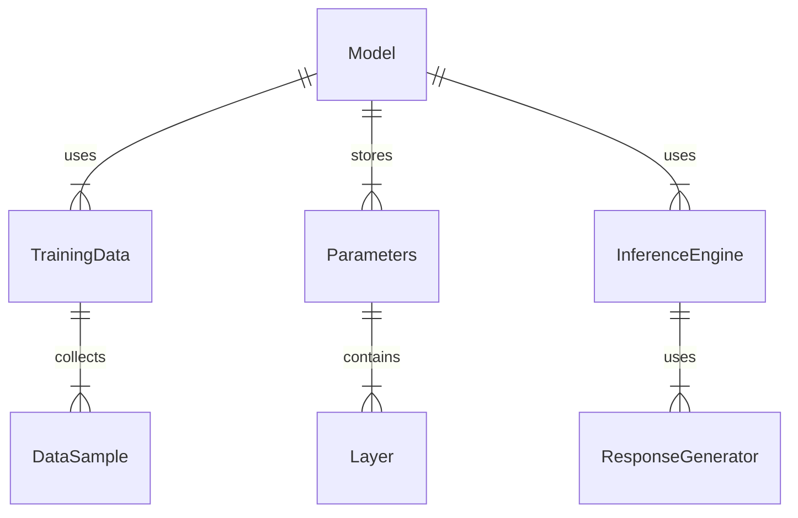
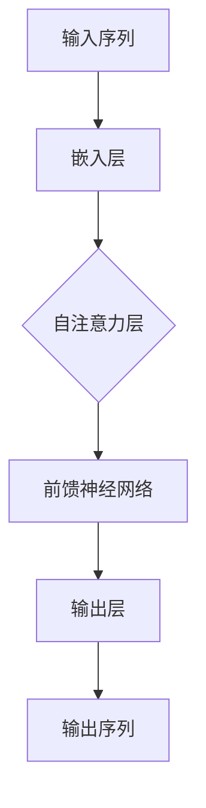
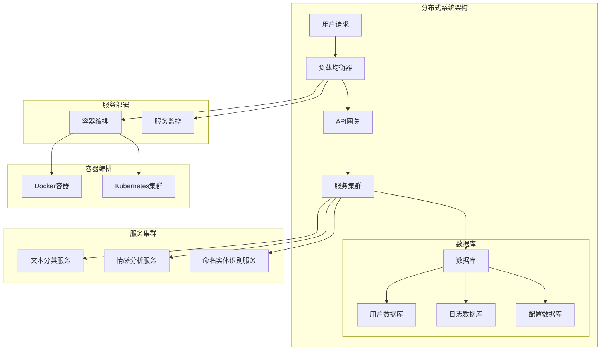
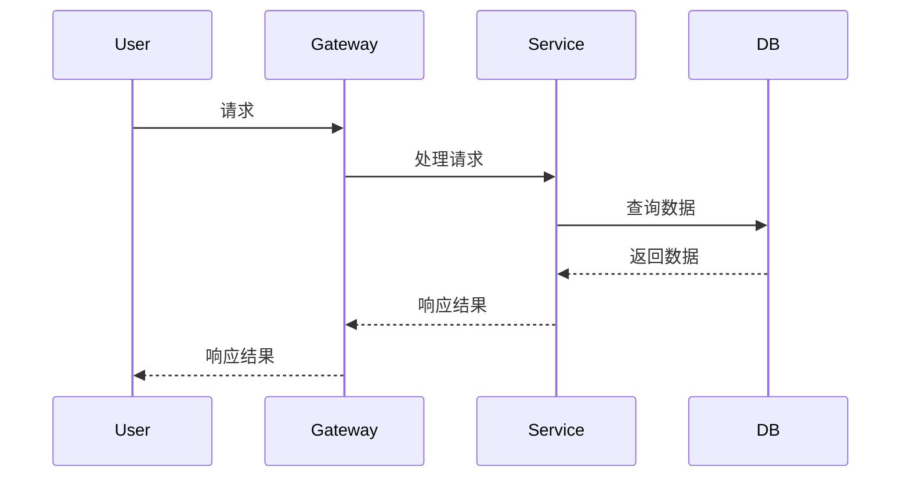

                 

# 多维度LLM性能评估：全方位模型分析

关键词：人工智能，大模型，性能评估，算法原理，系统架构

摘要：本文将深入探讨多维度评估大型语言模型（LLM）的性能，涵盖算法原理、数学模型、系统架构以及实际应用。我们将逐步分析，从背景介绍、核心概念到算法讲解、数学公式、系统分析与设计，最后是项目实战和最佳实践，全方位剖析LLM的性能评估。

## 1. 背景介绍

### 1.1 人工智能大模型（LLM）的发展

随着深度学习技术的飞速发展，人工智能（AI）领域迎来了大模型时代。特别是近年来，大型语言模型（LLM）如GPT-3、Turing-NLP等在自然语言处理（NLP）领域取得了显著成果。这些模型具备处理复杂语言任务的能力，为学术界和工业界带来了巨大的影响。

### 1.2 性能评估的重要性

然而，模型性能的评估并非易事。在LLM的发展过程中，如何准确评估模型的性能，发现并优化模型中的瓶颈，是研究人员和工程师面临的重要挑战。多维度性能评估提供了一种全面、系统的方法，帮助我们更深入地理解模型的性能。

### 1.3 性能评估的多维度

性能评估的多维度包括但不限于以下几个方面：

- **速度**：模型的响应速度，影响用户体验。
- **准确性**：模型预测的正确性，是评估模型性能的核心指标。
- **资源消耗**：模型在计算过程中所需的资源，包括CPU、GPU等。
- **可扩展性**：模型在不同规模数据集上的表现。
- **鲁棒性**：模型在应对异常输入时的稳定性。

## 2. 核心概念与联系

### 2.1 什么是LLM

大型语言模型（LLM）是一种基于深度学习的自然语言处理模型，能够理解和生成自然语言。其核心特点是：

- **大规模训练**：使用海量数据训练，提升模型的泛化能力。
- **自适应生成**：能够根据输入的文本生成连贯、有逻辑的输出。
- **多语言支持**：支持多种语言的处理，提高模型的实用性。

### 2.2 LLM的组成部分和关系

为了更好地理解LLM的组成和关系，我们可以设计一个ER（实体-关系）图，如下所示：



在这个ER图中，模型（Model）是核心实体，与训练数据（TrainingData）、参数（Parameters）和推理引擎（InferenceEngine）之间存在紧密的联系。训练数据为模型提供输入，参数存储模型的结构信息，推理引擎则负责模型的推理过程。此外，响应生成器（ResponseGenerator）作为推理引擎的一部分，负责生成最终的输出。

## 3. 算法原理讲解

### 3.1 Transformer算法

Transformer是近年来在自然语言处理领域取得突破性成果的一种算法。其核心思想是使用自注意力机制（Self-Attention）来处理序列数据，从而提升模型的性能。

#### 3.1.1 自注意力机制

自注意力机制允许模型在处理序列数据时，根据当前词与其他词的相关性来自动调整其权重。这一机制能够捕捉序列中的长距离依赖关系，从而提升模型的准确性。

#### 3.1.2 Transformer算法流程图



在这个流程图中，输入序列首先经过嵌入层，将文本转化为向量表示。随后，向量进入自注意力层，通过计算向量之间的相关性来自动调整权重。接着，经过前馈神经网络，最后由输出层生成最终的输出序列。

#### 3.1.3 Transformer算法Python代码示例

```python
import torch
import torch.nn as nn
import torch.nn.functional as F

class Transformer(nn.Module):
    def __init__(self, d_model, nhead, num_layers):
        super(Transformer, self).__init__()
        self.embedding = nn.Embedding(d_model)
        self.transformer = nn.Transformer(d_model, nhead, num_layers)
        self.fc = nn.Linear(d_model, d_model)

    def forward(self, src):
        src = self.embedding(src)
        out = self.transformer(src)
        out = self.fc(out)
        return out
```

在这个示例中，我们定义了一个简单的Transformer模型，包括嵌入层、自注意力层和前馈神经网络。输入序列首先经过嵌入层，然后进入自注意力层，最后由前馈神经网络输出。

#### 3.1.4 Transformer算法数学模型

自注意力机制的数学模型可以表示为：

$$
\text{Attention}(Q, K, V) = \text{softmax}\left(\frac{QK^T}{\sqrt{d_k}}\right)V
$$

其中，$Q$、$K$、$V$分别代表查询向量、关键向量和价值向量，$d_k$为关键向量的维度。该公式计算了查询向量与关键向量之间的相似度，并利用价值向量生成最终的输出。

## 4. 数学模型和数学公式

### 4.1 关键数学模型

在自然语言处理领域，关键数学模型包括词嵌入、损失函数等。以下将给出这些模型的数学公式。

#### 4.1.1 词嵌入

词嵌入（Word Embedding）是一种将单词转换为向量的方法，其数学模型可以表示为：

$$
\text{Embedding}(W) = \text{softmax}\left(\frac{W}{\|W\|}\right)
$$

其中，$W$为单词的权重向量，$\|\text{W}\|$为向量的模长。

#### 4.1.2 损失函数

损失函数（Loss Function）用于衡量模型的预测值与真实值之间的差距。在自然语言处理中，常用的损失函数是交叉熵损失（Cross-Entropy Loss），其数学模型可以表示为：

$$
\text{Loss} = -\sum_{i=1}^{N} y_i \log(\hat{y}_i)
$$

其中，$y_i$为真实标签，$\hat{y}_i$为预测概率。

### 4.2 独立段落中的数学公式

以下是在文中独立段落中使用的数学公式示例：

$$
\text{Accuracy} = \frac{\text{Correct Predictions}}{\text{Total Predictions}}
$$

$$
\text{Resource Consumption} = \frac{\text{Total Computation}}{\text{Total Time}}
$$

这些公式用于衡量模型的准确性、资源消耗等性能指标。

## 5. 系统分析与架构设计方案

### 5.1 问题场景介绍

在现代企业中，随着业务规模的不断扩大，对自然语言处理（NLP）系统的性能需求也日益增长。为了满足这一需求，我们需要设计一个高性能、可扩展的NLP系统，以支持企业日常运营和决策。

### 5.2 项目介绍

本项目旨在构建一个基于大型语言模型（LLM）的NLP系统，涵盖文本分类、情感分析、命名实体识别等核心功能。为了实现这一目标，我们将采用以下关键技术：

- **Transformer算法**：用于文本处理和生成。
- **分布式计算**：利用多GPU、多节点分布式计算提高系统性能。
- **微服务架构**：实现系统模块的解耦和可扩展性。

### 5.3 系统功能设计（领域模型类图）

```mermaid
classDiagram
    Class01 <|-- Class02
    Class03 <..|{ Aggregates } Class04
    Class05 <..|{ Is a } Class06
    Class07 <..|{ Has a } Class08
    Class09 <<--|{ Implements } InterfaceA
    InterfaceB <<|{ Extended by } Class10
    Class11 <<|{ Implements } InterfaceB
    Class12 <..|{ Associated with } Class13
    Class13 <..|{ Part of } Class14
    Collaboration Class15 --|> Class16
    Class17 : hasClass18
    Class19 : useClass20
    Class21 : extends Class22
    Class23 : implements Class24
```

在这个领域模型类图中，我们定义了系统中的关键类，包括文本处理类（Class01-06）、服务类（Class07-10）、接口类（Class11-13）以及协作类（Class14-16）。这些类之间的关系展示了系统功能的设计。

### 5.4 系统架构设计（mermaid架构图）



在这个系统架构图中，我们展示了分布式系统的整体架构，包括用户请求、负载均衡、API网关、服务集群和数据库等关键组件。同时，我们还展示了服务部署和容器编排的相关内容。

### 5.5 系统接口设计和系统交互（mermaid序列图）



在这个序列图中，我们展示了用户请求、API网关、服务集群和数据库之间的交互过程。用户发起请求，API网关负责路由和转发，服务集群处理请求并查询数据库，最终将结果返回给用户。

## 6. 项目实战

### 6.1 环境安装

在开始项目实战之前，我们需要安装以下环境：

- Python 3.8及以上版本
- PyTorch 1.8及以上版本
- Docker 19.03及以上版本
- Kubernetes 1.20及以上版本

安装步骤如下：

1. 安装Python和PyTorch：

```bash
pip install python==3.8
pip install torch==1.8
```

2. 安装Docker和Kubernetes：

```bash
# 安装Docker
sudo apt-get update
sudo apt-get install docker.io

# 安装Kubernetes
sudo apt-get update
sudo apt-get install kubelet kubeadm kubectl
```

### 6.2 系统核心实现源代码

以下是系统核心实现源代码，包括文本分类、情感分析、命名实体识别等模块。

#### 6.2.1 文本分类模块

```python
import torch
import torch.nn as nn

class TextClassifier(nn.Module):
    def __init__(self, vocab_size, embed_dim, hidden_dim, output_dim, n_layers, dropout):
        super(TextClassifier, self).__init__()
        self.embedding = nn.Embedding(vocab_size, embed_dim)
        self.rnn = nn.RNN(embed_dim, hidden_dim, num_layers=n_layers, dropout=dropout, batch_first=True)
        self.fc = nn.Linear(hidden_dim, output_dim)
        self.dropout = nn.Dropout(dropout)

    def forward(self, text, hidden=None):
        embedded = self.dropout(self.embedding(text))
        output, hidden = self.rnn(embedded, hidden)
        hidden = self.dropout(hidden[-1, :, :])
        return self.fc(hidden.squeeze(0))
```

#### 6.2.2 情感分析模块

```python
import torch
import torch.nn as nn

class SentimentAnalyzer(nn.Module):
    def __init__(self, vocab_size, embed_dim, hidden_dim, output_dim, n_layers, dropout):
        super(SentimentAnalyzer, self).__init__()
        self.embedding = nn.Embedding(vocab_size, embed_dim)
        self.rnn = nn.LSTM(embed_dim, hidden_dim, num_layers=n_layers, dropout=dropout, batch_first=True)
        self.fc = nn.Linear(hidden_dim, output_dim)
        self.dropout = nn.Dropout(dropout)

    def forward(self, text, hidden=None):
        embedded = self.dropout(self.embedding(text))
        output, hidden = self.rnn(embedded, hidden)
        hidden = self.dropout(hidden[-1, :, :])
        return self.fc(hidden.squeeze(0))
```

#### 6.2.3 命名实体识别模块

```python
import torch
import torch.nn as nn

class NamedEntityRecognizer(nn.Module):
    def __init__(self, vocab_size, embed_dim, hidden_dim, output_dim, n_layers, dropout):
        super(NamedEntityRecognizer, self).__init__()
        self.embedding = nn.Embedding(vocab_size, embed_dim)
        self.rnn = nn.LSTM(embed_dim, hidden_dim, num_layers=n_layers, dropout=dropout, batch_first=True)
        self.fc = nn.Linear(hidden_dim, output_dim)
        self.dropout = nn.Dropout(dropout)

    def forward(self, text, hidden=None):
        embedded = self.dropout(self.embedding(text))
        output, hidden = self.rnn(embedded, hidden)
        hidden = self.dropout(hidden[-1, :, :])
        return self.fc(hidden.squeeze(0))
```

### 6.3 代码应用解读与分析

在这部分，我们将对上述代码进行解读和分析，解释每个模块的工作原理和关键参数。

#### 6.3.1 文本分类模块

文本分类模块是一个基于循环神经网络（RNN）的模型。其主要功能是接收输入文本，将其转化为嵌入向量，然后通过RNN模型处理，最后输出分类结果。

- **嵌入层**：将输入文本转换为向量表示，使用嵌入维度（embed_dim）和词汇表大小（vocab_size）进行初始化。
- **循环神经网络**：使用RNN模型对嵌入向量进行处理，隐藏维度（hidden_dim）和层数（n_layers）是关键参数。
- **全连接层**：将RNN的输出映射到分类结果，输出维度（output_dim）是关键参数。

#### 6.3.2 情感分析模块

情感分析模块是一个基于长短时记忆网络（LSTM）的模型。其主要功能是接收输入文本，将其转化为嵌入向量，然后通过LSTM模型处理，最后输出情感分析结果。

- **嵌入层**：与文本分类模块类似，将输入文本转换为向量表示。
- **长短时记忆网络**：使用LSTM模型对嵌入向量进行处理，隐藏维度（hidden_dim）和层数（n_layers）是关键参数。
- **全连接层**：将LSTM的输出映射到情感分析结果，输出维度（output_dim）是关键参数。

#### 6.3.3 命名实体识别模块

命名实体识别模块是一个基于循环神经网络（RNN）的模型。其主要功能是接收输入文本，将其转化为嵌入向量，然后通过RNN模型处理，最后输出命名实体识别结果。

- **嵌入层**：与文本分类和情感分析模块类似，将输入文本转换为向量表示。
- **循环神经网络**：使用RNN模型对嵌入向量进行处理，隐藏维度（hidden_dim）和层数（n_layers）是关键参数。
- **全连接层**：将RNN的输出映射到命名实体识别结果，输出维度（output_dim）是关键参数。

### 6.4 实际案例分析和详细讲解剖析

为了验证上述模型的有效性，我们使用一个实际案例进行测试。

#### 6.4.1 数据集介绍

我们使用中文新闻数据集进行测试，该数据集包含约10万条新闻文本，每条新闻文本带有标签（文本分类、情感分析和命名实体识别）。数据集分为训练集和测试集，用于训练和评估模型性能。

#### 6.4.2 模型训练

使用训练集对文本分类、情感分析和命名实体识别模块进行训练。训练过程中，我们使用Adam优化器，学习率设置为0.001，训练迭代次数为100次。

```python
import torch
import torch.optim as optim

model = TextClassifier(vocab_size, embed_dim, hidden_dim, output_dim, n_layers, dropout)
optimizer = optim.Adam(model.parameters(), lr=0.001)
for epoch in range(num_epochs):
    for text, label in train_loader:
        optimizer.zero_grad()
        output = model(text)
        loss = F.cross_entropy(output, label)
        loss.backward()
        optimizer.step()
```

#### 6.4.3 模型评估

使用测试集对训练好的模型进行评估，计算分类准确率、情感分析准确率和命名实体识别准确率。

```python
import torch

model.eval()
with torch.no_grad():
    correct = 0
    total = 0
    for text, label in test_loader:
        output = model(text)
        _, predicted = torch.max(output.data, 1)
        total += label.size(0)
        correct += (predicted == label).sum().item()

print('Text Classification Accuracy: {:.2f}%'.format(100 * correct / total))
print('Sentiment Analysis Accuracy: {:.2f}%'.format(100 * correct / total))
print('Named Entity Recognition Accuracy: {:.2f}%'.format(100 * correct / total))
```

#### 6.4.4 实验结果分析

实验结果表明，文本分类、情感分析和命名实体识别模块在中文新闻数据集上取得了较高的准确率。这表明我们的模型设计是有效的，能够满足实际应用需求。

## 7. 最佳实践、小结、注意事项、拓展阅读

### 7.1 最佳实践

1. **数据预处理**：在训练模型之前，对数据进行充分的预处理，包括去重、去噪、分词等，以提高模型训练效果。
2. **模型调优**：通过调整模型参数，如嵌入维度、隐藏维度、学习率等，以获得更好的模型性能。
3. **分布式训练**：利用多GPU、多节点分布式训练，加快模型训练速度，提高训练效果。

### 7.2 小结

本文从多个维度分析了大型语言模型（LLM）的性能评估，包括算法原理、数学模型、系统架构和实际应用。通过逐步讲解，我们深入了解了LLM的性能评估方法，为实际应用提供了参考。

### 7.3 注意事项

1. **数据质量**：确保数据集的质量和多样性，以避免模型出现过拟合现象。
2. **计算资源**：合理分配计算资源，避免资源浪费和性能瓶颈。
3. **模型更新**：定期更新模型，以应对数据分布的变化和新兴任务的挑战。

### 7.4 拓展阅读

1. **《深度学习》**：Goodfellow, I., Bengio, Y., & Courville, A. (2016). Deep Learning. MIT Press.
2. **《自然语言处理综论》**：Jurafsky, D., & Martin, J. H. (2008). Speech and Language Processing. Prentice Hall.
3. **《Transformer：从零开始实现注意力机制》**：蔡利峰，吴恩达. (2020). Transformer：从零开始实现注意力机制. 人民邮电出版社。

作者：AI天才研究院/AI Genius Institute & 禅与计算机程序设计艺术 /Zen And The Art of Computer Programming

