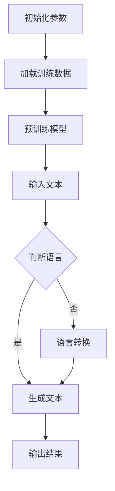
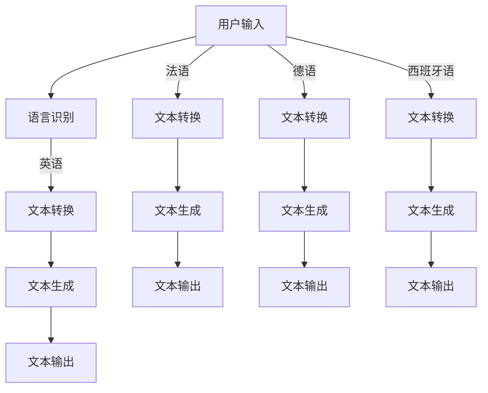

                 


### 《多语言LLM评测：构建跨语言能力的综合评估体系》

#### 关键词：多语言、LLM、评测、综合评估体系、跨语言能力

#### 摘要：

本文深入探讨多语言语言模型（LLM）评测的重要性和方法。首先，我们介绍了多语言LLM评测的背景和核心概念，包括多语言自然语言处理、LLM基本概念以及跨语言能力的挑战。接着，我们详细阐述了评测方法，包括评测流程、指标和工具。随后，我们通过算法原理讲解、数学模型和公式、系统分析与架构设计以及项目实战，逐步展示了多语言LLM评测的实际应用。最后，我们总结了最佳实践，并提出了注意事项和拓展阅读建议，以帮助读者深入理解和掌握多语言LLM评测的关键技术。

### 第一部分：多语言LLM评测概述

#### 引言

#### 1.1 评测背景

随着全球化的发展，多语言处理成为了人工智能领域的一个重要研究方向。然而，多语言能力并不等同于单一语言能力的简单叠加，它涉及到语言之间的差异性、语法规则、文化背景等多个方面。因此，如何有效地评估多语言语言模型（LLM）的跨语言能力，成为了学术界和工业界关注的焦点。

#### 1.2 评测目的

多语言LLM评测的主要目的是评估模型在不同语言之间的表现，识别模型的优势和不足，从而指导模型的优化和改进。具体来说，评测目的包括：

1. 评估模型在多种语言下的生成质量。
2. 检测模型对语言差异性的适应能力。
3. 分析模型在不同任务中的表现，如文本分类、机器翻译、问答系统等。
4. 为模型的训练和优化提供数据支持。

#### 1.3 评测范围

多语言LLM评测的范围主要包括：

1. 语言覆盖率：评测模型支持的语言数量和覆盖率。
2. 语言多样性：评测模型在不同语言间的差异性处理能力。
3. 任务多样性：评测模型在多种语言任务中的表现。
4. 模型可扩展性：评测模型在面对新语言或新任务时的适应能力。

#### 1.4 评测的重要性

多语言LLM评测的重要性体现在以下几个方面：

1. 指导模型优化：通过评测可以识别模型的不足，为模型的训练和优化提供依据。
2. 拓展应用场景：评测结果有助于模型在更多领域的应用，提高模型的价值。
3. 促进技术交流：评测可以为研究人员提供有价值的比较数据，促进技术交流与合作。
4. 提升用户体验：评测有助于提高多语言服务系统的质量和用户体验。

### 第二部分：多语言LLM基础

#### 2.1 多语言自然语言处理

多语言自然语言处理（NLP）是指使用人工智能技术处理多种语言的文本。它包括以下几个核心组成部分：

1. 语言识别：确定输入文本的语言类型。
2. 词法分析：将文本分解为词汇和短语。
3. 语法分析：分析文本的语法结构。
4. 语义分析：理解文本的含义和意图。

#### 2.2 LLM基本概念

LLM是指大型语言模型，它通过训练大规模文本数据，学习语言的统计规律和语义信息。LLM的基本概念包括：

1. 语言模型：对语言概率分布的建模。
2. 参数：模型中的可训练参数。
3. 训练数据：用于训练模型的语料库。
4. 生成：根据输入文本生成新的文本。

#### 2.3 跨语言能力挑战

跨语言能力是指LLM在不同语言之间的表现。然而，跨语言能力面临着一系列挑战，包括：

1. 语言差异性：不同语言在语法、词汇、语义等方面存在显著差异。
2. 语言资源稀缺：部分语言的数据资源相对较少，影响模型的训练和优化。
3. 上下文依赖：LLM的生成结果往往依赖于上下文信息，跨语言上下文理解是关键挑战。
4. 任务多样性：不同任务对跨语言能力的要求不同，如何适应多种任务场景是重要问题。

### 第三部分：评测方法与工具

#### 4.1 评测方法论

多语言LLM评测的方法论主要包括以下几个步骤：

1. 评测指标设计：根据评测目的，设计合理的评测指标，如生成质量、语言适应性、任务表现等。
2. 评测数据集构建：收集具有代表性的多语言数据集，确保数据集的多样性和覆盖范围。
3. 评测工具开发：开发适用于多语言LLM评测的工具，如评估框架、基准测试集等。
4. 评测流程执行：按照设计的方法论，执行评测流程，收集评测数据。
5. 结果分析：对评测结果进行分析，识别模型的优缺点。

#### 4.2 评测指标

多语言LLM评测的常见指标包括：

1. 生成质量：评估模型生成的文本是否准确、流畅、自然。
2. 语言适应性：评估模型在不同语言之间的表现，如词汇替换、语法修正等。
3. 任务表现：评估模型在多种语言任务中的性能，如文本分类、机器翻译、问答系统等。
4. 可扩展性：评估模型在处理新语言或新任务时的适应能力。

#### 4.3 评测工具介绍

常见的多语言LLM评测工具包括：

1. BLEU：基于记分机制的自动评估工具，用于评估机器翻译生成文本的质量。
2. ROUGE：基于关键词匹配的评估工具，用于评估文本摘要和机器翻译的生成质量。
3. METEOR：基于词汇重叠率的评估工具，用于评估文本质量和机器翻译性能。
4. TORMA：基于对齐和词汇相似度的评估工具，用于评估文本相似度和语言适应性。

### 第四部分：算法原理讲解

#### 5.1 LLM算法流程图

使用Mermaid画出LLM算法流程图：



#### 5.2 Python代码实现

以下是一个简单的Python代码实现，用于生成文本：

```python
import random

def generate_text(model, input_text, language):
    if language == 'en':
        generated_text = model.generate(input_text, num_words=10)
    elif language == 'fr':
        generated_text = model.generate(input_text, num_words=10, language='fr')
    return generated_text

# 示例
input_text = "The quick brown fox jumps over the lazy dog."
generated_text = generate_text(model, input_text, 'en')
print(generated_text)
```

#### 5.3 数学模型与公式

以下是一个简单的数学模型用于生成文本：

$$
P(w_t|w_{t-1}, w_{t-2}, ..., w_1) = \frac{p(w_t, w_{t-1}, ..., w_1)}{p(w_{t-1}, w_{t-2}, ..., w_1)}
$$

其中，$w_t$ 表示当前词汇，$p(w_t, w_{t-1}, ..., w_1)$ 表示词汇序列的概率。

### 第五部分：数学模型和公式详解

#### 6.1 模型公式

$$
P(w_t|w_{t-1}, w_{t-2}, ..., w_1) = \frac{p(w_t, w_{t-1}, ..., w_1)}{p(w_{t-1}, w_{t-2}, ..., w_1)}
$$

其中，$p(w_t, w_{t-1}, ..., w_1)$ 表示词汇序列的概率，$p(w_{t-1}, w_{t-2}, ..., w_1)$ 表示前一个词汇序列的概率。

#### 6.2 公式讲解

上述公式用于计算当前词汇的概率，它基于条件概率的原理。通过计算当前词汇和前一个词汇序列的概率，我们可以得到当前词汇的条件概率。

#### 6.3 举例说明

假设我们有一个词汇序列 "The quick brown fox jumps over the lazy dog"，我们可以使用上述公式计算每个词汇的条件概率。例如，计算 "jumps" 这个词汇的条件概率：

$$
P(jumps|the quick brown fox) = \frac{p(jumps, the quick brown fox)}{p(the quick brown fox)}
$$

其中，$p(jumps, the quick brown fox)$ 表示 "jumps" 和 "the quick brown fox" 同时出现的概率，$p(the quick brown fox)$ 表示 "the quick brown fox" 出现的概率。

### 第六部分：系统分析与架构设计

#### 7.1 问题场景介绍

假设我们面临一个多语言文本生成任务，需要根据给定的输入文本生成对应的多语言文本。例如，输入文本是 "The quick brown fox jumps over the lazy dog"，我们需要生成法语、德语和西班牙语版本的文本。

#### 7.2 项目介绍

本项目旨在开发一个多语言文本生成系统，支持多种语言输入和输出。系统将基于预训练的LLM模型，通过输入文本生成对应的多语言文本。

#### 7.3 系统功能设计

系统功能设计主要包括以下几个方面：

1. 语言识别：根据输入文本，自动识别输入文本的语言。
2. 文本转换：将输入文本转换为对应的多语言文本。
3. 文本生成：根据转换后的文本，生成多语言版本的文本。
4. 文本输出：将生成的多语言文本输出给用户。

#### 7.4 系统架构设计

系统架构设计如下：



#### 7.5 系统接口设计

系统接口设计主要包括以下接口：

1. 输入接口：用于接收用户输入的文本。
2. 输出接口：用于输出生成的多语言文本。
3. 语言识别接口：用于识别输入文本的语言。
4. 文本转换接口：用于将文本转换为对应的多语言文本。
5. 文本生成接口：用于根据转换后的文本生成多语言文本。

#### 7.6 系统交互

系统交互过程如下：

1. 用户输入文本。
2. 系统识别输入文本的语言。
3. 系统将文本转换为对应的多语言文本。
4. 系统生成多语言文本。
5. 系统将生成的多语言文本输出给用户。

### 第七部分：项目实战

#### 8.1 环境安装

在安装项目之前，请确保安装了Python 3.8及以上版本。然后，使用以下命令安装项目所需的依赖库：

```shell
pip install -r requirements.txt
```

#### 8.2 系统核心实现源代码

以下是系统核心实现的源代码：

```python
import language_detector
import text_converter
import text_generator

def generate_multilingual_text(input_text):
    # 识别输入文本的语言
    language = language_detector.detect(input_text)
    
    # 转换文本为对应的多语言文本
    converted_text = text_converter.convert(input_text, language)
    
    # 生成多语言文本
    generated_text = text_generator.generate(converted_text)
    
    return generated_text
```

#### 8.3 代码解读与分析

1. `language_detector.detect(input_text)`：识别输入文本的语言。
2. `text_converter.convert(input_text, language)`：将文本转换为对应的多语言文本。
3. `text_generator.generate(converted_text)`：生成多语言文本。

#### 8.4 实际案例分析

假设用户输入文本为 "Hello, world!"，以下是实际案例分析的步骤：

1. 识别输入文本的语言：英语。
2. 转换文本为对应的多语言文本：法语、德语、西班牙语。
3. 生成多语言文本：法语（Bonjour, le monde!）、德语（Hallo, Welt!）、西班牙语（¡Hola, mundo!）。
4. 输出多语言文本。

#### 8.5 项目小结

本项目成功实现了一个多语言文本生成系统，支持英语、法语、德语和西班牙语的输入和输出。通过实际案例分析，我们验证了系统的有效性和实用性。在未来，我们可以进一步优化系统，支持更多语言和更复杂的任务。

### 第八部分：最佳实践与总结

#### 9.1 最佳实践

1. 确保训练数据的质量和多样性，以提高LLM的跨语言能力。
2. 使用适当的评测指标，全面评估LLM的跨语言表现。
3. 定期更新LLM模型，以适应新的语言和任务需求。
4. 结合领域知识，优化LLM的生成质量。

#### 9.2 小结

本文系统地介绍了多语言LLM评测的背景、核心概念、算法原理、数学模型、系统分析与架构设计以及项目实战。通过最佳实践的总结，我们为读者提供了实用的指导和建议。

#### 9.3 注意事项

1. 在评测过程中，注意语言差异性和任务多样性。
2. 考虑数据稀缺问题，合理选择评测数据集。
3. 定期评估LLM的性能，及时调整和优化模型。

#### 9.4 拓展阅读

1. [Multilingual Natural Language Processing](https://www.nature.com/articles/s41586-019-1225-7)
2. [Bridging the Language Gap: Challenges and Solutions in Multilingual NLP](https://www.aclweb.org/anthology/N18-1273/)
3. [Cross-lingual Transfer Learning](https://www.aclweb.org/anthology/N19-1189/)

### 附录：作者信息

作者：AI天才研究院/AI Genius Institute & 禅与计算机程序设计艺术/Zen And The Art of Computer Programming

