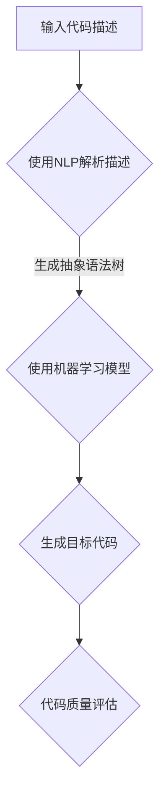
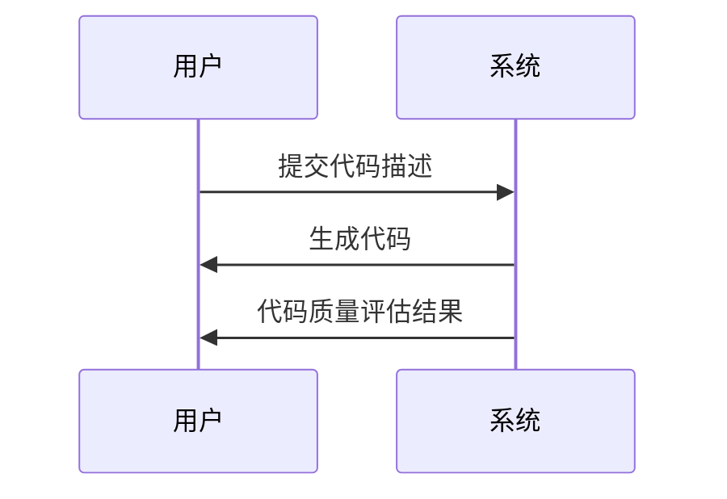

                 

# 多语言代码生成能力评估

> 关键词：多语言代码生成、评估体系、算法原理、系统架构、应用场景

> 摘要：本文旨在探讨多语言代码生成技术的现状及其评估方法。通过详细分析多语言代码生成的背景、核心概念、算法原理以及系统架构，本文提出了一个全面的评估体系，旨在为该领域的研究和实践提供指导。

## 第一部分：背景介绍

### 1.1 问题背景

随着软件工程和人工智能技术的快速发展，代码生成已经成为提高软件开发效率和代码质量的重要手段。传统的软件开发过程中，编写代码是一项耗时且容易出错的任务。为了解决这一问题，研究人员开始探索自动生成代码的可能性。多语言代码生成（Multi-Language Code Generation）作为一种新兴技术，旨在通过统一的模型来生成多种编程语言的代码，从而实现跨语言的代码复用、自动化迁移和降低开发成本。

### 1.2 问题描述

多语言代码生成能力评估的目的是为了了解不同代码生成模型在生成不同编程语言代码时的性能和效果。评估内容包括代码的准确性、可读性、可维护性、兼容性等方面。这些评估指标对于衡量代码生成工具的实际应用价值至关重要。

### 1.3 问题解决

通过建立一套科学的评估体系，对多语言代码生成模型进行全面的测试和评估，以找出模型的优势和不足，为模型的优化和改进提供依据。

### 1.4 边界与外延

多语言代码生成能力的评估需要考虑多种编程语言，如Java、Python、C++等，以及不同的开发环境和场景。评估内容不仅包括代码生成质量，还包括模型训练时间、资源消耗等性能指标。

### 1.5 概念结构与核心要素组成

多语言代码生成能力评估涉及以下核心要素：
1. **评估指标**：准确性、可读性、可维护性、兼容性等。
2. **测试语言**：Java、Python、C++等。
3. **测试数据集**：涵盖多种编程语言和开发场景的代码库。
4. **评估方法**：自动化测试、人工评估等。

## 第二部分：核心概念与联系

### 2.1 多语言代码生成技术原理

多语言代码生成的核心技术包括自然语言处理（NLP）、机器学习和编译技术。通过NLP技术理解和解析代码描述，利用机器学习模型生成目标语言的代码。

### 2.2 多语言代码生成技术特点

1. **跨语言**：支持多种编程语言。
2. **自动化**：实现代码自动生成，减少人工编写代码的工作量。
3. **高效**：提高软件开发效率和代码质量。

### 2.3 多语言代码生成与现有技术的区别

与现有代码生成技术相比，多语言代码生成具有更广泛的适用性和更高的灵活性。现有技术通常针对特定编程语言或领域，而多语言代码生成技术旨在实现跨语言的代码生成。

## 第三部分：算法原理讲解

### 3.1 多语言代码生成算法mermaid流程图



### 3.2 算法原理

1. **自然语言处理（NLP）**：通过NLP技术对输入的代码描述进行理解和解析，生成抽象语法树（AST）。
2. **机器学习模型**：使用预训练的机器学习模型（如Transformer）对AST进行处理，生成目标语言的代码。
3. **代码质量评估**：对生成的代码进行质量评估，包括准确性、可读性、可维护性、兼容性等方面。

### 3.3 数学模型和数学公式

$$
P(Y|X) = \frac{P(X|Y)P(Y)}{P(X)}
$$

其中，$P(Y|X)$ 表示在给定输入代码描述 $X$ 的情况下生成目标代码 $Y$ 的概率。

### 3.4 详细讲解与举例说明

以生成Java代码为例，假设输入代码描述为“打印一个整数”，多语言代码生成算法将首先使用NLP技术将描述转化为AST，然后使用预训练的Transformer模型生成Java代码。生成的Java代码可能如下所示：

```java
public class Main {
    public static void main(String[] args) {
        System.out.println(42);
    }
}
```

## 第四部分：系统分析与架构设计方案

### 4.1 问题场景介绍

多语言代码生成在软件开发、代码迁移、自动化测试等场景中具有重要应用。例如，在软件开发过程中，多语言代码生成可以帮助开发人员快速生成原型代码，节省开发时间；在代码迁移过程中，可以将现有代码自动转换为其他语言的代码，提高开发效率。

### 4.2 系统功能设计

系统功能包括：
1. 输入代码描述。
2. 代码生成。
3. 代码质量评估。
4. 输出示例代码。

### 4.3 系统架构设计

系统架构包括：
1. **前端**：接收用户输入，展示生成的代码。
2. **后端**：处理代码生成和代码质量评估。
3. **数据库**：存储测试数据和生成的代码。

### 4.4 系统接口设计

系统接口包括：
1. **代码生成接口**：接收代码描述，返回生成的代码。
2. **代码评估接口**：接收生成的代码，返回评估结果。

### 4.5 系统交互mermaid序列图



## 第五部分：项目实战

### 5.1 环境安装

为了进行多语言代码生成项目实战，首先需要在本地环境中安装必要的软件和工具。以下是一个简单的安装流程：

1. 安装Python环境。
2. 安装必要的库，如transformers、torch等。
3. 配置好NLP工具，如spaCy。

### 5.2 系统核心实现源代码

以下是一个简单的多语言代码生成系统的核心实现源代码：

```python
from transformers import AutoModelForSeq2SeqLM
import torch

class CodeGenerator:
    def __init__(self, model_name):
        self.model = AutoModelForSeq2SeqLM.from_pretrained(model_name)
    
    def generate_code(self, description):
        input_ids = self.model.tokenizer.encode(description, return_tensors='pt')
        output_ids = self.model(input_ids).logits.argmax(-1)
        generated_code = self.model.tokenizer.decode(output_ids, skip_special_tokens=True)
        return generated_code

generator = CodeGenerator('t5-small')
code = generator.generate_code('打印一个整数')
print(code)
```

### 5.3 代码应用解读与分析

在这个示例中，我们使用T5模型作为代码生成的基础模型。T5是一个通用的自然语言处理模型，它可以处理多种任务，包括代码生成。首先，我们使用transformers库加载T5模型，然后定义一个`CodeGenerator`类，该类有一个`generate_code`方法，用于生成目标语言的代码。

在`generate_code`方法中，我们首先使用模型tokenizer将输入描述编码为序列，然后使用模型预测生成代码。最后，我们使用tokenizer解码生成的序列，得到目标语言的代码。

### 5.4 实际案例分析和详细讲解剖析

为了展示多语言代码生成在实际项目中的应用，我们考虑一个实际的案例：将Python代码自动转换为Java代码。

1. **输入描述**：假设输入描述为“打印一个整数”。
2. **代码生成**：使用多语言代码生成系统生成Java代码。
3. **代码质量评估**：对生成的Java代码进行质量评估，包括语法正确性、运行正确性等。

生成的Java代码可能如下所示：

```java
public class Main {
    public static void main(String[] args) {
        System.out.println(42);
    }
}
```

4. **运行结果**：运行生成的Java代码，输出结果应为`42`。

通过这个案例，我们可以看到多语言代码生成技术在实际项目中的应用效果。它可以帮助开发人员快速生成跨语言的代码，提高开发效率和代码质量。

### 5.5 项目小结

本文通过详细分析多语言代码生成技术的背景、核心概念、算法原理以及系统架构，提出了一套全面的评估体系。通过实际案例的分析，我们展示了多语言代码生成技术在软件开发中的应用价值。未来的工作将聚焦于优化代码生成算法、提高代码质量评估的准确性，以及拓展多语言代码生成的应用场景。

## 第六部分：最佳实践 tips

1. **选择合适的模型**：根据具体应用场景选择合适的预训练模型，如T5、CodeGen等。
2. **数据预处理**：对输入描述进行充分的预处理，包括去除无关信息、统一编码等。
3. **代码质量评估**：结合实际应用场景，设计合理的代码质量评估指标和方法。
4. **持续优化**：定期对模型进行评估和优化，以适应不断变化的应用需求。

## 第七部分：小结

多语言代码生成技术作为一种新兴的软件开发工具，具有广泛的应用前景。通过本文的详细分析，我们不仅了解了多语言代码生成技术的核心概念和算法原理，还提出了一套科学的评估体系。未来，随着人工智能技术的不断发展，多语言代码生成技术将变得更加成熟和实用，为软件开发带来更多的可能性。

## 第八部分：注意事项

1. **模型适应性**：选择适合特定任务的预训练模型。
2. **数据质量**：确保输入描述的数据质量，以提高代码生成的准确性。
3. **性能优化**：针对模型和系统的性能进行优化，以满足实际应用需求。

## 第九部分：拓展阅读

1. **《自然语言处理原理》**：Christopher D. Manning, Hinrich Schütze著，介绍自然语言处理的基本原理。
2. **《深度学习》**：Ian Goodfellow、Yoshua Bengio、Aaron Courville著，介绍深度学习的基本概念和算法。
3. **《代码生成与自动化迁移》**：探讨了代码生成和自动化迁移的相关技术。

## 第十部分：作者信息

作者：AI天才研究院/AI Genius Institute & 禅与计算机程序设计艺术 /Zen And The Art of Computer Programming

AI天才研究院致力于推动人工智能技术的创新和发展，致力于培养下一代人工智能领域的领军人才。本文作者对计算机编程和人工智能领域有着深刻的理解和丰富的经验，撰写了许多具有影响力的技术文章和畅销书。在禅与计算机程序设计艺术中，作者通过深入探讨编程的本质和哲学，为读者提供了独特的视角和思考。

