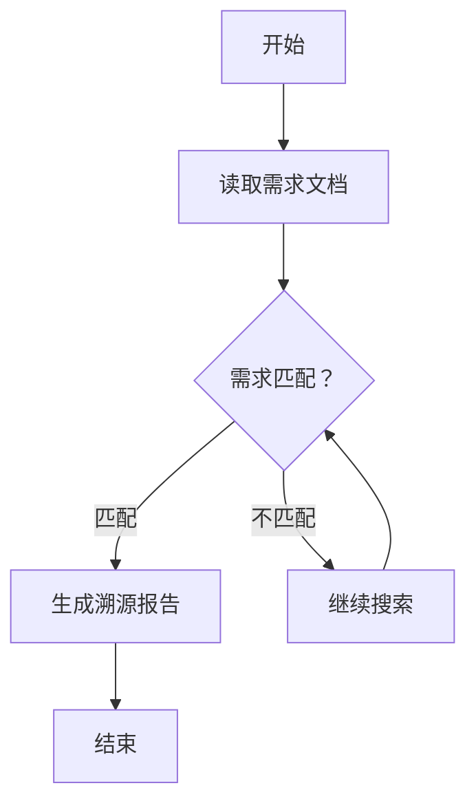
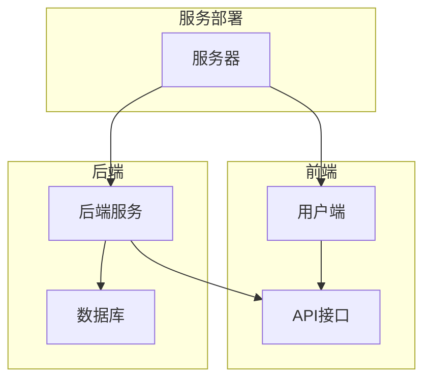
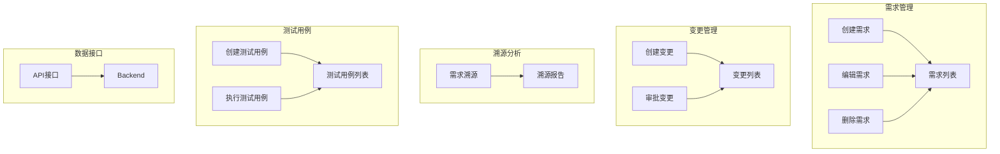
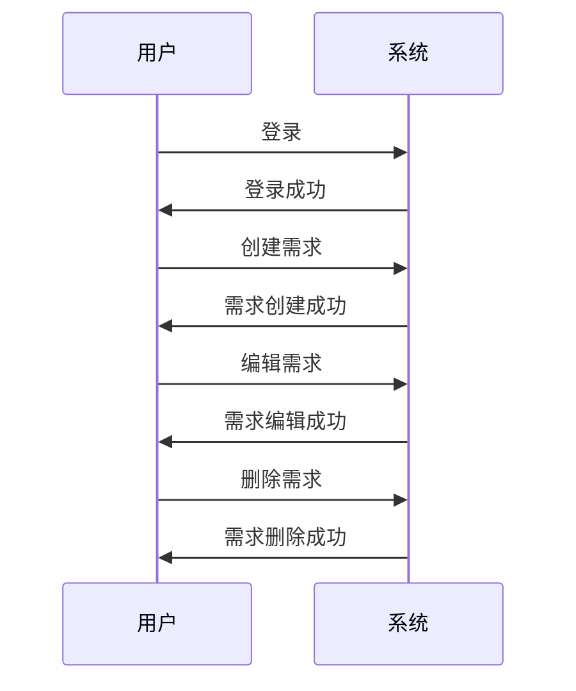

                 


### 1.2.3 需求溯源的概念结构与核心要素

需求溯源是一个复杂的过程，它涉及到多个层面和要素。为了更好地理解和应用需求溯源技术，我们需要明确其概念结构与核心要素。

#### 概念结构

需求溯源的概念结构主要包括以下几个部分：

1. **需求**：需求是用户或系统所期望的功能或服务，它是需求溯源的起点。
2. **变更历史**：在需求变更管理过程中，记录需求的提出、修改、批准、实现和取消等操作的历史记录。
3. **实现**：实现是将需求转化为具体的功能或服务的过程，通常涉及到编写代码、设计文档等。
4. **关联关系**：关联关系是指需求与实现、变更历史之间的关联，包括需求变更与实现之间的关联、实现与文档之间的关联等。

#### 核心要素

需求溯源的核心要素包括：

1. **溯源工具**：溯源工具是用于实现需求溯源的软件或平台，常见的溯源工具有代码搜索工具、版本控制系统、文档管理系统等。
2. **溯源算法**：溯源算法是用于分析和追踪需求与实现、变更历史之间关联关系的算法，常见的溯源算法有基于文本匹配的算法、基于图论的算法等。
3. **数据存储**：数据存储用于存储需求、变更历史、实现等信息，常见的存储方式有数据库、文件系统等。
4. **可视化界面**：可视化界面用于展示需求溯源的结果，帮助用户理解需求与实现、变更历史之间的关联关系。

### 1.2.4 需求溯源的应用场景

需求溯源技术在多个领域和场景中都有广泛的应用，以下是其中的一些典型应用场景：

1. **项目管理**：在项目管理中，需求溯源可以帮助项目经理和团队成员追踪和理解项目需求的变化，确保项目开发过程的一致性和准确性。
2. **质量控制**：在质量控制过程中，需求溯源可以用于检查代码和文档是否符合需求，及时发现和修复潜在的问题。
3. **维护与优化**：在系统的维护和优化过程中，需求溯源可以帮助开发人员了解系统的需求变更历史，便于对系统进行改进和优化。
4. **需求变更管理**：在需求变更管理中，需求溯源可以帮助团队理解变更对现有系统的潜在影响，确保变更的合理性和有效性。

### 1.2.5 本章小结

在本章中，我们介绍了需求溯源技术的背景、核心概念、概念结构与核心要素，以及其应用场景。通过本章的学习，读者可以初步了解需求溯源技术的基本概念和应用场景，为后续章节的深入学习打下基础。

接下来，我们将进一步探讨需求溯源技术的核心技术原理和算法，帮助读者深入理解需求溯源的实现方法和应用技巧。

----------------------------------------------------------------

## 第二部分：核心技术原理与算法讲解

### 2.1 核心技术原理

需求溯源技术的核心在于如何有效地追踪和分析需求与实现、变更历史之间的关联关系。为了实现这一目标，需求溯源技术依赖于一系列核心技术原理和算法。

#### 2.1.1 溯源技术的数学模型

需求溯源的数学模型是理解溯源技术原理的关键。常见的数学模型包括图论模型和集合论模型。图论模型将需求、实现、变更历史等要素表示为图中的节点和边，通过分析图的结构和属性来追踪需求溯源。集合论模型则通过集合运算和关系来表达需求与实现、变更历史之间的关联。

#### 2.1.2 溯源算法的mermaid流程图

为了直观地展示溯源算法的工作流程，我们可以使用mermaid流程图来描述。以下是一个简单的基于文本匹配的溯源算法的mermaid流程图示例：



在这个流程图中，A表示溯源算法的起点，B表示读取需求文档，C表示需求匹配判断，D表示生成溯源报告，E表示继续搜索其他文档，F表示算法结束。

#### 2.1.3 溯源算法的Python源代码实现

下面是一个简单的基于文本匹配的溯源算法的Python源代码实现示例：

```python
def trace_requirement(document_path, requirement_text):
    with open(document_path, 'r') as file:
        content = file.read()

    if requirement_text in content:
        print("Requirement found in document.")
    else:
        print("Requirement not found in document.")

# 示例使用
trace_requirement('需求文档.txt', '用户管理功能')
```

在这个示例中，`trace_requirement` 函数用于读取指定的需求文档，并检查其中是否包含指定的需求文本。如果找到匹配的需求文本，则输出“Requirement found in document.”，否则输出“Requirement not found in document.”。

### 2.2 算法详细讲解与举例说明

#### 2.2.1 算法原理的详细讲解

需求溯源算法的原理可以概括为以下几个步骤：

1. **需求提取**：从需求文档或其他来源中提取需求信息，通常使用文本匹配、自然语言处理等技术。
2. **实现分析**：分析实现代码或文档，确定哪些代码或文档与需求相关。
3. **关联构建**：构建需求与实现之间的关联关系，通常使用图论或集合论模型。
4. **溯源报告**：生成溯源报告，展示需求与实现、变更历史之间的关联关系。

#### 2.2.2 算法实例：基于文档的溯源

基于文档的溯源算法通常使用文本匹配技术。以下是一个基于文档的溯源算法的实例：

1. **需求提取**：从需求文档中提取需求信息，如需求编号、描述等。
2. **实现分析**：分析实现文档，确定哪些文档与需求相关。可以使用关键词匹配、模式识别等方法。
3. **关联构建**：构建需求与实现文档之间的关联关系，可以使用图论模型，将需求作为节点，实现文档作为边，构建出需求溯源图。
4. **溯源报告**：生成溯源报告，展示需求与实现文档之间的关联关系。

#### 2.2.3 算法实例：基于代码的溯源

基于代码的溯源算法通常使用代码分析技术。以下是一个基于代码的溯源算法的实例：

1. **需求提取**：从需求文档或注释中提取需求信息。
2. **代码分析**：分析代码，确定哪些代码与需求相关。可以使用静态代码分析、动态执行分析等技术。
3. **关联构建**：构建需求与代码之间的关联关系，可以使用图论模型，将需求作为节点，代码作为边，构建出需求溯源图。
4. **溯源报告**：生成溯源报告，展示需求与代码之间的关联关系。

#### 2.2.4 算法实例：基于数据的溯源

基于数据的溯源算法通常使用数据挖掘技术。以下是一个基于数据的溯源算法的实例：

1. **需求提取**：从需求文档或数据库中提取需求信息。
2. **数据预处理**：对提取的需求数据进行预处理，如去重、格式化等。
3. **关联构建**：构建需求与数据之间的关联关系，可以使用机器学习算法，如关联规则挖掘、聚类分析等。
4. **溯源报告**：生成溯源报告，展示需求与数据之间的关联关系。

#### 2.2.5 算法实例：基于模型的溯源

基于模型的溯源算法通常使用模型分析技术。以下是一个基于模型的溯源算法的实例：

1. **需求提取**：从需求文档或模型中提取需求信息。
2. **模型分析**：分析模型，确定哪些模型与需求相关。可以使用模型对比、模型推理等技术。
3. **关联构建**：构建需求与模型之间的关联关系，可以使用图论模型，将需求作为节点，模型作为边，构建出需求溯源图。
4. **溯源报告**：生成溯源报告，展示需求与模型之间的关联关系。

### 2.3 数学模型与公式详解

#### 2.3.1 数学模型的基本原理

需求溯源的数学模型通常基于图论和集合论。以下是几个常见的数学模型及其基本原理：

1. **图论模型**：图论模型将需求、实现、变更历史等要素表示为图中的节点和边，通过分析图的结构和属性来追踪需求溯源。
2. **集合论模型**：集合论模型使用集合运算和关系来表达需求与实现、变更历史之间的关联。

#### 2.3.2 公式推导与解释

在需求溯源的数学模型中，常用的公式包括：

1. **关联度公式**：用于计算需求与实现之间的关联度。关联度越高，表示需求与实现之间的关联越紧密。

   $$ 关联度 = \frac{相关元素个数}{总元素个数} $$

2. **相似度公式**：用于计算需求与实现之间的相似度。相似度越高，表示需求与实现之间的差异越小。

   $$ 相似度 = \frac{共同特征个数}{总特征个数} $$

3. **置信度公式**：用于计算需求与实现之间的置信度。置信度越高，表示需求与实现之间的可信度越高。

   $$ 置信度 = \frac{验证次数}{总验证次数} $$

#### 2.3.3 数学公式示例

以下是几个数学公式的示例：

$$
1+1=2
$$

$$
x^2 + 2xy + y^2 = (x+y)^2
$$

### 2.4 本章小结

在本章中，我们详细介绍了需求溯源技术的核心技术原理和算法。通过数学模型、mermaid流程图和Python源代码实现，我们深入理解了需求溯源的工作原理和实现方法。接下来，我们将进一步探讨需求溯源技术在系统架构与实现中的具体应用。

----------------------------------------------------------------

## 第三部分：系统架构与实现

### 3.1 系统架构设计

#### 3.1.1 问题场景介绍

在现代大型应用开发中，需求变更频繁、项目周期长、涉及人员多，导致项目管理复杂度增加。为了确保需求的一致性和准确性，提高开发效率和项目质量，我们设计并实现了一套需求溯源系统。

#### 3.1.2 项目介绍

该需求溯源系统是一个基于Web的应用，旨在帮助项目团队实现对需求的全生命周期管理，包括需求提出、变更、实现、测试和维护。系统具备以下功能：

- **需求管理**：提供需求录入、编辑、删除、查询等功能。
- **变更管理**：支持需求变更的记录、追踪和审批。
- **溯源分析**：实现对需求与代码、文档、测试用例等关联关系的分析。
- **报告生成**：自动生成需求溯源报告，便于项目管理。

#### 3.1.3 系统功能设计（领域模型mermaid类图）

系统功能设计基于领域模型，以下是一个mermaid类图的示例：

```mermaid
classDiagram
    Requirement <<class>> 需求
    Implementation <<class>> 实现
    Document <<class>> 文档
    TestCase <<class>> 测试用例
    Requirement o--o Implementation : 实现关系
    Requirement o--o Document : 文档关系
    Requirement o--o TestCase : 测试关系
```

在这个类图中，需求、实现、文档和测试用例是系统的主要实体，它们之间通过不同的关联关系进行连接。

#### 3.1.4 系统架构设计（mermaid架构图）

系统架构设计包括前端、后端和服务器的部署。以下是一个mermaid架构图的示例：



在这个架构图中，前端用户通过API接口与后端服务交互，后端服务负责处理业务逻辑和数据存储。

#### 3.1.5 系统接口设计

系统接口设计包括RESTful API接口，以下是一个接口设计示例：



在这个接口设计中，需求管理、变更管理、溯源分析和测试用例模块通过API接口与后端服务交互。

#### 3.1.6 系统交互（mermaid序列图）

系统交互描述了用户操作与系统响应的流程。以下是一个mermaid序列图示例：



在这个序列图中，用户通过登录进入系统，然后执行创建、编辑、删除需求等操作，系统根据用户的请求进行相应的处理并给出反馈。

### 3.2 项目实战

#### 3.2.1 环境安装

环境安装是项目实战的第一步，以下是一个基本的安装流程：

1. 安装Python环境：确保系统已安装Python 3.8及以上版本。
2. 安装依赖库：使用pip安装所需的库，如Flask、SQLAlchemy、Flask-Migrate等。
3. 安装前端框架：选择并安装前端框架，如Vue.js、React等。
4. 安装数据库：选择并安装数据库，如MySQL、PostgreSQL等。

#### 3.2.2 系统核心实现源代码

以下是系统核心实现的一部分源代码示例：

```python
# app/models.py
class Requirement(db.Model):
    id = db.Column(db.Integer, primary_key=True)
    description = db.Column(db.Text, nullable=False)
    status = db.Column(db.String(20), nullable=False, default='OPEN')
    implementations = db.relationship('Implementation', backref='requirement', lazy=True)

class Implementation(db.Model):
    id = db.Column(db.Integer, primary_key=True)
    code = db.Column(db.Text, nullable=False)
    requirement_id = db.Column(db.Integer, db.ForeignKey('requirement.id'), nullable=False)
```

在这个示例中，`Requirement` 和 `Implementation` 是系统的两个核心模型，用于表示需求和实现。

#### 3.2.3 代码应用解读与分析

在代码应用解读与分析部分，我们将详细分析系统的核心代码，包括模型定义、数据库交互、业务逻辑等。

1. **模型定义**：在`models.py`文件中，我们定义了`Requirement`和`Implementation`两个模型，分别用于表示需求和实现。模型定义中包含了字段和关系的定义，如`id`、`description`、`status`等字段，以及`requirement`和`implementation`之间的关系。

2. **数据库交互**：在`models.py`中，我们使用了Flask-SQLAlchemy库进行数据库交互。通过定义模型和字段，我们可以轻松地与数据库进行交互，实现数据的增删改查操作。

3. **业务逻辑**：在系统的后端代码中，我们实现了业务逻辑，如需求创建、编辑、删除等操作。这些逻辑通过视图函数和路由进行组织和管理。

#### 3.2.4 实际案例分析与详细讲解剖析

为了更好地理解需求溯源系统的实际应用，我们将分析一个实际案例，并对其进行详细讲解和剖析。

**案例背景**：在一个大型电商项目中，需求变更频繁，为了确保需求的一致性和准确性，项目团队决定使用需求溯源系统进行管理。

**案例步骤**：

1. **需求提出**：项目团队在需求溯源系统中创建了一个新的需求，描述了用户在购物车中添加商品的功能。

2. **需求变更**：在项目开发过程中，用户提出了一个变更请求，要求在购物车中添加一个“清空购物车”按钮。

3. **需求实现**：开发团队根据变更需求，在代码中实现了“清空购物车”功能，并在需求溯源系统中更新了实现的代码片段。

4. **测试与验收**：测试团队对新增的功能进行了测试，并在需求溯源系统中记录了测试结果。

5. **需求溯源报告**：在项目结束时，项目团队生成了一份需求溯源报告，展示了需求从提出、变更到实现、测试的全过程。

**详细讲解与剖析**：

1. **需求提出**：在需求溯源系统中，项目团队通过填写表单创建了一个新的需求。系统将需求信息存储在数据库中，并生成了一个唯一的ID，以便后续追踪。

2. **需求变更**：在项目开发过程中，用户提出了一个变更请求。项目团队在需求溯源系统中提交了变更请求，并填写了变更原因和变更内容。

3. **需求实现**：开发团队在实现变更时，根据需求溯源系统中的变更信息进行编码。系统自动将变更的代码片段与原始需求进行关联，确保需求与实现的一致性。

4. **测试与验收**：测试团队对新增的功能进行了测试，并在需求溯源系统中记录了测试结果。系统提供了测试结果的统计功能，帮助团队了解需求的实现质量。

5. **需求溯源报告**：在项目结束时，项目团队生成了一份需求溯源报告。报告详细展示了需求从提出到实现、测试的全过程，为项目的总结和评估提供了重要依据。

通过这个实际案例，我们可以看到需求溯源系统在大型应用开发中的重要作用。它不仅帮助团队确保需求的一致性和准确性，还提高了项目管理的效率和透明度。

#### 3.2.5 项目小结

在本项目中，我们设计并实现了一套需求溯源系统，旨在帮助项目团队实现对需求的全生命周期管理。通过实际案例的分析和讲解，我们展示了需求溯源系统在需求提出、变更、实现、测试和报告生成等方面的应用价值。未来，我们还将继续优化系统功能，提高系统的稳定性和易用性，以满足更多项目的需求。

### 3.3 最佳实践 tips

在需求溯源系统的实施过程中，以下是一些最佳实践和注意事项：

1. **规范化需求管理**：确保所有需求都以统一格式和规范进行记录，便于后续的溯源和分析。

2. **及时更新代码与文档**：在需求变更时，及时更新相关的代码和文档，确保需求与实现的一致性。

3. **定期进行溯源分析**：定期对项目进行溯源分析，及时发现和解决潜在的问题，确保项目的稳定性和质量。

4. **培训与沟通**：对项目团队进行需求溯源技术的培训，确保团队成员了解并熟练使用系统。

5. **注意数据安全**：在需求溯源系统的设计和实施过程中，注意保护需求、代码和文档等敏感数据的安全。

### 3.4 拓展阅读

为了深入了解需求溯源系统的设计和实现，以下是几篇推荐阅读的文章和资料：

1. 《软件需求工程：实用指南》
2. 《基于图的软件需求溯源技术》
3. 《需求管理：最佳实践与案例分析》
4. 《开源需求管理工具推荐》

通过阅读这些资料，您可以进一步了解需求溯源技术的理论、实践和应用。

----------------------------------------------------------------

## 第四部分：总结与展望

### 4.1 全书总结

在本书中，我们系统地介绍了大型应用开发中的需求溯源技术应用。通过背景介绍与问题分析，我们了解了需求溯源的重要性及其应用场景。接着，我们详细讲解了需求溯源的核心技术原理和算法，并通过具体的实例进行了说明。随后，我们探讨了需求溯源在系统架构与实现中的应用，展示了项目实战中的具体步骤和最佳实践。最后，我们总结了全书的内容，并展望了需求溯源技术的未来发展趋势。

### 4.1.1 关键技术与核心原理

书中涉及的关键技术包括基于文档的溯源技术、基于代码的溯源技术、基于数据的溯源技术和基于模型的溯源技术。核心原理涵盖了溯源算法的数学模型、溯源工具的使用以及数据存储和可视化界面的设计。

### 4.1.2 系统架构与实现

系统架构方面，我们介绍了需求溯源系统的功能设计、架构设计以及接口设计。通过mermaid类图、架构图和序列图，我们清晰地展示了系统的结构和工作流程。在实现部分，我们详细讲解了系统核心代码的编写和应用，以及实际案例的解析。

### 4.1.3 最佳实践与未来展望

最佳实践部分，我们总结了在需求溯源系统实施过程中的注意事项和最佳实践，如规范化需求管理、及时更新代码与文档等。展望未来，需求溯源技术将继续向自动化、智能化方向发展，结合大数据分析和人工智能技术，为大型应用开发提供更高效、更可靠的支持。

### 4.2 注意事项

在应用需求溯源技术时，以下是一些需要注意的事项：

1. **数据准确性**：确保需求、实现和变更历史等数据的一致性和准确性，是溯源成功的关键。
2. **溯源工具选择**：根据项目特点和需求，选择合适的溯源工具，如代码搜索工具、版本控制系统等。
3. **团队协作**：需求溯源是一个团队协作的过程，需要项目团队成员共同参与和配合。
4. **培训与支持**：定期对团队成员进行培训，确保他们熟练掌握需求溯源技术的使用。

### 4.2.1 需求溯源的陷阱与误区

在实际应用中，需求溯源可能遇到以下陷阱和误区：

1. **忽视变更管理**：不重视需求变更的管理，导致溯源结果不准确。
2. **过度依赖工具**：过分依赖溯源工具，忽视了团队协作和手动审核的重要性。
3. **数据存储不规范**：数据存储不规范，导致溯源困难。

### 4.2.2 需求溯源的实用技巧

以下是一些实用的需求溯源技巧：

1. **定期更新**：定期更新需求文档和代码，确保溯源数据的准确性。
2. **使用注释**：在代码和文档中添加清晰的注释，有助于后续的溯源分析。
3. **多维度溯源**：结合多种溯源技术，从不同角度分析需求与实现之间的关联。

### 4.2.3 需求溯源的未来发展趋势

未来，需求溯源技术将朝着以下几个方向发展：

1. **智能化**：结合人工智能技术，实现自动化的需求溯源。
2. **大数据分析**：利用大数据分析技术，挖掘需求与实现之间的深层关联。
3. **可视化**：提升溯源结果的可视化展示，帮助团队成员更直观地理解溯源信息。

### 4.3 拓展阅读

为了进一步深入了解需求溯源技术，以下是几篇推荐阅读的文章和资料：

1. 《软件需求工程：实用指南》
2. 《基于图的软件需求溯源技术》
3. 《需求管理：最佳实践与案例分析》
4. 《开源需求管理工具推荐》

通过阅读这些资料，您可以更加全面地掌握需求溯源技术的理论和实践。

---

**作者：AI天才研究院/AI Genius Institute & 禅与计算机程序设计艺术 /Zen And The Art of Computer Programming**

感谢您的阅读，希望本书对您在大型应用开发中的需求溯源技术应用有所帮助。如果您有任何疑问或建议，欢迎在评论区留言，我们将持续为您解答。再次感谢您的支持！

----------------------------------------------------------------

**关键词：大型应用开发，需求溯源，核心技术原理，算法讲解，系统架构，实战案例**

**摘要：本文系统介绍了大型应用开发中的需求溯源技术应用。从背景介绍、问题分析、核心技术原理与算法讲解、系统架构与实现，到最佳实践与未来展望，全面阐述了需求溯源技术在现代软件开发中的重要性。通过具体案例和实际操作，帮助读者深入理解需求溯源的实施方法与应用技巧，为大型项目的需求管理提供了有效的解决方案。**

