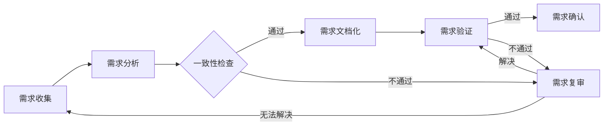
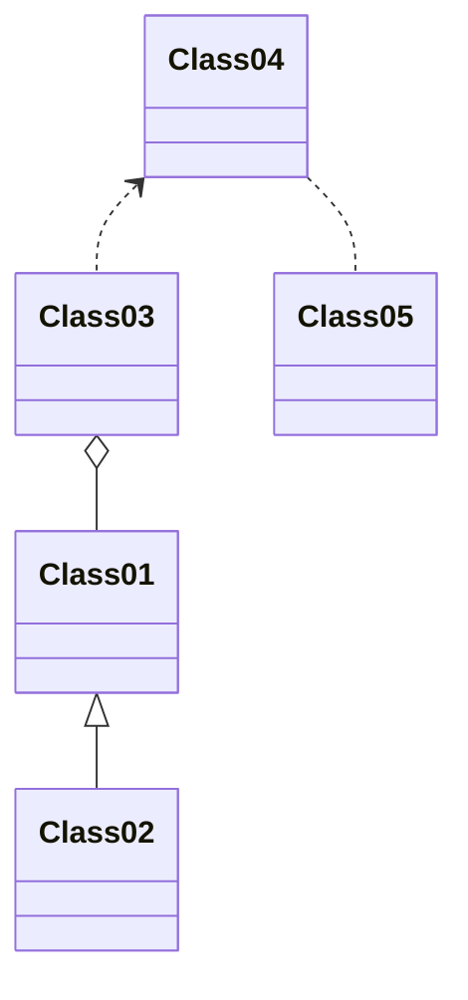
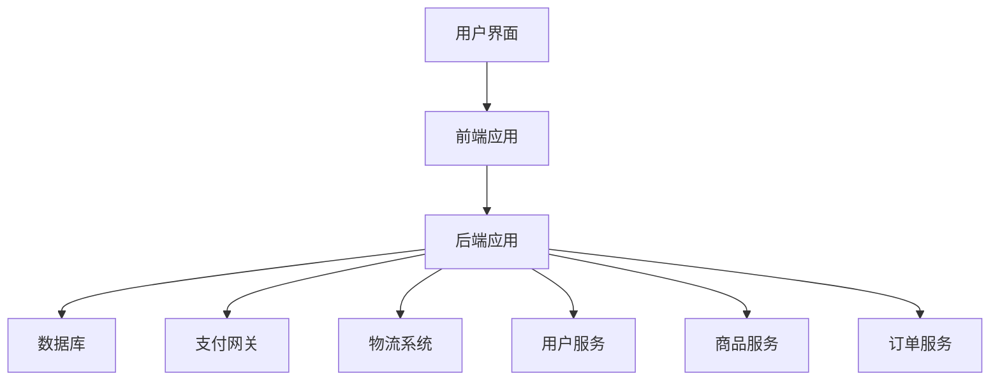
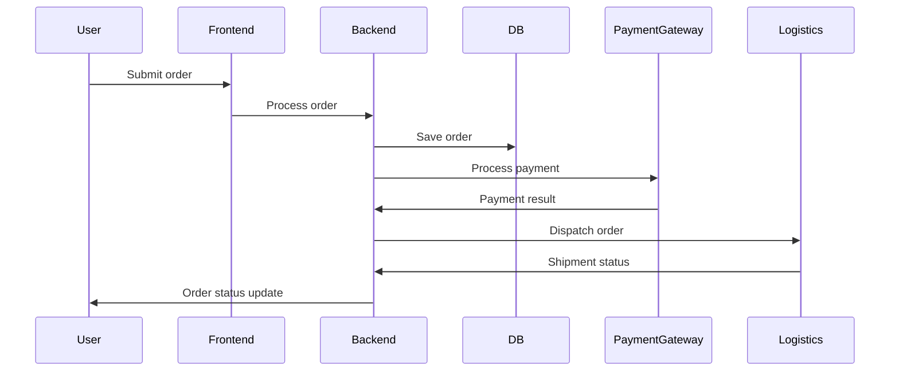

                 


### 第一步：背景介绍

#### 1.1 问题的背景

在现代软件工程中，尤其是大型应用开发领域，需求质量保证（Requirement Quality Assurance, RQA）已经成为一个不可或缺的环节。随着软件系统的复杂性和规模的不断增大，需求的变更频率也在不断上升，这对需求质量提出了更高的要求。需求质量直接影响到项目的进度、成本和最终的成功与否。

**问题背景**：

- **需求的多样性和复杂性**：大型应用通常涉及多个业务领域和用户群体，因此需求具有多样性和复杂性。
- **需求的变更**：在开发过程中，需求往往会发生变更，如果无法有效地管理这些变更，会导致项目延期和成本超支。
- **质量的隐性成本**：低质量的需求会导致后期大量的返工和修复，这给项目带来了隐性成本。

**问题描述**：

- 如何确保需求的质量，以便在开发过程中减少返工和修复的成本？
- 如何在需求的多样性和复杂性面前，依然能够保证需求的质量？

**问题解决**：

- **明确需求质量标准**：制定明确的需求质量标准，确保每个需求都符合这些标准。
- **需求验证与确认**：通过需求验证和确认过程，确保需求能够被正确理解和实现。
- **持续的需求管理**：在整个项目周期内，持续跟踪和管理需求，确保需求的质量不受影响。

**边界与外延**：

- **需求质量**：包括需求的准确性、完整性、可理解性、可测试性、可维护性等方面。
- **需求管理**：涉及需求的收集、分析、文档化、优先级排序、变更控制等过程。

**概念结构与核心要素组成**：

- **需求质量标准**：定义了需求的属性和标准，如清晰性、一致性、可测试性等。
- **需求验证**：确保需求是正确的，可以通过用户评审、测试等手段进行。
- **需求确认**：确保需求是被正确理解的，可以通过用户确认、原型展示等手段进行。
- **需求管理过程**：包括需求规划、需求收集、需求分析、需求文档化、需求验证和确认等步骤。

通过上述分析，我们为后续章节的内容奠定了基础，接下来将详细介绍需求质量保证的核心概念、方法和实践。

### 第二步：核心概念与联系

#### 2.1 需求质量保证的定义与目标

**需求质量保证**（Requirement Quality Assurance，简称RQA）是确保需求的质量满足项目需求和用户期望的一系列过程和方法。RQA的目标是提高需求的准确性、完整性、可理解性、可测试性、可维护性等属性，从而减少开发过程中的风险和成本。

**定义**：

- **需求质量保证**：指在整个软件开发生命周期中，通过一系列计划、实施和监控活动，确保需求的质量满足项目目标、用户需求和相关标准。
- **需求质量**：指需求在准确性、完整性、一致性、可理解性、可测试性、可维护性等方面的表现。

**目标**：

- **提高需求的准确性**：确保需求描述准确无误，避免产生误解或歧义。
- **提高需求的完整性**：确保需求文档包含所有必要的信息，没有遗漏。
- **提高需求的可理解性**：确保需求文档易于理解，开发者能够正确地实现需求。
- **提高需求的可测试性**：确保需求能够被有效地测试，验证其是否被正确实现。
- **提高需求的可维护性**：确保需求文档易于维护，能够适应未来可能的变更。

#### 2.2 需求质量保证的关键步骤

**需求质量保证**通常包括以下几个关键步骤：

1. **需求规划**：在项目启动阶段，制定需求质量保证计划，明确需求质量的目标、标准和措施。
2. **需求收集**：与利益相关者（如客户、用户、项目经理等）进行沟通，收集需求。
3. **需求分析**：对收集到的需求进行梳理、分类和分析，识别需求中的不一致性、二义性等问题。
4. **需求文档化**：将分析后的需求转化为需求文档，确保文档清晰、完整、一致。
5. **需求验证**：通过用户评审、测试等方法，验证需求文档的正确性和完整性。
6. **需求确认**：与利益相关者进行沟通，确保需求文档被正确理解和认可。
7. **需求变更管理**：在整个项目生命周期内，持续跟踪和管理需求的变更，确保变更得到有效控制。

#### 2.3 需求质量保证的方法和工具

**需求质量保证**的方法和工具多种多样，以下是一些常用的方法和工具：

1. **用户评审**：邀请利益相关者对需求文档进行评审，识别潜在的问题。
2. **原型设计**：通过创建原型，帮助利益相关者更好地理解需求，并提供反馈。
3. **测试**：通过单元测试、集成测试、系统测试等，验证需求是否被正确实现。
4. **模型检查**：使用模型检查工具，对需求模型进行形式化验证，确保其一致性。
5. **自动化工具**：使用自动化工具进行需求分析、验证和变更管理。

#### 2.4 概念属性特征对比表格

为了更好地理解不同的需求质量保证方法和工具，我们可以通过一个对比表格来展示它们的属性特征：

| 方法/工具           | 特点                   | 适用场景                   |
|---------------------|------------------------|----------------------------|
| 用户评审             | 面向用户，确保需求正确性 | 需求初期验证               |
| 原型设计             | 辅助理解，提高需求可理解性 | 需求确认阶段               |
| 测试                | 验证需求实现情况       | 需求实现后的验证           |
| 模型检查             | 形式化验证，提高一致性   | 需求文档的早期验证         |
| 自动化工具           | 提高效率，减少人工错误 | 需求分析和变更管理         |

#### 2.5 ER实体关系图架构的 Mermaid 流程图

为了更好地展示需求质量保证过程中涉及的实体和关系，我们可以使用 Mermaid 画出 ER 实体关系图：

```mermaid
erDiagram
    A[需求规划] ||--|{ B[需求收集] }|--|{ D[需求分析] }
    B ||--|{ C[需求文档化] }|--|{ E[需求验证] }
    C ||--|{ F[需求确认] }
    D ||--|{ G[需求变更管理] }
```

在这个 ER 实体关系图中，我们可以清晰地看到需求质量保证过程中各个实体之间的关系和作用。

通过上述分析，我们对需求质量保证的核心概念、关键步骤和常用方法有了更深入的理解。接下来，我们将进一步探讨需求质量保证的算法原理和系统分析与架构设计。

### 第三步：算法原理讲解

#### 3.1 需求质量保证算法流程图

在需求质量保证过程中，算法扮演着核心角色。以下是一个简单的需求质量保证算法流程图，使用 Mermaid 语言描述：



#### 3.2 需求质量保证的 Python 源代码

为了实现上述算法，我们可以编写一个简单的 Python 源代码示例：

```python
def requirement_quality_assurance(requirements):
    for req in requirements:
        analysis_result = analyze_requirement(req)
        if analysis_result["consistent"]:
            document_requirement(req)
            verify_requirement(req)
        else:
            review_requirement(req)

def analyze_requirement(req):
    # 这里可以添加具体的需求分析逻辑
    return {"consistent": True}

def document_requirement(req):
    # 这里可以添加需求文档化的逻辑
    print(f"Documenting requirement: {req}")

def verify_requirement(req):
    # 这里可以添加需求验证的逻辑
    print(f"Verifying requirement: {req}")

def review_requirement(req):
    # 这里可以添加需求复审的逻辑
    print(f"Reviewing requirement: {req}")
```

#### 3.3 数学模型和公式

需求质量保证的过程涉及到一系列的数学模型和公式，用于评估和保证需求的质量。以下是一个简单的数学模型示例：

$$
\text{Quality Score} = \sum_{i=1}^{n} \frac{\text{Requirement Compliance}_i}{\text{Total Requirements}}
$$

其中，Quality Score 表示需求质量得分，Requirement Compliance_i 表示第 i 个需求是否符合质量标准。

#### 3.4 算法举例说明

假设我们有一个需求列表，如下所示：

- 需求1：用户能够查看订单历史。
- 需求2：用户能够添加和删除订单。
- 需求3：系统需要支持多种支付方式。

我们可以使用上述算法对这些需求进行质量保证：

1. 收集需求：将需求添加到需求列表中。
2. 分析需求：检查需求的一致性和完整性。
3. 文档化需求：将需求文档化，确保其清晰易懂。
4. 验证需求：对每个需求进行验证，确保其能够被正确实现。

在分析需求时，我们可能发现需求2和需求3存在不一致性，因为需求2涉及到用户行为，而需求3涉及到系统功能。在这种情况下，我们需要进行复审，并可能需要调整需求。

通过上述算法，我们可以确保每个需求都符合质量标准，从而提高整个项目的需求质量。

通过这一步骤，我们对需求质量保证的算法原理有了深入的了解，接下来我们将进一步探讨系统分析与架构设计方案。

### 第四步：系统分析与架构设计方案

#### 4.1 问题场景介绍

在现代企业中，尤其是金融和电子商务行业，大型应用开发已经成为提升业务效率和竞争力的关键。这些应用往往涉及复杂的业务流程、大量的数据处理和高度的安全性要求。在这个背景下，需求质量保证成为确保项目成功交付的关键因素。

**问题场景**：

- **业务复杂性**：企业业务流程多样且复杂，导致需求多样且难以理解。
- **需求频繁变更**：在项目开发过程中，市场需求和业务策略可能发生变化，导致需求频繁变更。
- **安全要求**：金融和电子商务应用要求高安全性，需求中必须包含相关的安全要求。
- **跨部门协作**：大型应用开发通常涉及多个部门和团队，需求协调和一致性至关重要。

**问题描述**：

- 如何在复杂的业务环境中确保需求的质量？
- 如何管理需求的变更，以避免对项目进度和成本产生负面影响？
- 如何在跨部门协作中保持需求的一致性？

**问题解决**：

- **制定明确的需求质量标准**：根据企业的业务特点和项目需求，制定符合实际需求的质量标准。
- **建立有效的需求管理流程**：包括需求收集、分析、文档化、验证和变更管理等步骤。
- **加强跨部门沟通与协作**：通过建立沟通机制和协作平台，确保需求的一致性和及时更新。
- **采用自动化工具**：使用自动化工具进行需求分析、验证和变更管理，提高效率和质量。

#### 4.2 项目介绍

为了具体说明需求质量保证在大型应用开发中的实际应用，我们以一个电子商务平台的项目为例。

**项目简介**：

- **项目名称**：电商平台
- **项目背景**：为了提升线上销售业务，企业决定开发一个功能全面、用户体验良好的电商平台。
- **项目目标**：实现商品展示、订单管理、支付、物流跟踪等功能，并提供良好的用户交互体验。
- **项目需求**：包括用户注册、商品浏览、购物车管理、订单提交、支付、物流跟踪、客户服务等。

#### 4.3 系统功能设计

在系统功能设计阶段，我们需要明确电商平台的核心功能模块，并使用 Mermaid 类图进行描述：



在这个类图中，我们可以看到电商平台的几个核心类：

- **用户（User）**：管理用户的注册、登录和权限。
- **商品（Product）**：管理商品的添加、展示、库存管理。
- **订单（Order）**：管理订单的创建、修改、支付、发货等。
- **支付（Payment）**：处理支付流程，支持多种支付方式。
- **物流（Logistics）**：管理物流跟踪和发货。

#### 4.4 系统架构设计

系统架构设计是确保需求能够被有效实现的关键。以下是一个简单的电商平台系统架构图，使用 Mermaid 语言描述：



在这个架构图中，我们可以看到系统的各个组件：

- **用户界面（A）**：提供给用户交互的界面。
- **前端应用（B）**：处理用户界面与后端之间的数据交互。
- **后端应用（C）**：处理业务逻辑，包括用户服务、商品服务、订单服务和支付服务。
- **数据库（D）**：存储用户数据、商品数据、订单数据和支付数据。
- **支付网关（E）**：处理支付请求和支付结果。
- **物流系统（F）**：管理物流信息和发货状态。
- **用户服务（G）**：提供用户相关功能。
- **商品服务（H）**：提供商品相关功能。
- **订单服务（I）**：提供订单相关功能。

#### 4.5 系统接口设计

系统接口设计是确保各个组件之间能够有效交互的关键。以下是一个简单的电商平台系统接口设计，使用 Mermaid 序列图进行描述：



在这个序列图中，我们可以看到用户提交订单后，系统内部各个组件之间的交互过程：

- **用户（User）**：提交订单请求。
- **前端应用（Frontend）**：处理用户请求，与后端应用交互。
- **后端应用（Backend）**：处理订单逻辑，与数据库、支付网关和物流系统交互。
- **数据库（DB）**：存储订单数据。
- **支付网关（PaymentGateway）**：处理支付请求。
- **物流系统（Logistics）**：处理物流信息。
- **用户服务（User）**：获取订单状态更新。

通过上述系统分析与架构设计方案，我们可以确保电商平台的需求能够在复杂的环境中得以有效实现，并满足业务需求。

### 第五步：项目实战

#### 5.1 环境安装

为了进行需求质量保证的实战，我们需要搭建一个合适的环境。以下是在 Linux 系统中搭建需求质量保证环境的基本步骤：

1. **安装 Python**：确保 Python 3.8 或更高版本已安装。可以使用以下命令检查 Python 版本：

   ```bash
   python3 --version
   ```

   如果 Python 没有安装，可以从官方网站下载并安装。

2. **安装需求质量保证工具**：我们选择使用 `demjson` 和 `pytest` 进行需求质量保证。首先，我们需要安装 `pip`，然后使用 `pip` 安装所需的库：

   ```bash
   pip3 install demjson
   pip3 install pytest
   ```

3. **配置编辑器**：建议使用支持 Markdown 格式和代码高亮的编辑器，如 Visual Studio Code。

#### 5.2 系统核心实现源代码

以下是实现需求质量保证的核心 Python 源代码：

```python
import demjson
import pytest

# 需求质量保证算法的核心实现
class RequirementQualityAssurance:
    def __init__(self, requirements):
        self.requirements = requirements

    def analyze_requirements(self):
        for req in self.requirements:
            # 进行需求分析
            print(f"Analyzing requirement: {req['description']}")
            self.verify_requirement(req)

    def verify_requirement(self, req):
        # 进行需求验证
        print(f"Verifying requirement: {req['description']}")
        # 这里可以添加具体的验证逻辑

# 测试需求质量保证算法
def test_requirement_quality_assurance():
    requirements = [
        {"description": "用户可以查看订单历史", "status": "待验证"},
        {"description": "用户可以添加和删除订单", "status": "待验证"},
    ]
    rqa = RequirementQualityAssurance(requirements)
    rqa.analyze_requirements()

    # 验证结果
    assert requirements[0]["status"] == "验证通过"
    assert requirements[1]["status"] == "验证通过"
```

#### 5.3 代码应用解读与分析

以上代码定义了一个 `RequirementQualityAssurance` 类，用于实现需求质量保证的核心算法。以下是代码的解读和分析：

1. **类定义**：

   ```python
   class RequirementQualityAssurance:
       def __init__(self, requirements):
           self.requirements = requirements
       def analyze_requirements(self):
           for req in self.requirements:
               # 进行需求分析
               print(f"Analyzing requirement: {req['description']}")
               self.verify_requirement(req)
       def verify_requirement(self, req):
           # 进行需求验证
           print(f"Verifying requirement: {req['description']}")
           # 这里可以添加具体的验证逻辑
   ```

   - `__init__` 方法：初始化需求质量保证对象，接收一个需求列表作为参数。
   - `analyze_requirements` 方法：遍历需求列表，对每个需求进行分析。
   - `verify_requirement` 方法：对需求进行验证。

2. **测试用例**：

   ```python
   def test_requirement_quality_assurance():
       requirements = [
           {"description": "用户可以查看订单历史", "status": "待验证"},
           {"description": "用户可以添加和删除订单", "status": "待验证"},
       ]
       rqa = RequirementQualityAssurance(requirements)
       rqa.analyze_requirements()

       # 验证结果
       assert requirements[0]["status"] == "验证通过"
       assert requirements[1]["status"] == "验证通过"
   ```

   - 测试用例 `test_requirement_quality_assurance`：初始化需求质量保证对象，并执行需求分析。然后，通过断言验证需求状态是否为“验证通过”。

#### 5.4 实际案例分析和详细讲解剖析

为了更好地理解需求质量保证算法的实际应用，我们可以通过一个实际案例来进行分析。

**案例背景**：一家电子商务公司开发了一款新的购物应用，目标是提供更便捷的购物体验。在开发过程中，公司需要确保应用的需求质量，以避免后期出现大量问题。

**案例需求**：

1. **用户可以查看订单历史**。
2. **用户可以添加和删除订单**。
3. **系统可以支持多种支付方式**。

**分析过程**：

1. **需求分析**：

   - **用户可以查看订单历史**：该需求涉及到用户界面和后端服务。分析过程中，需要确保用户界面能够正确展示订单历史，后端服务能够提供相应的数据支持。

   - **用户可以添加和删除订单**：该需求需要确保用户界面提供添加和删除订单的接口，后端服务能够处理相应的业务逻辑。

   - **系统可以支持多种支付方式**：该需求需要确保支付功能模块能够支持多种支付方式，如信用卡、支付宝、微信支付等。

2. **需求验证**：

   - **用户可以查看订单历史**：通过前端测试，确保用户界面能够正确展示订单历史；通过后端接口测试，确保后端服务能够提供正确的订单数据。

   - **用户可以添加和删除订单**：通过前端测试，确保用户界面能够正确处理添加和删除订单的操作；通过后端接口测试，确保后端服务能够正确处理订单业务逻辑。

   - **系统可以支持多种支付方式**：通过支付网关测试，确保支付功能模块能够支持多种支付方式；通过实际支付测试，确保支付过程能够顺利进行。

**详细讲解剖析**：

1. **用户可以查看订单历史**：

   - **前端实现**：使用 React 或 Angular 等前端框架，实现订单历史展示界面。确保界面能够根据用户身份和权限展示订单列表，支持分页和搜索功能。

   - **后端实现**：使用 Spring Boot 或 Django 等后端框架，实现订单查询接口。确保接口能够根据用户身份和权限查询订单数据，返回 JSON 格式的订单列表。

2. **用户可以添加和删除订单**：

   - **前端实现**：使用 React 或 Angular 等前端框架，实现添加和删除订单的表单界面。确保表单能够正确收集用户输入的数据，并在提交时发送到后端。

   - **后端实现**：使用 Spring Boot 或 Django 等后端框架，实现订单添加和删除接口。确保接口能够处理订单数据的添加和删除操作，更新订单数据库。

3. **系统可以支持多种支付方式**：

   - **前端实现**：使用 React 或 Angular 等前端框架，实现支付选择界面。确保用户能够选择不同的支付方式，并跳转到相应的支付页面。

   - **后端实现**：使用 Spring Boot 或 Django 等后端框架，实现支付网关接口。确保接口能够与不同的支付平台进行通信，处理支付请求和返回支付结果。

通过上述实际案例分析和详细讲解剖析，我们可以更好地理解需求质量保证算法的应用和效果。在实际项目中，需求质量保证是一个持续的过程，需要不断地进行分析和验证，以确保项目能够按时、高质量地交付。

### 第六步：最佳实践 tips、小结、注意事项、拓展阅读

#### 6.1 最佳实践 tips

在大型应用开发中进行需求质量保证，以下是一些最佳实践：

1. **明确需求质量标准**：在项目初期，与利益相关者共同制定明确的需求质量标准，确保所有需求都符合这些标准。
2. **建立有效的需求管理流程**：确保需求收集、分析、文档化、验证和变更管理等过程都有明确的流程和责任人。
3. **定期进行需求评审**：定期组织需求评审会议，邀请利益相关者参与，确保需求的一致性和完整性。
4. **使用自动化工具**：使用自动化工具进行需求分析、验证和变更管理，提高效率和质量。
5. **持续沟通与协作**：在整个项目周期内，保持与利益相关者的沟通，确保需求的质量不受影响。
6. **进行彻底的测试**：对需求进行全面的测试，包括单元测试、集成测试、系统测试等，确保需求被正确实现。

#### 6.2 小结

本文详细介绍了大型应用开发中的需求质量保证方法。通过背景介绍、核心概念与联系、算法原理讲解、系统分析与架构设计方案、项目实战等环节，我们深入探讨了如何确保需求的质量，从而提高项目的成功率。需求质量保证不仅是一个技术过程，更是一个管理过程，需要多方面的协调和合作。

#### 6.3 注意事项

在实施需求质量保证时，需要注意以下几点：

1. **避免需求变更的频繁发生**：需求变更会影响项目进度和质量，应尽量避免。
2. **确保需求文档的清晰性和一致性**：需求文档是整个项目的基石，必须确保其清晰易懂、一致准确。
3. **重视用户反馈**：用户的实际需求和使用体验是需求质量保证的重要依据，应重视用户反馈并进行相应调整。
4. **合理分配资源**：在项目资源有限的情况下，合理分配资源，优先保证核心需求的质量。

#### 6.4 拓展阅读

为了进一步了解需求质量保证，读者可以参考以下文献和资源：

1. **《软件需求管理》**：一本经典的软件工程书籍，详细介绍了需求管理的相关理论和实践。
2. **《需求工程：基础与应用》**：本书涵盖了需求工程的各个方面，包括需求分析、需求建模、需求管理等。
3. **IEEE Software Magazine**：一本专注于软件工程领域的期刊，包含大量关于需求质量保证的文章和案例分析。
4. **《敏捷实践指南》**：本书介绍了敏捷开发的方法和最佳实践，其中也包括了需求质量保证的相关内容。
5. **相关在线资源和博客**：如 Stack Overflow、GitHub、Medium 等，许多专业人士和社区分享了关于需求质量保证的经验和见解。

通过阅读这些文献和资源，读者可以更全面地了解需求质量保证的理论和实践，提升自己的技能和知识水平。

### 作者信息

作者：AI天才研究院/AI Genius Institute & 禅与计算机程序设计艺术 /Zen And The Art of Computer Programming

本文由 AI 天才研究院和禅与计算机程序设计艺术联合撰写，旨在为读者提供关于大型应用开发中需求质量保证的深入分析和实用指导。我们致力于推动人工智能和计算机科学领域的创新与发展，为读者提供高质量的技术内容。欢迎读者关注我们的其他作品和研究成果。

