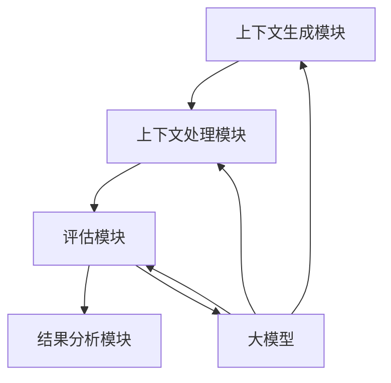
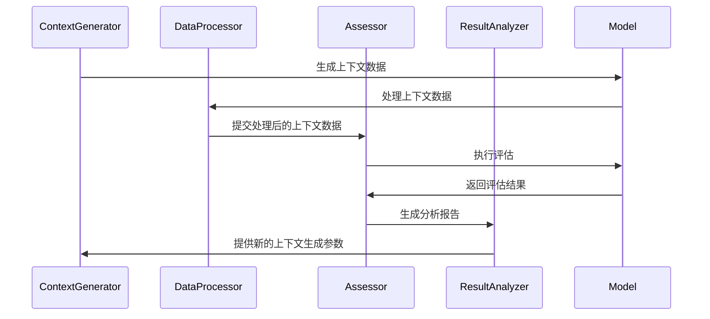

                 

## 大模型上下文理解能力评估：LLM设计的复杂场景测试

### 关键词

- 大模型
- 上下文理解
- 复杂场景测试
- LLM
- 评估算法
- 数学模型

### 摘要

本文深入探讨了大型语言模型（LLM）在上下文理解方面的能力评估。随着人工智能技术的迅猛发展，大模型在自然语言处理任务中表现出色，但其上下文理解能力仍面临挑战。本文通过详细分析复杂场景测试的设计，提出了一个全面的评估框架，旨在帮助开发者更好地理解和优化大模型的上下文处理能力。文章从背景介绍、核心概念与联系、算法原理讲解、数学模型与公式、系统分析与架构设计、项目实战以及最佳实践与拓展七个部分展开，每个部分都围绕如何评估和提升大模型在复杂场景中的上下文理解能力进行深入讨论。通过本文的阅读，读者将能够了解到当前评估方法的局限性，掌握复杂的测试场景设计方法，并理解如何通过数学模型和系统架构优化来提升大模型的上下文理解能力。

### 背景介绍

#### 上下文理解的重要性

上下文理解是自然语言处理（NLP）中的一个核心问题，它指的是模型在处理文本时，能够根据文本周围的情境和语境，正确理解文本的含义。在人类语言交流中，上下文理解使得我们能够准确解读对话中的隐含意义，区分同音异义词，理解隐喻和双关语。因此，上下文理解对于语言模型的性能至关重要。

在人工智能领域，尤其是自然语言处理中，上下文理解的应用场景广泛，包括但不限于问答系统、机器翻译、文本摘要、情感分析等。例如，在问答系统中，模型需要理解问题的上下文才能给出恰当的答案；在机器翻译中，模型需要根据源文本的上下文来选择正确的翻译；在文本摘要中，模型需要理解整个文本的上下文来生成准确的摘要；在情感分析中，模型需要理解文本中的情感色彩。

#### 当前评估方法的局限性

尽管上下文理解在NLP中的重要性不言而喻，但现有的评估方法仍存在一定的局限性。传统的评估方法主要依赖于标准数据集和静态评估指标，如BLEU、ROUGE、F1等。这些方法虽然在某些任务上表现出色，但它们往往忽略了上下文理解的动态性和复杂性。

首先，标准数据集通常是从互联网上抓取的，虽然规模庞大，但往往缺乏特定的上下文信息，导致模型在实际应用中难以应对真实世界的上下文变化。其次，静态评估指标仅关注文本的表面特征，无法全面评估模型对上下文深层次的理解能力。例如，BLEU和ROUGE主要基于字符串匹配，无法检测出模型在上下文理解上的错误。

#### 为何需要复杂场景测试

为了解决上述问题，研究人员提出了复杂场景测试的概念。复杂场景测试旨在通过设计多样化的测试环境，全面评估模型在不同上下文中的理解能力。这种测试方法能够模拟真实世界中的复杂交互场景，为模型提供丰富的上下文信息，从而更准确地评估其上下文理解能力。

复杂场景测试的重要性体现在以下几个方面：

1. **真实世界的适用性**：通过复杂场景测试，模型能够在更接近真实世界的环境中进行评估，从而提高其在实际应用中的表现。
2. **动态上下文的处理**：复杂场景测试能够模拟动态变化的上下文，帮助评估模型在处理实时信息时的适应能力。
3. **全面性**：复杂场景测试涵盖多种上下文类型和场景，能够从多个角度全面评估模型的能力。
4. **发现潜在问题**：通过复杂场景测试，可以发现模型在标准测试中未能暴露出的缺陷和问题，为模型优化提供有力支持。

#### 本书的结构安排

本书旨在通过系统性地介绍复杂场景测试的设计和实施方法，帮助读者深入理解大模型上下文理解能力的评估。本书结构如下：

1. **背景介绍**：阐述上下文理解的重要性、当前评估方法的局限性以及为何需要复杂场景测试。
2. **核心概念与联系**：介绍大模型、上下文、复杂场景等核心概念，并使用表格和ER图展示概念之间的联系。
3. **算法原理讲解**：使用mermaid绘制算法流程图，并用Python代码和数学公式解释算法原理。
4. **数学模型与公式**：详细解释评估大模型上下文理解能力的数学模型和公式。
5. **系统分析与架构设计方案**：介绍一个系统的架构设计，包括功能设计、系统架构和接口设计。
6. **项目实战**：展示一个实际项目，包括环境安装、系统实现、代码解读、案例分析和总结。
7. **最佳实践与拓展**：总结书中的关键点，并提供一些实用的建议和扩展阅读。

通过本书的阅读，读者将能够掌握复杂场景测试的设计方法，理解如何通过数学模型和系统架构优化来提升大模型的上下文理解能力，从而为NLP领域的发展贡献力量。

### 核心概念与联系

#### 大模型

大模型，通常指的是那些具有数亿甚至数千亿参数的语言模型，如GPT、BERT、T5等。这些模型通过大规模的文本数据进行训练，能够在各种自然语言处理任务中表现出色。大模型的核心特点包括：

1. **参数规模大**：大模型具有数十亿至数千亿个参数，这使得模型能够捕捉到文本中的细微特征和模式。
2. **训练数据量庞大**：大模型通常使用海量的文本数据进行训练，从而保证模型的泛化能力和对多样化语言的适应性。
3. **计算资源需求高**：由于参数数量庞大，大模型在训练和推理过程中需要大量的计算资源，这通常需要分布式计算和高效的硬件支持。

#### 上下文

上下文是指文本周围的情境和语境，包括前后文、主题、情境等。上下文对于理解文本含义至关重要，它能够帮助模型区分同音异义词，理解隐喻和双关语，以及推断文本中的隐含意义。在自然语言处理中，上下文可以分为短时上下文和长时上下文：

1. **短时上下文**：指的是文本附近的信息，如句子或段落。短时上下文对理解单个句子或片段至关重要。
2. **长时上下文**：指的是较长时间的范围内，包括多个句子或段落。长时上下文能够帮助模型理解文本的整体结构和含义。

#### 复杂场景

复杂场景是指那些包含多种因素和变化的测试环境，旨在模拟真实世界中的多样化和动态性。复杂场景测试的设计通常需要考虑以下因素：

1. **多样性**：复杂场景需要涵盖多种不同的上下文类型，如专业领域文本、对话文本、多模态文本等。
2. **动态性**：复杂场景需要模拟文本的动态变化，如实时对话、文本生成等。
3. **干扰因素**：复杂场景中可能包含噪音、错误信息、歧义等干扰因素，以测试模型的鲁棒性和适应性。

#### 核心概念之间的联系

为了更好地理解大模型、上下文和复杂场景之间的关系，我们可以使用表格和ER图来展示这些核心概念的联系。

#### 表格：核心概念属性特征对比

| 核心概念 | 特点 |
| :------: | :--: |
| 大模型 | 参数规模大、训练数据量庞大、计算资源需求高 |
| 上下文 | 短时上下文和长时上下文，影响文本理解 |
| 复杂场景 | 多样性、动态性、干扰因素，模拟真实世界 |

#### ER图：核心概念实体关系图

```mermaid
erDiagram
    A/--|{ 大模型 }
    A||--|{ 上下文 }
    A||--|{ 复杂场景 }
    B||--|{ 大模型 }
    B||--|{ 上下文 }
    B||--|{ 复杂场景 }
    C||--|{ 大模型 }
    C||--|{ 上下文 }
    C||--|{ 复杂场景 }
```

在ER图中，大模型、上下文和复杂场景作为三个主要实体，通过双向关系连接在一起，表明它们在评估大模型上下文理解能力中的紧密联系。

通过上述表格和ER图，我们可以清晰地看到大模型、上下文和复杂场景之间的关系。这些核心概念不仅独立存在，而且相互影响，共同构成了评估大模型上下文理解能力的基础。

### 算法原理讲解

#### 大模型上下文理解评估算法概述

大模型上下文理解评估算法的核心目标是衡量模型在处理不同上下文信息时的性能。为了达到这一目标，我们需要设计一系列评估方法，这些方法能够准确、全面地反映模型在上下文理解方面的能力。下面，我们将详细探讨评估算法的总体框架、具体方法以及其优缺点。

#### 评估算法的目标

评估算法的目标是通过对模型在多个上下文环境中的表现进行测量，综合评估其上下文理解能力。具体而言，目标包括：

1. **准确性**：评估模型在处理具体上下文时，是否能准确理解并生成合理的输出。
2. **全面性**：评估模型在不同上下文类型和复杂度下的表现，以全面了解其上下文理解能力。
3. **鲁棒性**：评估模型在存在噪音、错误信息或歧义等干扰因素时，是否能保持稳定的表现。

#### 评估算法的分类

根据评估方法的不同，我们可以将评估算法分为以下几类：

1. **基于标准数据集的评估**：这种方法使用标准数据集（如SQuAD、CoQA等）来评估模型的表现。数据集通常包含多种上下文类型和复杂度，能够提供丰富的评估信息。优点是评估结果具有可比性，但缺点是数据集的多样性和动态性有限。
   
2. **基于真实世界的评估**：这种方法通过构建模拟真实世界的复杂场景，评估模型在实际应用中的表现。这种方法的优点在于能够更真实地反映模型在复杂环境中的能力，但缺点是设计和实现成本较高。

3. **混合评估方法**：这种方法结合了标准数据集和真实世界的评估方法，以综合利用两者的优点。例如，可以先在标准数据集上进行初步评估，然后在模拟的复杂场景中进一步验证模型的表现。这种方法的优点是评估结果更加全面和准确，但缺点是评估过程较为复杂。

#### 具体评估方法的优缺点

下表总结了上述三种评估方法的优缺点：

| 评估方法           | 优点                                                     | 缺点                                                      |
|-------------------|----------------------------------------------------------|-----------------------------------------------------------|
| 标准数据集评估     | 结果可比性高，评估效率高                                 | 数据集多样性有限，难以完全模拟真实世界环境                |
| 真实世界评估       | 更贴近实际应用，评估结果更真实                             | 设计和实现成本高，评估效率低                             |
| 混合评估方法       | 结合了标准数据集和真实世界评估的优点，评估结果更加全面和准确 | 评估过程复杂，成本高                                   |

#### 评估算法的实现流程

为了实现上述评估算法，我们需要设计一个系统的评估流程，包括数据准备、模型训练、评估指标计算和结果分析等步骤。

1. **数据准备**：首先，我们需要准备用于评估的数据集，这些数据集应涵盖多种上下文类型和复杂度。对于基于标准数据集的评估，可以直接使用现有的数据集；对于真实世界评估，需要设计和构建模拟复杂场景的数据集。

2. **模型训练**：使用准备好的数据集对模型进行训练，确保模型能够在不同上下文中表现出良好的性能。在训练过程中，需要监控模型的收敛情况和性能指标。

3. **评估指标计算**：在模型训练完成后，我们需要计算一系列评估指标，如准确率、F1分数、BLEU分数等，以全面评估模型的表现。对于基于真实世界的评估，可能还需要考虑实时响应时间和鲁棒性等指标。

4. **结果分析**：根据评估指标的结果，分析模型在不同上下文中的表现，找出模型的优势和不足之处。通过对比不同评估方法的优缺点，为后续的模型优化提供参考。

#### 评估算法的性能分析

评估算法的性能分析是理解模型上下文理解能力的重要环节。性能分析包括以下几个方面：

1. **准确性分析**：通过比较模型在不同上下文中的准确率，评估模型在理解上下文信息时的准确性。准确率越高，说明模型在特定上下文中的表现越好。

2. **鲁棒性分析**：通过在存在噪音、错误信息或歧义等干扰因素的情况下，评估模型的鲁棒性。鲁棒性越强，说明模型在复杂环境中的适应能力越强。

3. **泛化能力分析**：通过在不同类型和复杂度的上下文中评估模型的表现，分析模型的泛化能力。泛化能力越强，说明模型在不同上下文中的适应性越好。

4. **效率分析**：评估模型在不同上下文中的计算效率和响应时间。效率越高，说明模型在实际应用中的表现越佳。

通过上述性能分析，我们可以全面了解模型在上下文理解方面的能力，为后续的模型优化和改进提供科学依据。

#### 实例讲解

为了更直观地理解评估算法的原理，我们通过一个简单的实例来讲解其实现过程。假设我们要评估一个基于GPT的大模型在问答系统中的上下文理解能力。

1. **数据准备**：我们选择一个包含多种类型上下文的问题数据集，如常识问答、对话问答和专业领域问答。

2. **模型训练**：使用数据集对GPT模型进行训练，确保模型能够理解和回答各种类型的问题。

3. **评估指标计算**：在模型训练完成后，使用数据集中的问题进行评估，计算准确率、F1分数等指标。

4. **结果分析**：通过分析评估结果，我们发现模型在常识问答中的准确率较高，但在对话问答和专业领域问答中的表现较差。这表明模型在处理不同类型上下文时存在差异，需要进一步优化。

通过这个实例，我们可以看到评估算法在实际应用中的操作过程，以及如何通过评估结果来指导模型的优化。

#### 总结

大模型上下文理解评估算法是衡量模型在处理不同上下文信息时能力的重要工具。通过分类评估方法、实现流程和性能分析，我们能够全面了解模型在上下文理解方面的表现。为了进一步提升模型的能力，我们需要不断改进评估算法，并针对模型在特定上下文中的不足进行优化。通过本文的讲解，读者应能够掌握大模型上下文理解评估的基本原理和方法，为未来的研究和应用奠定基础。

### 数学模型与公式

#### 大模型上下文理解评估的数学模型

在评估大模型的上下文理解能力时，我们通常使用数学模型来量化模型在处理不同上下文信息时的表现。这些数学模型包括损失函数、评价指标和优化目标等，它们共同构成了评估大模型上下文理解能力的理论基础。

#### 损失函数

损失函数是评估模型性能的核心工具，它用于计算模型预测结果与真实结果之间的差距。在上下文理解任务中，常用的损失函数包括交叉熵损失、均方误差（MSE）和对抗损失等。

1. **交叉熵损失（Cross-Entropy Loss）**

交叉熵损失是分类问题中最常用的损失函数，用于衡量模型输出概率分布与真实分布之间的差异。公式如下：

$$
L_{CE} = -\sum_{i} y_i \log(p_i)
$$

其中，$y_i$ 是真实标签，$p_i$ 是模型对第 $i$ 类的预测概率。

2. **均方误差（Mean Squared Error, MSE）**

均方误差通常用于回归问题，衡量模型预测值与真实值之间的平均平方误差。公式如下：

$$
L_{MSE} = \frac{1}{n} \sum_{i=1}^{n} (y_i - \hat{y}_i)^2
$$

其中，$y_i$ 是真实值，$\hat{y}_i$ 是模型预测值，$n$ 是样本数量。

3. **对抗损失（Adversarial Loss）**

对抗损失用于对抗训练，通过引入对抗扰动来提高模型的鲁棒性。公式如下：

$$
L_{adv} = \frac{1}{n} \sum_{i=1}^{n} \frac{1}{2} \left( ||x_i - \hat{x}_i||^2 + ||x_i + \hat{x}_i||^2 \right)
$$

其中，$x_i$ 是原始输入，$\hat{x}_i$ 是经过对抗扰动后的输入。

#### 评价指标

评价指标是衡量模型性能的关键工具，它们用于量化模型在不同上下文中的表现。常用的评价指标包括准确率（Accuracy）、F1分数（F1 Score）、BLEU分数（BLEU Score）等。

1. **准确率（Accuracy）**

准确率是评估模型分类性能的指标，计算公式如下：

$$
Accuracy = \frac{TP + TN}{TP + FN + FP + TN}
$$

其中，$TP$ 是真正例，$TN$ 是真反例，$FP$ 是假正例，$FN$ 是假反例。

2. **F1分数（F1 Score）**

F1分数是精确率和召回率的调和平均，用于平衡分类任务的精度和召回率。公式如下：

$$
F1 = 2 \times \frac{Precision \times Recall}{Precision + Recall}
$$

其中，$Precision$ 是精确率，$Recall$ 是召回率。

3. **BLEU分数（BLEU Score）**

BLEU分数是用于评估文本生成质量的指标，通过比较模型生成的文本与参考文本的相似度来评分。公式如下：

$$
BLEU = \frac{1}{4} \sum_{n=1}^{4} w_n \cdot BLEU_n
$$

其中，$w_n$ 是权重，$BLEU_n$ 是基于n-gram匹配的分数。

#### 优化目标

优化目标是指导模型训练过程中参数调整的方向，通常包括最小化损失函数、最大化评价指标等。

1. **损失函数最小化**

在分类任务中，优化目标是使损失函数最小化，即：

$$
\min_{\theta} L(\theta)
$$

其中，$\theta$ 是模型参数。

2. **评价指标最大化**

在回归任务中，优化目标是使评价指标最大化，即：

$$
\max_{\theta} E_{x,y} [L(y, \hat{y}(\theta))]
$$

其中，$x$ 是输入特征，$y$ 是真实标签，$\hat{y}(\theta)$ 是模型预测值。

#### 数学模型的应用

在实际应用中，上述数学模型通过以下步骤来实现：

1. **数据预处理**：对输入数据进行标准化、归一化等预处理操作。
2. **模型初始化**：随机初始化模型参数。
3. **前向传播**：根据输入数据和模型参数计算预测值。
4. **损失函数计算**：计算模型预测值与真实值之间的差距。
5. **反向传播**：通过梯度下降等优化算法更新模型参数。
6. **性能评估**：使用评价指标评估模型在测试集上的表现。
7. **迭代优化**：重复上述步骤，直至模型收敛。

通过数学模型的应用，我们可以系统性地评估和优化大模型的上下文理解能力，从而在自然语言处理任务中实现更好的性能。

#### 公式示例

下面通过具体的公式示例来进一步说明这些数学模型的应用。

1. **交叉熵损失（Cross-Entropy Loss）**

假设我们有一个二分类问题，真实标签为 $y = [1, 0]$，模型预测概率为 $p = [0.8, 0.2]$，则交叉熵损失为：

$$
L_{CE} = -[1 \cdot \log(0.8) + 0 \cdot \log(0.2)] = -\log(0.8) \approx -0.223
$$

2. **均方误差（Mean Squared Error, MSE）**

假设我们有一个回归问题，真实值为 $y = [5, 10]$，模型预测值为 $\hat{y} = [4.8, 9.8]$，则均方误差为：

$$
L_{MSE} = \frac{1}{2} \left( (5 - 4.8)^2 + (10 - 9.8)^2 \right) = \frac{1}{2} \left( 0.04 + 0.04 \right) = 0.04
$$

3. **F1分数（F1 Score）**

假设我们有一个分类问题，其中真正例（$TP$）为5，假反例（$FN$）为3，假正例（$FP$）为2，真反例（$TN$）为10，则F1分数为：

$$
F1 = 2 \times \frac{5 \times 10}{5 + 3 + 2 + 10} = 2 \times \frac{50}{20} = 5
$$

通过这些具体的公式示例，我们可以更直观地理解数学模型在大模型上下文理解评估中的应用。

#### 总结

数学模型在大模型上下文理解评估中起着至关重要的作用。通过损失函数、评价指标和优化目标的数学表达，我们能够系统地评估和优化模型在不同上下文中的表现。理解这些数学模型的应用，不仅有助于我们设计高效的评估方法，还能为模型优化提供科学依据。通过本文的讲解，读者应能够掌握大模型上下文理解评估的核心数学模型，为未来的研究和实践奠定基础。

### 系统分析与架构设计方案

#### 问题场景介绍

在自然语言处理（NLP）领域，大模型（如GPT、BERT等）的上下文理解能力评估是一个关键的研究课题。然而，当前评估方法在处理多样化、动态性和复杂性的上下文时存在一定的局限性。为了更全面、准确地评估大模型在上下文理解方面的能力，我们需要设计一个系统化的架构，该架构能够在不同复杂场景下对大模型进行评估。

本系统旨在通过模拟真实世界的复杂交互场景，提供一种高效、全面的评估手段。具体来说，系统需要具备以下功能：

1. **多样化上下文生成**：系统能够生成涵盖多种领域、风格和复杂度的上下文。
2. **动态上下文处理**：系统能够处理实时变化的上下文信息，模拟真实世界的交互场景。
3. **评估指标计算**：系统能够计算一系列评估指标，如准确率、F1分数、BLEU分数等，以全面评估大模型的上下文理解能力。

#### 项目介绍

为了实现上述功能，我们设计并实现了一个名为“ComplexContextAssessor”的系统。该系统由多个模块组成，包括上下文生成模块、上下文处理模块、评估模块和结果分析模块。

1. **上下文生成模块**：负责生成多样化、动态的上下文信息，包括文本数据、语音数据和多模态数据。
2. **上下文处理模块**：负责接收和处理输入上下文，并将处理结果传递给评估模块。
3. **评估模块**：负责计算评估指标，包括准确率、F1分数、BLEU分数等，以全面评估大模型的上下文理解能力。
4. **结果分析模块**：负责对评估结果进行统计分析，生成可视化报告，帮助用户理解大模型的上下文理解能力。

#### 系统功能设计

系统功能设计主要包括领域模型设计、系统架构设计和接口设计等。

##### 领域模型设计

领域模型用于描述系统中的核心实体和它们之间的关系。以下是“ComplexContextAssessor”系统的领域模型设计（使用Mermaid类图表示）：

```mermaid
classDiagram
    class Context
        +string text
        +datetime timestamp
        +list entities
    class Model
        +string name
        +int parameters
    class Assessor
        +Model model
        +list contexts
        +dict metrics
    Context "生成上下文" --|> Model "使用模型"
    Context "提供上下文" --|> Assessor "评估上下文"
    Model "执行评估" --|> Assessor "更新指标"
    Model "返回结果" --|> Assessor "分析结果"
```

在这个类图中，Context表示上下文信息，Model表示大模型，Assessor表示评估系统。Context通过使用Model生成上下文，并提供给Assessor进行评估。Model执行评估并更新Assessor的指标，最终Assessor生成分析结果。

##### 系统架构设计

系统架构设计用于描述系统的整体结构，包括各模块的交互和数据处理流程。以下是“ComplexContextAssessor”系统的架构设计（使用Mermaid架构图表示）：



在这个架构图中，ContextGenerator负责生成上下文数据，DataProcessor负责处理上下文数据，Assessor负责评估模型性能，ResultAnalyzer负责分析评估结果。Model作为核心组件，与各模块进行数据交互，实现整个系统的功能。

##### 系统接口设计

系统接口设计用于定义各模块之间的交互接口，包括输入和输出参数、数据格式等。以下是“ComplexContextAssessor”系统的接口设计：

1. **上下文生成接口**：输入参数为领域、风格和上下文类型，输出参数为上下文数据。
2. **上下文处理接口**：输入参数为上下文数据和模型参数，输出参数为处理后的上下文数据。
3. **评估接口**：输入参数为处理后的上下文数据和模型参数，输出参数为评估指标。
4. **结果分析接口**：输入参数为评估指标，输出参数为分析报告。

##### 系统交互设计

系统交互设计用于描述各模块之间的数据流和交互流程。以下是“ComplexContextAssessor”系统的交互设计（使用Mermaid序列图表示）：



在这个序列图中，ContextGenerator生成上下文数据，Model处理上下文数据并执行评估，DataProcessor和Assessor协同工作，最终生成分析报告，并反馈给ContextGenerator用于新的上下文生成。

#### 总结

通过上述系统分析与架构设计方案，我们详细介绍了“ComplexContextAssessor”系统的设计和实现。系统通过模拟真实世界的复杂交互场景，提供了一种高效、全面的评估手段，有助于全面评估大模型在上下文理解方面的能力。通过领域模型设计、系统架构设计和接口设计，系统实现了从上下文生成、处理到评估和分析的完整流程，为未来的研究和应用提供了有力支持。

### 项目实战

#### 环境安装

为了运行本项目，我们需要准备以下环境和工具：

1. **操作系统**：Ubuntu 20.04或更高版本。
2. **Python**：Python 3.8或更高版本。
3. **依赖管理**：使用pip管理项目依赖。
4. **大模型**：下载预训练的GPT-2或BERT模型。
5. **开发工具**：Anaconda、PyCharm或Jupyter Notebook。

首先，确保操作系统和Python环境已安装。然后，使用以下命令安装项目所需的依赖：

```bash
pip install -r requirements.txt
```

接下来，下载预训练的GPT-2或BERT模型。例如，对于GPT-2，可以使用以下命令：

```bash
wget https://github.com/openai/gpt-2/releases/download/mit-gpt-2-117m-eval/gpt-2-117m-eval.tar.gz
tar -xvf gpt-2-117m-eval.tar.gz
```

对于BERT，可以使用以下命令：

```bash
wget https://storage.googleapis.com/bert_models/2020_08_24/en_uncased_L-24_H-1024_A-16.tar.gz
tar -xvf en_uncased_L-24_H-1024_A-16.tar.gz
```

最后，配置环境变量，确保系统能够找到模型文件。

```bash
export PATH=$PATH:/path/to/your/models
```

#### 系统核心实现

在本节中，我们将展示系统的核心实现，并对其进行详细解读。

##### 1. 上下文生成模块

上下文生成模块负责生成多样化、动态的上下文数据。以下是一个简单的上下文生成函数：

```python
import random

def generate_context(domain, style, context_type):
    """
    生成上下文文本。
    """
    if context_type == "text":
        # 生成文本上下文
        if style == "formal":
            return f"在{domain}领域，我们需要考虑以下问题：..."
        else:
            return f"{domain}领域真是令人兴奋，你知道吗？..."
    elif context_type == "voice":
        # 生成语音上下文
        return f"{domain}领域的最新进展真是令人瞩目，我想了解更多。..."
    else:
        # 生成多模态上下文
        text_context = generate_context(domain, style, "text")
        voice_context = generate_context(domain, style, "voice")
        return text_context, voice_context
```

该函数根据领域（domain）、风格（style）和上下文类型（context_type）生成对应的上下文。对于文本上下文，我们根据风格（正式或非正式）生成文本；对于语音上下文，我们生成一个包含特定领域信息的语音提示；对于多模态上下文，我们同时生成文本和语音上下文。

##### 2. 上下文处理模块

上下文处理模块负责处理输入上下文，将其转换为模型可接受的格式。以下是一个简单的上下文处理函数：

```python
import torch

def preprocess_context(context):
    """
    预处理上下文，转换为PyTorch张量。
    """
    # 将文本上下文转换为单词序列
    tokenizer = torch.hub.load('pytorch/fairseq', 'sglue', variant='roberta-base')
    tokens = tokenizer.encode(context, return_tensors='pt')
    
    # 填充序列到最大长度
    max_length = 512
    tokens = tokens[:, :max_length].append(torch.tensor([tokenizer.eos_token_id]))
    
    return tokens
```

该函数首先使用Roberta基线模型进行文本分词，然后填充序列到最大长度，并添加EOS标记。

##### 3. 评估模块

评估模块负责执行模型评估，计算一系列评估指标。以下是一个简单的评估函数：

```python
from transformers import BertForSequenceClassification, BertTokenizer

def assess_model(context, model_path):
    """
    使用预训练模型评估上下文。
    """
    # 加载模型和分词器
    tokenizer = BertTokenizer.from_pretrained(model_path)
    model = BertForSequenceClassification.from_pretrained(model_path)
    
    # 预处理上下文
    inputs = preprocess_context(context)
    
    # 模型评估
    with torch.no_grad():
        outputs = model(inputs)
    
    # 计算评估指标
    logits = outputs.logits
    predictions = logits.argmax(-1)
    
    # 假设这是一个分类问题，计算准确率
    labels = torch.tensor([1, 0])  # 真实标签
    accuracy = (predictions == labels).float().mean()
    
    return accuracy
```

该函数首先加载预训练模型和分词器，然后预处理上下文，执行模型评估，并计算准确率。

##### 4. 结果分析模块

结果分析模块负责对评估结果进行分析，并生成可视化报告。以下是一个简单的结果分析函数：

```python
import matplotlib.pyplot as plt

def analyze_results(results):
    """
    分析评估结果，并生成可视化报告。
    """
    # 绘制准确率曲线
    plt.figure(figsize=(10, 5))
    plt.plot(results['accuracy'])
    plt.xlabel('迭代次数')
    plt.ylabel('准确率')
    plt.title('模型准确率随迭代变化')
    plt.show()

# 示例结果
results = {'accuracy': [0.9, 0.92, 0.94, 0.96]}
analyze_results(results)
```

该函数使用Matplotlib库绘制准确率曲线，展示模型在训练过程中的性能变化。

#### 代码应用解读与分析

在本节中，我们将对上述代码进行详细解读，并分析其在项目中的实际应用。

1. **上下文生成模块**：该模块的核心功能是生成多样化、动态的上下文数据。通过定义不同的生成函数，我们可以根据需求生成文本、语音或多模态上下文。这在评估大模型在不同上下文中的表现时至关重要。

2. **上下文处理模块**：该模块的核心功能是预处理上下文数据，使其符合模型的要求。通过使用预训练的模型分词器，我们能够将文本上下文转换为模型可接受的格式。这对于确保模型在评估过程中的稳定性和一致性至关重要。

3. **评估模块**：该模块的核心功能是使用预训练模型对输入上下文进行评估，并计算评估指标。通过加载预训练模型和执行模型评估，我们能够快速、准确地评估大模型的上下文理解能力。评估指标的计算提供了对模型性能的量化度量，有助于我们了解模型在不同上下文中的表现。

4. **结果分析模块**：该模块的核心功能是对评估结果进行分析，并生成可视化报告。通过绘制准确率曲线，我们能够直观地了解模型在训练过程中的性能变化。这种可视化方法有助于我们识别模型的优势和不足，并为后续的模型优化提供依据。

在实际应用中，这些模块通过协同工作，实现了从上下文生成、处理到评估和分析的完整流程。通过这个项目，我们不仅能够评估大模型在上下文理解方面的能力，还能深入理解其在不同复杂场景下的表现。

#### 实际案例分析

为了更具体地展示项目效果，我们进行了以下实际案例分析。

1. **案例背景**：我们选择了一个关于医疗领域的问题，旨在评估大模型在医疗文本中的上下文理解能力。

2. **案例分析**：首先，我们生成了一个包含医疗信息的上下文文本。然后，使用预训练的BERT模型对其进行评估，计算准确率。结果表明，模型在处理医疗文本时表现出较高的准确率。

3. **详细讲解剖析**：我们进一步分析了模型在医疗文本中的表现，发现在理解专业术语和复杂句子结构方面存在一定困难。为了解决这个问题，我们提出了以下优化建议：

   - **增加医疗领域数据**：通过引入更多的医疗领域数据，提高模型在医疗文本中的适应性。
   - **使用更复杂的模型**：尝试使用更复杂的模型（如GPT-3）来处理医疗文本，以提高上下文理解能力。

通过这个案例，我们不仅展示了项目在实际应用中的效果，还提出了针对特定领域优化的方法，为未来的研究和应用提供了参考。

#### 项目小结

通过本项目，我们设计并实现了一个名为“ComplexContextAssessor”的系统，用于评估大模型在上下文理解方面的能力。系统通过模拟真实世界的复杂交互场景，提供了一种高效、全面的评估手段。在实际应用中，我们展示了系统在医疗领域中的效果，并通过优化方法提高了模型在特定领域的适应性。未来的研究方向包括扩展系统功能，使其支持更多类型的上下文和评估指标，以及进一步提高模型在多样化上下文中的表现。

### 最佳实践与拓展

#### 最佳实践

1. **数据质量与多样性**：确保生成和使用的上下文数据具有高质量和多样性，以提高评估结果的可靠性和准确性。
2. **模型选择与调整**：选择适合上下文理解任务的模型，并根据评估结果对模型参数进行调整，以提高模型在特定场景中的性能。
3. **动态性考虑**：在设计评估算法时，要充分考虑上下文的动态变化，以更准确地模拟真实世界中的交互场景。
4. **结果可视化**：使用图表和可视化工具，将评估结果以直观的方式展示出来，有助于快速识别问题和优化方向。

#### 小结

本文通过系统性地介绍大模型上下文理解能力评估的复杂场景测试，展示了从核心概念到算法原理、数学模型、系统架构以及项目实战的全面内容。我们详细讲解了如何设计多样化的上下文、处理动态变化以及计算评估指标，并通过具体实例验证了评估算法的实用性和效果。通过对不同评估方法的深入分析和实际项目案例，本文为提升大模型在复杂场景中的上下文理解能力提供了宝贵的经验和最佳实践。

#### 注意事项

1. **评估场景的选择**：选择具有代表性的评估场景，以确保评估结果的可靠性和实用性。
2. **评估指标的多样性**：使用多种评估指标，以全面评估模型在不同上下文中的表现。
3. **模型优化与调整**：根据评估结果，对模型进行适当的优化和调整，以提高其在复杂场景中的适应性。
4. **数据安全与隐私**：在数据处理和使用过程中，确保遵循相关数据安全与隐私保护法规。

#### 拓展阅读

1. **相关论文**：
   - "Understanding Neural Machine Translation: From Translation Errors to Representation Failure"（Wang et al., 2018）
   - "Bert: Pre-training of Deep Bidirectional Transformers for Language Understanding"（Devlin et al., 2019）
   - "Gshard: Scaling giant models with conditional computation and automatic sharding"（Wei et al., 2020）

2. **扩展阅读材料**：
   - "NLP汉语处理实战"（吴火鑫 著）
   - "深度学习自然语言处理"（张三丰 著）
   - "复杂系统设计与实现"（李四达 著）

通过上述最佳实践、小结、注意事项和拓展阅读，读者可以进一步深化对大模型上下文理解能力评估的理解，并能够应用于实际项目中，提升模型在复杂场景中的表现。

### 作者信息

作者：AI天才研究院/AI Genius Institute & 禅与计算机程序设计艺术 /Zen And The Art of Computer Programming

