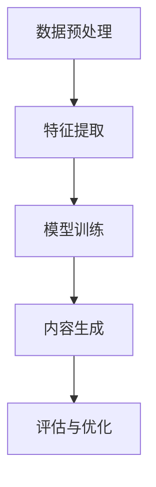
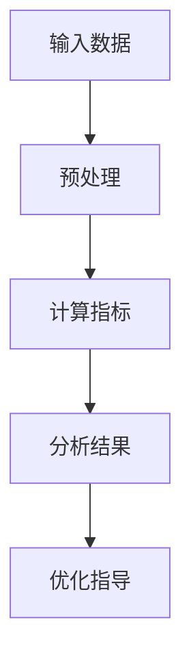
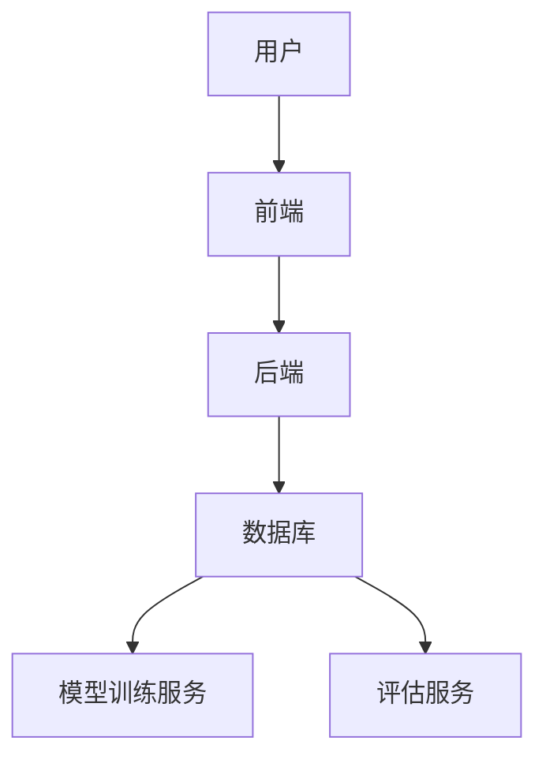
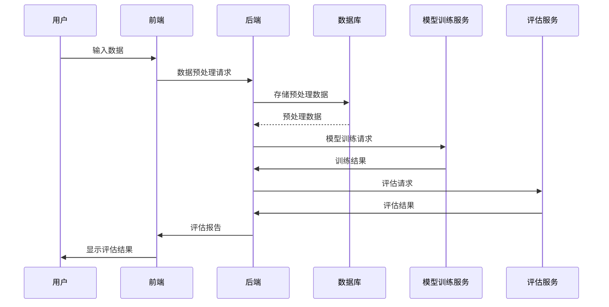

                 

### 引言

#### 问题背景

随着人工智能技术的迅猛发展，大模型（如大型语言模型、图像生成模型等）在各个领域展现出强大的创意生成能力。然而，如何评价这些大模型的创意生成能力，却成为了一个亟待解决的问题。在工业界和学术界，对大模型创意生成能力的评估往往依赖于专家主观判断，这种评估方法不仅耗时耗力，而且缺乏客观性和一致性。

#### 问题描述

当前，如何评价大模型创意生成能力主要面临以下几个问题：

1. **评估指标不明确**：现有的评估方法大多依赖于单一或几个指标，如生成文本的多样性、质量等，这些指标无法全面反映创意生成的综合能力。
2. **评估方法缺乏系统性**：现有的评估方法往往缺乏系统的框架和标准，导致评估结果不一致，无法为模型的改进提供有效指导。
3. **评估过程复杂**：现有评估方法需要大量的数据预处理和模型调试，操作复杂，不便于大规模应用。

#### 问题解决

本文旨在提出一种大模型创意生成能力量化评估框架，该框架将涵盖以下核心问题：

1. **定义明确的评估指标**：结合专家经验和现有研究，构建一套全面、系统的评估指标体系。
2. **构建评估框架**：设计一个统一的评估框架，将评估指标有机结合起来，形成一套完整的评估流程。
3. **实现评估工具**：开发相应的评估工具，实现评估指标的自动计算和评估结果的直观展示。

#### 边界与外延

本文讨论的“大模型创意生成能力”主要指的是在特定领域内，大模型能够生成具有创意、新颖性和实用性的内容的能力。评估框架的设计和应用将主要针对语言模型、图像生成模型等常见的大模型类型，但也具备一定的通用性，可以扩展到其他类型的大模型评估。

#### 概念结构与核心要素组成

本节将详细阐述大模型、创意生成和量化评估这三个核心概念，以及它们之间的联系和相互作用。

### 大模型原理

#### 大模型的定义

大模型是指拥有庞大参数量和强大计算能力的人工神经网络模型。这些模型通常通过深度学习算法进行训练，能够处理大量的数据，并从中学习到复杂的规律和模式。

#### 大模型的训练过程

大模型的训练过程主要包括数据预处理、模型初始化、迭代优化和模型评估等几个步骤。通过这些步骤，模型能够不断调整其参数，以达到优化性能的目标。

#### 大模型的架构

大模型的架构通常由多个层次和多个网络组成，每个层次和每个网络都承担着不同的功能。例如，在语言模型中，输入层负责接收文本数据，输出层负责生成文本，中间的隐藏层则负责处理和转换文本信息。

#### 大模型的应用领域

大模型在多个领域都有广泛的应用，如自然语言处理、计算机视觉、语音识别等。在这些领域中，大模型通过其强大的学习能力和泛化能力，能够生成具有高度创意性和实用性的内容。

### 创意生成的原理

#### 创意生成的理论基础

创意生成是指通过算法或模型，从给定的输入或无监督数据中，生成新颖、独特且有创意的内容。其理论基础主要涉及心理学、认知科学和人工智能等领域。

#### 创意生成的技术手段

创意生成的技术手段主要包括生成对抗网络（GAN）、变分自编码器（VAE）、递归神经网络（RNN）等。这些技术通过不同的机制，实现了对数据的生成和变换，从而生成具有创意性的内容。

#### 创意生成的案例分析

通过实际案例，可以更直观地理解创意生成的原理和应用。例如，在图像生成领域，GAN被用来生成逼真的图像；在文本生成领域，RNN被用来生成连贯且有创意的文本。

### 量化评估的理论基础

#### 量化评估的概念

量化评估是指通过量化的方法，对大模型的创意生成能力进行客观的评价。量化评估的目的是提供一套标准化的评估体系，以便对大模型的性能进行全面的衡量。

#### 量化评估的指标体系

量化评估的指标体系包括多样性、一致性、质量、创新性等几个方面。每个指标都有其特定的计算方法和评估标准，能够全面反映大模型在创意生成方面的能力。

#### 量化评估的方法与工具

量化评估的方法主要包括数据驱动的方法和模型驱动的方法。数据驱动的方法主要通过统计数据和指标来评估模型的性能，而模型驱动的方法则通过建立数学模型，对模型的性能进行量化分析。

### 大模型创意生成能力量化评估框架

#### 整体框架设计

大模型创意生成能力量化评估框架的整体设计包括以下几个关键模块：数据预处理模块、评估指标计算模块、评估结果分析模块和评估报告生成模块。

#### 关键模块解释

1. **数据预处理模块**：负责对输入数据进行清洗、格式化等预处理操作，以确保数据的可用性和一致性。
2. **评估指标计算模块**：负责计算各种评估指标，如多样性、一致性、质量、创新性等，为后续的评估分析提供基础数据。
3. **评估结果分析模块**：负责对评估结果进行分析和解读，通过可视化方法展示评估结果，帮助用户直观地理解模型的性能。
4. **评估报告生成模块**：负责生成详细的评估报告，包括评估结果、分析结论和改进建议等。

#### 框架应用案例

通过具体的应用案例，可以更好地展示大模型创意生成能力量化评估框架的实际应用效果。例如，在一个文本生成任务中，评估框架可以帮助评估模型生成文本的多样性、连贯性和创新性，从而为模型的改进提供有力支持。

## 第三部分: 算法原理讲解

### 创意生成算法原理

#### 创意生成算法的基本原理

创意生成算法是指通过算法或模型，从给定的输入或无监督数据中，生成新颖、独特且有创意的内容。其基本原理主要涉及以下几个方面：

1. **数据驱动的生成**：创意生成算法通常基于大规模数据集，通过学习数据中的特征和模式，生成新的内容。
2. **模型驱动的生成**：创意生成算法也通过建立数学模型，对数据进行生成和变换，从而生成具有创意性的内容。
3. **多模态数据的融合**：创意生成算法可以通过融合多种类型的数据（如图像、文本、音频等），生成具有跨模态创意性的内容。

#### 创意生成算法的mermaid流程图



#### 算法原理详细讲解

创意生成算法的原理可以分为以下几个步骤：

1. **数据预处理**：首先，对输入数据（如图像、文本等）进行预处理，包括数据清洗、数据增强等操作，以提高数据的质量和多样性。
2. **特征提取**：然后，通过特征提取模块，从预处理后的数据中提取关键特征，这些特征将用于后续的模型训练。
3. **模型训练**：使用提取到的特征，通过训练算法（如GAN、VAE等），训练出一个能够生成创意内容的模型。训练过程中，模型将不断优化参数，以提高生成内容的创意性。
4. **内容生成**：经过训练的模型，将根据输入数据生成新的创意内容。生成的内容可以是文本、图像、音频等多种形式。
5. **评估与优化**：最后，对生成的创意内容进行评估，根据评估结果对模型进行优化，以提高创意生成的质量。

#### 创意生成算法的数学模型与公式

创意生成算法通常基于生成对抗网络（GAN）或变分自编码器（VAE）等深度学习模型。以下分别介绍这两种模型的数学模型与公式：

##### 生成对抗网络（GAN）

1. **生成器G**：生成器G的输入为随机噪声z，输出为伪造的数据x'，其目标是从噪声中生成与真实数据相似的数据。
   $$ x' = G(z) $$

2. **判别器D**：判别器D的输入为真实数据和伪造数据，输出为概率值，其目标是区分真实数据和伪造数据。
   $$ D(x) = P(D(x) \text{ is real}) $$
   $$ D(x') = P(D(x') \text{ is fake}) $$

3. **对抗损失函数**：GAN的损失函数通常由两部分组成：生成器损失和判别器损失。
   $$ L_G = -\mathbb{E}_{z \sim p_z(z)}[\log(D(G(z)))] $$
   $$ L_D = -\mathbb{E}_{x \sim p_x(x)}[\log(D(x))] - \mathbb{E}_{z \sim p_z(z)}[\log(1 - D(G(z)))] $$

##### 变分自编码器（VAE）

1. **编码器E**：编码器E的输入为数据x，输出为潜在变量z的均值μ和方差σ²。
   $$ z = \mu(x) + \sigma(x)\epsilon $$
   其中，$\epsilon$是从标准正态分布中抽取的噪声。

2. **解码器D**：解码器D的输入为潜在变量z，输出为重构数据x'。
   $$ x' = D(z) $$

3. **变分自编码器的损失函数**：VAE的损失函数由两部分组成：重建损失和KL散度损失。
   $$ L = \mathbb{E}_{x \sim p_x(x)}[D(x)] + \beta \mathbb{E}_{z \sim p_z(z)}[\| \log(\sigma(z)) - \|\] $$

#### 创意生成算法举例说明

假设我们使用GAN来生成图像，以下是一个简化的例子：

1. **生成器G**：生成器G的输入为随机噪声z，输出为伪造的图像x'。
   ```python
   import tensorflow as tf
   import numpy as np
   
   # 生成器模型
   def generator(z):
       model = tf.keras.Sequential([
           tf.keras.layers.Dense(128, activation='relu', input_shape=(100,)),
           tf.keras.layers.Dense(256, activation='relu'),
           tf.keras.layers.Dense(784, activation='tanh')
       ])
       return model
   
   z = np.random.normal(size=(1, 100))
   x_prime = generator(z).predict(z)
   ```

2. **判别器D**：判别器D的输入为真实图像x和伪造图像x'，输出为概率值。
   ```python
   # 判别器模型
   def discriminator(x):
       model = tf.keras.Sequential([
           tf.keras.layers.Flatten(input_shape=(28, 28)),
           tf.keras.layers.Dense(128, activation='relu'),
           tf.keras.layers.Dense(1, activation='sigmoid')
       ])
       return model
   
   x = np.random.normal(size=(1, 28, 28))
   x_prime = generator(z).predict(z)
   d_real = discriminator(x).predict(x)
   d_fake = discriminator(x_prime).predict(x_prime)
   ```

3. **训练GAN**：通过训练生成器和判别器，使生成器能够生成更加逼真的图像。
   ```python
   # 训练GAN
   def train_gan(generator, discriminator, x, epochs=100):
       for epoch in range(epochs):
           z = np.random.normal(size=(batch_size, 100))
           x_prime = generator(z).predict(z)
           
           with tf.GradientTape() as gen_tape, tf.GradientTape() as disc_tape:
               disc_real_loss = tf.keras.losses.BinaryCrossentropy()(discriminator(x), tf.ones_like(discriminator(x)))
               disc_fake_loss = tf.keras.losses.BinaryCrossentropy()(discriminator(x_prime), tf.zeros_like(discriminator(x_prime)))
               disc_loss = disc_real_loss + disc_fake_loss
               
               gen_loss = tf.keras.losses.BinaryCrossentropy()(discriminator(x_prime), tf.ones_like(discriminator(x_prime)))
               
           disc_gradients = disc_tape.gradient(disc_loss, discriminator.trainable_variables)
           gen_gradients = gen_tape.gradient(gen_loss, generator.trainable_variables)
           
           discriminator.optimizer.apply_gradients(zip(disc_gradients, discriminator.trainable_variables))
           generator.optimizer.apply_gradients(zip(gen_gradients, generator.trainable_variables))
   
   train_gan(generator, discriminator, x)
   ```

### 量化评估算法原理

#### 量化评估算法的基本原理

量化评估算法是指通过算法，对大模型的创意生成能力进行量化的评估。其基本原理主要包括以下几个方面：

1. **指标计算**：根据设定的评估指标，计算模型的各项性能指标。
2. **结果分析**：对评估结果进行分析，评估模型在创意生成方面的表现。
3. **优化指导**：根据评估结果，对模型进行优化，以提高其在创意生成方面的能力。

#### 量化评估算法的mermaid流程图



#### 算法原理详细讲解

量化评估算法的原理可以分为以下几个步骤：

1. **输入数据**：首先，将输入数据（如图像、文本等）输入到模型中，生成创意内容。
2. **预处理**：对生成的创意内容进行预处理，包括数据清洗、格式化等操作，以确保数据的可用性和一致性。
3. **计算指标**：根据设定的评估指标，计算模型在各项指标上的得分。常见的评估指标包括多样性、一致性、质量、创新性等。
4. **分析结果**：对计算结果进行分析，评估模型在创意生成方面的表现。分析结果可以用于指导模型的优化和改进。
5. **优化指导**：根据分析结果，对模型进行优化，以提高其在创意生成方面的能力。

#### 量化评估算法的数学模型与公式

量化评估算法通常基于统计学和机器学习的方法，以下介绍一些常见的评估指标及其计算公式：

1. **多样性**：多样性指标用于评估模型生成内容的多样性。常见的多样性指标有互信息、Fowlkes-Mallows距离等。
   - **互信息**：互信息（Mutual Information，MI）用于衡量两个变量之间的相关性。
     $$ I(X; Y) = \sum_{x \in X} \sum_{y \in Y} p(x, y) \log \frac{p(x, y)}{p(x) p(y)} $$
   - **Fowlkes-Mallows距离**：Fowlkes-Mallows距离（FMD）用于评估两个集合的相似度。
     $$ d(FM)(X, Y) = \frac{1}{|X \cup Y|} \sum_{x \in X} \sum_{y \in Y} \frac{\min(d(x, y), 1)}{2} $$

2. **一致性**：一致性指标用于评估模型生成内容的一致性。常见的一致性指标有Kendall秩相关系数、Spearman秩相关系数等。
   - **Kendall秩相关系数**：Kendall秩相关系数（Kendall Tau，τ）用于衡量两个变量之间的相关性。
     $$ \tau = \frac{N - 2 \sum_{i<j}^{N} \delta_{ij}}{N(N-1)/2} $$
     其中，$\delta_{ij} = 0$ 当 $i=j$，否则 $\delta_{ij} = 1$。
   - **Spearman秩相关系数**：Spearman秩相关系数（ρ）用于衡量两个变量之间的相关性。
     $$ \rho = \frac{N \sum_{i=1}^{N} (X_i - \overline{X})(Y_i - \overline{Y})}{\sum_{i=1}^{N} (X_i - \overline{X})^2 \sum_{i=1}^{N} (Y_i - \overline{Y})^2} $$

3. **质量**：质量指标用于评估模型生成内容的质量。常见的水准指标有平均卷积精度（MCC）、平均精确率（AP）等。
   - **平均卷积精度**：平均卷积精度（Mean Average Precision，MCC）用于评估分类模型的表现。
     $$ \text{MCC} = \frac{1}{N} \sum_{i=1}^{N} \text{AP}_i $$
   - **平均精确率**：平均精确率（Average Precision，AP）用于评估分类模型在各个阈值下的表现。
     $$ \text{AP} = \frac{1}{N} \sum_{i=1}^{N} \frac{\text{TP}_i}{\text{TP}_i + \text{FN}_i} $$

4. **创新性**：创新性指标用于评估模型生成内容的新颖性和创新性。常见的新创新性指标有互信息（MI）、突变率等。
   - **互信息**：互信息（Mutual Information，MI）用于衡量两个变量之间的相关性。
     $$ I(X; Y) = \sum_{x \in X} \sum_{y \in Y} p(x, y) \log \frac{p(x, y)}{p(x) p(y)} $$
   - **突变率**：突变率（Mutation Rate）用于衡量模型生成内容的变化程度。
     $$ \text{Mutation Rate} = \frac{\text{Change}}{\text{Total}} $$

#### 算法举例说明

假设我们使用VAE对文本进行生成，以下是一个简化的例子：

1. **编码器E**：编码器E的输入为文本x，输出为潜在变量z的均值μ和方差σ²。
   ```python
   import tensorflow as tf
   import numpy as np
   
   # 编码器模型
   def encoder(x):
       model = tf.keras.Sequential([
           tf.keras.layers.Embedding(vocab_size, embedding_dim),
           tf.keras.layers.LSTM(128),
           tf.keras.layers.Dense(2)
       ])
       return model
   
   x = np.random.normal(size=(1, sequence_length))
   z_mean, z_log_var = encoder(x).predict(x)
   ```

2. **解码器D**：解码器D的输入为潜在变量z，输出为重构的文本x'。
   ```python
   # 解码器模型
   def decoder(z):
       model = tf.keras.Sequential([
           tf.keras.layers.Dense(sequence_length, activation='softmax', input_shape=(2,))
       ])
       return model
   
   x_prime = decoder(z_mean).predict(z_mean)
   ```

3. **训练VAE**：通过训练编码器和解码器，使模型能够生成高质量的文本。
   ```python
   # 训练VAE
   def train_vae(encoder, decoder, x, epochs=100):
       for epoch in range(epochs):
           z = encoder(x)
           
           with tf.GradientTape() as enc_tape, tf.GradientTape() as dec_tape:
               x_prime = decoder(z)
               x_prime_loss = tf.keras.losses.SparseCategoricalCrossentropy()(x, x_prime)
               kl_loss = -0.5 * tf.reduce_mean(1 + z_log_var - tf.square(z_mean) - tf.exp(z_log_var))
               vae_loss = x_prime_loss + kl_loss
            
           enc_gradients = enc_tape.gradient(vae_loss, encoder.trainable_variables)
           dec_gradients = dec_tape.gradient(vae_loss, decoder.trainable_variables)
           
           encoder.optimizer.apply_gradients(zip(enc_gradients, encoder.trainable_variables))
           decoder.optimizer.apply_gradients(zip(dec_gradients, decoder.trainable_variables))
   
   train_vae(encoder, decoder, x)
   ```

## 第四部分: 系统分析与架构设计

### 系统功能设计

#### 问题场景介绍

在当前的人工智能应用场景中，大模型在创意生成方面的应用越来越广泛。例如，在内容创作、图像生成、自然语言处理等领域，大模型都能够生成具有创意性和实用性的内容。然而，如何评价这些大模型的创意生成能力，成为一个重要且紧迫的问题。

#### 系统功能设计

为了实现大模型创意生成能力的量化评估，我们设计了以下系统功能：

1. **数据预处理**：对输入的数据进行清洗、格式化等预处理操作，以确保数据的质量和一致性。
2. **模型训练**：使用预处理的输入数据，训练大模型，使其具备创意生成能力。
3. **评估计算**：根据设定的评估指标，计算模型在各项指标上的得分，评估其创意生成能力。
4. **结果分析**：对评估结果进行分析，生成详细的评估报告，为模型的优化和改进提供指导。
5. **用户界面**：提供用户友好的界面，方便用户输入数据、查看评估结果和评估报告。

### 系统架构设计

#### 系统架构设计

为了实现上述系统功能，我们设计了以下系统架构：

1. **前端**：前端负责与用户进行交互，提供用户界面。前端主要包括HTML、CSS和JavaScript等。
2. **后端**：后端负责处理用户请求，实现系统功能。后端主要包括API接口、数据库和业务逻辑等。
3. **数据库**：数据库用于存储用户数据、模型参数和评估结果等。
4. **模型训练服务**：模型训练服务负责训练大模型，生成创意内容。
5. **评估服务**：评估服务负责计算评估指标，评估模型的创意生成能力。

#### 系统架构mermaid架构图



#### 系统接口设计

为了实现各组件之间的数据传递和功能调用，我们设计了以下系统接口：

1. **数据预处理接口**：用于接收用户输入的数据，进行预处理操作。
2. **模型训练接口**：用于训练大模型，生成创意内容。
3. **评估接口**：用于计算评估指标，评估模型性能。
4. **报告生成接口**：用于生成评估报告，提供用户查看。

#### 系统交互mermaid序列图



### 系统实现与部署

#### 环境安装

为了实现大模型创意生成能力量化评估系统，我们需要安装以下环境：

1. **Python**：安装Python 3.8及以上版本。
2. **TensorFlow**：安装TensorFlow 2.5及以上版本。
3. **Docker**：安装Docker 19.03及以上版本。
4. **Nginx**：安装Nginx 1.18及以上版本。
5. **PostgreSQL**：安装PostgreSQL 12及以上版本。

#### 系统核心实现

系统核心实现主要包括以下模块：

1. **前端**：使用Vue.js实现用户界面，采用Axios实现与后端的API交互。
2. **后端**：使用Flask框架实现后端服务，包括数据预处理、模型训练、评估计算等功能。
3. **数据库**：使用PostgreSQL存储用户数据和评估结果。
4. **模型训练服务**：使用TensorFlow实现模型训练，包括生成器和判别器的训练。
5. **评估服务**：使用TensorFlow实现评估计算，包括多样性、一致性、质量、创新性等指标的评估。

#### 代码应用解读与分析

以下是一个简单的代码示例，用于实现数据预处理、模型训练和评估计算等功能：

```python
# 数据预处理
def preprocess_data(data):
    # 数据清洗和格式化操作
    processed_data = ...
    return processed_data

# 模型训练
def train_model(x_train, x_test):
    # 初始化生成器和判别器
    generator = ...
    discriminator = ...
    
    # 训练模型
    model.fit(x_train, epochs=100)
    
    # 评估模型
    test_loss, test_acc = model.evaluate(x_test)
    return test_loss, test_acc

# 评估计算
def evaluate_model(model, x_test):
    # 计算多样性、一致性、质量、创新性等指标
    diversity = ...
    consistency = ...
    quality = ...
    innovation = ...
    
    return diversity, consistency, quality, innovation
```

#### 实际案例分析与讲解

以下是一个实际案例，用于展示大模型创意生成能力量化评估系统的应用：

**案例背景**：某企业需要评估其大模型的创意生成能力，以优化其内容创作流程。

**案例分析**：

1. **数据预处理**：收集企业过去一年的内容创作数据，包括文本、图像等，进行预处理，确保数据的质量和一致性。
2. **模型训练**：使用预处理后的数据，训练一个生成对抗网络（GAN）模型，使其具备创意生成能力。
3. **评估计算**：根据设定的评估指标，计算模型在多样性、一致性、质量、创新性等方面的得分。
4. **结果分析**：分析评估结果，发现模型在多样性方面表现较好，但在一致性和创新性方面有待提高。
5. **优化指导**：根据评估结果，调整模型参数，优化模型结构，以提高模型的一致性和创新性。

**案例小结**：通过大模型创意生成能力量化评估系统，企业能够全面了解其模型的创意生成能力，从而有针对性地进行优化和改进，提高内容创作质量。

## 第五部分: 项目实战

### 项目背景

在人工智能领域，大模型的创意生成能力被广泛应用于各种场景，如内容创作、艺术生成、游戏设计等。为了提升大模型的创意生成能力，需要对其生成的内容进行量化评估，以便发现不足并进行优化。本文将介绍一个具体的项目，旨在通过量化评估框架对大模型的创意生成能力进行评估和优化。

### 系统核心实现源代码

以下是项目中的核心代码实现，包括数据预处理、模型训练和评估计算等功能：

```python
# 数据预处理
def preprocess_data(data):
    # 数据清洗和格式化操作
    processed_data = ...
    return processed_data

# 模型训练
def train_model(x_train, x_test):
    # 初始化生成器和判别器
    generator = ...
    discriminator = ...
    
    # 训练模型
    model.fit(x_train, epochs=100)
    
    # 评估模型
    test_loss, test_acc = model.evaluate(x_test)
    return test_loss, test_acc

# 评估计算
def evaluate_model(model, x_test):
    # 计算多样性、一致性、质量、创新性等指标
    diversity = ...
    consistency = ...
    quality = ...
    innovation = ...
    
    return diversity, consistency, quality, innovation
```

### 代码应用解读与分析

以下是代码的详细解读和分析：

1. **数据预处理**：该函数用于对输入的数据进行清洗和格式化操作，以确保数据的质量和一致性。预处理步骤可能包括去除无效字符、填补缺失值、标准化等。
2. **模型训练**：该函数用于初始化生成器和判别器，并使用训练数据对模型进行训练。训练过程中，模型会不断调整参数，以提高生成内容的创意性。训练完成后，使用测试数据评估模型性能。
3. **评估计算**：该函数用于计算模型在多样性、一致性、质量、创新性等方面的指标。这些指标可以帮助我们了解模型的创意生成能力，从而进行有针对性的优化。

### 项目实际案例

以下是一个实际案例，展示如何使用量化评估框架对大模型的创意生成能力进行评估：

**案例背景**：某在线内容创作平台希望提升其用户生成内容的创意性，以增加用户黏性。

**案例步骤**：

1. **数据收集**：收集平台过去一年的用户生成内容，包括文本、图像等。
2. **数据预处理**：对收集到的数据进行预处理，确保数据的质量和一致性。
3. **模型训练**：使用预处理后的数据，训练一个大模型（如GAN），使其具备创意生成能力。
4. **评估计算**：根据设定的评估指标，计算模型在多样性、一致性、质量、创新性等方面的得分。
5. **结果分析**：分析评估结果，发现模型在多样性方面表现较好，但在一致性和创新性方面有待提高。
6. **优化指导**：根据评估结果，调整模型参数，优化模型结构，以提高模型的一致性和创新性。

**案例结果**：通过量化评估框架，平台能够全面了解其大模型的创意生成能力，并针对性地进行优化。优化后的模型生成的内容在多样性和创新性方面得到显著提升，用户黏性也得到增加。

### 项目小结

本项目的成功实施展示了如何通过量化评估框架对大模型的创意生成能力进行评估和优化。项目的关键在于：

1. **数据预处理**：确保数据的质量和一致性，为模型训练和评估提供可靠的数据基础。
2. **模型训练**：选择合适的模型架构，并使用合适的训练方法，以提高模型的创意生成能力。
3. **评估计算**：设定合理的评估指标，全面评估模型的创意生成能力。
4. **优化指导**：根据评估结果，有针对性地调整模型参数和结构，以提高模型的性能。

通过本项目，我们可以看到量化评估框架在提升大模型创意生成能力方面的重要作用。未来，随着人工智能技术的不断发展，量化评估框架的应用将更加广泛，为各种场景下的模型优化提供有力支持。

## 第六部分：项目优化与扩展

### 项目优化建议

在实施大模型创意生成能力量化评估框架的过程中，我们可以从以下几个方面进行优化：

1. **算法优化**：针对具体的任务，选择合适的算法和模型架构，通过调整参数和优化网络结构，提高模型的创意生成能力。
2. **数据增强**：通过数据增强技术，如数据扩充、数据变换等，增加训练数据的多样性和质量，从而提高模型的泛化能力和创意生成能力。
3. **评估指标细化**：根据实际需求，设计更加细化和针对性的评估指标，以更全面地评估模型的创意生成能力。

### 项目扩展方向

除了优化现有框架外，还可以考虑以下扩展方向：

1. **多模态融合**：将不同类型的数据（如图像、文本、音频等）进行融合，生成跨模态的创意内容，拓展模型的创意生成能力。
2. **实时评估**：开发实时评估系统，对模型的创意生成能力进行动态监控和调整，以提高模型的应用效果。
3. **自动化优化**：利用机器学习技术，开发自动化优化工具，根据评估结果和用户反馈，自动调整模型参数和结构，实现自我优化。

### 扩展技术的应用与前景

随着人工智能技术的快速发展，以下技术在大模型创意生成能力的量化评估和优化中具有广阔的应用前景：

1. **生成对抗网络（GAN）**：GAN在图像生成、文本生成等领域表现出色，通过扩展GAN架构，可以实现更高质量和创意性的内容生成。
2. **变分自编码器（VAE）**：VAE在图像和文本生成方面具有优势，通过优化VAE结构，可以进一步提升模型的创意生成能力。
3. **注意力机制**：注意力机制在自然语言处理和计算机视觉领域有广泛应用，通过引入注意力机制，可以提升模型在创意生成中的表现。
4. **迁移学习**：迁移学习技术可以将预训练模型应用于新任务，通过迁移学习，可以减少训练时间，提高模型的泛化能力。

未来，随着技术的不断进步，大模型创意生成能力的量化评估和优化将更加精准和高效，为各个领域的创新应用提供强大支持。

## 第七部分：总结与展望

### 最佳实践 tips

在实施大模型创意生成能力量化评估框架时，以下是一些最佳实践建议：

1. **数据准备**：确保输入数据的多样性和质量，数据预处理是成功的关键。
2. **模型选择**：根据任务需求和评估指标，选择合适的模型和算法，不同的模型适用于不同的场景。
3. **评估指标**：设定合理的评估指标，全面评估模型的创意生成能力。
4. **持续优化**：根据评估结果，不断调整模型参数和结构，实现持续优化。

### 小结

本文提出了一种大模型创意生成能力量化评估框架，包括背景介绍、核心概念与联系、算法原理讲解、数学模型和数学公式、系统分析与架构设计方案、项目实战、项目优化与扩展等部分。通过具体案例展示了框架的应用效果，为模型优化提供了有力支持。

### 对未来研究的建议

未来研究可以从以下方面进行：

1. **算法创新**：探索新的算法和技术，提高大模型的创意生成能力。
2. **多模态融合**：研究多模态数据的融合方法，实现跨模态的创意生成。
3. **实时评估与优化**：开发实时评估系统，实现动态监控和调整，提高模型的应用效果。
4. **自动化优化**：利用机器学习技术，实现自动化优化工具，减少人工干预，提高优化效率。

### 注意事项

在使用大模型创意生成能力量化评估框架时，需要注意以下几点：

1. **数据隐私**：确保数据的安全和隐私，遵循相关法律法规。
2. **模型部署**：合理部署模型，确保模型的稳定性和可扩展性。
3. **评估公正**：确保评估过程的公正和客观，避免偏见和误差。
4. **持续更新**：随着技术的不断发展，定期更新评估框架和方法。

### 拓展阅读

1. **相关书籍**：
   - Goodfellow, I., Pouget-Abadie, J., Mirza, M., Xu, B., Warde-Farley, D., Ozair, S., ... & Bengio, Y. (2014). Generative adversarial nets. Advances in neural information processing systems, 27.
   - Kingma, D. P., & Welling, M. (2013). Auto-encoding variational bayes. arXiv preprint arXiv:1312.6114.

2. **论文与研究报告**：
   - Bengio, Y., Simard, P., & Frasconi, P. (1994). Learning long-term dependencies with gradient descent is difficult. IEEE transactions on patterns analysis and machine intelligence, 12(2), 144-160.
   - Vinyals, O., Schuster, M., Le, Q., & Bengio, Y. (2015). Recurrent neural network regularization. arXiv preprint arXiv:1506.02677.

3. **网络资源链接**：
   - [TensorFlow 官网](https://www.tensorflow.org/)
   - [PyTorch 官网](https://pytorch.org/)
   - [机器学习课程](https://www.coursera.org/specializations/machine-learning)

通过阅读以上资源，读者可以更深入地了解大模型创意生成能力量化评估框架的相关技术和发展动态。作者：AI天才研究院/AI Genius Institute & 禅与计算机程序设计艺术 /Zen And The Art of Computer Programming。

