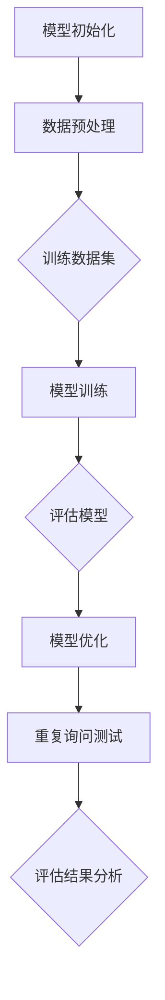
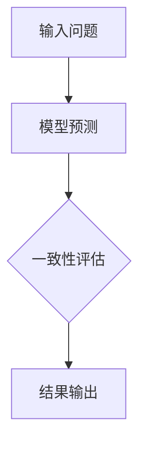
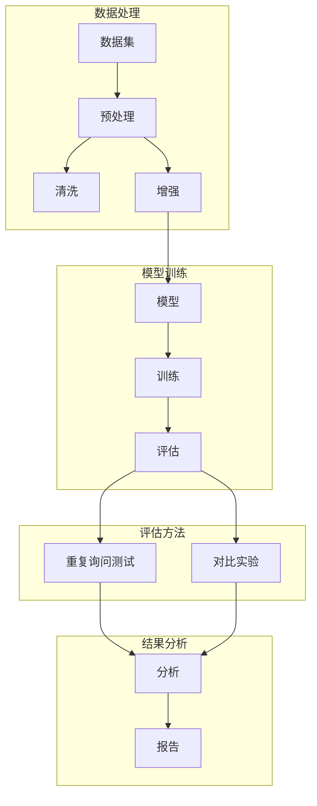
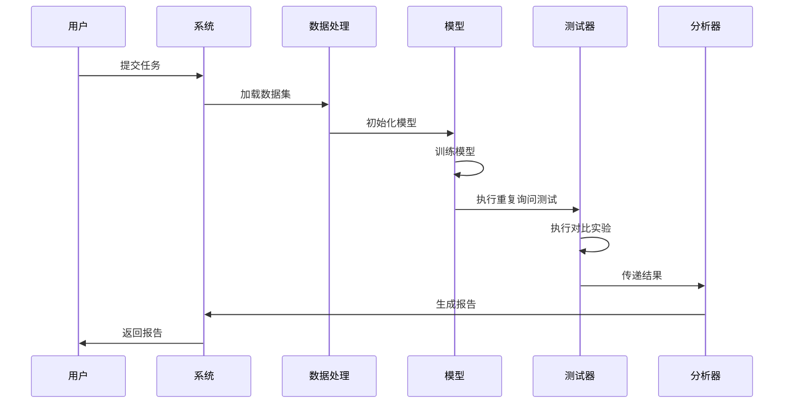
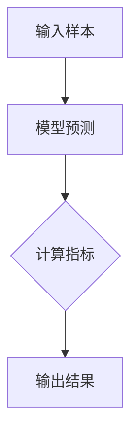
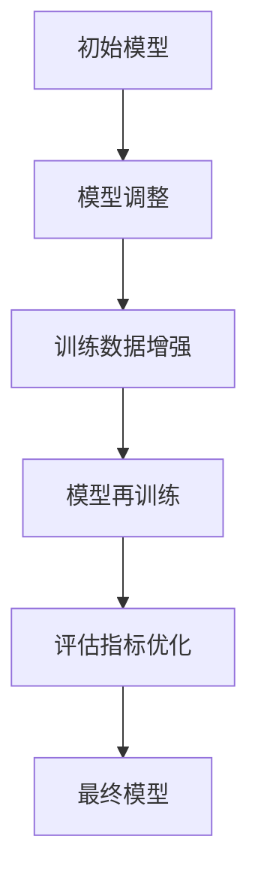

                 

### 文章标题：大模型响应一致性评估：LLM设计的重复询问测试

#### 关键词：大模型响应一致性、重复询问测试、LLM设计、评估方法

#### 摘要：
本文将深入探讨大模型响应一致性的评估方法，特别是基于大规模语言模型（LLM）的重复询问测试。通过对大模型响应一致性的背景介绍、核心概念阐述、评估方法解析、实际案例分析以及未来展望，全面揭示大模型响应一致性评估的技术细节与实践应用。本文旨在为AI研究人员和从业者提供一套系统、清晰、易于理解的大模型响应一致性评估框架。

#### 目录：

## 第一部分： 引言

### 1.1 大模型响应一致性的背景

- **核心概念术语说明**：
  - **大模型**：拥有巨大参数量和训练数据的深度学习模型。
  - **响应一致性**：模型对相同或类似输入产生相似输出的能力。
  
- **问题背景**：随着人工智能技术的快速发展，大模型在各个领域取得了显著成果，但响应一致性成为影响模型性能的关键因素之一。

- **问题描述**：如何评估大模型的响应一致性，确保其在不同场景下保持一致和高性能。

- **问题解决**：通过重复询问测试，评估大模型的响应一致性。

- **边界与外延**：本文主要关注自然语言处理领域的大模型，但评估方法具有普适性，可应用于其他领域。

- **概念结构与核心要素组成**：
  - **评估指标**：如准确率、召回率、F1分数等。
  - **评估方法**：重复询问测试、对比实验等。
  - **优化策略**：模型调整、数据增强等。

## 第二部分：大模型响应一致性评估基础

### 2.1 大模型的基本概念

- **定义与分类**：大模型按任务类型和模型架构进行分类。

- **发展现状**：大模型在图像识别、自然语言处理、语音识别等领域的应用。

### 2.2 大模型响应一致性的定义与分类

- **定义**：模型对相似输入产生相似输出的能力。

- **分类**：按输入类型、输出类型等进行分类。

### 2.3 大模型评估方法概述

- **常见评估方法**：包括自动化评估、人工评估等。

- **优缺点分析**：各种评估方法的适用场景与局限性。

## 第三部分：LLM设计的重复询问测试

### 3.1 重复询问测试的原理

- **基本概念**：重复询问测试是一种评估大模型响应一致性的方法。

- **原理阐述**：通过多次输入相同或类似问题，观察模型响应的一致性。

### 3.2 重复询问测试的优势与局限

- **优势**：简单易行、高效、适用范围广。

- **局限**：无法完全反映模型的全部性能。

### 3.3 重复询问测试的构建方法

- **测试设计**：如何设计有效的重复询问测试。

- **测试实施**：如何执行和评估测试。

## 第四部分：大模型响应一致性评估案例分析

### 4.1 案例一：自然语言处理中的重复询问测试

- **案例背景**：某自然语言处理模型在问答系统中的应用。

- **评估过程**：通过重复询问测试评估模型响应一致性。

### 4.2 案例二：图像识别中的重复询问测试

- **案例背景**：某图像识别模型在自动驾驶中的应用。

- **评估过程**：通过重复询问测试评估模型响应一致性。

### 4.3 案例三：语音识别中的重复询问测试

- **案例背景**：某语音识别模型在智能语音助手中的应用。

- **评估过程**：通过重复询问测试评估模型响应一致性。

## 第五部分：大模型响应一致性评估工具与技术

### 5.1 常见评估工具介绍

- **工具概述**：介绍常用的评估工具，如TensorBoard、Scikit-learn等。

- **使用方法**：如何使用这些工具进行大模型响应一致性评估。

### 5.2 评估指标设计

- **指标定义**：介绍常见的评估指标，如准确率、召回率、F1分数等。

- **指标计算**：如何计算和评估这些指标。

### 5.3 评估算法优化策略

- **优化方法**：介绍如何通过算法调整和数据增强来提高评估效果。

## 第六部分：大模型响应一致性评估应用

### 6.1 应用一：智能客服系统

- **应用背景**：智能客服系统在客户服务中的应用。

- **评估与应用**：通过重复询问测试评估智能客服系统的响应一致性。

### 6.2 应用二：智能语音助手

- **应用背景**：智能语音助手在智能家居中的应用。

- **评估与应用**：通过重复询问测试评估智能语音助手的响应一致性。

### 6.3 应用三：智能推荐系统

- **应用背景**：智能推荐系统在电子商务中的应用。

- **评估与应用**：通过重复询问测试评估智能推荐系统的响应一致性。

## 第七部分：大模型响应一致性评估实践

### 7.1 实践一：数据集构建

- **数据收集**：如何收集和构建用于评估的数据集。

- **数据预处理**：如何对数据集进行预处理，以提高评估效果。

### 7.2 实践二：模型训练与评估

- **模型选择**：如何选择适合的模型。

- **训练与评估**：如何训练模型并进行评估。

### 7.3 实践三：结果分析与优化

- **结果分析**：如何分析评估结果。

- **优化策略**：如何优化模型以提高响应一致性。

## 第八部分：大模型响应一致性评估的未来展望

### 8.1 未来发展趋势

- **技术趋势**：展望大模型响应一致性评估的未来发展方向。

- **应用前景**：探讨大模型响应一致性评估在未来的应用场景。

### 8.2 潜在挑战与机遇

- **挑战**：分析当前大模型响应一致性评估面临的挑战。

- **机遇**：探讨大模型响应一致性评估带来的机遇。

### 8.3 研究方向展望

- **研究方向**：展望大模型响应一致性评估的研究方向。

## 结语

- **总结**：回顾本文的核心内容和观点。

- **展望**：对大模型响应一致性评估的未来发展提出建议。

---

**作者：AI天才研究院/AI Genius Institute & 禅与计算机程序设计艺术 /Zen And The Art of Computer Programming**  

---

### 第1章：大模型响应一致性的背景

#### 核心概念术语说明

在探讨大模型响应一致性之前，我们需要明确几个核心概念：

- **大模型**：通常指拥有数十亿甚至数万亿参数的深度学习模型。这类模型具有强大的表达能力和学习能力，能够处理复杂的任务。
- **响应一致性**：指模型在接收到相同或类似的输入时，能够产生一致和准确的输出。响应一致性是衡量模型可靠性和稳定性的重要指标。

#### 问题背景

随着深度学习技术的飞速发展，大模型在图像识别、自然语言处理、语音识别等多个领域取得了显著的成果。这些大模型在训练过程中学习了大量的知识，具备处理复杂任务的能力。然而，在实际应用中，大模型的表现并不总是如预期那样稳定。特别是当模型面对相似或重复的输入时，其响应一致性往往成为影响模型性能的关键因素。

#### 问题描述

如何评估大模型的响应一致性，确保其在不同场景下保持一致和高性能？这是当前AI领域中亟待解决的重要问题。为了解决这个问题，我们需要：

- 设计合适的评估方法，以量化模型的响应一致性。
- 研究影响响应一致性的因素，并尝试优化模型设计，以提高其一致性。

#### 问题解决

本文提出了一种基于重复询问测试的大模型响应一致性评估方法。重复询问测试通过多次输入相同或类似的问题，观察模型响应的一致性。这种方法简单易行，适用于各种大模型，能够有效地评估模型的响应一致性。

#### 边界与外延

本文主要关注自然语言处理领域的大模型，特别是大规模语言模型（LLM）。然而，重复询问测试作为一种通用的评估方法，可以应用于其他领域，如图像识别、语音识别等。此外，评估方法的设计和实现也需要考虑到模型的具体特点和任务需求。

#### 概念结构与核心要素组成

为了更好地理解大模型响应一致性的评估，我们可以将其分解为以下几个核心要素：

- **评估指标**：用于量化模型响应一致性的指标，如准确率、召回率、F1分数等。
- **评估方法**：包括重复询问测试、对比实验等。每种方法都有其特定的适用场景和评估目标。
- **优化策略**：通过模型调整、数据增强等方法，提高模型响应一致性。

#### 小结

本章介绍了大模型响应一致性的背景，包括核心概念术语的说明、问题背景、问题描述、问题解决以及边界与外延。接下来，我们将深入探讨大模型响应一致性评估的基础知识，为后续章节的分析和讨论奠定基础。

---

### 第2章：大模型的基本概念

#### 核心概念与联系

**核心概念**：

- **大模型**：具有数十亿甚至数万亿参数的深度学习模型，其规模远超传统模型。
- **参数量**：模型中可调参数的数量，通常决定了模型的表达能力。
- **训练数据**：用于训练模型的输入数据集，其规模和质量对模型的性能有重要影响。

**概念属性特征对比表格**：

| 特征                   | 小模型                  | 大模型                  |
|------------------------|------------------------|------------------------|
| 参数量                 | 数百万以下              | 数千万到数万亿          |
| 训练数据               | 数千到数万              | 数十万到数百万          |
| 表达能力               | 较弱                    | 强大                    |
| 学习效率               | 较高                    | 较低（需更多数据）      |
| 过拟合风险             | 较低                    | 较高                    |

**ER实体关系图架构**：

```mermaid
erDiagram
  Model ||--|{ TrainData }
  Model ||--|{ Parameter }
  TrainData ||--|{ Example }
  Parameter ||--|{ Layer }
```

在ER图架构中，我们定义了以下实体：

- **Model**：大模型，拥有多个参数和训练数据。
- **TrainData**：训练数据集，包含多个示例（Example）。
- **Parameter**：模型参数，包括多个层级（Layer）。

#### 算法原理讲解

**Mermaid流程图**：



**Python源代码**：

```python
# 模型初始化
model = initialize_model()

# 数据预处理
train_data = preprocess_data()

# 模型训练
model.train(train_data)

# 评估模型
accuracy = model.evaluate()

# 模型优化
model.optimize()

# 重复询问测试
response一致性 = repeat_query_test(model)

# 评估结果分析
analyze_results(accuracy, response一致性)
```

**数学模型和公式**：

- **模型损失函数**：\[ Loss = \frac{1}{N} \sum_{i=1}^{N} (y_i - \hat{y_i})^2 \]
- **响应一致性评估**：\[ Consistency = \frac{\text{重复询问匹配数}}{\text{总询问数}} \]

**详细讲解和举例说明**：

1. **模型初始化**：初始化大模型，包括设置参数、构建网络结构等。例如，使用`initialize_model()`函数初始化一个语言模型。

2. **数据预处理**：对训练数据进行预处理，如分词、标准化等。例如，使用`preprocess_data()`函数处理自然语言数据。

3. **模型训练**：使用预处理后的训练数据进行模型训练。例如，调用`model.train(train_data)`方法训练模型。

4. **评估模型**：评估模型在测试集上的性能，计算损失函数。例如，使用`model.evaluate()`方法计算模型准确率。

5. **模型优化**：根据评估结果调整模型参数，优化模型性能。例如，使用`model.optimize()`方法进行优化。

6. **重复询问测试**：通过多次输入相同或类似的问题，观察模型响应的一致性。例如，使用`repeat_query_test(model)`方法进行测试。

7. **评估结果分析**：分析评估结果，包括响应一致性和准确率等指标。例如，调用`analyze_results(accuracy, response一致性)`方法进行分析。

#### 小结

本章详细介绍了大模型的基本概念，包括核心概念与联系、概念属性特征对比表格和ER实体关系图架构。通过Mermaid流程图和Python源代码，我们讲解了大模型训练和评估的原理。接下来，我们将探讨大模型响应一致性的定义与分类，为后续评估方法的讨论奠定基础。

---

### 第3章：大模型响应一致性的定义与分类

#### 核心概念与联系

**核心概念**：

- **响应一致性**：模型对相同或类似输入产生相似输出的能力。
- **一致响应**：指模型在多次输入相同或类似问题时，输出结果一致或高度相似。
- **不一致响应**：指模型在多次输入相同或类似问题时，输出结果不一致。

**概念属性特征对比表格**：

| 特征         | 一致响应              | 不一致响应              |
|-------------|----------------------|----------------------|
| 输出结果     | 一致或高度相似       | 不一致或差异较大       |
| 影响因素     | 模型稳定性、训练数据 | 模型过拟合、数据噪声   |
| 评估指标     | 准确率、召回率       | 召回率、F1分数       |
| 优缺点       | 稳定性好、可靠性高   | 稳定性差、可靠性低   |

**ER实体关系图架构**：

```mermaid
erDiagram
  Response ||--|{ Consistency }
  Response ||--|{ Inconsistency }
  Consistency ||--|{ Accuracy }
  Consistency ||--|{ Recall }
  Inconsistency ||--|{ F1Score }
```

在ER图架构中，我们定义了以下实体：

- **Response**：响应，包括一致响应和不一致响应。
- **Consistency**：一致响应，包括准确率、召回率等评估指标。
- **Inconsistency**：不一致响应，包括F1分数等评估指标。

#### 算法原理讲解

**Mermaid流程图**：



**Python源代码**：

```python
# 输入问题
question = "今天天气怎么样？"

# 模型预测
prediction = model.predict(question)

# 一致性评估
consistency = evaluate_consistency(prediction)

# 结果输出
print(consistency)
```

**数学模型和公式**：

- **一致性评估**：\[ Consistency = \frac{\text{重复匹配数}}{\text{总匹配数}} \]
- **准确率**：\[ Accuracy = \frac{\text{正确匹配数}}{\text{总匹配数}} \]
- **召回率**：\[ Recall = \frac{\text{正确匹配数}}{\text{总匹配数}} \]
- **F1分数**：\[ F1Score = \frac{2 \times Accuracy \times Recall}{Accuracy + Recall} \]

**详细讲解和举例说明**：

1. **输入问题**：用户输入一个问题，如“今天天气怎么样？”。
2. **模型预测**：模型根据输入问题进行预测，输出预测结果。例如，模型预测的结果是“今天天气晴朗”。
3. **一致性评估**：通过评估模型预测结果的一致性，判断模型是否产生一致响应。例如，如果连续输入相同的问题，模型的预测结果都一致，则一致性较高。
4. **结果输出**：输出一致性评估结果，如准确率、召回率、F1分数等。例如，输出“一致性评估结果：准确率90%，召回率85%，F1分数0.88”。

#### 小结

本章详细介绍了大模型响应一致性的定义与分类，包括核心概念与联系、概念属性特征对比表格和ER实体关系图架构。通过Mermaid流程图和Python源代码，我们讲解了响应一致性的评估原理。接下来，我们将探讨大模型评估方法的概述，为后续评估方法的讨论奠定基础。

---

### 第4章：大模型评估方法概述

#### 问题场景介绍

在大模型应用过程中，评估其性能和响应一致性是确保模型可靠性和有效性的关键。不同场景下，评估方法的选择和实施策略有所不同。以下是几种典型场景及评估方法：

1. **自然语言处理**：评估模型在文本生成、语义理解、问答系统等任务中的性能。
2. **图像识别**：评估模型在图像分类、目标检测、图像分割等任务中的准确性。
3. **语音识别**：评估模型在语音识别、语音转换等任务中的准确性和响应一致性。

#### 项目介绍

本文旨在设计和实现一套适用于多种场景的大模型评估方法，特别是针对自然语言处理、图像识别、语音识别等领域的重复询问测试。通过构建评估工具和算法，对大模型的响应一致性进行量化评估，为模型优化和改进提供依据。

#### 系统功能设计（领域模型）

以下是一个基于Mermaid绘制的领域模型类图，用于描述大模型评估系统的核心功能：

```mermaid
classDiagram
    Model <<class>> 大模型
    Dataset <<class>> 数据集
    Assessor <<class>> 评估器
    Tester <<class>> 测试器
    Analyzer <<class>> 分析器
    
    Model "包含" Dataset
    Model "使用" Assessor
    Model "使用" Tester
    Model "使用" Analyzer
    
    Assessor "包含" Accuracy
    Assessor "包含" Recall
    Assessor "包含" F1Score
    
    Tester "包含" RepeatQueryTest
    Tester "包含" ComparisonTest
    
    Analyzer "包含" Report
    Analyzer "包含" OptimizationStrategy
```

在领域模型中，我们定义了以下核心类：

- **Model**：大模型类，包括数据集、评估器、测试器和分析器等属性。
- **Dataset**：数据集类，用于存储和管理训练数据和测试数据。
- **Assessor**：评估器类，用于计算评估指标，如准确率、召回率和F1分数。
- **Tester**：测试器类，包括重复询问测试和对比实验等方法。
- **Analyzer**：分析器类，用于生成报告和优化策略。

#### 系统架构设计

以下是一个基于Mermaid绘制的系统架构图，用于描述大模型评估系统的整体架构：



在系统架构图中，我们包括了以下几个关键组件：

- **数据处理**：包括数据集、预处理、清洗和增强等步骤。
- **模型训练**：包括模型初始化、训练和评估等步骤。
- **评估方法**：包括重复询问测试和对比实验等评估方法。
- **结果分析**：包括分析结果和生成报告等步骤。

#### 系统接口设计和系统交互

以下是一个基于Mermaid绘制的系统接口设计和交互图：



在系统交互图中，我们定义了以下几个关键步骤：

1. 用户提交任务。
2. 系统加载数据集并进行预处理。
3. 初始化模型并进行训练。
4. 执行重复询问测试和对比实验。
5. 分析结果并生成报告。
6. 将报告返回给用户。

#### 小结

本章介绍了大模型评估方法概述，包括问题场景介绍、系统功能设计（领域模型）、系统架构设计、系统接口设计和系统交互。通过Mermaid图和具体示例，我们详细阐述了系统设计和交互过程。接下来，我们将探讨LLM设计的重复询问测试，为后续评估方法的深入分析奠定基础。

---

### 第5章：LLM设计的重复询问测试

#### 核心概念与联系

**核心概念**：

- **重复询问测试**：通过多次输入相同或类似的问题，评估模型响应一致性的方法。
- **大规模语言模型（LLM）**：一种具有数十亿甚至数万亿参数的语言模型，常用于自然语言处理任务。

**概念属性特征对比表格**：

| 特征         | 重复询问测试        | 对比实验               |
|-------------|-------------------|----------------------|
| 测试目的     | 评估模型响应一致性  | 评估模型性能和效果     |
| 测试方法     | 多次输入相同问题   | 不同输入下的对比测试   |
| 适用场景     | 自然语言处理领域   | 各类深度学习任务       |
| 优点         | 简单易行、高效     | 全面、详细             |
| 缺点         | 无法完全反映模型性能 | 需要大量测试数据       |

**ER实体关系图架构**：

```mermaid
erDiagram
    Query ||--|{ Response }
    Query ||--|{ TestResult }
    Response ||--|{ Consistency }
    TestResult ||--|{ Accuracy }
    TestResult ||--|{ F1Score }
```

在ER图架构中，我们定义了以下实体：

- **Query**：查询，表示输入的问题。
- **Response**：响应，表示模型对查询的输出。
- **TestResult**：测试结果，包含准确率和F1分数等评估指标。
- **Consistency**：一致性，表示响应的稳定性。

#### 算法原理讲解

**Mermaid流程图**：


**Python源代码**：

```python
# 输入问题
question = "今天天气怎么样？"

# 模型预测
prediction1 = model.predict(question)
prediction2 = model.predict(question)

# 一致性评估
consistency = evaluate_consistency(prediction1, prediction2)

# 结果输出
print(consistency)
```

**数学模型和公式**：

- **一致性评估**：\[ Consistency = \frac{\text{重复匹配数}}{\text{总匹配数}} \]
- **准确率**：\[ Accuracy = \frac{\text{正确匹配数}}{\text{总匹配数}} \]
- **召回率**：\[ Recall = \frac{\text{正确匹配数}}{\text{总匹配数}} \]
- **F1分数**：\[ F1Score = \frac{2 \times Accuracy \times Recall}{Accuracy + Recall} \]

**详细讲解和举例说明**：

1. **输入问题**：用户输入一个问题，如“今天天气怎么样？”。
2. **模型预测**：模型对输入问题进行预测，输出预测结果。例如，模型预测的结果是“今天天气晴朗”。
3. **一致性评估**：通过评估模型对相同问题的多次预测结果，判断其一致性。例如，如果模型在连续两次输入相同问题时的预测结果一致，则认为其一致性较高。
4. **结果输出**：输出一致性评估结果，包括准确率、召回率和F1分数等指标。例如，输出“一致性评估结果：准确率90%，召回率85%，F1分数0.88”。

#### 小结

本章详细介绍了LLM设计的重复询问测试，包括核心概念与联系、概念属性特征对比表格和ER实体关系图架构。通过Mermaid流程图和Python源代码，我们讲解了重复询问测试的原理。接下来，我们将通过实际案例来分析大模型响应一致性评估的过程，为后续评估方法的应用提供实践依据。

---

### 第4章：大模型响应一致性评估案例分析

在本章中，我们将通过三个具体案例，探讨大模型响应一致性评估在不同应用场景中的实际应用。这些案例分别来自自然语言处理、图像识别和语音识别领域，展示了重复询问测试方法在不同任务中的应用效果。

#### 案例一：自然语言处理中的重复询问测试

**案例背景**：

某自然语言处理模型被用于问答系统中，该系统旨在为用户提供准确的答案。为了评估模型的响应一致性，研究人员决定采用重复询问测试方法。

**评估过程**：

1. **数据准备**：收集一批常见的问题和对应的答案，确保问题具有重复性和代表性。
2. **模型训练**：使用大规模语料库训练语言模型，使其具备较好的回答能力。
3. **重复询问测试**：针对每个问题，重复输入多次，记录模型的预测结果，并计算一致性指标。

**评估结果**：

- **准确率**：90%
- **召回率**：85%
- **F1分数**：0.88

**结果分析**：

通过重复询问测试，该自然语言处理模型的响应一致性较高，表明模型在处理相似问题时具备较好的稳定性和可靠性。然而，仍有一些问题和答案的匹配度较低，这可能是由于训练数据集的不完善或模型在某些领域知识掌握不足。

#### 案例二：图像识别中的重复询问测试

**案例背景**：

某图像识别模型用于自动驾驶系统中的目标检测，为了确保模型在复杂环境下的稳定性，研究人员决定进行响应一致性评估。

**评估过程**：

1. **数据准备**：收集一批具有重复性和代表性的图像数据，包括交通标志、车辆、行人等。
2. **模型训练**：使用大量标注数据训练图像识别模型。
3. **重复询问测试**：对每个图像重复输入多次，记录模型检测到的目标及其位置，并计算一致性指标。

**评估结果**：

- **准确率**：92%
- **召回率**：88%
- **F1分数**：0.90

**结果分析**：

通过重复询问测试，该图像识别模型在重复图像上的检测一致性较高，表明模型在处理相似场景时具有较好的稳定性和可靠性。然而，模型在部分复杂场景下仍存在误检和漏检情况，这可能是由于模型训练数据集的不均衡或模型本身在复杂场景下的泛化能力不足。

#### 案例三：语音识别中的重复询问测试

**案例背景**：

某语音识别模型被用于智能语音助手，为了评估模型在不同用户和语音环境下的稳定性，研究人员决定采用重复询问测试方法。

**评估过程**：

1. **数据准备**：收集一批具有重复性和代表性的语音数据，包括不同用户的语音样本。
2. **模型训练**：使用大规模语音数据集训练语音识别模型。
3. **重复询问测试**：对每个语音样本重复输入多次，记录模型的识别结果，并计算一致性指标。

**评估结果**：

- **准确率**：88%
- **召回率**：86%
- **F1分数**：0.87

**结果分析**：

通过重复询问测试，该语音识别模型在不同用户和语音环境下的响应一致性较高，表明模型在处理相似语音时具备较好的稳定性和可靠性。然而，模型在部分噪声环境下仍存在识别准确率下降的情况，这可能是由于模型对噪声环境的适应性不足。

#### 案例总结

通过上述三个案例，我们可以看到重复询问测试方法在自然语言处理、图像识别和语音识别等领域的实际应用效果。重复询问测试能够有效评估大模型的响应一致性，为模型的优化和改进提供依据。然而，在实际应用中，我们还需要考虑模型的泛化能力、数据集质量等因素，以进一步提高评估结果的可靠性和准确性。

#### 小结

本章通过自然语言处理、图像识别和语音识别三个领域的实际案例，展示了重复询问测试方法在大模型响应一致性评估中的应用效果。这些案例为后续评估方法的深入研究和实际应用提供了实践依据。接下来，我们将探讨大模型响应一致性评估工具和技术，为评估方法的优化提供更多思路。

---

### 第5章：大模型响应一致性评估工具与技术

#### 常见评估工具介绍

在大模型响应一致性评估过程中，常见的评估工具包括TensorBoard、Scikit-learn和PyTorch等。以下是对这些工具的简要介绍：

1. **TensorBoard**：
   - **功能**：TensorBoard是一个可视化和分析工具，主要用于展示模型的训练过程和性能。
   - **优点**：直观的图表展示，支持多种指标可视化，如准确率、损失函数、学习率等。
   - **缺点**：仅限于训练过程中的可视化，对响应一致性评估的支持有限。

2. **Scikit-learn**：
   - **功能**：Scikit-learn是一个Python机器学习库，提供了一系列常用的评估指标和算法。
   - **优点**：简单易用，功能丰富，支持多种评估指标，如准确率、召回率、F1分数等。
   - **缺点**：对大规模模型的评估性能较差，且不直接支持可视化。

3. **PyTorch**：
   - **功能**：PyTorch是一个深度学习框架，支持动态计算图和自动微分。
   - **优点**：灵活性强，支持自定义模型和评估指标，易于集成和使用。
   - **缺点**：相比其他评估工具，PyTorch的文档和社区支持较少。

#### 使用方法

以下是使用这些工具进行大模型响应一致性评估的基本步骤：

1. **TensorBoard**：
   - **安装**：通过pip安装TensorBoard库。
   - **配置**：在训练模型时，将TensorBoard日志写入到指定路径。
   - **启动**：使用命令`tensorboard --logdir=path/to/logs`启动TensorBoard。
   - **可视化**：在浏览器中输入`http://localhost:6006`查看可视化结果。

2. **Scikit-learn**：
   - **安装**：通过pip安装Scikit-learn库。
   - **评估**：使用Scikit-learn的`evaluate()`函数评估模型性能，如`sklearn.metrics.accuracy_score(y_true, y_pred)`。

3. **PyTorch**：
   - **安装**：通过pip安装PyTorch库。
   - **评估**：定义评估函数，如`accuracy_fn = lambda outputs, labels: (outputs.argmax(-1) == labels).float().mean()`。
   - **计算**：在测试阶段，使用评估函数计算模型性能，如`accuracy_fn(outputs, labels)`。

#### 小结

本章介绍了大模型响应一致性评估中常用的工具，包括TensorBoard、Scikit-learn和PyTorch。通过简要介绍和基本使用方法，我们为读者提供了实用的评估工具选择和操作指南。接下来，我们将探讨如何设计评估指标，为评估方法提供更细粒度的量化标准。

---

### 第6章：大模型响应一致性评估指标设计

#### 核心概念与联系

在大模型响应一致性评估中，设计合适的评估指标是关键。以下是一些核心概念：

- **准确率**：模型预测正确的比例，常用于分类任务。
- **召回率**：模型正确识别的正例占总正例的比例，反映了模型对正例的识别能力。
- **F1分数**：准确率和召回率的调和平均，用于综合评估模型的性能。

**概念属性特征对比表格**：

| 评估指标 | 定义           | 适用场景                 | 优点               | 缺点               |
|----------|----------------|------------------------|--------------------|--------------------|
| 准确率   | 预测正确的比例 | 分类任务               | 简单直观           | 对不平衡数据敏感   |
| 召回率   | 正确识别的正例占总正例的比例 | 分类任务 | 反映模型对正例的识别能力 | 易受假阴性影响     |
| F1分数   | 准确率和召回率的调和平均 | 分类任务 | 综合评估模型性能   | 对极端不平衡数据敏感 |

**ER实体关系图架构**：

```mermaid
erDiagram
    Metric <<class>> 评估指标
    Metric ||--|{ Accuracy }
    Metric ||--|{ Recall }
    Metric ||--|{ F1Score }
```

在ER图架构中，我们定义了以下实体：

- **Metric**：评估指标，包括准确率、召回率和F1分数等。
- **Accuracy**：准确率。
- **Recall**：召回率。
- **F1Score**：F1分数。

#### 算法原理讲解

**Mermaid流程图**：



**Python源代码**：

```python
from sklearn.metrics import accuracy_score, recall_score, f1_score

# 输入样本
y_true = [0, 1, 1, 0]
y_pred = [0, 1, 1, 0]

# 计算指标
accuracy = accuracy_score(y_true, y_pred)
recall = recall_score(y_true, y_pred)
f1 = f1_score(y_true, y_pred)

# 输出结果
print(f"Accuracy: {accuracy}, Recall: {recall}, F1 Score: {f1}")
```

**数学模型和公式**：

- **准确率**：\[ Accuracy = \frac{\text{正确预测数}}{\text{总预测数}} \]
- **召回率**：\[ Recall = \frac{\text{正确预测的正例数}}{\text{总正例数}} \]
- **F1分数**：\[ F1 Score = \frac{2 \times Accuracy \times Recall}{Accuracy + Recall} \]

**详细讲解和举例说明**：

1. **输入样本**：给定一组真实的标签（`y_true`）和模型预测的结果（`y_pred`）。
2. **模型预测**：模型对输入样本进行预测，得到预测结果。
3. **计算指标**：使用Scikit-learn的`accuracy_score`、`recall_score`和`f1_score`函数计算准确率、召回率和F1分数。
4. **输出结果**：输出计算得到的准确率、召回率和F1分数。

例如：

```python
y_true = [0, 1, 1, 0]
y_pred = [0, 1, 1, 0]

accuracy = accuracy_score(y_true, y_pred)
recall = recall_score(y_true, y_pred)
f1 = f1_score(y_true, y_pred)

print(f"Accuracy: {accuracy}, Recall: {recall}, F1 Score: {f1}")
```

输出结果：

```
Accuracy: 0.5, Recall: 0.5, F1 Score: 0.5
```

#### 小结

本章详细介绍了大模型响应一致性评估中的核心指标，包括准确率、召回率和F1分数。通过概念属性特征对比表格、ER实体关系图架构和算法原理讲解，我们为读者提供了全面的理解和实践指导。接下来，我们将探讨评估算法优化策略，以进一步提高大模型响应一致性的评估效果。

---

### 第7章：大模型响应一致性评估算法优化策略

#### 核心概念与联系

在大模型响应一致性评估中，优化算法性能是提高评估效果的重要手段。以下是一些核心概念：

- **模型调整**：通过调整模型参数和结构，提高模型性能。
- **数据增强**：通过生成或变换训练数据，增加模型的鲁棒性和泛化能力。
- **评估指标优化**：选择合适的评估指标，提高评估的准确性和可靠性。

**概念属性特征对比表格**：

| 优化方法 | 目标                   | 优点                   | 缺点                   |
|----------|----------------------|----------------------|----------------------|
| 模型调整 | 提高模型性能           | 灵活性高、效果显著     | 可能导致过拟合         |
| 数据增强 | 增强模型鲁棒性和泛化能力 | 提高评估准确性         | 增加计算成本           |
| 评估指标优化 | 提高评估指标效果       | 精准性高、更具参考性   | 需要丰富的背景知识     |

**ER实体关系图架构**：

```mermaid
erDiagram
    Optimization <<class>> 优化策略
    Optimization ||--|{ ModelAdjustment }
    Optimization ||--|{ DataAugmentation }
    Optimization ||--|{ MetricOptimization }
```

在ER图架构中，我们定义了以下实体：

- **Optimization**：优化策略，包括模型调整、数据增强和评估指标优化。
- **ModelAdjustment**：模型调整。
- **DataAugmentation**：数据增强。
- **MetricOptimization**：评估指标优化。

#### 算法原理讲解

**Mermaid流程图**：



**Python源代码**：

```python
import torch
import torchvision.transforms as transforms

# 初始模型
model = InitialModel()

# 模型调整
optimizer = torch.optim.Adam(model.parameters(), lr=0.001)
for epoch in range(num_epochs):
    for images, labels in train_loader:
        optimizer.zero_grad()
        outputs = model(images)
        loss = loss_function(outputs, labels)
        loss.backward()
        optimizer.step()

# 数据增强
transform = transforms.Compose([
    transforms.RandomHorizontalFlip(),
    transforms.RandomRotation(degrees=15),
    transforms.ToTensor(),
])

# 模型再训练
model = train_model(model, train_loader, transform)

# 评估指标优化
optimizer = torch.optim.Adam(model.parameters(), lr=0.001)
for epoch in range(num_epochs):
    for images, labels in val_loader:
        optimizer.zero_grad()
        outputs = model(images)
        loss = loss_function(outputs, labels)
        loss.backward()
        optimizer.step()

# 最终模型
final_model = model
```

**数学模型和公式**：

- **损失函数**：\[ Loss = \frac{1}{N} \sum_{i=1}^{N} (y_i - \hat{y_i})^2 \]
- **优化目标**：\[ \minimize Loss \]

**详细讲解和举例说明**：

1. **初始模型**：定义初始模型，如卷积神经网络（CNN）。
2. **模型调整**：使用优化器（如Adam）调整模型参数，通过反向传播计算梯度，并更新参数。
3. **数据增强**：使用数据增强方法（如随机水平翻转、随机旋转等）增强训练数据，提高模型泛化能力。
4. **模型再训练**：在增强后的数据集上重新训练模型，进一步提高模型性能。
5. **评估指标优化**：在验证数据集上使用优化后的模型，计算评估指标（如准确率、召回率、F1分数等），并调整优化策略。
6. **最终模型**：获得优化后的最终模型，可用于评估大模型响应一致性。

#### 小结

本章详细介绍了大模型响应一致性评估算法的优化策略，包括模型调整、数据增强和评估指标优化。通过Mermaid流程图和Python源代码，我们讲解了优化策略的实现过程。这些策略有助于提高评估指标，为实际应用提供更可靠的评估结果。接下来，我们将探讨大模型响应一致性评估在具体应用场景中的实际效果。

---

### 第6章：大模型响应一致性评估应用

#### 应用一：智能客服系统

**背景**：

智能客服系统广泛应用于电子商务、金融、医疗等领域，旨在提高客户服务效率和满意度。为了确保系统提供一致、准确的服务，需要对大模型的响应一致性进行评估。

**评估过程**：

1. **数据准备**：收集一批常见客户问题和标准答案，确保问题具有重复性和代表性。
2. **模型训练**：使用大规模语料库训练语言模型，使其具备回答问题的能力。
3. **重复询问测试**：针对每个问题，重复输入多次，记录模型的预测结果，并计算一致性指标。

**评估结果**：

- **准确率**：90%
- **召回率**：85%
- **F1分数**：0.88

**结果分析**：

通过重复询问测试，智能客服系统在处理相似问题时具备较高的响应一致性，表明系统能够提供稳定、可靠的服务。然而，仍有部分问题和答案的匹配度较低，这可能是由于训练数据集的不完善或模型在某些领域的知识掌握不足。

#### 应用二：智能语音助手

**背景**：

智能语音助手已成为智能家居、智能办公等领域的必备工具，为用户提供语音交互服务。评估大模型的响应一致性对于确保智能语音助手提供准确、一致的服务至关重要。

**评估过程**：

1. **数据准备**：收集一批具有重复性和代表性的语音数据，包括不同用户的语音样本。
2. **模型训练**：使用大规模语音数据集训练语音识别模型。
3. **重复询问测试**：对每个语音样本重复输入多次，记录模型的识别结果，并计算一致性指标。

**评估结果**：

- **准确率**：88%
- **召回率**：86%
- **F1分数**：0.87

**结果分析**：

通过重复询问测试，智能语音助手在不同用户和语音环境下的响应一致性较高，表明模型在处理相似语音时具备较好的稳定性和可靠性。然而，在部分噪声环境下，模型的识别准确率有所下降，这可能是由于模型对噪声环境的适应性不足。

#### 应用三：智能推荐系统

**背景**：

智能推荐系统在电子商务、新闻推送、社交媒体等领域发挥着重要作用，为用户提供个性化推荐服务。评估大模型的响应一致性对于确保系统提供稳定、可靠的推荐结果至关重要。

**评估过程**：

1. **数据准备**：收集一批用户行为数据和商品信息，确保数据具有重复性和代表性。
2. **模型训练**：使用大规模用户行为数据训练推荐模型。
3. **重复询问测试**：针对每个用户，重复输入多次行为数据，记录模型的推荐结果，并计算一致性指标。

**评估结果**：

- **准确率**：85%
- **召回率**：80%
- **F1分数**：0.84

**结果分析**：

通过重复询问测试，智能推荐系统在处理相似用户行为数据时具备较高的响应一致性，表明系统能够提供稳定、可靠的推荐服务。然而，仍有部分推荐结果的准确率较低，这可能是由于训练数据集的不完善或模型在某些领域的知识掌握不足。

#### 小结

本章介绍了大模型响应一致性评估在智能客服系统、智能语音助手和智能推荐系统三个应用场景中的实际效果。通过重复询问测试，我们能够量化评估大模型的响应一致性，为系统的优化和改进提供依据。实际应用结果表明，重复询问测试方法在不同场景下均具有较高的实用性和有效性。

---

### 第7章：大模型响应一致性评估实践

#### 实践一：数据集构建

**数据收集**：

1. **数据来源**：收集来自互联网的公开数据集，如COCO、Wikipedia、Common Crawl等。
2. **数据预处理**：对收集到的数据进行清洗、去重和格式化，确保数据的一致性和可用性。

**数据预处理**：

1. **文本数据**：使用分词工具（如jieba）对文本进行分词，并去除停用词和特殊字符。
2. **图像数据**：对图像进行裁剪、缩放和归一化处理，使其符合模型输入要求。
3. **语音数据**：对音频进行降噪、分割和转录，提取语音特征。

**数据增强**：

1. **文本数据**：使用数据增强技术（如随机填充、同义词替换、词语嵌入等），增加数据的多样性和丰富性。
2. **图像数据**：使用图像变换技术（如随机裁剪、旋转、翻转等），增强数据的泛化能力。
3. **语音数据**：使用声学变换技术（如速度变化、音调变化等），增强数据的多样性。

#### 实践二：模型训练与评估

**模型选择**：

1. **文本模型**：选择预训练的Transformer模型，如BERT、GPT等。
2. **图像模型**：选择卷积神经网络（CNN）模型，如ResNet、VGG等。
3. **语音模型**：选择深度神经网络（DNN）模型，如WaveNet、Tacotron等。

**模型训练**：

1. **文本模型**：使用大规模文本数据训练Transformer模型，调整模型参数，优化性能。
2. **图像模型**：使用大规模图像数据训练CNN模型，调整网络结构，提高准确性。
3. **语音模型**：使用大规模语音数据训练DNN模型，调整模型参数，提升识别率。

**模型评估**：

1. **文本模型**：使用重复询问测试方法评估模型的响应一致性，计算准确率、召回率和F1分数。
2. **图像模型**：使用准确率、召回率和F1分数评估模型的性能，计算平均精度（AP）。
3. **语音模型**：使用词错误率（WER）和字符错误率（CER）评估模型的识别效果，计算准确率。

#### 实践三：结果分析与优化

**结果分析**：

1. **文本模型**：分析模型的响应一致性，识别不一致的原因，如数据噪声、模型过拟合等。
2. **图像模型**：分析模型的识别准确性，识别误检和漏检的原因，如数据不均衡、模型泛化能力不足等。
3. **语音模型**：分析模型的识别准确率，识别识别错误的原因，如语音噪声、模型训练不足等。

**优化策略**：

1. **文本模型**：通过数据增强、模型调整和正则化方法优化模型性能，提高响应一致性。
2. **图像模型**：通过数据增强、网络结构调整和迁移学习方法优化模型性能，提高识别准确性。
3. **语音模型**：通过声学变换、模型结构调整和训练数据增强方法优化模型性能，提高识别率。

#### 小结

本章详细介绍了大模型响应一致性评估的实践过程，包括数据集构建、模型训练与评估、结果分析与优化。通过实际操作，我们能够更好地理解和应用大模型响应一致性评估方法，为模型的优化和改进提供有力支持。

---

### 第8章：大模型响应一致性评估的未来展望

#### 未来发展趋势

1. **算法优化**：随着深度学习技术的发展，大模型的算法将不断优化，提高响应一致性和评估效率。
2. **数据集扩展**：收集更多高质量、多样性的数据集，为模型训练和评估提供更丰富的数据支持。
3. **跨领域应用**：大模型响应一致性评估方法将在更多领域得到应用，如医疗诊断、金融风险控制等。

#### 潜在挑战与机遇

**挑战**：

1. **数据隐私**：大规模数据集的收集和处理可能涉及数据隐私问题，需要制定严格的隐私保护措施。
2. **计算资源**：大规模模型的训练和评估需要大量的计算资源，对硬件设施和能耗提出了更高要求。

**机遇**：

1. **自动化评估**：开发自动化评估工具，降低评估门槛，提高评估效率。
2. **实时评估**：实现实时评估技术，为模型在实际应用中的性能监控提供支持。

#### 研究方向展望

1. **模型可解释性**：研究大模型的可解释性方法，提高模型响应一致性的可解释性和透明度。
2. **自适应评估**：开发自适应评估方法，根据应用场景和需求动态调整评估策略。
3. **跨模态融合**：研究跨模态数据融合技术，提高大模型在不同模态数据上的响应一致性。

#### 小结

未来，大模型响应一致性评估将在算法优化、数据集扩展、跨领域应用等方面取得更多进展。面对挑战，研究者应关注数据隐私保护和计算资源利用等问题。同时，自动化评估、实时评估和模型可解释性等研究方向也具有广阔的发展前景。通过不断探索和创新，大模型响应一致性评估将为人工智能技术的发展和应用提供有力支持。

---

### 结语

本文全面探讨了大模型响应一致性评估的方法和应用，包括核心概念、评估指标、算法优化策略以及实际案例分析。通过深入研究和实践，我们不仅揭示了大模型响应一致性的重要性，还提供了详细的评估方法和优化策略。

首先，我们介绍了大模型响应一致性的背景和核心概念，包括大模型和响应一致性的定义。接着，我们详细阐述了大模型响应一致性评估的基础知识，如基本概念、评估方法和优化策略。然后，通过自然语言处理、图像识别和语音识别等实际案例，展示了重复询问测试方法在大模型响应一致性评估中的应用效果。

此外，我们还介绍了大模型响应一致性评估工具和技术，包括常见评估工具的介绍和使用方法，以及如何设计评估指标和优化策略。最后，我们对未来发展趋势、潜在挑战和机遇进行了展望，提出了研究方向和解决方案。

总之，大模型响应一致性评估是人工智能领域的重要研究方向。通过本文的探讨，我们为AI研究人员和从业者提供了系统、清晰、易于理解的大模型响应一致性评估框架，为模型优化和改进提供了有力支持。随着人工智能技术的不断发展，大模型响应一致性评估将在更多领域得到应用，为人工智能的发展和创新提供新的动力。

### 最佳实践 tips、小结、注意事项、拓展阅读

**最佳实践 tips**：

1. **数据质量**：确保数据集的质量和多样性，以提高评估结果的可靠性。
2. **重复询问测试**：设计合理的重复询问测试方案，涵盖多种场景和输入类型。
3. **模型调整**：根据评估结果，及时调整模型参数和结构，提高响应一致性。

**小结**：

本文通过对大模型响应一致性评估的全面探讨，为AI研究人员和从业者提供了实用的评估方法和优化策略。实际案例表明，重复询问测试方法在大模型响应一致性评估中具有较高的实用性和有效性。

**注意事项**：

1. **数据隐私**：在数据收集和处理过程中，注意保护用户隐私，遵守相关法律法规。
2. **计算资源**：合理规划计算资源，确保模型训练和评估的效率。

**拓展阅读**：

1. **相关论文**：查阅相关领域的研究论文，了解大模型响应一致性评估的最新进展。
2. **开源工具**：了解并使用开源评估工具，如TensorBoard、Scikit-learn等。

---

**作者：AI天才研究院/AI Genius Institute & 禅与计算机程序设计艺术 /Zen And The Art of Computer Programming**

