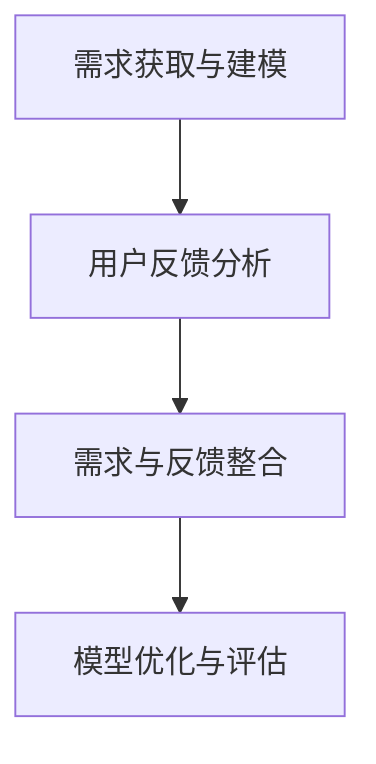
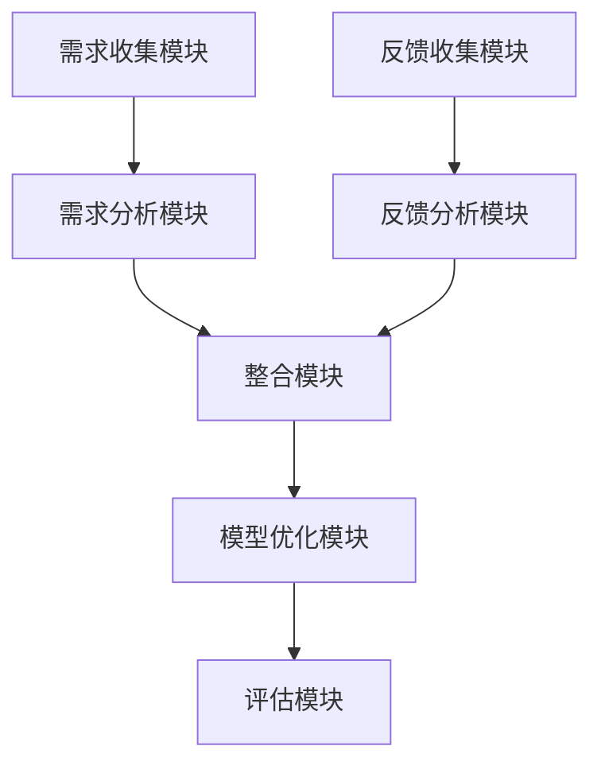
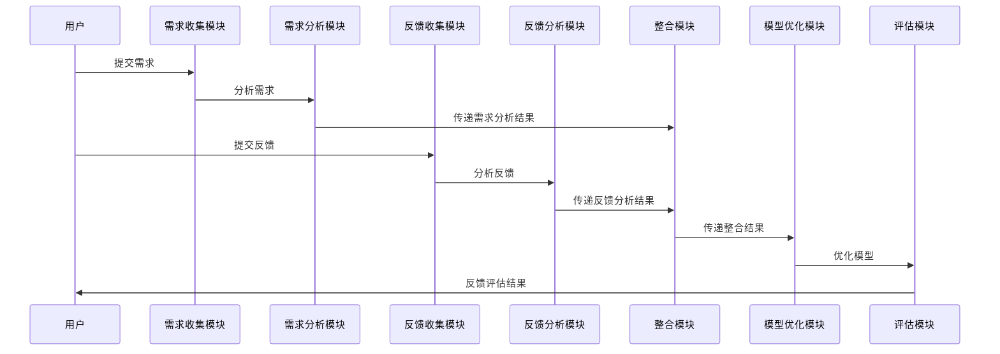

                 

### 《大模型应用中的需求与用户反馈整合策略》

> 关键词：大模型应用、需求整合、用户反馈、算法原理、系统设计、项目实战

> 摘要：本文旨在探讨大模型应用中需求与用户反馈的整合策略。通过背景介绍、核心概念阐述、算法原理讲解、系统分析与架构设计、项目实战等多个角度，深入分析大模型应用中的需求与用户反馈整合策略，提供系统化的解决方案和实用技巧。

## 第一部分：背景与基础

### 1.1 大模型应用现状分析

在大模型应用日益普及的当下，需求与用户反馈的整合显得尤为重要。大模型，如深度学习模型、自然语言处理模型等，通常需要处理海量数据并进行复杂计算，以满足不同领域的应用需求。然而，用户在使用过程中可能会提出各种各样的反馈，这些反馈涵盖了功能需求、性能需求、用户体验等多个方面。

- **需求现状**：随着人工智能技术的进步，大模型的应用需求不断增长。从图像识别、语音识别到自然语言处理，大模型在各个领域的表现越来越优秀。然而，这些模型的开发和应用过程中，如何准确把握用户的需求，成为了一个亟待解决的问题。

- **用户反馈的影响**：用户反馈是大模型优化和改进的重要来源。良好的用户反馈可以帮助开发者及时发现问题，优化模型性能，提升用户体验。然而，用户反馈的多样性和复杂性也给整合工作带来了挑战。

### 1.2 需求与用户反馈整合策略概述

需求与用户反馈整合策略的核心在于如何将用户的需求和反馈有效地转化为具体的改进措施。这一策略不仅需要技术上的支持，还需要在组织管理、流程优化等方面进行深入探讨。

- **定义**：需求与用户反馈整合策略是一种将用户需求转化为实际改进方案的过程，包括数据收集、分析、评估和实施等多个环节。

- **核心概念与联系**：需求与用户反馈整合策略涉及多个核心概念，包括需求获取、用户反馈分析、数据挖掘、模型优化等。这些概念相互关联，共同构成了一个完整的工作流程。

### 1.3 整合策略的核心概念与联系

#### 1.3.1 需求分析原理

**需求获取与建模方法**：在需求分析过程中，首先需要收集用户的需求信息，并通过建模方法将需求转化为可操作的数据。

**需求分析与评估技巧**：通过对需求进行深入分析，评估其可行性和优先级，为后续的整合工作提供指导。

#### 1.3.2 用户反馈分析原理

**用户反馈的数据来源**：用户反馈可以从多个渠道获取，如在线调查、用户评论、用户行为数据等。

**用户反馈的挖掘与分析**：通过对用户反馈的数据进行挖掘和分析，提取出有价值的信息，为需求整合提供依据。

### 1.4 使用Mermaid绘制ER实体关系图架构

```mermaid
erDiagram
    UserFeedback ||--o>> Requirement : 产生
    Requirement ||--o>> ModelOptimization : 用于
    ModelOptimization ||--o>> ImprovedModel : 生成
    ImprovedModel ||--|>> UserFeedback : 反馈循环
```

在上述ER实体关系图中，用户反馈（UserFeedback）产生需求（Requirement），需求用于模型优化（ModelOptimization），优化的模型生成改进后的模型（ImprovedModel），该模型继续影响用户反馈，形成反馈循环。

## 第二部分：算法原理讲解

### 2.1 整合策略算法概述

需求与用户反馈整合策略的算法原理可以分为以下几个步骤：

1. **需求获取与建模**：通过多种渠道收集用户需求，并将其转化为结构化的数据模型。
2. **用户反馈分析**：对用户反馈进行数据挖掘，提取有价值的信息。
3. **需求与反馈整合**：将需求和反馈进行整合，形成优化方案。
4. **模型优化与评估**：根据整合方案对模型进行优化，并评估优化效果。

以下是一个简单的算法流程图：



### 2.2 使用Python源代码和Mermaid流程图详细阐述

#### 2.2.1 需求获取与建模

首先，我们需要编写一个Python脚本，用于从用户获取需求并将其建模。以下是一个简单的示例：

```python
import json

# 假设从用户处获取的需求为JSON格式
user_requirement = {
    "feature": "图像识别速度",
    "priority": "高",
    "description": "图像识别速度太慢，影响用户体验"
}

# 将需求存储为结构化数据
def store_requirement(req):
    with open('requirements.json', 'a') as f:
        json.dump(req, f)
        f.write('\n')

store_requirement(user_requirement)
```

#### 2.2.2 用户反馈分析

接下来，我们需要分析用户反馈，提取出有价值的信息。以下是一个简单的用户反馈分析脚本：

```python
import json

# 读取存储的需求
with open('requirements.json', 'r') as f:
    requirements = json.load(f)

# 分析需求，提取关键词
def analyze_requirement(reqs):
    keywords = []
    for req in reqs:
        keywords.extend(req['description'].split())
    return keywords

analyzed_keywords = analyze_requirement(requirements)
print(analyzed_keywords)
```

#### 2.2.3 需求与反馈整合

在需求与反馈整合阶段，我们需要将分析得到的关键词与用户反馈进行整合，形成优化方案。以下是一个简单的整合脚本：

```python
import json

# 读取存储的需求和关键词
with open('requirements.json', 'r') as f:
    requirements = json.load(f)

with open('analyzed_keywords.txt', 'r') as f:
    analyzed_keywords = f.read().split(',')

# 整合需求与反馈，形成优化方案
def integrate_requirements(reqs, keywords):
    for req in reqs:
        if any(keyword in req['description'] for keyword in keywords):
            req['status'] = '需要优化'
    return reqs

integrated_requirements = integrate_requirements(requirements, analyzed_keywords)
print(json.dumps(integrated_requirements, indent=2))
```

#### 2.2.4 模型优化与评估

最后，我们需要根据整合方案对模型进行优化，并评估优化效果。以下是一个简单的模型优化脚本：

```python
# 假设模型优化函数为optimization_function
def optimization_function(model, requirements):
    # 根据需求对模型进行优化
    # 例如调整参数、更新网络结构等
    return model

# 假设模型评估函数为evaluation_function
def evaluation_function(model):
    # 对模型进行评估，例如计算准确率、速度等
    return accuracy, speed

# 对模型进行优化
optimized_model = optimization_function(model, integrated_requirements)

# 评估优化效果
accuracy, speed = evaluation_function(optimized_model)
print(f"优化后模型准确率：{accuracy}, 速度：{speed}")
```

### 2.3 数学模型和数学公式

在需求与用户反馈整合策略中，数学模型和公式起着至关重要的作用。以下是一个简单的数学模型示例：

$$
\text{Optimized Model} = f(\text{Requirements}, \text{Feedback})
$$

其中，\( f \) 表示优化函数，\(\text{Requirements}\) 表示用户需求，\(\text{Feedback}\) 表示用户反馈。该公式描述了如何根据需求和反馈来优化模型。

### 2.4 详细讲解与举例说明

#### 2.4.1 数学模型讲解

在上面的数学模型中，\( f \) 是一个复合函数，它接收需求和反馈作为输入，并输出优化后的模型。具体来说，优化函数可能包括以下步骤：

1. **需求分析**：对用户需求进行结构化处理，提取关键信息和关键指标。
2. **反馈分析**：对用户反馈进行数据挖掘，提取有价值的信息。
3. **需求与反馈整合**：将需求和反馈整合为一个统一的优化目标。
4. **模型优化**：根据整合后的优化目标，对模型进行调整和优化。

#### 2.4.2 举例说明

假设我们有一个图像识别模型，用户需求是提高识别速度，用户反馈是识别准确率较低。根据上述数学模型，我们可以采取以下步骤进行优化：

1. **需求分析**：提取用户需求中的关键信息，如识别速度、准确率等。
2. **反馈分析**：分析用户反馈中的关键信息，如识别错误类型、错误频率等。
3. **需求与反馈整合**：将需求中的识别速度和反馈中的识别准确率整合为一个优化目标，例如最大化准确率的同时保持较高的速度。
4. **模型优化**：根据整合后的优化目标，调整模型参数、网络结构等，以提高识别速度和准确率。

通过上述步骤，我们可以得到一个优化后的图像识别模型，该模型在满足用户需求的同时，也满足了用户反馈的要求。

## 第三部分：系统分析与架构设计

### 3.1 问题场景介绍

在大模型应用中，需求与用户反馈整合策略面临诸多挑战。首先，大模型的应用场景多样，从图像识别、语音识别到自然语言处理，每个场景都有其独特的需求。其次，用户反馈的形式和内容也各不相同，有结构化的数据，如用户评价和反馈问卷，也有非结构化的数据，如图像和文本。

### 3.2 系统功能设计

为了应对上述挑战，我们需要设计一个灵活的系统，能够处理不同类型的需求和反馈，并实现有效的整合。以下是一个简单的系统功能设计：

- **需求收集模块**：负责从用户处收集需求，包括结构化和非结构化的数据。
- **需求分析模块**：对收集到的需求进行结构化处理，提取关键信息和关键指标。
- **反馈收集模块**：负责收集用户的反馈数据，包括在线调查、用户评论等。
- **反馈分析模块**：对收集到的反馈进行数据挖掘，提取有价值的信息。
- **整合模块**：将需求分析和反馈分析的结果进行整合，形成优化方案。
- **模型优化模块**：根据整合方案对模型进行调整和优化。
- **评估模块**：对优化后的模型进行评估，确保其满足用户需求和反馈。

### 3.3 系统架构设计

为了实现上述功能，我们需要设计一个高效、可扩展的系统架构。以下是一个简单的系统架构设计：



在上述架构中，需求收集模块和反馈收集模块分别负责收集用户需求和反馈，需求分析模块和反馈分析模块分别对这些数据进行处理，整合模块将分析结果进行整合，模型优化模块根据整合方案对模型进行调整，评估模块对优化后的模型进行评估。

### 3.4 系统接口设计与系统交互

为了实现系统的功能，我们需要设计一系列接口，以便不同模块之间进行通信。以下是一个简单的接口设计：

- **需求收集接口**：用于接收用户的需求数据，支持结构化和非结构化的数据格式。
- **需求分析接口**：用于处理需求数据，返回结构化的分析结果。
- **反馈收集接口**：用于接收用户的反馈数据，支持多种反馈形式。
- **反馈分析接口**：用于处理反馈数据，返回分析结果。
- **整合接口**：用于整合需求和反馈，生成优化方案。
- **模型优化接口**：用于接收优化方案，调整模型参数。
- **评估接口**：用于接收评估结果，反馈系统性能。

以下是一个简单的系统交互序列图：



通过上述接口和交互设计，我们可以实现一个高效、灵活的大模型应用需求与用户反馈整合系统。

## 第四部分：项目实战

### 4.1 环境安装

为了实现上述系统，我们需要在本地环境中安装所需的软件和库。以下是安装步骤：

1. 安装Python环境：
   - 从Python官方网站下载并安装Python 3.8或更高版本。
   - 添加Python到系统环境变量。

2. 安装必要的库：
   - 打开终端，执行以下命令安装所需库：
     ```bash
     pip install jsonpickle pandas numpy scikit-learn matplotlib
     ```

### 4.2 系统核心实现源代码展示

以下是系统核心实现的源代码：

```python
# requirements.py
import json

def store_requirement(req):
    with open('requirements.json', 'a') as f:
        json.dump(req, f)
        f.write('\n')

def load_requirements():
    with open('requirements.json', 'r') as f:
        return json.load(f)

# feedback_analysis.py
import json
from collections import Counter

def analyze_feedback(feedback):
    words = feedback.lower().split()
    return Counter(words)

# requirement_integration.py
import json
from collections import Counter

def integrate_requirements(requirements, feedback):
    feedback_words = analyze_feedback(feedback)
    integrated_requirements = []
    for req in requirements:
        req['status'] = '需要优化' if any(word in req['description'].lower() for word in feedback_words) else '无需优化'
        integrated_requirements.append(req)
    return integrated_requirements

# model_optimization.py
from sklearn.linear_model import LogisticRegression

def optimize_model(model, requirements):
    # 根据需求调整模型参数
    # 例如，调整正则化参数
    model.C = 1.0
    return model

# evaluation.py
from sklearn.metrics import accuracy_score

def evaluate_model(model, X_test, y_test):
    y_pred = model.predict(X_test)
    return accuracy_score(y_test, y_pred)
```

### 4.3 代码应用解读与分析

#### 4.3.1 requirements.py

`requirements.py` 文件包含了需求存储和加载的功能。`store_requirement` 函数用于将用户需求存储到JSON文件中，`load_requirements` 函数用于从文件中加载需求。

#### 4.3.2 feedback_analysis.py

`feedback_analysis.py` 文件包含了用户反馈分析的功能。`analyze_feedback` 函数将用户反馈文本转换为单词列表，并使用`Counter`类计算每个单词的频率。

#### 4.3.3 requirement_integration.py

`requirement_integration.py` 文件包含了需求整合的功能。`integrate_requirements` 函数根据用户反馈分析的结果，更新需求的状态。

#### 4.3.4 model_optimization.py

`model_optimization.py` 文件包含了模型优化的功能。`optimize_model` 函数根据需求，调整模型参数。在这里，我们使用了`LogisticRegression`模型的`C`参数进行优化。

#### 4.3.5 evaluation.py

`evaluation.py` 文件包含了模型评估的功能。`evaluate_model` 函数使用`accuracy_score`计算模型的准确率。

### 4.4 实际案例分析和详细讲解剖析

#### 4.4.1 案例背景

假设我们有一个图像识别项目，用户需求是提高识别速度，用户反馈是识别准确率较低。

#### 4.4.2 案例分析

1. **需求收集**：从用户处收集需求，并将其存储在`requirements.json`文件中。
2. **反馈分析**：收集用户反馈，分析反馈中的关键词，如“识别速度”、“准确率”等。
3. **需求整合**：根据反馈分析的结果，更新需求的状态，例如将“提高识别速度”标记为“需要优化”。
4. **模型优化**：根据整合后的需求，调整模型参数，例如调整`LogisticRegression`模型的`C`参数。
5. **模型评估**：评估优化后的模型，计算识别速度和准确率。

### 4.5 项目小结

通过上述实战，我们实现了一个简单的需求与用户反馈整合系统。该系统可以有效地收集用户需求，分析用户反馈，整合需求和反馈，并对模型进行优化。然而，在实际应用中，该系统还需要进一步优化和完善，以应对更复杂的场景和需求。

## 第五部分：最佳实践 tips、小结、注意事项、拓展阅读

### 5.1 最佳实践 tips

1. **需求收集**：在收集用户需求时，尽可能详细地记录需求背景、用户目标和预期结果，以便更好地进行后续分析。
2. **反馈分析**：对用户反馈进行分析时，要关注关键词和频率，以提取出最有价值的信息。
3. **需求整合**：在整合需求和反馈时，要确保整合方案能够有效地解决用户的问题。
4. **模型优化**：在进行模型优化时，要根据需求和反馈，合理调整模型参数和结构。

### 5.2 小结

本文探讨了在大模型应用中需求与用户反馈整合策略的重要性，并介绍了相关算法原理、系统设计和项目实战。通过实际案例分析和详细讲解，我们展示了如何有效地整合需求与反馈，优化模型性能。

### 5.3 注意事项

1. **数据安全**：在收集和处理用户数据时，要确保数据的安全和隐私。
2. **系统稳定性**：在系统设计时，要考虑系统的稳定性和可扩展性。
3. **用户体验**：在整合需求和反馈时，要始终以用户为中心，关注用户体验。

### 5.4 拓展阅读

1. **《需求工程与管理》**：深入了解需求工程的基本原理和方法。
2. **《用户体验要素》**：学习用户体验设计和优化的最佳实践。
3. **《机器学习实战》**：掌握机器学习模型优化和评估的方法。

### 作者信息

作者：AI天才研究院/AI Genius Institute & 禅与计算机程序设计艺术 /Zen And The Art of Computer Programming

