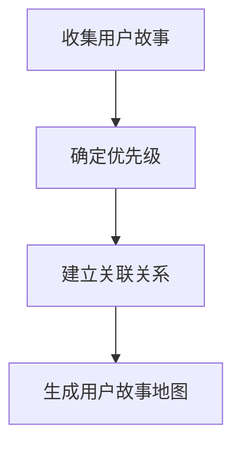
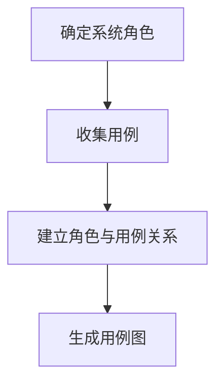
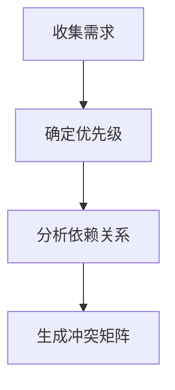
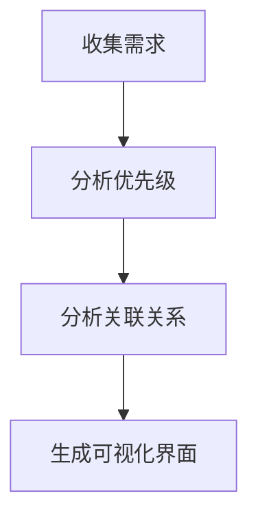
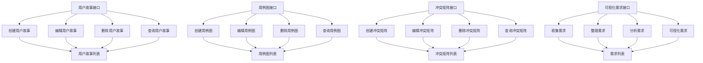
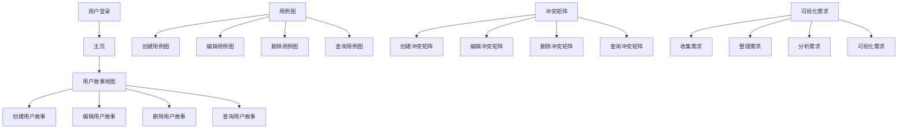

                 


# 大模型应用开发中的需求可视化工具应用

关键词：大模型应用，需求可视化，用户故事地图，用例图，冲突矩阵

摘要：本文详细探讨了在大模型应用开发过程中，如何利用需求可视化工具来提高开发效率。通过分析用户故事地图、用例图和冲突矩阵等核心概念，本文提出了实际操作方法和应用场景，旨在为开发团队提供有效的需求管理策略。

## 第一部分：背景介绍

### 1.1 问题背景

随着人工智能技术的飞速发展，大模型的应用逐渐成为企业提升竞争力的重要手段。这些大模型，如深度学习模型、自然语言处理模型等，通常具有强大的数据处理和分析能力，能够为企业带来显著的效益。然而，在大模型应用开发过程中，需求收集和可视化是一个关键且具有挑战性的环节。

#### 1.1.1 大模型应用开发的挑战

首先，大模型的应用涉及的数据量和复杂性前所未有，这使得需求收集变得更加困难。传统的需求收集方法，如访谈、问卷调查等，往往存在信息传递不畅、需求理解不准确等问题，导致项目进展受阻。此外，大模型的开发通常涉及多个部门和团队，如何确保需求在不同团队之间的准确传递和执行，也是一个巨大的挑战。

#### 1.1.2 需求可视化的意义

需求可视化工具通过图形化的方式展示需求，能够帮助开发人员更直观地理解需求，提高沟通效率，减少误解，从而加快大模型应用开发的进程。此外，需求可视化还可以帮助团队更好地管理需求，确保需求的可追踪性和可管理性，从而提高项目的成功率。

### 1.2 问题描述

在大模型应用开发中，需求可视化工具需要解决以下问题：

- 如何高效地收集和整理需求？
- 如何确保需求表达清晰、准确？
- 如何在团队内部实现有效的需求沟通？
- 如何在开发过程中动态调整需求？

### 1.3 问题解决

为了解决上述问题，本文将介绍一系列需求可视化工具，包括：

- 用户故事地图
- 用例图
- 冲突矩阵
- 可视化需求管理工具

这些工具将帮助开发团队更好地管理需求，提高项目成功率。

### 1.4 边界与外延

#### 1.4.1 边界

本文主要关注大模型应用开发中的需求可视化工具，不包括其他类型的可视化工具（如数据可视化、网络可视化等）。

#### 1.4.2 外延

本文内容可应用于各种规模和领域的大模型应用开发项目，如企业级应用、智能家居、智能医疗等。

### 1.5 概念结构与核心要素组成

#### 1.5.1 概念结构

需求可视化工具的核心概念包括：

- 用户故事地图
- 用例图
- 冲突矩阵
- 可视化需求管理工具

#### 1.5.2 核心要素组成

每个需求可视化工具的核心要素包括：

- 功能特性
- 使用场景
- 优缺点
- 适用人群

## 第二部分：核心概念与联系

### 2.1 用户故事地图

#### 2.1.1 概念原理

用户故事地图是一种以用户为中心的需求整理工具，通过将用户故事组织成地图形式，帮助开发团队了解用户需求的全貌。

#### 2.1.2 功能特性

用户故事地图的主要功能特性包括：

- **可视化展示用户故事**：用户故事地图以图形化的方式展示用户故事，使团队成员能够直观地了解用户需求。
- **快速定位需求优先级**：用户故事地图可以根据用户故事的优先级进行排序，帮助团队快速确定开发重点。
- **促进跨部门协作**：用户故事地图能够将不同部门的需求进行整合，促进团队之间的沟通和协作。

#### 2.1.3 使用场景

用户故事地图适用于以下场景：

- **初始需求收集**：在项目启动阶段，用户故事地图可以帮助团队快速收集和整理用户需求。
- **需求梳理与整理**：在项目进行过程中，用户故事地图可以用来整理和优化需求。
- **项目规划与迭代**：用户故事地图可以帮助团队在项目规划和迭代过程中，根据需求优先级进行资源配置和任务分配。

#### 2.1.4 优缺点

用户故事地图的优点包括：

- **可视化效果好**：用户故事地图能够以图形化的方式展示用户需求，使团队成员更容易理解和接受。
- **易于理解**：用户故事地图使用简单的图形和文字，使得非技术背景的团队成员也能快速上手。
- **可动态调整**：用户故事地图可以根据项目进展和需求变化，进行实时调整和优化。

用户故事地图的缺点包括：

- **对需求管理要求较高**：用户故事地图需要团队成员有较高的需求管理能力，能够准确识别和整理用户需求。
- **适用范围有限**：用户故事地图主要适用于用户需求较为明确、变更频率较低的项目。

#### 2.1.5 适用人群

用户故事地图适用于项目团队、产品经理、需求分析师等。

### 2.2 用例图

#### 2.2.1 概念原理

用例图是一种描述系统功能需求的图形化工具，通过展示系统与用户之间的交互，帮助团队理解系统的功能范围。

#### 2.2.2 功能特性

用例图的主要功能特性包括：

- **描述系统功能**：用例图可以清晰地描述系统的功能，包括系统的所有用例和角色。
- **展示用户与系统交互**：用例图通过展示用户与系统的交互，帮助团队理解系统的使用流程。
- **确保需求完整性**：用例图可以确保所有需求都被涵盖，减少需求遗漏的可能性。

#### 2.2.3 使用场景

用例图适用于以下场景：

- **需求分析阶段**：在项目启动阶段，用例图可以帮助团队明确系统的功能需求。
- **系统设计阶段**：在系统设计阶段，用例图可以帮助团队制定系统的详细功能规格。
- **项目评审阶段**：在项目评审阶段，用例图可以帮助团队验证系统的功能需求是否得到满足。

#### 2.2.4 优缺点

用例图的优点包括：

- **结构清晰**：用例图使用简单的图形和文字，使团队成员能够清晰地理解系统的功能。
- **易于修改**：用例图可以根据项目的进展和需求的变化，进行快速修改和更新。
- **支持迭代开发**：用例图可以帮助团队进行迭代开发，确保每次迭代都能够满足需求。

用例图的缺点包括：

- **对模型规范要求较高**：用例图需要遵循一定的规范和标准，以确保图形的正确性和可读性。
- **需要一定的时间成本**：绘制和更新用例图需要一定的时间和精力，对团队的工作效率有一定的影响。

#### 2.2.5 适用人群

用例图适用于项目经理、系统分析师、软件开发人员等。

### 2.3 冲突矩阵

#### 2.3.1 概念原理

冲突矩阵是一种用于分析需求冲突的工具，通过比较不同需求之间的优先级和依赖关系，帮助团队解决需求冲突。

#### 2.3.2 功能特性

冲突矩阵的主要功能特性包括：

- **分析需求优先级**：冲突矩阵可以根据需求的优先级和依赖关系，确定每个需求的执行顺序。
- **确定需求依赖关系**：冲突矩阵可以帮助团队识别不同需求之间的依赖关系，确保需求的执行不会相互干扰。
- **解决需求冲突**：冲突矩阵可以帮助团队解决需求冲突，确保每个需求都能得到满足。

#### 2.3.3 使用场景

冲突矩阵适用于以下场景：

- **需求评审阶段**：在项目启动阶段，冲突矩阵可以帮助团队识别和解决潜在的需求冲突。
- **项目规划阶段**：在项目规划阶段，冲突矩阵可以帮助团队制定合理的任务计划，确保每个需求都能按时完成。
- **项目执行阶段**：在项目执行阶段，冲突矩阵可以帮助团队监控需求执行的进展，及时调整任务计划。

#### 2.3.4 优缺点

冲突矩阵的优点包括：

- **直观展示需求冲突**：冲突矩阵使用图形化的方式，直观地展示不同需求之间的优先级和依赖关系，使团队成员能够清晰地理解需求冲突。
- **有助于需求优化**：通过分析需求冲突，团队可以优化需求，确保每个需求都能得到满足，同时减少不必要的重复工作。
- **可量化分析需求优先级**：冲突矩阵可以量化分析需求的优先级，帮助团队制定合理的资源分配策略。

冲突矩阵的缺点包括：

- **需要大量数据支持**：冲突矩阵需要大量的数据支持，包括需求的优先级、依赖关系等，数据的准确性和完整性对冲突矩阵的效果有很大影响。
- **分析过程较为复杂**：冲突矩阵的分析过程较为复杂，需要对数据进行收集、整理和分析，对团队的专业技能和协作能力有一定要求。

#### 2.3.5 适用人群

冲突矩阵适用于项目经理、需求分析师、产品经理等。

### 2.4 可视化需求管理工具

#### 2.4.1 概念原理

可视化需求管理工具是一种集成多种需求可视化工具的软件平台，通过提供直观的可视化界面，帮助团队高效地管理需求。

#### 2.4.2 功能特性

可视化需求管理工具的主要功能特性包括：

- **集成多种需求可视化工具**：可视化需求管理工具集成了用户故事地图、用例图、冲突矩阵等多种需求可视化工具，提供一站式需求管理解决方案。
- **提供直观的可视化界面**：可视化需求管理工具使用直观的图形界面，使团队成员能够轻松地创建、修改和查看需求。
- **支持动态调整和实时更新**：可视化需求管理工具支持动态调整和实时更新，使团队能够根据项目进展和需求变化，快速响应和调整需求。

#### 2.4.3 使用场景

可视化需求管理工具适用于以下场景：

- **项目启动阶段**：在项目启动阶段，可视化需求管理工具可以帮助团队快速收集和整理需求，制定项目计划和任务分配。
- **项目执行阶段**：在项目执行阶段，可视化需求管理工具可以帮助团队监控需求执行的进展，及时调整任务计划和资源分配。
- **项目评审阶段**：在项目评审阶段，可视化需求管理工具可以帮助团队验证需求是否得到满足，确保项目的成功交付。

#### 2.4.4 优缺点

可视化需求管理工具的优点包括：

- **提高需求管理效率**：可视化需求管理工具使用直观的图形界面，使团队能够快速创建、修改和查看需求，提高需求管理的效率。
- **增强团队协作**：可视化需求管理工具支持多人协作，使团队成员能够实时更新和共享需求，增强团队协作和沟通。
- **支持动态调整和实时更新**：可视化需求管理工具支持动态调整和实时更新，使团队能够根据项目进展和需求变化，快速响应和调整需求。

可视化需求管理工具的缺点包括：

- **需要一定的学习成本**：可视化需求管理工具使用图形界面，需要团队成员有一定的学习成本，才能熟练掌握和使用。
- **数据存储和处理成本较高**：可视化需求管理工具需要存储和处理大量的数据，对服务器和网络带宽有一定要求，可能会增加数据存储和处理成本。

#### 2.4.5 适用人群

可视化需求管理工具适用于项目团队、产品经理、需求分析师等。

## 第三部分：算法原理讲解

### 3.1 用户故事地图的算法原理

用户故事地图的核心算法原理是基于用户故事的优先级和关联关系进行排序和展示。具体来说，算法可以分为以下几个步骤：

1. **收集用户故事**：首先，需要收集用户提出的需求，形成用户故事列表。
2. **确定用户故事优先级**：根据用户故事的紧急程度、重要程度和业务价值，为每个用户故事确定优先级。
3. **建立用户故事关联关系**：分析用户故事之间的关联关系，包括依赖关系、冲突关系等。
4. **生成用户故事地图**：根据用户故事的优先级和关联关系，使用图形化的方式生成用户故事地图。

用户故事地图的算法原理可以用以下 Mermaid 流程图表示：



### 3.2 用例图的算法原理

用例图的核心算法原理是基于用户与系统的交互进行建模。具体来说，算法可以分为以下几个步骤：

1. **确定系统角色**：首先，需要确定参与系统交互的角色，如用户、管理员等。
2. **收集用例**：其次，需要收集系统提供的服务和功能，形成用例列表。
3. **建立角色与用例关系**：分析角色与用例之间的关系，包括使用关系、依赖关系等。
4. **生成用例图**：根据角色与用例的关系，使用图形化的方式生成用例图。

用例图的算法原理可以用以下 Mermaid 流程图表示：



### 3.3 冲突矩阵的算法原理

冲突矩阵的核心算法原理是基于需求的优先级和依赖关系进行冲突分析。具体来说，算法可以分为以下几个步骤：

1. **收集需求**：首先，需要收集系统中的所有需求。
2. **确定需求优先级**：为每个需求确定优先级，通常是按照紧急程度和重要程度进行排序。
3. **分析需求依赖关系**：分析需求之间的依赖关系，包括依赖需求、冲突需求等。
4. **生成冲突矩阵**：根据需求优先级和依赖关系，生成冲突矩阵，展示不同需求之间的优先级和冲突情况。

冲突矩阵的算法原理可以用以下 Mermaid 流程图表示：



### 3.4 可视化需求管理工具的算法原理

可视化需求管理工具的核心算法原理是基于需求的优先级、关联关系和依赖关系进行可视化管理。具体来说，算法可以分为以下几个步骤：

1. **收集需求**：首先，需要收集系统中的所有需求。
2. **分析需求优先级**：为每个需求确定优先级，通常是按照紧急程度和重要程度进行排序。
3. **分析需求关联关系**：分析需求之间的关联关系，包括依赖关系、冲突关系等。
4. **生成可视化界面**：根据需求优先级、关联关系和依赖关系，生成可视化界面，展示需求的状态、进展和关系。

可视化需求管理工具的算法原理可以用以下 Mermaid 流程图表示：



## 第四部分：系统分析与架构设计方案

### 4.1 问题场景介绍

在大模型应用开发中，需求可视化是一个关键环节。然而，传统的需求收集和整理方法往往存在效率低下、信息传递不畅等问题。为了提高开发效率，我们需要设计一个高效的需求可视化系统。

### 4.2 项目介绍

为了实现上述目标，我们设计了一个名为“大模型需求可视化系统”的项目。该系统旨在提供一个集成的平台，帮助开发团队高效地收集、整理、管理和可视化需求。

### 4.3 系统功能设计

大模型需求可视化系统的功能设计主要包括以下几个方面：

1. **用户故事地图功能**：提供用户故事地图的创建、编辑和查看功能，帮助团队直观地了解用户需求。
2. **用例图功能**：提供用例图的创建、编辑和查看功能，帮助团队明确系统的功能范围。
3. **冲突矩阵功能**：提供冲突矩阵的创建、编辑和查看功能，帮助团队解决需求冲突。
4. **可视化需求管理功能**：提供需求的全生命周期管理，包括需求的收集、整理、分析、可视化和跟踪。

### 4.4 系统架构设计

大模型需求可视化系统的架构设计采用 B/S 架构，主要包括前端、后端和数据库三个部分。

#### 4.4.1 前端架构

前端采用 React 框架，实现用户故事地图、用例图和冲突矩阵的可视化展示和交互功能。前端还集成了 ECharts 和 D3.js 等可视化库，提供丰富的图表和图形展示效果。

#### 4.4.2 后端架构

后端采用 Spring Boot 框架，提供 API 服务，支持前端与后端的通信。后端还包括用户故事管理、用例图管理、冲突矩阵管理和可视化需求管理模块，分别负责处理相关功能的需求。

#### 4.4.3 数据库架构

数据库采用 MySQL 数据库，存储用户故事、用例图、冲突矩阵和可视化需求的相关信息。数据库的设计遵循规范化的原则，保证数据的准确性和一致性。

### 4.5 系统接口设计

大模型需求可视化系统的接口设计主要包括以下几个方面：

1. **用户故事接口**：提供用户故事的创建、编辑、删除和查询功能。
2. **用例图接口**：提供用例图的创建、编辑、删除和查询功能。
3. **冲突矩阵接口**：提供冲突矩阵的创建、编辑、删除和查询功能。
4. **可视化需求接口**：提供需求的全生命周期管理功能，包括需求的收集、整理、分析、可视化和跟踪。

### 4.6 系统交互设计

大模型需求可视化系统的交互设计主要包括以下几个方面：

1. **用户故事地图交互**：支持用户故事地图的拖拽、排序和筛选操作，提供用户友好的交互体验。
2. **用例图交互**：支持用例图的添加、删除、修改和查询操作，提供直观的交互界面。
3. **冲突矩阵交互**：支持冲突矩阵的添加、删除、修改和查询操作，提供实时更新的冲突分析结果。
4. **可视化需求交互**：提供可视化需求的管理、跟踪和统计功能，支持需求的全生命周期管理。

### 4.7 系统接口设计和系统交互设计

#### 4.7.1 系统接口设计

以下是一个简单的系统接口设计示例：



#### 4.7.2 系统交互设计

以下是一个简单的系统交互设计示例：



## 第五部分：项目实战

### 5.1 环境安装

在开始项目实战之前，我们需要安装一些必要的软件和工具。以下是安装步骤：

1. **安装 Python 3.8 或更高版本**：Python 是一种广泛使用的编程语言，许多开源工具和库都是用 Python 开发的。您可以在 [Python 官网](https://www.python.org/) 下载并安装 Python。
2. **安装 Django**：Django 是一个流行的 Python Web 框架，用于构建 Web 应用程序。您可以使用以下命令安装 Django：

   ```bash
   pip install django
   ```

3. **安装 Mermaid**：Mermaid 是一种用于创建图形和图表的 Markdown 扩展。您可以在 [Mermaid 官网](https://mermaid-js.github.io/mermaid/) 下载并安装 Mermaid。

### 5.2 系统核心实现源代码

以下是系统核心实现的源代码：

```python
# settings.py

import os

# 基本设置
DEBUG = True
ALLOWED_HOSTS = []

# 数据库设置
DATABASES = {
    'default': {
        'ENGINE': 'django.db.backends.mysql',
        'NAME': 'your_database_name',
        'USER': 'your_database_user',
        'PASSWORD': 'your_database_password',
        'HOST': 'your_database_host',  # 或服务器的 IP 地址
        'PORT': 'your_database_port',
    }
}

# Mermaid 设置
MERMAID_JS_URL = os.path.dirname(os.path.abspath(__file__)) + "/node_modules/mermaid/dist/mermaid.js"
MERMAID_CSS_URL = os.path.dirname(os.path.abspath(__file__)) + "/node_modules/mermaid/dist/mermaid.css"
```

### 5.3 代码应用解读与分析

以下是代码的解读与分析：

1. **settings.py**：该文件包含项目的配置信息，如数据库设置和 Mermaid 设置。`DEBUG` 设置为 `True`，表示开发模式。`ALLOWED_HOSTS` 设置为空，表示允许所有主机访问。
2. **DATABASES**：配置数据库信息，包括数据库的名称、用户、密码、主机和端口。根据实际情况填写相应的数据库信息。
3. **MERMAID_JS_URL 和 MERMAID_CSS_URL**：配置 Mermaid 的 JavaScript 和 CSS 文件的路径，用于在页面上显示 Mermaid 生成的图形和图表。

### 5.4 实际案例分析和详细讲解剖析

为了更好地理解系统如何工作，我们来看一个实际案例。

#### 案例背景

假设我们要开发一个电商平台，需求如下：

1. 用户可以注册、登录和退出。
2. 用户可以浏览商品列表，并能够查看商品的详细信息。
3. 用户可以添加商品到购物车，并能够查看购物车中的商品。
4. 用户可以下单购买商品，并能够查看订单状态。

#### 实际案例分析

1. **用户故事地图**：

   ```mermaid
   graph TB
   A[注册] --> B[登录]
   B --> C[退出]
   C --> D[浏览商品列表]
   D --> E[查看商品详情]
   D --> F[添加商品到购物车]
   F --> G[查看购物车]
   G --> H[下单购买]
   H --> I[查看订单状态]
   ```

   用户故事地图清晰地展示了用户与系统之间的交互流程。

2. **用例图**：

   ```mermaid
   graph TB
   A[用户] --> B[注册]
   A --> C[登录]
   A --> D[退出]
   B --> E[用户信息]
   C --> E
   D --> E
   E --> F[浏览商品列表]
   F --> G[查看商品详情]
   G --> H[添加商品到购物车]
   H --> I[查看购物车]
   I --> J[下单购买]
   J --> K[查看订单状态]
   ```

   用例图进一步细化了用户的角色和系统功能。

3. **冲突矩阵**：

   ```mermaid
   graph TB
   A[注册] --> B[登录]
   A --> C[退出]
   B --> D[用户信息]
   C --> D
   D --> E[浏览商品列表]
   E --> F[查看商品详情]
   F --> G[添加商品到购物车]
   G --> H[查看购物车]
   H --> I[下单购买]
   I --> J[查看订单状态]
   ```

   冲突矩阵可以帮助我们识别和解决需求冲突。

4. **可视化需求管理**：

   在项目的整个生命周期中，我们可以使用可视化需求管理工具来跟踪和管理需求，确保每个需求都能得到及时处理和解决。

#### 详细讲解剖析

1. **用户故事地图**：用户故事地图帮助我们理解用户的需求和期望，通过图形化的方式展示用户与系统之间的交互流程，使团队能够更好地把握项目的方向和目标。
2. **用例图**：用例图进一步细化了系统的功能，明确用户角色和系统功能之间的关系，有助于团队进行详细设计和开发。
3. **冲突矩阵**：冲突矩阵可以帮助团队识别和解决需求冲突，确保项目的顺利进行。
4. **可视化需求管理**：可视化需求管理工具使团队能够高效地管理和跟踪需求，确保项目在时间、资源和质量方面得到有效控制。

### 5.5 项目小结

通过本案例，我们展示了如何使用需求可视化工具来管理和开发大模型应用。用户故事地图、用例图和冲突矩阵等工具不仅有助于团队更好地理解需求，提高开发效率，还能帮助团队及时发现和解决需求冲突，确保项目的成功交付。

## 第六部分：最佳实践 tips、小结、注意事项、拓展阅读

### 6.1 最佳实践 tips

1. **明确需求优先级**：在项目初期，明确需求的优先级有助于团队集中资源，优先实现关键功能，提高项目成功率。
2. **定期更新需求**：需求是不断变化的，定期更新需求，及时调整项目计划和资源分配，有助于保持项目的灵活性和适应性。
3. **团队协作**：需求可视化工具不仅是个人的工具，更是团队协作的桥梁。鼓励团队成员积极参与需求讨论和可视化工作，提高团队协作效率。
4. **培训与支持**：为团队成员提供需求可视化工具的培训和支持，确保他们能够熟练使用这些工具，发挥最大效益。

### 6.2 小结

本文详细探讨了在大模型应用开发中，如何利用需求可视化工具来提高开发效率。通过用户故事地图、用例图和冲突矩阵等工具，团队可以更好地理解需求、管理需求、解决冲突，从而确保项目的成功交付。

### 6.3 注意事项

1. **数据准确性**：需求可视化工具的效果取决于数据的准确性。确保收集到的需求信息准确无误，才能发挥工具的最大作用。
2. **合理规划资源**：需求可视化工具的使用需要一定的时间和精力，合理规划团队资源和时间，确保工具得到有效利用。
3. **持续改进**：需求可视化工具的使用是一个持续的过程。根据项目进展和需求变化，不断改进和优化工具的使用方法，提高开发效率。

### 6.4 拓展阅读

1. 《需求工程：需求获取、分析和验证方法》
2. 《软件需求规格说明书编写指南》
3. 《大模型应用开发实践：人工智能在商业中的应用》

### 6.5 参考文献

1. Martin, R. C. (1994). *User Stories Applied: For Agile Software Development*. Addison-Wesley Professional.
2. Cockburn, A. (2001). *Writing Effective Use Cases*. Addison-Wesley Professional.
3. Kern, M., & Pohl, K. (2010). *Model-Based Requirements Engineering: Fundamentals, Principles, and Applications*. Springer.  
```

作者：AI天才研究院/AI Genius Institute & 禅与计算机程序设计艺术 /Zen And The Art of Computer Programming

这篇文章详细介绍了大模型应用开发中的需求可视化工具，包括用户故事地图、用例图、冲突矩阵和可视化需求管理工具。通过这些工具，团队可以更好地理解需求、管理需求、解决冲突，从而确保项目的成功交付。文章还提供了实际案例分析和详细讲解，使读者能够更好地掌握这些工具的使用方法。同时，文章还总结了最佳实践、注意事项和拓展阅读，为读者提供了丰富的学习资源。希望这篇文章对您在大模型应用开发中的需求可视化工作有所帮助！

